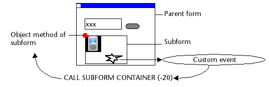

---
id: call-subform-container
title: CALL SUBFORM CONTAINER
slug: /commands/call-subform-container
displayed_sidebar: docs
---

<!--REF #_command_.CALL SUBFORM CONTAINER.Syntax-->**CALL SUBFORM CONTAINER** ( *evento* : Integer )<!-- END REF-->
<!--REF #_command_.CALL SUBFORM CONTAINER.Params-->

| Parámetro | Tipo |  | Descripción |
| --- | --- | --- | --- |
| evento | Integer | &#8594; | Evento a enviar |

<!-- END REF-->

Historial

|Versión|Cambios|
|---|---|
|12|Creado por|

## Descripción 

<!--REF #_command_.CALL SUBFORM CONTAINER.Summary-->El comando **CALL SUBFORM CONTAINER** permite a una instancia de subformulario enviar el *evento* al objeto subformulario que lo contiene.<!-- END REF--> El objeto subformulario puede entonces procesar el *evento* en el contexto del formulario padre. 

Este comando debe ubicarse en el método de formulario del subformulario o en el método de objeto de uno de los objetos de subformulario. El evento sólo se recibirá en el método de objeto del contenedor del subformulario. 

En *evento*, puede pasar uno de los [eventos de formulario 4D soportado por subformularios](../../FormObjects/subform_overview.md#call-subform-container-command) o todo valor correspondiente a un evento personalizado. En el primer caso, el evento debe ser seleccionado para el subformulario. En el caso de un evento personalizado, se recomienda pasar un valor negativo en *evento* para evitar el riesgo de interferir con los números de eventos existentes o futuros de 4D.

*Ejemplo de ejecución del comando* **CALL SUBFORM CONTAINER** *:*

## Ver también 

[Form event code](../commands/form-event-code)  
[GOTO OBJECT](../commands/goto-object)  

## Propiedades

|  |  |
| --- | --- |
| Número de comando | 1086 |
| Hilo seguro | no |

