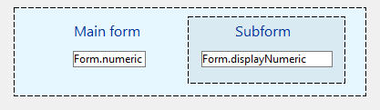

---
id: object-get-subform-container-value
title: OBJECT Get subform container value
slug: /commands/object-get-subform-container-value
displayed_sidebar: docs
---

<!--REF #_command_.OBJECT Get subform container value.Syntax-->**OBJECT Get subform container value**  : any<!-- END REF-->
<!--REF #_command_.OBJECT Get subform container value.Params-->
<div class="no-index">

| Parámetro | Tipo |  | Descripción |
| --- | --- | --- | --- |
| Resultado | any | &#8592; | Valor actual de la fuente de datos del contenedor de subformulario |
</div>
<!-- END REF-->

<div class="no-index">
<details><summary>Historial</summary>

|Versión|Cambios|
|---|---|
|19 R5|Creado por|

</details>
</div>

## Descripción 

<!--REF #_command_.OBJECT Get subform container value.Summary-->El comando **OBJECT Get subform container value** devuelve el valor actual de la fuente de datos vinculada al contenedor de subformulario mostrado en el formulario padre.<!-- END REF-->

Este comando solo puede utilizarse en el contexto de un formulario utilizado como subformulario. En cualquier otro contexto, devuelve **Undefined**.

* Si la fuente de datos es una expresión, el comando devuelve el valor actual de la expresión, evaluada desde el último ciclo de evento de formulario.
* Si la fuente de datos es un array, el comando devuelve el índice del array (entero).

Para más información sobre las variables vinculadas y la interacción formulario/subformulario, consulte *Managing the bound variable* en developer.4d.com.

## Ejemplo 

Dado un formulario principal y un subformulario que tienen ambos un objeto de formulario de entrada: 



Dentro del formulario principal, el objeto de entrada y el objeto Subformulario están vinculados a la expresión *Form.numeric* de tipo Numérico.

El objeto de entrada del formulario principal y el objeto de entrada del subformulario tienen ambos la propiedad *On Data Change* definida a través de la Lista de propiedades.

El método formulario del subformulario contiene el siguiente código: 

```4d
 If(Form event code=On bound variable change)
    Form.displayNumeric:=OBJECT Get subform container value
 End if
```

Y dentro del subformulario, el método objeto del texto de entrada contiene el siguiente código: 

```4d
 OBJECT SET SUBFORM CONTAINER VALUE(Form.displayNumeric)
```

Como resultado, en tiempo de ejecución, actualizar el valor del objeto de entrada del formulario principal también actualiza el valor del objeto de entrada del subformulario, y viceversa.

## Ver también 

[Form](../commands/form)  
[OBJECT Get pointer](../commands/object-get-pointer)  
[OBJECT SET SUBFORM CONTAINER VALUE](../commands/object-set-subform-container-value)  

## Propiedades

|  |  |
| --- | --- |
| Número de comando | 1785 |
| Hilo seguro | no |


