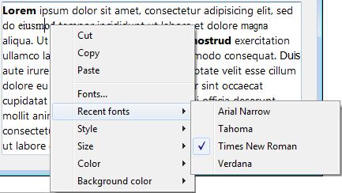
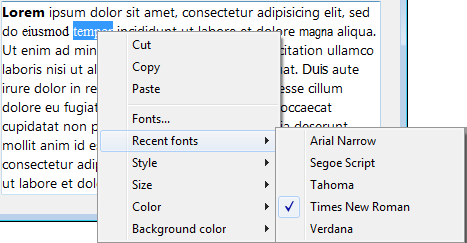

---
id: set-recent-fonts
title: SET RECENT FONTS
slug: /commands/set-recent-fonts
displayed_sidebar: docs
---

<!--REF #_command_.SET RECENT FONTS.Syntax-->**SET RECENT FONTS** ( *arrayFuentes* : Text array )<!-- END REF-->
<!--REF #_command_.SET RECENT FONTS.Params-->
<div class="no-index">

| Parámetro | Tipo |  | Descripción |
| --- | --- | --- | --- |
| arrayFuentes | Text array | &#8594; | Array de nombres de fuentes |
</div>
<!-- END REF-->

<div class="no-index">
<details><summary>Historial</summary>

|Versión|Cambios|
|---|---|
|14|Creado por|

</details>
</div>

## Descripción 

<!--REF #_command_.SET RECENT FONTS.Summary-->El comando **SET RECENT FONTS** modifica la lista de fuentes recientes que aparecen en el menú contextual de las "fuentes recientes" .<!-- END REF-->  
  
Este menú contiene los nombres de las últimas fuentes seleccionadas durante la sesión. Se utiliza, en particular, para áreas *Interacción de comandos genéricos con textos multiestilos*.

## Ejemplo 

Usted quiere añadir una fuetne al menú de fuentes recientes:



Ejecuta el siguiente código:

```4d
 ARRAY TEXT($arrRecent;0)
 FONT LIST($arrRecent;2)
 APPEND TO ARRAY($arrRecent;"Segoe Script")
 APPEND TO ARRAY($arrRecent)
```

Luego el menú contiene:



## Ver también 

[FONT LIST](../commands/font-list)  

## Propiedades

|  |  |
| --- | --- |
| Número de comando | 1305 |
| Hilo seguro | no |


