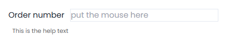
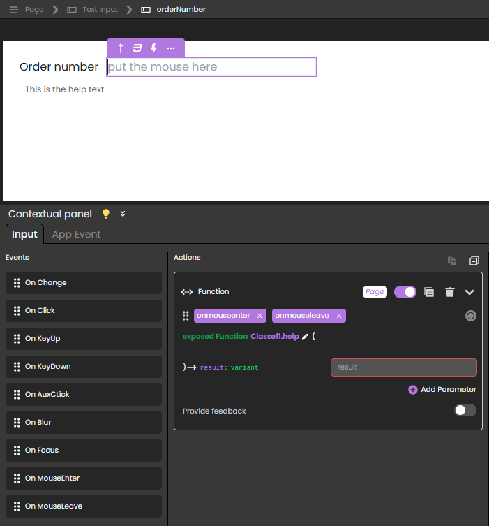
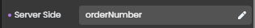
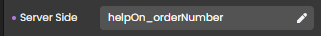

---
id: web-event
title: Web Event
slug: /commands/web-event
displayed_sidebar: docs
---

<!-- REF #_command_.Web Event.Syntax -->**Web Event** : object<!-- END REF -->

<!-- REF #_command_.Web Event.Params -->

<div class="no-index">

| Parámetros | Tipo   |                             | Descripción                          |
| ---------- | ------ | :-------------------------: | ------------------------------------ |
| Resultado  | Object | &#8592; | Información sobre el evento activado |

</div>
<!-- END REF -->

<div class="no-index">
<details><summary>Historia</summary>

| Lanzamiento | Modificaciones |
| ----------- | -------------- |
| 21          | Añadidos       |

</details>
</div>

## Descripción

`Web Event` <!-- REF #_command_.Web Event.Summary -->devuelve un objeto con información sobre un evento desencadenado vinculado a un componente de página web<!-- END REF -->.

El comando debe ser llamado en el contexto de una página web manejada por el servidor web de 4D.

**Resultado**

El objeto devuelto contiene las siguientes propiedades:

| Propiedad |       | Tipo   | Descripción                                                                                                                                                                                                                                                     |
| --------- | ----- | ------ | --------------------------------------------------------------------------------------------------------------------------------------------------------------------------------------------------------------------------------------------------------------- |
| caller    |       | string | [Referencia servidor](https://developer.4d.com/qodly/4DQodlyPro/pageLoaders/pageLoaderOverview#data-access-category) del componente que desencadena el evento                                                                                                   |
| eventType |       | string | Tipo de evento:<li>onblur</li><li>onfocus</li><li>onclick</li><li>onauxclick</li><li>onmouseenter</li><li>onmouseleave</li><li>onkeyup</li><li>onkeydown</li><li>onchange</li><li>unload</li><li>onload - se activa cuando `Page` se carga</li> |
| data      |       | object | Información adicional en función del componente implicado                                                                                                                                                                                                       |
|           | index | number | <li>Componente Pestañas: índice de la pestaña (la indexación comienza en 0)</li><li>Componente de la tabla de datos: número de columna</li>                                                                                                                     |
|           | row   | number | Componente de la tabla de datos: número de línea                                                                                                                                                                                                |
|           | name  | string | Componente Data Table: nombre qodlysource de la columna (por ejemplo, "firstname", "address.city")                                                                                                           |

#### Ejemplo

El objetivo es mostrar/ocultar un texto de ayuda cuando el usuario pasa el ratón sobre el componente:



Esto se hace adjuntando los eventos `onmouseenter` y `onmouseleave` a un componente **Text input** que muestra la información almacenada en un componente **Text** (mostrando "This is the help text").



En este escenario:

- El componente Text input tiene `orderNumber` como referencia servidor.
  
- El componente Texto tiene `helpOn_orderNumber` como referencia del lado Servidor.
  
- La función [exposed](../../ORDA/ordaClasses.md#exposed-vs-non-exposed-functions) `help()` se adjunta a los eventos `onmouseenter` y `onmouseleave` y contiene el siguiente código:

```4d
shared singleton Class constructor()
exposed Function help()
	
	var event : Object
	var myForm : 4D.WebForm
	var componentRef : Text
	
	myForm:=web Form
	event:=web Event
	componentRef:=event.caller

	Case of 
		: (event.eventType="onmouseenter") // el evento es onmouseenter 
			myForm["helpOn_"+componentRef].show() // mostrar la ayuda en "orderNumber" mostrando  
			// el componente texto con referencia "helpOn_orderNumber" 
		: (event.eventType="onmouseleave") // el evento es onmouseleave 
			myForm["helpOn_"+componentRef].hide() // ocultar la ayuda sobre orderNumber
			
	End case 

```

Para abrir la página web con la ayuda de `orderNumber` oculta, puede asociar esta función al evento `onload` de la página web:

```4d
exposed function hideOnLoad()
	webForm.helpOn_orderNumber.hide()

```

## Ver también

[Web Form](../commands/web-form)</br>
[WebForm class](../../API/WebFormClass.md)</br>
[WebFormItem class](../../API/WebFormItemClass.md)

## Propiedades

|                   |      |
| ----------------- | ---- |
| Número de comando | 1734 |
| Hilo seguro       | no   |

