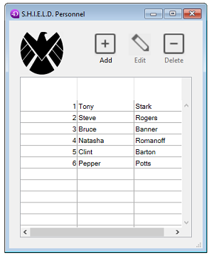

---
id: open-form-window
title: Open form window
slug: /commands/open-form-window
displayed_sidebar: docs
toc_max_heading_level: 3
---

<!--REF #_command_.Open form window.Syntax-->**Open form window** ( {*aTable* : Table ;} *formName* : Text, Object {; *type* : Integer {; *hPos* : Integer {; *vPos* : Integer}}}{; *} ) : Integer<!-- END REF-->

<!--REF #_command_.Open form window.Params-->

<div class="no-index">

| Parámetros | Tipo         |                             | Descripción                                                                                                                                                                                 |
| ---------- | ------------ | --------------------------- | ------------------------------------------------------------------------------------------------------------------------------------------------------------------------------------------- |
| aTable     | Tabla        | &#8594; | Tabla del formulario o Tabla por defecto, si se omite                                                                                                                                       |
| formName   | Text, Object | &#8594; | Name (string) of table or project form, or a POSIX path (string) to a .json file describing the form, oran object describing the form |
| type       | Integer      | &#8594; | Tipo de ventana                                                                                                                                                                             |
| hPos       | Integer      | &#8594; | Horizontal position of the window                                                                                                                                                           |
| vPos       | Integer      | &#8594; | Posición vertical de la ventana                                                                                                                                                             |
| \*         | Operador     | &#8594; | Guardar la posición y el tamaño actuales de la ventana                                                                                                                                      |
| Resultado  | Integer      | &#8592; | Número de referencia de la ventana                                                                                                                                                          |

</div>
<!-- END REF-->

<div class="no-index">
<details><summary>Historia</summary>

| Lanzamiento                 | Modificaciones |
| --------------------------- | -------------- |
| 16 R6                       | Modificado     |
| 16 R4                       | Modificado     |
| 14 R5                       | Modificado     |
| 11 SQL                      | Modificado     |
| <6 | Añadidos       |

</details>
</div>

## Descripción

<!--REF #_command_.Open form window.Summary-->The Open form window command opens a new window using the size and resizing properties of the form *formName*.<!-- END REF-->

**Nota:** para conocer las principales propiedades de un formulario, utilice el comando [FORM GET PROPERTIES\`](../commands/form-get-properties).

In the *formName* parameter, you can pass:

- el nombre de un formulario (formulario proyecto o formulario tabla) a utilizar;
- la ruta (en sintaxis POSIX) a un archivo .json válido que contenga una descripción del formulario a utilizar. See *Form file path*;
- un objeto que contiene la descripción del formulario a utilizar.

*formName* no se muestra en la ventana. If you want to display the form, you have to call a command which loads a form ([`ADD RECORD`](../commands/add-record) for example).

The optional *type* parameter allows you to specify a type for the window. You must pass one of the following predefined constants (integer, placed in the *Open Form Window* theme):

| Constante                        | Valor  |
| -------------------------------- | ------ |
| Controller form window           | 133056 |
| Form has full screen mode Mac    | 65536  |
| Form has no menu bar             | 2048   |
| Modal form dialog box            | 1      |
| Movable form dialog box          | 5      |
| Movable form dialog box no title | 524293 |
| Palette form window              | 1984   |
| Plain form window                | 8      |
| Plain form window no title       | 524296 |
| Pop up form window               | 32     |
| Sheet form window                | 33     |
| Toolbar form window              | 35     |

For a description of window types, see [**Window types**](#window-types) below.

:::note

The `Form has full screen mode Mac` and `Form has no menu bar` constants must be added to one of the other type constants.

:::

By default, if the *type* parameter is not passed, a window of the [Plain form window](#plain-form-window-plain-form-window-no-title) type is opened.

El parámetro opcional *hPos* permite definir la posición horizontal de la ventana. You can pass a defined position in pixels or one of the following constants:

| Constante             | Tipo    | Valor  |
| --------------------- | ------- | ------ |
| Horizontally centered | Integer | 65536  |
| On the left           | Integer | 131072 |
| On the right          | Integer | 196608 |

The optional parameter *vPos* allows you to define the vertical position of the window. You can pass a defined position in pixels or one of the following constants:

| Constante           | Tipo    | Valor  |
| ------------------- | ------- | ------ |
| At the bottom       | Integer | 393216 |
| At the top          | Integer | 327680 |
| Vertically centered | Integer | 262144 |

These parameters are expressed relative to the top left corner of the contents area of the application window (Windows MDI mode) or to the main screen (macOS and Windows SDI mode). They take into account the presence of the tool bar and menu bar.

If you pass the optional parameter *\**, the current position and size of the window are memorized when closed. Cuando se vuelve a abrir la ventana, se respetan su posición y tamaño anteriores. In this case, the *vPos* and *hPos* parameters are only used the first time the window is opened.

### Tipos de ventanas {#window-types}

#### Controller form window {#controller-form-window}

This type of window is similar to the `Palette form window` with the following specificity: on Windows, the floating window will be referenced by an icon in the task bar (on Windows, regular floating palettes are not displayed in the task bar). Este tipo de ventana es útil cuando el proyecto se ejecuta en [Modo SDI en Windows](../../Menus/sdi.md). En este modo, las paletas flotantes se ocultan cuando su aplicación principal pasa a segundo plano. Thus, if your database interface is based upon a single floating window (for example to display a monitor view), you need to use a `Controller form window` to reference the application in the task bar and make sure it will remain reachable even if it has been moved to the background.

Por ejemplo:

```4d
var $win:=Open form window("myMonitor";Controller form window;On the left;Vertically centered)
```

:::note

En macOS, este tipo de ventana se comporta como una ventana normal [`Palette form window`](#palette-form-window).

:::

#### Form has full screen mode Mac {#form-has-full-screen-mode-mac}

The "full screen" option is available under macOS for document type windows. When this option is used, a "Full screen" button is displayed in the window. When the user clicks on this icon, the window switches to full screen and 4D automatically hides the main tool bar. Para utilizar esta opción, basta con añadir la constante `Form has full screen mode Mac` al parámetro *type*. For example, this code creates a form window with a full-screen button under macOS:

```4d
var $win:=Open form window([Interface];"User_Choice";Plain form window+Form has full screen mode Mac)
DIALOG([Interface];"User_Choice")
```

:::note

Under Windows, this option has no effect.

:::

#### El formulario no tiene barra de menú {#form-has-no-menu-bar}

Esta opción está pensada para su uso cuando el proyecto se ejecuta en [Modo SDI en Windows](../../Menus/sdi.md). In this context, all windows of your application display by default the current process menu bar. If you want to open a window without menu bar, you need to add the `Form has no menu bar` constant to the *type* parameter. Por ejemplo, este código crea una ventana de formulario simple sin barra de menú en una aplicación IDE en Windows:

```4d
var $win:=Open form window("myPanel";Plain form window+Form has no menu bar;Horizontally centered;At the top)
```

:::note

This option has no effect:

- en una aplicación macOS,
- in a Windows application in MDI mode.

:::

#### Modal form dialog box, Movable form dialog box, Movable form dialog box no title

These types open **modal windows**. Una ventana modal coloca al usuario en un estado (o "modo") en el que sólo puede actuar dentro de esta ventana. As long as the modal window is displayed, the menu commands and other application windows are inaccessible. To close a modal window, the user must either validate it, cancel it, or choose one of the options it offers. Warning dialog boxes are a typical example of modal windows.

:::note

Una ventana modal siempre permanece en el primer plano. Como consecuencia, cuando una ventana modal llama a una ventana no modal, esta última se muestra en segundo plano, aunque haya sido llamada con posterioridad a la ventana modal. Por lo tanto, debe evitar este tipo de operación. On the other hand, when a modal window calls another modal window, this latter window will be displayed in the foreground.

:::

These window types have the following properties:

| Propiedad                            | Modal form dialog box | Movable form dialog box | Movable form dialog box no title |
| ------------------------------------ | --------------------- | ----------------------- | -------------------------------- |
| Can have a title                     | No                    | Sí                      | No                               |
| Can have a close box or equivalent   | No                    | Sí                      | Sí                               |
| Redimensionable                      | No                    | Sí                      | Sí                               |
| Can be minimized/maximized or zoomed | No                    | Sí                      | Sí                               |
| Suitable for scroll bars             | No                    | No                      | No                               |
| Modal                                | Sí                    | Sí, pero puede moverse  | Sí, pero puede moverse           |

**Uso**: `DIALOG`, `ADD RECORD(...;...*)` o equivalente.

#### Palette form window {#palette-form-window}

This type of window allows you to generate floating windows. The main characteristic of floating windows is that they remain in the foreground even if the user clicks on another window of the process. Floating windows are generally used to display permanent information or tool bars.

#### Plain form window, Plain form window no title

These window types have the following properties:

| Propiedad                            | Plain form window | Plain form window no title |
| ------------------------------------ | ----------------- | -------------------------- |
| Can have a title                     | Sí                | No                         |
| Can have a close box or equivalent   | Sí                | Sí                         |
| Redimensionable                      | Sí                | Sí                         |
| Can be minimized/maximized or zoomed | Sí                | Sí                         |
| Suitable for scroll bars             | Sí                | Sí                         |
| Modal                                | No                | No                         |

**Usage**: Data entry with scrollbars, `DISPLAY SELECTION`, `MODIFY SELECTION`, etc.

#### Pop up form window {#pop-up-form-window}

This type of window features the following advanced specifics:

- The window cannot have a close box but is automatically closed and the "cancel" event is passed to the window when:
  - a click occurs outside the window;
  - the background window or the MDI (Multiple Document Interface) window is moved;
  - the user hits the **Escape** key.
- Esta ventana se muestra delante de su ventana "padre" (no debe utilizarse como ventana principal del proceso). The background window is not disabled. Sin embargo, ya no recibe eventos.
- You cannot resize or move the window using the mouse; however, when performing these actions programmatically, the redraw of background items is optimized.
- Limitaciones:
  - It is not possible to display pop-up menu objects inside this type of window.
  - This type of window does not permit the display of help tips under macOS.

**Usage**: This type of window is primarily used to generate pop-up menus related to buttons such as [toolbar buttons](../../FormObjects/button_overview.md#toolbar).

#### Sheet form window {#sheet-form-window}

Sheet windows are specific to macOS. These windows are displayed above the main window. They are automatically centered in the main window. Their properties are comparable to those of the modal dialog boxes. They are generally used to perform an action directly relating to the action occurring in the primary window.

- You can only create a sheet window under macOS if the last open window is visible and a document type (form).
- The command opens a type `Modal form dialog box` window instead:
  - if the last opened window is not visible or is not a document type,
  - en Windows.
- Since a sheet window must be drawn above a form, its display is pushed back in the [`On Load` event](../../Events/onLoad.md) of the first form loaded in the window ([see example 3](#example-3)).

**Uso**: `DIALOG`, `ADD RECORD(...;...*)` o equivalente, en macOS (no estándar en Windows).

#### Toolbar form window {#toolbar-form-window}

A toolbar form window is created with the location, size and graphical properties of a toolbar, i.e.:

- The window will always be displayed just under the menu bar.
- The window's horizontal size will be automatically adjusted to fill all available horizontal space on the desktop (on macOS) or inside 4D's application window (on Windows in MDI mode). The window's vertical size is based on the form properties like all other form window types.
- The window has no border, cannot be moved and cannot be resized manually.
- It is not possible to create two different toolbar windows at the same time in the same process (otherwise error -10613, "Cannot create two form windows of type toolbar" is generated).

:::note Toolbar form windows and macOS full screen mode

If your application displays both a toolbar window and standard windows that support [`Form has full screen mode Mac`](#form-has-full-screen-mode-mac) option, interface rules require that you hide the toolbar when a standard window enters full screen mode. To know if a window has switched to full screen mode, just test whether its vertical size is exactly the same as the screen's height (see the [`HIDE TOOL BAR`](../commands/hide-tool-bar) command).

:::

### Close box

Windows of the `Movable form dialog box`, `Plain form window`, and `Palette form window` types have a close box. No method is associated to the window's close box. Al hacer clic en esta caja de cierre se cancela y se cierra la ventana, excepto si el evento [`On Close Box`](../../Events/onCloseBox.md) ha sido activado para el formulario. In this case, the code associated with this event will be executed.

### Size control

If "Window Size" properties of the *formName* are not set to "fixed", the opened window can be resized by the user. A zoom box can be available,depending on the window type. Si la propiedad **Ancho fijo** y/o **Alto fijo** está marcada en las propiedades del formulario, la ventana no será redimensionable.

**Note:** Some attributes (grow box, close box...) of the window created depend on the interface specifications of the operating system for the chosen *type*. It is therefore possible to obtain different results depending on the platform used.

## Ejemplo 1

The following statement opens a standard window with a close box and automatically adjusts it to be the same size as the "Input" form. The form window size is not set to "fixed", then the window also has a grow and a zoom box:

```4d
var $winRef:=Open form window([Table1];"Enter")
```

## Ejemplo 2

The following statement opens a floating palette in the upper left portion of the screen based on a project form named "Tools". Esta paleta utiliza la última posición en la que se encontraba cuando el usuario la cerró cada vez que se vuelve a abrir:

```4d
var $winRef:=Open form window("Tools";Palette form window;On the left;At the top;*)
```

## Ejemplo 3

This code must be called on macOS while a document window is displayed, for example from a form button, to display a sheet window:

```4d
var $myWin:=Open form window("sheet form";Sheet form window)
  // For the moment, the window is created but remains hidden
DIALOG([aTable];"dialForm")
  //The On Load event is generated then the sheet window is displayed; 
  //it "drops down" from the bottom of the title bar
```

## Ejemplo 4

El siguiente ejemplo utiliza la ruta a un formulario .json para mostrar los registros de una lista de empleados:

```4d
var $myWin : Integer 
$myWin :=Open form window("/RESOURCES/OutputPersonnel.json";Plain form window)
ALL RECORDS([Personnel])
DIALOG("/RESOURCES/OutputPersonnel.json";*)
```

que muestra:



## Ver también

[FORM GET PROPERTIES](../commands/form-get-properties)  
[Open window](../commands/open-window)

## Propiedades

|                   |     |
| ----------------- | --- |
| Número de comando | 675 |
| Hilo seguro       | no  |


