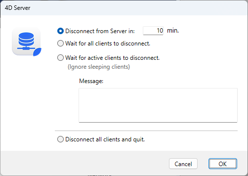

Para apagar el servidor:

1. Seleccione el comando **Salir** en el menú **Archivo** de 4D Server (Windows) o en el menú **4D Server** (macOS).

La ventana siguiente se muestra en la máquina servidor:

2. Introduzca el número de minutos tras los cuales desea que se apague el servidor, o seleccione una opción de desconexión de los clientes.

En cuanto haga esto, ningún cliente nuevo podrá conectarse al servidor.

Las siguientes opciones están disponibles:

- **Desconectar el servidor en XX min.**

Transcurrido el tiempo especificado, el servidor se cierra y todos los usuarios quedan desconectados, incluidos los clientes que se encuentren en modo de suspensión. La siguiente ventana aparece en el servidor:

Aparecerá una ventana idéntica en cada máquina 4D remota. Esta ventana se repite o se actualiza en cada ordenador cliente cada 20 segundos aproximadamente, con el fin de pedirles que cierren la aplicación. Cuando se alcanza el límite de tiempo, el servidor se cierra incluso si aún hay máquinas cliente conectadas.

- **Espere a que todos los clientes se desconecten.**

El servidor solo se cerrará una vez que todos los clientes, incluidos los que estén en modo de suspensión, se hayan desconectado. This option could be inappropriate for maintenance operations run during lunch time, for instance, since there are likely to be clients in [sleep mode](../ServerWindow/users.md#managing-sleeping-users).

- **Wait for active clients to disconnect. (Ignore sleeping clients)**

The server will only quit after all active clients have disconnected (in other words, all client machines that are not in [sleep mode](../ServerWindow/users.md#managing-sleeping-users)). With this option, any clients in sleep mode are not considered as connected. Use this option if you want to perform maintenance operations during lunch time, for example. When this option is used, any clients in sleep mode will have a connection error when they wake up.

:::note

A *sleeping client* refers to a remote 4D application on a machine that has switched to [sleep mode](../ServerWindow/users.md#managing-sleeping-users) while the connection to the server machine was still active.

:::

When you choose one of these options, the following window appears, which indicates the number of clients that are still connected:

On each 4D client machine, the following window appears displaying a default message:

If you entered a custom message in the 4D Server shutdown dialog box, it is displayed instead of the default message on each client machine. Por ejemplo:

- **Disconnect all clients and quit**

The server ends all processes and all connections and quits after a few seconds.

:::note Notas

- In all cases, if no client is connected to the server when the shutting down window is validated, 4D Server quits immediately.
- If you click **Cancel** in the 4D Server shutdown window, the process of shutting down the server is canceled.
- You can close the database (and disconnect the clients) without quitting the 4D Server using the **Close project...** menu command.

:::