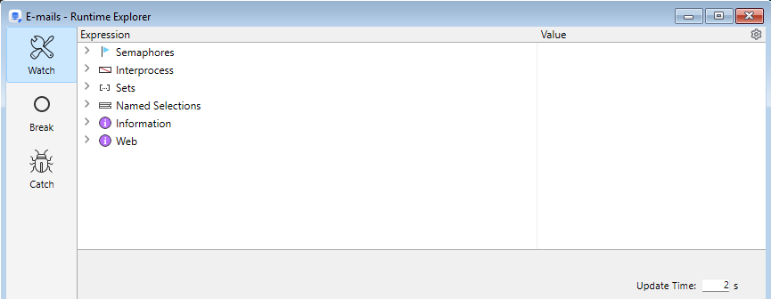

La interfaz de la aplicación 4D Server está compuesta por los siguientes menús: **Archivo**, **Edición**, **Ventana**, **Ayuda**. En macOS, algunos comandos se encuentran en el menú **4D Server** (menú aplicación).

## File

### New

Este comando jerárquico cuenta con submenús que se pueden utilizar para [crear un proyecto](../GettingStarted/creating.md#creating-a-project) o un nuevo archivo de datos en la máquina servidor.

### Abrir.../Abrir Reciente

Estos comandos se pueden utilizar para [abrir un proyecto con 4D Server](../Desktop/clientServer.md#opening-a-remote-project). El comando **Abrir recientes>** muestra un submenú con la lista de proyectos que 4D Server ha abierto recientemente. Para restablecer este menú, seleccione el comando **Limpiar menú**.

### Cerrar el proyecto...

Este comando cierra el proyecto actual sin salir de la aplicación 4D Server. Al seleccionar este comando, aparece el cuadro de diálogo de apagado del servidor para que pueda [definir el modo de desconexión](../server/exit.md) de los clientes que estén conectados.

### Cerrar ventana

Este comando cierra la ventana que se encuentra en primer plano en la aplicación 4D Server.

### Cerrar todas las ventanas

Este comando cierra todas las ventanas de la aplicación 4D Server. Tenga en cuenta que, en este caso, solo el hecho de que el comando **Cerrar el proyecto...** esté habilitado en el menú **Archivo** indicará si el proyecto sigue publicado.

### Registrar la aplicación actual como un servicio / Anular el registro de la aplicación actual / Anular el registro de todos los servicios del servidor

(Comandos disponibles en Windows) Estos comandos permiten gestionar el [registro de la aplicación como servicio](./service.md).

### Vaciar los búferes de datos

Este comando se puede utilizar para "forzar" el guardado de los datos de la caché en el disco. Por defecto, 4D Server vacía automáticamente la caché transcurrido el [límite de tiempo establecido en la configuración](../settings/database.md#database-cache-settings).

### Copia de seguridad

Este comando permite iniciar una copia de seguridad del proyecto en cualquier momento. Al seleccionar este comando, aparece el siguiente cuadro de diálogo:

- El botón **Copia de seguridad** inicia inmediatamente una copia de seguridad que tiene en cuenta las [opciones definidas en la Configuración](../settings/backup.md) de la aplicación (archivos incluidos en la copia de seguridad, ubicación de los archivos, número de conjuntos que se conservan, etc.).
- El botón **Propiedades de la base de datos** abre la [sección Copia de seguridad de la configuración](../settings/backup.md), que le permite ver y, si es necesario, modificar los parámetros actuales de la copia de seguridad.
- El botón **Cancelar** interrumpe el proceso de copia de seguridad.

### Restore...

Este comando muestra un cuadro de diálogo para abrir un archivo, de modo que pueda seleccionar la copia de seguridad que desea restaurar.

### Salir

Este comando le permite [cerrar la aplicación 4D Server](./exit.md).

:::note

Bajo macOS, el comando **Salir** se encuentra en el menú **4D Server** (menú aplicación).

:::

## Acción de edición

El menú **Edición** de 4D Server incluye los comandos clásicos de copiar/pegar, el comando **Mostrar el portapapeles**, etc.

Este menú también incluye los comandos **Preferencias...** (en Windows) y **Ajustes**, que muestran los cuadros de diálogo correspondientes de la aplicación. Estos cuadros de diálogo sirven para definir las [preferencias](../Preferences/overview.md) del desarrollador y diversos [ajustes](../settings/overview.md) del proyecto.

:::note

En macOS, el comando **Preferencias...** se encuentra en el menú **4D Server** (menú aplicación).

:::

El menú **Edición** también incluye los comandos **Desconectar depurador** y **Conectar depurador al iniciar**, que le permiten controlar la depuración del código:

### Desconectar depurador

Si selecciona esta opción, el depurador se puede adjuntar a un 4D remoto. El comando del menú pasa a ser **Conectar depurador**, de modo que pueda volver a conectar el depurador al servidor (si aún no está conectado a un cliente 4D remoto).

### Conectar el depurador al iniciar

(seleccionada por defecto) Esta opción conecta automáticamente el depurador al servidor cada vez que se inicia el proyecto. Deseleccione esta opción si desea conectar permanentemente el depurador a un 4D Remote.

*Advertencia*: si se selecciona esta opción para un servidor que posteriormente se inicie en modo sin interfaz gráfica, no será posible utilizar el depurador en dicho servidor.

Para más información, consulte [Depuración desde máquinas remotas](../Debugging/debugging-remote.md).

## Ventana

La primera parte del menú **Ventana** incluye comandos estándar para organizar las ventanas del espacio de trabajo (estos comandos varían en función de la plataforma).

También contiene comandos de visualización para ventanas específicas de 4D Server:

### Administración

Este comando muestra la [ventana de administración de 4D Server](../ServerWindow/overview.md) si se ha cerrado o minimizado.

### Dependencias del proyecto

Muestra el [Gestor de dependencias](../Project/components.md).

### Explorador de ejecución

Este comando muestra la ventana del Explorador de ejecución de 4D Server.

El Explorador de ejecución le permite ver el estado de los diversos elementos estructurales de la base de datos y comprobar que los recursos disponibles se gestionen correctamente. El Explorador de ejecución es particularmente útil mientras se desarrolla o analiza una base de datos.

La ventana del Explorador de ejecución contiene cuatro páginas a las que se puede acceder haciendo clic en los siguientes botones: **Evaluación**, **Procesos**, **Puntos de interrupción** y **Comandos interceptados**. El funcionamiento del Explorador de ejecución en 4D Server es idéntico al de 4D.

### Explorador de datos en el navegador

Muestra el [Explorador de datos](../Admin/dataExplorer.md) en su navegador predeterminado.

### Qodly Studio

Muestra la [interfaz de Qodly Studio](https://developer.4d.com/qodly/4DQodlyPro/qodlyStudioInterface) en su navegador predeterminado en el servidor.

### Vista previa de la aplicación Qodly

Muestra la página de inicio de su aplicación Qodly en su navegador predeterminado en la máquina servidor. Ver [esta sección] (https://developer.4d.com/qodly/4DQodlyPro/gettingStarted#preview-qodly-application) para más información.

## Ayuda

### Centro de seguridad y mantenimiento

Este comando muestra el [Centro de mantenimiento y seguridad](../MSC/overview.md) (CSM), que reúne todas las herramientas necesarias para la verificación, el análisis, el mantenimiento, la copia de seguridad, la compactación y el cifrado de los archivos de datos y de estructura.
Este comando está disponible incluso cuando no hay ningún proyecto abierto en 4D Server: en este caso, se puede utilizar para abrir un proyecto en "modo de mantenimiento" (muestra el cuadro de diálogo estándar de apertura de archivos para que pueda seleccionar el proyecto que desea abrir). El modo de mantenimiento se utiliza, en particular, para operaciones como la compactación o la apertura de proyectos dañados.

### Documentación en línea

Abre la página de inicio de la documentación 4D.

### Administrador de licencias...

Este comando muestra el Administrador de licencias, que permite ver, administrar y activar [licencias](../Admin/licenses.md) en su entorno 4D.

### Acerca de 4D Server...

Muestra la ventana **Acerca de...** de 4D Server.
