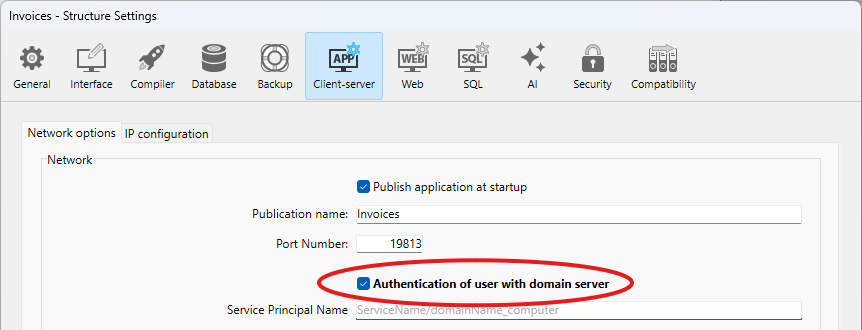
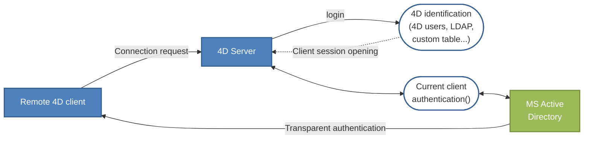

4D Server allows you to implement SSO (*Single Sign On*) capabilities in your client-server solutions on Windows.

Implementing SSO in your 4D solutions will allow users to access the 4D application on Windows without needing to reenter their password when they are already logged into the Windows domain of their company (using Active Directory). Behind the scenes, the 4D Server application delegates the authentication to Active Directory and gets the Windows session login, which you can use to log the 4D user into the application by means of your standard login method.

## Requisitos

La funcionalidad SSO está disponible:

- with 4D Server applications on Windows (4D single-user applications do not support SSO),
- with the [QUIC or ServerNet network layer](../settings/client-server.md#network-layer) enabled.

## Activar la funcionalidad SSO

De forma predeterminada, la función SSO no está activa en 4D Server. To benefit from this feature, you need to set the **Authentication of user with domain server** option on the [Client-Server/Network options page](../settings/client-server.md#authentication-of-user-with-domain-server) of the Settings dialog box of 4D Server:



Al marcar esta opción, 4D se conecta de forma transparente al directorio Active del servidor de dominio Windows y obtiene los tokens de autenticación disponibles.

Esta opción permite efectuar una autenticación estándar a través del protocolo NTLM. 4D es compatible con los protocolos NTLM y Kerberos. The protocol used is automatically selected by 4D depending on the [current configuration](#requirements-for-sso). If you want to use the Kerberos protocol, you need to fill in the additional SPN field as well (see below).

### Utilizar Kerberos

If you want to use Kerberos as your authentication protocol, you also need to fill in the [**Service Principal Name** option on the Client-server/Network options page](../settings/client-server.md#service-principal-name) of the Settings dialog box:


Esta opción declara el SPN tal y como se configuró en Active Directory. Un nombre principal de servicio es un identificador único de una instancia de servicio. SPNs are used by Kerberos authentication to associate a service instance with a service logon account. This allows a client application to request that the service authenticates an account even if the client does not have the account name. For more information, please refer to the [SPN page on the MSDN web site](https://msdn.microsoft.com/en-us/library/windows/desktop/ms677949%28v=vs.85%29.aspx).

El identificador SPN debe respetar este formato:

- "ServiceName/FQDN_user" si el SPN es un atributo de máquina
- "ServiceName/FQDN_computer" si el SPN es un atributo de usuario

Donde:

- *ServiceName* is the name of the service which the client wants to authenticate.
- The *Fully Qualified Domain Name* (FQDN) is a domain name that specifies its exact location in the tree hierarchy of the Active Directory for both computers and users.

En las aplicaciones 4D, se puede configurar el SPN:

- in the [structure settings](../Project/architecture.md#sources), for use with 4D Server.
- or in the [user settings](../Project/architecture.md#settings-user) for deployment needs.

## Implementar el SSO

When SSO features are enabled, you can rely on user authentication based on Windows session credentials to open a user session on 4D Server.

Keep in mind that the SSO feature only provides you with an authenticated login; it is up to you to pass this login to your standard 4D login method. When a 4D remote application tries to connect to the server, you have to call the [`Current client authentication`](../commands/current-client-authentication) command, which will return the user login, as defined in the Active Directory. You can then pass this login to your own identification system (using the built-in user and groups, the LDAP commands, or any custom mechanism) to open the appropriate session for the remote user in your 4D application.

Este principio se ilustra en el siguiente gráfico:



The [`Current client authentication`](../commands/current-client-authentication) command must be called in the [`On Server Open Connection`](../commands-legacy/on-server-open-connection-database-method.md) database method, which is called each time a remote 4D opens a new connection to the 4D Server application. If authentication fails, you have to return a non-null value in the *$status* to reject the connection.

### Uso del comando Current client authentication

To call the [`Current client authentication`](../commands/current-client-authentication) command, use the following syntax:

```4d
$login:=Current client authentication($domain;$protocol)
```

Donde:

- *$login* is the ID used by the client to log into the Active Directory (text value). Debe utilizar este valor para identificar al usuario dentro de su proyecto. If the user is not correcty authenticated, an empty string is returned and no error is returned.
- *$domain* y *$protocol* son parámetros texto opcionales. They are filled by the command and allow you to accept or reject connections depending on these values:
  - *$domain* es el nombre de dominio del Active Directory
  - *$protocol* is the name of the protocol used by Windows to authenticate the user.

### Configuración requerida para el SSO

4D Server handles various SSO configurations, depending on the current architecture and settings. The protocol used for authentication (NTLM or Kerberos) as well as information returned by the [`Current client authentication`](../commands/current-client-authentication) command depend on the actual configuration, if all requirements are respected (see below). The protocol actually used for authentication is returned in the protocol parameter of the [`Current client authentication`](../commands/current-client-authentication) command.

The following table provides the requirements for using NTLM or Kerberos authentication:

|                                                                                     | NTLM                                                                            | Kerberos                                                                            |
| ----------------------------------------------------------------------------------- | ------------------------------------------------------------------------------- | ----------------------------------------------------------------------------------- |
| 4D Server y 4D Remote se encuentran en máquinas diferentes                          | sí                                                                              | sí                                                                                  |
| El usuario 4D Server está en el dominio                                             | sí                                                                              | sí                                                                                  |
| El 4D remoto está en el mismo AD que el usuario de 4D Server                        | yes o no(\*)                                                 | sí                                                                                  |
| El SPN se indica en 4D Server                                                       | no                                                                              | yes(\*\*)                                                        |
| Information returned by Current client authentication if requirements are respected | *login*=inicio de sesión esperado, *domain*=dominio esperado, *protocol*="NTLM" | *login*=inicio de sesión esperado, *domain*=dominio esperado, *protocol*="Kerberos" |

(\*) The following specific configuration is supported: the 4D remote user is a local account on a machine that belongs to the same AD as 4D Server. In this case, the domain parameter is filled with the 4D Server machine name. Note that the support depends on actual user settings: if not available, empty strings are returned.

(\*\*) If all Kerberos requirements are respected but the [`Current client authentication`](../commands/current-client-authentication) command returns "NTLM" in protocol, this means that you are facing one of the following situations:

- The SPN syntax is not valid; in other words, it does not respect the [constraints imposed by Microsoft](https://msdn.microsoft.com/en-us/library/windows/desktop/ms677949%28v=vs.85%29.aspx).
- O bien, el SPN tiene duplicados en el AD. This issue needs to be fixed by the AD administrator.

:::note

A valid syntax does not mean that the SPN declaration itself is correct; more specifically, if the SPN does not exist in the AD, [`Current client authentication`](../commands/current-client-authentication) returns empty strings.

:::

