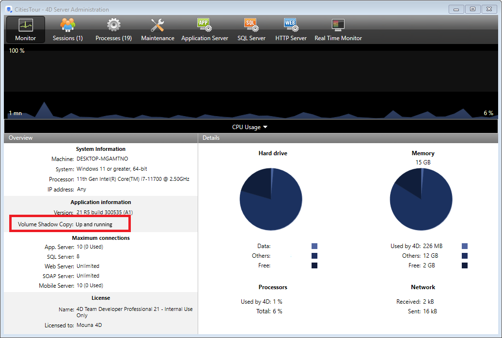

4D Server Windows comes with a dedicated **VSS writer** application that will automatically manage snapshot requests sent through Windows Volume Shadows Copy Service (VSS).

VSS is provided by Windows Server to allow backup applications to capture snapshots (shadow copies) of any files or entire hard disks at a given moment, while applications are running. Thanks to this technology, you can recover, for example, a 4D Server database at the exact state it was at the moment of the snapshot. This mechanism requires that running application files are in a consistent state when the snapshot is performed. For this reason, a VSS-aware application must install a VSS writer application or service. This component is then "warned" by the service when a shadow copy is about to be done and tells the **VSS requestor** (basically the backup application) how to back up its file and data.

## Requirements for the virtualizer

On the host side, the following VSS requestors are supported:

- VMware ESXI on any platform
- Microsoft Hyper-V Server 2016

## Enabling the VSS

The VSS feature is automatically installed/updated when the 4D Server application is launched. The VSS writer application service is started if the session user has admin privileges.

Usually, the starting scenario will be:

1. 4D Server or merged Application Server is launched for the first time.
2. If not launched with administration privileges, a warning icon is displayed.
3. Quit and relaunch 4D Server or merged Application Server as administrator. The 4D VSS service is then automatically executed and registered in VSS.
4. (Optional) Restart 4D Server or merged Application Server using standard privileges.

The VSS writer executable is started as a service with the name "VSS <appName>". One VSS service will run for all 4D Server instances. One VSS service will run for each different engined application (different name) running on the machine (see below).

The [Monitor Page](../ServerWindow/monitor.md) of the 4D Server Administration window displays the status of VSS writer service, in Application information area:

Additional information about the Volume Shadow Copy status can be displayed in a tips when you hover the mouse over the area:

## About VSS Writer

The **vss_writer.exe** application is provided to handle Volume Shadow Copy Service (VSS) management for 4D applications.

:::note

The 4D VSS management is handled through a separate application since this program must run using administration privileges.

:::

The 4D VSS writer executable is automatically installed by 4D Server at first launch

The 4D VSS Writer service handles and transfers VSS messages to 4D Server. These messages are logged in the 4D Server diagnostic log, and in the Windows event viewer.