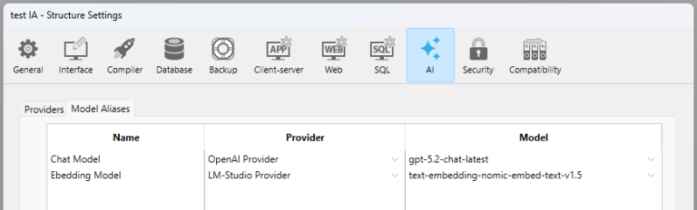

The AI page allows you to add, remove, or view the list of all your AI providers and their related model aliases, whether they come from local sources or internet-based services. Providers and model aliases can then be used in your code througout your 4D application, especially with the [**4D-AIKit component**](../aikit/overview.md) using the [**model aliases**](../aikit/provider-model-aliases.md) feature.

:::tip Entrada de blog relacionada

[Centralización de proveedores de IA y alias de modelos en 4D](https://blog.4d.com/centralizing-ai-providers-and-model-aliases-in-4d)

:::

## Managing providers

4D supports [various AI providers](../aikit/compatible-openai.md) with an OpenAI-like API, each offering unique models and features for database needs.

Por defecto, la lista de proveedores está vacía.

### Añadir un proveedor

Para añadir un proveedor de IA:

1. Haga clic en el botón **+** situado en la parte inferior de la lista de proveedores.
2. Introduzca los [campos de configuración del proveedor](#provider-properties) necesarios, incluidas las credenciales.
3. (optional) Click the **Test connection** button to make sure the provided URL and credentials are valid.

Si la conexión se realiza correctamente, a la derecha del botón aparece el número de modelos disponibles:


If the connection test fails, an error message is displayed (e.g. "Request failed: Not found" or "Request failed: Unauthorized").

4. Click **OK** to save the new provider, or **Cancel** to revert all modifications.

### Editing a provider

Para editar o eliminar un proveedor:

1. Seleccione un proveedor registrado en la lista.
2. Edit the provider's information OR to remove a provider, click on the **-** button at the bottom of the Providers list.
3. Click **OK** to save the modifications, or **Cancel** to revert all modifications.

## Provider properties

When you select a provider in the Providers list, several properties are available. Los nombres de propiedades en **negrita** son obligatorios para crear un Proveedor.

### Nombre

Local name used to identify the provider in your code, for example "claude". The name must be [compliant with property names](../Concepts/identifiers.md) since it will be used in the application's code to reference the provider.

### Base URL

Endpoint de la API del proveedor, por ejemplo `https://api.openai.com/v1` o `http://localhost:11434/v1`.

The combo box lists the main providers, you can select a value to enter the provider endpoint:


### API Key

(optional) API key for the provider. For instructions on generating an API key, please refer to your AI provider’s official documentation. Algunos proveedores de IA también pueden exigir credenciales específicas adicionales.

### Organization

(opcional, específico de OpenAI) ID de la organización utilizado por la API de OpenAI.

### Project

(optional, OpenAI-specific) ID of the project. Each OpenAI API key is attached to a project.

### AIProviders.json

The provider configuration is stored in a JSON file named *AIProviders.json* located next to the active *settings.4DSettings file* within the [project folder](../Project/architecture.md), [depending on your deployment configuration](./overview.md#enabling-user-settings).

### Deployment with an API key

Al configurar un proveedor de AI, debe proporcionar su propia clave API. Requiere un registro externo para obtener claves/credenciales API de los proveedores de IA.

Using the Settings dialog box, the 4D developer can define a custom **provider name** (for example "open-ai-v1") and use this custom name in the code. También pueden probarlo utilizando su clave API.

When the 4D application is deployed with the [User settings enabled](../settings/overview.md#enabling-user-settings), the administrator can configure the User settings by using the **same AI provider name** ("open-ai-v1") and **customize the API key** to use the customer's key. Thanks to the [User settings priority rules](../settings/overview.md#priority-of-settings), the customer settings will automatically override the developer settings.

:::warning

When using 4D in client/server mode, it is **strongly recommended** to execute AI-related code on the server side to protect API keys and credentials from exposure to remote machines.

:::

## Model Aliases

The Model Aliases page allows you to list models from registered Providers that you want to use in your code and to name them with *aliases*. Thanks to model aliases, you avoid hardcoding model names, switch models without changing your code, and keep consistency across environments.

When using a model alias:

- The provider is automatically resolved (see [Model resolution](../aikit/Classes/OpenAIProviders.md#model-resolution) in the 4D-AIKit documentation).
- Se aplica el ID del modelo.
- All credentials and endpoints are used.

### Adding a model alias

:::note

To be able to add a model alias, you must have entered at least one valid provider in the **Providers** tab.

:::

To add a model alias:

1. Click on the **+** button at the bottom of the model aliases list.
2. En la columna **Nombre**, introduzca el nombre del alias.
3. Click on the corresponding row in the **Provider** column to display the list of available providers ([provider names](#name) you entered in the Providers page), and select the name of the provider.
4. Click on the corresponding row in the **Model** column to display the list of available models exposed by the selected provider and select the model.
5. Click **OK** to save the modifications, or **Cancel** to revert all modifications.



### Editing a model alias

To edit or remove an alias:

1. Seleccione un alias de modelo en la lista.
2. Edit the alias information OR to remove a alias, click on the **-** button at the bottom of the list.
3. Click **OK** to save the modifications, or **Cancel** to revert all modifications.

### Using a model alias

You can directly use the model alias name wherever a model name is required (provided that model aliases are supported).

For example, in 4D-AIKit, you can reference a model with the syntax: *{model:"ModelName"}*, where *ModelName* is a valid model defined in the Model Aliases tab:

```4d
var $client:=cs.AIKit.OpenAI.new()
var $result := $client.chat.completions.create($messages; \
    {model: "Chat Model"})
```

### Ver también

["Provider & Model Aliases"](../aikit/provider-model-aliases.md) in the 4D AIKit documentation.