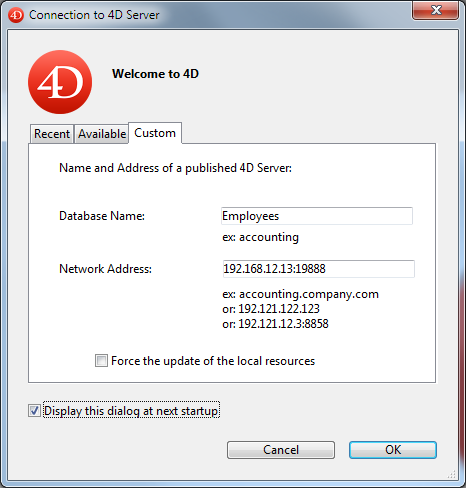

Las páginas Cliente-Servidor agrupan los parámetros relacionados con el uso de la base de datos en modo cliente-servidor. Naturalmente, estas propiedades sólo se tienen en cuenta cuando la base de datos se utiliza en modo remoto.

## Página Opciones red

### Red

#### Publicar la base al inicio

Esta opción le permite indicar si la base de datos 4D Server aparecerá o no en la lista de bases de datos publicadas.

- Cuando esta opción está marcada (por defecto), la base de datos se hace pública y aparece en la lista de bases de datos publicadas (pestaña**Disponible**).
- Cuando la opción no está marcada, la base de datos no se hace pública y no aparece en la lista de bases de datos publicadas. Para conectarse, los usuarios deben introducir manualmente la dirección de la base de datos en la pestaña **Personalizada** de la caja de diálogo de conexión.

:::note

Si modifica este parámetro, deberá reiniciar la base del servidor para que se tenga en cuenta.

:::

#### Nombre de publicación

This option lets you change the publication name of a 4D Server database, _i.e._, the name displayed on the dynamic **Available** tab of the connection dialog box (see the [Opening a remote project](../Desktop/clientServer.md#opening-a-remote-project) paragraph). Por defecto, 4D Server utiliza el nombre del archivo de proyecto. Puede introducir cualquier nombre personalizado que desee.

:::note

Este parámetro no se tiene en cuenta en las aplicaciones cliente-servidor personalizadas. En teoría, la aplicación cliente se conecta directamente a la aplicación servidor, sin pasar por la caja de diálogo de conexión. Sin embargo, en caso de error, puede aparecer esta caja de diálogo; en este caso, el nombre de publicación de la aplicación servidor es el nombre del proyecto compilado.

:::

#### Número de puerto

Esta opción le permite cambiar el número del puerto TCP en el que 4D Server publica la base de datos. Esta información se almacena en el proyecto y en cada máquina cliente. Por defecto, el número de puerto TCP utilizado por 4D Server y 4D en modo remoto es 19813.

La personalización de este valor es necesaria cuando desea utilizar varias aplicaciones 4D en la misma máquina; en este caso, debe especificar un número de puerto diferente para cada aplicación.
Cuando se modifica este valor desde 4D Server o 4D, se transmite automáticamente a todas las máquinas 4D conectadas a la base de datos.

Para actualizar las otras máquinas clientes que no estén conectadas, basta con introducir el nuevo número de puerto (precedido de dos puntos) después de la dirección IP del equipo servidor en la pestaña **Personalizado** de la caja de diálogo de conexión  Por ejemplo, si el nuevo número de puerto es 19888:

> Sólo las bases de datos publicadas en el mismo puerto que el definido en 4D client son visibles en la página de publicación dinámica TCP/IP.

#### 4D Server y números de puerto

4D Server utiliza tres puertos TCP para las comunicaciones entre los servidores internos y los clientes:

- **SQL Server**: 19812 por defecto (puede modificarse a través de la página "SQL/Configuración" de las Preferencias).
- **Servidor de aplicaciones**: 19813 por defecto (puede modificarse a través de la página "Cliente-Servidor/Configuración" de las Preferencias, ver arriba).
- **Servidor DB4D** (servidor de base de datos): 19814 por defecto. Este número de puerto no se puede modificar directamente, pero siempre consiste en el número de puerto del servidor de aplicaciones + 1.
  Cuando un cliente 4D se conecta a 4D Server, utiliza el puerto TCP del servidor de aplicaciones (19813 o el puerto indicado después de los dos puntos ':' en la dirección IP mostrada en la caja de diálogo de conexión). La conexión a otros servidores a través de sus respectivos puertos es entonces automática; ya no es necesario especificarlos.\
  Tenga en cuenta que en caso de acceso a través de un enrutador o un cortafuegos, los tres puertos TCP deben abrirse explícitamente.
- [**Depurador remoto**](../Debugging/debugging-remote.md): 19815 por defecto. Este número de puerto no puede modificarse directamente, pero siempre consta del número de puerto del servidor de aplicaciones + 2.

#### Autenticación del usuario con el servidor de dominio

Esta opción le permite implementar las funcionalidades SSO (_Single Sign On_) en su base de datos 4D Server en Windows. Al marcar esta opción, 4D se conecta de forma transparente al directorio Active del servidor de dominio Windows y obtiene los tokens de autenticación disponibles. Esta opción se describe en la sección [Single Sign On (SSO) en Windows](https://doc.4d.com/4Dv20R5/4D/20-R5/Single-Sign-On-SSO-on-Windows.300-6932709.en.html).

#### Service Principal Name

Cuando la autenticación única (SSO) está activa (ver arriba), debe llenar este campo si desea utilizar Kerberos como protocolo de autenticación. Esta opción se describe en la sección [Single Sign On (SSO) en Windows](https://doc.4d.com/4Dv20R5/4D/20-R5/Single-Sign-On-SSO-on-Windows.300-6932709.en.html).

#### Capa de red

Esta caja desplegable contiene 3 opciones de capa de red a elegir entre: **legacy**, **ServerNet** y **QUIC** (sólo en modo proyecto), que se utilizan para manejar las comunicaciones entre 4D Server y las máquinas 4D remotas (clientes).

- **Legal**: esta antigua capa de red "Legal" sigue siendo soportada para garantizar la compatibilidad de las bases de datos creadas antes de la v15. Esta capa de red también puede habilitarse por programación utilizando el comando [SET DATABASE PARAMETER](https://doc.4d.com/4Dv20/help/command/page642.html).
- **ServerNet** (por defecto): activa la capa de red de ServerNet en el servidor (disponible desde 4D v15).
- **QUIC** (disponible solo en modo proyecto): activa la capa de red QUIC en el servidor.

  **Notas**:

  - Al seleccionar esta opción, se anula la opción Utilizar capa de red heredada en caso de que se haya definido mediante el comando [SET DATABASE PARAMETER](https://doc.4d.com/4Dv20/help/command/page642.html).
  - You can know if a 4D application is running with a QUIC network layer using the [Application info](https://doc.4d.com/4Dv20/help/command/page1599.html) command.
  - Dado que QUIC utiliza el protocolo UDP, asegúrese de que UDP está permitido en la configuración de seguridad de su red.
  - QUIC se conecta automáticamente al puerto 19813 tanto para el servidor de aplicaciones como para el servidor DB4D.
  - Cuando se selecciona la opción de capa QUIC:
    - Cerca del selector aparece un mensaje beta y un icono de alerta.
    - [los parámetros del tiempo de espera de las conexiones cliente-servidor](#Client-Server-Connections-Timeout) están ocultos
    - La casilla de verificación [Encriptar comunicación Cliente-Servidor](#Encrypt-Client-Server-Communications) está oculta (las comunicaciones QUIC son siempre en TLS, sea cual sea su modo seguro).
  - **Compatibilidad**: necesita desplegar sus aplicaciones cliente/servidor con 4D v20 o superior antes de cambiar a la capa de red QUIC.

:::note

En caso de modificación, deberá reiniciar la aplicación para que se tenga en cuenta el cambio. Toda aplicación cliente que estuviera conectada también debe reiniciarse para poder conectarse con la nueva capa de red.

:::

#### Tiempo antes de desconexión Cliente-Servidor

Este dispositivo se utiliza para definir el tiempo de espera (periodo de inactividad más allá del cual se cierra la conexión) entre 4D Server y las máquinas cliente que se conectan a él. La opción ilimitada elimina el tiempo de espera. Cuando se selecciona esta opción, se elimina el control de la actividad del cliente.

Cuando se selecciona un tiempo de espera, el servidor cerrará la conexión de un cliente si no recibe ninguna petición de éste durante el tiempo límite especificado.

### Comunicación cliente-servidor

#### Registrar los clientes al Inicio para Execute On Client

Cuando esta opción está marcada, todas las máquinas remotas 4D que se conectan a la base de datos pueden ejecutar métodos remotamente. Este mecanismo se detalla en la sección [Procedimientos almacenados en las máquinas cliente](https://doc.4d.com/4Dv19/4D/19/Stored-procedures-on-client-machines.300-5422461.en.html).

#### Cifrar las comunicaciones Cliente-Servidor

Esta opción permite activar el modo seguro para las comunicaciones entre la máquina servidor y las máquinas remotas 4D. Esta opción se detalla en la sección [Cifrar las de conexiones cliente/servidor](https://doc.4d.com/4Dv19/4D/19/Encrypting-ClientServer-Connections.300-5422465.en.html).

#### Actualizar la carpeta Resources durante una sesión

Este parámetro puede utilizarse para definir globalmente el modo de actualización de la instancia local de la carpeta **Resources** en los equipos 4D conectados cuando se modifica la carpeta **Resources** de la base de datos durante la sesión (la carpeta **Resources** se sincroniza automáticamente en el equipo remoto cada vez que se abre una sesión). Hay tres parámetros disponibles:

- **Nunca**: la carpeta local **Resources** no se actualiza durante la sesión. La notificación enviada por el servidor es ignorada. La carpeta **Resources** local puede actualizarse manualmente mediante el comando **Update Local Resources** del menú de acción (ver [Uso del explorador de recursos](https://doc.4d.com/4Dv19/4D/19/Using-the-Resources-explorer.300-5416788.en.html)).
- **Siempre**: la sincronización de la carpeta local **Resources** se realiza automáticamente durante la sesión cada vez que el servidor envía una notificación.
- **Preguntar**: cuando la notificación es enviada por el servidor, se muestra una caja de diálogo en las máquinas cliente, indicando la modificación. A continuación, el usuario puede aceptar o rechazar la sincronización de la carpeta local **Resources**.\
  La carpeta **Resources** centraliza los archivos personalizados necesarios para la interfaz de la base (archivos de traducción, imágenes, etc.). Se pueden utilizar mecanismos automáticos o manuales para notificar a cada cliente cuándo se ha modificado el contenido de esta carpeta. Para más información, consulte la sección [Gestión de la carpeta Resources](https://doc.4d.com/4Dv19/4D/19/Managing-the-Resources-folder.300-5422466.en.html).

## Página Configuración IP

### Tabla de configuración Autorizar-Rechazar

Esta tabla permite definir las reglas de control de acceso a la base en función de las direcciones IP de las máquinas 4D remotas. Esta opción permite reforzar la seguridad, por ejemplo, para aplicaciones estratégicas.

> Esta tabla de configuración no controla las conexiones web.

El funcionamiento de la tabla de configuración es el siguiente:

- La columna "Autorizar-Rechazar" permite seleccionar el tipo de regla a aplicar (Autorizar-Rechazar) mediante un menú emergente. Para añadir una regla, haga clic en el botón Añadir. Aparece una nueva línea en la tabla. El botón **Borrar** permite eliminar la línea actual.
- La columna "Dirección IP" permite designar las direcciones IP afectadas por la regla. Para especificar una dirección, haga clic en la columna e introduzca la dirección de la siguiente forma: 123.45.67.89 (formato IPv4) o 2001:0DB8:0000:85A3:0000:0000:AC1F:8001 (formato IPv6). Puede utilizar un caracter \* (asterisco) para especificar las direcciones del tipo "comienza por". Por ejemplo, 192.168.\* indica todas las direcciones que empiezan por 192.168.
- La aplicación de las reglas se basa en el orden de visualización de la tabla. Si dos reglas son contradictorias, se da prioridad a la regla situada más arriba en la tabla. Puede reordenar las líneas modificando la ordenación actual (haga clic en el encabezado de la columna para alternar la dirección de la ordenación). También puede mover las líneas utilizando arrastrar y soltar.
- Por razones de seguridad, sólo las direcciones que realmente coincidan con una regla podrán conectarse. En otras palabras, si la tabla sólo contiene una o más reglas de tipo Rechazar, todas las direcciones serán rechazadas porque ninguna coincidirá con al menos una regla. Si desea denegar sólo determinadas direcciones (y permitir otras), añada una regla Autorizar\* al final de la tabla. Por ejemplo:
  - Denegar 192.168.\* (denegar todas las direcciones que empiecen por 192.168)
  - Autorizar \* (y permitir todas las demás direcciones)

Por defecto, 4D Server no aplica ninguna restricción de conexión: la primera línea de la tabla contiene la etiqueta Autorizar y el caracter \* (todas las direcciones).
