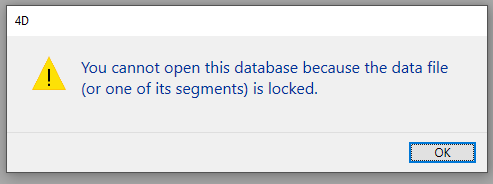

## Página Almacenamiento de datos

Esta página permite configurar el almacenamiento de datos de la base 4D en el disco.

### Parámetros generales

#### Autorizar el uso de archivos de datos de sólo lectura

Esta opción permite configurar el funcionamiento de la aplicación al abrir un archivo de datos bloqueado a nivel del sistema operativo. 4D incluye un mecanismo que impide automáticamente la apertura de una base cuando su archivo de datos, o uno de sus segmentos está bloqueado. En este caso, cuando se activa esta opción de detección, 4D muestra un mensaje de advertencia y no abre la base:

A menos que se marque esta opción, no es posible abrir una base cuando su archivo de datos está bloqueado (funcionamiento por defecto para las bases 4D).

#### Sobre el bloqueo de archivos

Los archivos bloqueados pueden ser leídos pero su contenido no puede ser modificado. Por ejemplo, los archivos se bloquean cuando se almacenan en un soporte no regrabable (tipo DVD) o cuando se copian desde este tipo de soporte. 4D puede trabajar de forma transparente con archivos de datos bloqueados, lo que permite, en particular, la utilización de proyectos guardados en DVD. Sin embargo, con esta operación se corre el riesgo de utilizar inadvertidamente un fichero de datos bloqueado en el que no se guardarán las modificaciones. Esta es la razón por la que, por defecto, 4D no permite abrir bases de datos con un archivo de datos bloqueado.

### Ubicación de carpeta temporal

Esta área le permite cambiar la ubicación de los archivos temporales creados mientras 4D está funcionando. La carpeta de archivos temporales es utilizada por la aplicación, cuando es necesario, para guardar temporalmente en disco los datos en memoria.

La ubicación actual de esta carpeta se muestra en el área "Actual:". Puede hacer clic en esta área para mostrar el nombre de la ruta en forma de lista desplegable:

Se ofrecen tres opciones de ubicación:

- **System**: When this option is selected, the 4D temporary files are created in a folder placed at the location specified by Windows and/or macOS. You can find out the current location defined by your system using the [`Temporary folder`](https://doc.4d.com/4dv19R/help/command/en/page486.html) 4D command. Los archivos se colocan en una subcarpeta cuyo nombre está formado por el nombre de la base y un identificador único.
- **Data File Folder** (default option): When this option is selected, the 4D temporary files are created in a folder named "temporary files" located at the same level as the data file of the database.
- **User Defined**: This option is used to set a custom location. Si se modifica la opción de ubicación, será necesario reiniciar la base para que se tenga en cuenta la nueva opción. 4D verifica si se puede acceder a la carpeta seleccionada mediante escritura. Si no es así, la aplicación prueba otras opciones hasta encontrar una carpeta válida.

> This option is stored in the "extra properties" of the structure that is available when the structure definition is exported in XML (see [Exporting and importing structure definitions](https://doc.4d.com/4Dv19/4D/19/Exporting-and-importing-structure-definitions.300-5416829.en.html)).

### Comparación de texto

> Si cambia una de estas opciones, tiene que salir y volver a abrir la base para que el cambio surta efecto. Una vez reabierta la base, se vuelven a indexar automáticamente todos sus índices.

- **Consider @ as a wildcard only when at the beginning or end of text patterns**: Allows you to set how the at sign "@" will be interpreted when used in a query or a character string comparison, when it is located in a word.
  When this option is not checked (default value), the at sign is used as the wildcard character, in other words, it replaces any character (see [Wildcard character (@)](https://doc.4d.com/4Dv19/4D/19/Query-editor.300-5416813.en.html#463876)).

  Cuando la opción está marcada, la arroba se considera un caracter simple si se encuentra dentro de una palabra. Esta posibilidad es especialmente útil cuando se buscan direcciones de correo electrónico, donde el signo @ se utiliza internamente. Esta opción influye en las búsquedas, ordenaciones, comparaciones de cadenas de caracteres, así como en los datos almacenados en las tablas y los que se encuentran en memoria, como los arrays. Los campos y variables de tipo alfa (indexados o no) y texto se ven afectados por como se interpreta el caracter @ en las búsquedas y ordenaciones.

  **Notas:**

  - Para las búsquedas, si el criterio de búsqueda empieza o acaba por @, el caracter "@" se tratará como un comodín. Sólo si el carácter "@" se coloca en medio de una palabra (por ejemplo: bill@cgi.com) 4D lo trata de forma diferente.
  - This option can also have an influence on the behavior of the commands in the [Objects (Forms)](https://doc.4d.com/4Dv19/4D/19/Objects-Forms.201-5391558.en.html) theme that accept the wildcard character ("@") in the object parameter.
  - Por razones de seguridad, sólo el Administrador o Diseñador de la base de datos puede modificar este parámetro.

- **Current data language:** Used to configure the language used for character string processing and comparison. La elección de un idioma de comparación afecta a la ordenación y la búsqueda de textos, así como al cambio entre minúsculas y mayúsculas, pero no afecta a la traducción de etiquetas ni a los formatos de fecha, hora o moneda, que permanecen en el idioma del sistema. Por defecto, 4D utiliza el lenguaje del sistema.

  Así, un proyecto 4D puede funcionar en un lenguaje distinto del del sistema. Cuando se abre un proyecto, el motor de 4D detecta el lenguaje utilizado por el archivo de datos y lo pasa al lenguaje (modo intérpretado o compilado). Las comparaciones de texto, independientemente de si las efectúa el motor del proyecto o el lenguaje, se hacen en el mismo idioma.

  > You can modify this setting in the application Preferences (see [General Page](../Preferences/general.md)). En este caso, la configuración se aplica a todas las nuevas bases creadas por 4D.

- **Consider only non-alphanumeric chars for keywords**: Modifies the algorithm used by 4D to identify keyword separators and hence build their indexes. Por defecto, cuando esta opción no está marcada, 4D utiliza un sofisticado algoritmo que tiene en cuenta las características lingüísticas.

  Este algoritmo es similar al que utilizan los programas de tratamiento de textos para determinar los límites al seleccionar una palabra sobre la que se hace doble clic. For more information about this algorithm, refer to the following address: `http://userguide.icu-project.org/boundaryanalysis`.

  Cuando esta opción está marcada, 4D utiliza un algoritmo simplificado. En esta configuración, todo caracter no alfanumérico (es decir, que no sea una letra o un número) se considera un separador de palabras claves. Esta configuración cumple requisitos específicos asociados a determinados idiomas, como el japonés.

- **Sorting order appropriate for searching**: This option is only displayed when the Japanese language is selected. Modifica la interpretación de caracteres como la "Marca sonora prolongada Katakana-Hiragana" o "長音記号" o las "Marcas de iteración japonesa" como "ゝ" o "ゞ". Es probable que un hablante típico de japonés prefiera los resultados cuando el ajuste está activado.

#### Soporte de Mecab (versión japonesa)

On Japanese systems, 4D supports the _MeCab_ library, with a indexing algorithm for keywords that is particularly suited for the Japanese language.

Este algoritmo se utiliza por defecto en las versiones japonesas de 4D. If needed, you can disable the use of the _MeCab_ algorithm and use the conventional _ICU_ library.

To disable _MeCab_, just check the **Consider only non-alphanumeric chars for keywords** option:

## Página Memoria

Utilice los parámetros de esta pestaña para configurar la memoria caché de la base.

### Parámetros de la caché para la base

- **Calculation of adaptive cache**: When this option is checked, management of the memory cache is done dynamically by the system --- respecting limits that you set. Esto permite configurar una memoria caché de alto rendimiento adaptada a la mayoría de las configuraciones. A continuación, el tamaño de la memoria caché se calcula dinámicamente en función de los parámetros definidos. Los valores ofrecidos por defecto corresponden al uso estándar de 4D.

  - **Memory to be reserved for other applications and for the system**: Portion of the RAM memory to reserve for the System and other applications. Este valor aumenta para la optimización cuando otras aplicaciones se ejecutan en la misma máquina que 4D.
  - **Percentage of available memory used for cache**: Percentage of the remaining memory allocated to the cache by default.\
    To obtain the size allocated by default to the cache, simply perform the following calculation: (Physical memory -- Physical memory to be reserved) X Percentage of the memory used for the cache. En el modo adaptativo, el tamaño de la memoria caché varía dinámicamente en función de las necesidades de la aplicación y del sistema. Puede definir los límites utilizando las siguientes dos opciones:
  - **Minimum Size**: Minimum amount of memory that must be reserved for the cache. Este valor no puede ser inferior a 100 MB.
  - **Maximum Size**: Maximum amount of memory that can be used by the cache. This value is virtually unlimited.\\
    Setting limits is particularly useful for databases that are distributed on machines for which you do not know the memory configuration a priori. En este caso, los límites definidos permiten garantizar un rendimiento mínimo en todos los casos. El siguiente diagrama ilustra este comportamiento:

  Example for calculating cache memory:
  _Physical memory to reserve = 256 MB
  Percentage of the available memory used for the cache = 50%
  Maximum size = 1 GB Minimum size = 128 MB_

  

- **Calculation of adaptive cache not checked**:  this mode, you set the size of the memory cache for the database yourself. 4D muestra entonces un área de entrada que permite configurar la memoria caché a utilizar, así como información relacionada con la memoria física (RAM disponible en la máquina), la caché actual y la caché tras el reinicio (teniendo en cuenta sus cambios).

  El tamaño de la memoria caché que introduzca se reservará para la base 4D, independientemente del estado de los recursos de la máquina. Esta configuración puede utilizarse en determinadas configuraciones específicas, o cuando la base está diseñada para utilizarse en sistemas disímiles en cuanto a memoria. En la mayoría de los casos, la caché adaptativa ofrece un mejor rendimiento.

- **Flush Cache every ... Seconds/Minutes**: Specifies the time period between each automatic saving of the data cache, i.e., its writing to disk.
  4D guarda los datos colocados en la caché a intervalos regulares. Puede especificar todo intervalo de tiempo entre 1 segundo y 500 minutos. Por defecto, 4D guarda sus datos cada 20 segundos. La aplicación también guarda sus datos en el disco cada vez que cambia a otro entorno o sale de la aplicación. You can also call the [FLUSH CACHE](https://doc.4d.com/4dv19R/help/command/en/page297.html) command to trigger the flush at any moment.

  Cuando prevea una entrada de muchos datos, considere la posibilidad de establecer un intervalo de tiempo breve entre guardados. En caso de corte del suministro eléctrico, sólo perderá los datos introducidos desde el último almacenamiento (si la base de datos funciona sin archivo de historial).

  Si la base de datos se ralentiza notablemente cada vez que se vacía la caché, deberá ajustar la frecuencia. Esta lentitud significa que se está guardando una gran cantidad de registros. Por lo tanto, un periodo más corto entre guardados sería más eficaz, ya que cada guardado implicaría menos registros y, por lo tanto, sería más rápido.

  Por defecto, 4D muestra una pequeña ventana cuando se vacía la caché. If you do not want this visual reminder, you can uncheck the **Flushing progress** option on the [Interface page](./interface.md).
