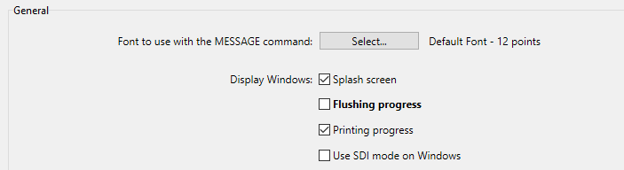

Los parámetros configuran el funcionamiento del proyecto actual. Estos parámetros pueden ser diferentes para cada proyecto. Incluyen los puertos de escucha, las configuraciones de copia de seguridad, las opciones de seguridad, los parámetros Web, etc.

> 4D provides another set of parameters, called **Preferences**, that apply to the 4D IDE application. For more information, refer to [Preferences](../Preferences/general.md).

## Acceso a los parámetros

Puede acceder a la caja de diálogo Parámetros:

- using the **Design > Settings...** menu option
- by clicking **Settings** on the 4D toolbar
- on 4D Server, using the **Edit > Settings...** menu option

When [**User settings** mode is enabled](../Desktop/user-settings.md), **Settings...** is renamed **Structure Settings...** and two additional menu commands are available at each location:

- **User Settings...** gives you access to settings that can be stored externally in a user file. Si se modifican, se utilizan en lugar de los parámetro de estructura.
- **User Settings for Data File...** gives you access to settings that can be stored externally in a user file attached to the current data file. Si se modifican, se utilizan en lugar de los parámetros usuario de los parámetros de estructura.

### Información sobre el bloqueo

El bloqueo puede ocurrir tanto en los modos Proyecto y Cliente/servidor cuando:

- The _settings.4DSettings_ file is 'Read-only' (Projects only). Al modificar un parámetro se mostrará una alerta para desbloquearlo, si es posible.
- Dos o más usuarios intentan modificar los mismos parámetros al tiempo. Los parámetros no pueden utilizarse hasta que el primer usuario los libere cerrando la ventana. (Cliente/servidor únicamente)

En ambos casos, los parámetros pueden abrirse en "Sólo lectura", pero no pueden utilizarse hasta que se elimine el bloqueo.

## Personalización de los parámetros

In the Settings dialog boxes, parameters whose values have been modified appear **in bold**:

Los parámetros indicados como personalizados pueden haber sido modificados directamente en la caja de diálogo, o pueden haber sido modificados previamente en el caso de un proyecto convertido.

Un parámetro sigue apareciendo en negrita aunque su valor se remplace manualmente por sus valores por defecto. De este modo, siempre es posible identificar visualmente los parámetros que se hayan personalizado.

La mayoría de los parámetros se aplican inmediatamente. Sin embargo, algunas de ellas (como la configuración del entorno de inicio) sólo surten efecto cuando se reinicia la base de datos. En este caso, aparece una caja de diálogo para informarle de que el cambio surtirá efecto en el próximo inicio.

## Reinicialización de los parámetros

To reset the parameters to their default values and remove the bold style indicating that they have been customized, click **Reset to factory settings**.

Este botón reinicializa todos los parámetros de la página actual. Se activa cuando se ha modificado al menos un parámetro en la página actual.
