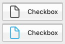

## Generalidades

Una casilla de selección es un tipo de botón utilizado para introducir o mostrar datos binarios (verdadero-falso). Básicamente, está seleccionado o no, pero se puede definir un tercer estado (ver más abajo).


Las casillas de selección se controlan por métodos. Como todos los botones, la variable de la casilla de selección se pone en 0 cuando se abre el formulario por primera vez. El método asociado a ella se ejecuta cuando se selecciona la casilla de selección.

Una casilla de selección muestra el texto junto a un pequeño cuadrado. Este texto se define en el área [Título](properties_Object.md#title) del tema "Objetos" de la Lista de propiedades. Para introducir en esta área un título en forma de referencia XLIFF (ver [Anexo B: arquitectura XLIFF](https://doc.4d.com/4Dv17R5/4D/17-R5/Appendix-B-XLIFF-architecture.300-4163748.en.html)).

## Utilizar casillas de selección

Una casilla de selección puede asociarse a una [variable o expresión](properties_Object.md#variable-or-expression) de tipo entero o booleano.

- **entero:** si la casilla está marcada, la variable tiene el valor 1. Cuando no se marca, tiene el valor 0. Si la casilla de selección está en tercer estado (ver más abajo), tiene el valor 2.
- **booleano:** si la casilla está marcada, la variable tiene el valor `True`. Cuando no se marca, toma el valor `False`.

Una parte o todas las casillas de selección de un formulario pueden estar marcadas o desmarcadas. Las casillas de selección múltiples permiten al usuario seleccionar varias opciones.

### Casilla de selección de tres estados

Los objetos casilla de selección de estilo [Clásico](checkbox_overview.md#regular) y [Plano](checkbox_overview.md#flat) aceptan un tercer estado. Este tercer estado es un estado intermedio, que generalmente se utiliza para fines de visualización. Por ejemplo, permite indicar que una propiedad está presente en una selección de objetos, pero no en cada objeto de la selección.


Para activar este tercer estado, debe seleccionar la propiedad [Tres estados](properties_Display.md#three-states).

Esta propiedad sólo está disponible para casillas de selección regulares y planas asociadas a [variables o expresiones](properties_Object.md#variable-or-expression) - las casillas de selección de expresiones booleanas no pueden utilizar la propiedad [Tres estados](properties_Display.md#three-states) (una expresión booleana no puede estar en un estado intermedio).

La variable asociada a la casilla de selección devuelve el valor 2 cuando la casilla está en el tercer estado.
> En el modo de entrada, las casillas de selección de los tres estados muestran cada estado de forma secuencial, en el siguiente orden: sin marcar / marcado / intermedio / sin marcar, etc. El estado intermedio no suele ser muy útil en el modo de entrada; en el código, basta con forzar el valor de la variable a 0 cuando toma el valor de 2 para pasar directamente del estado comprobado al estado no comprobado.

## Utilizar una acción estándar

Puede asignar una [acción estándar](properties_Action.md#standard-action) a una casilla de selección para manejar los atributos de las áreas de texto. Por ejemplo, si asigna la acción estándar `fontBold`, en ejecución la casilla de selección gestionará el atributo "negrita" del texto seleccionado en el área actual.

Sólo las acciones que pueden representar un estado verdadero/falso (acciones "marcables") son soportadas por este objeto:

| Acciones soportadas                 | Condiciones de uso (si las hay) |
| ----------------------------------- | ------------------------------- |
| avoidPageBreakInsideEnabled         | Área 4D Write Pro únicamente    |
| fontItalic                          |                                 |
| fontBold                            |                                 |
| fontLinethrough                     |                                 |
| fontSubscript                       | Área 4D Write Pro únicamente    |
| fontSuperscript                     | Área 4D Write Pro únicamente    |
| fontUnderline                       |                                 |
| font/showDialog                     | Mac únicamente                  |
| htmlWYSIWIGEnabled                  | Área 4D Write Pro únicamente    |
| section/differentFirstPage          | Área 4D Write Pro únicamente    |
| section/differentLeftRightPages     | Área 4D Write Pro únicamente    |
| spell/autoCorrectionEnabled         |                                 |
| spell/autoDashSubstitutionsEnabled  | Mac únicamente                  |
| spell/autoLanguageEnabled           | Mac únicamente                  |
| spell/autoQuoteSubstitutionsEnabled | Mac únicamente                  |
| spell/autoSubstitutionsEnabled      |                                 |
| spell/enabled                       |                                 |
| spell/grammarEnabled                | Mac únicamente                  |
| spell/showDialog                    | Mac únicamente                  |
| spell/visibleSubstitutions          |                                 |
| visibleBackground                   | Área 4D Write Pro únicamente    |
| visibleFooters                      | Área 4D Write Pro únicamente    |
| visibleHeaders                      | Área 4D Write Pro únicamente    |
| visibleHiddenChars                  | Área 4D Write Pro únicamente    |
| visibleHorizontalRuler              | Área 4D Write Pro únicamente    |
| visiblePageFrames                   | Área 4D Write Pro únicamente    |
| visibleReferences                   |                                 |
| widowAndOrphanControlEnabled        | Área 4D Write Pro únicamente    |

Para información detallada sobre estas acciones, consulte la sección [Acciones estándar](https://doc.4d.com/4Dv17R5/4D/17-R5/Standard-actions.300-4163633.en.html).

## Estilos de botones casillas de selección

Los estilos de casillas de selección controlan la apariencia general de una casilla de selección, así como sus propiedades disponibles. Es posible aplicar diferentes estilos predefinidos a las casillas de selección. Se puede obtener un gran número de variaciones combinando estas propiedades/comportamientos.

Con la excepción de las [propiedades-disponibles](#supported-properties), muchos objetos casilla de selección son *estructuralmente* idénticos. La diferencia está en el tratamiento de sus variables asociadas.

4D ofrece casillas de selección en los siguientes estilos predefinidos:

### Clásico

El estilo Clásico de casilla de selección corresponde a un sistema de casilla de selección estándar (*es decir, *, un rectángulo con un título descriptivo):


#### Ejemplo JSON

```
 "myCheckBox": {
  "type": "checkbox",
  "style":"regular",
  "text": "Cancel",
  "action": "Cancel",  
  "left": 60,   
  "top": 160,  
  "width": 100,   
  "height": 20  
  "dataSourceTypeHint":"boolean"
  }
```

### Plano

El estilo de casilla de selección Plano tiene una apariencia minimalista. La naturaleza gráfica del estilo Flat es especialmente útil para los formularios que se van a imprimir.


#### Ejemplo JSON

```
 "myCheckBox": {
   "type": "checkbox",
   "style":"flat",
   "text": "Cancel",
   "action": "cancel",
   "left": 60,  
    "top": 160,
    "width": 100,   
   "height": 20   
   }
```

### Botón barra de herramientas {#toolbar-button}

El estilo del botón barra de herramientas está pensado principalmente para su integración en una barra de herramientas.

El estilo Barra de herramientas tiene un fondo transparente con un título. Suele estar asociado a una [imagen de 4 estados](properties_TextAndPicture.md#number-of-states).

Ejemplo con estados seleccionado / no seleccionado / subrayado:


#### Ejemplo JSON

```
 "myCheckBox": {
                "type": "checkbox",
                "style":"toolbar",
                "text": "Checkbox",
    "icon": "/RESOURCES/File.png",
    "iconFrames": 4
                "left": 60,
                "top": 160,
                "width": 100,     
                "height": 20     
                }
```

### Bevel

El estilo de casilla de selección Bevel combina la apariencia del estilo [Clásico ](#regular) (*es decir*, un rectángulo con un título descriptivo) con el comportamiento del estilo [Barra de herramientas](#toolbar-button).

El estilo Bevel tiene un fondo gris claro con un título. Suele estar asociado a una [imagen de 4 estados](properties_TextAndPicture.md#number-of-states).

Ejemplo con estados seleccionado / no seleccionado / subrayado:


#### Ejemplo JSON

```
 "myCheckBox": {
                "type": "checkbox",
                "style":"bevel",
                "text": "Checkbox",  
     "icon": "/RESOURCES/File.png",
    "iconFrames": 4
               "left": 60,
                "top": 160,
                "width": 100,    
                "height": 20    
                }
```

### Bevel redondeado

El estilo de casilla de selección Bevel redondeado es casi idéntico al estilo [Bevel](#bevel), excepto que, dependiendo del sistema operativo, las esquinas del botón pueden ser redondeadas. Al igual que el estilo Bevel, el estilo Bevel redondeado combina la apariencia del estilo [Clásico](#regular) con el comportamiento del estilo [Barra de herramientas](#toolbar-button).

El estilo Bevel redondeado tiene un fondo gris claro con un título. Suele estar asociado a una [imagen de 4 estados](properties_TextAndPicture.md#number-of-states).

Ejemplo en macOS:

  

> en Windows, el estilo Bevel redondeado es idéntico al estilo [Bevel](#bevel).

#### Ejemplo JSON

```4d
 "myCheckBox": {
                "type": "checkbox",
                "style":"roundedBevel",  
                "text": "Checkbox",
     "icon": "/RESOURCES/File.png",
    "iconFrames": 4
                "left": 60,
                "top": 160,
                "width": 100,   
                "height": 20   
                }
```

### OS X Gradient

El estilo de casilla de selección OS X Gradient es casi idéntico al estilo [Bevel](#bevel), excepto que, dependiendo del sistema operativo, puede tener una apariencia de dos tonos. Al igual que el estilo Bevel, el estilo OS X Gradient combina la apariencia del estilo [Clásico](#regular) con el comportamiento del estilo [Barra de herramientas](#toolbar-button).

El estilo Gradient OS X tiene un fondo gris claro con un título y se muestra como un botón de sistema de dos tonos en macOS. Suele estar asociado a una [imagen de 4 estados](properties_TextAndPicture.md#number-of-states).

  

> En Windows, este estilo es idéntico al estilo [Bevel](#bevel).

#### Ejemplo JSON

```
 "myCheckBox": {
   "type": "checkbox",
   "style":"gradientBevel",
   "text": "Checkbox",
   "icon": "/RESOURCES/File.png",
   "iconFrames": 4
   "left": 60,  
   "top": 160,  
   "width": 100,    
   "height": 20    
           }
```

### OS X Texturizado

El estilo de casilla de selección OS X Textured es similar al estilo [Bevel](#bevel), excepto que, dependiendo del sistema operativo, puede tener una apariencia diferente. Al igual que el estilo Bevel, el estilo OS X Textured combina la apariencia del estilo [Clásico](#regular) con el comportamiento del estilo [Barra de herramientas](#toolbar-button).

Por defecto, el estilo OS X Textured aparece como:

- *Windows* - un botón sistema estándar con un fondo azul claro con un título en el centro.

  

- *macOS* - - un botón sistema estándar que muestra un cambio de color de gris claro a gris oscuro. Su altura está predefinida: no es posible ampliarla o reducirla.

  

#### Ejemplo JSON

```
 "myCheckBox": {
   "type": "checkbox",
   "style":"texturedBevel",
   "text": "Checkbox",
   "left": 60,
   "top": 160,
   "width": 100,     
   "height": 20     
   }
```

### Office XP

El estilo de casilla de selección Office XP combina la apariencia del estilo [Clásico](#regular) con el comportamiento del estilo [Barra de herramientas](#toolbar-button).

Los colores (resaltado y fondo) de un botón con el estilo Office XP se basan en los colores del sistema. La apariencia del botón puede ser diferente cuando el cursor pasa por encima de él dependiendo del sistema operativo:

- *Windows* - su fondo sólo aparece cuando el ratón pasa por encima. Ejemplo con estados seleccionado / no seleccionado / subrayado:

  

- *macOS* - su fondo se muestra siempre. Ejemplo con estados seleccionado / no seleccionado:

  

#### Ejemplo JSON

```
 "myCheckBox": {
                "type": "checkbox",
                "style":"office",
                "text": "Checkbox",  
                "action": "fontBold",
     "icon": "/RESOURCES/File.png",
    "iconFrames": 4  
               "left": 60,
                "top": 160,  
                "width": 100,   
                "height": 20   
                }
```

### Contraer/Desplegar

Este estilo de casilla de selección se puede utilizar para añadir un icono estándar de contraer/expandir. Estos botones se utilizan de forma nativa en las listas jerárquicas.

- *Windows* - el botón parece un [+] o un [-]

  

- *macOS* - se ve como un triángulo que apunta hacia la derecha o hacia abajo.

  

#### Ejemplo JSON

```
 "myCheckBox": {
                "type": "checkbox",
                "style":"disclosure",
    "method": "m_collapse",
    "left": 60,
                "top": 160,
                "width": 100,   
                "height": 20   
                }
```

### Botón de divulgación

En macOS y Windows, una casilla de selección con el estilo "Disclosure" aparece como un botón de información estándar, normalmente utilizado para mostrar/ocultar información adicional. Cuando se utiliza como botón radio, el símbolo del botón apunta hacia abajo con el valor 0 y hacia arriba con el valor 1.

- *Windows*

 

- *macOS*

 

#### Ejemplo JSON

```
 "myCheckBox": {
                "type": "checkbox",  
                "style":"roundedDisclosure",
    "method": "m_disclose",
                "left": 60,  
                "top": 160,
                "width": 100,   
                "height": 20   
                }
```

### Personalizado

El estilo de casilla de selección personalizado acepta una imagen de fondo personalizada y permite gestionar propiedades específicas:

- [Ruta de acceso fondo](properties_TextAndPicture.md#background-pathname)
- [Desplazamiento icono](properties_TextAndPicture.md#icon-offset)
- [Margen horizontal](properties_TextAndPicture.md#horizontal-margin) y [margen vertical](properties_TextAndPicture.md#vertical-margin)

Suele asociarse a una [imagen de 4 estados](properties_TextAndPicture.md#number-of-states), que puede utilizarse junto con una [imagen de fondo](properties_TextAndPicture.md#background-pathname) de [4 estados](properties_TextAndPicture.md#number-of-states).

#### Ejemplo JSON

```
 "myCheckbox": {
  "type": "checkbox",
  "style":"custom",
  "text": "OK",
  "icon": "/RESOURCES/smiley.jpg",
  "iconFrame": 4,
  "customBackgroundPicture": "/RESOURCES/paper.jpg",
  "iconOffset": 5, //desplazamiento del icono personalizado al hacer clic
  "left": 60,
  "top": 160,
  "width": 100,  
  "height": 20,
  "customBorderX": 20,
  "customBorderY": 5
  }
```

## Propiedades soportadas

Todas las casillas de selección comparten un mismo conjunto de propiedades básicas:

[Negrita](properties_Text.md#bold) - [Inferior](properties_CoordinatesAndSizing.md#bottom) - [Estilo de botón](properties_TextAndPicture.md#button-style) - [Clase](properties_Object.md#css-class) - [Enfocable](properties_Entry.md#focusable) - [Fuente](properties_Text.md#font) - [Color de fuente](properties_Text.md#font-color) - [Tamaño de fuente](properties_Text.md#font-size) - [Altura](properties_CoordinatesAndSizing.md#height) - [Mensaje de ayuda](properties_Help.md#help-tip) - [Tamaño horizontal](properties_ResizingOptions.md#horizontal-sizing) - [Cursiva](properties_Text.md#italic) - [Izquierda](properties_CoordinatesAndSizing.md#left) - [Nombre de objeto](properties_Object.md#object-name) - [Derecha](properties_CoordinatesAndSizing.md#right) - [Acceso directo](properties_Entry.md#shortcut) - [Acción estándar](properties_Action.md#standard-action) - [Título](properties_Object.md#title) - [Superior](properties_CoordinatesAndSizing.md#top) - [Tipo](properties_Object.md#type) - [Subrayado](properties_Text.md#underline) - [Variable o expresión](properties_Object.md#variable-or-expression) - [Tamaño vertical](properties_ResizingOptions.md#vertical-sizing) - [Visibilidad](properties_Display.md#visibility) - [Ancho](properties_CoordinatesAndSizing.md#width)

Existen propiedades específicas adicionales, dependiendo del [estilo de botón](#check-box-button-styles):

- [Nombre de la ruta de fondo](properties_TextAndPicture.md#background-pathname) - [Margen horizontal](properties_TextAndPicture.md#horizontal-margin) - [Desplazamiento del icono](properties_TextAndPicture.md#icon-offset) - [Margen vertical](properties_TextAndPicture.md#vertical-margin) (personalizado)
- [Tres estados](properties_Display.md#three-states) (Plano, Clásico)
- [Número de estados](properties_TextAndPicture.md#number-of-states) - [Nombre de ruta de la imagen](properties_TextAndPicture.md#picture-pathname) - [Título/Posición de la imagen](properties_TextAndPicture.md#titlepicture-position) (Botón de la barra de herramientas, Bisel, Bisel redondeado, OS X Degradado, OS X Texturizado, Office XP, Personalizado)
