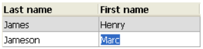
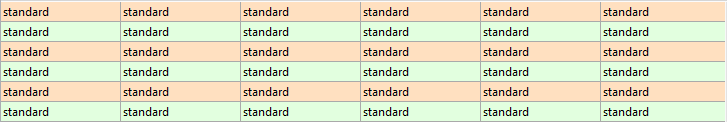
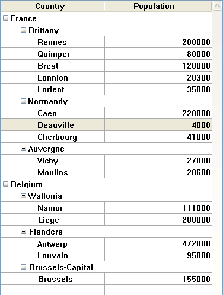
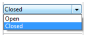

## Generalidades

Los list boxes son objetos activos complejos que permiten mostrar e introducir datos en forma de columnas sincronizadas. Pueden vincularse a contenidos de la base de datos, como selecciones de entidades y secciones de registros, o a cualquier contenido del lenguaje, como colecciones y arrays. Incluyen funciones avanzadas relativas a la entrada de datos, la ordenación de columnas, la gestión de eventos, el aspecto personalizado, el desplazamiento de columnas, etc.


Un list box contiene una o varias columnas cuyo contenido se sincroniza automáticamente. El número de columnas es, en teoría, ilimitado (depende de los recursos de la máquina).

### Principios de utilización básicos

Durante la ejecución, los list box permiten visualizar e introducir datos en forma de listas. Para hacer que una celda sea editable ([si se permite la entrada para la columna](#managing-entry)), basta con pulsar dos veces sobre el valor que contiene:



Los usuarios pueden introducir y mostrar el texto en varias líneas dentro de una celda de list box. Para añadir un salto de línea, presione **Ctrl+Retorno de carro** en Windows o **Opción+Retorno de carro** en macOS.

En las celdas se pueden mostrar booleanos e imágenes, así como fechas, horas o números. Es posible ordenar los valores de las columnas haciendo clic en un encabezado ([ordenación estándar](#managing-sorts)). Todas las columnas se sincronizan automáticamente.

También es posible cambiar el tamaño de cada columna, y el usuario puede modificar el orden de las [columnas](properties_ListBox.md#locked-columns-and-static-columns) y [líneas](properties_Action.md#movable-rows) moviéndolas con el ratón, si esta acción está autorizada. Tenga en cuenta que los list box se pueden utilizar en [modo jerárquico](#hierarchical-list-boxes).

El usuario puede seleccionar una o varias líneas utilizando los atajos estándar: **Mayúsculas+clic** para una selección adyacente y **Ctrl+clic** (Windows) o **Comando+clic** (macOS) para una selección no adyacente.

### Partes de list box

Un list box se compone de cuatro partes distintas:

* el objeto list box en su totalidad,
* las columnas,
* los encabezados de las columnas, y
* los pies de las columnas.


Cada parte tiene su propio nombre y propiedades específicas. Por ejemplo, el número de columnas o el color alternativo de cada línea se define en las propiedades del objeto list box, el ancho de cada columna se define en las propiedades de las columnas y el tipo de fuente del encabezado se define en las propiedades de los encabezados.

Es posible añadir un método objeto al objeto list box y/o a cada columna del list box. Los métodos objeto se llaman en el siguiente orden:

1. Método objeto de cada columna
2. Método objeto del list box

El método objeto de columna obtiene los eventos que se producen en su [encabezado](#list-box-headers) y [pie](#list-box-footers).

### Tipos de list box

Hay varios tipos de list box, con sus propios comportamientos y propiedades específicas. El tipo de list box depende de su [propiedad Fuente de datos](properties_Object.md#data-source):

* **Arrays**: cada columna está ligada a un array 4D. Los list boxes basados en arrays pueden mostrarse como [cajas de lista jerárquicas](listbox_overview.md#hierarchical-list-boxes).
* **Selección** (**Selección actual** o **Selección con nombre**): cada columna está vinculada a una expresión (por ejemplo, un campo) que se evalúa para cada registro de la selección.
* **Collection o Entity selection**: cada columna está ligada a una expresión que se evalúa para cada elemento de la colección o cada entidad de la selección de entidades.
> No es posible combinar diferentes tipos de list box en el mismo objeto list box. La fuente de datos se define cuando se crea el list box. Entonces ya no es posible modificarlo por programación.

### Gestión de list boxes

Se puede configurar completamente un objeto list box a través de sus propiedades, y también se puede gestionar dinámicamente por programación.

El lenguaje 4D incluye un tema "List Box" dedicado a los comandos de list box, pero los comandos de otros temas, tales como "Propiedades de los objetos" o los comandos `EDIT ITEM` y `Displayed line number` también pueden ser utilizados. Para mayor información consulte la página [List Box Commands Summary](https://doc.4d.com/4Dv17R6/4D/17-R6/List-Box-Commands-Summary.300-4311159.en.html) del manual *Lenguaje 4D*.

## Objetos tipo List box

### List box de tipo array

En un list box de tipo array, cada columna debe estar asociada a un array unidimensional 4D; se pueden utilizar todos los tipos de array, a excepción de los arrays de punteros. El número de líneas se basa en el número de elementos del array.

Por defecto, 4D asigna el nombre "ColumnX" a cada columna. Puede cambiarlo, así como las otras propiedades de la columna, en las [propiedades de las columnas](listbox_overview.md#column-specific-properties). El formato de visualización de cada columna también puede definirse mediante el comando `OBJECT SET FORMAT`.
> Los list boxes de tipo array pueden mostrarse en [modo jerárquico](listbox_overview.md#hierarchical-list-boxes), con mecanismos específicos.

Con los list box de tipo array, los valores introducidos o mostrados se gestionan utilizando el lenguaje 4D. También puede asociar una [lista de opciones](properties_DataSource.md#choice-list) con una columna para controlar la entrada de datos. Los valores de las columnas se gestionan mediante comandos de alto nivel del tema List box (como `LISTBOX INSERT ROWS` o `LISTBOX DELETE ROWS`), así como comandos de manipulación de arrays. Por ejemplo, para inicializar el contenido de una columna, puede utilizar la siguiente instrucción:

```4d
ARRAY TEXT(varCol;size)
```

También puede utilizar una lista:

```4d
LIST TO ARRAY("ListName";varCol)
```
> **Atención**: cuando un objeto List box contiene varias columnas de diferentes tamaños, sólo se mostrará el número de elementos del array (columna) más pequeño. Debe asegurarse de que cada array tenga el mismo número de elementos que los demás. Además, si una columna del list box está vacía (esto ocurre cuando el array asociado no fue declarado o dimensionado correctamente con el lenguaje), el list box no muestra nada.

### List box de tipo selección

En este tipo de list box, cada columna puede estar asociada a un campo (por ejemplo `[Employees]LastName)` o a una expresión. La expresión puede basarse en uno o más campos (por ejemplo, `[Employees]FirstName+" "[Employees]LastName`) o puede ser simplemente una fórmula (por ejemplo `String(Milliseconds)`). La expresión también puede ser un método proyecto, una variable o un elemento de array. Puede utilizar los comandos `LISTBOX SET COLUMN FORMULA` y `LISTBOX INSERT COLUMN FORMULA` para modificar las columnas por programación.

A continuación, el contenido de cada línea se evalúa en función de una selección de registros: la **selección actual** de una tabla o una **selección temporal**.

En el caso de un list box basado en la selección actual de una tabla, cualquier modificación realizada desde la base de datos se refleja automáticamente en el list box, y viceversa. Por lo tanto, la selección actual es siempre la misma en ambos lugares.

### List box colección o entity selection

En este tipo de list box, cada columna debe estar asociada a una expresión. El contenido de cada línea se evalúa entonces por elemento de la colección o por entidad de la selección de entidades.

Cada elemento de la colección o cada entidad está disponible como un objeto al que se puede acceder a través de comando [This](https://doc.4d.com/4Dv17R6/4D/17-R6/This.301-4310806.en.html). Una expresión de columna puede ser un método proyecto, una variable o cualquier fórmula, accediendo a cada entidad u objeto elemento de colección a través de `This`, por ejemplo `This.<propertyPath>` (o `This.value` en el caso de una colección de valores escalares). Puede utilizar los comandos `LISTBOX SET COLUMN FORMULA` y `LISTBOX INSERT COLUMN FORMULA` para modificar las columnas por programación.

Cuando la fuente de datos es una entity selection, cualquier modificación realizada del lado del list box se guarda automáticamente en la base de datos. Por otro lado, las modificaciones realizadas en la base de datos son visibles en el list box después de que se hayan recargado las entidades modificadas.

Cuando la fuente de datos es una colección, toda modificación realizada en los valores del list box se refleja en la colección. When the data source is a collection, any modifications made in the list box values are reflected in the collection. Por ejemplo:

```4d
myCol:=myCol.push("new value") //mostrar el nuevo valor en el list box
```

### Propiedades soportadas

Las propiedades soportadas dependen del tipo de list box.

| Propiedad                                                                                 | List box array | List box selección | List box colección o entity selection |
| ----------------------------------------------------------------------------------------- | -------------- | ------------------ | ------------------------------------- |
| [Color de fondo alternado](properties_BackgroundAndBorder.md#alternate-background-color)  | X              | X                  | X                                     |
| [Color de fondo](properties_BackgroundAndBorder.md#background-color--fill-color)          | X              | X                  | X                                     |
| [Negrita](properties_Text.md#bold)                                                        | X              | X                  | X                                     |
| [Expresión color de fondo](properties_BackgroundAndBorder.md#background-color-expression) |                | X                  | X                                     |
| [Estilo del borde](properties_BackgroundAndBorder.md#border-line-style)                   | X              | X                  | X                                     |
| [Abajo](properties_CoordinatesAndSizing.md#bottom)                                        | X              | X                  | X                                     |
| [Class](properties_Object.md#css-class)                                                   | X              | X                  | X                                     |
| [Collection o entity selection](properties_Object.md#collection-or-entity-selection)      |                | X                  | X                                     |
| [Redimensionamiento columnas auto](properties_ResizingOptions.md#column-auto-resizing)    | X              | X                  | X                                     |
| [Elemento actual](properties_DataSource.md#current-item)                                  |                |                    | X                                     |
| [Posición elemento actual](properties_DataSource.md#current-item-position)                |                |                    | X                                     |
| [Fuente de datos](properties_Object.md#data-source)                                       | X              | X                  | X                                     |
| [Nombre formulario detallado](properties_ListBox.md#detail-form-name)                     |                | X                  |                                       |
| [Mostrar encabezados](properties_Headers.md#display-headers)                              | X              | X                  | X                                     |
| [Mostrar pies](properties_Footers.md#display-footers)                                     | X              | X                  | X                                     |
| [Doble clic en línea](properties_ListBox.md#double-click-on-row)                          |                | X                  |                                       |
| [Arrastrable](properties_Action.md#droppable)                                             | X              | X                  | X                                     |
| [Soltable](properties_Action.md#droppable)                                                | X              | X                  | X                                     |
| [Focusable](properties_Entry.md#focusable)                                                | X              | X                  | X                                     |
| [Fuente](properties_Text.md#font)                                                         | X              | X                  | X                                     |
| [Color de fuente](properties_Text.md#font-color)                                          | X              | X                  | X                                     |
| [Expresión color fuente](properties_Text.md#font-color-expression)                        |                | X                  | X                                     |
| [Tamaño fuente](properties_Text.md#font-size)                                             | X              | X                  | X                                     |
| [Alto (list box)](properties_CoordinatesAndSizing.md#height)                              | X              | X                  | X                                     |
| [Alto (encabezados)](properties_Headers.md#height)                                        | X              | X                  | X                                     |
| [Alto (pies)](properties_Footers.md#height)                                               | X              | X                  | X                                     |
| [Ocultar líneas vacías finales](properties_BackgroundAndBorder.md#hide-extra-blank-rows)  | X              | X                  | X                                     |
| [Ocultar rectángulo de enfoque](properties_Appearance.md#hide-focus-rectangle)            | X              | X                  | X                                     |
| [Ocultar resaltado selección](properties_Appearance.md#hide-selection-highlight)          | X              | X                  | X                                     |
| [List box jerárquico](properties_Object.md#array-list-box)                                | X              |                    |                                       |
| [Conjunto resaltado](properties_ListBox.md#highlight-set)                                 |                | X                  |                                       |
| [Alineación horizontal](properties_Text.md#horizontal-alignment)                          | X              | X                  | X                                     |
| [Color líneas horizontales](properties_Gridlines.md#horizontal-line-color)                | X              | X                  | X                                     |
| [Barra de desplazamiento horizontal](properties_Appearance.md#horizontal-scroll-bar)      | X              | X                  | X                                     |
| [Dimensionamiento horizontal](properties_ResizingOptions.md#horizontal-sizing)            | X              | X                  | X                                     |
| [Itálica](properties_Text.md#italic)                                                      | X              | X                  | X                                     |
| [Izquierda](properties_CoordinatesAndSizing.md#left)                                      | X              | X                  | X                                     |
| [Tabla principal](properties_DataSource.md#master-table)                                  |                | X                  |                                       |
| [Meta info expression](properties_Text.md#meta-info-expression)                           |                |                    | X                                     |
| [Método](properties_Action.md#method)                                                     | X              | X                  | X                                     |
| [Líneas desplazables](properties_Action.md#movable-rows)                                  | X              |                    |                                       |
| [Selección temporal](properties_DataSource.md#selection-name)                             |                | X                  |                                       |
| [Número de columnas](properties_ListBox.md#number-of-columns)                             | X              | X                  | X                                     |
| [Número de columnas bloqueadas](properties_ListBox.md#number-of-locked-columns)           | X              | X                  | X                                     |
| [Número de columnas estáticas](properties_ListBox.md#number-of-static-columns)            | X              | X                  | X                                     |
| [Nombre del objeto](properties_Object.md#object-name)                                     | X              | X                  | X                                     |
| [Derecha](properties_CoordinatesAndSizing.md#right)                                       | X              | X                  | X                                     |
| [Array colores de fondo](properties_BackgroundAndBorder.md#row-background-color-array)    | X              |                    |                                       |
| [Array de control de líneas](properties_ListBox.md#row-control-array)                     | X              |                    |                                       |
| [Array colores de fuente](properties_Text.md#row-font-color-array)                        | X              |                    |                                       |
| [Altura de las líneas](properties_CoordinatesAndSizing.md#row-height)                     | X              |                    |                                       |
| [Array altura de las líneas](properties_CoordinatesAndSizing.md#row-height-array)         | X              |                    |                                       |
| [Array de estilos](properties_Text.md#row-style-array)                                    | X              |                    |                                       |
| [Elementos seleccionados](properties_DataSource.md#selected-items)                        |                |                    | X                                     |
| [Modo de selección](properties_ListBox.md#selection-mode)                                 | X              | X                  | X                                     |
| [Edición con un solo clic](properties_Entry.md#single-click-edit)                         | X              | X                  | X                                     |
| [Ordenable](properties_Action.md#sortable)                                                | X              | X                  | X                                     |
| [Acción estándar](properties_Action.md#standard-action)                                   | X              |                    |                                       |
| [Expresión estilo](properties_Text.md#style-expression)                                   |                | X                  | X                                     |
| [Arriba](properties_CoordinatesAndSizing.md#top)                                          | X              | X                  | X                                     |
| [Transparente](properties_BackgroundAndBorder.md#transparent)                             | X              | X                  | X                                     |
| [Tipo](properties_Object.md#type)                                                         | X              | X                  | X                                     |
| [Subrayado](properties_Text.md#underline)                                                 | X              | X                  | X                                     |
| [Variable o expresión](properties_Object.md#variable-or-expression)                       | X              | X                  |                                       |
| [Alineamiento vertical](properties_Text.md#vertical-alignment)                            | X              | X                  | X                                     |
| [Color líneas verticales](properties_Gridlines.md#vertical-line-color)                    | X              | X                  | X                                     |
| [Barra de desplazamiento vertical](properties_Appearance.md#vertical-scroll-bar)          | X              | X                  | X                                     |
| [Dimensionamiento vertical](properties_ResizingOptions.md#vertical-sizing)                | X              | X                  | X                                     |
| [Visibilidad](properties_Display.md#visibility)                                           | X              | X                  | X                                     |
| [Ancho](properties_CoordinatesAndSizing.md#width)                                         | X              | X                  | X                                     |

> Las columnas, los encabezados y los pies de list box soportan propiedades específicas.

## Columnas de list box

Un list box está formado por uno o varios objetos columna que tienen propiedades específicas. Puede seleccionar una columna de list box en el editor de formularios haciendo clic en ella cuando el objeto list box está seleccionado:


Puede definir para cada columna de list box de las propiedades estándar (texto, color de fondo, etc.); estas propiedades tienen prioridad sobre las del objeto list box.
> Puede definir el [tipo de expresión](properties_Object.md#expression-type) para las columnas de list box de tipo array (cadena, texto, número, fecha, hora, imagen, booleano u objeto). The use of object arrays requires a 4D View Pro licence (see [Object arrays in columns (4D View Pro)](#object-arrays-in-columns-4d-view-pro)).

### Propiedades específicas de la columna

[Formato Alfa](properties_Display.md#alpha-format) - [Alternar color de fondo](properties_BackgroundAndBorder.md#alternate-background-color) - [Altura de fila automática](properties_CoordinatesAndSizing.md#automatic-row-height) - [Expresión del color de fondo](properties_BackgroundAndBorder.md#background-color-expression) - [Negrita](properties_Text.md#bold) - [Lista de opciones](properties_DataSource.md#choice-list) - [Clase](properties_Object.md#css-class) - [Tipo de datos (columna del list box de selección y colección)](properties_DataSource.md#data-type) - [Formato Fecha](properties_Display.md#date-format) - [Valores por defecto](properties_DataSource.md#default-list-of-values) - [Tipo de pantalla](properties_Display.md#display-type) - [Editable](properties_Entry.md#enterable) - [Filtro de entrada](properties_Entry.md#entry-filter) - [Lista de excluidos](properties_RangeOfValues.md#excluded-list) - [Expresión](properties_DataSource.md#expression) - [Tipo de expresión (columna array list box)](properties_Object.md#expression-type) - [Fuente](properties_Text.md#font) - [Color de fuente](properties_Text.md#font-color) - [Footer](#list-box-footers) - [Encabezado](#list-box-headers) - [Alineación horizontal](properties_Text.md#horizontal-alignment) - [Itálica](properties_Text.md#italic) - [Invisible](properties_Display.md#visibility) - [Ancho máximo](properties_CoordinatesAndSizing.md#maximum-width) - [Método](properties_Action.md#method) - [Ancho mínimo](properties_CoordinatesAndSizing.md#minimum-width) - [Multiestilo](properties_Text.md#multi-style) - [Formato numérico](properties_Display.md#number-format) - [Nombre del objeto](properties_Object.md#object-name) - [Formato de imagen](properties_Display.md#picture-format) - [Redimensionable](properties_ResizingOptions.md#resizable) - [Lista obligatoria](properties_RangeOfValues.md#required-list) - [Array color de fondo de fila](properties_BackgroundAndBorder.md#row-background-color-array) - [Array color de fuente de fila](properties_Text.md#row-font-color-array) - [Array estilo de fila](properties_Text.md#row-style-array) - [Guardar como](properties_DataSource.md#save-as) - [Expresión de estilo](properties_Text.md#style-expression) - [Texto cuando False/Texto cuando True](properties_Display.md#text-when-falsetext-when-true) - [Formato Hora](properties_Display.md#time-format) - [Truncar con elipsis](properties_Display.md#truncate-with-ellipsis) - [Subraye](properties_Text.md#underline) - [Variable o Expresión](properties_Object.md#variable-or-expression) - [Alineación vertical](properties_Text.md#vertical-alignment) - [Ancho](properties_CoordinatesAndSizing.md#width) - [Ajuste de texto](properties_Display.md#wordwrap)

## Encabezados de list box

> Para poder acceder a las propiedades de los pies de un list box, debe activar la opción [Mostrar pies](properties_Footers.md#display-footers).

Cuando se muestran los encabezados, puede seleccionar un encabezado en el editor de formularios haciendo clic en él cuando el objeto List box esté seleccionado:


Puede definir propiedades de texto estándar para cada encabezado de columna de List box; en este caso, estas propiedades tienen prioridad sobre las de la columna o del propio List box.

Además, tiene acceso a las propiedades específicas de los encabezados. En particular, se puede mostrar un icono en el encabezado junto al título de la columna o en su lugar, por ejemplo, cuando se realizan [ordenaciones personalizadas](#managing-sorts).


Al momento de la ejecución, los eventos que se producen en un encabezado se generan en el [método objeto de la columna de list box](properties_Action.md#method).

Cuando el comando `OBJECT SET VISIBLE` se utiliza con un encabezado, se aplica a todos los encabezados, independientemente del elemento individual definido por el comando. Por ejemplo, `OBJECT SET VISIBLE(*; "header3";False)` ocultará todos los encabezados del objeto list box al que pertenece *header3* y no simplemente este encabezado.

#### Gramática JSON

| Nombre | Tipos de datos | Valores posibles             |
| ------ | -------------- | ---------------------------- |
| header | object         | header properties and values |


### Propiedades específicas de los encabezados

[Negrita](properties_Text.md#bold) - [Clase Css](properties_Object.md#css-class) - [Fuente](properties_Text.md#font) - [Color de fuente](properties_Text.md#font-color) - [Mensaje de ayuda](properties_Help.md#help-tip) - [Alineación horizontal](properties_Text.md#horizontal-alignment) - [Icon Location](properties_TextAndPicture.md#icon-location) - [Itálica](properties_Text.md#italic) - [Nombre de objeto](properties_Object.md#object-name) - [Ruta de acceso](properties_TextAndPicture.md#picture-pathname) - [Título](properties_Object.md#title) - [Subrayado](properties_Text.md#underline) - [Variable o Expresión](properties_Object.md#variable-or-expression) - [Alineación vertical](properties_Text.md#vertical-alignment) - [Ancho](properties_CoordinatesAndSizing.md#width)

## Pies de list box
> Para poder acceder a las propiedades de los encabezados de un list box, debe activar la opción [Mostrar encabezados](properties_Headers.md#display-headers) del list box.

Los List box pueden contener "pies de página" no editables, que muestren información adicional. En el caso de los datos mostrados en forma de tabla, los pies de página suelen utilizarse para mostrar cálculos como los totales o los promedios.

Cuando se muestran los pies, puede hacer clic para seleccionar un pie de list box en el editor de formularios haciendo clic en el objeto:


Para cada pie de columna de list box, puede definir propiedades de texto estándar: en este caso, estas propiedades tienen prioridad sobre las de la columna o del list box. También puede acceder a propiedades específicas para los pies de página. En particular, puede insertar un [cálculo personalizado o automático](properties_Object.md#variable-calculation).

Al momento de la ejecución, los eventos que se producen en un pie de página se generan en el [método objeto de la columna de list box](properties_Action.md#method).

Cuando el comando `OBJECT SET VISIBLE` se utiliza con un pie de página, se aplica a todos los pies, independientemente del elemento individual definido por el comando. Por ejemplo, `OBJECT SET VISIBLE(*; "footer3";False)` ocultará todos los pies de página del objeto list box al que pertenece *footer3* y no simplemente este pie de página.

#### Gramática JSON

| Nombre | Tipos de datos | Valores posibles             |
| ------ | -------------- | ---------------------------- |
| footer | object         | Footer properties and values |


### Propiedades específicas de los pies

[Formato alfa](properties_Display.md#alpha-format) - [Color de fondo](properties_BackgroundAndBorder.md#background-color--fill-color) - [Negrita](properties_Text.md#bold) - [Clase](properties_Object.md#css-class) - [Formato Fecha](properties_Display.md#date-format) - [Tipo de expresión](properties_Object.md#expression-type) - [Fuente](properties_Text.md#font) - [Color de fuente](properties_Text.md#font-color) - [Ayuda](properties_Help.md#help-tip) - [Alineación horizontal](properties_Text.md#horizontal-alignment) - [Itálica](properties_Text.md#italic) - [Formato numérico](properties_Display.md#number-format) - [Nombre del objeto](properties_Object.md#object-name) - [Formato Imagen](properties_Display.md#picture-format) - [Formato Hora](properties_Display.md#time-format) - [Truncar con elipsis](properties_Display.md#truncate-with-ellipsis) - [Subrayar](properties_Text.md#underline) - [Cálculo de variables](properties_Object.md#variable-calculation) - [Variable o Expresión](properties_Object.md#variable-or-expression) - [Alineación vertical](properties_Text.md#vertical-alignment) - [Ancho](properties_CoordinatesAndSizing.md#width) - [Ajustar palabras](properties_Display.md#wordwrap)

## Gestión de entrada

Para que una celda de list box sea editable, deben cumplirse las dos condiciones siguientes:

* La columna de la celda debe haberse definido como [Enterable](properties_Entry.md#enterable) (de lo contrario, las celdas de la columna nunca podrán ser editables).
* En el evento `On Before Data Entry`, $0 no devuelve -1. Cuando el cursor llega a la celda, se genera el evento `On Before Data Entry` en el método de la columna. Si, en el contexto de este evento, $0 se define como -1, la celda se considera como no editable. Si el evento se generó después de presionar **Tab** o **Mayús+Tab**, el foco pasa a la siguiente celda o a la anterior, respectivamente. Si $0 no es -1 (por defecto $0 es 0), la celda se puede introducir y pasa al modo de edición.

Consideremos el ejemplo de un list box que contiene dos arrays, uno fecha y otro texto. El array de la fecha no se puede introducir, pero el array del texto sí se puede introducir si la fecha no ha pasado.


Aquí está el método de la columna *arrText*:

```4d
 Case of
    :(Form event=On Before Data Entry) // una celda obtiene el foco
     LISTBOX GET CELL POSITION(*;"lb";$col;$row)
  // identification of cell
       If(arrDate{$row}<Current date) // si la fecha es anterior a hoy
          $0:=-1 // la celda NO  es editable
       Else
  // de lo contrario, la celda es editable
       End if
 End case
```

El evento `On Before Data Entry` se devuelve antes de `On Getting Focus`.

Para preservar la coherencia de los datos para los list box de tipo de selección y selección de entidades, todo registro/entidad modificado se guarda automáticamente en cuanto se valida la celda, es decir:

* cuando se desactiva la celda (el usuario presiona el tabulador, hace clic, etc.)
* cuando el listbox ya no tiene el foco,
* cuando el formulario ya no tiene el foco.

La secuencia típica de eventos generados durante la entrada o la modificación de datos es la siguiente:

| Acción                                                                                | Tipo(s) de Listbox                      | Secuencia de eventos                                                                                                                                                                                                                       |
| ------------------------------------------------------------------------------------- | --------------------------------------- | ------------------------------------------------------------------------------------------------------------------------------------------------------------------------------------------------------------------------------------------ |
| Una celda pasa al modo edición (acción del usuario o llamada del comando `EDIT ITEM`) | Todos                                   | On Before Data Entry                                                                                                                                                                                                                       |
|                                                                                       | Todos                                   | On Getting Focus                                                                                                                                                                                                                           |
| Cuando se ha editado el valor de una celda                                            | Todos                                   | On Before Keystroke                                                                                                                                                                                                                        |
|                                                                                       | Todos                                   | On After Keystroke                                                                                                                                                                                                                         |
|                                                                                       | Todos                                   | On After Edit                                                                                                                                                                                                                              |
| Un usuario valida y abandona la celda                                                 | List box de tipo selección              | Guardar                                                                                                                                                                                                                                    |
|                                                                                       | List box de tipo selección de registro  | Activación de On saving an existing record (si definido)                                                                                                                                                                                   |
|                                                                                       | List box de tipo selección              | On Data Change(*)                                                                                                                                                                                                                          |
|                                                                                       | List box de tipo selección de entidades | La entidad se guarda con la opción automerger, bloqueo optimista (ver entity.save( )). En caso de guardar con éxito, la entidad se refresca con la última actualización realizada. Si la operación de guardado falla, se mostrará un error |
|                                                                                       | Todos                                   | On Losing Focus                                                                                                                                                                                                                            |

(*) Con los list box de tipo selección de entidades, en el evento On Data Change:

* el objeto [elemento actual](properties_DataSource.md#element-courant) contiene el valor antes de la modificación.
* el objeto `This` contiene el valor modificado.

> La entrada de datos en los list box de tipo colección/selección de entidades tiene una limitación cuando la expresión se evalúa como nula. En este caso, no es posible editar o eliminar el valor nulo en la celda.

## Gestión de selecciones

La gestión de selecciones es diferente dependiendo de si el list box se basa en un array, en una selección de registros o en una selección de colecciones/entidades:

* **Lista box de tipo selección**: las selecciones se gestionan mediante un conjunto llamado por defecto `$ListboxSetX` (donde X empieza en 0 y se incrementa en función del número de list box en el formulario), que puede modificar si es necesario. Este conjunto se [define en las propiedades](properties_ListBox.md#highlight-set) del list box. Es mantenido automáticamente por 4D: si el usuario selecciona una o más líneas en el list box, el conjunto se actualiza inmediatamente. Por otra parte, también es posible utilizar los comandos del tema "Conjuntos" para modificar por programación la selección en el list box.

* **List box de tipo colección/selección de entidades**: las selecciones se gestionan a través de las propiedades del list box dedicado:
  * [Elemento actual](properties_DataSource.md#current-item) es un objeto que recibirá el elemento/la entidad seleccionado(a)
  * [Selected Items](properties_DataSource.md#selected-items) is a collection/entity selection object of selected items
  * [Posición del elemento actual](properties_DataSource.md#current-item-position) devuelve la posición del elemento o de la entidad seleccionada.

* **List box de tipo array**: el comando `LISTBOX SELECT ROW` puede utilizarse para seleccionar una o más líneas del list box por programación. La [variable asociada al objeto List box](propiedades_Objeto.md#variable-o-expresión) se utiliza para obtener, definir o almacenar las selecciones de líneas en el objeto. Esta variable corresponde a un array de booleanos que es creado y mantenido automáticamente por 4D. El tamaño de este array viene determinado por el tamaño del list box: contiene el mismo número de elementos que el array más pequeño asociado a las columnas. Cada elemento de este array contiene `True` si se selecciona la línea correspondiente y `False` en caso contrario. 4D actualiza el contenido de este array en función de las acciones del usuario. Por el contrario, puede cambiar el valor de los elementos del array para cambiar la selección en el list box. Por otra parte, no se pueden insertar ni borrar líneas en este array; tampoco se pueden reescribir las líneas. El comando `Count in array` puede utilizarse para averiguar el número de líneas seleccionadas. Por ejemplo, este método permite invertir la selección de la primera línea del list box (tipo array):

```4d
 ARRAY BOOLEAN(tBListBox;10)
  //tBListBox es el nombre de la variable asociada al list box en el formulario
 If(tBListBox{1}=True)
    tBListBox{1}:=False
 Else
    tBListBox{1}:=True
 End if
```

> El comando `OBJECT SET SCROLL POSITION` se desplaza por las líneas del list box para que se muestre la primera línea seleccionada o una línea especificada.

### Personalizar la apariencia de las líneas seleccionadas

Cuando la opción [Ocultar el resaltado de la selección](properties_Appearance.md#hide-selection-highlight) está seleccionada, debe gestionar la representación visual de las selecciones en el list box utilizando las opciones de interfaz disponibles. Dado que las selecciones siguen siendo gestionadas en su totalidad por 4D, esto significa:

* En el caso de los list box de tipo array, debe analizar la variable array booleana asociada al list box para determinar qué líneas están seleccionadas o no.
* Para los list box de tipo selección, hay que comprobar si el registro actual (línea) pertenece al conjunto especificado en la propiedad [Conjunto resaltado](properties_ListBox.md#highlight-set) del list box.

A continuación, puede definir por programación los colores de fondo, los colores y/o estilos de fuentes específicas para personalizar la apariencia de las líneas seleccionadas. Esto puede hacerse utilizando arrays o expresiones, en función del tipo de list box mostrado (ver las siguientes secciones).

> Puede utilizar la constante `lk inherited` para aplicar la apariencia actual del list box (por ejemplo, el color de la fuente, el color de fondo, el estilo de la fuente, etc.).

#### List box de tipo selección

Para determinar qué líneas están seleccionadas, hay que comprobar si están incluidas en el conjunto indicado en la propiedad [Conjunto resaltado](properties_ListBox.md#highlight-set) del list box. A continuación, puede definir la apariencia de las líneas seleccionadas utilizando una o varias de las [propiedades de expresión de color o estilo](#using-arrays-and-expressions) relevantes.

Tenga en cuenta que las expresiones se reevalúan automáticamente cada vez que:

* la selección de list box cambia.
* list box obtiene o pierde el foco.
* la ventana formulario que contiene el list box se convierte, o deja de ser, la ventana del primer plano.

#### List box de tipo array

Tiene que analizar el array booleano [Variable o expresión](properties_Object.md#variable-or-expression) asociado al list box para determinar si las líneas están seleccionadas o no.

A continuación, puede definir la apariencia de las líneas seleccionadas utilizando una o varias de las [propiedades de array de color o de estilo](#using-arrays-and-expressions) relevantes.

Tenga en cuenta que los arrays de list box utilizados para definir la apariencia de las líneas seleccionadas deben recalcularse en el evento formulario `On Selection Change`; sin embargo, también puede modificar estos arrays basándose en los siguientes eventos formulario adicionales:

* `On Getting Focus` (propiedad list box)
* `On Losing Focus` (propiedad list box)
* `On Activate` (propiedad list box)
* `On Deactivate` (form property) ...depending on whether and how you want to visually represent changes of focus in selections.

##### Ejemplo

Ha elegido ocultar el resaltado sistema y desea mostrar las selecciones en el list box con un color de fondo verde, como se muestra aquí:


Para un list box de tipo array, es necesario actualizar el [Array colores de fondo](properties_BackgroundAndBorder.md#row-background-color-array) por programación. En el formulario JSON, ha definido el Array colores de fondo de línea para el list box:

```
 "rowFillSource": "_ListboxBackground",
```

En el método objeto del list box, puede escribir:

```4d
 Case of
    :(Form event=On Selection Change)
       $n:=Size of array(LB_Arrays)
       ARRAY LONGINT(_ListboxBackground;$n) // colores de fondo de la línea
       For($i;1;$n)
          If(LB_Arrays{$i}=True) // selected
             _ListboxBackground{$i}:=0x0080C080 // fondo verde
          Else // not selected
             _ListboxBackground{$i}:=lk inherited
          End if
       End for
 End case
```

Con un list box de tipo selección, para producir el mismo efecto puede utilizar un método para actualizar la propiedad [Expresión color de fondo](properties_BackgroundAndBorder.md#background-color-expression) basado en el conjunto designado por la propiedad [Conjunto resaltado](properties_ListBox.md#highlight-set).

Por ejemplo, en el formulario JSON, ha definido el conjunto resaltado y la expresión de color de fondo siguientes para el list box:

```
 "highlightSet": "$SampleSet",
 "rowFillSource": "UI_SetColor",
```

Puede escribir en el método *UI_SetColor*:

```4d
 If(Is in set("$SampleSet"))
    $color:=0x0080C080 // fondo verde
 Else
    $color:=lk inherited
 End if

 $0:=$color
```

> En los list box jerárquicos, las líneas de ruptura no pueden resaltarse cuando la opción [Ocultar resaltado selección](properties_Appearance.md#hide-selection-highlight) está seleccionada. Como no es posible tener colores distintos para los encabezados del mismo nivel, no hay manera de destacar una línea de ruptura específica por programación.

## Gestión de ordenaciones

Por defecto, un list box gestiona automáticamente ordenaciones de columnas estándar cuando se hace clic en el encabezado. Una ordenación estándar es una ordenación alfanumérica de los valores de las columnas, alternativamente ascendente/descendente con cada clic sucesivo. Todas las columnas siempre se sincronizan automáticamente.

Puede evitar la ordenación estándar de usuario desmarcando la propiedad [Ordenable](properties_Action.md#sortable) del list box.

El desarrollador puede configurar ordenaciones personalizadas utilizando el comando `LISTBOX SORT COLUMNS` y/o combinando los eventos de formulario `On Header Click` y `On After Sort` (ver el comando `FORM Event`) y los comandos 4D relevantes.

> La propiedad [Ordenable](properties_Action.md#sortable) sólo afecta a las ordenaciones estándar de usuario; el comando `LISTBOX SORT COLUMNS` no tiene en cuenta esta propiedad.

El valor de la [variable asociada al encabezado de una columna](properties_Object.md#variable-or-expression) permite gestionar una información adicional: la ordenación actual de la columna (lectura) y la visualización de la flecha de ordenación.

* Si la variable se pone en 0, la columna no se ordena y la flecha de ordenación no se muestra;  
  

* Si la variable está en 1, la columna se ordena en orden ascendente y se muestra la flecha de ordenación;  
  

* Si la variable se establece en 2, la columna se clasifica en orden descendente y se muestra la flecha de clasificación.  
  

Puede definir el valor de la variable (por ejemplo, Header2:=2) para “forzar” la visualización de la flecha de ordenación. En este caso no se modifica la ordenación por columnas en sí, sino que es el desarrollador quien debe encargarse de ello.

> El comando `OBJECT SET FORMAT` ofrece soporte específico para iconos en los encabezados de list box, lo que puede ser útil cuando se desea trabajar con un icono de ordenación personalizado.

## Gestión de los colores, estilos y visualización de las líneas

Hay varias formas de definir los colores de fondo, los colores de fuente y los estilos de fuente en los list box:

* al nivel de las [propiedades del objeto list box](#list-box-objects),
* a nivel de las [propiedades de la columna](#list-box-columns),
* utilizando los [arrays o expresiones](#using-arrays-and-expressions) para el list box y/o para cada columna,
* a nivel del texto de cada celda (si [texto multi-estilo](properties_Text.md#multi-style)).

### Prioridad & herencia

Los principios de prioridad y de herencia se observan cuando la misma propiedad se define en más de un nivel.

| Nivel de prioridad | Ubicación del parámetro                                                                  |
| ------------------ | ---------------------------------------------------------------------------------------- |
| alta prioridad     | Celda (si texto multiestilo)                                                             |
|                    | Arrays de columnas/métodos                                                               |
|                    | Arrays/métodos de Listbox                                                                |
|                    | Propiedades de la columna                                                                |
|                    | Propiedades de list box                                                                  |
| baja prioridad     | Expresiones de metainformación (para colecciones o list boxes de selección de entidades) |

Por ejemplo, si define un estilo de fuente en las propiedades del list box y otro mediante un array de estilos para la columna, se tendrá en cuenta este último.

Para cada atributo (estilo, color y color de fondo), se implementa una **herencia** cuando se utiliza el valor por defecto:

* para los atributos de las celdas: valores de atributos de las líneas
* para los atributos líneas: valores de atributos de columnas
* para los atributos de la columna: valores de los atributos del list box

De esta forma, si desea que un objeto herede el valor de atributo de un nivel superior, puede utilizar pasar la constante `lk inherited` (valor por defecto) al comando de definición o directamente en el elemento del array de estilo/color correspondiente. Por ejemplo, dado un list box array que contiene un estilo de letra estándar con colores alternos: 

Realiza las siguientes modificaciones:

* cambiar el fondo de la línea 2 a rojo utilizando la propiedad [Row Background Color Array](properties_BackgroundAndBorder.md#row-background-color-array) del objeto list box,
* cambia el estilo de la línea 4 a cursiva utilizando la propiedad [Row Style Array](properties_Text.md#row-style-array) del objeto list box,
* dos elementos de la columna 5 se cambian a negrita utilizando la propiedad [Row Style Array](properties_Text.md#row-style-array) del objeto columna 5,
* los 2 elementos de la columna 1 y 2 se cambian a azul oscuro utilizando la propiedad [Row Background Color Array](properties_BackgroundAndBorder.md#row-background-color-array) para los objetos de la columna 1 y 2:


Para restaurar la apariencia original de la caja del list box, puede:

* pasar la constante `lk inherited` en el elemento 2 de los arrays de color de fondo de las columnas 1 y 2: entonces heredan el color de fondo rojo de la línea.
* pasar la constante `lk inherited` en los elementos 3 y 4 del array de estilo de la columna 5: entonces heredan el estilo estándar, excepto el elemento 4, que cambia a itálica según lo especificado en el array de estilo del list box.
* pasar la constante `lk inherited` en el elemento 4 del array de estilos para el list box con el fin de eliminar el estilo itálica.
* pasar la constante `lk inherited` en el elemento 2 del array de colores de fondo para el list box con el fin de restaurar el color alternativo original del list box.

### Uso de arrays y expresiones

Según el tipo de list box, puede utilizar diferentes propiedades para personalizar los colores, estilos y visualización de las líneas:

| Propiedad        | List box array                                                                         | List box selección                                                                        | List box colección o entity selection                                                                                                                      |
| ---------------- | -------------------------------------------------------------------------------------- | ----------------------------------------------------------------------------------------- | ---------------------------------------------------------------------------------------------------------------------------------------------------------- |
| Color de fondo   | [Array colores de fondo](properties_BackgroundAndBorder.md#row-background-color-array) | [Expresión color de fondo](properties_BackgroundAndBorder.md#background-color-expression) | [Expresión color de fondo](properties_BackgroundAndBorder.md#background-color-expression) o [Meta info expresión](properties_Text.md#meta-info-expression) |
| Color de fuente  | [Array colores de fuente](properties_Text.md#row-font-color-array)                     | [Expresión color fuente](properties_Text.md#font-color-expression)                        | [Expresión color de fuente](properties_Text.md#font-color-expression) o [Meta info expression](properties_Text.md#meta-info-expression)                    |
| Estilo de fuente | [Array de estilos](properties_Text.md#row-style-array)                                 | [Expresión estilo](properties_Text.md#style-expression)                                   | [Expresión de estilo](properties_Text.md#style-expression) o [Expresión meta info](properties_Text.md#meta-info-expression)                                |
| Visualización    | [Array de control de líneas](properties_ListBox.md#row-control-array)                  | -                                                                                         | -                                                                                                                                                          |

## Imprimir list boxes

Hay dos modos de impresión disponibles: **modo vista previa** - que se puede utilizar para imprimir un list box como un objeto de formulario y el **modo avanzado**, que le permite controlar la impresión del propio objeto list box en el formulario. Tenga en cuenta que la apariencia "Impresión" está disponible para los list boxes en el editor de formularios.

### Modo de vista previa

La impresión de un list box en modo vista previa consiste en imprimir directamente el list box y el formulario que lo contiene utilizando los comandos de impresión estándar o el comando de menú **Imprimir**. El list box se imprime tal como está en el formulario. Este modo no permite controlar con precisión la impresión del objeto; en particular, no permite imprimir todas las líneas de un list box que contenga más líneas de las que puede mostrar.

### Modo avanzado

En este modo, la impresión de los list box se realiza por programación, a través del comando `Print object` (se soportan los formularios proyecto y los formularios tabla). El comando `LISTBOX GET PRINT INFORMATION` se utiliza para controlar la impresión del objeto.

En este modo:

* La altura del objeto list box se reduce automáticamente cuando el número de líneas a imprimir es inferior a la altura original del objeto (no se imprimen líneas "vacías"). Por el contrario, la altura no aumenta automáticamente en función del contenido del objeto. El tamaño del objeto efectivamente impreso puede obtenerse vía el comando `LISTBOX GET PRINT INFORMATION`.
* El objeto list box se imprime "tal cual", es decir, teniendo en cuenta sus parámetros de visualización actuales: visibilidad de los encabezados y de las rejillas, líneas ocultas y mostradas, etc. Estos parámetros también incluyen la primera línea a imprimir: si llama al comando `OBJECT SET SCROLL POSITION` antes de lanzar la impresión, la primera línea impresa en el list box será la designada por el comando.
* Un mecanismo automático facilita la impresión de los list box que contienen más líneas de las que es posible mostrar: se pueden realizar llamadas sucesivas a `Print object` para imprimir cada vez un nuevo conjunto de líneas. El comando `LISTBOX GET PRINT INFORMATION` puede utilizarse para comprobar el estado de la impresión durante la operación.

## List box jerárquicos

Un list box jerárquico es un list box en el que el contenido de la primera columna aparece en forma jerárquica. Este tipo de representación se adapta a la presentación de información que incluye valores repetidos y/o que dependen jerárquicamente (país/región/ciudad, etc.).

> Sólo los [list box de tipo array](#array-list-boxes) pueden ser jerárquicos.

Los list box jerárquicos son una forma particular de representar los datos, pero no modifican la estructura de datos (arrays). Los list box jerárquicos se gestionan exactamente igual que los list box clásicos.

### Definir una jerarquía

Para definir un list box jerárquico, existen varias posibilidades:

* Configurar manualmente los elementos jerárquicos utilizando la lista de propiedades del editor de formularios (o editar el formulario JSON).
* Generar visualmente la jerarquía utilizando el menú emergente de gestión de list box, en el editor de formularios.
* Utilice los comandos [LISTBOX SET HIERARCHY](https://doc.4d.com/4Dv17R5/4D/17-R5/LISTBOX-SET-HIERARCHY.301-4127969.en.html) y [LISTBOX GET HIERARCHY](https://doc.4d.com/4Dv17R5/4D/17-R5/LISTBOX-GET-HIERARCHY.301-4127970.en.html), descritos en el manual *Lenguaje de 4D*.

#### Propiedades del List Box jerárquico

Esta propiedad especifica que el list box debe mostrarse en forma jerárquica. En el formulario JSON, esta función se activa [cuando el valor de la propiedad *dataSource* es un array](properties_Object.md#array-list-box), es decir, una colección.

Las opciones adicionales (**Variable 1...10**) están disponibles cuando se selecciona la opción *List box jerárquico*, correspondiente a cada elemento del array *dataSource* a utilizar como columna de ruptura. Cada vez que se introduce un valor en un campo, se añade una nueva línea. Se pueden especificar hasta 10 variables. Estas variables definen los niveles jerárquicos a mostrar en la primera columna.

La primera variable corresponde siempre al nombre de la variable de la primera columna del list box (los dos valores se vinculan automáticamente). Esta primera variable está siempre visible y se puede editar. Por ejemplo: country. La segunda variable también es siempre visible y editable; define el segundo nivel jerárquico. Por ejemplo: regions. A partir del tercer campo, cada variable depende de la anterior. Por ejemplo: counties, cities, etc. Se puede especificar un máximo de diez niveles jerárquicos. Si se elimina un valor, toda la jerarquía sube de nivel.

La última variable nunca es jerárquica aunque existan varios valores idénticos en este nivel. Por ejemplo, refiriéndonos a la configuración ilustrada anteriormente, imagine que arr1 contiene los valores A A B B B, arr2 tiene los valores 1 1 1 2 2 2 y arr3 los valores X X Y Y Z. En este caso, A, B, 1 y 2 podrían aparecer de forma contraída, pero no X e Y:


Este principio no se aplica cuando sólo se especifica una variable en la jerarquía: en este caso, pueden agruparse valores idénticos.
> Si especifica una jerarquía basada en las primeras columnas de un list box existente, deberá eliminar u ocultar estas columnas (excepto la primera), ya que de lo contrario aparecerán duplicadas en el list box. Si especifica la jerarquía mediante el menú emergente del editor (ver abajo), las columnas innecesarias se eliminan automáticamente del list box.

#### Crear una jerarquía utilizando el menú contextual

Cuando selecciona al menos una columna además de la primera en un objeto list box (de tipo array) en el editor de formularios, el comando **Crear jerarquía** está disponible en el menú contextual:


Este comando es un acceso directo para definir una jerarquía. Cuando se selecciona, se llevan a cabo las siguientes acciones:

* La opción **List box jerárquico** está marcada para el objeto en la Lista de propiedades.
* Las variables de las columnas se utilizan para definir la jerarquía. Reemplazan las variables ya definidas.
* Las columnas seleccionadas ya no aparecen en el list box (excepto el título de la primera).

Ejemplo: dado un list box cuyas primeras columnas contienen País, Región, Ciudad y Población. Cuando se seleccionan País, Región y Ciudad, si se elige **Crear jerarquía** en el menú contextual, se crea una jerarquía de tres niveles en la primera columna, se eliminan las columnas 2 y 3 y la columna Población pasa a ser la segunda:


##### Cancelar jerarquía

Cuando la primera columna está seleccionada y ya se ha definido como jerárquica, puede utilizar el comando **Cancelar jerarquía**. Cuando elige este comando, se llevan a cabo las siguientes acciones:

* La opción **List box jerárquico** está deseleccionada para el objeto,
* Los niveles jerárquicos 2 a X se eliminan y se transforman en columnas añadidas al list box.

### Principios de funcionamiento

Cuando se abre por primera vez un formulario que contiene un list box jerárquico, por defecto se despliegan todas las líneas.

Cuando los valores se repiten en los arrays, se añade automáticamente una línea de ruptura y un "nodo" jerárquico en el list box. Por ejemplo, imagine un list box que contenga cuatro arrays que indiquen las ciudades, cada una de ellas caracterizada por su país, su región, su nombre y su número de habitantes:


Si este list box se muestra en forma jerárquica (los tres primeros arrays están incluidos en la jerarquía), se obtiene:


Los arrays no se ordenan antes de construir la jerarquía. Si, por ejemplo, un array contiene los datos AAABBAACC, la jerarquía obtenida será:

    > &gt; A B A C

Para desplegar o contraer un "nodo" jerárquico, basta con hacer clic en él. Si hace **Alt+clic** (Windows) o **Opción+clic** (macOS) en el nodo, todos sus subelementos se desplegarán o contraerán también. Estas operaciones también pueden realizarse por programación utilizando los comandos `LISTBOX EXPAND` y `LISTBOX COLLAPSE`.

Cuando se incluyen valores del tipo fecha u hora en un list box jerárquico, se muestran en el formato del sistema corto.

#### Ordenación en list box jerárquicos

Cuando se incluyen valores del tipo fecha u hora en un list box jerárquico, se muestran en el formato del sistema corto.

* En primer lugar, todos los niveles de la columna jerárquica (primera columna) se clasifican automáticamente por orden ascendente.
* La ordenación se realiza por orden ascendente o descendente (según la acción del usuario) sobre los valores de la columna en la que se ha hecho clic.
* Todas las columnas son sincronizadas.
* En las siguientes ordenaciones realizadas en columnas no jerárquicas del list box, sólo se ordena el último nivel de la primera columna. Es posible modificar la ordenación de esta columna haciendo clic en su encabezado.

Cuando se incluyen valores del tipo fecha u hora en un list box jerárquico, se muestran en el formato del sistema corto.



Si hace clic en el encabezado "Population" para ordenar las poblaciones por orden ascendente (o alternativamente descendente), los datos aparecen de la siguiente manera:


Como para todos los list box, puede [desactivar el mecanismo de ordenación estándar](properties_Action.md#sortable) y gestionar las ordenaciones por programación.

#### Selecciones y posiciones en list box jerárquicos

Un list box jerárquico muestra un número variable de líneas en la pantalla según el estado desplegado/contraído de los nodos jerárquicos. Sin embargo, esto no significa que el número de líneas de los arrays varíe. Sólo se modifica la visualización, no los datos. Es importante entender este principio porque la gestión programada de los list box jerárquicos se basa siempre en los datos de los arrays, no en los datos mostrados. En particular, las filas de ruptura añadidas automáticamente no se tienen en cuenta en los arrays de opciones de visualización (ver más adelante).

Veamos, por ejemplo, los siguientes arrays:


Si estos arrays se representan jerárquicamente, la línea "Quimper" no se mostrará en la segunda línea, sino en la cuarta, debido a las dos líneas de ruptura que se añaden:


Independientemente de cómo se muestren los datos en el list box (de forma jerárquica o no), si quiere cambiar la línea que contiene "Quimper" a negrita, debe utilizar la instrucción Style{2} = bold. Sólo se tiene en cuenta la posición de la línea en los arrays.

Este principio se aplica a los arrays internos que se pueden utilizar para gestionar:

* colores
* colores de fondo
* estilos
* líneas ocultas
* selecciones

Este principio se aplica a los arrays internos que se pueden utilizar para gestionar:

```4d
 ->MyListbox{3}:=True
```

Non-hierarchical representation:  Hierarchical representation: 

> Si una o más líneas están ocultas porque sus padres están contraídos, ya no se seleccionan. Sólo se pueden seleccionar las líneas visibles (directamente o por desplazamiento). En otras palabras, las líneas no pueden estar ocultas y seleccionadas a la vez.

Al igual que con las selecciones, el comando `LISTBOX GET CELL POSITION` devolverá los mismos valores para un list box jerárquico y un list box no jerárquico. Esto significa que en los dos ejemplos siguientes, `LISTBOX GET CELL POSITION` devolverá la misma posición: (3;2).

*Representación jerárquica:* 

*Representación no jerárquica:* 

Cuando se ocultan todas las líneas de una subjerarquía, la línea de ruptura se oculta automáticamente. En el ejemplo anterior, si las líneas 1 a 3 están ocultas, la línea de ruptura "Bretaña" no aparecerá.

#### Líneas de quiebre

Si el usuario selecciona una línea de ruptura, `LISTBOX GET CELL POSITION` devuelve la primera ocurrencia de la línea en el array correspondiente. En el caso siguiente:


... `LISTBOX GET CELL POSITION` devuelve (2;4). Para seleccionar una línea de ruptura por programación, deberá utilizar el comando `LISTBOX SELECT BREAK`.

Las líneas de rotura no se tienen en cuenta en los arrays internos utilizados para gestionar el aspecto gráfico de los list box (estilos y colores). No obstante, es posible modificar estas características para las líneas de ruptura mediante los comandos de gestión gráfica de los objetos. Basta con ejecutar los comandos adecuados en los arrays que constituyen la jerarquía.

El siguiente list box fue diseñado utilizando un array de objetos:

*Representación jerárquica:* 

*Representación no jerárquica:* 

En modo jerárquico, los niveles de ruptura no son tenidos en cuenta por los arrays de modificación de estilo denominados `tStyle` y `tColors`. Para modificar el color o el estilo de los niveles de ruptura, debe ejecutar las siguientes instrucciones:

```4d
 OBJECT SET RGB COLORS(T1;0x0000FF;0xB0B0B0)
 OBJECT SET FONT STYLE(T2;Bold)
```
> En este contexto, sólo la sintaxis que utiliza la variable array puede funcionar con los comandos de la propiedad del objeto porque los arrays no tienen ningún objeto asociado.

Resultado:


#### Gestión optimizada de desplegar/contraer

Puede optimizar la visualización y gestión de los list box jerárquicos utilizando los eventos formulario `On Expand` y `On Collapse`.

Un list box jerárquico se construye a partir del contenido de sus arrays, por lo que sólo puede mostrarse cuando todos estos arrays están cargados en memoria. Esto dificulta la generación de list box jerárquicos de gran tamaño basados en arrays generados a partir de datos (a través del comando `SELECTION TO ARRAY`), no sólo por la velocidad de visualización sino también por la memoria utilizada.

El uso de los eventos de formulario `On Expand` y `On Collapse` puede superar estas limitaciones: por ejemplo, puede mostrar sólo una parte de la jerarquía y cargar/descargar los arrays sobre la marcha, basándose en las acciones del usuario. En el contexto de estos eventos, el comando `LISTBOX GET CELL POSITION` devuelve la celda en la que el usuario hizo clic para desplegar o contraer una línea.

En este caso, debe llenar y vaciar los arrays por código. Los principios que deben aplicarse son:

* Cuando se muestra el list box, sólo se debe llenar el primer array. Sin embargo, debe crear un segundo array con valores vacíos para que el list box muestre los botones desplegar/contraer: 

* Cuando un usuario hace clic en un botón de expandir, puede procesar el evento `On Expand`. El comando `LISTBOX GET CELL POSITION` devuelve la celda en cuestión y permite construir la jerarquía adecuada: se llena el primer array con los valores repetidos y el segundo con los valores enviados desde el comando `SELECTION TO ARRAY` y se insertan tantas líneas como sean necesarias en el list box utilizando el comando `LISTBOX INSERT ROWS`. 

* Cuando un usuario hace clic en un botón de contracción, puede procesar el evento `On Collapse`. El comando `LISTBOX GET CELL POSITION` devuelve la celda en cuestión: con el comando `LISTBOX DELETE ROWS` se eliminan tantas líneas como sean necesarias del list box.

## Arrays objetos en las columnas (4D View Pro)

Las columnas de list box pueden manejar arrays de objetos. Como los arrays de objetos pueden contener diferentes tipos de datos, esta nueva y poderosa funcionalidad permite mezclar diferentes tipos de entrada en las líneas de una misma columna, y mostrar también varios widgets. Por ejemplo, puede insertar una entrada de texto en la primera línea, una casilla de selección en la segunda y una lista desplegable en la tercera. Los arrays de objetos también dan acceso a nuevos tipos de widgets, como botones o selectores de color.

El siguiente list box fue diseñado utilizando un array de objetos:


> **Nota sobre las licencias**: la posibilidad de utilizar arrays de objetos en los list boxes es un primer paso para la próxima herramienta "4D View Pro" que sustituirá progresivamente al plug-in 4D View. El uso de esta funcionalidad requiere tener una licencia válida de 4D View. Para más información, consulte el sitio Web de 4D.

### Configurar una columna array de objetos

Para asignar un array de objetos a una columna de list box, basta con definir el nombre del array de objetos en la lista de propiedades (campo "Nombre de variable"), o utilizando el comando [LISTBOX INSERT COLUMN](https://doc.4d.com/4Dv17R6/4D/17-R6/LISTBOX-INSERT-COLUMN.301-4311153.en.html), como para toda columna basada en arrays. En la lista de propiedades, ahora puede seleccionar Objeto como "Tipo de expresión" para la columna:


Las propiedades estándar relacionadas con las coordenadas, el tamaño y el estilo están disponibles para las columnas de tipo objeto. Puede definirlos utilizando la lista de Propiedades, o programando el estilo, el color de fuente, el color de fondo y la visibilidad para cada línea de una columna objeto del list box. Estos tipos de columnas también se pueden ocultar.

Sin embargo, el tema Fuente de datos no está disponible para las columnas objeto del list box. De hecho, el contenido de cada celda de la columna se basa en los atributos presentes en el elemento correspondiente del array de objetos. Cada elemento de array puede definir:

the value type (mandatory): text, color, event, etc. the value itself (optional): used for input/output. the cell content display (optional): button, list, etc. additional settings (optional): depend on the value type To define these properties, you need to set the appropriate attributes in the object (available attributes are listed below). Por ejemplo, puede escribir "¡Hola Mundo!" en una columna objeto utilizando este sencillo código:

```4d  
ARRAY OBJECT(obColumn;0) //column array
 C_OBJECT($ob) //first element
 OB SET($ob;"valueType";"text") //defines the value type (mandatory)
 OB SET($ob;"value";"Hello World!") //defines the value
 APPEND TO ARRAY(obColumn;$ob) //define el valor
 APPEND TO ARRAY(obColumn;$ob)  
```


> El formato de visualización y los filtros de entrada no pueden definirse para una columna de objetos. Dependen automáticamente del tipo de valor.

#### valueType y visualización de datos

Cuando una columna de list box está asociada a un array de objetos, la forma en que se muestra, introduce o edita una celda se basa en el atributo valueType del elemento del array. Los valores valueType soportados son:

* "text": para un valor de texto
* "real": para un valor numérico que puede incluir separadores como un `\&#060;espacio&#062;`, `&#060;.&#062;`, o `&#060;,&#062;`
* "integer": para un valor entero
* "boolean": para un valor True/False
* "color": para definir un color de fondo
* "event": para mostrar un botón con una etiqueta.

4D utiliza widgets por defecto en función del valor "valueType" (es decir, un "text" se muestra como un widget de entrada de texto, un "boolean" como una casilla de selección), pero también están disponibles visualizaciones alternativas a través de opciones (*por ejemplo*, un real también se puede representar como un menú desplegable). La siguiente tabla muestra la visualización por defecto, así como las alternativas para cada tipo de valor:

| valueType | Widget por defecto                                  | Widget(s) alternativo(s)                                                                                                |
| --------- | --------------------------------------------------- | ----------------------------------------------------------------------------------------------------------------------- |
| text      | entrada de texto                                    | menú desplegable (lista obligatoria) o combo box (lista de selección)                                                   |
| real      | entrada de texto controlada (números y separadores) | menú desplegable (lista obligatoria) o combo box (lista de selección)                                                   |
| integer   | entrada de texto controlada (números únicamente)    | menú desplegable (lista obligatoria) o combo box (lista de opciones) o casilla de verificación de tres estados          |
| boolean   | casilla de selección                                | menú desplegable (lista requerida)                                                                                      |
| color     | color de fondo                                      | text                                                                                                                    |
| evento    | botón con etiqueta                                  |                                                                                                                         |
|           |                                                     | Todos los widgets pueden tener un botón adicional de alternancia de unidades o un botón de elipsis asociado a la celda. |

Usted define la visualización de la celda y las opciones utilizando atributos específicos en cada objeto (ver abajo).

#### Formatos de visualización y filtros de entrada

No se pueden definir formatos de visualización ni filtros de entrada para las columnas objeto de los list box. Se definen automáticamente en función del tipo de valor. Estos están listados en la siguiente tabla:

| Tipo de valor | Formato por defecto                                                               | Control de entrada       |
| ------------- | --------------------------------------------------------------------------------- | ------------------------ |
| text          | lo mismo que se define en el objeto                                               | cualquiera (sin control) |
| real          | lo mismo que se define en el objeto (utilizando el separador decimal del sistema) | "0-9" y "." y "-"        |
|               |                                                                                   | "0-9" y "." si min>=0    |
| integer       | lo mismo que se define en el objeto                                               | "0-9" y "-"              |
|               |                                                                                   | "0-9" if min>=0          |
| Boolean       | casilla de selección                                                              | N/A                      |
| color         | N/A                                                                               | N/A                      |
| evento        | N/A                                                                               | N/A                      |

### Atributos

Cada elemento del array de objetos es un objeto que puede contener uno o más atributos que definirán el contenido de la celda y la visualización de los datos (ver el ejemplo anterior).

El único atributo obligatorio es "valueType" y sus valores soportados son "text", "real", "integer", "boolean", "color" y "event". La siguiente tabla lista todos los atributos soportados en los arrays de objetos de los list box, en función del valor "valueType" (cualquier otro atributo se ignora). A continuación se detallan los formatos de visualización y se ofrecen ejemplos.

|                       | valueType                                         | text | real | integer | boolean | color | evento |
| --------------------- | ------------------------------------------------- | ---- | ---- | ------- | ------- | ----- | ------ |
| *Atributos*           | *Descripción*                                     |      |      |         |         |       |        |
| value                 | valor de la celda (entrada o salida)              | x    | x    | x       |         |       |        |
| min                   | valor mínimo                                      |      | x    | x       |         |       |        |
| max                   | valor máximo                                      |      | x    | x       |         |       |        |
| behavior              | Valor "tres Estados"                              |      |      | x       |         |       |        |
| requiredList          | lista desplegable definida en objeto              | x    | x    | x       |         |       |        |
| choiceList            | combo box definido en objeto                      | x    | x    | x       |         |       |        |
| requiredListReference | RefList 4D, depende del valor de "saveAs"         | x    | x    | x       |         |       |        |
| requiredListName      | Nombre de la lista 4D, depende del valor "saveAs" | x    | x    | x       |         |       |        |
| saveAs                | "reference" o "value"                             | x    | x    | x       |         |       |        |
| choiceListReference   | RefList 4D, muestra un combo box                  | x    | x    | x       |         |       |        |
| choiceListName        | Nombre de la lista 4D, mostrar combo box          | x    | x    | x       |         |       |        |
| unitList              | array de X elementos                              | x    | x    | x       |         |       |        |
| unitReference         | índice del elemento seleccionado                  | x    | x    | x       |         |       |        |
| unitsListReference    | Ver lista de unidades 4D                          | x    | x    | x       |         |       |        |
| unitsListName         | 4D lista nombre de la unidad                      | x    | x    | x       |         |       |        |
| alternateButton       | añadir un botón alternativo                       | x    | x    | x       | x       | x     |        |

#### value

Los valores de las celdas se almacenan en el atributo "value". Este atributo se utiliza tanto para la entrada como para la salida. También puede utilizarse para definir valores por defecto cuando se utilizan listas (ver a continuación).

````4d
 ARRAY OBJECT(obColumn;0) //array columna 
 C_OBJECT($ob1)
 $entry:="Hello world!"
 ARRAY OBJECT(obColumn;0) //array columna 
 C_OBJECT($ob1)
 $entry:="Hello world!"
 ARRAY OBJECT(obColumn;0) //array columna 
 C_OBJECT($ob1)
 $entry:="Hello world!"
 OB SET($ob1;"valueType";"text")
 OB SET($ob1;"value";$entry) // si el usuario introduce un nuevo valor, $entry contendrá el valor editado
 C_OBJECT($ob2)
 OB SET($ob2;"valueType";"real")
 OB SET($ob2;"value";2/3)
 C_OBJECT($ob3)
 OB SET($ob3;"valueType";"boolean")
 OB SET($ob3;"value";True)

 APPEND TO ARRAY(obColumn;$ob1)
 APPEND TO ARRAY(obColumn;$ob2)
 APPEND TO ARRAY(obColumn;$ob3)
 ARRAY OBJECT(obColumn;0) //column array
 C_OBJECT($ob1)
 $entry:="Hello world!"
 OB SET($ob1;"valueType";"text")
 OB SET($ob1;"value";$entry) // if the user enters a new value, $entry will contain the edited value
 C_OBJECT($ob2)
 OB SET($ob2;"valueType";"real")
 OB SET($ob2;"value";2/3)
 C_OBJECT($ob3)
 OB SET($ob3;"valueType";"boolean")
 OB SET($ob3;"value";True)

 APPEND TO ARRAY(obColumn;$ob1)
 APPEND TO ARRAY(obColumn;$ob2)
 APPEND TO ARRAY(obColumn;$ob3)
````


> Los valores null se soportan y dan como resultado una celda vacía.

#### min y max

Cuando el "valueType" es "real" o "integer", el objeto también acepta atributos min y max con valores apropiados (los valores deben ser del mismo tipo que el valueType).

Estos atributos pueden utilizarse para controlar el rango de valores de entrada. Cuando se valida una celda (cuando pierde el foco), si el valor de entrada es menor que el valor mínimo o mayor que el valor máximo, entonces se rechaza. En este caso, se mantiene el valor anterior y un consejo muestra una explicación.

````4d
 C_OBJECT($ob3)
 $entry3:=2015
 OB SET($ob3;"valueType";"integer")
 OB SET($ob3;"value";$entry3)
 OB SET($ob3;"min";2000)
 OB SET($ob3;"max";3000)
````


#### behavior

El atributo behavior ofrece variaciones a la representación estándar de los valores. En 4D v15, se ofrece una única variación:

| Atributo | Valor(es) disponible(s) | valueType(s) | Descripción                                                                                                                                                                                                                                            |
| -------- | ----------------------- | ------------ | ------------------------------------------------------------------------------------------------------------------------------------------------------------------------------------------------------------------------------------------------------ |
| behavior | threeStates             | integer      | Representa un valor numérico como una casilla de selección de tres estados.<br/> 2=intermediario, 1=seleccionado, 0=no seleccionado, -1=invisible, -2=no seleccionado desactivado, -3=seleccionado desactivado, -4=semi seleccionado desactivado |

```4d
 C_OBJECT($ob3)
 OB SET($ob3;"valueType";"integer")
 OB SET($ob3;"value";-3)
 C_OBJECT($ob4)
 OB SET($ob4;"valueType";"integer")
 OB SET($ob4;"value";-3)
 OB SET($ob4;"behavior";"threeStates")
```


#### requiredList y choiceList

Cuando un atributo "choiceList" o "requiredList" está presente dentro del objeto, la entrada de texto se sustituye por una lista desplegable o un combo box, dependiendo del atributo:

* Si el atributo es "choiceList", la celda se muestra como un combo box. Esto significa que el usuario puede seleccionar o escribir un valor.
* Si el atributo es "requiredList", la celda se muestra como una lista desplegable y el usuario sólo puede seleccionar uno de los valores de la lista.

En ambos casos, se puede utilizar un atributo "valor" para preseleccionar un valor en el widget.
> Los valores del widget se definen a través de un array. Si quiere asociar el widget a una lista 4D existente, debe utilizar los atributos "requiredListReference", "requiredListName", "choiceListReference" o "choiceListName".

Ejemplos:

* Quiere mostrar una lista desplegable con sólo dos opciones: "Open" o "Closed". "Closed" debe estar preseleccionado:

```4d
 ARRAY TEXT($RequiredList;0)
 APPEND TO ARRAY($RequiredList;"Open")
 APPEND TO ARRAY($RequiredList;"Closed")
 C_OBJECT($ob)
 OB SET($ob;"valueType";"text")
 OB SET($ob;"value";"Closed")
 OB SET ARRAY($ob;"requiredList";$RequiredList)
```



* Quiere aceptar todo valor entero, pero mostrar un combo box para sugerir los valores más comunes:

```4d
 ARRAY LONGINT($ChoiceList;0)
 APPEND TO ARRAY($ChoiceList;5)
 APPEND TO ARRAY($ChoiceList;10)
 APPEND TO ARRAY($ChoiceList;20)
 APPEND TO ARRAY($ChoiceList;50)
 APPEND TO ARRAY($ChoiceList;100)
 C_OBJECT($ob)
 OB SET($ob;"valueType";"integer")
 OB SET($ob;"value";10) //10 como valor por defecto
 OB SET ARRAY($ob;"choiceList";$ChoiceList)
```


#### requiredListName y requiredListReference

Los atributos "requiredListName" y "requiredListReference" permiten utilizar, en una celda de list box, una lista definida en 4D, ya sea en modo Diseño (en el editor de Listas de la Caja de Herramientas) o por programación (utilizando el comando New list). La celda se mostrará entonces como una lista desplegable. Esto significa que el usuario sólo puede seleccionar uno de los valores proporcionados en la lista.

Utilice "requiredListName" o "requiredListReference" en función del origen de la lista: si la lista procede de la caja de herramientas, pase un nombre; en caso contrario, si la lista se ha definido por programación, pase una referencia. En ambos casos, se puede utilizar un atributo "valor" para preseleccionar un valor en el widget.
> * Si desea definir estos valores a través de un simple array, debe utilizar el atributo "requiredList".
> * Si la lista contiene elementos de texto que representan valores reales, el separador decimal debe ser un punto ("."), independientemente de la configuración local, por ejemplo "17.6" "1234.456".

Ejemplos:

* Desea mostrar una lista desplegable basada en una lista de "colores" definida en la caja de herramientas (que contiene los valores "azul", "amarillo" y "verde"), guardarla como valor y mostrar "azul" por defecto:


```4d
 C_OBJECT($ob)
 OB SET($ob;"valueType";"text")
 OB SET($ob;"saveAs";"value")
 OB SET($ob;"value";"blue")
 OB SET($ob;"requiredListName";"colors")
```


* Quiere mostrar una lista desplegable basada en una lista definida por programación y guardarla como referencia:

```4d
 <>List:=New list
 APPEND TO LIST(<>List;"Paris";1)
 APPEND TO LIST(<>List;"London";2)
 APPEND TO LIST(<>List;"Berlin";3)
 APPEND TO LIST(<>List;"Madrid";4)
 C_OBJECT($ob)
 OB SET($ob;"valueType";"integer")
 OB SET($ob;"saveAs";"reference")
 OB SET($ob;"value";2) //muestra London por defecto
 OB SET($ob;"requiredListReference";<>List)
```

 

#### choiceListName y choiceListReference

Los atributos "choiceListName" and "choiceListReference" permiten utilizar, en una celda de list box, una lista definida en 4D, ya sea en modo Diseño (en el editor de Listas de la Caja de Herramientas) o por programación (utilizando el comando New list). La celda se muestra entonces como un combo box, lo que significa que el usuario puede seleccionar o escribir un valor.

Utilice "choiceListName" o "choiceListReference" en función del origen de la lista: si la lista procede de la caja de herramientas, pase un nombre; en caso contrario, si la lista se ha definido por programación, pase una referencia. En ambos casos, se puede utilizar un atributo "valor" para preseleccionar un valor en el widget.
> * Si desea definir estos valores a través de un simple array, debe utilizar el atributo "choiceList".
> * Si la lista contiene elementos de texto que representan valores reales, el separador decimal debe ser un punto ("."), independientemente de la configuración local, por ejemplo "17.6" "1234.456".

Ejemplo:

Ejemplo:


````4d
 C_OBJECT($ob)
 OB SET($ob;"valueType";"text")
 OB SET($ob;"value";"blue")
 OB SET($ob;"choiceListName";"colors")
````


#### unitsList, unitsListName, unitsListReference y unitReference

Puede utilizar atributos específicos para añadir unidades asociadas a los valores de las celdas (*por ejemplo, *: "10 cm", "20 píxeles", etc.). Para definir la lista de unidades, puede utilizar uno de los siguientes atributos:

* "unitsList": un array que contiene los elementos x utilizados para definir las unidades disponibles (por ejemplo: "cm", "pulgadas", "km", "millas", etc.). Utilice este atributo para definir las unidades dentro del objeto.
* "unitsListReference": una referencia a una lista 4D que contiene las unidades disponibles. Utilice este atributo para definir unidades con una lista 4D creada con el comando [New list](https://doc.4d.com/4Dv15/4D/15.6/New-list.301-3818474.en.html).
* "unitsListName": un nombre de una lista 4D basada en el diseño que contiene unidades disponibles. Utilice este atributo para definir las unidades con una lista 4D creada en la caja de herramientas.

Independientemente de la forma en que se defina la lista de unidades, puede asociarse con el siguiente atributo:

* "unitReference": un único valor que contiene el índice (de 1 a x) del elemento seleccionado en la lista de valores "unitList", "unitsListReference" o "unitsListName".

Independientemente de la forma en que se defina la lista de unidades, puede asociarse con el siguiente atributo:

Ejemplo:

Queremos definir una entrada numérica seguida de dos posibles unidades: " líneas " o " píxeles ". El valor actual es "2" + "líneas". Utilizamos valores definidos directamente en el objeto (atributo "unitsList"):

````4d
ARRAY TEXT($_units;0)
APPEND TO ARRAY($_units;"lines")
APPEND TO ARRAY($_units;"pixels")
C_OBJECT($ob)
OB SET($ob;"valueType";"integer")
OB SET($ob;"value";2) // 2 "units"
OB SET($ob;"unitReference";1) //"lines"
OB SET ARRAY($ob;"unitsList";$_units)
````


#### alternateButton

Si desea añadir un botón de elipsis [...] a una celda, sólo tiene que pasar el atributo "alternateButton" con el valor True en el objeto. El botón se mostrará en la celda automáticamente.

Cuando este botón es presionado por un usuario, se generará un evento `On Alternate Click`, y usted podrá manejarlo como quiera (vea el párrafo "Manejo de eventos" para más información).

Ejemplo:

```4d
C_OBJECT($ob1)
$entry:="Hello world!"
C_OBJECT($ob1)
$entry:="Hello world!"
OB SET($ob;"valueType";"text")
OB SET($ob;"alternateButton";True)
OB SET($ob;"value";$entry)
C_OBJECT($ob1)
$entry:="Hello world!"
OB SET($ob;"valueType";"text")
OB SET($ob;"alternateButton";True)
OB SET($ob;"value";$entry)
C_OBJECT($ob1)
$entry:="Hello world!"
OB SET($ob;"valueType";"text")
OB SET($ob;"alternateButton";True)
OB SET($ob;"value";$entry)
C_OBJECT($ob1)
$entry:="Hello world!"
OB SET($ob;"valueType";"text")
OB SET($ob;"alternateButton";True)
OB SET($ob;"value";$entry)
```


#### valueType color

El atributo valueType de valor "color" permite mostrar un color o un texto.

* Si el valor es un número, se dibuja un rectángulo de color dentro de la celda. Ejemplo:

 ````4d
 C_OBJECT($ob4)
 OB SET($ob4;"valueType";"color")
 OB SET($ob4;"value";0x00FF0000)
 ````


* Si el valor es un texto, entonces se muestra el texto (*por ejemplo*: "valor"; "Automatic").

#### event valueType

El "event" valueType muestra un botón que genera un evento `On Clicked` al ser presionado. No se puede pasar ni devolver ningún dato o valor.

Opcionalmente, se puede pasar un atributo "label".

Ejemplo:

````4d
C_OBJECT($ob)
OB SET($ob;"valueType";"event")
OB SET($ob;"label";"Edit...")
````


### Gestión de eventos

Se pueden manejar varios eventos mientras se utiliza un array list box de objetos:

* **On Data Change**: un evento `On Data Change` se dispara cuando se ha modificado algún valor:
  * en un área de entrada de texto
  * en una lista desplegable
  * en un área combo box
  * en un botón de unidad (cambiar del valor x al valor x+1)
  * en una casilla de selección (cambia entre marcado/desmarcado)
* **On Clicked**: cuando el usuario haga clic en un botón instalado con el "event" atributo *valueType*, se generará un evento `On Clicked`. Este evento es gestionado por el programador.
* **On Alternative Click**: cuando el usuario haga clic en un botón de elipsis (atributo "alternateButton"), se generará un evento `On Alternative Click`. Este evento es gestionado por el programador.
