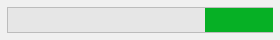

## Generalidades

Un indicador de progreso (también llamado "termómetro") está diseñado para mostrar o definir gráficamente los valores numéricos o fecha/hora.


### Utilizar los indicadores

Los indicadores se pueden utilizar tanto para visualizar como para definir valores. Por ejemplo, si a un indicador de progreso se le da un valor por un método, muestra el valor. Si el usuario arrastra el punto indicador, el valor cambia. El valor puede utilizarse en otro objeto, como un campo o un objeto introducible o no introducible.

La variable asociada al indicador controla la visualización. Puede introducir y utilizar lo valores del indicador utilizando métodos. Por ejemplo, un método para un campo o un objeto introducible podría utilizarse para controlar un indicador de progreso:

```4d
 $vTherm:=[Employees]Salary
```

Este método asigna el valor del campo Salary a la variable $vTherm. Este método se adjuntará al campo Salario.

Por el contrario, puede utilizar el indicador para controlar el valor de un campo. El usuario arrastra el indicador para definir el valor. En este caso el método se convierte en:

```4d
 [Employees]Salary:=$vTherm
```

El método asigna el valor del indicador al campo Salario. A medida que el usuario arrastra el indicador, el valor del campo Salario cambia.

## El termómetro por defecto


El termómetro es el indicador básico de progreso.

Puede mostrar barras de termómetros horizontales o verticales. Esto viene determinado por la forma del objeto que se dibuja.

Dispone de múltiples opciones gráficas: valores mínimos/máximos, graduaciones, pasos.

### Propiedades soportadas

[Barber shop](properties_Scale.md#barber-shop) - [Negrita](properties_Text.md#bold) - [Estilo de línea de borde](properties_BackgroundAndBorder.md#border-line-style) [-Inferior](properties_CoordinatesAndSizing.md#bottom) - [Clase](properties_Object.md#css-class) - [Graduación de visualización](properties_Scale.md#display-graduation) - [Entrable](properties_Entry.md#enterable) - [Ejecutar método de objeto](properties_Action.md#execute-object-method) - [Tipo de expresión](properties_Object.md#expression-type) (sólo "entero", "número", "fecha" u "hora") - [Altura](properties_CoordinatesAndSizing.md#height) - [Paso de graduación](properties_Scale.md#graduation-step) - [-Mensaje de ayuda](properties_Help.md#help-tip) - [Dimensionado horizontal](properties_ResizingOptions.md#horizontal-sizing) - [Ubicación de etiqueta](properties_Scale.md#label-location) - [Izquierda](properties_CoordinatesAndSizing.md#left) - [Máximo](properties_Scale.md#maximum) - [Mínimo](properties_Scale.md#minimum) - [Formato de número](properties_Display.md#number-format) - [Nombre de objeto](properties_Object.md#object-name) - [Derecha](properties_CoordinatesAndSizing.md#right) - [Paso](properties_Scale.md#step) - [Superior](properties_CoordinatesAndSizing.md#top) - [Tipo](properties_Object.md#type) - [Variable o expresión](properties_Object.md#variable-or-expression) - [Dimensionado vertical](properties_ResizingOptions.md#vertical-sizing) - [Visibilidad](properties_Display.md#visibility) - [Ancho](properties_CoordinatesAndSizing.md#width)

## Barber shop



**Barber shop** es una variante del termómetro por defecto. Para activar esta variante, es necesario definir la propiedad [Barber shop](properties_Scale.md#barber-shop).
> En JSON, basta con eliminar la propiedad "max" del objeto termómetro por defecto para activar la variante Barber shop.

La Barber shop muestra una animación continua, como la [spinner](spinner.md). Estos termómetros se utilizan generalmente para indicar al usuario que el programa está en proceso de realizar una operación larga. Cuando se selecciona esta variante termómetro, [las propiedades de la escala gráfica](properties_Scale.md) no están disponibles.

Cuando se ejecuta el formulario, el objeto no se anima. La animación se gestiona pasando un valor a su [variable o expresión asociada](properties_Object.md#variable-or-expression):

* 1 = Iniciar animación,
* 0 = Detener la animación.

### Propiedades soportadas

[Barber shop](properties_Scale.md#barber-shop) - [Negrita](properties_Text.md#bold) - \[Estilo de la línea de borde\](properties_BackgroundAndBorder. md#border-line-style) -[Abajo](properties_CoordinatesAndSizing.md#bottom) - [Clase](properties_Object.md#css-class) - \[Enterable\](properties_Entry. md#enterable) - [Ejecutar método objeto](properties_Action.md#execute-object-method) - \[Tipo de expresión\](properties_Object. md#expression-type) (sólo "entero", "número", "fecha" o "hora") - [Altura](properties_CoordinatesAndSizing.md#height) - \[Consejo de ayuda\](properties_Help. md#help-tip) - [Tamaño horizontal](properties_ResizingOptions.md#horizontal-sizing) - \[Izquierda\](properties_CoordinatesAndSizing. md#left) - [Nombre del objeto](properties_Object.md#object-name) - [Derecha](properties_CoordinatesAndSizing.md#right) - \[Arriba\](properties_CoordinatesAndSizing. md#top) - [Tipo](properties_Object.md#type) - [Variable o Expresión](properties_Object.md#variable-or-expression) - \[Tamaño vertical\](properties_ResizingOptions. md#vertical-sizing) - [Visibilidad](properties_Display.md#visibility) - [Ancho](properties_CoordinatesAndSizing.md#width)

## Ver también

- [reglas](ruler.md)
* [steppers](stepper.md)
