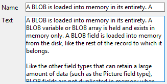

---

## Formato Alfa

Alpha formats control the way the alphanumeric fields and variables appear when displayed or printed. Aquí hay una lista de formatos suministrados para los campos alfanuméricos:

Puede elegir un formato de esta lista o utilizar cualquier formato personalizado. The default list contains formats for some of the most common alpha fields that require formats: US telephone numbers (local and long distance), Social Security numbers, and zip codes. You can also enter a custom format name set in the Filters and formats editor of the tool box. En este caso, el formato no se puede modificar en las propiedades del objeto. Any custom formats or filters that you have created are automatically available, preceded by a vertical bar (|).

El signo número (#) es el marcador de posición para un formato de visualización alfanumérico. You can include the appropriate dashes, hyphens, spaces, and any other punctuation marks that you want to display. You use the actual punctuation marks you want and the number sign for each character you want to display.

Por ejemplo, considere un número de parte con un formato como "RB-1762-1".

El formato alfa sería:

 ##-####-#

Cuando el usuario introduce "RB17621," el campo muestra:

 RB-1762-1

El campo contiene realmente "RB17621".

If the user enters more characters than the format allows, 4D displays the last characters. Por ejemplo, si el formato es:

 (#######)

y el usuario introduce "proporción", el campo muestra:

 (portion)

El campo contiene realmente "proportion". 4D accepts and stores the entire entry no matter what the display format. No se pierde ninguna información.

#### Gramática JSON

| Nombre     | Tipos de datos | Valores posibles                                                                              |
| ---------- | -------------- | --------------------------------------------------------------------------------------------- |
| textFormat | string         | "### ####", "(###) ### ####", "### ### ####", "### ## ####", "00000", formatos personalizados |

#### Objetos soportados

[Drop-down List](dropdownList_Overview.md) - [Combo Box](comboBox_overview.md) - [List Box Column](listbox_overview.md#list-box-columns) - [List Box Footer](listbox_overview.md#list-box-footers)

---

## Formato Fecha

Los formatos de fecha controlan la forma en que aparecen las fechas cuando se muestran o imprimen. For data entry, you enter dates in the MM/DD/YYYY format, regardless of the display format you have chosen.
> Unlike [Alpha](#alpha-format) and [Number](#number-format) formats, display formats for dates must only be selected among the 4D built-in formats.

La siguiente tabla muestra las opciones disponibles:

| Nombre del formato            | Cadena JSON     | Ejemplo (sistema USA)          |
| ----------------------------- | --------------- | ------------------------------ |
| System date short             | - (por defecto) | 03/25/20                       |
| System date abbreviated *(1)* | systemMedium    | Wed, Mar 25, 2020              |
| System date long              | systemLong      | Wednesday, March 25, 2020      |
| RFC 822                       | rfc822          | Tue, 25 Mar 2020 22:00:00 GMT  |
| Short Century                 | shortCentury    | 03/25/20 pero 04/25/2032 *(2)* |
| Internal date long            | largo           | March 25, 2020                 |
| Fecha interna abreviada *(1)* | abbreviated     | Mar 25, 2020                   |
| Internal date short           | short           | 03/25/2020                     |
| ISO Date Time *(3)*           | iso8601         | 2020-03-25T00:00:00            |

*(1)* To avoid ambiguity and in accordance with current practice, the abbreviated date formats display "jun" for June and "jul" for July. Esta particularidad sólo se aplica a las versiones francesas de 4D.

*(2)* The year is displayed using two digits when it belongs to the interval (1930;2029) otherwise it will be displayed using four digits. This is by default but it can be modified using the [SET DEFAULT CENTURY](https://doc.4d.com/4Dv17R6/4D/17-R6/SET-DEFAULT-CENTURY.301-4311596.en.html) command.

*(3)* The `ISO Date Time` format corresponds to the XML date and time representation standard (ISO8601). It is mainly intended to be used when importing/exporting data in XML format and in Web Services.
> Regardless of the display format, if the year is entered with two digits then 4D assumes the century to be the 21st if the year belongs to the interval (00;29) and the 20th if it belongs to the interval (30;99). This is the default setting but it can be modified using the [SET DEFAULT CENTURY](https://doc.4d.com/4Dv17R6/4D/17-R6/SET-DEFAULT-CENTURY.301-4311596.en.html) command.

#### Gramática JSON

| Nombre     | Tipos de datos | Valores posibles                                                                                                                                                              |
| ---------- | -------------- | ----------------------------------------------------------------------------------------------------------------------------------------------------------------------------- |
| dateFormat | string         | "systemShort", "systemMedium", "systemLong", "iso8601", "rfc822", "short", "shortCentury", "abbreviated", "long", "blankIfNull" (puede combinarse con otros valores posibles) |

#### Objetos soportados

[Combo Box](comboBox_overview.md) - [Drop-down List](dropdownList_Overview.md) - [Input](input_overview.md) - [List Box Column](listbox_overview.md#list-box-columns) - [List Box Footer](listbox_overview.md#list-box-footers)

---

## Formato de número
> Number fields include the Integer, Long integer, Integer 64 bits, Real and Float types.

Los formatos numéricos controlan la forma en que aparecen los números cuando se muestran o imprimen. For data entry, you enter only the numbers (including a decimal point or minus sign if necessary), regardless of the display format you have chosen.

4D ofrece varios formatos de números por defecto.

### Marcadores

In each of the number display formats, the number sign (#), zero (0), caret (^), and asterisk (*) are used as placeholders. You create your own number formats by using one placeholder for each digit you expect to display.

| Marcador | Efecto para cero inicial o posterior |
| -------- | ------------------------------------ |
| #        | No muestra nada                      |
| 0        | Muestra 0                            |
| ^        | Muestra un espacio (1)               |
| *        | Muestra un asterisco                 |

(1) The caret (^) generates a space character that occupies the same width as a digit in most fonts.

For example, if you want to display three-digit numbers, you could use the format ###. If the user enters more digits than the format allows, 4D displays <<< in the field to indicate that more digits were entered than the number of digits specified in the display format.

If the user enters a negative number, the leftmost character is displayed as a minus sign (unless a negative display format has been specified). If ##0 is the format, minus 26 is displayed as –26 and minus 260 is displayed as <<< because the minus sign occupies a placeholder and there are only three placeholders.
> No matter what the display format, 4D accepts and stores the number entered in the field. No se pierde ninguna información.

Each placeholder character has a different effect on the display of leading or trailing zeros. A leading zero is a zero that starts a number before the decimal point; a trailing zero is a zero that ends a number after the decimal point.

Suppose you use the format ##0 to display three digits. Si el usuario no introduce nada en el campo, el campo muestra 0. Si el usuario introduce 26, el campo muestra 26.

### Caracteres separadores

The numeric display formats (except for scientific notations) are automatically based on regional system parameters. 4D replaces the “.” and “,” characters by, respectively, the decimal separator and the thousand separator defined in the operating system. The period and comma are thus considered as placeholder characters, following the example of 0 or #.
> On Windows, when using the decimal separator key of the numeric keypad, 4D makes a distinction depending on the type of field where the cursor is located:
> 
> * in a Real type field, using this key will insert the decimal separator defined in the system,
> * in any other type of field, this key inserts the character associated with the key, usually a period (.) or comma (,).

### Puntos decimales y otros caracteres de visualización

You can use a decimal point in a number display format. If you want the decimal to display regardless of whether the user types it in, it must be placed between zeros.

Puede utilizar cualquier otro caracter en el formato. When used alone, or placed before or after placeholders, the characters always appear. Por ejemplo, si utiliza el siguiente formato:

 $##0

siempre aparece un signo de dólar porque se coloca antes de los marcadores de posición.

If characters are placed between placeholders, they appear only if digits are displayed on both sides. Por ejemplo, si define el formato:

 ###.##0

el punto aparece sólo si el usuario introduce al menos cuatro dígitos.

Los espacios se tratan como caracteres en los formatos de visualización de números.

### Formatos para positivo, negativo y cero

A number display format can have up to three parts allowing you to specify display formats for positive, negative, and zero values. You specify the three parts by separating them with semicolons as shown below:

 Positivo;Negativo;Cero

No es necesario especificar las tres partes del formato. If you use just one part, 4D uses it for all numbers, placing a minus sign in front of negative numbers.

If you use two parts, 4D uses the first part for positive numbers and zero and the second part for negative numbers. If you use three parts, the first is for positive numbers, the second for negative numbers, and the third for zero.
> The third part (zero) is not interpreted and does not accept replacement characters. Si introduce `###;###;#`, el valor cero se mostrará "#". In other words, what you actually enter is what will be displayed for the zero value.

Here is an example of a number display format that shows dollar signs and commas, places negative values in parentheses, and does not display zeros:

 ￥###,##0.00;(￥###,##0.00);

Notice that the presence of the second semicolon instructs 4D to use nothing to display zero. The following format is similar except that the absence of the second semicolon instructs 4D to use the positive number format for zero:

 ￥###,##0.00;(￥###,##0.00)

En este caso, la visualización del cero sería $0.00.

### Notación científica

If you want to display numbers in scientific notation, use the **ampersand** (&) followed by a number to specify the number of digits you want to display. Por ejemplo, el formato:

 &3

mostrará 759.62 como:

 7.60e+2

The scientific notation format is the only format that will automatically round the displayed number. Note in the example above that the number is rounded up to 7.60e+2 instead of truncating to 7.59e+2.

### Formatos hexadecimales

You can display a number in hexadecimal using the following display formats:

* `&x`: This format displays hexadecimal numbers using the “0xFFFF” format.
* `&$`: este formato muestra números hexadecimales utilizando el formato "$FFFF".

### Notación XML

The `&xml` format will make a number compliant with XML standard rules. In particular, the decimal separator character will be a period "." in all cases, regardless of the system settings.

### Mostrar un número como una hora

You can display a number as a time (with a time format) by using `&/` followed by a digit. Time is determined by calculating the number of seconds since midnight that the value represents. The digit in the format corresponds to the order in which the time format appears in the Format drop-down menu.

Por ejemplo, el formato:

 &/5

corresponds to the 5th time format in the pop-up menu, specifically the AM/PM time. A number field with this format would display 25000 as:

 6:56 AM

### Ejemplos

The following table shows how different formats affect the display of numbers. The three columns — Positive, Negative, and Zero — each show how 1,234.50, –1,234.50, and 0 would be displayed.

| Formato introducido                    | Positivo         | Negativo      | Cero                         |
| -------------------------------------- | ---------------- | ------------- | ---------------------------- |
| ###                                    | <<<              | <<<           |                              |
| ####                                   | 1234             | <<<<          |                              |
| #######                                | 1234             | -1234         |                              |
| #####.##                               | 1234.5           | -1234.5       |                              |
| ####0.00                               | 1234.50          | -1234.50      | 0.00                         |
| #####0                                 | 1234             | -1234         | 0                            |
| +#####0;–#####0;0                      | +1234            | -1234         | 0                            |
| #####0DB;#####0CR;0                    | 1234DB           | 1234CR        | 0                            |
| #####0;(#####0)                        | 1234             | (1234)        | 0                            |
| ###,##0                                | 1,234            | -1,234        | 0                            |
| ##,##0.00                              | 1,234.50         | -1,234.50     | 0.00                         |
| \^\^\^\^\^\^\^                  | 1234             | -1234         |                              |
| \^\^\^\^\^\^0                    | 1234             | -1234         | 0                            |
| \^\^\^,\^\^0                      | 1,234            | -1,234        | 0                            |
| \^\^,\^\^0.00                      | 1,234.50         | -1,234.50     | 0.00                         |
| \*\*\*\*\*\*\*           | \*\*\*1234 | \*\*-1234 | \*\*\*\*\*\*\* |
| \*\*\**\*\*0               | \*\*\*1234 | \*\*-1234 | \*\*\*\*\*\*0    |
| \*\*\*,*\*0                  | \*\*1,234    | \*-1,234    | \*\*\*\*\*\*0    |
| \*\*,\*\*0.00                  | \*1,234.50     | -1,234.50     | \*\*\*\*\*0.00     |
| $\*,\*\*0.00;–$\*,\*\*0.00 | $1,234.50        | -$1,234.50    | $\*\*\*\*0.00        |
| $\^\^\^\^0                         | $ 1234           | $–1234        | $    0                       |
| $\^\^\^0;–$\^\^\^0               | $1234            | –$1234        | $   0                        |
| $\^\^\^0 ;($\^\^\^0)             | $1234            | ($1234)       | $   0                        |
| $\^,\^\^0.00 ;($\^,\^\^0.00)     | $1,234.50        | ($1,234.50)   | $    0.00                    |
| &2                                     | 1.2e+3           | -1.2e+3       | 0.0e+0                       |
| &5                                     | 1.23450e+3       | -1.23450e+3   | 0.00000                      |
| &xml                                   | 1234.5           | -1234.5       | 0                            |

#### Gramática JSON

| Nombre       | Tipos de datos | Valores posibles                                                       |
| ------------ | -------------- | ---------------------------------------------------------------------- |
| numberFormat | string         | Números (incluyendo un punto decimal o un signo menos si es necesario) |

#### Objetos soportados

[Combo Box](comboBox_overview.md) - [Drop-down List](dropdownList_Overview.md) - [Input](input_overview.md) - [List Box Column](listbox_overview.md#list-box-columns) - [List Box Footer](listbox_overview.md#list-box-footers) - [Progress Indicators](progressIndicator.md)

---

## Formato imagen

Los formatos Imagen controlan la apariencia de las imágenes cuando se muestran o se imprimen. For data entry, the user always enters pictures by pasting them from the Clipboard or by drag and drop, regardless of the display format.

Las opciones de truncamiento y escalado no afectan a la imagen en sí. El contenido de un campo Imagen siempre se guarda. Only the display on the particular form is affected by the picture display format.

### A escala para ajustarse

`Gramática JSON: "scaled"`

The **Scaled to fit** format causes 4D to resize the picture to fit the dimensions of the area.

### Truncado (centrado y no centrado)

`Gramática JSON: "truncatedCenter" / "truncatedTopLeft"`

The **Truncated (centered)** format causes 4D to center the picture in the area and crop any portion that does not fit within the area. 4D recorta por igual desde cada borde y desde la parte superior e inferior.

The **Truncated (non-centered)** format causes 4D to place the upper-left corner of the picture in the upper-left corner of the area and crop any portion that does not fit within the area. 4D crops from the right and bottom.
> When the picture format is **Truncated (non-centered)**, it is possible to add scroll bars to the input area.

### Escala de ajuste (proporcional) y Escala de ajuste centrada (proporcional)

`Gramática JSON: "proportionalTopLeft" / "proportionalCenter"`

When you use **Scaled to fit (proportional)**, the picture is reduced proportionally on all sides to fit the area created for the picture. The **Scaled to fit centered (proportional)** option does the same, but centers the picture in the picture area.

If the picture is smaller than the area set in the form, it will not be modified. If the picture is bigger than the area set in the form, it is proportionally reduced. Como se reduce proporcionalmente, la imagen no aparecerá distorsionada.

If you have applied the **Scaled to fit centered (proportional)** format, the picture is also centered in the area:

### Replicado

`Gramática JSON: "tiled"`

When the area that contains a picture with the **Replicated** format is enlarged, the picture is not deformed but is replicated as many times as necessary in order to fill the area entirely.

If the field is reduced to a size smaller than that of the original picture, the picture is truncated (non-centered).

#### Gramática JSON

| Nombre        | Tipos de datos | Valores posibles                                                                                      |
| ------------- | -------------- | ----------------------------------------------------------------------------------------------------- |
| pictureFormat | string         | "truncatedTopLeft", "scaled", "truncatedCenter", "tiled", "proportionalTopLeft", "proportionalCenter" |

#### Objetos soportados

[Input](input_overview.md) - [List Box Column](listbox_overview.md#list-box-columns) - [List Box Footer](listbox_overview.md#list-box-footers)

---

## Formato Hora

Los formatos de hora controlan la forma en que aparecen las horas cuando se muestran o imprimen. For data entry, you enter times in the 24-hour HH: MM:SS format or the 12-hour HH: MM:SS AM/PM format, regardless of the display format you have chosen.
> Unlike [Alpha](#alpha-format) and [Number](#number-format) formats, display formats for times must only be selected among the 4D built-in formats.

La siguiente tabla muestra los formatos de visualización de los campos de hora y da ejemplos:

| Nombre del formato           | Cadena JSON     | Comentarios                                                                                                                                                | Ejemplo para 04:30:25          |
| ---------------------------- | --------------- | ---------------------------------------------------------------------------------------------------------------------------------------------------------- | ------------------------------ |
| HH:MM:SS                     | hh_mm_ss      |                                                                                                                                                            | 04:30:25                       |
| HH:MM                        | hh_mm           |                                                                                                                                                            | 04:30                          |
| Hour Min Sec                 | HH_MM_SS      |                                                                                                                                                            | 4 horas 30 minutos 25 segundos |
| Hour Min                     | HH_MM           |                                                                                                                                                            | 4 horas 30 minutos             |
| HH:MM AM/PM                  | hh_mm_am      |                                                                                                                                                            | 4:30 a.m.                      |
| MM SS                        | mm_ss           | Hora expresada como duración a partir de las 00:00:00                                                                                                      | 270:25                         |
| Min Sec                      | MM_SS           | Hora expresada como duración a partir de las 00:00:00                                                                                                      | 270 Minutos 25 Segundos        |
| ISO Date Time                | iso8601         | Corresponde al estándar XML para representar datos relacionados con la hora. It is mainly intended to be used when importing/exporting data in XML format  | 0000-00-00T04:30:25            |
| System time short            | - (por defecto) | Formato de hora estándar definido en el sistema                                                                                                            | 04:30:25                       |
| System time long abbreviated | systemMedium    | sólo macOS: formato de tiempo abreviado definido en el sistema.  Windows: este formato es el mismo que el formato corto de la hora del sistema   | 4•30•25 AM                     |
| System time long             | systemLong      | macOS únicamente: formato de tiempo largo definido en el sistema.  Windows: este formato es el mismo que el formato corto de la hora del sistema | 4:30:25 AM HNEC                |

#### Gramática JSON

| Nombre     | Tipos de datos | Valores posibles                                                                                                                                                                                      |
| ---------- | -------------- | ----------------------------------------------------------------------------------------------------------------------------------------------------------------------------------------------------- |
| timeFormat | string         | "systemShort", "systemMedium", "systemLong", "iso8601", "hh_mm_ss", "hh_mm", "hh_mm_am", "mm_ss", "HH_MM_SS", "HH_MM", "MM_SS", "blankIfNull" (puede combinarse con otros valores posibles) |

#### Objetos soportados

[Combo Box](comboBox_overview.md) - [Drop-down List](dropdownList_Overview.md) - [Input](input_overview.md) - [List Box Column](listbox_overview.md#list-box-columns) - [List Box Footer](listbox_overview.md#list-box-footers)

---

## Texto cuando False/Texto cuando True

When a [boolean expression](properties_Object.md#expression-type) is displayed as:

* un texto en un [objeto de entrada](input_overview.md)
* a ["popup"](properties_Display.md#display-type) in a [list box column](listbox_overview.md#list-box-columns),

... puede seleccionar el texto que se mostrará para cada valor:

* **Text when True** - the text to be displayed when the value is "true"
* **Text when False** - the text to be displayed when the value is "false"

#### Gramática JSON

| Nombre        | Tipos de datos | Valores posibles                                                         |
| ------------- | -------------- | ------------------------------------------------------------------------ |
| booleanFormat | string         | "\<*textWhenTrue*\>;\<*textWhenFalse*\>", e.g. "Assigned;Unassigned" |

#### Objetos soportados

[Columna List Box](listbox_overview.md#list-box-columns) - [Entrada](input_overview.md)

---

## Tipo de visualización

Utilizado para asociar un formato de visualización con los datos de la columna. The formats provided depends on the variable type (array type list box) or the data/field type (selection and collection type list boxes).

Boolean and number (numeric or integer) columns can be displayed as check boxes. In this case, the [Title](#title) property can be defined.

Las columnas booleanas también pueden mostrarse como menús emergentes. In this case, the [Text when False and Text when True](#text-when-false-text-when-true) properties must be defined.

#### Gramática JSON

| Nombre      | Tipos de datos | Valores posibles                                                                                                       |
| ----------- | -------------- | ---------------------------------------------------------------------------------------------------------------------- |
| controlType | string         | **number columns**: "automatic" (default) or "checkbox" **boolean columns**: "checkbox" (default) or "popup" |

#### Objetos soportados

[Columna de list box](listbox_overview.md#list-box-columns)

---

## No renderizado

When this property is enabled, the object is not drawn on the form, however it can still be activated.

En particular, esta propiedad permite implementar botones "invisibles".  Los botones no renderizados pueden colocarse sobre los objetos gráficos. They remain invisible and do not highlight when clicked, however their action is triggered when they are clicked.

#### Gramática JSON

| Nombre  | Tipos de datos | Valores posibles |
| ------- | -------------- | ---------------- |
| display | boolean        | true, false      |

#### Objetos soportados

[Button](button_overview.md) - [Drop-down List](dropdownList_Overview.md)

---

## Tres estados

Permite que un objeto casilla de selección acepte un tercer estado. La variable asociada a la casilla de selección devuelve el valor 2 cuando la casilla está en el tercer estado.

#### Casillas de verificación de tres estados en columnas list box

List box columns with a numeric [data type](properties_Object.md#expression-type) can be displayed as three-states check boxes. Si se elige, se muestran los siguientes valores:

* 0 = casilla no seleccionada,
* 1 = casilla seleccionada,
* 2 (o cualquier valor >0) = caja semi-marcada (tercer estado). Para la entrada de datos, este estado devuelve el valor 2.
* -1 = casilla de verificación invisible,
* -2 = unchecked box, not enterable,
* -3 = checked box, not enterable,
* -4 = casilla semi-marcada, no editable

In this case as well, the [Title](#title) property is also available so that the title of the check box can be entered.

#### Gramática JSON

| Nombre     | Tipos de datos | Valores posibles |
| ---------- | -------------- | ---------------- |
| threeState | boolean        | true, false      |

#### Objetos soportados

[Check box](checkbox_overview.md) - [List Box Column](listbox_overview.md#list-box-columns)

---

## Título

Esta propiedad está disponible para una columna de list box si:

* the [column type](properties_Object.md#expression-type) is **boolean** and its [display type](properties_Display.md#display-type) is "Check Box"
* the [column type](properties_Object.md#expression-type) is **number** (numeric or integer) and its [display type](properties_Display.md#display-type) is "Three-states Checkbox".

In that cases, the title of the check box can be entered using this property.

#### Gramática JSON

| Nombre       | Tipos de datos | Valores posibles                                         |
| ------------ | -------------- | -------------------------------------------------------- |
| controlTitle | string         | Toda etiqueta personalizada para la casilla de selección |

#### Objetos soportados

[Columna de list box](listbox_overview.md#list-box-columns)

---

## Truncar con puntos suspensivos

Controla la visualización de los valores cuando las columnas del list box son demasiado estrechas para mostrar todo su contenido.

This option is available for columns with any type of contents, except pictures and objects.

* When the property is enabled (default), if the contents of a list box cell exceed the width of the column, they are truncated and an ellipsis is displayed:

 
> La posición de la elipsis depende del sistema operativo. En el ejemplo anterior (Windows), se añade a la derecha del texto. En macOS, la elipsis se añade en medio del texto.

* When the property is disabled, if the contents of a cell exceed the width of the column, they are simply clipped with no ellipsis added:

 

The Truncate with ellipsis option is enabled by default and can be specified with list boxes of the Array, Selection, or Collection type.

> When applied to Text type columns, the Truncate with ellipsis option is available only if the [Wordwrap](#wordwrap) option is not selected. When the Wordwrap property is selected, extra contents in cells are handled through the word-wrapping features so the Truncate with ellipsis property is not available.

The Truncate with ellipsis property can be applied to Boolean type columns; however, the result differs depending on the [cell format](#display-type):

* For Pop-up type Boolean formats, labels are truncated with an ellipsis,
* Para los formatos booleanos de tipo casilla de verificación, las etiquetas siempre se recortan.

#### Gramática JSON

| Nombre       | Tipos de datos | Valores posibles       |
| ------------ | -------------- | ---------------------- |
| truncateMode | string         | "withEllipsis", "none" |

#### Objetos soportados

[List Box Column](listbox_overview.md#list-box-columns) - [List Box Header](listbox_overview.md#list-box-footers)

---

## Visibilidad

This property allows hiding the object in the Application environment.

Puede manejar la propiedad Visibilidad para la mayoría de los objetos del formulario. Esta propiedad se utiliza principalmente para simplificar el desarrollo de interfaces dinámicas. In this context, it is often necessary to hide objects programatically during the `On load` event of the form then to display certain objects afterwards. In this context, it is often necessary to hide objects programatically during the `On load` event of the form then to display certain objects afterwards. The developer can then program their display using the [`OBJECT SET VISIBLE`](https://doc.4d.com/4dv18/help/command/en/page603.html) command when needed.

#### Visibilidad automática en los formularios lista

In the context of list forms, the Visibility property supports two specific values:

* **If record selected** (JSON name: "selectedRows")
* **If record not selected** (JSON name: "unselectedRows")

This property is only used when drawing objects located in the body of a list form. It tells 4D whether or not to draw the object depending on whether the record being processed is selected/not selected. It allows you to represent a selection of records using visual attributes other than highlight colors:

4D does not take this property into account if the object was hidden using the [`OBJECT SET VISIBLE`](https://doc.4d.com/4dv18/help/command/en/page603.html) command; in this case, the object remains invisible regardless of whether or not the record is selected.

#### Gramática JSON

| Nombre     | Tipos de datos | Valores posibles                                                                        |
| ---------- | -------------- | --------------------------------------------------------------------------------------- |
| visibility | string         | "visible", "hidden", "selectedRows" (list form only), "unselectedRows" (list form only) |

#### Objetos soportados

[4D View Pro area](viewProArea_overview.md) - [4D Write Pro area](writeProArea_overview.md) - [Button](button_overview.md) - [Button Grid](buttonGrid_overview.md) - [Check Box](checkbox_overview.md) - [Combo Box](comboBox_overview.md) - [Drop-down List](dropdownList_Overview.md) - [Group Box](groupBox.md) - [Hierarchical List](list_overview.md) - [List Box](listbox_overview.md) - [List Box Column](listbox_overview.md#list-box-columns) - [List Box Footer](listbox_overview.md#list-box-footers) - [List Box Header](listbox_overview.md#list-box-headers) - [Picture Button](pictureButton_overview.md) - [Picture Pop-up Menu](picturePopupMenu_overview.md) - [Plug-in Area](pluginArea_overview.md) - [Progress indicator](progressIndicator.md) - [Radio Button](radio_overview.md) - [Spinner](spinner.md) - [Splitter](splitters.md) - [Static Picture](staticPicture.md) - [Stepper](stepper.md) - [Subform](subform_overview.md) - [Tab control](tabControl.md) - [Text Area](text.md) - [Web Area](webArea_overview.md)

---

## Ajuste de texto

> For [input](input_overview.md) objects, available when the [Multiline](properties_Entry.md#multiline) property is set to "yes" .

Gestiona la visualización del contenido cuando supera el ancho del objeto.

#### Checked for list box/Yes for input

`Gramática JSON: "normal"`

When this option is selected, text automatically wraps to the next line whenever its width exceeds that of the column/area, if the column/area height permits it.

* In single-line columns/areas, only the last word that can be displayed entirely is displayed. 4D inserts line returns; it is possible to scroll the contents of the area by pressing the down arrow key.

* En las columnas/áreas multilínea, 4D realiza retornos de línea automáticos.

#### Unchecked for list box/No for input

`Gramática JSON: "none"`

When this option is selected, 4D does not do any automatic line returns and the last word that can be displayed may be truncated. En las áreas de tipo de texto, se soportan los retornos de carro:

In list boxes, any text that is too long is truncated and displayed with an ellipse (...). In the following example, the Wordwrap option is **checked for the left column** and **unchecked for the right column**:

Note that regardless of the Wordwrap option’s value, the row height is not changed. If the text with line breaks cannot be entirely displayed in the column, it is truncated (without an ellipse). In the case of list boxes displaying just a single row, only the first line of text is displayed:

#### Automático para entrada (opción por defecto)

`Gramática JSON: "automatic"`

* In single-line areas, words located at the end of lines are truncated and there are no line returns.
* En áreas multilíneas, 4D realiza retornos de línea automáticos.

#### Gramática JSON

| Nombre   | Tipos de datos | Valores posibles                                    |
| -------- | -------------- | --------------------------------------------------- |
| wordwrap | string         | "automatic" (excluyendo list box), "normal", "none" |

#### Objetos soportados

[Input](input_overview.md) - [List Box Column](listbox_overview.md#list-box-columns) - [List Box Footer](listbox_overview.md#list-box-footers)
