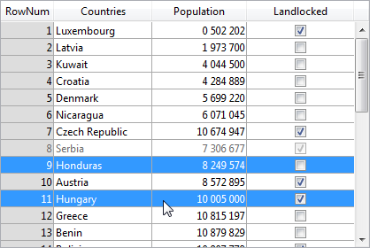

---

## Columnas

Colección de columnas del list box.

#### Gramática JSON

| Nombre  | Tipos de datos               | Valores posibles                                     |
| ------- | ---------------------------- | ---------------------------------------------------- |
| columns | colección de objetos columna | Contiene las propiedades de las columnas de list box |

Para ver una lista de las propiedades que soportan los objetos columna, consulte la sección [Propiedades específicas de la columna](listbox_overview#column-specific-properties).

#### Objetos soportados

[List Box](listbox_overview.md)

---

## Nombre formulario detallado

`List box del tipo selección`

Especifica el formulario que se utilizará para modificar o mostrar los registros individuales del list box.

Se muestra el formulario especificado:

* when using `Add Subrecord` and `Edit Subrecord` standard actions applied to the list box (see [Using standard actions](https://doc.4d.com/4Dv17R6/4D/17-R6/Using-standard-actions.300-4354811.en.html)),
* when a row is double-clicked and the [Double-click on Row](#double-click-on-row) property is set to "Edit Record" or "Display Record".

#### Gramática JSON

| Nombre     | Tipos de datos | Valores posibles          |
| ---------- | -------------- | ------------------------- |
| detailForm | string         | <ul><li>Nombre (cadena) de la tabla o formulario proyecto</li><li>POSIX path (string) to a .json file describing the form</li><li>Objeto que describe el formulario</li></ul> |

#### Objetos soportados

[List Box](listbox_overview.md)

---

## Doble clic en línea

`List box del tipo selección`

Define la acción a realizar cuando un usuario haga doble clic en una línea en el list box. Las opciones disponibles son:

* **No hacer nada** (por defecto): hacer doble clic en una línea no desencadena ninguna acción automática.
* **Editar registro**: al hacer doble clic en una línea se muestra el registro correspondiente en el formulario detallado definido [ para el list box](#detail-form-name). El registro se abre en modo de lectura-escritura para que pueda ser modificado.
* **Mostrar registro**: idéntica a la acción anterior, salvo que el registro se abre en modo de sólo lectura para que no pueda ser modificado.
> > Double-clicking an empty row is ignored in list boxes.

Independientemente de la acción seleccionada/elegida, se genera el evento de formulario `On Double clicked`.

Para las dos últimas acciones, también se genera el evento de formulario `On Open Detail`. `On Close Detail` se genera cuando un registro mostrado en el formulario detallado asociado al list box está a punto de cerrarse (independientemente de que el registro se haya modificado o no).

#### Gramática JSON

| Nombre                 | Tipos de datos | Valores posibles                    |
| ---------------------- | -------------- | ----------------------------------- |
| doubleClickInRowAction | string         | "editSubrecord", "displaySubrecord" |

#### Objetos soportados

[List Box](listbox_overview.md)

---

## Conjunto resaltado

`List box del tipo selección`

This property is used to specify the set to be used to manage highlighted records in the list box (when the **Arrays** data source is selected, a Boolean array with the same name as the list box is used).

4D creates a default set named *ListBoxSetN* where *N* starts at 0 and is incremented according to the number of list boxes in the form. Si es necesario, puede modificar el conjunto por defecto. It can be a local, process or interprocess set (we recommend using a local set, for example *$LBSet*, in order to limit network traffic). A continuación, 4D lo mantiene automáticamente. If the user selects one or more rows in the list box, the set is updated immediately. If you want to select one or more rows by programming, you can apply the commands of the “Sets” theme to this set.
> * The highlighted status of the list box rows and the highlighted status of the table records are completely independent.
> * If the “Highlight Set” property does not contain a name, it will not be possible to make selections in the list box.

#### Gramática JSON

| Nombre       | Tipos de datos | Valores posibles    |
| ------------ | -------------- | ------------------- |
| highlightSet | string         | Nombre del conjunto |

#### Objetos soportados

[List Box](listbox_overview.md)

---

## Columnas bloqueadas y columnas estáticas

Locked columns and static columns are two separate and independent functionalities in list boxes:

* Locked columns always stay displayed to the left of the list box; they do not scroll horizontally.
* Static columns cannot be moved by drag and drop within the list box.
> > You can set static and locked columns by programming, refer to [List Box](https://doc.4d.com/4Dv17R6/4D/17-R6/List-Box.201-4310263.en.html) in the [4D Language Reference](https://doc.4d.com/4Dv17R6/4D/17-R6/4D-Language-Reference.100-4310216.en.html) manual.

Estas propiedades interactúan de la siguiente manera:

* Si define columnas que sólo son estáticas, no se pueden mover.

* If you set columns that are locked but not static, you can still change their position freely within the locked area. Sin embargo, una columna bloqueada no puede moverse fuera de esta área bloqueada.


* If you set all of the columns in the locked area as static, you cannot move these columns within the locked area.


* You can set a combination of locked and static columns according to your needs. For example, if you set three locked columns and one static column, the user can swap the two right-most columns within the locked area (since only the first column is static).

### Número de columnas bloqueadas

Number of columns that must stay permanently displayed in the left part of the list box, even when the user scrolls through the columns horizontally.

#### Gramática JSON

| Nombre            | Tipos de datos | Valores posibles |
| ----------------- | -------------- | ---------------- |
| lockedColumnCount | integer        | mínimo: 0        |

#### Objetos soportados

[List Box](listbox_overview.md)

### Número de columnas estáticas

Número de columnas que no se pueden mover durante la ejecución.

#### Gramática JSON

| Nombre            | Tipos de datos | Valores posibles |
| ----------------- | -------------- | ---------------- |
| staticColumnCount | integer        | mínimo: 0        |

#### Objetos soportados

[List Box](listbox_overview.md)

---

## Número de columnas

Define el número de columnas del list box.
> Puede añadir o eliminar columnas de forma dinámica por programación, utilizando comandos como [LISTBOX INSERT COLUMN](https://doc.4d.com/4Dv18/4D/18/LISTBOX-INSERT-COLUMN.301-4505224.en.html) o [LISTBOX DELETE COLUMN](https://doc.4d.com/4Dv18/4D/18/LISTBOX-DELETE-COLUMN.301-4505185.en.html).

#### Gramática JSON

| Nombre      | Tipos de datos | Valores posibles |
| ----------- | -------------- | ---------------- |
| columnCount | integer        | mínimo: 1        |

#### Objetos soportados

[List Box](listbox_overview.md)

---

## Array de control de líneas

`List box de tipo array`

Un array 4D que controla la visualización de las líneas del list box.

You can set the "hidden", "disabled" and "selectable" interface properties for each row in an array-based list box using this array. También puede ser designado utilizando el comando `LISTBOX SET ARRAY`.

The row control array must be of the Longint type and include the same number of rows as the list box. Each element of the *Row Control Array* defines the interface status of its corresponding row in the list box. Three interface properties are available using constants in the "List Box" constant theme:

| Constante                | Value | Comentario                                                                                                                                                                                                                                                                                                                                                                                                                                                                                                                                                                                                                                                                                     |
| ------------------------ | ----- | ---------------------------------------------------------------------------------------------------------------------------------------------------------------------------------------------------------------------------------------------------------------------------------------------------------------------------------------------------------------------------------------------------------------------------------------------------------------------------------------------------------------------------------------------------------------------------------------------------------------------------------------------------------------------------------------------- |
| lk row is disabled       | 2     | La línea correspondiente está desactivada. El texto y los controles, como las casillas de selección, aparecen atenuados o en gris. Las áreas de entrada de texto introducibles ya no lo son. Valor por defecto: Activado                                                                                                                                                                                                                                                                                                                                                                                                                                                                       |
| lk row is hidden         | 1     | La línea correspondiente está oculta. Ocultar las líneas sólo afecta a la visualización del list box. The hidden rows are still present in the arrays and can be managed by programming. The language commands, more particularly `LISTBOX Get number of rows` or `LISTBOX GET CELL POSITION`, do not take the displayed/hidden status of rows into account. For example, in a list box with 10 rows where the first 9 rows are hidden, `LISTBOX Get number of rows` returns 10. From the user’s point of view, the presence of hidden rows in a list box is not visibly discernible. Only visible rows can be selected (for example using the Select All command). Valor por defecto: Visible |
| lk row is not selectable | 4     | The corresponding row is not selectable (highlighting is not possible). Enterable text input areas are no longer enterable unless the [Single-Click Edit](properties_Entry.md#single-click-edit) option is enabled. Controls such as check boxes and lists are still functional however. Esta configuración se ignora si el modo de selección del list box es "Ninguno". Valor por defecto: Seleccionable                                                                                                                                                                                                                                                                                      |

To change the status for a row, you just need to set the appropriate constant(s) to the corresponding array element. Por ejemplo, si no quiere que la línea #10 sea seleccionable, puede escribir:

```4d
 aLControlArr{10}:=lk row is not selectable
```


Puede definir varias propiedades de la interfaz a la vez:

```4d
 aLControlArr{8}:=lk row is not selectable + lk row is disabled
```



Note that setting properties for an element overrides any other values for this element (if not reset). Por ejemplo:

```4d
 aLControlArr{6}:=lk row is disabled + lk row is not selectable
 //define la línea 6 como desactivada Y no seleccionable
 aLControlArr{6}:=lk row is disabled
 //define la línea 6 como desactivada pero seleccionable nuevamente
```

#### Gramática JSON

| Nombre           | Tipos de datos | Valores posibles                      |
| ---------------- | -------------- | ------------------------------------- |
| rowControlSource | string         | Nombre del array de control de líneas |

#### Objetos soportados

[List Box](listbox_overview.md)

---

## Modo de selección

Designa la opción para permitir a los usuarios seleccionar líneas:

* **Ninguna**: las líneas no se pueden seleccionar si se elige este modo. Hacer clic en la lista no tendrá ningún efecto a menos que la opción [Edición con un solo clic](properties_Entry.md#single-click-edit) esté activada. Las teclas de navegación sólo hacen que la lista se desplace; no se genera el evento de formulario `On Selection Change`.
* **Simple**: en este modo se puede seleccionar una línea a la vez. Si hace clic en una línea, la seleccionará. Un **Ctrl+clic** (Windows) o **Comando+clic** (macOS) en una línea cambia su estado (entre seleccionada o no).  
  Las teclas de flecha arriba y abajo seleccionan la línea anterior/siguiente de la lista. Las otras teclas de navegación se desplazan por la lista. El evento de formulario `On Selection Change` se genera cada vez que se cambia la línea actual.
* **Múltiple**: en este modo se pueden seleccionar varias líneas simultáneamente.

#### Gramática JSON

| Nombre        | Tipos de datos | Valores posibles             |
| ------------- | -------------- | ---------------------------- |
| selectionMode | string         | "multiple", "single", "none" |

#### Objetos soportados

[List Box](listbox_overview.md)
