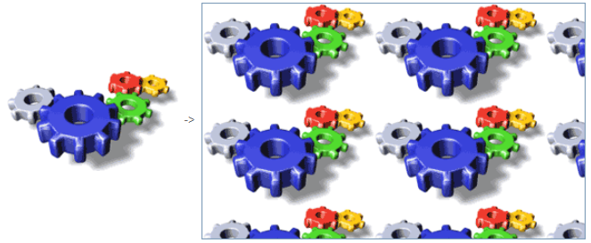

## Ruta de acceso

Ruta de una imagen source estática para un [botón imagen](pictureButton_overview.md), [menú emergente de imagen](picturePopupMenu_overview.md), o [imagen estática](staticPicture.md). Debe utilizar la sintaxis POSIX.

Se pueden utilizar dos ubicaciones principales para la trayectoria de la imagen estática:

- en la carpeta **Resources** de la base proyecto. Apropiado cuando se desea compartir imágenes estáticas entre varios formularios de la base de datos. In this case, the Pathname is "/RESOURCES/\<picture path\>".
- en una carpeta de imágenes (por ejemplo, llamada **Images**) dentro de la carpeta del formulario. Apropiado cuando las imágenes estáticas se utilizan sólo en el formulario y/o se quiere poder mover o duplicar todo el formulario dentro del proyecto o de diferentes proyectos. In this case, the Pathname is "\<picture path\>" and is resolved from the root of the form folder.

#### Gramática JSON

| Nombre  | Tipos de datos | Valores posibles                             |
|:-------:|:--------------:| -------------------------------------------- |
| picture |      text      | Ruta relativa o filesystem en sintaxis POSIX |

#### Objetos soportados

[Botón imagen](pictureButton_overview.md) - [Menú emergente imagen](picturePopupMenu_overview.md) - [Imagen estática](staticPicture.md)

---

## Visualización

### A escala para ajustarse

`Gramática JSON: "scaled"`

The **Scaled to fit** format causes 4D to resize the picture to fit the dimensions of the area.

### Replicado

`Gramática JSON: "tiled"`

When the area that contains a picture with the **Replicated** format is enlarged, the picture is not deformed but is replicated as many times as necessary in order to fill the area entirely.

If the field is reduced to a size smaller than that of the original picture, the picture is truncated (non-centered).

### Centrado / Truncado (no centrado)

`Gramática JSON: "truncatedCenter" / "truncatedTopLeft"`

El formato **Centro** hace que 4D centre la imagen en el área y recorte cualquier parte que no quepa dentro del área. 4D recorta por igual desde cada borde y desde la parte superior e inferior.

The **Truncated (non-centered)** format causes 4D to place the upper-left corner of the picture in the upper-left corner of the area and crop any portion that does not fit within the area. 4D crops from the right and bottom.
> When the picture format is **Truncated (non-centered)**, it is possible to add scroll bars to the input area.

#### Gramática JSON

| Nombre        | Tipos de datos | Valores posibles                                         |
| ------------- | -------------- | -------------------------------------------------------- |
| pictureFormat | string         | "scaled", "tiled", "truncatedCenter", "truncatedTopLeft" |

#### Objetos soportados

[Imagen estática](staticPicture.md)
