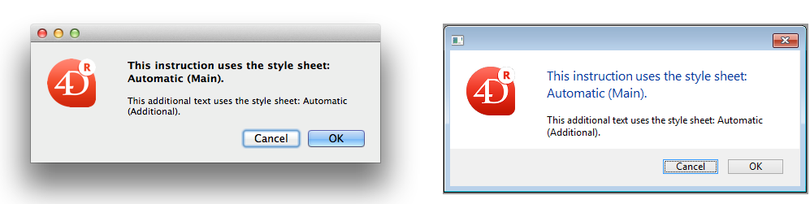

## Autorizar selector fuente/color

Cuando esta propiedad está activa, los comandos [OPEN FONT PICKER](https://doc.4d.com/4Dv18/4D/18/OPEN-FONT-PICKER.301-4505612.en.html) y [OPEN COLOR PICKER](https://doc.4d.com/4Dv18/4D/18/OPEN-COLOR-PICKER.301-4505611.en.html) pueden ser llamados para mostrar las ventanas de selección de fuentes y colores del sistema. A través de estas ventanas, los usuarios pueden cambiar la fuente o el color de un objeto formulario que tenga el foco directamente haciendo clic. Cuando esta propiedad está desactivada (por defecto), los comandos del selector abierto no tienen efecto.

#### Gramática JSON

| Propiedad            | Tipos de datos | Valores posibles          |
| -------------------- | -------------- | ------------------------- |
| allowFontColorPicker | boolean        | false (por defecto), true |

#### Objetos soportados

[Entrada](input_overview.md)

---

## Negrita

Ajusta el texto seleccionado para que aparezca más oscuro y pesado.

Puede definir esta propiedad utilizando el comando [**OBJECT SET FONT STYLE**](https://doc.4d.com/4Dv17R5/4D/17-R5/OBJECT-SET-FONT-STYLE.301-4128244.en.html).
> This is normal text.<br/> **This is bold text.**

#### Gramática JSON

| Propiedad  | Tipos de datos | Valores posibles |
| ---------- | -------------- | ---------------- |
| fontWeight | text           | "normal", "bold" |

#### Objetos soportados

[Botón](button_overview.md) - [Casilla de selección](checkbox_overview.md) - [Combo Box](comboBox_overview.md) - [Lista desplegable](dropdownList_Overview.md) - [Group Box](groupBox.md) - [Lista jerárquica](list_overview.md#overview) - [Área de entrada](input_overview.md) - [List Box](listbox_overview.md#overview) - [Columna List Box](listbox_overview.md#list-box-columns) - [Pie List Box](listbox_overview.md#list-box-footers) - [Encabezado List Box](listbox_overview.md#list-box-headers) - [Botón radio](radio_overview.md) - [Área de texto](text.md)

---

## Itálica

Hace que el texto seleccionado se incline ligeramente hacia la derecha.

También puede definir esta propiedad utilizando el comando [**OBJECT SET FONT STYLE**](https://doc.4d.com/4Dv17R5/4D/17-R5/OBJECT-SET-FONT-STYLE.301-4128244.en.html).
> Este es un texto normal.<br/> *Este es un texto en itálica.*

#### Gramática JSON

| Nombre    | Tipos de datos | Valores posibles   |
| --------- | -------------- | ------------------ |
| fontStyle | string         | "normal", "italic" |

#### Objetos soportados

[Botón](button_overview.md) - [Casilla de selección](checkbox_overview.md) - [Combo Box](comboBox_overview.md) - [Lista desplegable](dropdownList_Overview.md) - [Group Box](groupBox.md) - [Lista jerárquica](list_overview.md#overview) - [Área de entrada](input_overview.md) - [List Box](listbox_overview.md#overview) - [Columna List Box](listbox_overview.md#list-box-columns) - [Pie List Box](listbox_overview.md#list-box-footers) - [Encabezado List Box](listbox_overview.md#list-box-headers) - [Botón radio](radio_overview.md) - [Área de texto](text.md)

---

## Subrayado

Hace que el texto tenga una línea por debajo.

#### Gramática JSON

| Nombre         | Tipos de datos | Valores posibles      |
| -------------- | -------------- | --------------------- |
| textDecoration | string         | "normal", "underline" |

#### Objetos soportados

[Botón](button_overview.md) - [Casilla de selección](checkbox_overview.md) - [Combo Box](comboBox_overview.md) - [Lista desplegable](dropdownList_Overview.md) - [Group Box](groupBox.md) - [Lista jerárquica](list_overview.md#overview) - [Área de entrada](input_overview.md) - [List Box](listbox_overview.md#overview) - [Columna List Box](listbox_overview.md#list-box-columns) - [Pie List Box](listbox_overview.md#list-box-footers) - [Encabezado List Box](listbox_overview.md#list-box-headers) - [Botón radio](radio_overview.md) - [Área de texto](text.md)

---

## Fuente

Esta propiedad permite indicar el **tema de la fuente** o la **familia de fuente** utilizada en el objeto.
> Las propiedades **Tema de la fuente** y de la **familia de la fuente** son mutuamente excluyentes. Un tema de fuente se encarga de los atributos de fuente, incluido el tamaño. Una familia de fuentes permite definir el nombre, el tamaño y el color de la fuente.

### Tema de fuente

La propiedad de tema de fuente designa un nombre de estilo automático. Los estilos automáticos determinan de forma dinámica la familia de fuentes, el tamaño y el color de la fuente que se utilizará para el objeto, según los parámetros sistema. Estos parámetros dependen de:

- la plataforma,
- el lenguaje del sistema,
- y el tipo de objeto de formulario.

Con el tema de fuente, se garantiza que los títulos se muestren siempre de acuerdo con los estándares actuales de la interfaz del sistema. Sin embargo, su tamaño puede variar de una máquina a otra.

Hay tres temas de fuentes disponibles:

- **normal**: estilo automático, aplicado por defecto a todo nuevo objeto creado en el editor de formularios.
- Los temas de fuentes **principales** y **suplementarios** solo son soportados por las [áreas de texto](text.md) y las [áreas de entrada](input_overview.md). Estos temas están pensados principalmente para diseñar cajas de diálogo. Se refieren a los estilos de fuente utilizados, respectivamente, para el texto principal y la información adicional en las ventanas de su interfaz. A continuación se muestran las cajas de diálogo típicas (macOS y Windows) que utilizan estos temas de fuentes:



> Los temas de fuentes gestionan la fuente, así como su tamaño y color. Si modifica una de las propiedades gestionadas por un tema de fuente, éste deja de funcionar de forma dinámica. Sin embargo, puede aplicar propiedades de estilo personalizadas (Negrita, Cursiva o Subrayado) sin alterar su funcionamiento.

#### Gramática JSON

| Nombre    | Tipos de datos | Valores posibles               |
| --------- | -------------- | ------------------------------ |
| fontTheme | string         | "normal", "main", "additional" |

#### Objetos soportados

[Botón](button_overview.md) - [Casilla de selección](checkbox_overview.md) - [Combo Box](comboBox_overview.md) - [Lista desplegable](dropdownList_Overview.md) - [Group Box](groupBox.md) - [Lista jerárquica](list_overview.md#overview) - [Área de entrada](input_overview.md) - [List Box](listbox_overview.md#overview) - [Columna List Box](listbox_overview.md#list-box-columns) - [Pie List Box](listbox_overview.md#list-box-footers) - [Encabezado List Box](listbox_overview.md#list-box-headers) - [Botón radio](radio_overview.md) - [Área de texto](text.md)

### Familia de fuentes

Hay dos tipos de nombres de familias de fuentes:

- *family-name:* El nombre de una familia de fuentes, como "times", "courier", "arial", etc.
- *generic-family:* El nombre de una familia genérica, como "serif", "sans-serif", "cursive", "fantasy", "monospace".

Puede definirla utilizando el comando [**OBJECT SET FONT**](https://doc.4d.com/4Dv17R5/4D/17-R5/OBJECT-SET-FONT.301-4054834.en.html).

#### Gramática JSON

| Nombre     | Tipos de datos | Valores posibles                    |
| ---------- | -------------- | ----------------------------------- |
| fontFamily | string         | Nombre de la familia de fuentes CSS |
> 4D recomienda utilizar sólo fuentes [seguras para la web](https://www.w3schools.com/cssref/css_websafe_fonts.asp).

#### Objetos soportados

[Botón](button_overview.md) - [Casilla de selección](checkbox_overview.md) - [Combo Box](comboBox_overview.md) - [Lista desplegable](dropdownList_Overview.md) - [Group Box](groupBox.md) - [Lista jerárquica](list_overview.md#overview) - [Área de entrada](input_overview.md) - [List Box](listbox_overview.md#overview) - [Columna List Box](listbox_overview.md#list-box-columns) - [Pie List Box](listbox_overview.md#list-box-footers) - [Encabezado List Box](listbox_overview.md#list-box-headers) - [Botón radio](radio_overview.md) - [Área de texto](text.md)

---

## Tamaño fuente

> Esta propiedad sólo está disponible cuando no está seleccionado [tema de fuente](#font-theme).

Permite definir el tamaño de la fuente del objeto en puntos.

#### Gramática JSON

| Nombre   | Tipos de datos | Valores posibles                           |
| -------- | -------------- | ------------------------------------------ |
| fontSize | integer        | Tamaño de letra en puntos. Valor mínimo: 0 |

#### Objetos soportados

[Botón](button_overview.md) - [Casilla de selección](checkbox_overview.md) - [Combo Box](comboBox_overview.md) - [Lista desplegable](dropdownList_Overview.md) - [Group Box](groupBox.md) - [Lista jerárquica](list_overview.md#overview) - [Área de entrada](input_overview.md) - [List Box](listbox_overview.md#overview) - [Columna List Box](listbox_overview.md#list-box-columns) - [Pie List Box](listbox_overview.md#list-box-footers) - [Encabezado List Box](listbox_overview.md#list-box-headers) - [Botón radio](radio_overview.md) - [Área de texto](text.md)

---

## Color de fuente

Designa el color de la fuente.

> Esta propiedad también define el [color del borde del objeto](properties_BackgroundAndBorder.md#background-color--fill-color) (si existe) cuando se utiliza el estilo "plano" o "punteado".

El color puede ser especificado por:

- un nombre de color - como "red"
- un valor HEX - como "# ff0000"
- un valor RVB - como "rgb (255,0,0)"

También puede definir esta propiedad utilizando el comando [**OBJECT SET RGB COLORS**](https://doc.4d.com/4Dv18/4D/18/OBJECT-SET-RGB-COLORS.301-4505456.en.html).

#### Gramática JSON

| Nombre | Tipos de datos | Valores posibles                         |
| ------ | -------------- | ---------------------------------------- |
| stroke | string         | un valor css, "transparent", "automatic" |

#### Objetos soportados

[Botón](button_overview.md) - [Casilla de selección](checkbox_overview.md) - [Combo Box](comboBox_overview.md) - [Lista desplegable](dropdownList_Overview.md) - [Group Box](groupBox.md) - [Lista jerárquica](list_overview.md#overview) - [Área de entrada](input_overview.md) - [List Box](listbox_overview.md#overview) - [Columna List Box](listbox_overview.md#list-box-columns) - [Pie List Box](listbox_overview.md#list-box-footers) - [Encabezado List Box](listbox_overview.md#list-box-headers) - [Indicadores de progreso ](progressIndicator.md) - [Regla](ruler.md) - [Botón Radio](radio_overview.md) - [Área de texto](text.md)

---

## Expresión color fuente

`List box de tipo colección/selección de entidades`

Se utiliza para aplicar un color de fuente personalizado a cada línea del list box. Debe utilizar valores de color RGB. Para más información al respecto, consulte la descripción del comando [OBJECT SET RGB COLORS](https://doc.4d.com/4Dv17R6/4D/17-R6/OBJECT-SET-RGB-COLORS.301-4311385.en.html) en el manual Lenguaje de 4D.

Debe introducir una expresión o una variable (no se pueden utilizar variables de tipo array). La expresión o variable se evaluará para cada línea mostrada. Puede utilizar las constantes del tema [SET RGB COLORS](https://doc.4d.com/4Dv17R6/4D/17-R6/SET-RGB-COLORS.302-4310385.en.html).

También puede definir esta propiedad utilizando el comando `LISTBOX SET PROPERTY` con la constante `lk font color expression`.
> Esta propiedad también puede definirse mediante una [Expresión Meta Info](properties_Text.md#meta-info-expression).

El siguiente ejemplo utiliza un nombre de variable: introduzca *CompanyColor* para la **Expresión color fuente** y, en el método formulario, escriba el siguiente código:

```4d
CompanyColor:=Choose([Companies]ID;Background color;Light shadow color;   
Foreground color;Dark shadow color)
```

#### Gramática JSON

| Nombre          | Tipos de datos | Valores posibles       |
| --------------- | -------------- | ---------------------- |
| rowStrokeSource | string         | Expresión color fuente |

#### Objetos soportados

[List Box](listbox_overview.md#overview)

---

## Expresión estilo

`List box de tipo colección/selección de entidades`

Utilizado para aplicar un estilo de fuente personalizado a cada línea de list box o de cada celda de la columna.

Debe introducir una expresión o una variable (no se pueden utilizar variables de tipo array). La expresión o variable se evaluará para cada línea mostrada (si se aplica al list box) o cada celda mostrada (si se aplica a una columna). Puede utilizar las constantes del tema [Estilos de fuentes](https://doc.4d.com/4Dv17R6/4D/17-R6/Font-Styles.302-4310343.en.html).

Ejemplo:

```4d
Choose([Companies]ID;Bold;Plain;Italic;Underline)
```

También puede definir esta propiedad utilizando el comando `LISTBOX SET PROPERTY` con la constante `lk font style expression`.
> Esta propiedad también puede definirse mediante una [Expresión Meta Info](properties_Text.md#meta-info-expression).

#### Gramática JSON

| Nombre         | Tipos de datos | Valores posibles                                     |
| -------------- | -------------- | ---------------------------------------------------- |
| rowStyleSource | string         | Expresión de estilo a evaluar para cada línea/celda. |

#### Objetos soportados

[List Box](listbox_overview.md) - [Columna List Box](listbox_overview.md#list-box-columns)

---

## Alineación horizontal

Ubicación horizontal del texto dentro del área que lo contiene.

#### Gramática JSON

| Nombre    | Tipos de datos | Valores posibles                                  |
| --------- | -------------- | ------------------------------------------------- |
| textAlign | string         | "automatic", "right", "center", "justify", "left" |

#### Objetos soportados

[Group Box](groupBox.md) - [List Box](listbox_overview.md#overview) - [Columna List Box](listbox_overview.md#list-box-columns) - [Encabezado List Box](listbox_overview.md#list-box-headers) - [Pie List Box](listbox_overview.md#list-box-footers) - [Área de texto](text.md)

---

## Alineamiento vertical

Ubicación vertical del texto dentro del área que lo contiene.

La opción **Predeterminado** (`automático` valor JSON) define la alineación según el tipo de datos que se encuentran en cada columna:

- `abajo` para todos los datos (excepto las imágenes) y
- `arriba` para los datos del tipo imagen.

Esta propiedad también puede ser manejada por los comandos [OBJECT Get vertical alignment](https://doc.4d.com/4Dv18/4D/18/OBJECT-Get-vertical-alignment.301-4505442.en.html) y [OBJECT SET VERTICAL ALIGNMENT](https://doc.4d.com/4Dv18/4D/18/OBJECT-SET-VERTICAL-ALIGNMENT.301-4505430.en.html).

#### Gramática JSON

| Nombre        | Tipos de datos | Valores posibles                       |
| ------------- | -------------- | -------------------------------------- |
| verticalAlign | string         | "automatic", "top", "middle", "bottom" |

#### Objetos soportados

[List Box](listbox_overview.md) - [Columna List Box](listbox_overview.md#list-box-columns) - [Pie de List Box](listbox_overview.md#list-box-footers) - [Encabezado List Box](listbox_overview.md#list-box-headers)

---

## Meta Info expression

`List box de tipo colección o entity selection (selección de entidades)`

Indica una expresión o una variable que se evaluará para cada línea mostrada. Permite definir todo un conjunto de atributos texto de las líneas. Debe pasar una **variable objeto** o una **expresión que devuelva un objeto**. Se soportan las siguientes propiedades:

| Nombre de propiedad         | Tipo    | Descripción                                                                                                                                                                                                                                                                                                                                                                                                                                                                |
| --------------------------- | ------- | -------------------------------------------------------------------------------------------------------------------------------------------------------------------------------------------------------------------------------------------------------------------------------------------------------------------------------------------------------------------------------------------------------------------------------------------------------------------------- |
| stroke                      | string  | Color de la fuente. Todo color CSS (por ejemplo: "#FF00FF"), "automatic", "transparent"                                                                                                                                                                                                                                                                                                                                                                                    |
| fill                        | string  | Color de fondo. Todo color CSS (por ejemplo: "#F00FFF"), "automatic", "transparent"                                                                                                                                                                                                                                                                                                                                                                                        |
| fontStyle                   | string  | "normal","italic"                                                                                                                                                                                                                                                                                                                                                                                                                                                          |
| fontWeight                  | string  | "normal","bold"                                                                                                                                                                                                                                                                                                                                                                                                                                                            |
| textDecoration              | string  | "normal","underline"                                                                                                                                                                                                                                                                                                                                                                                                                                                       |
| unselectable                | boolean | Designa la línea correspondiente como no seleccionable (* es decir, *, no es posible el resaltado). Las áreas que se pueden introducir ya no se pueden introducir si esta opción está activada, a menos que la opción "Edición con un solo clic" también esté activada. Los controles como las casillas de selección y las listas siguen siendo funcionales. Esta configuración se ignora si el modo de selección del list box es "Ninguno". Valores por defecto: False. |
| disabled                    | boolean | Desactiva la línea correspondiente. Las áreas editables ya no son accesibles si esta opción está activada. El texto y los controles (casillas de selección, listas, etc.) aparecen atenuados o en gris. Valores por defecto: False.                                                                                                                                                                                                                                        |
| cell.`\<columnName>` | object  | Permite aplicar la propiedad a una sola columna. Pase en `\<columnName>` el nombre del objeto de la columna list box. **Nota**: las propiedades "no seleccionable" y "desactivada" sólo pueden definirse a nivel de la línea. Se ignoran si se pasan en el objeto "celda"                                                                                                                                                                                           |

> Los parámetros de estilo definidos con esta propiedad se ignoran si ya se han definido otros parámetros de estilo mediante expresiones (*es decir*, [Style Expression](#style-expression), [Font Color Expression](#font-color-expression), [Background Color Expression](properties_BackgroundAndBorder.md#background-color-expression)).

**Ejemplo**

En el método proyecto *Color*, escribe el siguiente código:

```4d
//Método Color
//Define el color de la fuente para ciertas líneas y el color de fondo para una columna específica: C_OBJECT($0)
Form.meta:=New object
If(This.ID>5) //ID es un atributo de objetos/entidades de una colección
  Form.meta.stroke:="purple"
  Form.meta.cell:=New object("Column2";New object("fill";"black"))
Else
  Form.meta.stroke:="orange"
End if
$0:=Form.meta
```

**Buenas prácticas:** por razones de optimización, se recomendaría en este caso crear el objeto `meta.cell` una vez en el método formulario:

```4d
  //método formulario
 Case of
    :(Form event code=On Load)
       Form.colStyle:=New object("Column2";New object("fill";"black"))
 End case
```

Entonces, el método *Color* contendría:

```4d
  //método Color
 ...
 If(This.ID>5)
    Form.meta.stroke:="purple"
    Form.meta.cell:=Form.colStyle //reutilizar el mismo objeto para mejorar el rendimiento
 ...
```
> Ver también el comando [This](https://doc.4d.com/4Dv18/4D/18/This.301-4504875.en.html).

#### Gramática JSON

| Nombre     | Tipos de datos | Valores posibles                                     |
| ---------- | -------------- | ---------------------------------------------------- |
| metaSource | string         | Expresión de objeto a evaluar para cada línea/celda. |

#### Objetos soportados

[List Box](listbox_overview.md)

---

## Multistyle

Esta propiedad permite la posibilidad de utilizar estilos específicos en el área seleccionada. Cuando esta opción está marcada, 4D interpreta todas las etiquetas `<SPAN> HTML` presentes en el área.

Por defecto, esta opción no está activa.

#### Gramática JSON

| Nombre     | Tipos de datos | Valores posibles |
| ---------- | -------------- | ---------------- |
| styledText | boolean        | true, false      |

#### Objetos soportados

[Columna List Box](listbox_overview.md#list-box-columns) - [Entrada](input_overview.md)

---

## Orientación

Modifica la orientación (rotación) de un área de texto. Las áreas de texto pueden girarse en incrementos de 90°. Cada valor de orientación se aplica manteniendo el mismo punto de partida inferior izquierdo para el objeto:

| Valor de orientación | Result                                         |
| -------------------- | ---------------------------------------------- |
| 0 (por defecto)      |  |
| 90                   |  |
| 180                  |  |
| 270                  |  |

Además de [áreas de texto estáticas](text.md), los objetos de texto de las [áreas de entrada](input_overview.md) pueden girar cuando no son[editables](properties_Entry.md#enterable). Cuando se aplica una propiedad de rotación a un objeto de entrada, se elimina la propiedad editable (si la hay). Este objeto se excluye entonces del orden de entrada.

#### Gramática JSON

| Nombre    | Tipos de datos | Valores posibles |
| --------- | -------------- | ---------------- |
| textAngle | number         | 0, 90, 180, 270  |

#### Objetos soportados

[Entrada](input_overview.md) (no editable) - [Área de texto](text.md)

---

## Array colores de fuente

`List box de tipo array`

Permite definir un color de fuente personalizado para cada línea del list box o celda de la columna.

Se debe utilizar el nombre de un array Entero largo. Cada elemento de este array corresponde a una línea del list box (si se aplica al list box) o a una celda de la columna (si se aplica a una columna), por lo que el array debe tener el mismo tamaño que el array asociado a la columna. Puede utilizar las constantes del tema [SET RGB COLORS](https://doc.4d.com/4Dv17R6/4D/17-R6/SET-RGB-COLORS.302-4310385.en.html). Si desea que la celda herede el color de fondo definido en el nivel superior, pase el valor -255 al elemento del array correspondiente.

#### Gramática JSON

| Nombre          | Tipos de datos | Valores posibles                   |
| --------------- | -------------- | ---------------------------------- |
| rowStrokeSource | string         | El nombre de un array entero largo |

#### Objetos soportados

[List Box](listbox_overview.md) - [Columna List Box](listbox_overview.md#list-box-columns)

---

## Array de estilos

`List box de tipo array`

Permite definir un estilo de fuente personalizado para cada línea del list box o cada celda de la columna.

Se debe utilizar el nombre de un array Entero largo. Cada elemento de este array corresponde a una línea del list box (si se aplica al list box) o a una celda de la columna (si se aplica a una columna), por lo que el array debe tener el mismo tamaño que el array asociado a la columna. Para llenar el array (utilizando un método), utilice las constantes del tema [Estilos de fuente](https://doc.4d.com/4Dv17R6/4D/17-R6/Font-Styles.302-4310343.en.html). Se pueden añadir constantes para combinar estilos. Si desea que la celda herede el estilo definido en el nivel superior, pase el valor -255 al elemento del array correspondiente.

#### Gramática JSON

| Nombre         | Tipos de datos | Valores posibles                    |
| -------------- | -------------- | ----------------------------------- |
| rowStyleSource | string         | El nombre de un array entero largo. |

#### Objetos soportados

[List Box](listbox_overview.md#overview) - [Columna List Box](listbox_overview.md#list-box-columns)

---

## Almacenar con etiquetas de estilo por defecto

Esta propiedad sólo está disponible para un área de entrada [Multi-estilo](#multi-estilo). Cuando esta propiedad está activada, el área almacenará las etiquetas de estilo con el texto, incluso si no se ha realizado ninguna modificación. En este caso, las etiquetas corresponden al estilo por defecto. Cuando esta propiedad está desactivada, sólo se almacenan las etiquetas de estilo modificadas.

Por ejemplo, este es un texto que incluye una modificación de estilo:


Cuando la propiedad está desactivada, el área sólo almacena la modificación. Por lo tanto, los contenidos almacenados son:

```
¡Qué <SPAN STYLE="font-size:13.5pt">hermoso</SPAN> día!
```

Cuando la propiedad está activa, el área almacena toda la información de formato. La primera etiqueta genérica describe el estilo por defecto y luego cada variación es objeto de un par de etiquetas anidadas. Por lo tanto, los contenidos almacenados en el área son:

```
<SPAN STYLE="font-family:'Arial';font-size:9pt;text-align:left;font-weight:normal;font-style:normal;text-decoration:none;color:#000000;background-color:#FFFFFF">¡Qué <SPAN STYLE="font-size:13.5pt">hermoso</SPAN> día!</SPAN>
```

#### Gramática JSON

| Nombre            | Tipos de datos | Valores posibles           |
| ----------------- | -------------- | -------------------------- |
| storeDefaultStyle | boolean        | true, false (por defecto). |

#### Objetos soportados

[Entrada](input_overview.md)
