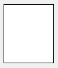

Las formas son [objetos estáticos](formObjects_overview.md#active-and-static-objects) que pueden añadirse a los formularios 4D.

Se ofrecen las siguientes formas básicas:

- rectángulos
- líneas
- óvalos

## Rectángulo

Un rectángulo estático es un objeto decorativo para los formularios. Los rectángulos se limitan a formas cuadradas.

El diseño de los rectángulos se controla a través de muchas propiedades (color, grosor de línea, patrón, etc.). En concreto, se puede definir la [redondez](properties_CoordinatesAndSizing.md#corner-radius) de sus esquinas.



#### Ejemplo JSON

```4d
 "myRectangle": {
  "type": "rectangle", //define the type of object
  "left": 60,    //left position on the form  
  "top": 160,    //top position on the form 
  "width": 100,   //width of the object
  "height": 20,   //height of the object
  "borderRadius": 20  //define the roundness of the corners
                }
```

#### Propiedades soportadas

[Abajo](properties_CoordinatesAndSizing.md#bottom) - [Clase Css ](properties_Object.md#css-class) - [Radio de la esquina](properties_CoordinatesAndSizing.md#corner-radius) - [Tipo de línea punteada](properties_BackgroundAndBorder.md#dotted-line-type) - [Color de fondo](properties_BackgroundAndBorder.md#background-color-fill-color) - [Altura](properties_CoordinatesAndSizing.md#height) - [Dimensionamiento horizontal](properties_ResizingOptions.md#horizontal-sizing) - [Izquierda](properties_CoordinatesAndSizing.md#left) - [Color de línea](properties_BackgroundAndBorder.md#line-color) - [Ancho de línea](properties_BackgroundAndBorder.md#line-width) - [Nombre del objeto](properties_Object.md#object-name) - [Derecha](properties_CoordinatesAndSizing.md#right) - [Arriba](properties_CoordinatesAndSizing.md#top) - [Tipo](properties_Object.md#type) - [Dimensionamiento vertical](properties_ResizingOptions.md#vertical-sizing) - [Visibilidad](properties_Display.md#visibility) - [Ancho](properties_CoordinatesAndSizing.md#width)

## Línea

Una línea estática es un objeto decorativo para los formularios, trazado entre dos tramas. Las líneas pueden ser horizontales, verticales o de cualquier forma de ángulo.

El diseño de las líneas se controla a través de muchas propiedades (color, grosor de línea, etc.).

### propiedad startPoint

La propiedad JSON `startPoint` define a partir de qué coordenada dibujar la línea (ver ejemplo).

> la propiedad `startPoint` no está expuesta en la lista de propiedades, donde la dirección de dibujo de la línea es visible.

#### Ejemplos JSON

```
 "myLine": {
  "type": "line",                
  "left": 20,
  "top": 40,
  "width": 100,
  "height": 80,
  "startPoint": "topLeft", //first direction
  "strokeDashArray": "6 2" //dashed
  }
```

Result: 

```
 "myLine": {
  "type": "line",                
  "left": 20,
  "top": 40,
  "width": 100,
  "height": 80,
  "startPoint": "bottomLeft", //2nd direction
  "strokeDashArray": "6 2" //dashed
  }
```

Result: 

#### Propiedades soportadas

[Abajo](properties_CoordinatesAndSizing.md#bottom) - [Clase Css ](properties_Object.md#css-class) - [Tipo de línea punteada](properties_BackgroundAndBorder.md#dotted-line-type) - [Altura](properties_CoordinatesAndSizing.md#height) - [Dimensionamiento horizontal](properties_ResizingOptions.md#horizontal-sizing) - [Izquierda](properties_CoordinatesAndSizing.md#left) - [Color de línea](properties_BackgroundAndBorder.md#line-color) - [Ancho de línea](properties_BackgroundAndBorder.md#line-width) - [Nombre del objeto](properties_Object.md#object-name) - [Derecha](properties_CoordinatesAndSizing.md#right) - [startPoint](#startpoint-property) - [Arriba](properties_CoordinatesAndSizing.md#top) - [Tipo](properties_Object.md#type) - [Dimensionamiento vertical](properties_ResizingOptions.md#vertical-sizing) - [Visibilidad](properties_Display.md#visibility) - [Ancho](properties_CoordinatesAndSizing.md#width)

## Óvalo

Un óvalo estático es un objeto decorativo para los formularios. Los objetos ovalados pueden utilizarse para dibujar formas circulares (cuando las propiedades [ancho](properties_CoordinatesAndSizing.md#width) y [alto](properties_CoordinatesAndSizing.md#height) son iguales).


#### Ejemplo JSON

```4d
 "myOval": {
  "type": "oval",  //define the type of object
  "left": 60,   //left position on the form  
  "top": 160,   //top position on the form 
  "width": 100,  //width of the object
  "height": 20,  //height of the object
  "fill": "blue"  //define the background color
                }
```

#### Propiedades soportadas

[Abajo](properties_CoordinatesAndSizing.md#bottom) - [Clase](properties_Object.md#css-class) - [Tipo de línea punteada](properties_BackgroundAndBorder.md#dotted-line-type) - [Color de fondo](properties_BackgroundAndBorder.md#background-color-fill-color) - [Altura](properties_CoordinatesAndSizing.md#height) - [Dimensionamiento horizontal](properties_ResizingOptions.md#horizontal-sizing) - [Izquierda](properties_CoordinatesAndSizing.md#left) - [Color de línea](properties_BackgroundAndBorder.md#line-color) - [Ancho de línea](properties_BackgroundAndBorder.md#line-width) - [Nombre del objeto](properties_Object.md#object-name) - [Derecha](properties_CoordinatesAndSizing.md#right) - [Arriba](properties_CoordinatesAndSizing.md#top) - [Tipo](properties_Object.md#type) - [Dimensionamiento vertical](properties_ResizingOptions.md#vertical-sizing) - [Visibilidad](properties_Display.md#visibility) - [Ancho](properties_CoordinatesAndSizing.md#width)
