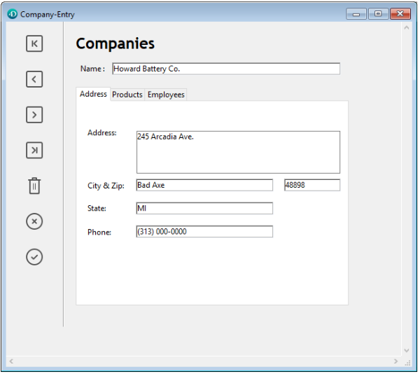

Un control de pestañas crea un objeto que permite al usuario elegir entre un conjunto de pantallas virtuales que están encerradas por el objeto de control de pestañas. Se accede a cada pantalla haciendo clic en su pestaña.

El siguiente formulario multipágina utiliza un objeto de control de pestañas:



Para navegar de una pantalla a otra, el usuario sólo tiene que hacer clic en la pestaña deseada.

Las pantallas pueden representar páginas en un formulario de varias páginas o un objeto que cambia cuando el usuario hace clic en una pestaña. Si el control de pestañas se utiliza como una herramienta de navegación de la página, entonces el comando [FORM GOTO PAGE](https://doc.4d.com/4Dv17R5/4D/17-R5/FORM-GOTO-PAGE.301-4128536.en.html) o la acción estándar `gotoPage` se utilizaría cuando un usuario hace clic en una pestaña.

Otro uso del control de pestañas es para controlar los datos que se muestran en un subformulario. Por ejemplo, se podría implementar un Rolodex utilizando un control de pestañas. Las pestañas mostrarían las letras del alfabeto y la acción del control de pestañas sería cargar los datos correspondientes a la letra que el usuario pulsara.

Cada pestaña puede mostrar etiquetas o rótulos y un pequeño icono. Si incluye iconos, éstos aparecen a la izquierda de cada etiqueta. Este es un ejemplo de un control de pestañas que utiliza iconos:


Cuando se crea un control de pestañas, 4D gestiona el espaciado y la colocación de las mismas. Sólo tiene que suministrar las etiquetas en forma de array, o los iconos y etiquetas en forma de lista jerárquica.

Si el control de pestañas es lo suficientemente amplio como para mostrar todas las pestañas con las etiquetas y los iconos, muestra ambos. Si el control de pestañas no es lo suficientemente ancho para mostrar tanto las etiquetas como los iconos, 4D muestra sólo los iconos. Si no caben todos los iconos, coloca flechas de desplazamiento a la derecha de la última pestaña visible. Las flechas de desplazamiento permiten al usuario desplazar los iconos hacia la izquierda o la derecha.

En macOS, además de la posición estándar (arriba), los controles de las pestañas también pueden alinearse en la parte inferior.

### Ejemplo JSON

```4d
 "myTab": {
  "type": "tab",
   "left": 60, 
  "top": 160,  
  "width": 100, 
  "height": 20, 
  "labelsPlacement": "bottom" //define the direction
 }
```

## Añadir etiquetas a un control de pestañas

Hay varias formas de suministrar las etiquetas para un control de pestañas:

* Puedes asignar una [lista de opciones](properties_DataSource.md#choice-list-static-list) al control de pestañas, ya sea a través de una colección (lista estática) o un puntero JSON ("$ref") a una lista json. Los iconos asociados a los elementos de la lista en el editor de listas se mostrarán en el control de pestañas.
* Puede crear un array Texto que contenga los nombres de cada página del formulario. Este código debe ejecutarse antes de que el formulario se presente al usuario. Por ejemplo, podrías colocar el código en el método del objeto del control de la pestaña y ejecutarlo cuando se produzca el evento `On Load`.

```4d
 ARRAY TEXT(arrPages;3)
 arrPages{1}:="Name"
 arrPages{2}:="Address"
 arrPages{3}:="Notes"  
```
> También puede almacenar los nombres de las páginas en una lista jerárquica y utilizar el comando `Load list` para cargar los valores en el array.

## Gestión programada de las pestañas

### Comando FORM GOTO PAGE

Puede utilizar el comando [FORM GOTO PAGE](https://doc.4d.com/4Dv17R5/4D/17-R5/FORM-GOTO-PAGE.301-4128536.en.html) en el método del control de pestañas:

```4d
FORM GOTO PAGE(arrPages)
```

El comando se ejecuta cuando se produce el evento `On Clicked`. A continuación, debes borrar el array cuando se produzca el evento `On Unload`.

He aquí un ejemplo de método objeto:

```4d
 Case of
    :(Form event=On Load)
       LIST TO ARRAY("Tab Labels";arrPages)
    :(Form event=On Clicked)
       FORM GOTO PAGE(arrPages)
    :(Form event=On Unload)
       CLEAR VARIABLE(arrPages)
 End case
```

### Acción Goto Page

Cuando se asigna la acción [acción estándar](properties_Action.md#standard-action) `gotoPage` a un control de pestañas, 4D mostrará automáticamente la página del formulario que corresponde al número de la pestaña que está seleccionada.

Por ejemplo, si el usuario selecciona la tercera pestaña, 4D mostrará la página 3 del formulario actual (si existe).

## Propiedades soportadas

[Negrita](properties_Text.md#bold) - [Inferior](properties_CoordinatesAndSizing.md#bottom) - [Lista de opciones](properties_DataSource.md#choice-list-static-list) - [Clase](properties_Object.md#css-class) - [Tipo de expresión](properties_Object.md#expression-type) - [Fuente](properties_Text.md#font) - [Tamaño de fuente](properties_Text.md#font-size) - [Altura](properties_CoordinatesAndSizing.md#height) - [Mensaje de ayuda](properties_Help.md#help-tip) - [Tamaño horizontal](properties_ResizingOptions.md#horizontal-sizing) - [Italico](properties_Text.md#italic) - [Izquierda](properties_CoordinatesAndSizing.md#left) - [Nombre del objeto](properties_Object.md#object-name) - [Derecha](properties_CoordinatesAndSizing.md#right) - [Acción estándar](properties_Action.md#standard-action) - [Dirección del control de la ficha](properties_Appearance.md#tab-control-direction) - [Superior](properties_CoordinatesAndSizing.md#top) - [Tipo](properties_Object.md#type) - [Subrayado](properties_Text.md#underline) - [Tamaño vertical](properties_ResizingOptions.md#vertical-sizing) - [Variable o expresión](properties_Object.md#variable-or-expression) - [Visibilidad](properties_Display.md#visibility) - [Ancho](properties_CoordinatesAndSizing.md#width)
