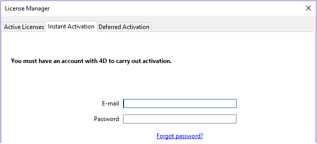
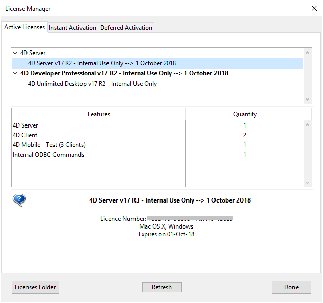

¡Bienvenido a 4D! ¡Bienvenido a 4D! A continuación encontrará toda la información necesaria sobre cómo instalar y registrar su aplicación 4D. Welcome to 4D! You will find below all necessary information about how to install and register your 4D application.

## Configuración requerida

Consulte la [página de descarga del producto](https://us.4d.com/product-download) en el sitio web de 4D para conocer la configuración mínima de Mac / Windows para su serie 4D.

Todos los detalles están disponibles en la [página Recursos](https://us.4d.com/resources/feature-release) del sitio web de 4D.

## Instalación en disco

Los productos 4D se instalan desde el sitio web de 4D:

1. Utilizando su navegador, conéctese al sitio web de 4D y vaya a la página de [Descargas](https://us.4d.com/product-download/Feature-Release).
2. Haga clic en el enlace de descarga que corresponde a su producto y siga las instrucciones que aparecen en pantalla.

## Activación de un producto

Una vez instalados en su disco, debe activar sus productos 4D para poder utilizarlos. También debe activar las licencias adicionales que obtenga.

No es necesaria la activación para los siguientes usos:

- 4D utilizado en modo remoto (conexión a un 4D Server)
- 4D utilizado en modo local con una base interpretada sin acceso al entorno Diseño.

**Importante:** debe tener una conexión a Internet y una cuenta de correo electrónico para activar sus productos.

### Activación de 4D

1. Lance la aplicación 4D.
2. Seleccione el comando **Gestión de licencias...** del menú **Ayuda**.

Se muestra la caja de diálogo **Gestión de licencias** (la página de Activación Instantánea está seleccionada por defecto). Ver la siguiente sección.

> Cuando abre/crea una aplicación local interpretada con 4D Developer Edition, se implementa un mecanismo de auto-activación. En este caso, una caja de diálogo le informa que va a ser conectado a nuestra base de clientes y que sus licencias serán activadas (deberá introducir la contraseña de su cuenta 4D).

### Activación de 4D Server

1. Lance la aplicación 4D Server. Aparece la caja de diálogo para elegir el [modo de activación](#activation-mode).

## Modo de activación de 4D

4D ofrece tres modos de activación. Recomendamos **La activación inmediata**.

### Activación inmediata

Introduzca su identificación de usuario (correo electrónico o cuenta 4D) así como su contraseña. Si no tiene una cuenta de usuario, deberá crearla en la siguiente dirección:

[https://account.4d.com/us/login.shtml](https://account.4d.com/us/login.shtml)

A continuación, introduzca el número de licencia del producto que desea activar. Este número se facilita por correo electrónico o por correo tras la compra de un producto.

### Activación diferida

Si no puede utilizar [la activación instantánea](#instant-activation) porque su ordenador no tiene acceso a Internet, proceda a la activación diferida siguiendo los siguientes pasos.

1. En la ventana del Administrador de licencias, seleccione la pestaña **Activación diferida**.
2. Introduzca el número de licencia y su dirección de correo electrónico y, a continuación, haga clic en **Generar el archivo** para crear el archivo de identificación (*reg.txt*).

3. Guarde el archivo *reg.txt* en una unidad USB y llévelo a un ordenador que tenga acceso a Internet.
4. En la máquina con acceso a Internet, inicie sesión en [https://activation.4d.com](https://activation.4d.com).
5. En la página Web, haga clic en el botón **Elegir archivo...** y seleccione el archivo *reg.txt* de los pasos 3 y 4; a continuación, haga clic en el botón **Activar**.
6. Descargue los archivos seriales.

7. Guarde el(los) archivo(s) *licencia4d* en un medio compartido y transfiéralo(s) de nuevo a la máquina 4D del paso 1.
8. Ahora, de vuelta en la máquina con 4D, todavía en la página **Activación Diferida**, haga clic en **Siguiente**; a continuación, haga clic en el botón **Cargar...** y seleccione un archivo *licencia4d* del medio compartido del paso 7.

Con el archivo de licencia cargado, haga clic en **Siguiente**.

9. Haga clic en el botón **Añadir N°** para añadir otra licencia. Repita estos pasos hasta que se hayan integrado todas las licencias del paso 6.

Su aplicación 4D está ahora activada.

### Activación de emergencia

Este modo puede utilizarse para una activación temporal especial de 4D (5 días como máximo) sin conectarse al sitio web de 4D. Esta activación sólo puede utilizarse una vez.

## Añadir las licencias

Puede añadir nuevas licencias, por ejemplo para ampliar las capacidades de su aplicación, en cualquier momento.

Elija el comando **Administrador de licencias...** del menú **Ayuda** de la aplicación 4D o 4D Server, y luego haga clic en el botón **Refrescar**:

Este botón lo conecta con nuestra base clientes y activa automáticamente todas las licencias nueva o actualizadas relacionadas con la licencia actual (la licencia actual se muestra en **negrita** en la lista de "Licencias activas"). Sólo se le pedirá su cuenta de usuario y su contraseña.

- Si ha adquirido expansiones adicionales para un servidor 4D, no es necesario introducir ningún número de licencia, simplemente haga clic en **Refrescar**.
- En la primera activación de un 4D Server, basta con introducir el número de servidor y todas las expansiones adquiridas se asignan automáticamente.

Puede utilizar el botón **Refrescar** en los siguientes contextos:

- Cuando haya comprado una expansión adicional y quiera activarla,
- Cuando necesite actualizar un número temporal caducado (Partners o evoluciones).

## 4D Online Store

En 4D Store, puede pedir, actualizar, extender y/o gestionar los productos 4D. Puede llegar a la tienda en la siguiente dirección:  (deberá seleccionar su país).

Haga clic en **Inicio de sesión** para acceder con su cuenta actual o en **Nueva cuenta** para crear una nueva, y siga las instrucciones que aparecen en pantalla.

### Gestión de licencias

Después de iniciar sesión, puede hacer clic en **Lista de licencias** en la parte superior derecha de la página:

Aquí puede gestionar sus licencias asignándolas a proyectos.

Seleccione la licencia adecuada de la lista y, a continuación, haga clic en **Enlazar con un proyecto...> **:

Puede seleccionar un proyecto existente o crear uno nuevo:

Puede utilizar los proyectos para organizar sus licencias según sus necesidades:

## Solución de problemas

Si el proceso de instalación o activación falla, compruebe la siguiente tabla, en la que se indican las causas más comunes de mal funcionamiento:

| Síntomas                                                            | Causas posibles                                                    | Solución(es)                                                                                                                                                     |
| ------------------------------------------------------------------- | ------------------------------------------------------------------ | ---------------------------------------------------------------------------------------------------------------------------------------------------------------- |
| Imposible descargar el producto desde el sitio web de 4D            | Sitio de Internet no disponible, aplicación antivirus, cortafuegos | 1- Inténtelo de nuevo más tarde O 2- Desactive temporalmente su aplicación antivirus o su cortafuegos.                                                           |
| Imposible instalar el producto en el disco (instalación rechazada). | Derechos de acceso de usuario insuficientes                        | Abra una sesión con derechos de acceso que le permitan instalar aplicaciones (acceso administrador)                                                              |
| Fallo de activación en línea                                        | Aplicación antivirus, cortafuegos, proxy                           | 1- Desactivar temporalmente su aplicación antivirus o su cortafuegos O 2- Utilizar la activación diferida (no disponible con las licencias de las versiones "R") |

Si esta información no le ayuda a resolver su problema, contacte 4D o a su distribuidor local.

## Contactos

Para cualquier pregunta sobre la instalación o activación de su producto, póngase en contacto con 4D, Inc. o con su distribuidor local.

Para US:

- Web: [https://us.4d.com/4d-technical-support](https://us.4d.com/4d-technical-support)
- Tel: 1-408-557-4600

Para UK:

- Web: [https://uk.4d.com/4d-technical-support](https://uk.4d.com/4d-technical-support)
- Teléfono: 01625 536178

Encuentre la comunidad de desarrolladores de 4D en línea aquí: [https://discuss.4d.com](https://discuss.4d.com).
