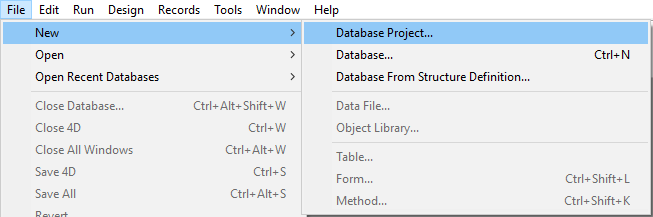

## Requirements

New 4D projects can only be created from **4D Developer** (see [Developing a project](developing.md)).

**Note:** 4D Server can open .4DProject files in read-only mode, for testing purposes only. For deployment, 4D projects are provided as .4dz files (zipped files). For more information, please refer to [Building a project package](building.md).

> You can create project databases by exporting existing binary databases. See "Export from a 4D database" on [doc.4d.com](https://doc.4d.com).

## Creating the project files

To create a new database project:

1. Launch a 4D Developer application.
2. Select **New > Database Project...** from the **File** menu:  OR Select **Database Project...** from the **New** toolbar button:  A standard **Save** dialog box appears so that you can choose the name and location of the 4D database project main folder.
1. Enter the name of your project folder and click **Save**. This name will be used:
 - as the name of the main project folder (named "MyFirstProject" in the [Architecture of a 4D Project](Project/architecture.md) section example),
 - as the name of the .4DProject file at the first level of the "Project" folder. You can choose any name allowed by your operating system. *Warning:* if your database project is intended to work on other systems or to be saved via a source control tool, you must take their specific naming recommendations into account.

When you validate the dialog box, 4D closes the current database (if any), creates a project folder at the indicated location, and puts all the files needed for proper operation of the database project into it. For more information, refer to [Architecture of a 4D Project](Project/architecture.md).

Next, the 4D application window is displayed with the Explorer in the foreground. You can then, for example, create project forms or display the Structure editor and add tables, fields, etc.
