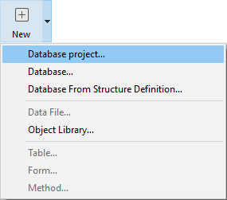

## Requisitos

Los nuevos proyectos 4D sólo pueden ser creados desde **4D Developer** (ver [Desarrollar un proyecto](developing.md)).

**Nota:** 4D Server puede abrir archivos .4DProject en modo solo lectura, para pruebas únicamente. Para el despliegue, los proyectos 4D se proveen como archivos .4dz (archivos comprimidos). Para más información, consulte [Construir un paquete de proyectos](building.md).

> Puede crear bases proyecto exportando las bases binarias existentes. Ver "Exportar desde una base 4D" en [doc.4d.com](https://doc.4d.com).

## Crear archivos de proyecto

Para crear un nuevo proyecto de base de datos:

1. Lance una aplicación 4D Developer.
2. Select **New > Database Project...** from the **File** menu:  OR Select **Database Project...** from the **New** toolbar button:  A standard **Save** dialog box appears so that you can choose the name and location of the 4D database project main folder.
1. Introduzca el nombre de su carpeta de proyecto y haga clic en **Guardar**. Este nombre se utilizará:
 - como el nombre de la carpeta principal del proyecto (llamada "MyFirstProject" en el ejemplo de la sección [Arquitectura de un Proyecto 4D](Project/architecture.md)),
 - como nombre del archivo .4DProject en el primer nivel de la carpeta "Project". Puedes elegir cualquier nombre permitido por su sistema operativo. *Atención:* si su base proyecto está destinada a funcionar en otros sistemas o a ser guardada a través de una herramienta de control de código fuente, debe tener en cuenta sus recomendaciones específicas de denominación.

Al validar la caja de diálogo, 4D cierra la base de datos actual (si la hay), crea una carpeta "Project" en la ubicación indicada y coloca en ella todos los archivos necesarios para el correcto funcionamiento de la base proyecto. Para más información, consulte [Arquitectura de un proyecto 4D](Project/architecture.md).

A continuación, se muestra la ventana de la aplicación 4D con el Explorador en primer plano. A continuación puede, por ejemplo, crear formularios de proyecto o mostrar el editor de estructuras y añadir tablas, campos, etc.
