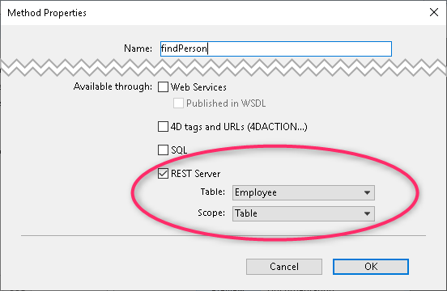

Todos [los atributos, clases](configuration.md#exposing-tables-and-fields) y métodos del datastore expuestos pueden ser accedidos a través de REST. Los nombres de clases de datos, atributos y métodos son sensibles a las mayúsculas y minúsculas; sin embargo, los datos de las búsquedas no lo son.

## Buscar datos

Para consultar los datos directamente, puede hacerlo mediante la función [`$filter`]($filter.md). Por ejemplo, para encontrar a una persona llamada "Smith", podría escribir:

`http://127.0.0.1:8081/rest/Person/?$filter="lastName=Smith"`

## Añadir, modificar y eliminar entidades

Con la API REST, puede realizar todas las manipulaciones a los datos como puede hacerlo en 4D.

Para añadir y modificar entidades, puede llamar a [`$method=update`]($method.md#methodupdate). Si desea eliminar una o varias entidades, puede utilizar [`$method=delete`]($method.md#methoddelete).

Además de recuperar una sola entidad en una dataclass utilizando [\{dataClass\}({key})](%7BdataClass%7D_%7Bkey%7D.html), también puede escribir un método en su clase DataClass y llamarlo para devolver una selección de entidades (o una colección) utilizando [\{dataClass\}/\{method\}](%7BdataClass%7D.html#dataclassmethod).

Antes de devolver la colección, también puede ordenarla utilizando [`$orderby`]($orderby.md) uno o varios atributos (incluso los atributos de relación).

## Navegación de datos

Añada el [`$skip`]($skip.md) (para definir con qué entidad empezar) y [`$top/$limit`]($top_$limit.md) (para definir cuántas entidades devolver) de las peticiones REST a sus consultas o selecciones de entidades para navegar por la colección de entidades.

## Creación y gestión del conjunto de entidades

Un conjunto de entidades (también conocido como *selección de entidades*) es una colección de entidades obtenidas a través de una petición REST que se almacena en la caché de 4D Server. El uso de un conjunto de entidades evita que se consulte continuamente la aplicación para obtener los mismos resultados. El acceso a un conjunto de entidades es mucho más rápido y puede mejorar la velocidad de su aplicación.

Para crear un conjunto de entidades, llame a [`$method=entityset`]($method.md#methodentityset) en su solicitud REST. Como medida de seguridad, también se puede utilizar [`$savedfilter`]($savedfilter.md) y/o [`$savedorderby`]($savedorderby.md) cuando se llame a [`$filter`]($filter.md) y/o [`$orderby`]($orderby.md) para que si alguna vez el conjunto de entidades se agota o se elimina del servidor, se pueda recuperar rápidamente con el mismo ID que antes.

Para acceder al conjunto de entidades, debe utilizar `$entityset/\{entitySetID\}`, por ejemplo:

`/rest/People/$entityset/0AF4679A5C394746BFEB68D2162A19FF`

Por defecto, un conjunto de entidades se almacena durante dos horas; sin embargo, puede cambiar el tiempo de espera pasando un nuevo valor a [`$timeout`]($timeout.md). El tiempo de espera se restablece continuamente al valor definido para su tiempo de espera (ya sea el predeterminado o el que usted defina) cada vez que lo utilice.

Si desea eliminar un conjunto de entidades de la caché de 4D Server, puede utilizar [`$method=release`]($method.md#methodrelease).

Si se modifica alguno de los atributos de la entidad en el conjunto de entidades, los valores se actualizarán. Sin embargo, si se modifica un valor que formaba parte de la consulta ejecutada para crear el conjunto de entidades, no se eliminará del conjunto de entidades aunque ya no se ajuste a los criterios de búsqueda. Las entidades que elimine, por supuesto, dejarán de formar parte del conjunto de entidades.

Si el conjunto de entidades ya no existe en la caché de 4D Server, se recreará con un nuevo tiempo de espera por defecto de 10 minutos. El conjunto de entidades se refrescará (pueden incluirse ciertas entidades y eliminarse otras) desde la última vez que se creó, si ya no existía antes de recrearlo.

Using [`$entityset/\{entitySetID\}?$logicOperator... &$otherCollection`]($entityset.md#entitysetentitysetidoperatorothercollection), you can combine two entity sets that you previously created. Puede combinar los resultados en ambos, devolver sólo lo que es común entre los dos, o devolver lo que no es común entre los dos.

Se devuelve una nueva selección de entidades; sin embargo, también se puede crear un nuevo conjunto de entidades llamando [`$method=entityset`]($method.md#methodentityset) al final de la petición REST.

## Cálculo de datos

Utilizando [`$compute`]($compute.md), se puede calcular el **promedio**, el **count**, el **min**, el **max**, o la **suma** para un atributo específico en una clase de datos. También puede calcular todos los valores con la palabra clave $all.

Por ejemplo, para obtener el salario más alto:

`/rest/Employee/salary/?$compute=sum`

Para calcular todos los valores y devolver un objeto JSON:

`/rest/Employee/salary/?$compute=$all`

## Obtener datos de los métodos

Puede llamar los métodos proyecto 4D que están [expuestos como servicio REST](%7BdataClass%7D.html#4d-configuration). Un método 4D puede devolver en $0:

- un objeto
- una colección

El siguiente ejemplo es un método de clase de datos que recibe parámetros y devuelve un objeto:

```4d
// método 4D findPerson
C_TEXT($1;$firstname;$2;$lastname)
$firstname:=$1
$lastname:=$2

$0:=ds.Employee.query("firstname = :1 and lastname = :2";$firstname;$lastname).first().toObject()
```

Las propiedades del método se configuran en consecuencia del lado del proyecto 4D:



Luego puede enviar la siguiente petición REST POST, por ejemplo utilizando el comando `HTTP Request` de 4D:

```4d
C_TEXT($content)
C_OBJECT($response)

$content:="[\"Toni\",\"Dickey\"]" 

$statusCode:=HTTP Request(HTTP POST method;"127.0.0.1:8044/rest/Employee/findPerson";$content;$response)
```

Las llamadas de métodos se detallan en la sección [\{dataClass\}](%7BdataClass%7D.html#dataclassmethod-and-dataclasskeymethod).

## Selección de atributos a obtener

Siempre se puede definir qué atributos devolver en la respuesta REST después de una solicitud inicial pasando su ruta en la solicitud (*por ejemplo*, `Company(1)/name,revenues/`)

Puede aplicar este filtro de las siguientes maneras:

| Object                  | Sintaxis                                                    | Ejemplo                                                       |
| ----------------------- | ----------------------------------------------------------- | ------------------------------------------------------------- |
| Dataclass               | \{dataClass\}/{att1,att2...}                              | /People/firstName,lastName                                    |
| Collection de entidades | \{dataClass\}/{att1,att2...}/?$filter="{filter}"          | /People/firstName,lastName/?$filter="lastName='a@'"           |
| Entidad específica      | \{dataClass\}({ID})/{att1,att2...}                        | /People(1)/firstName,lastName                                 |
|                         | \{dataClass\}:\{attribute\}(value)/{att1,att2...}/      | /People:firstName(Larry)/firstName,lastName/                  |
| Entity selection        | \{dataClass\}/{att1,att2...}/$entityset/\{entitySetID\} | /People/firstName/$entityset/528BF90F10894915A4290158B4281E61 |

Los atributos deben estar delimitados por una coma, *i.e.*, `/Employee/firstName,lastName,salary`. Se pueden pasar atributos de almacenamiento o relacionales.

### Ejemplos

A continuación se presentan algunos ejemplos, que muestran cómo especificar qué atributos devolver en función de la técnica utilizada para recuperar las entidades.

Puede aplicar esta técnica a:

- Clases de datos (todas o una colección de entidades en una clase de datos)
- Entidades específicas
- Conjuntos de entidades

#### Ejemplo con una dataclass

Las siguientes peticiones devuelven sólo el nombre y el apellido de la clase de datos People (ya sea toda la clase de datos o una selección de entidades basada en la búsqueda definida en `$filter`).

 `GET  /rest/People/firstName,lastName/`

**Resultado**:

````
{
    __entityModel: "People",
    __COUNT: 4,
    __SENT: 4,
    __FIRST: 0,
    __ENTITIES: [
        {
            __KEY: "1",
            __STAMP: 1,
            firstName: "John",
            lastName: "Smith"
        },
        {
            __KEY: "2",
            __STAMP: 2,
            firstName: "Susan",
            lastName: "O'Leary"
        },
        {
            __KEY: "3",
            __STAMP: 2,
            firstName: "Pete",
            lastName: "Marley"
        },
        {
            __KEY: "4",
            __STAMP: 1,
            firstName: "Beth",
            lastName: "Adams"
        }
    ]
}
````

`GET  /rest/People/firstName,lastName/?$filter="lastName='A@'"/`

**Resultado**:

````
{
    __entityModel: "People",
    __COUNT: 1,
    __SENT: 1,
    __FIRST: 0,
    __ENTITIES: [
        {
            __KEY: "4",
            __STAMP: 4,
            firstName: "Beth",
            lastName: "Adams"
        }
    ]
}
````

#### Ejemplo de entidad

La siguiente petición devuelve sólo los atributos de nombre y apellido de una entidad específica de la clase de datos People:

 `GET  /rest/People(3)/firstName,lastName/`

**Resultado**:

````
{
    __entityModel: "People",
    __KEY: "3",
    __STAMP: 2,
    firstName: "Pete",
    lastName: "Marley"
}
````

 `GET  /rest/People(3)/`

**Resultado**:

````
{
    __entityModel: "People",
    __KEY: "3",
    __STAMP: 2,
    ID: 3,
    firstName: "Pete",
    lastName: "Marley",
    salary: 30000,
    employer: {
        __deferred: {
            uri: "http://127.0.0.1:8081/rest/Company(3)",
            __KEY: "3"
        }
    },
    fullName: "Pete Marley",
    employerName: "microsoft"

}
````

#### Ejemplo de conjunto de entidades

Una vez que haya [creado un conjunto de entidades](#creating-and-managing-entity-set), puede filtrar la información que contiene definiendo qué atributos debe devolver:

 `GET  /rest/People/firstName,employer.name/$entityset/BDCD8AABE13144118A4CF8641D5883F5?$expand=employer

## Visualización de un atributo de imagen

Si desea visualizar un atributo de imagen en su totalidad, escriba lo siguiente:

 `GET  /rest/Employee(1)/photo?$imageformat=best&$version=1&$expand=photo`

Para más información sobre los formatos de imagen, consulte [`$imageformat`]($imageformat.md). Para más información sobre el parámetro de versión, consulte [`$version`]($version.md).

## Guardar un atributo BLOB en el disco

Si quiere guardar un BLOB almacenado en su clase de datos, puedes escribir lo siguiente:

  `GET  /rest/Company(11)/blobAtt?$binary=true&$expand=blobAtt`

## Recuperar sólo una entidad

Puede utilizar la sintaxis [`\{dataClass\}:\{attribute\}(value)`](%7BdataClass%7D.html#dataclassattributevalue) cuando quiera recuperar sólo una entidad. Es especialmente útil cuando se quiere hacer una búsqueda relacionada que no se crea en la llave primaria de la clase de datos. Por ejemplo, puede escribir:

 `GET  /rest/Company:companyCode("Acme001")`
