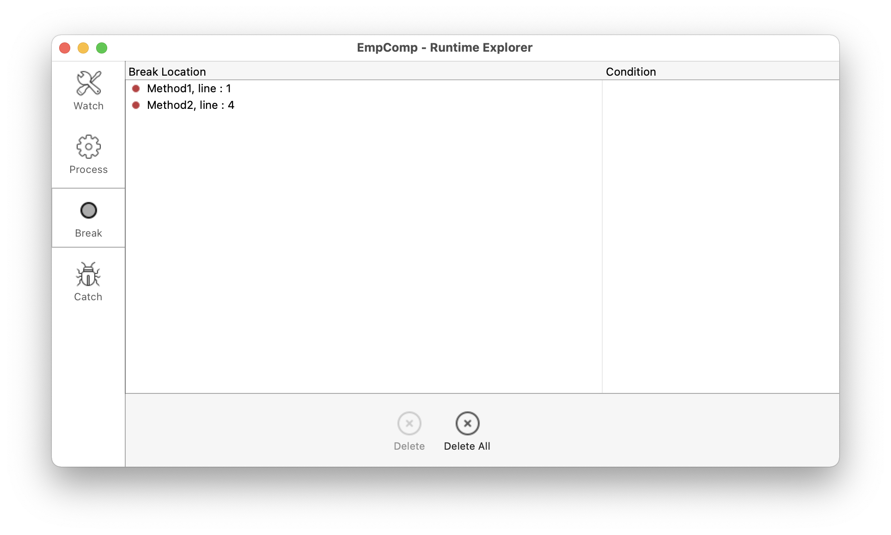

## Generalidades

Los puntos de interrupción y los comandos de captura son técnicas de depuración muy eficaces. Ambas tienen el mismo efecto: detienen la ejecución del código (y muestran la ventana del depurador si no está ya visible) en una etapa deseada.

Se definenen los puntos de interrupción en cualquier línea de código en la que se desee detener la ejecución. Puede asociar una condición al punto de ruptura.

Los puntos de interrupción de comandos le permiten comenzar a rastrear la ejecución de un proceso tan pronto como un comando es llamado por ese proceso.

## Breakpoints

Para crear un punto de interrupción, haga clic en el margen izquierdo de la ventana de evaluación del código fuente en el depurador o en el editor de código.

En el siguiente ejemplo, se ha definido un punto de ruptura (la viñeta roja), en el depurador, en la línea `If ($in.dataClass#Null)`:

En el ejemplo anterior, al hacer clic en el botón [**No Trace**](./debugger.md/#no-trace) se reanuda la ejecución normal hasta la línea marcada con el punto de interrupción. Esa línea no se ejecuta por sí misma, sino que se vuelve al modo de rastreo. Definir un punto de interrupción más allá del contador del programa y hacer clic en el botón **No Trace** le permite saltar las partes del método que se está rastreando.

Para eliminar un punto de ruptura, haga clic en la viñeta correspondiente.

### Propiedades de los puntos de interrupción

Puede modificar el comportamiento de un punto de interrupción utilizando la ventana Propiedades de puntos de interrupción:

Esta ventana está disponible en el Editor de Código o en la [ventana de código fuente](debugger.md#source-code-pane). Puede:

- haga clic derecho en una línea y seleccione **Modificar el punto de interrupción** en el menú contextual, o
- `Alt+clic` (Windows) o `Opción+clic` (macOS) en el margen izquierdo.

Si ya existe un punto de interrupción, la ventana se muestra para ese punto de interrupción. Otherwise, a break point is created and the window is displayed for the newly created break point.

A continuación se describen las propiedades:

- **Location**: indicates the name of the method and the line number attached to the breakpoint.
- **Break when following expression is true**: You can create **conditional breakpoints** by entering a 4D formula that returns `True` or `False`. For example, insert `Records in selection(\[aTable])=0` to make sure the break occurs only if there no record selected for the table \[aTable]. Breakpoint conditions are available in the **Condition** column of the [Break list](#break-list).
- **Number of times to skip before breaking**: You can attach a breakpoint to a line located in a loop structure (While, Repeat, or For) or located in subroutine or function called from within a loop.
- **Breakpoint is disabled**: If you currently do not need a break point, but might need it later, you can temporarily disable it. A disabled break point appears as a dash (-) instead of a bullet (•)|

### Puntos de interrupción en la depuración remota

La lista de puntos de interrupción se almacena localmente. In remote debugging mode, if the attached debugger is a remote 4D, the remote break point list replaces temporarily the server break point list during the debugging session.

The server break point list is automatically restored if it becomes again the attached debugger.

### Lista de rupturas

The Break list is a page of the Runtime Explorer that lets you manage the breakpoints created in the Debugger Window or in the Code Editor. For more information on the Runtime Explorer, see its dedicated page in [the Design reference manual](https://doc.4d.com/4Dv19/4D/19/Runtime-Explorer.200-5416614.en.html).

Para abrir la página de la lista de puntos de ruptura:

1. From the **Run menu**, click **Runtime Explorer...**

2. Haga clic en la pestaña **Break** para mostrar la lista de pausas:

Utilizando esta ventana, puede:

- Set conditions for breakpoints in the **Conditions** column
- Enable or disable breakpoints by clicking the bullets in the margin. Los puntos de interrupción desactivados muestran balas transparentes
- Delete breakpoints by pressing the `Delete` or `Backspace` key, or click on the **Delete** button below the list.
- Open the methods where the breakpoint are located by double-clicking any line in the list

No puede añadir nuevos puntos de interrupción desde esta ventana. Breakpoints can only be created from within the Debugger window or the Code Editor.

## Comandos de captura

The **Catch** tab of the Runtime Explorer lets you add additional breaks to your code by catching calls to 4D commands. Unlike a break point, which is located in a particular project method (and therefore triggers a trace exception only when it is reached), the scope of catching a command includes all the processes that execute 4D code and call that command.

Catching a command is a convenient way to trace large portions of code without setting break points at arbitrary locations. For example, if a record that should not be deleted is deleted after you've executed one or several processes, you can try to reduce the field of your investigation by catching commands such as `DELETE RECORD` and `DELETE SELECTION`. Each time these commands are called, you can check if the record in question has been deleted, and thus isolate the faulty part of the code.

Los puntos de interrupción y los comandos de captura se pueden utilizar combinados.

To open the Caught Commands page:

1. Choose **Run** > **Runtime explorer...** to open the Runtime Explorer.

2. Click **Catch** to display the Caught Commands List:

Esta página lista los puntos de interrupción en el comando durante la ejecución. Se compone de dos columnas:

- The left column displays the Enable/Disable status of the caught command, followed by the name of the command
- The right column displays the condition associated with the caught command, if any

Para añadir un punto de interrupción en el comando:

1. Click on the **Add New Catch** button (in the shape of a +) located below the list. A new entry is added to the list with the `ALERT` command as default
2. Click the **ALERT** label, type the name of the command you want to catch, then press **Enter**.

To enable or disable a caught command, click on the bullet (•) in front of the command label. La bala es transparente cuando el comando está desactivado.

> Disabling a caught command has almost the same effect as deleting it. Durante la ejecución, el depurador no pasa casi nada de tiempo en la entrada. The advantage of disabling an entry is that you do not have to recreate it when you need it again.

Para eliminar un punto de interrupción en el comando:

1. Seleccione un comando en la lista.
2. Press **Backspace** or **Delete** on your keyboard or click on the **Delete** button beneath the list (**Delete All** removes all commands in the list).

### Definir una condición para un punto de interrupción en un comando

1. Haga clic en la entrada en la columna derecha
2. Enter a 4D formula (expression, command call or project method) that returns a Boolean value.

> Para eliminar una condición, borre su fórmula.

Adding conditions allows you to stop execution when the command is invoked only if the condition is met. For example, if you associate the condition `Records in selection(\[Emp]>10)` with the break point on the `DELETE SELECTION` command, the code will not be stopped during execution of the `DELETE SELECTION` command if the current selection of the \[Emp] table only contains 9 records (or less).

Adding conditions to caught commands slows the execution, because the condition has to be evaluated each time an exception is met. On the other hand, adding conditions accelerates the debugging process, because 4D automatically skips occurrences that do not match the conditions.
