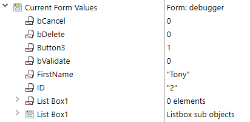
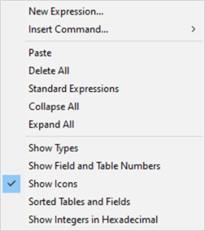
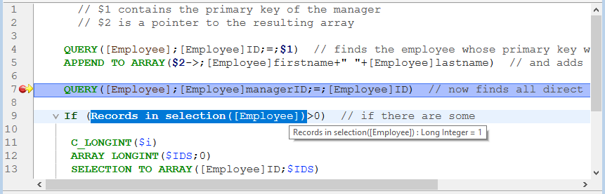

El depurador es útil cuando se necesita detectar errores o controlar la ejecución de métodos. Le permite recorrer su código lentamente y examinar la información. Este proceso se llama "rastreo".


## Llamada al depurador

Hay varias formas de conseguir que el depurador se muestre:

* Haciendo clic en el botón **Trace** en [la ventana de errores de sintaxis](basics.md#syntax-error-window)
* Utilizando el comando [`TRACE`](https://doc.4d.com/4dv19/help/command/en/page157.html)
* Haciendo clic en el botón **Debug** en la ventana de ejecución del método o seleccionando **Run and debug...** en el Code Editor
* Utilizando **Alt+Shift+Clic derecho** (Windows) o **Ctrl+Option+Cmd+Clic** (macOS) mientras se ejecuta un método, seleccionando entonces el proceso a rastrear en el menú emergente:


* Haciendo clic en el botón **Trace** cuando se selecciona un proceso en la página de procesos del Explorador de ejecución.
* Añadiendo un punto de ruptura en la ventana del Editor de Código o en las páginas Break y Catch del explorador de ejecución.

Cuando se llama, la ventana del depurador ofrece el nombre del método o de la función de clase que se está rastreando en ese momento, y la acción que provoca la aparición inicial de la ventana del depurador. Por ejemplo, en la ventana del depurador arriba:

* *Clients_BuildLogo* es el método en que se hace seguimiento
* La ventana del depurador apareció porque detectó una llamada al comando `C_PICTURE` y este comando fue uno de los a identificar

La visualización de una nueva ventana del depurador utiliza la misma configuración que la última ventana visualizada en la misma sesión. Si ejecuta varios procesos usuario, puede rastrearlos independientemente y tener una ventana de depuración abierta para cada proceso.

La ventana del depurador suele aparecer en la máquina donde se ejecuta el código. Con una aplicación mono usuario, siempre se muestra en la máquina que ejecuta la aplicación. Con una aplicación cliente/servidor se muestra:

* en el 4D remoto para el código que se ejecuta localmente
* en la máquina del servidor para el código que se ejecuta en el servidor (por ejemplo, un método con la opción **Ejecutar en el servidor**).

> Si el servidor se ejecuta en modo sin interfaz, no se puede mostrar ninguna ventana de depuración en el servidor, es necesario utilizar el depurador remoto. Ver [Depuración desde máquinas remotas](./debugging-remote.md).

## Botones barra de herramientas

La barra de herramientas del depurador incluye varios botones, asociados a accesos directos por defecto:


> Los accesos directos predeterminados pueden personalizarse en la página Atajos del diálogo Preferencias.

#### Fin del rastreo

Detener el modo Seguimiento y reanudar el curso normal de la ejecución del método.

> **Shift** + **F5** o **Shift** + clic en el botón **No Trace** retoma la ejecución. También desactiva todas las llamadas a TRACE posteriores en el proceso actual.

#### Pasar por encima

Ejecuta la línea de método actual, indicada por el contador del programa (la flecha amarilla). El depurador pasa a la siguiente línea.

El botón Ejecutar no entra en las subrutinas y las funciones, sino que se queda al nivel del método que está rastreando en ese momento. Si desea también rastrear las llamadas a las subrutinas y a las funciones, utilice el botón **Paso a paso detallado**.

En la depuración remota, si el método se ejecuta en el servidor, se llama al método padre después de que se ejecute la última línea del método hijo. If the parent method is executed on the remote side, the **Step Over** button has the same effect as the **No Trace** button.

#### Paso a paso detallado

Cuando se ejecuta una línea que llama a otro método (subrutina o función), haga clic en este botón para mostrar el otro método y recorrerlo paso a paso.

El nuevo método se convierte en el método actual (superior) en la [Ventana cadena de llamada ](#call-chain-pane) de la ventana del depurador.

Cuando se ejecuta una línea que no llama a otro método, este botón tiene el mismo efecto que el botón **Ejectuar paso a paso**.

#### Abortar

Detiene la ejecución del método y vuelve al estado anterior al inicio de la ejecución del método:

* Cuando se rastrea un método formulario o un objeto que se ejecuta en respuesta a un evento: se detiene y vuelve al formulario.
* Cuando se rastrea un método que se ejecuta desde el entorno de la aplicación: se detiene y vuelve al entorno.

#### Detener y editar

Pausa la ejecución del método. El método que se está ejecutando cuando se presiona el botón **Abortar y Editar** se abre en el Editor de Código.
> **Consejo**: utilice este botón cuando sepa qué cambios son necesarios en su código, y el momento en que deben ser efectuados para proseguir con las pruebas de sus métodos. Una vez haya terminado con los cambios, vuelva a ejecutar el método.

#### Acción de edición

Pausa la ejecución del método. El método que se está ejecutando en el momento de presionar el botón Editar se abre en el Editor de código.

Si utiliza este botón para modificar un método, las modificaciones sólo serán efectivas la próxima vez que se ejecute.

> **Consejo:** utilice este botón cuando sepa qué cambios son necesarios en su código y cuando no interfieran con el resto del código a ejecutar o rastrear.

#### Parámetros Guardar

Guarda la configuración actual de la ventana del depurador y la convierte en la configuración por defecto. Esto incluye:

* el tamaño y la posición de la ventana
* the position of the division lines and the contents of the area that evaluates the expressions

Estos parámetros se almacenan en el proyecto.

This action is not available in remote debugging mode (see [Debugging from Remote Machines](./debugging-remote.md)).

## Ventana de expresión

The **Watch pane** is displayed in the top left corner of the Debugger window, below the Execution Control Tool Bar. Aquí un ejemplo:


> Este panel no está disponible en el modo de depuración remota.

The **Watch Pane** displays useful general information about the system, the 4D environment, and the execution environment.

The **Expression** column displays the names of the objects and expressions. The **Value** column displays their current corresponding values. Clicking on any value on the right side of the pane allows you to modify the value of the object, if this is permitted for that object.

At any point, you can drag and drop themes, theme sublists (if any), and theme items to the [Custom Watch Pane](#custom-watch-pane).

### Lista de expresiones

#### Line Objects

Este tema le permite seguir los valores de los objetos o expresiones:

* used in the line of code to be executed (the one marked with the program counter—the yellow arrow in the [Source Code Pane](#source-code-pane)),
* used in the previous line of code

Since the previous line of code is the one that was just executed before, this theme therefore shows the objects or expressions of the current line before and after that the line was executed.  Digamos que ejecuta el siguiente método:

```4d
TRACE
$a:=1
$b:=a+1
$c:=a+b
```

1. A Debugger window opens with the program counter set to the line with `a:=1`. En este punto aparece el tema **Objetos Línea**:

    | $a | Indefinido |
    | -- | ---------- |
    |    |            |

    La variable `$a` aún no está inicializada, pero se muestra porque se utiliza en la línea que se va a ejecutar.

2. Haga clic en el botón **Step Over**. El contador del programa se pone ahora en la línea `b:=a+1`. En este punto, el tema muestra:

    | $a | 1          |
    | -- | ---------- |
    | $b | Indefinido |

    El valor de la variable `$a` es ahora 1. La variable `$b` aún no está inicializada, pero se muestra porque se utiliza en la línea que se va a ejecutar.

3. You click the **Step Over** button again. El contador del programa ahora está en la línea con c:=a+b. At this point the Line Objects theme displays:

    | $c | Indefinido |
    | -- | ---------- |
    | $a | 1          |
    | $b | 2          |

    El valor de la variable `$b` es ahora 2. La variable `$c` aún no está inicializada, pero se muestra porque se utiliza en la línea que se va a ejecutar.

#### Variables

Este tema se compone de los siguientes subtemas:

| Subtema      | Descripción                                                              | ¿Se pueden modificar los valores? |
| ------------ | ------------------------------------------------------------------------ | --------------------------------- |
| Interproceso | Lista de variables de interproceso que se están utilizando en este punto | Sí                                |
| Proceso      | Lista de variables proceso utilizadas por el proceso actual              | Sí                                |
| Local        | Lista de variables locales utilizadas por el método rastreado            | Sí                                |
| Parámetros   | Lista de parámetros recibidos por el método                              | Sí                                |
| Self         | Puntero al objeto actual, cuando se rastrea un método Objeto             | No                                |

Arrays, like other variables, appear in the Interprocess, Process, and Local subthemes, depending on their scope. El depurador muestra los primeros 100 elementos. Inside the **Value** column, you can modify the values of array elements, but not the size of the arrays.

To display the variable types and their internal names, right click and check the **Show Types** option in the context menu:


Aquí está el resultado:


#### Valores actuales del formulario

This theme contains the name of each dynamic object included in the current form, as well as the value of its associated variable:



Some objects, such as list box arrays, can be presented as two distinct objects, the variable of the object itself and its data source.

#### Constantes

Like the Constants page of the Explorer window, this theme displays predefined constants provided by 4D. Las expresiones de este tema no pueden ser modificadas.

#### Semáforos

Este tema lista los semáforos locales que se están configurando actualmente. For each semaphore, the Value column provides the name of the process that sets the semaphore. Las expresiones de este tema no pueden ser modificadas. The expressions from this theme cannot be modified.

#### Procesos

This theme lists the processes started since the beginning of the working session. The value column displays the time used and the current state for each process (i.e., Executing, Paused, and so on). Las expresiones de este tema no pueden ser modificadas.

#### Tablas y campos

Este tema lista las tablas y los campos en la base 4D. For each Table item, the Value column displays the size of the current selection for the current process as well as the number of **locked records**.

For each Field item, the Value column displays the value of the field for the current record (except picture and BLOB). Puede modificar los valores de los campos pero no la información de las tablas.

#### Conjuntos

This theme lists the sets defined in the current process (the one you're currently tracing) and the interprocess sets. For each set, the Value column displays the number of records and the table name. Las expresiones de este tema no pueden ser modificadas.

#### Selecciones temporales

This theme lists the named selections that are defined in the current process (the one you’re currently tracing); it also lists the interprocess named selections. For each named selection, the Value column displays the number of records and the table name. Las expresiones de este tema no pueden ser modificadas.

#### Información

This theme contains general information regarding database operation, such as the current default table (if one exists), physical, virtual, free and used memory space, query destination, etc.

#### Web

This theme displays information regarding the main Web server of the application (only available if the Web server is active):

* Archivo web a enviar: nombre del archivo web en espera de ser enviado (si lo hay)
* Web Cache Usage: number of pages present in Web cache as well as its use percentage
* Web Server Elapsed Time: duration of Web server use in hours:minutes:seconds format
* Web Hits Count: total number of HTTP requests received since Web server launch, as well as the instantaneous number of requests per second
* Number of active Web processes: number of active Web processes, all Web processes together

Las expresiones contenidas en este tema no pueden ser modificadas.

### Menú contextual de la ventana de expresión

Additional options are available from the contextual menu of the Watch pane.


* **Collapse All**: Collapses all levels of the hierarchical list.
* **Expand All**: Expand all levels of the hierarchical list.
* **Mostrar los tipos**: muestra el tipo de cada elemento (cuando es apropiado).
* **Mostrar números de campos y tablas**: muestra el número de cada tabla o campo. Es útil si trabaja con números de tabla o de campo, o con punteros utilizando comandos como `Table` o `Field`.
* **Mostrar los iconos**: muestra un icono que denota el tipo de objeto para cada objeto. Puede desactivar esta opción para acelerar la visualización, o simplemente porque prefiere utilizar sólo la opción **Mostrar los tipos**.
* **Tablas y campos ordenados**: ordena las tablas y campos por orden alfabético dentro de sus respectivas listas.
* **Mostrar los enteros en hexadecimal**: los números se suelen mostrar en notación decimal. Esta opción los muestra en notación hexadecimal. Nota: para introducir un valor numérico en hexadecimal, escriba 0x (cero + "x"), seguido de los dígitos hexadecimales.
* **Activar el seguimiento de la actividad**: activa el seguimiento de la actividad (control avanzado de la actividad interna de la aplicación) y muestra la información obtenida en los temas adicionales: **Programador**, **Web** y **Red**.

## Panel de la cadena de llamadas

Un método puede llamar a otros métodos o funciones clase, que pueden llamar a otros métodos o funciones. El panel de la Cadena de Llamadas le permite hacer un seguimiento de esa jerarquía.


Cada elemento del nivel principal es el nombre de un método o función clase. El elemento superior es el que está rastreando actualmente, el siguiente elemento de nivel principal es el nombre del llamador (el método o función que llamó al que está rastreando actualmente), el siguiente es el llamador del llamador, y así sucesivamente.

En la imagen de arriba:

* `thirdMethod` no ha recibido ningún parámetro
* `$0` is currently undefined, as the method did not assign any value to `$0` (because it has not executed this assignment yet or because the method is a subroutine and not a function)
* `secondMethod` has received three parameters from `firstMethod`:
  * $1 es un puntero a la tabla `[Employee]`
  * $2 is a pointer to the `ID` field in the  `[Employee]` table
  * $3 es un parámetro alfanumérico cuyo valor es "Z"

You can double-click the name of any method to display its contents in the [Source Code Pane](#source-code-pane).

Clicking the icon next to a method or function name expands or collapses the parameters and the result (if any). Los valores aparecen en el lado derecho del panel. Clicking on any value on the right side allows you to change the value of any parameter or function result.

To display the parameter type, check the **Show types** option in the contextual menu:


After you deploy the list of parameters, you can drag and drop parameters and function results to the [Custom Watch Pane](#custom-watch-pane).

You can also use the [Get call chain](https://doc.4d.com/4dv19/help/command/en/page1662.html) command to retrieve the call chain programmatically.

## Panel de vigilancia personalizado

El panel de control personalizado es útil para evaluar expresiones. It is similar to the [Watch Pane](#watch-pane), except here you decide which expressions are displayed. Todo tipo de expresión puede ser evaluada:

* campo
* variable
* pointer
* cálculo
* Comando 4D
* method
* y cualquier otra cosa que devuelva un valor


Puede evaluar toda expresión que pueda mostrarse en forma de texto. Esto no cubre los campos o variables Imagen y BLOB. To display BLOB contents, you can use BLOB commands, such as [BLOB to text](https://doc.4d.com/4dv19/help/command/en/page555.html).

### Gestión de expresiones

Hay varias formas de añadir expresiones a la lista:

* Drag and drop an object or expression from the Watch Pane or the Call Chain Pane
* Select an expression in the [Source Code pane](#source-code-pane) and press **ctrl+D**  (Windows) or **cmd+D** (macOS)
* Double-click somewhere in the empty space of the Custom Watch Pane (adds an expression with a placeholder name that you can edit)

Puede introducir cualquier fórmula que devuelva un resultado.

To edit an expression, click on it to select it, then click again or press **Enter** on your keyboard.

To delete an expression, click on it to select it, then press **Backspace** or **Delete** on your keyboard.
> **Warning:** Be careful when you evaluate a 4D expression modifying the value of one of the System Variables (for instance, the OK variable) because the execution of the rest of the method may be altered.

### Menú contextual de la ventana de expresión

The Custom Watch Pane’s context menu gives you access the 4D formula editor and other options:



**New Expression**: This inserts a new expression and displays the 4D Formula Editor.


For more information on the Formula Editor, see the <a href="https://doc.4d.com/4Dv19/4D/19/4D-Design-Reference.100-5416591.en.html" target="_blank">4D Design Reference manual.</a>

* **Insert Command**: Shortcut for inserting a 4D command as a new expression.
* **Delete All**: Removes all expressions from the Custom Watch Pane.
* **Standard Expressions**: Copies the Watch Pane's list of expressions.

> This option is not available in remote debugging mode (see [Debugging from Remote Machines](https://doc.4d.com/4Dv19/4D/19/Debugging-from-Remote-Machines.300-5422483.en.html)).

* **Collapse All/Expand All**: Collapses or Expands all the hierarchical lists.
* **Show Types**: Displays the type of each item in the list (when appropriate).
* **Show Field and Table Numbers**: Displays the number of each table or field of the **Fields**. Useful if you work with tables, field numbers or pointers using the commands such as `Table` or `Field`.
* **Show Icons**: Displays an icon denoting the type of each item.
* **Sorted Tables and Fields**: Displays the table and fields in alphabetical order.
* **Show Integers in Hexadecimal**: Displays numbers using hexadecimal notation. To enter a numeric value in hexadecimal, type 0x (zero + "x"), followed by the hexadecimal digits.

## Panel de código fuente

The Source Code Pane shows the source code of the method or function currently being traced.

This area also allows you to add or remove [**break points**](breakpoints.md).

### Tips

Hover your pointer over any expression to display a tool tip that indicates:

* el tipo declarado de la expresión
* el valor actual de la expresión


Esto también funciona con las selecciones:



### Añadir expresiones al panel de control personalizado

You can copy any selected expression from the Source Code Pane to the [Custom Watch Pane](#custom-watch-pane).

1. En el panel de código fuente, seleccione la expresión a evaluar
2. Haga una de las siguientes cosas:
    * Drag and drop the selected text to the Expression area of the Custom Watch Pane
    * Press **Ctrl+D** (Windows) or **Cmd+D** (macOS)
    * Right-click the selected text **>** **Copy to Expression Pane**

### Program Counter

The yellow arrow in the left margin of the Source Code pane is called the program counter. Marca la siguiente línea a ejecutar.

By default, the program counter line (also called the running line) is highlighted in the debugger. You can customize the highlight color in the [Methods page of the Preferences](Preferences/methods.md).

#### Mover el contador del programa

For debugging purposes, you can move the program counter for the method at the top of the call chain (the method currently executing). Para ello, haga clic y arrastre la flecha amarilla a otra línea.

This only tells the debugger to pursue tracing or executing from a different point. No ejecuta líneas ni cancela su ejecución. Todos los ajustes, campos, variables, etc. actuales no se ven afectados.

Por ejemplo:

```4d
  // ...
 If(This condition)
    DO_SOMETHING
 Else
    DO_SOMETHING_ELSE
 End if
  // ...
```

Say the program counter is set to the line `If (This condition)`. When you click the **Step over** button, the program counter moves directly to the `DO_SOMETHING_ELSE` line. To examine the results of the `DO_SOMETHING` line, you can move the program counter to that line and execute it.

### Menú contextual

The contextual menu of the Source Code Pane provides access to several functions that are useful when executing methods in Trace mode:


* **Goto Definition**: Goes to where the selected object is defined. Este comando está disponible para:
  * *Project methods:* displays method contents in a new window of the Code Editor
  * *Fields:* Displays field properties in the inspector of the Structure window
  * *Tables:* Displays table properties in the inspector of the Structure window
  * *Formularios:* muestra el formulario en el editor de formularios
  * *Variables* (local, process, interprocess or $n parameter): displays the line in the current method or among the compiler methods where the variable is declared
* **Search References** (also available in Code Editor): Searches all project objects (methods and forms) in which the current element of the method is referenced. The current element is the one selected or the one where the cursor is located. Este puede ser el nombre de un campo, variable, comando, cadena, etc. Los resultados de la búsqueda se muestran en una nueva ventana de resultados estándar.
* **Copy**: Standard copy of the selected expression to the pasteboard.
* **Copy to Expression Pane**: Copy the selected expression to the Custom Watch Pane.
* **Run to Cursor**:Executes statements found between the program counter and the selected line of the method (where the cursor is found).
* **Set Next Statement**:Moves program counter to the selected line without executing this line or any intermediate ones. The designated line is only run if the user clicks on one of the execution buttons.
* **Toggle Breakpoint** (also available in Code Editor): Alternately inserts or removes the breakpoint corresponding to the selected line. This modifies the breakpoint permanently: for instance, if you remove a breakpoint in the debugger, it no longer appears in the original method.
* **Edit Breakpoint** (also available in Code Editor): Displays the Breakpoint Properties dialog box. Cualquier cambio realizado modifica el punto de interrupción de forma permanente.

### Buscar siguiente/anterior

Los atajos específicos permiten encontrar cadenas idénticas a la seleccionada:

* To search for the next identical strings, press **Ctrl+E** (Windows) or **Cmd+E** (macOS)
* To search for the previous identical strings, press **Ctrl+Shift+E** (Windows) or **Cmd+Shift+E** (macOS)

The search is carried out only if you select at least one character in the Source code pane.

## Atajos

Esta sección lista todos los atajos disponibles en la ventana del depurador.

> La barra de herramientas también tiene [accesos directos](#tool-bar-buttons).

#### Ventana de evaluación & Subventana de evaluación personalizada

* **Double-click** an item in the Watch Pane to copy it to the Custom Watch Pane
* **Double-Click** in the Custom Watch Pane to create a new expression

#### Panel de código fuente

* Haga clic en el margen izquierdo para definiir o eliminar puntos de ruptura.
* **Alt+Shift+Click** (Windows) or **Option+Shift+Click** (macOS) sets a temporary break point.
* **Alt-Click** (Windows) or **Option-Click** displays the Edit Break window for a new or existing break point.
* A selected expression or object can be copied to the Custom Watch Pane by simple drag and drop.
* **Ctrl+D** (Windows) or **Cmd+D** (macOS) key combinations copy the selected text to the Custom Watch Pane.
* **Ctrl+E** (Windows) or **Cmd+E** (macOS) key combinations find the next strings identical to the one selected.
* **Ctrl+Shift+E** (Windows) or **Cmd+Shift+E** (macOS) key combinations find the previous strings identical to the one selected.

#### Todas las ventanas

* **Ctrl** + **+/-** (Windows) or **Command** + **+/-** (macOS) increases or decreases the font size for a better readability. The modified font size is also applied to the Code Editor and is stored in the Preferences.
* **Ctrl + \*** (Windows) or **Command + \*** (macOS) forces the updating of the Watch Pane.
* When no item is selected in any pane, press **Enter** to step over.
* When an item value is selected, use the arrows keys to navigate through the list.
* Al editar un elemento, utilice las teclas de flecha para mover el cursor. Use Ctrl-A/X/C/V (Windows) or Command-A/X/C/V (macOS) as shortcuts to the Select All/Cut/Copy/Paste menu commands of the Edit menu.
