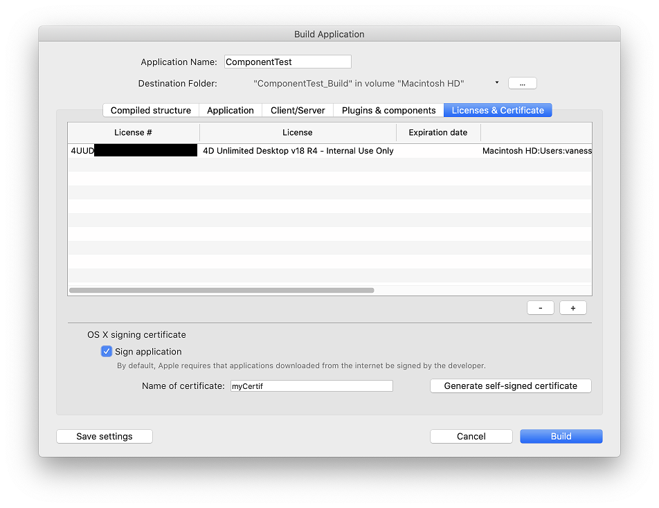
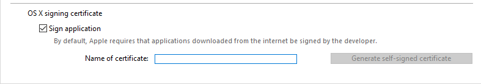
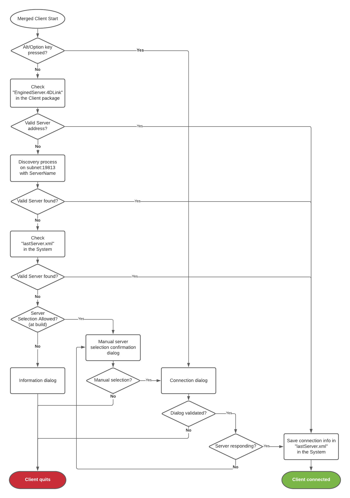
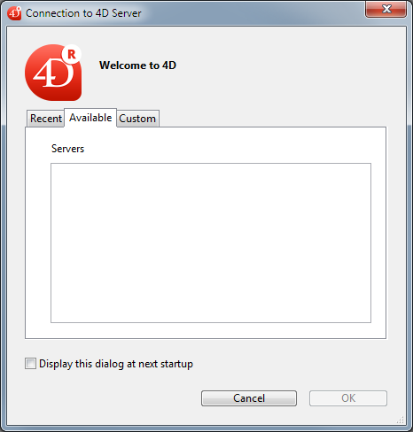

4D incluye un generador de aplicaciones para crear un paquete de proyecto (versión final). Este generador simplifica el proceso de finalización y despliegue de las aplicaciones compiladas en 4D. Maneja automáticamente las funcionalidades específicas de los distintos sistemas operativos y facilita el despliegue de aplicaciones cliente-servidor.

El generador de aplicaciones le permite:

* Generar una estructura compilada, sin código interpretado,
* Generar una aplicación autónoma ejecutable, *es decir*, fusionada con 4D Volume Desktop, el motor de base de datos 4D,
* Generar diferentes aplicaciones a partir de la misma estructura compilada mediante un proyecto XML,
* Generar aplicaciones cliente-servidor homogéneas,
* Generar aplicaciones cliente-servidor con actualización automática de los componentes del cliente y del servidor.
* Guardar sus parámetros de generación para su uso futuro (botón *Guardar los parámetros*).

> Las aplicaciones compiladas se basan en archivos [.4dz](#build-compiled-structure) que son **de sólo lectura**. Tenga en cuenta que el uso de comandos o funciones que modifican los archivos fuente (como `CREATE INDEX` o `CREATE TABLE` (SQL)) no es posible por defecto en las aplicaciones compiladas. Sin embargo, puede crear aplicaciones específicas que soporten modificaciones locales utilizando la llave XML `PackProject` (ver [doc.4d.com](https://doc.4d.com)).

## Generalidades

Generar un paquete de proyecto puede realizarse utilizando:

* el comando [`BUILD APPLICATION`](https://doc.4d.com/4dv19/help/command/en/page871.html),
* o el [diálogo Generador de aplicaciones](#application-builder).

### Diálogo crear aplicación

Para mostrar la caja de diálogo Generar la aplicación, seleccione **Diseño** > **Generar la aplicación...** en la barra de menús.


La caja de diálogo del generador de aplicaciones incluye varias páginas a las que se puede acceder mediante pestañas:


La generación sólo puede efectuarse una vez compilado el proyecto. Si selecciona este comando sin haber compilado previamente el proyecto, o si el código compilado no se corresponde con el código interpretado, aparece una caja de diálogo de advertencia que indica que el proyecto debe ser (re)compilado.

### buildApp.4DSettings

Cada parámetro de generación de la aplicación se almacena como una llave XML en el archivo proyecto de la aplicación llamada `"buildApp.4DSettings"`, ubicado en la carpeta [`Settings` del proyecto](../Project/architecture.md#settings-1).

Los parámetros por defecto se utilizan la primera vez que se utiliza la caja de diálogo del Generador de aplicaciones. El contenido del archivo proyecto se actualiza, si es necesario, al hacer clic en **Construir** o **Guardar los parámetros**. Puede definir varios archivos de parámetros XML para el mismo proyecto y utilizarlos con el comando [BUILD APPLICATION](https://doc.4d.com/4dv19/help/command/en/page871.html).

Las llaves XML ofrecen opciones adicionales a las que se muestran en la caja de diálogo del Generador de aplicaciones. La descripción de estas llaves se detalla en el manual [4D XML Keys BuildApplication](https://doc.4d.com/4Dv19/4D/19/4D-XML-Keys-BuildApplication.100-5447429.en.html).

### Archivo de historial

Cuando se crea una aplicación, 4D genera un archivo de registro llamado *BuildApp.log.xml* en la carpeta **Logs** del proyecto. El archivo de historial almacena la siguiente información para cada generación:

* El inicio y el fin de la generación de objetivos,
* El nombre y la ruta de acceso completa de los archivos generados,
* La fecha y la hora de la generación,
* Todos los errores que se han producido,
* Todo problema de firma (por ejemplo, un plug-in no firmado).

La verificación de este archivo puede ayudarle a ahorrar tiempo durante los siguientes pasos de despliegue, por ejemplo, si tiene la intención de notarizar su aplicación.

> Utilice el comando `Get 4D file(Build application log file)` para obtener la ubicación del archivo de registro.

## Nombre de la aplicación y carpeta de destino


Introduzca el nombre de la aplicación en **Nombre de la aplicación**.

Especifique la carpeta para la aplicación generada en la **Carpeta de destino**. Si la carpeta especificada no existe todavía, 4D creará una carpeta *Build*.

## Página de estructura compilada

Esta pestaña le permite generar un archivo de estructura compilado estándar y/o un componente compilado:


### Generar una estructura compilada

Genera una aplicación que sólo contiene código compilado.

Esta funcionalidad crea un archivo *.4dz* dentro de una carpeta `Compiled Database/&#060;project name&#062;`. Por ejemplo, si ha llamado a su aplicación "MyProject", 4D creará:

`\&#060;destination\&#062;/Compiled Database/MyProject/MyProject.4dz`

Un archivo .4dz es esencialmente una versión comprimida (empaquetada) de la carpeta del proyecto. Un archivo .4dz es esencialmente una versión comprimida (empaquetada) de la carpeta del proyecto. El tamaño compacto y optimizado de los archivos .4dz hace que los paquetes de proyectos sean fáciles de desplegar.

> Al generar archivos .4dz, 4D utiliza por defecto un formato zip **estándar**. La ventaja de este formato es que es fácilmente legible por cualquier herramienta unzip. Si no desea utilizar este formato estándar, añada la llave XML `UseStandardZipFormat` con el valor `False` en su archivo [`buildApp. 4DSettings`](#build-application-settings) (para más información, consulte el manual [4D XML Keys BuildApplication](https://doc.4d.com/4Dv19/4D/19/4D-XML-Keys-BuildApplication.100-5447429.en.html)).

#### Incluir las carpetas asociadas

Cuando se marca esta opción, todas las carpetas relacionadas con el proyecto se copian en la carpeta Build como carpetas *Components* y *Resources*. Para más información sobre estas carpetas, consulte la [descripción de la arquitectura del proyecto](Project/architecture.md).

### Generar un componente

Genera un componente compilado a partir de la estructura.

Un componente es un proyecto estándar 4D en el que se han desarrollado funcionalidades específicas. Un componente es un proyecto estándar 4D en el que se han desarrollado funcionalidades específicas.

Si ha llamado a su aplicación, *MiComponente*, 4D creará una carpeta *Components* que contiene la carpeta *MiComponente.4dbase*:

`\&#060;destination&#062;/Components/MyComponent.4dbase/MyComponent.4DZ`.

La carpeta *MyComponent.4dbase* contiene:

* archivo *MyComponent.4DZ*
* Una carpeta *Resources*: todos los resources asociados se copian automáticamente en esta carpeta. Los otros componentes y/o carpetas de plugins no se copian (un componente no puede utilizar plugins u otros componentes).

## Página Application

Esta pestaña le permite crear una versión autónoma y monopuesto de su aplicación:


### Crear una aplicación autónoma

Al marcar la opción **Crear una aplicación autónoma** y hacer clic en **Generar** se creará una aplicación autónoma (con doble clic) directamente desde su proyecto de aplicación.

Los siguientes elementos son necesarios para la creación:

* 4D Volume Desktop (el motor de la base de datos 4D),
* una [licencia apropiada](#licenses)

En Windows, esta función crea un archivo ejecutable (.exe). En macOS, se encarga de la creación de paquetes de software.

El principio consiste en fusionar un archivo de estructura compilado con 4D Volume Desktop. Las funcionalidades ofrecidas por el archivo 4D Volume Desktop están relacionadas con la oferta de productos a la que se ha suscrito. Las funcionalidades ofrecidas por el archivo 4D Volume Desktop están relacionadas con la oferta de productos a la que se ha suscrito.

Puede definir un archivo de datos por defecto o permitir a los usuarios crear y utilizar su propio archivo de datos (ver la sección [Gestión de archivos de datos en las aplicaciones finales](https://doc.4d.com/4Dv17R6/4D/17-R6/Data-file-management-in-final-applications.300-4354729.en.html)).

Es posible automatizar la actualización de las aplicaciones monopuesto fusionadas mediante una secuencia de comandos de lenguaje (ver [Actualización automática de aplicaciones servidor o monopuesto](https://doc.4d.com/4Dv17R6/4D/17-R6/Automatic-updating-of-server-or-single-user-applications.300-4354721.en.html).

#### Ubicación de 4D Volume Desktop

Para crear una aplicación autónoma, primero debe designar la carpeta que contiene el archivo 4D Volume Desktop:

* *Windows* - the folder contains the 4D Volume Desktop.4DE, 4D Volume Desktop. RSR, as well as various files and folders required for its operation. Estos elementos deben colocarse al mismo nivel que la carpeta seleccionada.
* *macOS* - 4D Volume Desktop se entrega en forma de un paquete de software estructurado que contiene varios archivos y carpetas genéricos.

Para seleccionar la carpeta 4D Volume Desktop, haga clic en el botón **[...]**. Aparece una caja de diálogo que le permite designar la carpeta de 4D Volume Desktop (Windows) o el paquete (macOS).

Una vez seleccionada la carpeta, se muestra su ruta completa y, si realmente contiene 4D Volume Desktop, se activa la opción de generación de una aplicación ejecutable.

> El número de versión de 4D Volume Desktop debe coincidir con el número de versión de 4D Developer Edition. Por ejemplo, si utiliza 4D Developer v18, debe seleccionar un 4D Volume Desktop v18.

#### Modo de enlace de datos

Esta opción permite elegir el modo de enlace entre la aplicación fusionada y el archivo de datos local. Hay dos modos de enlazar disponibles:

* **Por nombre de la aplicación** (por defecto) - La aplicación 4D abre automáticamente el archivo de datos abierto más recientemente correspondiente al archivo de estructura. Esto le permite mover el paquete de aplicaciones libremente en el disco. Esta opción debería usarse generalmente para aplicaciones fusionadas, a menos que necesite específicamente duplicar su aplicación.

* **Por ruta de la aplicación** - La aplicación 4D fusionada analizará el archivo *lastDataPath.xml* de la aplicación e intentará abrir el archivo de datos con un atributo "executablePath" que coincida con la ruta completa de la aplicación. Si se encuentra una entrada de este tipo, se abre su correspondiente archivo de datos (definido a través de su atributo "dataFilePath"). Si se encuentra una entrada de este tipo, se abre su correspondiente archivo de datos (definido a través de su atributo "dataFilePath").

Para más información sobre el modo de vinculación de datos, consulte la sección [Último archivo de datos abierto](#last-data-file-opened).

#### Archivos generados

Al hacer clic en el botón **Generar**, 4D crea automáticamente una carpeta **Final Application** en la **carpeta de destino** definida. Dentro de la carpeta Final Application hay una subcarpeta con el nombre de la aplicación especificada.

Si ha especificado "MyProject" como nombre de la aplicación, encontrará los siguientes archivos en esta subcarpeta (MyProject):

* *Windows*
  * MyProject.exe - Su ejecutable y un MyProject.rsr (los recursos de la aplicación)
  * Las carpetas 4D Extensions y Resources, varias librerías (DLL), la carpeta Native Components y SASL Plugins - Archivos necesarios para el funcionamiento de la aplicación
  * Una carpeta Database  - Incluye una carpeta Resources y un archivo MyProject.4DZ. Constituyen la estructura compilada del proyecto, así como también la carpeta Resources. **Nota**: esta carpeta también contiene la carpeta *Default Data*, si se ha definido (ver [Gestión de archivos de datos en las aplicaciones finales](#data-file-management-in-final-applicatons).
  * (Opcional) Carpeta de componentes y/o carpeta Plugins - Contiene todos los componentes y/o archivos de plugins incluidos en el proyecto. Para más información sobre este punto, consulte la sección [Plugins y componentes](#plugins-and-components).
  * Carpeta Licenses - Un archivo XML de números de licencia integrados en la aplicación. Para obtener más información sobre este punto, consulte la sección [Licencias y certificados](#licenses-and-certificate).
  * Elementos adicionales añadidos a la carpeta 4D Volume Desktop, si los hay (ver [Personalizar la carpeta 4D Volume Desktop](#customizing-4d-volume-desktop-folder)).

 Todos estos elementos deben estar en la misma carpeta para que el ejecutable funcione.

* *macOS*
  * Un paquete de software llamado MyProject.app que contiene su aplicación y todos los elementos necesarios para su funcionamiento, incluyendo los plug-ins, componentes y licencias. Para más información sobre la integración de plug-ins y componentes, consulte la sección [Plugins y componentes](#plugins-and-components). Para obtener más información sobre la integración de licencias, consulte la sección [Licencias y certificados](#licenses-and-certificate). **Nota**: en macOS, el comando [Archivo aplicación](https://doc.4d.com/4Dv18R4/4D/18-R4/Application-file.301-4982855.en.html) del lenguaje 4D devuelve la ruta del archivo NombreApplication (situado en la carpeta Contents:macOS del paquete de software) y no la del archivo .comp (carpeta Contents:

#### Personalizar la carpeta 4D Volume Desktop

Cuando se construye una aplicación independiente, 4D copia el contenido de la carpeta 4D Volume Desktop en la carpeta Destination > *Final Application*. A continuación, podrá personalizar el contenido de la carpeta 4D Volume Desktop original según sus necesidades. Puede, por ejemplo:

* Instalar una versión de 4D Volume Desktop correspondiente a un lenguaje específico;
* Añadir una carpeta *PlugIns* personalizada;
* Personalizar el contenido de la carpeta *Resources*.
> The macOS packages built contain the same items as the Windows subfolders. You can display their contents (**Control+click** on the icon) in order to be able to modify them.

#### Ubicación de los archivos web

Si su aplicación ejecutable se utiliza como servidor web, los archivos y los archivos y carpetas requeridos por el servidor deben instalarse en ubicaciones específicas. Estos elementos son los siguientes:

* archivos *cert.pem* y *key.pem* (opcional): etos archivos se utilizan para las conexiones TLS y por los comandos de encriptación de datos,
* carpeta raíz web por defecto.

Los elementos deben ser instalados:

* **En Windows**: en la subcarpeta *Final Application\MyProject\Database*.
* **En macOS**: junto al paquete de software *MyProject.app*.

## Página Cliente/Servidor

En esta pestaña, usted puede construir aplicaciones cliente y servidor personalizadas que son homogénicas, multiplataforma y con una opción de actualización automática.


### ¿Qué es una aplicación cliente/servidor?

Una aplicación cliente/servidor proviene de la combinación de tres elementos:

* Un proyecto 4D compilado,
* La aplicación 4D Server,
* La aplicación 4D Volumen Desktop (macOS y/o Windows).

Una vez generada, una aplicación cliente/servidor se compone de dos partes personalizadas: la parte Servidor (única) y la parte Cliente (a instalar en cada máquina cliente).

> Si desea desplegar una aplicación cliente/servidor en un entorno heterogéneo (aplicaciones cliente ejecutándose en máquinas Intel/AMD y Apple Silicon), se recomienda [compilar el proyecto para todos los procesadores](Project/compiler.md#compilation-target) en una máquina macOS, para que todas las aplicaciones clientes funcionen de forma nativa.

Además, se personaliza la aplicación cliente/servidor y se simplifica su manejo:

* Para lanzar la parte del servidor, el usuario simplemente hace doble clic en la aplicación servidor. No es necesario seleccionar el archivo proyecto.
* Para lanzar la parte cliente, el usuario simplemente hace doble clic en la aplicación cliente, que se conecta directamente a la aplicación servidor. No es necesario elegir un servidor en una caja de diálogo de conexión. Si desea que la aplicación cliente se conecte al servidor utilizando una dirección específica (distinta del nombre del servidor publicado en la subred), debe utilizar la llave XML `IPAddress` en el archivo buildapp.4DSettings. Si la conexión falla, \[se pueden implementar mecanismos alternativos específicos\](#management-of-client-connections). Puede "forzar" la visualización de la caja de diálogo de conexión estándar presionando la tecla **Opción** (macOS) o **Alt** (Windows) mientras inicia la aplicación cliente. Sólo la parte cliente puede conectarse a la parte del servidor correspondiente. Si un usuario intenta conectarse a la parte servidor utilizando una aplicación estándar 4D, se devuelve un mensaje de error y la conexión es imposible.
* Una aplicación cliente/servidor puede configurarse para que la parte cliente [se actualice automáticamente a través de la red](#copy-of-client-applications-in-the-server-application). Sólo es necesario crear y distribuir una versión inicial de la aplicación cliente, las actualizaciones posteriores se gestionan mediante el mecanismo de actualización automática.
* También es posible automatizar la actualización de la parte del servidor mediante el uso de una secuencia de comandos del lenguaje ([SET UPDATE FOLDER](https://doc.4d.com/4dv19/help/command/en/page1291.html) y [RESTART 4D]((https://doc.4d.com/4dv19/help/command/en/page1292.html)).

### Construir aplicación servidor

Marque esta opción para generar la parte del servidor de su aplicación durante la fase de construcción. Debe designar la ubicación en su disco de la aplicación 4D Server que va a utilizar. Debe designar la ubicación en su disco de la aplicación 4D Server que va a utilizar.

#### Ubicación de 4D Server

Haga clic en el botón **[...]** y utilice la caja de diálogo *Navegar carpeta* para localizar la aplicación 4D Server. En macOS, debe seleccionar directamente el paquete 4D Server.

#### Versión actual

Se utiliza para indicar el número de versión actual de la aplicación generada. A continuación, podrá aceptar o rechazar las conexiones de las aplicaciones cliente en función de su número de versión. El intervalo de compatibilidad para las aplicaciones cliente y servidor se define mediante el uso de [llaves XML](#buildapp4dsettings) específicas).

#### Integrar el proyecto Usuarios y Grupos en la aplicación servidor creada

**Nota preliminar:** en esta sección se utilizan los siguientes términos:

| Nombre                                 | Definición                                                                                                                                                                    |
| -------------------------------------- | ----------------------------------------------------------------------------------------------------------------------------------------------------------------------------- |
| Archivo de directorio del proyecto     | archivo [directory.json](../Users/handling_users_groups.md#directoryjson-file) ubicado en la [carpeta Settings](../Project/architecture.md#settings-1) del proyecto           |
| Archivo de directorio de la aplicación | archivo [directory.json](../Users/handling_users_groups.md#directoryjson-file) ubicado en la [carpeta Settings](../Project/architecture.md#settings-1) del servidor 4D creado |
| Archivo de directorio de datos         | archivo [directory.json](../Users/handling_users_groups.md#directoryjson-file) en la carpeta [Data > Settings](../Project/architecture.md#settings)                           |

Cuando se marca esta opción, el archivo del directorio del proyecto se copia en el archivo del directorio de la aplicación en el momento de la generación.

Cuando ejecute una aplicación de servidor 4D generada:

* Si el servidor tiene un archivo de directorio de datos, se carga.
* Si el servidor no tiene un archivo de directorio de datos, se carga el archivo de directorio de la aplicación.

El archivo de directorio de la aplicación es de sólo lectura. Las modificaciones realizadas a los usuarios, grupos y permisos durante la ejecución del servidor se almacenan en el archivo del directorio de datos. Si ya no existe ningún archivo de directorio de datos, se creará automáticamente. Si el archivo del directorio de la aplicación estaba integrado, se duplica como archivo del directorio de datos.

La incorporación del archivo del directorio del proyecto le permite desplegar una aplicación cliente/servidor con una configuración básica de la seguridad de los usuarios y de los grupos. Las modificaciones posteriores se añaden al archivo del directorio de datos.

#### Autorizar la conexión de los clientes Silicon Mac

Cuando se cree un servidor en Windows, marque esta opción para permitir que los clientes Apple Silicon se conecten a su aplicación servidor. A continuación, puede especificar una ruta de acceso a la estructura compilada para Apple Silicon/Intel.

Para permitir a los clientes Apple Silicon conectarse a una aplicación servidor creada en Windows, primero debe crear una aplicación cliente en macOS, con un proyecto compilado para Apple Silicon e Intel. Esto crea automáticamente una estructura compilada, idéntica a la creada con la opción **[Build compiled structure](#build-compiled-structure)** (sin las carpetas asociadas).

A continuación, puede copiar esa estructura en su máquina Windows y utilizarla para construir la aplicación servidor:


#### Ubicación de la estructura compilada

Ruta de acceso a la estructura compilada de la aplicación cliente Apple Silicon/Intel utilizada para crear un servidor Windows (ver [Permitir la conexión de clientes Silicon Mac](#allow-connection-of-silicon-mac-clients).

#### Modo de enlace de datos

Esta opción permite elegir el modo de enlace entre la aplicación fusionada y el archivo de datos local. Hay dos modos de enlazar disponibles:

* **Por nombre de la aplicación** (por defecto) - La aplicación 4D abre automáticamente el archivo de datos abierto más recientemente correspondiente al archivo de estructura. Esto le permite mover el paquete de aplicaciones libremente en el disco. Esta opción debería usarse generalmente para aplicaciones fusionadas, a menos que necesite específicamente duplicar su aplicación.

* **Por ruta de la aplicación** - La aplicación 4D fusionada analizará el archivo *lastDataPath.xml* de la aplicación e intentará abrir el archivo de datos con un atributo "executablePath" que coincida con la ruta completa de la aplicación. Si se encuentra una entrada de este tipo, se abre su correspondiente archivo de datos (definido a través de su atributo "dataFilePath"). Si se encuentra una entrada de este tipo, se abre su correspondiente archivo de datos (definido a través de su atributo "dataFilePath").

Para más información sobre el modo de vinculación de datos, consulte la sección [Último archivo de datos abierto](#last-data-file-opened).

### Construir la aplicación cliente

Marque esta opción para generar la parte cliente de su aplicación durante la fase de construcción.

Puede marcar esta opción:

* junto con la opción [**Build server application**](#build-server-application) para crear las partes servidor y cliente correspondientes para la plataforma actual y (opcionalmente) incluir los archivos de actualización automática,
* sin seleccionar la opción [**Build server application**](#build-server-application), generalmente para crear el archivo de actualización que se seleccionará de la plataforma "concurrente" al generar la parte servidor.

#### Ubicación de 4D Volume Desktop

Designa la ubicación en su disco de la aplicación 4D Volume Desktop que se utilizará para construir la parte cliente de su aplicación.

> El número de versión de 4D Volume Desktop debe coincidir con el número de versión de 4D Developer Edition. El número de versión de 4D Volume Desktop debe coincidir con el número de versión de 4D Developer Edition.

El 4D Volume Desktop debe corresponder a la plataforma actual (que será también la plataforma de la aplicación cliente). Si desea generar una aplicación cliente para la plataforma "concurrente", debe realizar una operación adicional utilizando una aplicación 4D que se ejecute en dicha plataforma.

Si desea que la aplicación cliente se conecte al servidor utilizando una dirección específica (distinta del nombre del servidor publicado en la subred), debe utilizar la llave XML `IPAddress` en el archivo buildapp.4DSettings. Para más información sobre este archivo, consulte la descripción del comando [`BUILD APPLICATION`](https://doc.4d.com/4dv19/help/command/en/page871.html). También puede implementar mecanismos específicos en caso de fallo de la conexión. También puede implementar mecanismos específicos en caso de fallo de la conexión.

#### Copia de las aplicaciones clientes en la aplicación servidor

Las opciones de esta área configuran el mecanismo para actualizar la(s) parte(s) cliente de sus aplicaciones cliente/servidor utilizando la red cada vez que se genera una nueva versión de la aplicación. Estas opciones sólo se activan cuando la opción **Crear aplicación cliente** está marcada.

* **Permitir la actualización automática de la aplicación cliente Windows** - Marque esta opción para construir un archivo `.4darchive` que puede ser enviado a sus aplicaciones cliente en la plataforma Windows en caso de actualización.
* **Permitir la actualización automática de la aplicación cliente Macintosh** - Marque esta opción para construir un archivo `.4darchive` que puede ser enviado a sus aplicaciones cliente en la plataforma Macintosh en caso de actualización.

El archivo `.4darchive` se copia en la siguiente ubicación:

```
<ApplicationName>_Build/Client Server executable/Upgrade4DClient/
```

#### Seleccionar el archivo cliente para la plataforma concurrente

Puede marcar la opción **Permitir la actualización automática...** para las aplicaciones clientes ejecutadas en la plataforma concurrente. Esta opción sólo se activa si:

* la opción **Crear aplicación servidor** está marcada,
* la opción **Permitir la actualización automática...** para las aplicaciones clientes ejecutadas en la plataforma actual está marcada.

Esta funcionalidad requiere que haga clic en el botón **[...]** y designe la ubicación en su disco del archivo que se utilizará para la actualización. El archivo a seleccionar depende de la plataforma actual del servidor:

| Plataforma del servidor actual | Archivo requerido                                           | Detalles                                                                                                                                                                                              |
| ------------------------------ | ----------------------------------------------------------- | ----------------------------------------------------------------------------------------------------------------------------------------------------------------------------------------------------- |
| macOS                          | Windows 4D Volume Desktop *o* Windows client update archive | Por defecto, se selecciona la aplicación `4D Volume Desktop` para Windows. Para seleccionar un archivo `.4darchive` previamente construido en Windows, presione **Shift** mientras hace clic en [...] |
| Windows                        | macOS client update archive                                 | Seleccione un archivo `.4darchive` firmado previamente creado en macOS                                                                                                                                |

Puede construir un archivo `.4darchive` específicamente en la plataforma concurrente seleccionando únicamente la opción [**Construir aplicación cliente**](#build-client-application) y la opción apropiada [**Permitir actualización automática...**](#copy-of-client-applications-inside-the-server-application).

#### Visualización de la notificación de actualización

La notificación de actualización de la aplicación cliente se realiza automáticamente tras la actualización de la aplicación servidor.

Funciona de la siguiente manera: cuando se genera una nueva versión de la aplicación cliente/servidor utilizando el generador de aplicaciones, la nueva parte cliente se copia como un archivo comprimido en la subcarpeta **Upgrade4DClient** de la carpeta **NomApplication** Server (en macOS, estas carpetas se incluyen en el paquete servidor). If you have followed the process for generating a cross-platform client application, a .*4darchive* update file is available for each platform:

To trigger client application update notifications, simply replace the old version of the server application with the new one and then execute it. El resto del proceso es automático.

On the client side, when the “old” client application tries to connect to the updated server application, a dialog box is displayed on the client machine, indicating that a new version is available. El usuario puede actualizar su versión o cancelar la caja de diálogo.

* If the user clicks **OK**, the new version is downloaded to the client machine over the network. Una vez finalizada la descarga, se cierra la aplicación cliente antigua y se lanza la nueva versión, que se conecta al servidor. Una vez finalizada la descarga, se cierra la aplicación cliente antigua y se lanza la nueva versión, que se conecta al servidor.
* If the user clicks **Cancel**, the update is cancelled; if the old version of the client application is not in the range of versions accepted by the server (please refer to the following paragraph), the application is closed and connection is impossible. En caso contrario (por defecto), se establece la conexión.

#### Forzar las actualizaciones automáticas

In some cases, you may want to prevent client applications from being able to cancel the update download. For example, if you used a new version of the 4D Server source application, the new version of the client application must absolutely be installed on each client machine.

To force the update, simply exclude the current version number of client applications (X-1 and earlier) in the version number range compatible with the server application. En este caso, el mecanismo de actualización no permitirá que las aplicaciones cliente no actualizadas se conecten. En este caso, el mecanismo de actualización no permitirá que las aplicaciones cliente no actualizadas se conecten.

The [current version number](#current_version) is set on the Client/Server page of the Build Application dialog box. The intervals of authorized numbers are set in the application project using specific [XML keys](#buildapp4dsettings).

#### En caso de error

If 4D cannot carry out the update of the client application, the client machine displays the following error message: "The update of the client application failed. La aplicación va a cerrar ahora."

Hay muchas causas posibles para este error. When you get this message, it is advisable to check the following parameters first off:

* **Pathnames** - Check the validity of the pathnames set in the application project via the Application builder dialog box or via XML keys (for example *ClientMacFolderToWin*). More particularly, check the pathnames to the versions of 4D Volume Desktop.
* **Read/write privileges** - On the client machine, check that the current user has write access rights for the client application update.

### Archivos generados

Once a client/server application is built, you will find a new folder in the destination folder named **Client Server executable**. This folder contains two subfolders, `\&#060;ApplicationName&#062;Client` and `\&#060;ApplicationName&#062;Server`.
> Estas carpetas no se generan si ocurre un error. In this case, open the [log file](#log-file) in order to find out the cause of the error.

The `\&#060;ApplicationName&#062;Client` folder contains the client portion of the application corresponding to the execution platform of the application builder. Esta carpeta debe instalarse en cada máquina cliente. The `\&#060;ApplicationName&#062;Server` folder contains the server portion of the application.

The contents of these folders vary depending on the current platform:

* *Windows* - Each folder contains the application executable file, named `\&#060;ApplicationName&#062;Client.exe` for the client part and `\&#060;ApplicationName&#062;Server.exe` for the server part as well as the corresponding .rsr files. The folders also contain various files and folders necessary for the applications to work and customized items that may be in the original 4D Volume Desktop and 4D Server folders.
* *macOS* - Each folder contains only the application package, named `\&#060;ApplicationName&#062; Client` for the client part and `\&#060;ApplicationName&#062; Server` for the server part. Cada paquete contiene todos los elementos necesarios para que la aplicación funcione. En macOS, un paquete se lanza haciendo doble clic en él.

 > The macOS packages built contain the same items as the Windows subfolders. In order to modify it, you must first display its contents (**Control+click** on the icon).

If you checked the “Allow automatic update of client application” option, an additional subfolder called *Upgrade4DClient* is added in the `\&#060;ApplicationName&#062;Server` folder/package. Esta subcarpeta contiene la aplicación cliente en formato macOS y/o Windows como archivo comprimido. Esta subcarpeta contiene la aplicación cliente en formato macOS y/o Windows como archivo comprimido.

#### Ubicación de los archivos web

If the server and/or client part of your double-clickable application is used as a Web server, the files and folders required by the server must be installed in specific locations. Estos elementos son los siguientes:

* archivos *cert.pem* y *key.pem* (opcional): etos archivos se utilizan para las conexiones TLS y por los comandos de encriptación de datos,
* Carpeta raíz web por defecto (WebFolder).

Los elementos deben ser instalados:

* **en Windows**
  * **Server application** - in the `Client Server executable\/\&#060;ApplicationName&#062;Server/Server Database` subfolder.
  * **Client application** - in the `Client Server executable\/\&#060;ApplicationName&#062;Client` subfolder.

* **en macOS**
  * **Server application** - next to the `\&#060;ApplicationName&#062;Server` software package.
  * **Client application** - next to the `\&#060;ApplicationName&#062;Client` software package.

### Integrar una aplicación cliente monopuesto

4D permite integrar una estructura compilada en la aplicación Cliente. This feature can be used, for example, to provide users with a "portal" application, that gives access to different server applications thanks to the `OPEN DATABASE` command executing a `.4dlink` file.

To enable this feature, add the `DatabaseToEmbedInClientWinFolder` and/or `DatabaseToEmbedInClientMacFolder` keys in the *buildApp* settings file. When one of these keys is present, the client application building process generates a single-user application: the compiled structure, instead of the *EnginedServer.4Dlink* file, is placed in the "Database" folder.

* If a default data folder exists in the single-user application, a licence is embedded.
* If no default data folder exists in the single-user application, it will be executed without data file and without licence.

El escenario básico es:

1. In the Build application dialog box, select the "Build compiled structure" option to produce a .4DZ or .4DC for the application to be used in single-user mode.
2. In the *buildApp.4DSettings* file of the client-server application, use following xml key(s) to indicate the path to the folder containing the compiled single user application:

* `DatabaseToEmbedInClientWinFolder`
* `DatabaseToEmbedInClientMacFolder`

3. Genere la aplicación cliente-servidor. Esto tendrá los siguientes efectos:

* the whole folder of the single user application is copied inside the "Database" folder of the merged client
* the *EnginedServer.4Dlink* file of the "Database" folder is not generated
* the .4DC, .4DZ, .4DIndy files of the single user application copy are renamed using the name of the merged client
* the `PublishName` key is not copied in the *info.plist* of the merged client
* if the single-user application does not have a "Default data" folder, the merged client will run with no data.

Automatic update 4D Server features ([Current version](#current-version) number, `SET UPDATE FOLDER` command...) work with single-user application as with standard remote application. At connection, the single-user application compares its `CurrentVers` key to the 4D Server version range. If outside the range, the updated client application is downloaded from the server and the Updater launches the local update process.

### Personalizar nombres de carpeta de caché cliente y/o servidor

Client and server cache folders are used to store shared elements such as resources or components. Son necesarios para gestionar los intercambios entre el servidor y los clientes remotos. Client/server applications use default pathnames for both client and server system cache folders.

In some specific cases, you might need to customize the names of these folders to implement specific architectures (see below). 4D provides you with the `ClientServerSystemFolderName` and `ServerStructureFolderName` keys to be set in the *buildApp* settings file.

#### Carpeta de caché cliente

Customizing the client-side cache folder name can be useful when your client application is used to connect to several merged servers which are similar but use different data sets. In this case, to save multiple unnecessary downloads of identical local resources, you can use the same custom local cache folder.

* Default configuration (*for each connection to a server, a specific cache folder is downloaded/updated*):


* Using the `ClientServerSystemFolderName` key (*a single cache folder is used for all servers*):


#### Carpeta de caché del servidor

Customizing the server-side cache folder name is useful when you run several identical server applications built with different 4D versions on the same computer. If you want each server to use its own set of resources, you need to customize the server cache folder.

* Default configuration (*same server applications share the same cache folder*):


* Using the `ServerStructureFolderName` key (*a dedicated cache folder is used for each server application*):


## Página Plugins y componentes

On this tab, you set each [**plug-in**](Concepts/plug-ins.md), [**component**](Concepts/components.md), and [**module**](#deselecting-modules) that you will use in your stand-alone or client/server application.

La página lista los elementos cargados por la aplicación 4D actual:


* **Active** column - Indicates that the items will be integrated into the application package built. Todos los elementos están marcados por defecto. To exclude a plug-in, a component, or a module, deselect the check box next to it.

* **Plugins and components** column - Displays the name of the plug-in/component/module.

* **ID** column - Displays the element's identification number (if any).

* **Type** column - Indicates the type of item: Plug-in, Component, or Module.

### Añadiendo plug-ins o componentes

If you want to integrate other plug-ins or components into the executable application, you just need to place them in a **PlugIns** or **Components** folder next to the 4D Volume Desktop application or next to the 4D Server application. The mechanism for copying the contents of the source application folder (see [Customizing the 4D Volume Desktop folder](#customizing-4d-volume-desktop-folder)) can be used to integrate any type of file into the executable application.

If there is a conflict between two different versions of the same plug-in (one loaded by 4D and the other located in the source application folder), priority goes to the plug-in installed in the 4D Volume Desktop/4D Server folder. However, if there are two instances of the same component, the application will not open.
> The use of plug-ins and/or components in a deployment version may require license numbers.

### Desmarcar módulos

A module is a built-in code library used by 4D to control specific features. If you know that your built application does not use any of the features covered by a module, you can deselect it in the list to reduce the size of your application files.

> **Warning:** Deselecting a module could prevent your built application from working as expected. If you are not 100% certain that a module is never called by your application, it is recommended to keep it selected.

Los siguientes módulos opcionales pueden ser deseleccionados:

* **CEF**: Librería integrada Chromium. It is necessary to run [Web areas](../FormObjects/webArea_overview.md) that use the embedded rendering engine and [4D View Pro areas](../FormObjects/viewProArea_overview.md). Calling such areas when CEF is deselected will display blank areas and/or generate errors.
* **MeCab**: Library used for text indexing in Japanese language (see this [settings paragraph](../settings/database.md#support-of-mecab-japanese-version)). Deselecting this module will force text indexes to be rebuilt in Japanese language.

> If you deselect MeCab for an application in Japanese language used on heterogeneous platforms, make sure to deselect it on both client/server build and [client application build](#build-client-application) (for the concurrent platform), otherwise major malfunctions will occur in the application.

* **PHP**: Necessary to use PHP features and commands in 4D (see this [settings paragraph](../settings/php.md)).
* **SpellChecker**: Used for built-in [spellchecking features](../FormObjects/properties_Entry.md#auto-spellcheck) and commands available for input areas and 4D Write Pro areas.
* **4D Updater**: Controls the [automatic update](#what-is-a-clientserver-application) of client parts and is used by the `SET UPDATE FOLDER` command for [automated server updates](#automatic-updating-of-server-or-single-user-applications).

## Página Licences & Certificado

La página de Licencias & Certificados puede utilizarse para:

* designate the license number(s) that you want to integrate into your single-user stand-alone application
* firmar la aplicación mediante un certificado en macOS.



### Licencias

This tab displays the list of available deployment licenses that you can integrate into your application. Por defecto, la lista está vacía. Debe añadir explícitamente su licencia *4D Developer Professional*, así como cada licencia *4D Desktop Volume* que se vaya a utilizar en la aplicación generada. You can add another 4D Developer Professional number and its associated licenses other than the one currently being used.

To remove or add a license, use the **[+]** and **[-]** buttons at the bottom of the window.

When you click on the \[+] button, an open file dialog box appears displaying by default the contents of the *Licenses* folder of your machine. Para obtener más información sobre la ubicación de esta carpeta, consulte el comando [Get 4D folder](https://doc.4d.com/4Dv17R6/4D/17-R6/Get-4D-folder.301-4311294.en.html).

You must designate the files that contain your Developer license as well as those containing your deployment licenses. These files were generated or updated when the *4D Developer Professional* license and the *4D Desktop Volume* licenses were purchased.

Once you have selected a file, the list will indicate the characteristics of the license that it contains.

* **Licencia #** - número de licencia del producto
* **Licencia** - Nombre del producto
* **Expiration date** - Expiration date of the license (if any)
* **Ruta de acceso** - Ubicación en el disco

Si una licencia no es válida, un mensaje le avisará.

Puede designar tantos archivos válidos como desee. When building an executable application, 4D will use the most appropriate license available.
> Dedicated "R" licenses are required to build applications based upon "R-release" versions (license numbers for "R" products start with "R-4DDP").

After the application is built, a new deployment license file is automatically included in the Licenses folder next to the executable application (Windows) or in the package (macOS).

### Certificación de las aplicaciones en OS X

El generador de aplicaciones puede firmar aplicaciones 4D fusionadas bajo macOS (aplicaciones monopuesto, componentes, 4D Server y partes cliente bajo macOS). Signing an application authorizes it to be executed using the Gatekeeper functionality of macOS when the "Mac App Store and identified Developers" option is selected (see "About Gatekeeper" below).

* Check the **Sign application** option to include certification in the application builder procedure for OS X. 4D will check the availability of elements required for certification when the build occurs:



This option is displayed under both Windows and macOS, but it is only taken into account for macOS versions.

* **Name of certificate** - Enter the name of your developer certificate validated by Apple in this entry area. The certificate name is usually the name of the certificate in the Keychain Access utility (part in red in the following example):


To obtain a developer certificate from Apple, Inc., you can use the commands of the Keychain Access menu or go here: [http://developer.apple.com/library/mac/#documentation/Security/Conceptual/CodeSigningGuide/Procedures/Procedures.html](http://developer.apple.com/library/mac/#documentation/Security/Conceptual/CodeSigningGuide/Procedures/Procedures.html).
> This certificate requires the presence of the Apple codesign utility, which is provided by default and usually located in the “/usr/bin/” folder. Si se produce un error, asegúrese de que este utilitario esté presente en su disco.

* **Generar un certificado autofirmado** - ejecuta el "Asistente de Certificados" que permite generar un certificado autofirmado. Si no tiene un certificado de desarrollador Apple, debe suministrar un certificado autofirmado. Con este certificado, no se muestra ningún mensaje de alerta si la aplicación se despliega internamente. Si la aplicación se despliega externamente (es decir, a través de http o correo electrónico), al iniciarse macOS muestra un mensaje de alerta que indica que el desarrollador de la aplicación no está identificado. El usuario puede "forzar" la apertura de la aplicación. En el "Asistente de certificados", asegúrese de seleccionar las opciones apropiadas:  

> 4D recomienda suscribirse al Programa Apple Developer Program para tener acceso a los Certificados de Desarrollador que son necesarios para notarizar las aplicaciones (ver más abajo).

#### Sobre Gatekeeper

Gatekeeper es una función de seguridad de OS X que controla la ejecución de las aplicaciones descargadas de Internet. Si una aplicación descargada no procede del Apple Store o no está firmada, se rechaza y no se puede ser lanzada.

> En las máquinas Apple Silicon, los [componentes](#components)4D deben ser firmados. Un componente sin firmar generará un error al iniciar la aplicación ("lib4d-arm64.dylib no se puede abrir...").

La opción **Firmar la aplicación** del Generador de aplicaciones de 4D le permite generar aplicaciones y componentes compatibles con esta opción por defecto.

#### Sobre la notarización

La notarización de las aplicaciones es muy recomendada por Apple a partir de macOS 10.14.5 (Mojave) y 10.15 (Catalina), ya que las aplicaciones no notarizadas que se despliegan a través de internet se bloquean por defecto.

Las [funciones de firma integradas](#os-x-signing-certificate) de 4D se han adaptado para cumplir con todos los requisitos de Apple para permitir el uso del servicio de notario de Apple. La notarización en sí debe ser realizada por el desarrollador y es independiente de 4D (tenga en cuenta también que requiere la instalación de Xcode). La notarización en sí debe ser realizada por el desarrollador y es independiente de 4D (tenga en cuenta también que requiere la instalación de Xcode).

Para más información sobre el concepto de notarización, consulte [esta página en el sitio web para desarrolladores de Apple](https://developer.apple.com/documentation/xcode/notarizing_your_app_before_distribution/customizing_the_notarization_workflow).

## Personalizar los iconos de una aplicación

4D asocia un icono por defecto a las aplicaciones ejecutables (monopuestos y cliente-servidor). Sin embargo puede personalizar el icono para cada aplicación.

* **macOs** - cuando se crea una aplicación con doble clic, 4D se encarga de la personalización del icono. Para ello, debe crear un archivo de iconos (tipo icns), antes de crear el archivo de la aplicación, y colocarlo junto a la carpeta del proyecto.
> Apple, Inc. ofrece una herramienta específica para generar los archivos de iconos *icns* (para más información, consulte la [documentación de Apple](https://developer.apple.com/library/archive/documentation/GraphicsAnimation/Conceptual/HighResolutionOSX/Optimizing/Optimizing.html#//apple_ref/doc/uid/TP40012302-CH7-SW2)).

 Su archivo de iconos debe tener el mismo nombre que el archivo del proyecto e incluir la extensión *.icns*. 4D tiene en cuenta automáticamente este archivo cuando genera la aplicación de doble clic (el archivo *.icns* es renombrado *NomApplication.icns* y copiado en la carpeta Resources; la entrada *CFBundleFileIcon* del archivo *info.plist* es actualizada).

* **Windows** - Cuando se crea una aplicación con doble clic, 4D se encarga de la personalización de su icono. Para ello, debe crear un archivo de iconos (extensión *.ico*), antes de crear el archivo de la aplicación, y colocarlo junto a la carpeta del proyecto.

 Su archivo de iconos debe tener el mismo nombre que el archivo del proyecto e incluir la extensión *.ico*. 4D tiene en cuenta automáticamente este archivo cuando genera la aplicación de doble clic.

También puede definir las [llaves XML](https://doc.4d.com/4Dv17R6/4D/17-R6/4D-XML-Keys-BuildApplication.100-4465602.en.html) específicas en el archivo buildApp.4DSettings para designar cada icono a utilizar. Están disponibles las siguientes llaves:

* RuntimeVLIconWinPath
* RuntimeVLIconMacPath
* ServerIconWinPath
* ServerIconMacPath
* ClientMacIconForMacPath
* ClientWinIconForMacPath
* ClientMacIconForWinPath
* ClientWinIconForWinPath

## Gestión de archivos de datos

### Apertura del archivo de datos

Cuando un usuario lanza una aplicación fusionada o una actualización (aplicaciones monopuesto o cliente/servidor), 4D intenta seleccionar un archivo de datos válido. Varias ubicaciones son examinadas sucesivamente por la aplicación.

La secuencia de lanzamiento de una aplicación fusionada es:

1. 4D intenta abrir el último archivo de datos abierto, [como se describe a continuación](#last-data-file-opened) (no aplicable durante el lanzamiento inicial).
2. Si no se encuentra, 4D intenta abrir el archivo de datos en una carpeta de datos por defecto junto al archivo .4DZ en modo de sólo lectura.
3. Si no se encuentra, 4D intenta abrir el archivo de datos estándar por defecto (mismo nombre y misma ubicación que el archivo .4DZ).
4. Si no se encuentra, 4D muestra una caja de diálogo estándar "Abrir archivo de datos".

### Último archivo de datos abierto

#### Ruta del último archivo de datos

Toda aplicación autónoma o servidor generada con 4D almacena la ruta de acceso del último archivo de datos abierto en la carpeta de preferencias del usuario de la aplicación.

La ubicación de la carpeta de preferencias del usuario de la aplicación corresponde a la ruta devuelta por la instrucción siguiente:

```4d
userPrefs:=Get 4D folder(Carpeta 4D activa)
```

La ruta del archivo de datos se almacena en un archivo dedicado, llamado *lastDataPath.xml*.

Gracias a esta arquitectura, cuando usted ofrece una actualización de su aplicación, el archivo de datos del usuario local (último archivo de datos utilizado) se abre automáticamente en el primer lanzamiento.

Este mecanismo suele ser adecuado para los despliegues estándar. Sin embargo, para necesidades específicas, por ejemplo, si duplica sus aplicaciones fusionadas, es posible que desee cambiar la forma en que el archivo de datos está vinculado a la aplicación (se describe a continuación).

#### Configurar el modo de enlace de los datos

Con sus aplicaciones compiladas, 4D utiliza automáticamente el último archivo de datos abierto. Por defecto, la ruta del archivo de datos se almacena en la carpeta de preferencias del usuario de la aplicación y está vinculada al **nombre de la aplicación**.

Esto puede ser inadecuado si se quiere duplicar una aplicación fusionada destinada a utilizar diferentes archivos de datos. Las aplicaciones duplicadas en realidad comparten la carpeta de preferencias del usuario de la aplicación y, por lo tanto, siempre utilizan el mismo archivo de datos - incluso si el archivo de datos se cambia de nombre, porque se abre el último archivo utilizado para la aplicación.

Por lo tanto, 4D le permite vincular la ruta del archivo de datos a la ruta de la aplicación. En este caso, el archivo de datos se relacionará con una ruta específica y no será simplemente el último archivo abierto. En este caso, el archivo de datos se relacionará con una ruta específica y no será simplemente el último archivo abierto.

Este modo le permite duplicar sus aplicaciones fusionadas sin romper el vínculo con el archivo de datos. Sin embargo, con esta opción, si el paquete de la aplicación se mueve en el disco, se pedirá al usuario un archivo de datos, ya que la ruta de la aplicación ya no coincidirá con el atributo "executablePath" (después de que el usuario haya seleccionado un archivo de datos, el archivo *lastDataPath.xml* se actualiza en consecuencia).

*Duplicación cuando los datos están vinculados por el nombre de la aplicación:* 

*Duplicación cuando los datos están vinculados por la ruta de la aplicación:* 

Puede seleccionar el modo de vinculación de datos durante el proceso de generación de la aplicación. Puede:

* Utilice la [Página Aplicación](#application) o la [Página Cliente/Servidor](#client-server) de la caja de diálogo del Generador de aplicaciones.
* Utilice la llave XML **LastDataPathLookup** (aplicación monopuesto o aplicación servidor).

### Definir una carpeta de datos por defecto

4D le permite definir un archivo de datos por defecto en la fase de construcción de la aplicación. Cuando la aplicación se lanza por primera vez, si no se encuentra ningún archivo de datos local (ver \[secuencia de lanzamiento descrita anteriormente\](#opening-the-data-file)), el archivo de datos por defecto se abre automáticamente y de forma silenciosa en modo de sólo lectura por 4D. Cuando la aplicación se lanza por primera vez, si no se encuentra ningún archivo de datos local (ver \[secuencia de lanzamiento descrita anteriormente\](#opening-the-data-file)), el archivo de datos por defecto se abre automáticamente y de forma silenciosa en modo de sólo lectura por 4D.

Más específicamente, se cubren los siguientes casos:

* Evitar la visualización de la caja de diálogo "Abrir archivo de datos" de 4D al lanzar una nueva aplicación fusionada o actualizada. Puede detectar, por ejemplo al inicio, que se ha abierto el archivo de datos por defecto y así ejecutar su propio código y/o diálogos para crear o seleccionar un archivo de datos local.
* Permitir la distribución de aplicaciones fusionadas con datos de sólo lectura (para aplicaciones de demostración, por ejemplo).

Para definir y utilizar un archivo de datos por defecto:

* Debe suministrar un archivo de datos por defecto (llamado "Default.4DD") y almacenarlo en una carpeta específica por defecto (llamada "Default Data") dentro de la carpeta del proyecto de la aplicación. Este archivo debe suministrarse junto con todos los demás archivos necesarios, dependiendo de la configuración del proyecto: índice (.4DIndx), blobs externos, journal, etc. Es su responsabilidad proveer un archivo de datos válido por defecto. Es su responsabilidad proveer un archivo de datos válido por defecto.
* Cuando se genera la aplicación, la carpeta de datos por defecto se integra en la aplicación fusionada. Todos los archivos dentro de esta carpeta por defecto también están anidados.

El siguiente gráfico ilustra esta funcionalidad:


Cuando se detecta el archivo de datos por defecto en el primer lanzamiento, se abre silenciosamente en modo de sólo lectura, lo que le permite ejecutar toda operación personalizada que no modifique el archivo de datos en sí.

## Gestión de la conexión(es) de las aplicaciones clientes

La gestión de las conexiones de las aplicaciones clientes abarca los mecanismos por los que una aplicación cliente fusionada se conecta al servidor objetivo, una vez que está en su entorno de producción.

### Escenario de conexión

The connection procedure for merged client applications supports cases where the dedicated server is not available. El escenario de inicio de una aplicación cliente 4D es el siguiente:

1. If valid connection information is stored in the "EnginedServer.4DLink" file within the client application, the client application connects to the specified server address.  
   OR  
   The client application tries to connect to the server using the discovery service (based upon the server name, broadcasted on the same subnet).

2. If this fails, the client application tries to connect to the server using information stored in the application's user preferences folder ("lastServer.xml" file, see last step).
3. If this fails, the client application displays a connection error dialog box.

* If the user clicks on the **Select...** button (when allowed by the 4D developer at the build step, see below), the standard "Server connection" dialog box is displayed.
* If the user clicks on the **Quit** button, the client application quits.

4. If the connection is successful, the client application saves this connection information in the application's user preferences folder for future use.

Todo el procedimiento se describe en el siguiente diagrama:



### Almacenando la última ruta del servidor

The last used and validated server path is automatically saved in a file named "lastServer.xml" in the application's user preferences folder. Esta carpeta se guarda en la siguiente ubicación:

```4d
userPrefs:=Get 4D folder(Carpeta 4D activa)
```

This mechanism addresses the case where the primary targeted server is temporary unavailable for some reason (maintenance mode for example). Cuando se produce este caso por primera vez, se muestra la caja de diálogo de selección de servidor (si está permitido, ver más adelante) y el usuario puede seleccionar manualmente un servidor alternativo, cuya ruta se guarda si la conexión tiene éxito. Any subsequent unavailability would be handled automatically through the "lastServer.xml" path information.

> * When client applications cannot permanently benefit from the discovery service, for example because of the network configuration, it is recommended that the developer provide a host name at build time using the [IPAddress](https://doc.4d.com/4Dv17R6/4D/17-R6/IPAddress.300-4465710.en.html) key in the "BuildApp.4DSettings" file. El mecanismo aborda los casos de indisponibilidad temporal.  
> * Pressing the **Alt/Option** key at startup to display the server selection dialog box is still supported in all cases.

### Disponibilidad de la caja de diálogo de selección del servidor en caso de error

You can choose whether or not to display the standard server selection dialog box on merged client applications when the server cannot be reached. The configuration depends on the value of the [ServerSelectionAllowed](https://doc.4d.com/4Dv17R6/4D/17-R6/ServerSelectionAllowed.300-4465714.en.html) XML key on the machine where the application was built:

* **Display of an error message with no access possible to the server selection dialog box**. Funcionamiento por defecto. The application can only quit.  
  `ServerSelectionAllowed`: **False** or key omitted 

* **Display of an error message with access to the server selection dialog box possible**. The user can access the server selection window by clicking on the **Select...** button. `ServerSelectionAllowed`: **True**  

## Actualización automática de aplicaciones servidor o monopuesto

In principle, updating server applications or merged single-user applications require user intervention (or programming custom system routines): whenever a new version of the merged application is available, you have to exit the application in production and manually replace the old files with the new ones; then restart the application and select the current data file.

You can automate this procedure to a large extent using the following language commands: [`SET UPDATE FOLDER`](https://doc.4d.com/4dv19/help/command/en/page1291.html), [`RESTART 4D`](https://doc.4d.com/4dv19/help/command/en/page1292.html), and also [`Get last update log path`](https://doc.4d.com/4dv19/help/command/en/page1301.html) for monitoring operations. The idea is to implement a function in your 4D application triggering the automatic update sequence described below. It can be a menu command or a process running in the background and checking at regular intervals for the presence of an archive on a server.

> You also have XML keys to elevate installation privileges so that you can use protected files under Windows (see the [4D XML Keys BuildApplication](https://doc.4d.com/4Dv19/4D/19/4D-XML-Keys-BuildApplication.100-5447429.en.html) manual).

Here is the scenario for updating a server or merged single-user application:

1. You transfer, for example using an HTTP server, the new version of the server application or the merged single-user application onto the machine in production.
2. In the application in production, you call the `SET UPDATE FOLDER` command: this command designates the location of the folder where the "pending" update of the current application is found. Optionally, you can copy in this folder the custom elements of the version in production (user files).
3. In the application in production, call the `RESTART 4D` command: this command automatically triggers execution of a utility program named "updater" that exits the current application, replaces it using the "pending" update if one is specified, and restarts the application with the current data file. La versión anterior ha sido renombrada.

> This sequence is compatible with Windows server applications run as a Service.

### Update log

The installation procedure produces a log file detailing the update operations of merged applications (client, server or single-user) on the target machines. This file is useful for analyzing any errors that occur during the installation process.

The update log is named `YYYY-MM-DD_HH-MM-SS_log_X.txt`, for example, `2021-08-25_14-23-00_log_1.txt` for a file created on August 25, 2021 at 14:23.

This file is created in the "Updater" application folder, within the system user folder. You can find out the location of this file at any time using the [`Get last update log path`](https://doc.4d.com/4dv19/help/command/en/page1301.html) command.
