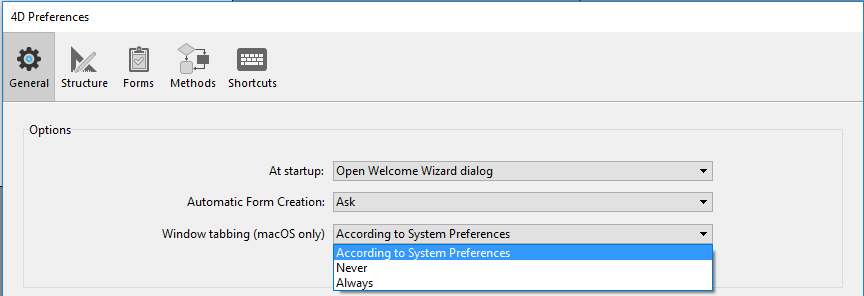

This page contains various options to configure the general operation of your 4D application.

## Opciones

### Al inicio

This option allows you to configure the default 4D display at startup, when the user launches only the application.

*   **Do nothing**: Only the application window appears, empty.
*   **Open Local Project dialog**: 4D displays a standard open document dialog box, allowing you to select a local project.
*   **Open last used project**: 4D directly opens the last project used; no opening dialog box appears. >To force the display of the opening dialog box when this option is selected, hold down the **Alt** (Windows) or **Option** (macOS) key while launching the project.
*   **Open Remote Project dialog**: 4D displays the standard 4D Server logon dialog, allowing you to select a project published on the network.
*   **Open Welcome Wizard dialog** (factory setting): 4D displays the Welcome Wizard dialog box.
> > **4D Server**: The 4D Server application ignores this option. In this environment, the **Do nothing** mode is always used.

### Creación de formularios automática

> This option is only used in binary databases; it is ignored in project architecture. Ver doc.4d.com.

### Ventana con pestañas (sólo en macOS)

Starting with macOS Sierra, Mac applications can benefit from the Automatic Window Tabbing feature that helps organizing multiple windows: document windows are stacked into a single parent window and can be browsed through tabs. This feature is useful on small screens and/or when using a trackpad.

You can benefit from this feature in the following environments (with 4D 64-bit versions only):

*   Code Editor windows
*   Ventana del editor de formularios

Todas las ventanas de estos editores se pueden poner en forma de pestaña:


A set of commands in the **Window** menu allows managing the tabs:


In the 4D's Preferences dialog box, the **Window tabbing** option allows you to control this feature:



Hay tres opciones disponibles:

*   **According to System Preferences** (default): 4D windows will behave like defined in the macOS System Preferences (In full screen, Always, or Manually).
*   **Never**: Opening a new document in 4D form editor or Code Editor will always result in creating a new window (tabs are never created).
*   **Always**: Opening a new document in 4D form editor or method editors will always result in creating a new tab.

### Apariencia (sólo para macOS)

This menu lets you select the color scheme to use for the **4D development** environment. The specified scheme will be applied to all editors and windows of the Design mode.

> You can also set the color scheme to use in your **desktop applications** in the "Interface" page of the Settings dialog box.

Hay tres opciones disponibles:

*   **According to System Color Scheme Preferences** (default): Use the color scheme defined in the macOS System Preferences.
*   **Claro**: utilizar el tema claro
*   **Sombra**: utilizar el tema Sombra

> Esta preferencia sólo es compatible en macOS. En Windows, se utiliza siempre el esquema "Light".


### Salir del modo Diseño al ir al modo Aplicación

If this option is checked, when the user switches to the Application environment using the **Test Application** menu command, all the windows of the Design environment are closed. If this option is not checked (factory setting), the windows of the Design environment remain visible in the background of the Application environment.


### Activar la creación de bases de datos binarias

If you check this option, two items are added in the **File > New** menu and the **New** toolbar button:

*   **Base de datos...**
*   **Base de datos a partir de una definición de estructura...**


These items allow you to create binary databases (see [Creating a new database](https://doc.4d.com/4Dv18R6/4D/18-R6/Creating-a-new-database.300-5217610.en.html) section). They are no longer proposed by default because 4D recommends using project-based architecture for new developments.

## Al crear un nuevo proyecto

### Utilizar archivo historial

When this option is checked, a log file is automatically started and used when a new database is created. For more information, please refer to [Log file (.journal)](Backup/log.md).

### Crear un paquete

When this option is checked, 4D databases are automatically created in a folder suffixed .4dbase.

Thanks to this principle, under macOS the database folders appear as packages having specific properties. En Windows, este funcionamiento no tiene ningún impacto particular.

### Incluir los tokens en los archivos fuente del proyecto

When this option is checked, saved [method source files](../Project/architecture.md#sources) in new 4D projects will contain **tokens** for classic language and database objects (constants, commands, tables and fields). Tokens are additional characters such as `:C10` or `:5` inserted in the source code files, that allow renaming tables and fields and identifying elements whatever the 4D version (see [Using tokens in formulas](https://doc.4d.com/4Dv19R3/4D/19-R3/Using-tokens-in-formulas.300-5583062.en.html)).

If you intend to use VCS or external code editors with your new projects, you might want to uncheck this option for a better readability of the code with these tools.

> This option can only be applied to projects (binary databases always include tokens).

> You can always get the code with tokens by calling [`METHOD GET CODE`](https://doc.4d.com/4dv19R/help/command/en/page1190.html) with 1 in the *option* parameter.

#### Exclusión de los tokens en los proyectos existentes

You can configure your existing projects to save code **without tokens** by inserting the following key in the [`<applicationName>.4DProject`](../Project/architecture.md#applicationname4dproject-file) file using a text editor:

```
"tokenizedText": false
```

> This setting is only taken into account when methods are saved. Existing methods in your projects are left untouched, unless you resave them.


### Crear el archivo `.gitignore`

You might need or want git to ignore some files in your new projects.

You can set this preference by checking the **Create .gitignore file**  option.

When a project is created in 4D and that box is checked, 4D creates a `.gitignore` file at the same level as the `Project` folder (see [Architecture of a Project](Project/architecture.md#gitignore-file-optional)).

You can define the default contents of the `.gitignore` file by clicking the pencil icon. This will open the .gitignore configuration file in your text editor. The contents of this file will be used to generate the `.gitignore` files in your new projects.

The [official git documentation](https://git-scm.com/docs/gitignore) is a great resource to understand how `.gitignore` files work.

### Lenguaje de comparación de texte

This parameter configures the default language used for character string processing and comparison in new databases. The language choice has a direct influence on the sorting and searching of text, as well as the character case, but it has no effect on the translation of texts or on the date, time or currency formats, which remain in the system language. By default (factory setting), 4D uses the current user language set in the system.

A 4D database can thus operate in a language different from that of the system. When a database is opened, the 4D engine detects the language used by the data file and provides it to the language (interpreter or compiled mode). Text comparisons, regardless of whether they are carried out by the database engine or the language, are done in the same language.

When creating a new data file, 4D uses the language previously set in this menu. When opening a data file that is not in the same language as the structure, the data file language is used and the language code is copied into the structure.
> You can modify this parameter for the open database using the Database Settings (see [Text comparison](../settings/database.md#text-comparison)).

## Ubicación de la documentation

This area configures access to the 4D HTML documentation displayed in your current browser:

*   When you hit the **F1** key while the cursor is inserted in a 4D class function or command name in the Code Editor;
*   When you double-click on a 4D command in the **Commands Page** of the Explorer.


### Lenguaje de la documentación

Lenguaje de la documentación HTML a mostrar. You can select a documentation in a different language from the application language.

### Primero buscar en la carpeta local

> This option is only taken into account for command documentation access (excluding class functions).

Define dónde buscará 4D las páginas de documentación.

*   When checked (default), 4D first looks for the page in the local folder (see below). Si se encuentra, 4D muestra la página en el navegador actual. If it is found, 4D displays the page in the current browser. This makes it possible to access the documentation even when you are offline.
*   If it is not found, 4D displays an error message in the browser. When not checked, 4D looks for the desired page directly in the on-line documentation Web site and displays it in the current browser.

### Carpeta local

> This option is only taken into account for command documentation access (excluding class functions).

Indica la ubicación de la documentación HTML estática. Por defecto, se trata de la subcarpeta \Help\Command\language. Puede ver la ubicación haciendo clic en el menú asociado al área. Si esta subcarpeta no está presente, la ubicación se muestra en rojo.

You can modify this location as desired, for example if you want to display the documentation in a language different from that of the application. The static HTML documentation can be located on another volume, on a web server, etc. To designate a different location, click on the **[...]** button next to the entry area and choose a documentation root folder (folder corresponding to the language: `fr`, `en`, `es`, `de` or `ja`). 
