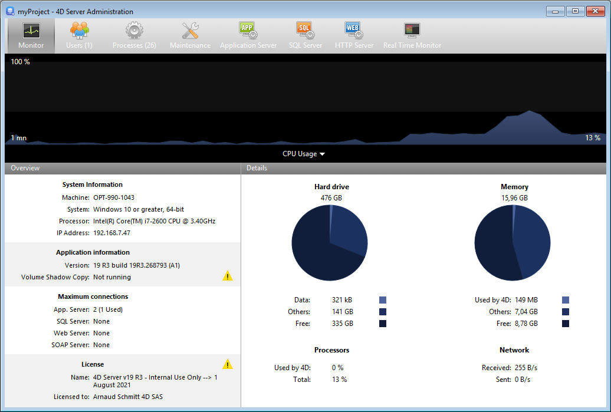

The **Monitor** page displays dynamic information concerning database use as well as information about the system and the 4D Server application.

> On Windows, some of the system information displayed on this page are retrieved via the Windows "Performance Analyzer" tools. These tools can only be accessed when the user that opened the session where 4D Server was launched has the necessary administration authorization.

## Área gráfica

The graphic area lets you see the evolution in real time of several parameters: the CPU usage, network traffic and memory. You select the parameter to be displayed via a menu found in the center of the window:

- **CPU Usage**: Overall CPU usage of the machine, for all applications taken together. The specific part of 4D Server in this usage rate is provided in the "Processors" information area.
- **Network**: Number of bytes received per second by the machine (server or client). El número de bytes enviados se suministra en el área de información "Red".
- **Physical memory**: Quantity of RAM memory of machine used by 4D Server. En el área de información "Memoria" se ofrece una visión más detallada del uso de la memoria.
- **Memoria virtual**: cantidad de memoria virtual utilizada por la aplicación 4D Server. Esta memoria es asignada por el sistema en función de las necesidades de la aplicación. El valor que se encuentra en la parte inferior derecha del área indica la cantidad de memoria que se está utilizando actualmente. El valor que se encuentra en la parte superior izquierda indica la cantidad máxima de memoria virtual utilizable. El valor máximo se calcula dinámicamente en función de la configuración general de la memoria de la aplicación.
- **Caché**: cantidad de memoria caché utilizada por la aplicación 4D Server. El valor que se encuentra en la parte inferior derecha del área indica la cantidad de memoria que se está utilizando actualmente. The value found at the bottom right of the area indicates the quantity of memory currently being used.

Tenga en cuenta que cuando se selecciona esta opción, el desplazamiento del área gráfica se ralentiza, ya que un análisis eficaz de la memoria caché se realiza generalmente durante un período de observación bastante largo.

## Visión general del área

El área "Visión general" ofrece diferente información sobre el sistema, la aplicación y las licencias instaladas en la máquina 4D Server.

- **Información sistema**: ordenador, sistema y dirección IP del servidor
- **Información aplicación**: número de versión interna de 4D Server y estado de Volume Shadow Copy
- **Conexiones máximas**: número de conexiones simultáneas permitidas por tipo de servidor
- **Licencia**: descripción de la licencia. Cuando la licencia producto o una de sus expansiones adjuntas vence en menos de 10 días, por ejemplo en el caso de una licencia de suscripción, 4D Server intenta renovar automáticamente la licencia desde la cuenta del usuario 4D. En este caso, si la renovación automática ha fallado por alguna razón (error de conexión, estado de la cuenta inválido, contrato no prolongado...), se muestra un icono de advertencia junto a la licencia para alertar al administrador del servidor. Additional information about the license renewal status can be displayed in a tip when you hover the mouse over the area:

Usually, you will need to check the [**Licences Manager**](Admin/licenses.md).

## Área de detalles

The "Details" area repeats part of the information displayed in the graphic area and provides additional information as well.

- **Hard drive**: Overall capacity of the hard disk and distribution of the space used by the database data (data file + data index), the space used by other files and the free space available.
- **Memory**: RAM memory installed on the machine and amount of memory used by 4D Server, by other applications or that is free. The memory used by 4D Server can also be displayed dynamically in the graphic area.
- **Processors**: Instant occupancy rate for processor(s) of the machine by 4D Server and by other applications. Esta tasa se recalcula constantemente. The occupancy rate by 4D Server can also be displayed dynamically in the graphic area.
- **Network**: Instantaneous number of bytes sent and received by the machine (server or client). Este valor se actualiza constantemente. The number of bytes received by can also be displayed dynamically in the graphic area.
