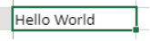

   
## Utilización de las fórmulas

Una fórmula de hoja de cálculo es una expresión que calcula el valor de una celda.

### Entrada de las fórmulas

Para introducir una fórmula en un área 4D View Pro:

1. Seleccione la celda en la que introducirá la fórmula o función.
2. Introduzca = (el signo igual).
3. Escriba la fórmula y presione la tecla **Intro**.

Al escribir una fórmula, puede utilizar diferentes atajos:

- haga clic en una celda para introducir su referencia en la fórmula:


- escriba la primera letra de una función a ingresar. A pop-up menu listing the available functions and references appears, allowing you to select the desired elements:


You can also create named formulas that can be called via their name. To do so, enter these formulas using the [VP ADD FORMULA NAME](method-list.md#vp-add-formula-name) command.

### Operadores y operandos

Todas las fórmulas tienen operandos y operadores:

- **Operators**: see [Values and operators](#values-and-operators) below.
- **Operands** include several categories:
  - [values](#values-and-operators) (5 data types are supported)
  - [references to other cells](#cell-references) (relative, absolute, mixed or by name)
  - [funciones estándar de hoja de cálculo](#using-functions)
  - [4D functions](#4d-functions) based upon 4D formulas and providing access to 4D variables, fields, methods, commands, or expressions.

## Valores y operadores

4D View Pro soporta cinco tipos de datos. Para cada tipo de datos, se soportan valores literales y de operadores específicos.

| Tipos de datos                    | Valores                                               | Operadores                                                                                                                                                                                                                                             |
| --------------------------------- | ----------------------------------------------------- | ------------------------------------------------------------------------------------------------------------------------------------------------------------------------------------------------------------------------------------------------------ |
| [Number](Concepts/dt_number.md)   | 1.2<br/>1.2 E3<br/>1.2E-3<br/>10.3x | + (addition)<br/>- (subtraction)<br/>* (multiplication)<br/>/ (division)<br/>^ (exponent, the number of times to multiply a number by itself)<br/>% (percentage -- divide the number before the operator by one hundred) |
| [Fecha](Concepts/dt_date.md)      | 10/24/2017                                            | + (date + number of days -> date)<br/>+ (date + time -> date + time of day)<br/>- (date - number of days -> date)<br/>- (date - date -> number of days between the two)                                                              |
| [Hora](Concepts/dt_time.md)       | 10:12:10                                              | Duration operators: + (addition)<br/>- (subtraction)<br/>*(duration* number -> duration)<br/>/ (duration / number -> duration)                                                                                                       |
| [String](Concepts/dt_string.md)   | 'Sophie' o "Sophie"                                   | & (concatenación)                                                                                                                                                                                                                                      |
| [Boolean](Concepts/dt_boolean.md) | TRUE o FALSE                                          | -                                                                                                                                                                                                                                                      |

### Operadores de comparación

The following operators can be used with two operands of the same type:

| Operador   | Comparación       |
| ---------- | ----------------- |
| =          | igual a           |
| `<>` | es diferente de   |
| >          | mayor que         |
| <          | menor que         |
| >=         | mayor o igual que |
| <=         | menor o igual que |

### Presedencia de los operadores

Lista de los operadores de la mas a menos importante:

| Operador                            | Descripción               |
| ----------------------------------- | ------------------------- |
| ()                                  | Paréntesis (para agrupar) |
| -                                   | Negativo                  |
| +                                   | Más                       |
| %                                   | Porcentaje                |
| ^                                   | Exponente                 |
| * y /                               | Multiplicar y dividar     |
| + y -                               | Add and Subtract          |
| &                                   | Concatenar                |
| `=  > < >= <= <>` | Comparar                  |

## Referencias de celdas

Las fórmulas a menudo se refieren a otras celdas por medio de direcciones de celdas. Puede copiar estas fórmulas a otras celdas. For example, the following formula, entered in cell C8, adds the values in the two cells above it and displays the result.

```
= C6 + C7
```

Esta fórmula se refiere a las celdas C6 y C7. That is, 4D View Pro is instructed to refer to these other cells for values to use in the formula.

When you copy or move these formulas to new locations, each cell address in that formula will either change or stay the same, depending on how it is typed.

- A reference that changes is called a **relative reference**, and refers to a cell by how far left/right and up/down it is from the cell with the formula.
- A reference that always points to a particular cell is called an **absolute reference**.
- You can also create a mixed reference which always points to a fixed row or column.

### Notación de las referencias

If you use only cell coordinates, for example, `C5`, 4D View Pro interprets the reference as relative. You may make the reference an absolute reference by putting a dollar sign in front of the letter and the number, as in `$C$5`.

You can mix absolute and relative references by inserting a dollar sign in front of the letter or the number alone, for example, `$C5` or `C$5`. A mixed reference allows you to specify either the row or the column as absolute, while allowing the other portion of the address to refer relatively.

A convenient, fast and accurate way to specify an absolute reference is to name the cell and use that name in place of the cell address. Una referencia a una celda nombrada es siempre absoluta. You can create or modify named cells or named cell ranges using the [`VP ADD RANGE NAME`](method-list.md#vp-add-range-name) method.

La siguiente tabla muestra el efecto de las diferentes notaciones:

| Ejemplo            | Tipo de referencia | Descripción                                                                                                                                        |
| ------------------ | ------------------ | -------------------------------------------------------------------------------------------------------------------------------------------------- |
| C5                 | Relativo           | Reference is to the relative location of cell C5, depending on the location of the cell in which the reference is first used                       |
| $C$5               | Absoluto           | La referencia es absoluta. Siempre se referirá a la celda C5 sin importar dónde se utilice.                                                        |
| $C5                | Mixed              | Reference is always to column C, but the row reference is relative to the location of the cell in which the reference is first used.               |
| C$5                | Mixed              | Reference is always to row 5, but the column reference is relative to the location of the cell in which the reference is first used                |
| Nombre de la celda | Absoluto           | La referencia es absoluta. Will always refer to the [named cell or range](method-list.md#vp-add-range-name) no matter where the reference is used. |

## Funciones integradas

Las funciones de hoja de cálculo son fórmulas predefinidas utilizadas para calcular los valores de las celdas. When you type the first letter of the function to enter, a pop-up menu listing the available functions and references appears, allowing you to select the desired elements:


See [**SpreadJS's extented list of functions**](https://www.grapecity.com/spreadjs/docs/v14/online/FormulaFunctions.html) for details and examples.

## Funciones 4D

4D View Pro allows you to define and call **4D custom functions**, which execute [4D formulas](API/FunctionClass.md). Using 4D custom functions extends the possibilities of your 4D View Pro documents and allows powerful interactions with the 4D database.

4D custom functions provide access, from within your 4D View Pro formulas, to:

- variables proceso 4D,
- campos,
- métodos proyecto,
- comandos del lenguaje 4D,
- o cualquier expresión válida de 4D.

4D custom functions can receive [parameters](#parameters) from the 4D View Pro area, and return values.

You declare all your functions using the [`VP SET CUSTOM FUNCTIONS`](method-list.md#vp-set-custom-functions) method. Ejemplos:

```4d
o:=New object

//Name of the function in 4D View Pro: "DRIVERS_LICENCE"
$o.DRIVERS_LICENCE:=New object

//process variable
$o.DRIVERS_LICENCE.formula:=Formula(DriverLicence)

//table field
$o.DRIVERS_LICENCE.formula:=Formula([Users]DriverLicence)

//project method
$o.DRIVERS_LICENCE.formula:=Formula(DriverLicenceState)

//4D command
$o.DRIVERS_LICENCE:=Formula(Choose(DriverLicence; "Obtained"; "Failed"))

//4D expression and parameter
$o.DRIVERS_LICENCE.formula:=Formula(ds.Users.get($1).DriverLicence)
$o.DRIVERS_LICENCE.parameters:=New collection
$o.DRIVERS_LICENCE.parameters.push(New object("name"; "ID"; "type"; Is longint))
```

> **See also** [4D View Pro: Use 4D formulas in your spreadsheet (blog post)](https://blog.4d.com/4d-view-pro-use-4d-formulas-in-your-spreadsheet/)

### Ejemplo con Hello World

We want to print "Hello World" in a 4D View Pro area cell using a 4D project method:

1. Cree un método proyecto "myMethod" con el siguiente código:

```4d
 #DECLARE->$hw Text
 $hw:="Hello World"

```

2. Execute the following code before opening any form that contains a 4D View Pro area:

```4d
  Case of
    :(Form event code=On Load)
       var $o : Object
       $o:=New object
  // Define "vpHello" function from the "myMethod" method
       $o.vpHello:=New object
       $o.vpHello.formula:=Formula(myMethod)
       VP SET CUSTOM FUNCTIONS("ViewProArea";$o)
 End case
```

3. Edite el contenido de una celda en un área 4D View Pro y escriba:

 

 "myMethod" es entonces llamado por 4D y la la celda se muestra:

 

### Parámetros

Parameters can be passed to 4D functions that call project methods using the following syntax:

```
=METHODNAME(param1,param2,...,paramN)
```

These parameters are received in *methodName* in $1, $2...$N.

Tenga en cuenta que los ( ) son obligatorios, incluso si no se pasan parámetros:

```
=METHODWITHOUTNAME()
```

You can declare the name, type, and number of parameters through the *parameters* collection of the function you declared using the [VP SET CUSTOM FUNCTIONS](method-list.md#vp-set-custom-functions) method. Optionally, you can control the number of parameters passed by the user through *minParams* and *maxParams* properties.

For more information on supported incoming parameter types, please refer to the [VP SET CUSTOM FUNCTIONS](method-list.md#vp-set-custom-functions) method description.

> If you do not declare parameters, values can be sequentially passed to methods (they will be received in $1, $2...) and their type will be automatically converted. Dates in *jstype* will be passed as [object](Concepts/dt_object.md) in 4D code with two properties: |Property| Type| Description| |---|---|---| |value| Date| Date value| |time |Real| Time in seconds|

4D project methods can also return values in the 4D View Pro cell formula via $0. Los siguientes tipos de datos son soportados para los parámetros devueltos:

- [text](Concepts/dt_string.md) (converted to string in 4D View Pro)
- [real](Concepts/dt_number.md)/[longint](Concepts/dt_number.md) (converted to number in 4D View Pro)
- [date](Concepts/dt_date.md) (converted to JS Date type in 4D View Pro - hour, minute, sec = 0)
- [time](Concepts/dt_time.md) (converted to JS Date type in 4D View Pro - date in base date, i.e. 12/30/1899)
- [boolean](Concepts/dt_boolean.md) (converted to bool in 4D View Pro)
- [picture](Concepts/dt_picture.md) (jpg,png,gif,bmp,svg other types converted into png) creates a URI (data:image/png;base64,xxxx) and then used as the background in 4D View Pro in the cell where the formula is executed
- [object](Concepts/dt_object.md) with the following two properties (allowing passing a date and time):

 | Propiedad | Type  | Descripción      |
 | --------- | ----- | ---------------- |
 | value     | Fecha | Valor fecha      |
 | time      | Real  | Hora en segundos |

If the 4D method returns nothing, an empty string is automatically returned.

Se devuelve un error en la celda 4D View Pro si:

- el método 4D devuelve otro tipo distinto de los mencionados anteriormente,
- an error occurred during 4D method execution (when user clicks on "abort" button).

#### Ejemplo

```4d
var $o : Object

$o.BIRTH_INFORMATION:=New object
$o.BIRTH_INFORMATION.formula:=Formula(BirthInformation)
$o.BIRTH_INFORMATION.parameters:=New collection
$o.BIRTH_INFORMATION.parameters.push(New object("name";"First name";"type";Is text))
$o.BIRTH_INFORMATION.parameters.push(New object("name";"Birthday";"type";Is date))
$o.BIRTH_INFORMATION.parameters.push(New object("name";"Time of birth";"type";Is time))
$o.BIRTH_INFORMATION.summary:="Returns a formatted string from given information"

VP SET CUSTOM FUNCTIONS("ViewProArea"; $o)
```


## Compatibilidad

Alternate solutions are available to declare fields or methods as functions in your 4D View Pro areas. These solutions are maintained for compatibility reasons and can be used in specific cases. However, using the [`VP SET CUSTOM FUNCTIONS`](method-list.md#vp-set-custom-functions) method is recommended.

### Referenciación de campos mediante la estructura virtual

4D View Pro allows you to reference 4D fields using the virtual structure of the database, i.e. declared through the [`SET TABLE TITLES`](https://doc.4d.com/4dv19/help/command/en/page601.html) and/or [`SET FIELD TITLES`](https://doc.4d.com/4dv19/help/command/en/page602.html) commands with the \* parameter. This alternate solution could be useful if your application already relies on a virtual structure (otherwise, [using `VP SET CUSTOM FUNCTIONS`](#4d-functions) is recommended).

> **WARNING:** You cannot use the virtual structure and `VP SET CUSTOM FUNCTIONS` simultaneously. As soon as `VP SET CUSTOM FUNCTIONS` is called, the functions based upon `SET TABLE TITLES` and `SET FIELD TITLES` commands are ignored in the 4D View Pro area.

#### Requisitos

- The field must belong to the virtual structure of the database, i.e. it must be declared through the [`SET TABLE TITLES`](https://doc.4d.com/4dv19/help/command/en/page601.html) and/or [`SET FIELD TITLES`](https://doc.4d.com/4dv19/help/command/en/page602.html) commands with the \* parameter (see example),
- Table and field names must be ECMA compliant (see [ECMA Script standard](https://www.ecma-international.org/ecma-262/5.1/#sec-7.6)),
- El tipo de campo debe ser soportado por 4D View Pro (ver arriba).

An error is returned in the 4D View Pro cell if the formula calls a field which is not compliant.

#### Llamar a un campo virtual en una fórmula

To insert a reference to a virtual field in a formula, enter the field with the following syntax:

```
TABLENAME_FIELDNAME()
```

For example, if you declared the "Name" field of the "People" table in the virtual structure, you can call the following functions:

```
=PEOPLE_NAME()
=LEN(PEOPLE_NAME())
```

> If a field has the same name as a [4D method], it takes priority over the method.

#### Ejemplo

We want to print the name of a person in a 4D View Pro area cell using a 4D virtual field:

1. Crear una tabla "Employee" con un campo "L_Name":


2. Ejecuta el siguiente código para inicializar una estructura virtual:

 ```4d
 ARRAY TEXT($tableTitles;1)
 ARRAY LONGINT($tableNum;1)
 $tableTitles{1}:="Emp"
 $tableNum{1}:=2
 SET TABLE TITLES($tableTitles;$tableNum;*)

 ARRAY TEXT($fieldTitles;1)
 ARRAY LONGINT($fieldNum;1)
 $fieldTitles{1}:="Name"
 $fieldNum{1}:=2 //last name
 SET FIELD TITLES([Employee];$fieldTitles;$fieldNum;*)
 ```

3. Edite el contenido de una celda en el área 4D View Pro e introduzca "=e":


4. Seleccione EMP_NAME (utilice la tecla Tab) e introduzca el cierre).


5. Valide el campo para mostrar el nombre del empleado actual:


> La tabla \[Employee] debe tener un registro actual.

### Declarar los métodos autorizados

You can call directly 4D project methods from within your 4D View Pro formulas. For security reasons, you must declare explicitly methods that can be called by the user with the [VP SET ALLOWED METHODS](method-list.md#vp-set-allowed-methods) method.

#### Requisitos

Para ser llamado en una fórmula 4D View Pro, un método proyecto debe ser:

- **Allowed**: it was explicitly declared using the [VP SET ALLOWED METHODS](method-list.md#vp-set-allowed-methods) method.
- **Runnable**: it belongs to the host project or a loaded component with the "Shared by components and host project" option enabled (see [Sharing of project methods](../Concepts/components.md#sharing-of-project-methods)).
- **Not in conflict** with an existing 4D View Pro spreadsheet function: if you call a project method with the same name as a 4D View Pro built-in function, the function is called.
> > If neither the [VP SET CUSTOM FUNCTIONS](method-list.md#vp-set-custom-functions) nor the [VP SET ALLOWED METHODS](method-list.md#vp-set-allowed-methods) method has been executed during the session, 4D View Pro custom functions rely on allowed methods defined by 4D's generic `SET ALLOWED METHODS` command. In this case, the project method names must comply with JavaScript Identifier Grammar (see [ECMA Script standard](https://www.ecma-international.org/ecma-262/5.1/#sec-7.6)). The global filtering option in the Settings dialog box (see *Data Access*) is ignored in all cases.
