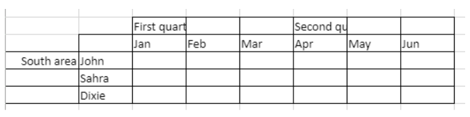
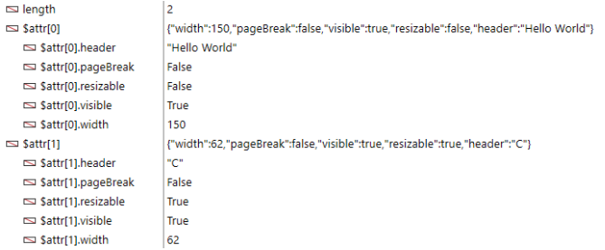
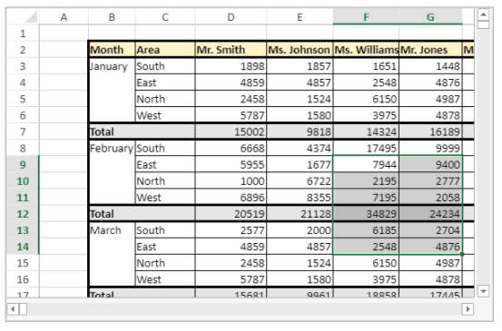
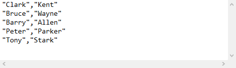
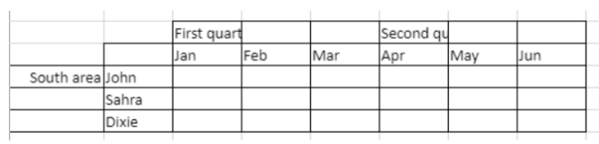
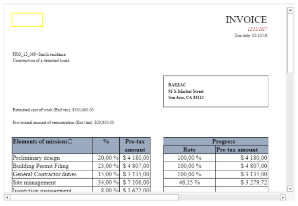

> **Atención**: los comandos de esta página no son hilo seguro.

[A](#a) - [C](#c) - [D](#d) - [E](#e) - [F](#f) - [G](#g) - [I](#i) - [M](#m) - [N](#n) - [O](#o) - [P](#p) - [R](#r) - [S](#s)

## A

### VP ADD FORMULA NAME

<!-- REF #_method_.VP ADD FORMULA NAME.Syntax -->

**VP ADD FORMULA NAME** ( *vpAreaName* : Text ; *vpFormula* : Text ; *name* : Text { ; *options* : Object } )<!-- END REF -->

<!-- REF #_method_.VP ADD FORMULA NAME.Params -->

| Parámetros | Type   |    | Descripción                                                |
| ---------- | ------ | -- | ---------------------------------------------------------- |
| vpAreaName | Text   | -> | Nombre de objeto formulario área 4D View Pro               |
| vpFormula  | Text   | -> | Fórmula 4D View Pro                                        |
| name       | Text   | -> | Nombre de la fórmula                                       |
| options    | Object | -> | Opciones de la fórmula nombrada|<!-- END REF --> |

#### Descripción

The `VP ADD FORMULA NAME` command <!-- REF #_method_.VP ADD FORMULA NAME.Summary -->creates or modifies a named formula in the open document<!-- END REF -->.
> Las fórmulas nombradas creadas por este comando se guardan en el documento.

En *vpAreaName*, pase el nombre del área 4D View Pro. Si pasa un nombre que no existe, se devuelve un error.

Pase la fórmula 4D View Pro que desea nombrar en *vpFormula*. Para obtener información detallada sobre la sintaxis de las fórmulas, consulte la página [Fórmulas y funciones](formulas.md).

Pase el nuevo nombre para la fórmula en *name*. Si el nombre ya se utiliza en el mismo alcance, la nueva fórmula nombrada sustituye la existente. Tenga en cuenta que puede utilizar el mismo nombre para diferentes alcances (ver más adelante).

Puede pasar un objeto con las propiedades adicionales para la fórmula nombrada en *options*. Se soportan las siguientes propiedades:

| Propiedad | Type   | Descripción                                                                                                                                                                                                                                                                                                                                                                                  |
| --------- | ------ | -------------------------------------------------------------------------------------------------------------------------------------------------------------------------------------------------------------------------------------------------------------------------------------------------------------------------------------------------------------------------------------------- |
| scope     | Number | Alcance de la fórmula. Puede pasar el índice de la hoja (la numeracièon comienza en 0) o utilizar las siguientes constantes: <li>`vk current sheet`</li><li>`vk workbook`</li>El alcance determina si el nombre de una fórmula es local para una hoja de cálculo determinada (*scope*=sheet index or `vk current sheet`), o si es global a todo el libro de trabajo (*scope*=`vk workbook`). |
| comment   | Text   | Comentario asociado a una fórmula nombrada                                                                                                                                                                                                                                                                                                                                                   |

#### Ejemplo

```4d
VP ADD FORMULA NAME("ViewProArea";"SUM($A$1:$A$10)";"Total2")
```

#### Ver también

[Cell references](formulas.md#cell-references)<br/>[VP ADD RANGE NAME](#vp-add-range-name)<br/>[VP Get formula by name](#vp-get-formula-by-name)<br/>[VP Get names](#vp-get-names)

### VP ADD RANGE NAME


<!-- REF #_method_.VP ADD RANGE NAME.Syntax --> **VP ADD RANGE NAME** ( *rangeObj* : Object ; *name* : Text { ; *options* : Object } )<!-- END REF -->

<!-- REF #_method_.VP ADD RANGE NAME.Params -->

| Parámetros | Type   |    | Descripción                                                |
| ---------- | ------ | -- | ---------------------------------------------------------- |
| rangeObj   | Text   | -> | Objeto rango                                               |
| name       | Text   | -> | Nombre de la fórmula                                       |
| options    | Object | -> | Opciones de la fórmula nombrada|<!-- END REF --> |

#### Descripción

The `VP ADD RANGE NAME` command <!-- REF #_method_.VP ADD RANGE NAME.Summary -->creates or modifies a named range in the open document<!-- END REF -->.
> Los rangos nombrados creados por este comando se guardan con el documento.

In *rangeObj*, pass the range that you want to name and in *name*, pass the new name for the range. If the name is already used within the same scope, the new named range replaces the existing one. Tenga en cuenta que puede utilizar el mismo nombre para diferentes alcances (ver más adelante).

You can pass an object with additional properties for the named range in *options*. Se soportan las siguientes propiedades:

| Propiedad | Type   | Descripción                                                                                                                                                                                                                                                                                                                                                                           |
| --------- | ------ | ------------------------------------------------------------------------------------------------------------------------------------------------------------------------------------------------------------------------------------------------------------------------------------------------------------------------------------------------------------------------------------- |
| scope     | Number | Alcance del rango. Puede pasar el índice de la hoja (la numeracièon comienza en 0) o utilizar las siguientes constantes: <li>`vk current sheet`</li><li>`vk workbook`</li> El alcance determina si el nombre de un rango es local para una hoja de cálculo determinada (*scope*=sheet index or `vk current sheet`), o si es global a todo el libro de trabajo (*scope*=`vk workbook`). |
| comment   | Text   | Comentario asociado al rango nombrado                                                                                                                                                                                                                                                                                                                                                 |
> * Un rango nombrado es en realidad una fórmula nombrada que contiene coordenadas. `VP ADD RANGE NAME` facilitates the creation of named ranges, but you can also use the [`VP ADD FORMULA NAME`](#vp-add-formula-name) method to create named ranges.
> * Formulas defining named ranges can be retrieved with the [`VP Get formula by name`](#vp-get-formula-by-name) method.

#### Ejemplo

Quiere crear un rango nombrado para un rango de celdas:

```4d
$range:=VP Cell("ViewProArea";2;10)
VP ADD RANGE NAME($range;"Total1")
```

#### Ver también

[VP ADD FORMULA NAME](#vp-add-formula-name)<br/>[VP Get formula by name](#vp-get-formula-by-name)<br/>[VP Get names](#vp-get-names)<br/>[VP Name](#vp-name)

### VP ADD SELECTION


<!-- REF #_method_.VP ADD SELECTION.Syntax --> **VP ADD SELECTION** ( *rangeObj* : Object )<!-- END REF -->

<!-- REF #_method_.VP ADD SELECTION.Params -->

| Parámetros | Type |    | Descripción                              |
| ---------- | ---- | -- | ---------------------------------------- |
| rangeObj   | Text | -> | Range object |<!-- END REF --> |

#### Descripción

The `VP ADD SELECTION` command <!-- REF #_method_.VP ADD SELECTION.Summary -->adds the specified cells to the currently selected cells<!-- END REF -->.

In *rangeObj*, pass a range object of cells to add to the current selection.
> La celda activa no se modifica.

#### Ejemplo

Actualmente tienes celdas seleccionadas:


El siguiente código añadirá celdas a su selección:

```4d
$currentSelection:=VP Cells("myVPArea";3;4;2;3)
VP ADD SELECTION($currentSelection)
```

Resultado:


#### Ver también

[VP Get active cell](#vp-get-active-cell)<br/>[VP Get selection](#vp-get-selection)<br/>[VP RESET SELECTION](#vp-reset-selection)<br/>[VP SET ACTIVE CELL](#vp-set-active-cell)<br/>[VP SET SELECTION](#vp-set-selection)<br/>[VP SHOW CELL](#vp-show-cell)

### VP ADD SHEET


<!-- REF #_method_.VP ADD SHEET.Syntax --> **VP ADD SHEET** ( *vpAreaName* : Text )<br/>**VP ADD SHEET** ( *vpAreaName* : Text ; *index* : Integer )<br/>**VP ADD SHEET** ( *vpAreaName* : Text ; *sheet* : Integer ; *name* : Text )<!-- END REF -->

<!-- REF #_method_.VP ADD SHEET.Params -->

| Parámetros | Type    |    | Descripción                                  |
| ---------- | ------- | -- | -------------------------------------------- |
| vpAreaName | Text    | -> | Nombre de objeto formulario área 4D View Pro |
| sheet      | Integer | -> | Indice de la nueva hoja                      |
| name       | Text    | -> | Nombre de la hoja|<!-- END REF --> |

#### Descripción

The `VP ADD SHEET` command <!-- REF #_method_.VP ADD SHEET.Summary -->inserts a sheet in the document loaded in *vpAreaName*.<!-- END REF -->

En *vpAreaName*, pase el nombre del área 4D View Pro.

If *index* exceeds the number of sheets, the command inserts the new sheet after the existing ones. In *sheet*, you can pass an index for the new sheet. If the passed *index* is inferior to or equal to 0, the command inserts the new sheet at the beginning.
> La indexación comienza en 0.

En *name*, puede pasar un nombre para la nueva hoja. The new name cannot contain the following characters: `*, :, [, ], ?,\,/`

#### Ejemplo

El documento tiene actualmente 3 hojas:


Para insertar una hoja en la tercera posición (índice 2) y nombrarla "March":

```4d
VP ADD SHEET("ViewProArea";2;"March")
```


#### Ver también

[VP REMOVE SHEET](#vp-remove-sheet)

### VP ADD SPAN


<!-- REF #_method_.VP ADD SPAN.Syntax --> **VP ADD SPAN** ( *rangeObj* : Object )<!-- END REF -->

<!-- REF #_method_.VP ADD SPAN.Params -->

| Parámetros | Type   |    | Descripción                             |
| ---------- | ------ | -- | --------------------------------------- |
| rangeObj   | Object | -> | Objeto rango|<!-- END REF --> |

#### Descripción

The `VP ADD SPAN` command combines the cells in *rangeObj* as a single span of cells.

En *rangeObj*, pase un rango de celdas. The cells in the range are joined to create a larger cell extending across multiple columns and/or rows. Puede pasar varios rangos de celdas para crear varios espacios al mismo tiempo. Tenga en cuenta que si los rangos de celdas se superponen, sólo se utiliza el primer rango de celdas.

> * Sólo se muestran los datos de la celda superior izquierda. Los datos de las otras celdas combinadas se ocultan hasta que se elimina la fusión.
> * Hidden data in spanned cells is accessible via formulas (beginning with the upper-left cell).

#### Ejemplo

To span the First quarter and Second quarter cells across the two cells beside them, and the South area cell across the two rows below it:



```4d
 //  Rango First quarter
 $q1:=VP Cells("ViewProArea";2;3;3;1)

// Rango Second quarter
 $q2:=VP Cells("ViewProArea";5;3;3;1)

  // Rango South area
 $south:=VP Cells("ViewProArea";0;5;1;3)

 VP ADD SPAN(VP Combine ranges($q1;$q2;$south))
```


#### Ver también

[4D View Pro Range Object Properties](getting-started.md#using-range-objects)<br/>[VP Get spans](#vp-get-spans)<br/>[VP REMOVE SPAN](#vp-remove-span)

### VP ADD STYLESHEET


<!-- REF #_method_.VP ADD STYLESHEET.Syntax --> **VP ADD STYLESHEET** ( *vpAreaName* : Text ; *styleName* : Text ; *styleObj* : Object { ; *sheet* : Integer } )<!-- END REF -->

<!-- REF #_method_.VP ADD STYLESHEET.Params -->

| Parámetros | Type    |    | Descripción                                                            |
| ---------- | ------- | -- | ---------------------------------------------------------------------- |
| vpAreaName | Text    | -> | Nombre de objeto formulario área 4D View Pro                           |
| styleName  | Text    | -> | Nombre del estilo                                                      |
| styleObj   | Object  | -> | Objeto definiendo las propiedades del atributo                         |
| sheet      | Integer | -> | Índice de la hoja (hoja actual si se omite)|<!-- END REF --> |

#### Descripción

The `VP ADD STYLESHEET` command <!-- REF #_method_.VP ADD STYLESHEET.Summary -->creates or modifies the *styleName* style sheet based upon the combination of the properties specified in *styleObj* in the open document<!-- END REF -->. .

> Las hojas de estilo creadas por este comando se guardan con el documento.

En *vpAreaName*, pase el nombre del área 4D View Pro. Si pasa un nombre que no existe, se devuelve un error.

The *styleName* parameter lets you assign a name to the style sheet. If the name is already used within the same scope, the new style sheet replaces the existing one. Tenga en cuenta que puede utilizar el mismo nombre para diferentes alcances (ver más adelante).

Within the *styleObj*, designate the settings for the style sheet (e.g., font, text decoration, alignment, borders, etc.). For the full list of style properties, see [Style object properties](configuring.md#style-objects-properties).

You can designate where to define the style sheet in the optional *sheet* parameter using the sheet index (indexing starts at 0) or with the following constants:

* `vk current sheet`
* `vk workbook`

If a *styleName* style sheet is defined at the workbook level and at a sheet level, the sheet level has priority over the workbook level when the style sheet is set.

To apply the style sheet, use the [VP SET DEFAULT STYLE](#vp-set-default-style) or [VP SET CELL STYLE](#vp-set-cell-style) commands.

#### Ejemplo

El código siguiente:

```4d
$styles:=New object
$styles.backColor:="green"

//Line Border Object
$borders:=New object("color";"green";"style";vk line style medium dash dot)

$styles.borderBottom:=$borders
$styles.borderLeft:=$borders
$styles.borderRight:=$borders
$styles.borderTop:=$borders

VP ADD STYLESHEET("ViewProArea";"GreenDashDotStyle";$styles)

//Para aplicar el estiloVP SET CELL STYLE(VP Cells("ViewProArea";1;1;2;2);New object("name";"GreenDashDotStyle"))
```

creará y aplicará el siguiente objeto estilo llamado *GreenDashDotStyle*:

```
{
 backColor:green,
 borderBottom:{color:green,style:10},
 borderLeft:{color:green,style:10},
 borderRight:{color:green,style:10},
 borderTop:{color:green,style:10}
}
```

#### Ver también

[4D View Pro Style Objects and Style Sheets](configuring.md#style-objects--style-sheets)<br/>[VP Get stylesheet](#vp-get-stylesheet)<br/>[VP Get stylesheets](#vp-get-stylesheets)<br/>[VP REMOVE STYLESHEET](#vp-remove-stylesheet)<br/>[VP SET CELL STYLE](#vp-set-cell-style)<br/>[VP SET DEFAULT STYLE](#vp-set-default-style)

### VP All


<!-- REF #_method_.VP ALL.Syntax --> **VP All** ( *vpAreaName* : Text { ; *sheet* : Integer } )  : Object<!-- END REF -->

<!-- REF #_method_.VP ALL.Params -->

| Parámetros | Type    |    | Descripción                                                 |
| ---------- | ------- | -- | ----------------------------------------------------------- |
| vpAreaName | Text    | -> | Nombre de objeto formulario área 4D View Pro                |
| sheet      | Integer | -> | Índice de la hoja (hoja actual si se omite)                 |
| Result     | Object  | <- | Objeto rango de todas las celdas|<!-- END REF --> |

#### Descripción

The `VP ALL` command <!-- REF #_method_.VP ALL.Summary -->returns a new range object referencing all cells<!-- END REF -->.

En *vpAreaName*, pase el nombre del área 4D View Pro. Si pasa un nombre que no existe, se devuelve un error.

In the optional *sheet* parameter, you can designate a specific spreadsheet where the range will be defined (counting begins at 0). Si se omite o si se pasa `vk current sheet`, se utiliza la hoja de cálculo actual.

#### Ejemplo

Desea definir un objeto rango para todas las celdas de la hoja de cálculo actual:

```4d
$all:=VP All("ViewProArea") // todas las celdas de la hoja actual
```

#### Ver también

[VP Cell](#vp-cell)<br/>[VP Cells](#vp-cells)<br/>[VP Column](#vp-column)<br/>[VP Combine ranges](#vp-combine-ranges)<br/>[VP Name](#vp-name)<br/>[VP Row](#vp-row)

## C

### VP Cell


<!-- REF #_method_.VP CELL.Syntax --> **VP Cell** ( *vpAreaName* ; *column* : Integer ; *row* : Integer ; Text { ; *sheet* : Integer } )  : Object<!-- END REF -->

<!-- REF #_method_.VP Cell.Params -->

| Parámetros | Type    |    | Descripción                                                 |
| ---------- | ------- | -- | ----------------------------------------------------------- |
| vpAreaName | Text    | -> | Nombre de objeto formulario área 4D View Pro                |
| column     | Longint | -> | Índice de la hoja (hoja actual si se omite)                 |
| row        | Longint | -> | Índice de la hoja (hoja actual si se omite)                 |
| sheet      | Integer | -> | Índice de la hoja (hoja actual si se omite)                 |
| Result     | Object  | <- | Objeto rango de todas las celdas|<!-- END REF --> |

#### Descripción

The `VP Cell` command <!-- REF #_method_.VP Cell.Summary -->returns a new range object referencing a specific cell<!-- END REF -->.

> Este comando se aplica a los rangos de una sola celda. To create a range object for multiple cells, use the [VP Cells](#vp-cells) command.

En *vpAreaName*, pase el nombre del área 4D View Pro. Si pasa un nombre que no existe, se devuelve un error.

The *column* parameter defines the column of the cell range's position. Pase el índice de columna en este parámetro.

The *row* parameter defines the row of the cell range's position. Pase el índice de la línea en este parámetro.

In the optional *sheet* parameter, you can indicate the index of the sheet where the range will be defined. Si se omite o si se pasa `vk current sheet`, se utiliza la hoja de cálculo actual por defecto.

> la indexación comienza en 0.

#### Ejemplo

Desea definir un objeto rango para la celda mostrada abajo (en la hoja actual):


El código es el siguiente:

```4d
$cell:=VP Cell("ViewProArea";2;4) // C5
```

#### Ver también

[VP All](#vp-all)<br/>[VP Cells](#vp-cells)<br/>[VP Column](#vp-column)<br/>[VP Combine ranges](#vp-combine-ranges)<br/>[VP Name](#vp-name)<br/>[VP Row](#vp-row)

### VP Cells


<!-- REF #_method_.VP Cells.Syntax --> **VP Cells** ( *vpAreaName* : Text ; *column*: Integer ; *row*: Integer ; *columnCount* : Integer ; *rowCount* : Integer { ; *sheet* : Integer } ) : Object<!-- END REF -->

<details><summary>Histórico</summary>

| Versión | Modificaciones |
| ------- | -------------- |
| v17 R4  | Añadidos       |
</details>

<!-- REF #_method_.VP Cells.Params -->

| Parámetros  | Type    |    | Descripción                                       |
| ----------- | ------- | -- | ------------------------------------------------- |
| vpAreaName  | Text    | -> | Nombre de objeto formulario área 4D View Pro      |
| column      | Integer | -> | Índice de la columna                              |
| row         | Integer | -> | Índice de la línea                                |
| columnCount | Integer | -> | Número de columnas                                |
| rowCount    | Integer | -> | Número de líneas                                  |
| sheet       | Integer | -> | Índice de la hoja (hoja actual si se omite)       |
| Result      | Object  | <- | Objeto rango de celdas|<!-- END REF --> |

#### Descripción

The `VP Cells` command <!-- REF #_method_.VP Cells.Summary -->returns a new range object referencing specific cells<!-- END REF -->.

En *vpAreaName*, pase el nombre del área 4D View Pro. Si pasa un nombre que no existe, se devuelve un error.

The *column* parameter defines the first column of the cell range. Pase el índice de la columna (la numeración comienza en 0) en este parámetro. If the range is within multiple columns, you should also use the *columnCount* parameter.

In the *row* parameter, you can define the row(s) of the cell range's position. Pase el índice de la línea (el conteo comienza en 0) en este parámetro. If the range is within multiple rows, you should also use the *rowCount* parameter.

The *columnCount* parameter allows you to define the total number of columns the range is within. *columnCount* debe ser mayor que 0.

The *rowCount* parameter allows you to define the total number of rows the range is within. *rowCount* debe ser mayor que 0.

In the optional *sheet* parameter, you can designate a specific spreadsheet where the range will be defined (counting begins at 0). Si se omite o si se pasa `vk current sheet`, se utiliza la hoja de cálculo actual por defecto.

#### Ejemplo

You want to define a range object for the following cells (on the current sheet):


El código es el siguiente:

```4d
$cells:=VP Cells("ViewProArea";2;4;2;3) // de C5 a D7
```

#### Ver también

[VP All](#vp-all)<br/>[VP Cells](#vp-cells)<br/>[VP Column](#vp-column)<br/>[VP Combine ranges](#vp-combine-ranges)<br/>[VP Name](#vp-name)<br/>[VP Row](#vp-row)

### VP Column


<!-- REF #_method_.VP Column.Syntax --> **VP Column** ( *vpAreaName* : Text ; *column*: Integer ; *columnCount* : Integer { ; *sheet* : Integer } ) : Object<!-- END REF -->

<!-- REF #_method_.VP Column.Params -->

| Parámetros  | Type    |    | Descripción                                       |
| ----------- | ------- | -- | ------------------------------------------------- |
| vpAreaName  | Text    | -> | Nombre de objeto formulario área 4D View Pro      |
| column      | Integer | -> | Índice de la columna                              |
| columnCount | Integer | -> | Número de columnas                                |
| sheet       | Integer | -> | Índice de la hoja (hoja actual si se omite)       |
| Result      | Object  | <- | Objeto rango de celdas|<!-- END REF --> |

#### Descripción

The `VP Column` command <!-- REF #_method_.VP Column.Summary -->returns a new range object referencing a specific column or columns<!-- END REF -->.

En *vpAreaName*, pase el nombre del área 4D View Pro. Si pasa un nombre que no existe, se devuelve un error.

The *column* parameter defines the first column of the column range. Pase el índice de la columna (el conteo comienza en 0) en este parámetro. If the range contains multiple columns, you should also use the optional *columnCount* parameter.

The optional *columnCount* parameter allows you to define the total number of columns of the range. *columnCount* debe ser mayor que 0. If omitted, the value will be set to 1 by default and a column type range is created.

In the optional *sheet* parameter, you can designate a specific spreadsheet where the range will be defined (counting begins at 0). Si se omite o si se pasa `vk current sheet`, se utiliza la hoja de cálculo actual por defecto.

#### Ejemplo

Desea definir un objeto rango para la columna mostrada abajo (en la hoja actual):


El código es el siguiente:

```4d
 $column:=VP Column("ViewProArea";3) // columna D
```

#### Ver también

[VP All](#vp-all)<br/>[VP Cells](#vp-cells)<br/>[VP Column](#vp-column)<br/>[VP Combine ranges](#vp-combine-ranges)<br/>[VP Name](#vp-name)<br/>[VP Row](#vp-row)<br/>[VP SET COLUMN ATTRIBUTES](#vp-set-column-attributes)

### VP COLUMN AUTOFIT


<!-- REF #_method_.VP COLUMN AUTOFIT.Syntax --> **VP COLUMN AUTOFIT** ( *rangeObj* : Object )<!-- END REF -->

<!-- REF #_method_.VP COLUMN AUTOFIT.Params -->

| Parámetros | Type   |    | Descripción                             |
| ---------- | ------ | -- | --------------------------------------- |
| rangeObj   | Object | -> | Objeto rango|<!-- END REF --> |

#### Descripción

The `VP COLUMN AUTOFIT` command <!-- REF #_method_.VP COLUMN AUTOFIT.Summary -->automatically sizes the column(s) in *rangeObj* according to their contents<!-- END REF -->.

En *rangeObj*, pase un objeto rango que contenga un rango de columnas cuyo tamaño se gestionará automáticamente.

#### Ejemplo

Las siguientes columnas tienen el mismo tamaño y no muestran parte del texto:


La selección de las columnas y la ejecución de este código:

```4d

 VP COLUMN AUTOFIT(VP Get selection("ViewProarea"))
```

... redimensiona las columnas para ajustarse al tamaño de los contenidos:


#### Ver también

[VP ROW AUTOFIT](#vp-row-autofit)

### VP Combine Ranges


<!-- REF #_method_.VP Combine Ranges.Syntax --> **VP Combine Ranges** ( *rangeObj* : Object ; *otherRangeObj* : Object {;...*otherRangeObjN* : Object }  ) : Object<!-- END REF -->

<!-- REF #_method_.VP Combine Ranges.Params -->

| Parámetros    | Type   |    | Descripción                                                       |
| ------------- | ------ | -- | ----------------------------------------------------------------- |
| rangeObj      | Object | -> | Objeto rango                                                      |
| otherRangeObj | Object | -> | Objeto rango                                                      |
| Result        | Object | <- | Objeto que contiene un rango combinado|<!-- END REF --> |

#### Descripción

The `VP Combine Ranges` command <!-- REF #_method_.VP Combine Ranges.Summary -->returns a new range object that incorporates two or more existing range objects<!-- END REF -->. Summary -->returns the 4D View Pro object attached to the 4D View Pro area *vpAreaName*<!-- END REF -->.

En *rangeObj*, pase el primer rango.

En *otherRangeObj*, pase otro objeto(s) rango para combinar con *rangeObj*.
> El comando incorpora *rangeObj* y *otherRangeObj* por referencia.

#### Ejemplo

Quiere combinar los rangos de tipo celda, columna y línea en un nuevo rango distinto:

```4d
 $cell:=VP Cell("ViewProArea";2;4) // C5
 $column:=VP Column("ViewProArea";3) // columna D
 $row:=VP Row("ViewProArea";9) // línea 10

 $combine:=VP Combine ranges($cell;$column;$row)
```

#### Ver también

[VP All](#vp-all)<br/>[VP Cells](#vp-cells)<br/>[VP Column](#vp-column)<br/>[VP Combine ranges](#vp-combine-ranges)<br/>[VP Name](#vp-name)<br/>[VP Row](#vp-row)<br/>[VP SET COLUMN ATTRIBUTES](#vp-set-column-attributes)

### VP Convert from 4D View


<!-- REF #_method_.VP Convert from 4D View.Syntax --> **VP Convert from 4D View** ( *4DViewDocument* : Blob ) : Object<!-- END REF -->

<!-- REF #_method_.VP Convert from 4D View.Params -->

| Parámetros     | Type   |    | Descripción        |
| -------------- | ------ | -- | ------------------ |
| 4DViewDocument | Blob   | -> | Documento 4D View  |
| Result         | Object | <- | Objeto 4D View Pro |

<!-- END REF -->

#### Descripción

The `VP Convert from 4D View` command <!-- REF #_method_.VP Convert from 4D View.Summary -->allows you to convert a legacy 4D View document into a 4D View Pro object<!-- END REF -->.
> Este comando no requiere que el plug-in 4D View esté instalado en su entorno.

En el parámetro *4DViewDocument*, pase una variable o un campo BLOB que contenga el documento 4D View a convertir. El comando devuelve un objeto 4D View Pro en el que toda la información almacenada originalmente en el documento 4D View se convierte en atributos 4D View Pro.

#### Ejemplo

Quiere obtener un objeto 4D View Pro a partir de un área 4D View almacenada en un BLOB:

```4d
C_OBJECT($vpObj)
$vpObj:=VP Convert from 4D View($pvblob)
```

### VP Convert to picture


<!-- REF #_method_.VP Convert to picture.Syntax --> **VP Convert to picture** ( *vpObject* : Object {; *rangeObj* : Object} ) : Picture<!-- END REF -->

<!-- REF #_method_.VP Convert to picture.Params -->

| Parámetros | Type   |    | Descripción                                         |
| ---------- | ------ | -- | --------------------------------------------------- |
| vpObject   | Object | -> | Objeto 4D View Pro que contiene el área a convertir |
| rangeObj   | Object | -> | Objeto rango                                        |
| Result     | Object | <- | Imagen SVG del área|<!-- END REF -->      |

#### Descripción

The `VP Convert to picture` command <!-- REF #_method_.VP Convert to picture.Summary -->converts the *vpObject* 4D View Pro object (or the *rangeObj* range within *vpObject*) to a SVG picture<!-- END REF -->.

Este comando es útil, por ejemplo:

* to embed a 4D View Pro document in an other document such as a 4D Write Pro document
* to print a 4D View Pro document without having to load it into a 4D View Pro area.

In *vpObject*, pass the 4D View Pro object that you want to convert. This object must have been previously parsed using [VP Export to object](#vp-export-to-object) or saved using [VP EXPORT DOCUMENT](#vp-export-document).
> SVG conversion process requires that expressions and formats (cf. [Cell Format](configuring.md#cell-format)) included in the 4D View Pro area be evaluated at least once, so that they can be correctly exported. If you convert a document that was not evaluated beforehand, expressions or formats may be rendered in an unexpected way.

En *rangeObj*, pase un rango de celdas a convertir. By default, if this parameter is omitted, the whole document contents are converted.

Document contents are converted with respect to their viewing attributes, including formats (see note above), visibility of headers, columns and rows. La conversión de los siguientes elementos es soportada:

* Text : style / font / size / alignment / orientation / rotation / format
* Fondo de la celda : color / imagen
* Bordes de las celdas : grosor / color / estilo
* Fusión de celdas
* Imágenes
* Altura de líneas
* Ancho de columnas
* Columnas / líneas ocultas.
> > Gridline visibility depends on document attribute defined with [VP SET PRINT INFO](#vp-set-print-info).

#### Resultado

El comando devuelve una imagen en formato SVG.

#### Ejemplo

You want to convert a 4D View Pro area in SVG, preview the result, and send it to a picture variable:

```4d
C_OBJECT($vpAreaObj)
C_PICTURE($vPict)
$vpAreaObj:=VP Export to object("ViewProArea")
$vPict:=VP Convert to picture($vpAreaObj) //exportar toda el área
```

#### Ver también

[VP EXPORT DOCUMENT](#vp-export-document)<br/>[VP Export to object](#vp-export-to-object)<br/>[VP SET PRINT INFO](#vp-set-print-info)

### VP Copy to object

<details><summary>Histórico</summary>

| Versión | Modificaciones |
| ------- | -------------- |
| v19 R4  | Añadidos       |
</details>


<!-- REF #_method_.VP Copy to object.Syntax --> **VP Copy to object** ( *rangeObj* : Object {; *options* : Object} ) : Object<!-- END REF -->

<!-- REF #_method_.VP Copy to object.Params -->

| Parámetros | Type   |    | Descripción                                                             |
| ---------- | ------ | -- | ----------------------------------------------------------------------- |
| rangeObj   | Object | -> | Objeto rango                                                            |
| options    | Object | -> | Opciones adicionales                                                    |
| Result     | Object | <- | Objeto devuelto. Contiene los datos copiados|<!-- END REF --> |

#### Descripción

The `VP Copy to object` command <!-- REF #_method_.VP Copy to object.Summary -->copies the contents, style and formulas from *rangeObj* to an object<!-- END REF -->.

In *rangeObj*, pass the cell range with the values, formatting, and formulas to copy. If *rangeObj* is a combined range, only the first one is used.

You can pass an optional *options* parameter with the following properties:

| Propiedad   | Type    | Descripción                                                                                                               |
| ----------- | ------- | ------------------------------------------------------------------------------------------------------------------------- |
| copy        | Boolean | *True* (default) to keep the copied values, formatting and formulas after the command executes. *False* para eliminarlos. |
| copyOptions | Longint | Especifica lo que se copia o mueve. Valores posibles: <p><table><tr><th>Value</th><th>Descripción</th></tr><tr><td>`vk clipboard options all` (por defecto)</td><td>Copia todos los objetos de datos, incluidos los valores, formatos y fórmulas.</td></tr><tr><td>`vk clipboard options formatting`</td><td>Copia únicamente los formatos.</td></tr><tr><td>`vk clipboard options formulas`</td><td>Copia sólo las fórmulas.</td></tr><tr><td>`vk clipboard options formulas and formatting`</td><td>Copia las fórmulas y el formato.</td></tr><tr><td>`vk clipboard options values`</td><td>Copia sólo los valores.</td></tr><tr><td>`vk clipboard options value and formatting`</td><td>Copia los valores y el formato.</td></tr></table></p>                                            |

The paste options defined in the [workbook options](#vp-set-workbook-options) are taken into account.

El comando devuelve un objeto que contiene los datos copiados.

#### Ejemplo

This code sample first stores the contents, values, formatting and formulas from a range to an object, and then pastes them in another range:

```4d
var $originRange; $targetRange; $dataObject; $options : Object

$originRange:=VP Cells("ViewProArea"; 0; 0; 2; 5)

$options:=New object
$options.copy:=True
$options.copyOptions:=vk clipboard options all

$dataObject:=VP Copy to object($originRange; $options)

$targetRange:=VP Cell("ViewProArea"; 4; 0)
VP PASTE FROM OBJECT($targetRange; $dataObject; vk clipboard options all)
```

#### Ver también

[VP PASTE FROM OBJECT](#vp-paste-from-object)<br/>[VP MOVE CELLS](#vp-move-cells)<br/>[VP Get workbook options](#vp-get-workbook-options)<br/>[VP SET WORKBOOK OPTIONS](#vp-set-workbook-options)

### VP CREATE TABLE

<details><summary>Histórico</summary>

| Versión | Modificaciones |
| ------- | -------------- |
| v19 R6  | Añadidos       |
</details>


<!-- REF #_method_.VP CREATE TABLE.Syntax --> **VP CREATE TABLE** ( *rangeObj* : Object ; *tableName* : Text {; *source* : Text} {; *options* : Object} )<!-- END REF -->

<!-- REF #_method_.VP CREATE TABLE.Params -->

| Parámetros | Type   |    | Descripción                                                        |
| ---------- | ------ | -- | ------------------------------------------------------------------ |
| rangeObj   | Object | -> | Objeto rango                                                       |
| tableName  | Text   | -> | Nombre de la tabla                                                 |
| source     | Text   | -> | Nombre de la propiedad del contexto de datos a mostrar en la tabla |
| options    | Object | -> | Opciones adicionales|<!-- END REF -->                    |

#### Descripción

The `VP CREATE TABLE` command <!-- REF #_method_.VP CREATE TABLE.Summary -->creates a table in the specified range<!-- END REF -->. Puede crear una tabla en un rango de celdas para facilitar la gestión y el análisis de un grupo de datos relacionados. Una tabla normalmente contiene datos relacionados en líneas y columnas y aprovecha un [contexto de datos](#vp-set-data-context).


En *rangeObj*, pase el rango de celdas donde se creará la tabla.

En *tableName*, pase un nombre para la tabla. El nombre debe:

* ser único en la hoja
* incluir al menos 5 caracteres
* no incluir espacios o empezar con un número

En *source<*, puede pasar un nombre de propiedad de un [contexto de datos](#vp-set-data-context) para mostrar sus datos en la tabla. Esto vincula la tabla al contexto de datos. Cuando se actualiza el contexto de los datos, los datos mostrados en la tabla se actualizan en consecuencia. La propiedad *source* debe contener una colección de objetos y cada elemento representa una línea.

* Si no especifica una *source*, el comando crea una tabla vacía con el tamaño definido en *rangeObj*.
* Si la *source* especificada no se puede mostrar completamente en el documento, no se crea ninguna tabla.

En *options*, puede pasar un objeto con opciones adicionales para la tabla. Los valores posibles son:

| Propiedad             | Type       | Descripción                                                                                              | Valor por defecto |
| --------------------- | ---------- | -------------------------------------------------------------------------------------------------------- | ----------------- |
| showFooter            | Boolean    | Mostrar un pie de página                                                                                 | False             |
| showHeader            | Boolean    | Mostrar un encabezado                                                                                    | True              |
| showResizeHandle      | Boolean    | Para las tablas que no tienen una *source*. Mostrar la marca de redimensionamiento                       | False             |
| tableColumns          | Collection | Colección de objetos utilizados para crear las columnas de la tabla (ver más abajo)                      | Indefinido        |
| useFooterDropDownList | Boolean    | Utiliza una lista desplegable en las celdas del pie de página que calculan el valor total de una columna | False             |

La colección *tableColumns* determina la estructura de las columnas de la tabla. Cada objeto de la colección tiene los siguientes valores:

  | Propiedad | Type | Descripción                                                              | Mandatory |
  | --------- | ---- | ------------------------------------------------------------------------ | --------- |
  | dataField | Text | nombre de la propiedad de la columna de la tabla en el contexto de datos | No        |
  | formatter | Text | formateador de la columna de la tabla                                    | No        |
  | name      | Text | nombre de la columna de la tabla                                         | Sí        |

La longitud de la colección *tableColumns* debe ser igual al número de columnas del rango:

* Cuando el conteo de columnas en *rangeObj* excede el número de columnas en *tableColumns*, la tabla se llena con columnas vacías adicionales.
* Cuando la cuenta de columnas en *rangeObj* es inferior al número de *tableColumns*, la tabla muestra un número de columnas que coinciden con el recuento de columnas del rango.

Si pasa una *source* pero no la opción *tableColumn*, el comando genera las columnas automáticamente. En este caso, *rangeObj* debe ser un rango de celdas. De lo contrario, se utilizará la primera celda del rango. Cuando se generan columnas automáticamente, se aplican las siguientes reglas:

* Si los datos pasados al comando son una colección de objetos, los nombres de las propiedades se utilizan como títulos de las columnas. Por ejemplo:

```4d
([{ LastName: \"Freehafer\", FirstName: \"Nancy\"},{ LastName: \"John\", FirstName: \"Doe\"})
```

Aquí los títulos de las columnas serían `LastName` y `FirstName`.

* Si los datos pasados al comando son una colección de valores escalares, deben contener una colección de subcolecciones:

  * La colección de primer nivel contiene subcolecciones de valores. Cada subcolección define una línea. Pasa una colección vacía para saltar una línea. El número de valores de la primera subcolección determina cuántas columnas se crean.
  * Los índices de las subcolecciones se utilizan como títulos de las columnas.
  * Cada subcolección define los valores de las celdas para la línea. Los valores pueden ser `Integer`, `Real`, `Boolean`, `Text`, `Date`, `Null`, `Time` o `Picture`. Un valor `Time` debe ser un objeto a que contenga un atributo de tiempo, como se describe en [VP SET VALUE](#vp-set-value).

> Esto sólo funciona cuando se generan columnas automáticamente. No puede utilizar una colección de datos escalares con la opción *tableColumns*.

#### Ejemplo

Para crear una tabla utilizando un contexto de datos:

```4d
// Define un contexto de datos
var $data : Object

$data:=New object()
$data.people:=New collection()
$data.people.push(New object("firstName"; "John"; "lastName"; "Smith"; "email"; "johnsmith@gmail.com"))
$data.people.push(New object("firstName"; "Mary"; "lastName"; "Poppins"; "email"; "marypoppins@gmail.com"))


VP SET DATA CONTEXT("ViewProArea"; $data)

// Define las columnas de la tabla
var $options : Object

$options:=New object
$options.tableColumns:=New collection()
$options.tableColumns.push(New object("name"; "First name"; "dataField"; "firstName"))
$options.tableColumns.push(New object("name"; "Last name"; "dataField"; "lastName"))
$options.tableColumns.push(New object("name"; "Email"; "dataField"; "email"))

// Crea una tabla de la colección "people"
VP CREATE TABLE(VP Cells("ViewProArea"; 1; 1; $options.tableColumns.length; 1); "ContextTable"; "people"; $options)
```

Aquí está el resultado:


#### Ver también

[VP REMOVE TABLE](#vp-remove-table)<br/>[VP SET DATA CONTEXT](#vp-set-data-context)

## D

### VP DELETE COLUMNS


<!-- REF #_method_.VP DELETE COLUMNS.Syntax --> **VP DELETE COLUMNS** ( *rangeObj* : Object )<!-- END REF -->

<!-- REF #_method_.VP DELETE COLUMNS.Params -->

| Parámetros | Type   |    | Descripción                             |
| ---------- | ------ | -- | --------------------------------------- |
| rangeObj   | Object | -> | Objeto rango|<!-- END REF --> |

#### Descripción

The `VP DELETE COLUMNS` command <!-- REF #_method_.VP DELETE COLUMNS.Summary -->removes the columns in the *rangeObj*<!-- END REF -->.

In *rangeObj*, pass an object containing a range of columns to remove. Si el rango pasado contiene:

* de las columnas y de las líneas, sólo se eliminan las columnas.
* únicamente las líneas, el comando no hace nada.
> > Columns are deleted from right to left.

#### Ejemplo

To delete columns selected by the user (in the image below columns B, C, and D):


utilice el siguiente código:

```4d
VP DELETE COLUMNS(VP Get selection("ViewProArea"))
```

#### Ver también

[VP All](#vp-delete-rows)<br/>[VP Cells](#vp-insert-columns)<br/>[VP Column](#vp-insert-rows)

### VP DELETE ROWS


<!-- REF #_method_.VP DELETE ROWS.Syntax --> **VP DELETE ROWS** ( *rangeObj* : Object )<!-- END REF -->

<!-- REF #_method_.VP DELETE ROWS.Params -->

| Parámetros | Type   |    | Descripción                             |
| ---------- | ------ | -- | --------------------------------------- |
| rangeObj   | Object | -> | Objeto rango|<!-- END REF --> |

#### Descripción

The `VP DELETE ROWS` command <!-- REF #_method_.VP DELETE ROWS.Summary -->removes the rows  in the *rangeObj*<!-- END REF -->.

In *rangeObj*, pass an object containing a range of rows  to remove. Si el rango pasado contiene:

* tanto las columnas como las líneas, sólo se eliminan las líneas.
* sólo columnas, el comando no hace nada.
> > Rows are deleted from bottom to top.

#### Ejemplo

To delete rows selected by the user (in the image below rows 1, 2, and 3):


utilice el siguiente código:

```4d
 VP DELETE ROWS(VP Get selection("ViewProArea"))
```

#### Ver también

[VP All](#vp-delete-columns)<br/>[VP Cells](#vp-insert-columns)<br/>[VP Column](#vp-insert-rows)

## E

### VP EXPORT DOCUMENT


<!-- REF #_method_.VP EXPORT DOCUMENT.Syntax --> **VP EXPORT DOCUMENT** ( *vpAreaName* : Text ; *filePath* : Text {; *paramObj* : Object} )<!-- END REF -->

<!-- REF #_method_.VP EXPORT DOCUMENT.Params -->

| Parámetros | Type   |    | Descripción                                  |
| ---------- | ------ | -- | -------------------------------------------- |
| vpAreaName | Text   | -> | Nombre de objeto formulario área 4D View Pro |
| filePath   | Text   | -> | Ruta de acceso del documento                 |
| paramObj   | Object | -> | Export options|<!-- END REF -->    |

#### Descripción

The `VP EXPORT DOCUMENT` command <!-- REF #_method_.VP EXPORT DOCUMENT.Summary -->exports the 4D View Pro object attached to the 4D View Pro area *vpAreaName* to a document on disk according to the *filePath* and *paramObj* parameters<!-- END REF -->.

En *vpAreaName*, pase el nombre del área 4D View Pro. Si pasa un nombre que no existe, se devuelve un error.

In *filePath*, pass the destination path and name of the document to be exported. If you don't specify a path, the document will be saved at the same level as the Project folder.

You can specify the exported file's format by including an extension after the document's name:

* 4D View Pro (".4vp")
* Microsoft Excel (".xlsx")
* PDF (".pdf")
* CSV (".txt", o ".csv")

If the extension is not included, but the format is specified in *paramObj*, the exported file will have the extension that corresponds to the format, except for the CSV format (no extension is added in this case).

The optional *paramObj* parameter allows you to define multiple properties for the exported 4D View Pro object, as well as launch a callback method when the export has completed.

| Propiedad                  | Type    | Descripción                                                                                                                                                                                                                                                                                                                                                                                                                                                                                                                                                        |
| -------------------------- | ------- | ------------------------------------------------------------------------------------------------------------------------------------------------------------------------------------------------------------------------------------------------------------------------------------------------------------------------------------------------------------------------------------------------------------------------------------------------------------------------------------------------------------------------------------------------------------------ |
| format                     | text    | (optional) When present, designates the exported file format: ".4vp" (default), ".csv", ".xlsx", or ".pdf". Puede utilizar las siguientes constantes:<li>`vk 4D View Pro format`</li><li>`vk csv format`</li><li>`vk MS Excel format`</li><li>`vk pdf format`</li>4D añade la extensión adecuada al nombre del archivo si es necesario. If the format specified doesn't correspond with the extension in *filePath*, it will be added to the end of *filePath*. If a format is not specified and no extension is provided in *filePath*, the default file format is used. |
| contraseña                 | text    | Microsoft Excel only (optional) - Password used to protect the MS Excel document                                                                                                                                                                                                                                                                                                                                                                                                                                                                                   |
| formula                    | object  | Método de retrollamada que se lanzará cuando la exportación haya finalizado. Using a callback method is necessary when the export is asynchronous (which is the case for PDF and Excel formats) if you need some code to be executed after the export. The callback method must be used with the [`Formula`](https://doc.4d.com/4dv19/help/command/en/page1597.html) command (see below for more information).                                                                                                                                                     |
| valuesOnly                 | boolean | Especifica que sólo los valores de las fórmulas (si las hay) serán exportados.                                                                                                                                                                                                                                                                                                                                                                                                                                                                                     |
| includeFormatInfo          | boolean | True to include formatting information, false otherwise (default is true). La información de formato es útil en algunos casos, por ejemplo, para una exportación a SVG. On the other hand, setting this property to **false** allows reducing export time.                                                                                                                                                                                                                                                                                                         |
| includeBindingSource       | Boolean | 4DVP únicamente. True (default) to export the current data context values as cell values in the exported document (data contexts themselves are not exported). False en caso contrario. Cell binding is always exported. For data context and cell binding management, see [VP SET DATA CONTEXT](#vp-set-data-context) and [VP SET BINDING PATH](#vp-set-binding-path).                                                                                                                                                                                            |
| sheet                      | number  | PDF únicamente (opcional) - Índice de la hoja a exportar (empezando por 0). -2=all visible sheets (**default**), -1=current sheet only                                                                                                                                                                                                                                                                                                                                                                                                                             |
| pdfOptions                 | object  | PDF únicamente (opcional) - Opciones para la exportación en pdf <p><table><tr><th>Propiedad</th><th>Type</th><th>Descripción</th></tr><tr><td>creator</td><td>text</td><td>name of the application that created the original document from which it was converted.</td></tr><tr><td>title</td><td>text</td><td>título del documento.</td></tr><tr><td>author</td><td>text</td><td>nombre de la persona que creó ese documento.</td></tr><tr><td>keywords</td><td>text</td><td>palabras clave asociadas al documento.</td></tr><tr><td>asunto</td><td>text</td><td>asunto del documento.</td></tr></table></p>                                                                                                                                                                                                                                                                                                                                                                                                                                                                          |
| csvOptions                 | object  | CSV únicamente (opcional) - Opciones para la exportación en csv <p><table><tr><th>Propiedad</th><th>Type</th><th>Descripción</th></tr><tr><td>range</td><td>object</td><td>Objeto rango de celdas</td></tr><tr><td>rowDelimiter</td><td>text</td><td>Delimitador de línea. Por defecto: "\r\n"</td></tr><tr><td>columnDelimiter</td><td>text</td><td>Delimitador de columna. Por defecto: ","</td></tr></table></p>                                                                                                                                                                                                                                                                                                                                                                                                                                                                          |
| `\<customProperty>` | any     | Any custom property that will be available through the $3 parameter in the callback method.                                                                                                                                                                                                                                                                                                                                                                                                                                                                        |

**Notas sobre el formato Excel**:

* When exporting a 4D View Pro document into a Microsoft Excel-formatted file, some settings may be lost. Por ejemplo, los métodos y fórmulas 4D no son soportados por Excel. You can verify other settings with [this list from GrapeCity](http://help.grapecity.com/spread/SpreadSheets10/webframe.html#excelexport.html).
* Exporting in this format is run asynchronously, use the *formula* property of the *paramObj* for code to be executed after the export.

**Notas sobre formato PDF**:

* When exporting a 4D View Pro document in PDF, the fonts used in the document are automatically embedded in the PDF file. Only OpenType fonts (.OTF or .TTF files) having a Unicode map can be embedded. If no valid font file is found for a font, a default font is used instead.
* Exporting in this format is run asynchronously, use the *formula* property of the *paramObj* for code to be executed after the export.

**Notas sobre el formato CSV**:

* When exporting a 4D View Pro document to CSV, some settings may be lost, as only the text and values are saved.
* Todos los valores se guardan como cadenas entre comillas. For more information on delimiter-separated values, see [this article on Wikipedia](https://en.wikipedia.org/wiki/Delimiter-separated_values).

Once the export operation is finished, `VP EXPORT DOCUMENT` automatically triggers the execution of the method set in the *formula* property of the *paramObj*, if used.

#### Pasar un método retrollamada (fórmula)

When including the optional *paramObj* parameter, the `VP EXPORT DOCUMENT` command allows you to use the [`Formula`](https://doc.4d.com/4dv19/help/command/en/page1597.html) command to call a 4D method which will be executed once the export has completed. El método callback recibirá los siguientes valores en las variables locales:

| Variable |               | Type    | Descripción                                               |
| -------- | ------------- | ------- | --------------------------------------------------------- |
| $1       |               | text    | El nombre del objeto 4D View Pro                          |
| $2       |               | text    | Ruta de acceso del objeto 4D View Pro exportado           |
| $3       |               | object  | Referencia al *paramObj* del comando                      |
| $4       |               | object  | Un objeto devuelto por el método con un mensaje de estado |
|          | .success      | boolean | True si exporta con éxito, de lo contrario False.         |
|          | .errorCode    | integer | Código de error. Puede ser devuelto por 4D o JavaScript.  |
|          | .errorMessage | text    | Mensaje de error. Puede ser devuelto por 4D o JavaScript. |

#### Ejemplo 1

You want to export the contents of the "VPArea" area to a 4D View Pro document on disk:

```4d
var $docPath: Text

$docPath:="C:\\Bases\\ViewProDocs\\MyExport.4VP"
VP EXPORT DOCUMENT("VPArea";$docPath)
//MyExport.4VP is saved on your disk
```

#### Ejemplo 2

Quiere exportar la hoja actual en PDF:

```4d
var $params: Object
$params:=New object
$params.format:=vk pdf format
$params.sheet:=-1
$params.pdfOptions:=New object("title";"Annual Report";"author";Current user)
VP EXPORT DOCUMENT("VPArea";"report.pdf";$params)
```

#### Ejemplo 3

You want to export a 4D View Pro document in ".xlsx" format and call a method that will launch Microsoft Excel with the document open once the export has completed:

```4d
 $params:=New object
 $params.formula:=Formula(AfterExport)
 $params.format:=vp MS Excel format //".xlsx"
 $params.valuesOnly:=True

 VP EXPORT DOCUMENT("ViewProArea";"c:\\tmp\\convertedfile";$params)
```

Método ***AfterExport***:

```4d
 C_TEXT($1;$2)
 C_OBJECT($3;$4)
 $areaName:=$1
 $filePath:=$2
 $params:=$3
 $status:=$4

 If($status.success=False)
    ALERT($status.errorMessage)
 Else
    LAUNCH EXTERNAL PROCESS("C:\\Program Files\\Microsoft Office\\Office15\\excel "+$filePath)
 End if
```

#### Ejemplo 4

You want to export the current sheet to a `.txt` file with pipe-separated values:


```4d
var $params : Object
$params:=New object
$params.range:=VP Cells("ViewProArea";0;0;2;5)
$params.rowDelimiter:="\n"
$params.columnDelimiter:="|"
VP EXPORT DOCUMENT("ViewProArea";"c:\\tmp\\data.txt";New object("format";vk csv format;"csvOptions";$params))
```

Aquí está el resultado:


#### Ver también

[VP Convert to picture](#vp-convert-to-picture)<br/>[VP Export to object](#vp-export-to-object)<br/>[VP Column](#vp-import-document)<br/>[VP Print](#vp-print)

### VP Export to object


<!-- REF #_method_.VP Export to object.Syntax --> **VP Export to object** ( *vpAreaName* : Text {; *options* : Object} ) : Object<!-- END REF -->

<!-- REF #_method_.VP Export to object.Params -->

| Parámetros | Type   |    | Descripción                                   |
| ---------- | ------ | -- | --------------------------------------------- |
| vpAreaName | Text   | -> | Nombre de objeto formulario área 4D View Pro  |
| options    | Object | -> | Opciones de exportación                       |
| Result     | Object | <- | Objeto 4D View Pro|<!-- END REF --> |

#### Descripción

The `VP Export to object` command <!-- REF #_method_.VP Export to object.Summary --> returns the 4D View Pro object attached to the 4D View Pro area *vpAreaName*<!-- END REF -->. Summary -->returns the 4D View Pro object attached to the 4D View Pro area *vpAreaName*<!-- END REF -->.

En *vpAreaName*, pase el nombre del área 4D View Pro. Si pasa un nombre que no existe, se devuelve un error.

In the *options* parameter, you can pass the following export options, if required:

| Propiedad            | Type    | Descripción                                                                                                                                                                                                                                                      |
| -------------------- | ------- | ---------------------------------------------------------------------------------------------------------------------------------------------------------------------------------------------------------------------------------------------------------------- |
| includeFormatInfo    | Boolean | True (por defecto) para incluir la información del formato, en caso contrario false. La información de formato es útil en algunos casos, por ejemplo, para una exportación a SVG. On the other hand, setting this property to False allows reducing export time. |
| includeBindingSource | Boolean | True (default) to export the current data context values as cell values in the exported object (data contexts themselves are not exported). False en caso contrario. Cell binding is always exported.                                                            |

For more information on 4D View Pro objects, please refer to the [4D View Pro object](configuring.md#4d-view-pro-object) paragraph.

#### Ejemplo 1

Quiere obtener la propiedad "version" del área 4D View Pro actual:

```4d
var $vpAreaObj : Object
var $vpVersion : Number
$vpAreaObj:=VP Export to object("vpArea")
 // $vpVersion:=OB Get($vpAreaObj;"version")
$vpVersion:=$vpAreaObj.version
```

#### Ejemplo 2

You want to export the area, excluding formatting information:

```4d
var $vpObj : Object
$vpObj:=VP Export to object("vpArea";New object("includeFormatInfo";False))
```

#### Ver también

[VP Convert to picture](#vp-convert-to-picture)<br/>[VP EXPORT DOCUMENT](#vp-export-document)<br/>[VP IMPORT FROM OBJECT](#vp-import-from-object)

## F

### VP Find


<!-- REF #_method_.VP Find.Syntax --> **VP Find** (  *rangeObj* : Object ; *searchValue* : Text ) : Object<br/>**VP Find** (  *rangeObj* : Object ; *searchValue* : Text ; *searchCondition* : Object } ) : Object<br/>**VP Find** (  *rangeObj* : Object ; *searchValue* : Text ; *searchCondition* : Object ; *replaceValue* : Text ) : Object<!-- END REF -->

<!-- REF #_method_.VP Find.Params -->

| Parámetros      | Type   |    | Descripción                                         |
| --------------- | ------ | -- | --------------------------------------------------- |
| rangeObj        | Object | -> | Objeto rango                                        |
| searchValue     | Text   | -> | Valor de búsqueda                                   |
| searchCondition | Object | -> | Objeto que contiene la(s) condición(es) de búsqueda |
| replaceValue    | Text   | -> | Valor de reemplazo                                  |
| Result          | Object | <- | Objeto rango|<!-- END REF -->             |

#### Descripción

The `VP Find` command <!-- REF #_method_.VP Find.Summary -->searches the *rangeObj* for the *searchValue*<!-- END REF -->. Optional parameters can be used to refine the search and/or replace any results found.

In the *rangeObj* parameter, pass an object containing a range to search.

The *searchValue* parameter lets you pass the text to search for within the *rangeObj*.

You can pass the optional *searchCondition* parameter to specify how the search is performed. Se soportan las siguientes propiedades:

| Propiedad   | Type    | Descripción                                                                                                                                                                                                         |
| ----------- | ------- | ------------------------------------------------------------------------------------------------------------------------------------------------------------------------------------------------------------------- |
| afterColumn | Integer | El número de la columna justo antes de la columna inicial de la búsqueda. If the *rangeObj* is a combined range, the column number given must be from the first range. Valor por defecto: -1 (inicio de *rangeObj*) |
| afterRow    | Integer | El número de la línea justo antes de la línea inicial de la búsqueda. If the *rangeObj* is a combined range, the row number given must be from the first range. Valor por defecto: -1 (inicio de *rangeObj*)        |
| all         | Boolean | <li>True - All cells in *rangeObj* corresponding to *searchValue* are returned</li><li>False - (default value) Only the first cell in *rangeObj* corresponding to *searchValue* is returned</li>                                                                                                                                                                |
| flags       | Integer | <table><tr><td>`vk find flag exact match`</td><td>The entire content of the cell must completely match the search value</td></tr><tr><td>`vk find flag ignore case`</td><td>Las letras mayúsculas y minúsculas se consideran iguales. Ej.: "a" es considerada como idéntica a "A".</td></tr><tr><td>`vk find flag none`</td><td>no se consideran los indicadores de búsqueda (por defecto)</td></tr><tr><td>`vk find flag use wild cards`</td><td>Los caracteres genéricos (\*,?) se pueden utilizar en la cadena de búsqueda. Wildcard characters can be used in any string comparison to match any number of characters:<li>\* for zero or multiple characters (for example, searching for "bl*"  can find "bl", "black", or "blob")</li><li>? ? for a single character (for example, searching for "h?t" can find "hot", or "hit"</li></td></tr></table>Estos marcadores se pueden combinar. For example: <code>$search.flags:=vk find flag use wild cards+vk find flag ignore case</code>                                                                                                               |
| order       | Integer | <table><tr><td>`vk find order by columns`</td><td>La búsqueda se realiza por columnas. Each row of a column is searched before the search continues to the next column.</td></tr><tr><td>`vk find order by rows`</td><td>La búsqueda se realiza por líneas. Each column of a row is searched before the search continues to the next row (default)</td></tr></table>                                                                                                                                                                                          |
| target      | Integer | <table><tr><td>`vk find target formula`</td><td>La búsqueda se realiza en la fórmula de la celda</td></tr><tr><td>`vk find target tag`</td><td>La búsqueda se realiza en la etiqueta de la celda</td></tr><tr><td>`vk find target text`</td><td>La búsqueda se realiza en el texto de la celda (por defecto)</td></tr></table><p>Estos marcadores se pueden combinar. For example:<code>$search.target:=vk find target formula+vk find target text</code></p>                                                                                                                                                                |

In the optional *replaceValue* parameter, you can pass text to take the place of any instance of the text in *searchValue* found in the *rangeObj*.

#### Objeto devuelto

The function returns a range object describing each search value that was found or replaced. Se devuelve un objeto de rango vacío si no se encuentran resultados.

#### Ejemplo 1

Para encontrar la primera celda que contenga la palabra "Total":

```4d
var $range;$result : Object

$range:=VP All("ViewProArea")

$result:=VP Find($range;"Total")
```

#### Ejemplo 2

Para encontrar "Total" y reemplazarlo por "Grand Total":

```4d
var $range;$condition;$result : Object

$range:=VP All("ViewProArea")

$condition:=New object
$condition.target:=vk find target text
$condition.all:=True //Search entire document
$condition.flags:=vk find flag exact match

  // Reemplazar las celdas que contienen sólo "Total" en la hoja actual con "Grand Total"
$result:=VP Find($range;"Total";$condition;"Grand Total")

  // Comprobar si el objeto de rango está vacío
If($result.ranges.length=0)
    ALERT("No result found")
Else
    ALERT($result.ranges.length+" results found")
End if
```

### VP FLUSH COMMANDS


<!-- REF #_method_.VP FLUSH COMMANDS.Syntax --> **VP FLUSH COMMANDS** (  *vpAreaName* : Text )<!-- END REF -->

<!-- REF #_method_.VP FLUSH COMMANDS.Params -->

| Parámetros | Type |    | Descripción                                                  |
| ---------- | ---- | -- | ------------------------------------------------------------ |
| vpAreaName | Text | -> | 4D View Pro area form object name|<!-- END REF --> |

#### Descripción

The `VP FLUSH COMMANDS` command <!-- REF #_method_.VP FLUSH COMMANDS.Summary -->immediately executes stored commands and clears the command buffer<!-- END REF -->.

En *vpAreaName*, pase el nombre del área 4D View Pro. Si pasa un nombre que no existe, se devuelve un error.

In order to increase performance and reduce the number of requests sent, the 4D View Pro commands called by the developer are stored in a command buffer. When called, `VP FLUSH COMMANDS` executes the commands as a batch when leaving the method and empties the contents of the command buffer.

#### Ejemplo

You want to trace the execution of the commands and empty the command buffer:

```4d
 VP SET TEXT VALUE(VP Cell("ViewProArea1";10;1);"INVOICE")
 VP SET TEXT VALUE(VP Cell("ViewProArea1";10;2);"Invoice date: ")
 VP SET TEXT VALUE(VP Cell("ViewProArea1";10;3);"Due date: ")

 VP FLUSH COMMANDS(("ViewProArea1")
 TRACE
```

### VP Font to object


<!-- REF #_method_.VP Font to object.Syntax --> **VP Font to object** (  *font* : Text ) : Object<!-- END REF -->

<!-- REF #_method_.VP Font to object.Params -->

| Parámetros | Type |    | Descripción                                      |
| ---------- | ---- | -- | ------------------------------------------------ |
| font       | Text | -> | Font shorthand string|<!-- END REF --> |

#### Descripción

The `VP Font to object` utility command <!-- REF #_method_.VP Font to object.Summary -->returns an object from a font shorthand string<!-- END REF -->. .

In the *font* parameter, pass a font shorthand string to specify the different properties of a font (e.g., "12 pt Arial"). You can learn more about font shorthand strings [in this page](https://www.w3schools.com/cssref/pr_font_font.asp) for example.

El objeto devuelto contiene los atributos de fuente definidos como propiedades. For more information about the available properties, see the [VP Object to font](#vp-object-to-font) command.

#### Ejemplo 1

Este código:

```4d
$font:=VP Font to object("16pt arial")
```

devolverá el objeto $font:

```4d
{

family:arial
size:16pt
}
```

#### Ejemplo 2

See example for [`VP Object to font`](#vp-object-to-font).

#### Ver también

[4D View Pro Style Objects and Style Sheets](configuring.md#style-objects--style-sheets)<br/>[VP Object to font](#vp-object-to-font)<br/>[VP SET CELL STYLE](#vp-set-cell-style)<br/>[VP SET DEFAULT STYLE](#vp-set-default-style)

## G

### VP Get active cell


<!-- REF #_method_.VP Get active cell.Syntax --> **VP Get active cell** (  *vpAreaName* : Text { ; *sheet* : Integer } ) : Object<!-- END REF -->

<!-- REF #_method_.VP Get active cell.Params -->

| Parámetros | Type    |    | Descripción                                            |
| ---------- | ------- | -- | ------------------------------------------------------ |
| vpAreaName | Text    | -> | Nombre de objeto formulario área 4D View Pro           |
| sheet      | Integer | -> | Índice de la hoja (hoja actual si se omite)            |
| Result     | Object  | <- | Range object of single cell|<!-- END REF --> |

#### Descripción

The `VP Get active cell` command <!-- REF #_method_.VP Get active cell.Summary -->returns a new range object referencing the cell which has the focus and where new data will be entered (the active cell)<!-- END REF -->.

En *vpAreaName*, pase el nombre del área 4D View Pro. Si pasa un nombre que no existe, se devuelve un error.

In the optional *sheet* parameter, you can designate a specific spreadsheet where the range will be defined (counting begins at 0). Si se omite o si se pasa `vk current sheet`, se utiliza la hoja de cálculo actual.

#### Ejemplo


El siguiente código recuperará las coordenadas de la celda activa:

```4d
$activeCell:=VP Get active cell("myVPArea")

  //returns a range object containing: 
  //$activeCell.ranges[0].column=3
  //$activeCell.ranges[0].row=4
  //$activeCell.ranges[0].sheet=0
```

#### Ver también

[VP ADD SELECTION](#vp-add-selection)<br/>[VP Get selection](#vp-get-selection)<br/>[VP RESET SELECTION](#vp-reset-selection)<br/>[VP SET ACTIVE CELL](#vp-set-active-cell)<br/>[VP SET SELECTION](#vp-set-selection)<br/>[VP SHOW CELL](#vp-show-cell)

### VP Get binding path

<details><summary>Histórico</summary>

| Versión | Modificaciones |
| ------- | -------------- |
| v19 R5  | Añadidos       |

</details>


<!-- REF #_method_.VP Get binding path.Syntax --> **VP Get binding path** ( *rangeObj* : Object ) : Text<!-- END REF -->

<!-- REF #_method_.VP Get binding path.Params -->

| Parámetros | Type   |    | Descripción                                                         |
| ---------- | ------ | -- | ------------------------------------------------------------------- |
| rangeObj   | Object | -> | Objeto rango                                                        |
| Result     | Text   | <- | Name of the attribute bound to the cell |<!-- END REF --> |

#### Descripción

The `VP Get binding path` command <!-- REF #_method_.VP Get binding path.Summary -->returns the name of the attribute bound to the cell specified in *rangeObj*<!-- END REF -->.

In *rangeObj*, pass an object that is either a cell range or a combined range of cells. Note que:

* If *rangeObj* is a range with several cells, the command returns the attribute name linked to the first cell in the range.
* If *rangeObj* contains several ranges of cells, the command returns the attribute name linked to the first cell of the first range.

#### Ejemplo

```4d
var $p; $options : Object
var $myAttribute : Text

$p:=New object
$p.firstName:="Freehafer"
$p.lastName:="Nancy"

VP SET DATA CONTEXT("ViewProArea"; $p)

VP SET BINDING PATH(VP Cell("ViewProArea"; 0; 0); "firstName")
VP SET BINDING PATH(VP Cell("ViewProArea"; 1; 0); "lastName")

$myAttribute:=VP Get binding path(VP Cell("ViewProArea"; 1; 0)) // "lastName"
```

#### Ver también

[VP SET BINDING PATH](#vp-set-binding-path)<br/>[VP Get data context](#vp-get-data-context)<br/>[VP SET DATA CONTEXT](#vp-get-data-context)

### VP Get cell style


<!-- REF #_method_.VP Get cell style.Syntax --> **VP Get cell style** (  *rangeObj* : Object ) : Object<!-- END REF -->

<!-- REF #_method_.VP Get cell style.Params -->

| Parámetros | Type   |    | Descripción                             |
| ---------- | ------ | -- | --------------------------------------- |
| rangeObj   | Object | -> | Objeto rango                            |
| Result     | Object | <- | Objeto style|<!-- END REF --> |

#### Descripción

The `VP Get cell style` command <!-- REF #_method_.VP Get cell style.Summary -->returns a [style object](configuring.md#style-objects) for the first cell in the *rangeObj*<!-- END REF -->.

In *rangeObj*, pass a range containing the style to retrieve.

* If *rangeObj* contains a cell range, the cell style is returned.
* If *rangeObj* contains a range that is not a cell range, the style of the first cell in the range is returned.
* If *rangeObj* contains several ranges, only the style of the first cell in the first range is returned.

#### Ejemplo

Para obtener los detalles sobre el estilo en la celda seleccionada (B2):


Este código:

```4d
$cellStyle:=VP Get cell style(VP Get selection("myDoc"))
```

... devolverá este objeto:

```4d
{
  "backColor":"Azure",
  "borderBottom":
   {
     "color":#800080,
     "style":5
   }
  "font":"8pt Arial",
  "foreColor":"red",
  "hAlign":1,
  "isVerticalText":"true",
  "vAlign":0
}
```

#### Ver también

[VP GET DEFAULT STYLE](#vp-get-default-style)<br/>[VP SET CELL STYLE](#vp-set-cell-style)

### VP Get column attributes


<!-- REF #_method_.VP Get column attributes.Syntax --> **VP Get column attributes** (  *rangeObj* : Object ) : Collection<!-- END REF -->

<!-- REF #_method_.VP Get column attributes.Params -->

| Parámetros | Type       |    | Descripción                                                     |
| ---------- | ---------- | -- | --------------------------------------------------------------- |
| rangeObj   | Object     | -> | Objeto rango                                                    |
| Result     | Collection | <- | Colección de propiedades de columnas|<!-- END REF --> |

#### Descripción

The `VP Get column attributes` command <!-- REF #_method_.VP Get column attributes.Summary -->returns a collection of properties for any column in the *rangeObj*<!-- END REF -->.

In *rangeObj*, pass an object containing a range of the columns whose attributes will be retrieved.

The returned collection contains any properties for the columns, whether or not they have been set by the [VP SET COLUMN ATTRIBUTES](#vp-set-column-attributes) command.

#### Ejemplo

El código siguiente:

```4d
C_OBJECT($range)
C_COLLECTION($attr)

$range:=VP Column("ViewProArea";1;2)
$attr:=VP Get column attributes($range)
```

... devolverá una colección de los atributos dentro del rango dado:



#### Ver también

[VP Get row attributes](#vp-get-row-attributes)<br/>[VP SET COLUMN ATTRIBUTES](#vp-set-column-attributes)<br/>[VP SET ROW ATTRIBUTES](#vp-set-row-attributes)

### VP Get column count


<!-- REF #_method_.VP Get column count.Syntax --> **VP Get column count** ( *vpAreaName* : Text { ; *sheet* :  Integer } ) : Integer<!-- END REF -->

<!-- REF #_method_.VP Get column count.Params -->

| Parámetros | Type    |    | Descripción                                          |
| ---------- | ------- | -- | ---------------------------------------------------- |
| vpAreaName | Text    | -> | Nombre del área 4D View Pro en el formulario         |
| sheet      | Integer | -> | Índice de la hoja (hoja actual si se omite)          |
| Result     | Integer | <- | Número total de columnas |<!-- END REF --> |

#### Descripción

The `VP Get column count` command <!-- REF #_method_.VP Get column count.Summary -->returns the total number of columns from the designated *sheet*<!-- END REF -->.

In *vpAreaName*, pass the name property of the 4D View Pro area. Si pasa un nombre que no existe, se devuelve un error.

You can define where to get the column count in the optional *sheet* parameter using the sheet index (counting begins at 0). Si se omite o si se pasa `vk current sheet`, se utiliza la hoja de cálculo actual.

#### Ejemplo

El siguiente código devuelve el número de columnas en el área 4D View Pro:

```4d
C_Integer($colCount)
$colCount:=VP Get column count("ViewProarea")
```

#### Ver también

[VP Get row count](#vp-get-row-count)<br/>[VP SET COLUMN COUNT](#vp-set-column-count)<br/>[VP SET ROW COUNT](#vp-set-row-count)

### VP Get current sheet


<!-- REF #_method_.VP Get current sheet.Syntax --> **VP Get current sheet** ( *vpAreaName* : Text )<!-- END REF -->

<!-- REF #_method_.VP Get current sheet.Params -->

| Parámetros | Type    |    | Descripción                                         |
| ---------- | ------- | -- | --------------------------------------------------- |
| vpAreaName | Text    | -> | Nombre de objeto formulario área 4D View Pro        |
| Resultado  | Integer | <- | Indice de la hoja actual|<!-- END REF --> |

#### Descripción

The `VP Get current sheet` command <!-- REF #_method_.VP Get current sheet.Summary -->returns the index of the current sheet in *vpAreaName*. La hoja actual es la hoja seleccionada en el documento.<!-- END REF -->

En *vpAreaName*, pase el nombre del área 4D View Pro.

> La indexación comienza en 0.

#### Ejemplo

Cuando se selecciona la tercera hoja:


El comando devuelve 2:

```4d
$index:=VP Get current sheet("ViewProArea")
```

#### Ver también

[VP SET CURRENT SHEET](#vp-set-current-sheet)

### VP Get data context

<details><summary>Histórico</summary>

| Versión | Modificaciones |
| ------- | -------------- |
| v19 R5  | Añadidos       |

</details>


<!-- REF #_method_.VP Get data context.Syntax --> **VP Get data context** ( *vpAreaName* : Text {; *sheet* : Integer } ) : Object<br/>**VP Get data context** ( *vpAreaName* : Text {; *sheet* : Integer } ) : Collection<!-- END REF -->

<!-- REF #_method_.VP Get data context.Params -->

| Parámetros | Type                     |    | Descripción                                         |
| ---------- | ------------------------ | -- | --------------------------------------------------- |
| vpAreaName | Object                   | -> | Nombre de objeto formulario área 4D View Pro        |
| sheet      | Integer                  | -> | Índice de la hoja para obtener el contexto de datos |
| Result     | Object &#124; Collection | <- | Contexto de los datos|<!-- END REF -->    |

#### Descripción

The `VP Get data context` command <!-- REF #_method_.VP Get data context.Summary -->returns the current data context of a worksheet<!-- END REF -->. The returned context includes any modifications made to the contents of the data context.

In *sheet*, pass the index of the sheet to get the data context from. If no index is passed, the command returns the data context of the current worksheet. If there is no context for the worksheet, the command returns `Null`.

The function returns an object or a collection depending on the type of data context set with [VP SET DATA CONTEXT](#vp-set-data-context).

#### Ejemplo

Para obtener el contexto de datos asociado a las siguientes celdas:


```4d
var $dataContext : Object

$dataContext:=VP Get data context("ViewProArea") // {firstName:Freehafer,lastName:Nancy}
```

#### Ver también

[VP SET DATA CONTEXT](#vp-set-data-context)<br/>[VP Get binding path](#vp-get-binding-path)<br/>[VP SET BINDING PATH](#vp-set-binding-path)

### VP Get default style


<!-- REF #_method_.VP Get default style.Syntax --> **VP Get default style** ( *vpAreaName* : Text { ; *sheet* :  Integer } ) : Integer<!-- END REF -->

<!-- REF #_method_.VP Get default style.Params -->

| Parámetros | Type |  | Descripción |
| ---------- | ---- |  | ----------- |
|            |      |  |             |

|vpAreaName  |Text|->|4D View Pro area from object name| |sheet  |Integer|->|Sheet index (current sheet if omitted)| |Result  |Integer|<-|Total number of columns |<!-- END REF -->

#### Descripción

The `VP Get default style` command <!-- REF #_method_.VP Get default style.Summary -->returns a default style object for a sheet<!-- END REF -->. . The returned object contains basic document rendering properties as well as the default style settings (if any) previously set by the [VP SET DEFAULT STYLE](#vp-set-default-style) method.

In *vpAreaName*, pass the name property of the 4D View Pro area. Si pasa un nombre que no existe, se devuelve un error.

You can define where to get the column count in the optional *sheet* parameter using the sheet index (counting begins at 0). Si se omite o si se pasa `vk current sheet`, se utiliza la hoja de cálculo actual.

#### Ejemplo

Para obtener los detalles sobre el estilo predeterminado para este documento:


Este código:

```4d
$defaultStyle:=VP Get default style("myDoc")
```

devolverá esta información en el objeto *$defaultStyle*:

```4d
{
 backColor:#E6E6FA,
 hAlign:0,
 vAlign:0,
 font:12pt papyrus
}
```

#### Ver también

[VP Get cell style](#vp-get-cell-style)<br/>[VP SET DEFAULT STYLE](#vp-set-default-style)

### VP Get formula


<!-- REF #_method_.VP Get formula.Syntax --> **VP Get formula** ( *rangeObj* : Object) : Text<!-- END REF -->

<!-- REF #_method_.VP Get formula.Params -->

| Parámetros | Type   |    | Descripción                        |
| ---------- | ------ | -- | ---------------------------------- |
| rangeObj   | Object | -> | Objeto rango                       |
| Result     | Text   | <- | Formula|<!-- END REF --> |

#### Descripción

The `VP Get formula` command <!-- REF #_method_.VP Get formula.Summary -->retrieves the formula from a designated cell range<!-- END REF -->.

In *rangeObj*, pass a range whose formula you want to retrieve. If *rangeObj* designates multiple cells or multiple ranges, the formula of the first cell is returned. If *rangeObj* is a cell that does not contain a formula, the method returns an empty string.

#### Ejemplo

```4d
  //definir una fórmula
 VP SET FORMULA(VP Cell("ViewProArea";5;2);"SUM($A$1:$C$10)")

 $result:=VP Get formula(VP Cell("ViewProArea";5;2)) // $result="SUM($A$1:$C$10)"
```

#### Ver también

[VP Get formulas](#vp-get-formulas)<br/>[VP SET FORMULA](#vp-set-formula)<br/>[VP SET ROW COUNT](#vp-set-row-count)

### VP Get formula by name


<!-- REF #_method_.VP Get formula by name.Syntax --> **VP Get formula by name** ( *vpAreaName* : Text ; *name* : Text { ; *scope* : Number } ) : Object<!-- END REF -->

<!-- REF #_method_.VP Get formula by name.Params -->

| Parámetros | Type   |    | Descripción                                                            |
| ---------- | ------ | -- | ---------------------------------------------------------------------- |
| vpAreaName | Text   | -> | Nombre de objeto formulario área 4D View Pro                           |
| name       | Text   | -> | Nombre del rango nombrado                                              |
| scope      | Number | -> | Alcance objetivo (por defecto=hoja actual)                             |
| Result     | Text   | <- | Definición de la fórmula o rango con nombre|<!-- END REF --> |

#### Descripción

The `VP Get formula by name` command <!-- REF #_method_.VP Get formula by name.Summary --> returns the formula and comment corresponding to the named range or named formula passed in the *name* parameter, or **null** if it does not exist in the defined scope<!-- END REF -->.

En *vpAreaName*, pase el nombre del área 4D View Pro. Si pasa un nombre que no existe, se devuelve un error.

Pass the named range or named formula that you want to get in *name*. Note that named ranges are returned as formulas containing absolute cell references.

You can define where to get the formula in *scope* using either the sheet index (counting begins at 0) or the following constants:

* `vk current sheet`
* `vk workbook`

##### Objeto devuelto

El objeto devuelto contiene las siguientes propiedades:

| Propiedad | Type | Descripción                                                                                                                                                     |
| --------- | ---- | --------------------------------------------------------------------------------------------------------------------------------------------------------------- |
| formula   | Text | Texto de la fórmula correspondiente a la fórmula nombrada o al rango nombrado. Para los rangos nombrados, la fórmula es una secuencia de coordenadas absolutas. |
| comment   | Text | Comentario correspondiente a la fórmula nombrada o al rango nombrado                                                                                            |

#### Ejemplo

```4d
$range:=VP Cell("ViewProArea";0;0)
VP ADD RANGE NAME("Total1";$range)

$formula:=VP Get formula by name("ViewProArea";"Total1")
  //$formula.formula=Sheet1!$A$1

$formula:=VP Get formula by name("ViewProArea";"Total")
  //$formula=null (if not existing)
```

#### Ver también

[VP ADD FORMULA NAME](#vp-add-formula-name)<br/>[VP ADD RANGE NAME](#vp-add-range-name)<br/>[VP Get names](#vp-get-names)

### VP Get formulas


<!-- REF #_method_.VP Get formulas.Syntax --> **VP Get formulas** ( *rangeObj* : Object ) : Collection<!-- END REF -->

<!-- REF #_method_.VP Get formulas.Params -->

| Parámetros | Type       |    | Descripción                                                    |
| ---------- | ---------- | -- | -------------------------------------------------------------- |
| rangeObj   | Object     | -> | Objeto rango                                                   |
| Result     | Collection | <- | Colección de valores de una fórmula|<!-- END REF --> |

#### Descripción

The `VP Get formulas` command <!-- REF #_method_.VP Get formulas.Summary -->retrieves the formulas from a designated *rangeObj*<!-- END REF -->.

In *rangeObj*, pass a range whose formulas you want to retrieve. If *rangeObj* designates multiple ranges, the formula of the first range is returned. If *rangeObj* does not contain any formulas, the command returns an empty string.

La colección devuelta es bidimensional:

* La colección de primer nivel contiene subcolecciones de fórmulas. Cada subcolección representa una línea.
* Cada subcolección define los valores de las celdas para la línea. The first-level collection contains subcollections of formulas.

#### Ejemplo

You want to retrieve the formulas in the Sum and Average columns from this document:


Puede utilizar este código:

```4d
$formulas:=VP Get formulas(VP Cells("ViewProArea";5;1;2;3))
//$formulas[0]=[Sum(B2:D2),Average(B2:D2)]
//$formulas[1]=[Sum(B3:D3),Average(B3:D3)]
//$formulas[2]=[Sum(B4:D4),Average(C4:D4)]
```

#### Ver también

[VP Get formula](#vp-get-formula)<br/>[VP Get values](#vp-get-values)<br/>[VP SET FORMULAS](#vp-set-formulas)<br/>[VP SET VALUES](#vp-set-values)

### VP Get frozen panes


<!-- REF #_method_.VP Get frozen panes.Syntax --> **VP Get frozen panes** ( vpAreaName : Text { ; sheet : Integer } ) : Object<!-- END REF -->

<!-- REF #_method_.VP Get frozen panes.Params -->

| Parámetros | Type    |    | Descripción                                                                                       |
| ---------- | ------- | -- | ------------------------------------------------------------------------------------------------- |
| vpAreaName | Text    | -> | Nombre de objeto formulario área 4D View Pro                                                      |
| sheet      | Integer | -> | Índice de la hoja (hoja actual si se omite)                                                       |
| Result     | Object  | <- | Objeto que contiene la información de las columnas y líneas congeladas|<!-- END REF --> |

#### Descripción

The `VP Get frozen panes` command <!-- REF #_method_.VP Get frozen panes.Summary -->returns an object with information about the frozen columns and rows in *vpAreaName*<!-- END REF -->.

En *vpAreaName*, pase el nombre del área 4D View Pro. Si pasa un nombre que no existe, se devuelve un error.

In the optional *sheet* parameter, you can designate a specific spreadsheet where the range will be defined (counting begins at 0). Si se omite o si se pasa `vk current sheet`, se utiliza la hoja de cálculo actual.

##### Objeto devuelto

The command returns an object describing the frozen columns and rows. Este objeto puede contener las siguientes propiedades:

| Propiedad           | Type    | Descripción                                                    |
| ------------------- | ------- | -------------------------------------------------------------- |
| columnCount         | Integer | El número de columnas congeladas a la izquierda de la hoja     |
| trailingColumnCount | Integer | El número de columnas congeladas a la derecha de la hoja       |
| rowCount            | Integer | El número de líneas congeladas en la parte superior de la hoja |
| trailingRowCount    | Integer | El número de líneas congeladas en la parte inferior de la hoja |

#### Ejemplo

You want to retrieve information about the number of frozen columns and rows:

```4d
var $panesObj : Object

$panesObj:=VP Get frozen panes("ViewProArea")
```

El objeto devuelto contiene, por ejemplo:


#### Ver también

[VP SET FROZEN PANES](#vp-set-frozen-panes)

### VP Get names


<!-- REF #_method_.VP Get names.Syntax --> **VP Get names** ( vpAreaName : Text { ; scope : Number } ) : Collection<!-- END REF -->

<!-- REF #_method_.VP Get names.Params -->

| Parámetros | Type       |    | Descripción                                                          |
| ---------- | ---------- | -- | -------------------------------------------------------------------- |
| vpAreaName | Text       | -> | Nombre de objeto formulario área 4D View Pro                         |
| scope      | Number     | -> | Alcance objetivo (por defecto= hoja actual)                          |
| Result     | Collection | <- | Nombres existentes en el alcance definido|<!-- END REF --> |

#### Descripción

The `VP Get names` command <!-- REF #_method_.VP Get names.Summary -->returns a collection of all defined "names" in the current sheet or in the scope designated by the *scope* parameter<!-- END REF -->.

En *vpAreaName*, pase el nombre del área 4D View Pro. Si pasa un nombre que no existe, se devuelve un error.

You can define where to get the names in *scope* using either the sheet index (counting begins at 0) or the following constants:

* `vk current sheet`
* `vk workbook`

##### Colección devuelta

La colección devuelta contiene un objeto por nombre. Las propiedades de objetos siguientes pueden ser devueltas:

| Propiedad           | Type | Descripción                   |
| ------------------- | ---- | ----------------------------- |
| result\[ ].name    | Text | nombre de celda o de rango    |
| result\[ ].formula | Text | formula                       |
| result\[ ].comment | Text | Comentario asociado al nombre |

Available properties depend on the type of the named element (named cell, named range, or named formula).

#### Ejemplo

```4d
var $list : Collection
$list:=VP Get names("ViewProArea";2) //names in 3rd sheet
```

#### Ver también

[VP ADD FORMULA NAME](#vp-get-formula)<br/>[VP ADD RANGE NAME](#vp-add-range-name)<br/>[VP Get formula by name](#vp-get-formula-by-name)<br/>[VP Name](#vp-name)

### VP Get print info


<!-- REF #_method_.VP Get print info.Syntax --> **VP Get print info** ( vpAreaName : Text { ; sheet : Integer } ) : Object<!-- END REF -->

<!-- REF #_method_.VP Get print info.Params -->

| Parámetros | Type    |    | Descripción                                                                |
| ---------- | ------- | -- | -------------------------------------------------------------------------- |
| vpAreaName | Text    | -> | Nombre de objeto formulario área 4D View Pro                               |
| sheet      | Integer | -> | Índice de la hoja (hoja actual si se omite)                                |
| Result     | Object  | <- | Objeto que contiene la información de impresión|<!-- END REF --> |

#### Descripción

The `VP Get print info` command <!-- REF #_method_.VP Get print info.Summary -->returns an object containing the print attributes of the *vpAreaName*<!-- END REF -->.

Pass the the name of the 4D View Pro area in *vpAreaName*. Si pasa un nombre que no existe, se devuelve un error.

In the optional *sheet* parameter, you can designate a specific spreadsheet (counting begins at 0) whose printing attributes you want returned.  Si se omite o si se pasa `vk current sheet`, se utiliza la hoja de cálculo actual.

#### Ejemplo

Este código:

```4d
$pinfo:=VP Get print info("ViewProArea")
```

... returns the print attributes of the 4D View Pro area set in the [VP SET PRINT INFO](#vp-set-print-info) command:

```4d
{
bestFitColumns:false,
bestFitRows:false,
blackAndWhite:false,
centering:0,
columnEnd:8,
columnStart:0,
firstPageNumber:1,
fitPagesTall:1,
fitPagesWide:1,
footerCenter:"&BS.H.I.E.L.D. &A Sales Per Region",
footerCenterImage:,
footerLeft:,
footerLeftImage:,
footerRight:"page &P of &N",
footerRightImage:,
headerCenter:,
headerCenterImage:,
headerLeft:"&G",
headerLeftImage:logo.png,
headerRight:,
headerRightImage:,
margin:{top:75,bottom:75,left:70,right:70,header:30,footer:30},
orientation:2,
pageOrder:0,
pageRange:,
paperSize:{width:850,height:1100,kind:1},
qualityFactor:2,
repeatColumnEnd:-1,
repeatColumnStart:-1,
repeatRowEnd:-1,
repeatRowStart:-1,
rowEnd:24,
rowStart:0,
showBorder:false,
showColumnHeader:0,
showGridLine:false,
showRowHeader:0,
useMax:true,
watermark:[],
zoomFactor:1
}
```

#### Ver también

[4D View Pro Print Attributes](configuring.md#print-attributes)<br/>[VP SET PRINT INFO](#vp-set-print-info)

### VP Get row attributes


<!-- REF #_method_.VP Get row attributes.Syntax --> **VP Get row attributes** ( rangeObj : Object ) : Collection<!-- END REF -->

<!-- REF #_method_.VP Get row attributes.Params -->

| Parámetros | Type       |    | Descripción                                             |
| ---------- | ---------- | -- | ------------------------------------------------------- |
| rangeObj   | Object     | -> | Objeto rango                                            |
| Result     | Collection | <- | Collection of row properties|<!-- END REF --> |

#### Descripción

The `VP Get row attributes` command <!-- REF #_method_.VP Get row attributes.Summary -->returns a collection of properties for any row in the *rangeObj*<!-- END REF -->.

In *rangeObj*, pass an object containing a range of the rows whose attributes will be retrieved.

The returned collection contains any properties for the rows, whether or not they have been set by the [VP SET ROW ATTRIBUTES](#vp-set-row-attributes) method.

#### Ejemplo

The following code returns a collection of the attributes within the given range:

```4d
var $range : Object
var $attr : Collection

$range:=VP Column("ViewProArea";1;2)
$attr:=VP Get row attributes($range)
```


#### Ver también

[VP Get column attributes](#vp-get-column-attributes)<br/>[VP SET COLUMN ATTRIBUTES](#vp-set-column-attributes)<br/>[VP SET ROW ATTRIBUTES](#vp-set-row-attributes)

### VP Get row count


<!-- REF #_method_.VP Get row count.Syntax --> **VP Get row count** ( *vpAreaName* : Text {; *sheet* : Integer } ) : Integer<!-- END REF -->

<!-- REF #_method_.VP Get row count.Params -->

| Parámetros | Type    |    | Descripción                                     |
| ---------- | ------- | -- | ----------------------------------------------- |
| vpAreaName | Text    | -> | Nombre del área 4D View Pro en el formulario    |
| sheet      | Integer | -> | Índice de la hoja (hoja actual si se omite)     |
| Result     | Integer | <- | Total number of rows|<!-- END REF --> |

#### Descripción

The `VP Get row count` command <!-- REF #_method_.VP Get row count.Summary -->returns the total number of rows from the designated *sheet*<!-- END REF -->.

In *vpAreaName*, pass the name property of the 4D View Pro area. Si pasa un nombre que no existe, se devuelve un error.

You can define where to get the row count in the optional *sheet* parameter using the sheet index (counting begins at 0). Si se omite o si se pasa `vk current sheet`, se utiliza la hoja de cálculo actual.

#### Ejemplo

El siguiente código devuelve el número de líneas en el área 4D View Pro:

```4d
var $rowCount : Integer
$rowCount:=VP Get row count("ViewProarea")
```

#### Ver también

[VP Get column count](#vp-get-column-count)<br/>[VP SET COLUMN COUNT](#vp-set-column-count)<br/>[VP SET ROW COUNT](#vp-set-row-count)

### VP Get selection


<!-- REF #_method_.VP Get selection.Syntax --> **VP Get selection** ( *vpAreaName* : Text {; *sheet* : Integer } ) ) : Object<!-- END REF -->

<!-- REF #_method_.VP Get selection.Params -->

| Parámetros | Type    |    | Descripción                                       |
| ---------- | ------- | -- | ------------------------------------------------- |
| vpAreaName | Text    | -> | Nombre del área 4D View Pro en el formulario      |
| sheet      | Integer | -> | Índice de la hoja (hoja actual si se omite)       |
| Result     | Object  | <- | Objeto rango de celdas|<!-- END REF --> |

#### Descripción

The `VP Get selection` command <!-- REF #_method_.VP Get selection.Summary -->returns a new range object referencing the current selected cells<!-- END REF -->.

En *vpAreaName*, pase el nombre del área 4D View Pro. Si pasa un nombre que no existe, se devuelve un error.

In the optional *sheet* parameter, you can designate a specific spreadsheet where the range will be defined (counting begins at 0). Si se omite o si se pasa `vk current sheet`, se utiliza la hoja de cálculo actual.

#### Ejemplo



The following code will retrieve the coordinates of all the cells in the current selection:

```4d
$currentSelection:=VP Get selection("myVPArea")

//devuelve un objeto rango que contiene:
//$currentSelection.ranges[0].column=5
//$currentSelection.ranges[0].columnCount=2
//$currentSelection.ranges[0].row=8
//$currentSelection.ranges[0].rowCount=6
```

#### Ver también

[VP ADD SELECTION](#vp-add-selection)<br/>[VP Get active cell](#vp-reset-selection)<br/>[VP SET ACTIVE CELL](#vp-set-active-cell)<br/>[VP SET SELECTION](#vp-set-selection)<br/>[VP SHOW CELL](#vp-show-cell)

### VP Get sheet count


<!-- REF #_method_.VP Get sheet count.Syntax --> **VP Get sheet count** ( *vpAreaName* : Text ) : Integer<!-- END REF -->

<!-- REF #_method_.VP Get sheet count.Params -->

| Parámetros | Type    |    | Descripción                                  |
| ---------- | ------- | -- | -------------------------------------------- |
| vpAreaName | Text    | -> | Nombre de objeto formulario área 4D View Pro |
| Resultado  | Integer | <- | Number of sheets|<!-- END REF -->  |

#### Descripción

The `VP Get sheet count` command <!-- REF #_method_.VP Get sheet count.Summary -->returns the number of sheets in the document loaded in *vpAreaName*.<!-- END REF -->

En *vpAreaName*, pase el nombre del área 4D View Pro.

#### Ejemplo

En el siguiente documento:


Obtener el número de hojas y define la hoja actual como la última hoja:

```4d
 $count:=VP Get sheet count("ViewProArea")
  //set the current sheet to the last sheet (indexing starts at 0)
 VP SET CURRENT SHEET("ViewProArea";$count-1)
```


#### Ver también

[VP Get sheet index](#vp-get-sheet-index)<br/>[VP SET SHEET COUNT](#vp-set-sheet-count)

### VP Get sheet index


<!-- REF #_method_.VP Get sheet index.Syntax --> **VP Get sheet index** ( *vpAreaName* : Text ; *name* : Text ) : Integer<!-- END REF -->

<!-- REF #_method_.VP Get sheet index.Params -->

| Parámetros | Type    |    | Descripción                                  |
| ---------- | ------- | -- | -------------------------------------------- |
| vpAreaName | Text    | -> | Nombre de objeto formulario área 4D View Pro |
| name       | Text    | -> | Nombre de la hoja                            |
| Resultado  | Integer | <- | Sheet index|<!-- END REF -->       |

#### Descripción

The `VP Get sheet index` command <!-- REF #_method_.VP Get sheet index.Summary -->returns the index of a sheet based on its name in *vpAreaName*.<!-- END REF -->

En *vpAreaName*, pase el nombre del área 4D View Pro.

In *name*, pass the name of the sheet whose index will be returned. If no sheet named *name* is found in the document, the method returns -1.
> La indexación comienza en 0.

#### Ejemplo

En el siguiente documento:


Obtiene el índice de la hoja llamada "Total first quarter":

```4d
$index:=VP Get sheet index("ViewProArea";"Total premier trimestre") //devuelve 2
```

#### Ver también

[VP Get sheet count](#vp-get-sheet-count)<br/>[VP Get sheet name](#vp-get-sheet-name)

### VP Get sheet name


<!-- REF #_method_.VP Get sheet name.Syntax --> **VP Get sheet name** ( *vpAreaName* : Text ; *sheet* : Integer ) : Text<!-- END REF -->

<!-- REF #_method_.VP Get sheet name.Params -->

| Parámetros | Type    |    | Descripción                                  |
| ---------- | ------- | -- | -------------------------------------------- |
| vpAreaName | Text    | -> | Nombre de objeto formulario área 4D View Pro |
| sheet      | Integer | -> | Índice de la hoja                            |
| Resultado  | Text    | <- | Nombre de la hoja|<!-- END REF --> |

#### Descripción

The `VP Get sheet name` command <!-- REF #_method_.VP Get sheet name.Summary -->returns the name of a sheet based on its index in *vpAreaName*.<!-- END REF -->

En *vpAreaName*, pase el nombre del área 4D View Pro.

In *sheet*, pass the index of the sheet whose name will be returned.

Si el índice de hoja pasado no existe, el método devuelve un nombre vacío.
> La indexación comienza en 0.

#### Ejemplo

Obtener el nombre de la tercera hoja en el documento:

```4d
$sheetName:=VP Get sheet name("ViewProArea";2)
```

#### Ver también

[VP Get sheet index](#vp-get-sheet-index)

### VP Get sheet options


<!-- REF #_method_.VP Get sheet options.Syntax --> **VP Get sheet options** ( *vpAreaName* : Text {; *sheet* : Integer } ) ) : Object<!-- END REF -->

<!-- REF #_method_.VP Get sheet options.Params -->

| Parámetros | Type    |    | Descripción                                           |
| ---------- | ------- | -- | ----------------------------------------------------- |
| vpAreaName | Text    | -> | Nombre del área 4D View Pro en el formulario          |
| sheet      | Integer | -> | Índice de la hoja (hoja actual si se omite)           |
| Result     | Object  | <- | Objeto opciones de la hoja|<!-- END REF --> |

#### Descripción

The `VP Get sheet options` command <!-- REF #_method_.VP Get sheet options.Summary -->returns an object containing the current sheet options of the *vpAreaName* area<!-- END REF -->.

Pase el nombre del área de 4D View Pro en *vpAreaName*. Si pasa un nombre que no existe, se devuelve un error.

In the optional *sheet* parameter, you can designate a specific spreadsheet (counting begins at 0). Si se omite o si se pasa `vk current sheet`, se utiliza la hoja de cálculo actual.

#### Objeto devuelto

The method returns an object containing the current values for all available sheet options. An option value may have been modified by the user or by the [VP SET SHEET OPTIONS](#vp-set-sheet-options) method.

To view the full list of the options, see [Sheet Options](configuring.md#sheet-options).

#### Ejemplo

```4d
$options:=VP Get sheet options("ViewProArea")
If($options.colHeaderVisible) //column headers are visible
    ... //do something
End if
```

#### Ver también

[4D VIEW PRO SHEET OPTIONS](configuring.md#sheet-options)<br/>[VP SET SHEET OPTIONS](#vp-set-sheet-options)

### VP Get show print lines


<!-- REF #_method_.VP Get show print lines.Syntax --> **VP Get show print lines** ( *vpAreaName* : Text {; *sheet* : Integer } ) : Boolean<!-- END REF -->

<!-- REF #_method_.VP Get show print lines.Params -->

| Parámetros | Type    |    | Descripción                                                                                    |
| ---------- | ------- | -- | ---------------------------------------------------------------------------------------------- |
| vpAreaName | Text    | -> | Nombre de objeto formulario área 4D View Pro                                                   |
| sheet      | Integer | <- | Índice de la hoja                                                                              |
| Resultado  | Boolean | <- | True si las líneas de impresión son visibles, de lo contrario False|<!-- END REF --> |

#### Descripción

The `VP Get show print lines` command <!-- REF #_method_.VP Get show print lines.Summary -->returns `True` if the print preview lines are visible and `False` if they are hidden.<!-- END REF -->

En *vpAreaName*, pase el nombre del área 4D View Pro.

En *sheet*, pase el índice de la hoja objetivo. If *sheet* is omitted, the command applies to the current sheet.

> La indexación comienza en 0.

#### Ejemplo

The following code checks if preview lines are displayed or hidden in the document:

```4d
 var $result : Boolean
 $result:=VP Get show print lines("ViewProArea";1)
```

#### Ver también

[VP SET SHOW PRINT LINES](#vp-set-show-print-lines)

### VP Get spans


<!-- REF #_method_.VP Get spans.Syntax --> **VP Get spans** ( *rangeObj* : Object ) : Object<!-- END REF -->

<!-- REF #_method_.VP Get spans.Params -->

| Parámetros | Type   |    | Descripción                                                                 |
| ---------- | ------ | -- | --------------------------------------------------------------------------- |
| rangeObj   | Object | -> | Objeto rango                                                                |
| Result     | Object | <- | Objeto de celdas fusionadas en el rango definido|<!-- END REF --> |

#### Descripción

The `VP Get spans` command <!-- REF #_method_.VP Get spans.Summary -->retrieves the cell spans in the designated *rangeObj*<!-- END REF -->.

In *rangeObj*, pass a range of cell spans you want to retrieve. If *rangeObj* does not contain a cell span, an empty range is returned.

#### Ejemplo

Para centrar el texto de las celdas fusionadas en este documento:


```4d
// Buscar todas las celdas fusionadas 
$range:=VP Get spans(VP All("ViewProArea"))

//centrar el texto
$style:=New object("vAlign";vk vertical align center;"hAlign";vk horizontal align center)
VP SET CELL STYLE($range;$style)
```

#### Ver también

[VP ADD SPAN](configuring.md#sheet-options)<br/>[VP REMOVE SPAN](#vp-remove-span)

### VP Get stylesheet


<!-- REF #_method_.VP Get stylesheet.Syntax --> **VP Get stylesheet** ( *vpAreaName* : Text ; *styleName* : Text { ; *sheet* : Integer } ) : Object<!-- END REF -->

<!-- REF #_method_.VP Get stylesheet.Params -->

| Parámetros | Type    |    | Descripción                                      |
| ---------- | ------- | -- | ------------------------------------------------ |
| vpAreaName | Text    | -> | Nombre de objeto formulario área 4D View Pro     |
| styleName  | Text    | -> | Nombre del estilo                                |
| sheet      | Integer | -> | Índice de la hoja (hoja actual si se omite)      |
| Result     | Object  | <- | Objeto hoja de estilo|<!-- END REF --> |

#### Descripción

The `VP Get stylesheet` command <!-- REF #_method_.VP Get stylesheet.Summary -->returns the *styleName* style sheet object containing the property values which have been defined<!-- END REF -->.

En *vpAreaName*, pase el nombre del área 4D View Pro. Si pasa un nombre que no existe, se devuelve un error.

In *styleName*, pass the name of the style sheet to get.

You can define where to get the style sheet in the optional *sheet* parameter using the sheet index (counting begins at 0) or with the following constants:

* `vk current sheet`
* `vk workbook`

#### Ejemplo

El código siguiente:

```4d
$style:=VP Get stylesheet("ViewProArea";"GreenDashDotStyle")
```

... will return the *GreenDashDotStyle* style object from the current sheet:

```4d
{
backColor:green,
borderBottom:{color:green,style:10},
borderLeft:{color:green,style:10},
borderRight:{color:green,style:10},
borderTop:{color:green,style:10}
}
```

#### Ver también

[4D View Pro Style Objects and Style Sheets](configuring.md#style-objects--style-sheets)<br/>[VP ADD STYLESHEET](#vp-set-sheet-options)<br/>[VP Get stylesheets](#vp-get-stylesheets)<br/>[VP REMOVE STYLESHEET](#vp-remove-stylesheet)

### VP Get stylesheets


<!-- REF #_method_.VP Get stylesheets.Syntax --> **VP Get stylesheets** ( *vpAreaName* : Text { ; *sheet* : Integer } ) : Collection<!-- END REF -->

<!-- REF #_method_.VP Get stylesheets.Params -->

| Parámetros | Type       |    | Descripción                                                        |
| ---------- | ---------- | -- | ------------------------------------------------------------------ |
| vpAreaName | Text       | -> | Nombre de objeto formulario área 4D View Pro                       |
| sheet      | Integer    | -> | Alcance objetivo (por defecto = hoja actual)                       |
| Result     | Collection | <- | Colección de objetos de hojas de estilo|<!-- END REF --> |

#### Descripción

The `VP Get stylesheets` command <!-- REF #_method_.VP Get stylesheets.Summary -->returns the collection of defined style sheet objects from the designated *sheet*<!-- END REF -->.

In *vpAreaName*, pass the name property of the 4D View Pro area. Si pasa un nombre que no existe, se devuelve un error.

You can define where to get the style sheets in the optional *sheet* parameter using the sheet index (counting begins at 0) or with the following constants:

* `vk current sheet`
* `vk workbook`

#### Ejemplo

The following code will return a collection of all the style objects in the current sheet:

```4d
$styles:=VP Get stylesheets("ViewProArea")
```

En este caso, la hoja actual utiliza dos objetos estilo:

```4d
[
   {
     backColor:green,
     borderLeft:{color:green,style:10}, 
     borderTop:{color:green,style:10}, 
     borderRight:{color:green,style:10}, 
     borderBottom:{color:green,style:10}, 
     name:GreenDashDotStyle
   },
   {
     backColor:red,
     textIndent:10,
     name:RedIndent
   }
]
```

#### Ver también

[VP ADD STYLESHEET](#vp-add-stylesheet)<br/>[VP Get stylesheet](#vp-get-stylesheet)<br/>[VP REMOVE STYLESHEET](#vp-remove-stylesheet)

### VP Get value


<!-- REF #_method_.VP Get value.Syntax --> **VP Get value** ( *rangeObj* : Object ) : Object<!-- END REF -->

<!-- REF #_method_.VP Get value.Params -->

| Parámetros | Type   |    | Descripción                                                      |
| ---------- | ------ | -- | ---------------------------------------------------------------- |
| rangeObj   | Object | -> | Objeto rango                                                     |
| Result     | Object | <- | Objeto que contiene un valor de celda|<!-- END REF --> |

#### Descripción

The `VP Get value` command <!-- REF #_method_.VP Get value.Summary -->retrieves a cell value from a designated cell range<!-- END REF -->.

In *rangeObj*, pass a range whose value you want to retrieve.

#### Objeto devuelto

The object returned will contain the `value` property, and, in case of a js date value, a `time` property:

| Propiedad | Type                               | Descripción                                                  |
| --------- | ---------------------------------- | ------------------------------------------------------------ |
| value     | Integer, Real, Boolean, Text, Date | Valor de *rangeObj* (excepto- time)                          |
| time      | Real                               | Valor hora (en segundos) si el valor es del tipo de fecha js |

If the object returned includes a date or time, it is treated as a datetime and completed as follows:

* time value - the date portion is completed as December 30, 1899 in dd/MM/yyyy format (30/12/1899)
* date value - the time portion is completed as midnight in HH:mm:ss format (00:00:00)

If *rangeObj* contains multiple cells or multiple ranges, the value of the first cell is returned. El comando devuelve un objeto null si la celda está vacía.

#### Ejemplo

```4d
$cell:=VP Cell("ViewProArea";5;2)
$value:=VP Get value($cell)
If(Value type($value.value)=Is text)
    VP SET TEXT VALUE($cell;New object("value";Uppercase($value.value))
End if
```

#### Ver también

[VP Get values](#vp-get-values)<br/>[VP SET VALUE](#vp-set-value)<br/>[VP SET VALUES](#vp-set-values)

### VP Get values


<!-- REF #_method_.VP Get values.Syntax --> **VP Get values** ( *rangeObj* : Object ) : Collection<!-- END REF -->

<!-- REF #_method_.VP Get values.Params -->

| Parámetros | Type       |    | Descripción                                     |
| ---------- | ---------- | -- | ----------------------------------------------- |
| rangeObj   | Object     | -> | Objeto rango                                    |
| Result     | Collection | <- | Colección de valores|<!-- END REF --> |

#### Descripción

The `VP Get values` command <!-- REF #_method_.VP Get values.Summary --> retrieves the values from the designated *rangeObj*<!-- END REF -->.

In *rangeObj*, pass a range whose values you want to retrieve. If *rangeObj* includes multiple ranges, only the first range is used.

The collection returned by `VP Get values` contains a two-dimensional collection:

* Each element of the first-level collection represents a row and contains a subcollection of values
* Cada subcolección contiene los valores de las celdas de la línea. Los valores pueden ser Integer, Real, Boolean, Text, Null. If a value is a date or time, it is returned in an object with the following properties:

 | Propiedad | Type  | Descripción                                                  |
 | --------- | ----- | ------------------------------------------------------------ |
 | value     | Fecha | Valor de la celda (excepto - time)                           |
 | time      | Real  | Valor hora (en segundos) si el valor es del tipo de fecha js |

Las fechas o las horas son consideradas como un datetime y se completan de la siguiente manera:

* valor de tipo hora - la parte fecha se completa como 30 de diciembre de 1899
* date value - the time portion is completed as midnight (00:00:00:000)

#### Ejemplo

Quiere obtener los valores de C4 a G6:


```4d
$result:=VP Get values(VP Cells("ViewProArea";2;3;5;3))
// $result[0]=[4,5,null,hello,world]
// $result[1]=[6,7,8,9,null]
// $result[2]=[null,{time:42,value:2019-05-29T00:00:00.000Z},null,null,null]
```

#### Ver también

[VP Get formulas](#vp-get-formulas)<br/>[VP Get value](#vp-get-value)<br/>[VP SET FORMULAS](#vp-set-formulas)<br/>[VP SET VALUES](#vp-set-values)

### VP Get workbook options


<!-- REF #_method_.VP Get workbook options.Syntax --> **VP Get workbook options** ( *vpAreaName* : Text ) : Object<!-- END REF -->


<!-- REF #_method_.VP Get workbook options.Params -->
| Parámetros | Type   |    | Descripción                                                                      |
| ---------- | ------ | -- | -------------------------------------------------------------------------------- |
| vpAreaName | Text   | -> | Nombre de objeto formulario área 4D View Pro                                     |
| Result     | Object | <- | Objeto que contiene las opciones del libro de trabajo|<!-- END REF --> |

#### Descripción

`VP Get workbook options` <!-- REF #_method_.Get workbook options.Summary --> returns an object containing all the workbook options in *vpAreaName*<!-- END REF -->

En *vpAreaName*, pase el nombre del área 4D View Pro.

The returned object contains all the workbook options (default and modified ones), in the workbook.

The list of workbook options is referenced in [`VP SET WORKBOOK OPTIONS`'s description](#vp-set-workbook-options).

#### Ejemplo

```4d
var $workbookOptions : Object

$workbookOptions:=VP Get workbook options("ViewProArea")
```

#### Ver también

[VP SET WORKBOOK OPTIONS](#vp-set-workbook-options)

## I

### VP IMPORT DOCUMENT


<!-- REF #_method_.VP IMPORT DOCUMENT.Syntax --> **VP IMPORT DOCUMENT** ( *vpAreaName* : Text ; *filePath* : Text { ; *paramObj* : Object} ) <!-- END REF -->

<!-- REF #_method_.VP IMPORT DOCUMENT.Params -->

| Parámetros | Type   |    | Descripción                                        |
| ---------- | ------ | -- | -------------------------------------------------- |
| vpAreaName | Text   | -> | Nombre de objeto formulario área 4D View Pro       |
| filePath   | Text   | -> | Ruta de acceso del documento                       |
| paramObj   | Object | -> | Opciones de importación|<!-- END REF --> |

#### Descripción

The `VP IMPORT DOCUMENT` command <!-- REF #_method_.VP IMPORT DOCUMENT.Summary -->imports and displays the document designated by *filePath* in the 4D View Pro area *vpAreaName*<!-- END REF -->. The imported document replaces any data already inserted in the area.

En *vpAreaName*, pase el nombre del área 4D View Pro. Si pasa un nombre que no existe, se devuelve un error.

In *filePath*, pass the path and name of the document to be imported. Se soportan los siguientes formatos:

* Les documents 4D View Pro (extensión ".4vp")
* Microsoft Excel (extensión ".xlsx")
* text documents (extension ".txt", ".csv", the document must be in utf-8)

If the document extension is not a recognized extension, such as `.4vp` or `.xlsx`, the document is considered a text document. You must pass a full path, unless the document is located at the same level as the Project folder, in which case you can just pass its name.

> When importing a Microsoft Excel-formatted file into a 4D View Pro document, some settings may be lost. You can verify your settings with [this list from GrapeCity](http://help.grapecity.com/spread/SpreadSheets10/webframe.html#excelexport.html).

An error is returned if the `filePath` parameter is invalid, or if the file is missing or malformed.

The optional *paramObj* parameter allows you to define properties for the imported document:

| Parámetros |                 | Type   | Descripción                                                                                                                                                                                                                                                                 |
| ---------- | --------------- | ------ | --------------------------------------------------------------------------------------------------------------------------------------------------------------------------------------------------------------------------------------------------------------------------- |
| formula    |                 | object | Un nombre de método de retollamada que se lanzará cuando la importación haya terminado. The method must use the [`Formula`](https://doc.4d.com/4dv19/help/command/en/page1597.html) command. See [Passing a callback method (formula)](#passing-a-callback-method-formula). |
| contraseña |                 | text   | Microsoft Excel only (optional) - The password used to protect a MS Excel document.                                                                                                                                                                                         |
| csvOptions |                 | object | opciones de importación csv                                                                                                                                                                                                                                                 |
|            | range           | object | Rango de celdas que contiene la primera celda donde se escribirán los datos. If the specified range is not a cell range, only the first cell of the range is used.                                                                                                          |
|            | rowDelimiter    | text   | Delimitador de línea. Si no está presente, el delimitador es determinado automáticamente por 4D.                                                                                                                                                                            |
|            | columnDelimiter | text   | Delimitador de columna. Por defecto: ","                                                                                                                                                                                                                                    |

> For more information on the CSV format and delimiter-separated values in general, see [this article on Wikipedia](https://en.wikipedia.org/wiki/Delimiter-separated_values)

#### Ejemplo 1

You want to import a default 4D View Pro document stored on the disk when the form is open:

```4d
C_TEXT($docPath)
If(Form event code=On VP Ready) //4D View Pro area loaded and ready
    $docPath:="C:\\Bases\\ViewProDocs\\MyExport.4VP"
    VP IMPORT DOCUMENT("VPArea";$docPath)
End if
```

#### Ejemplo 2

You want to import a password protected Microsoft Excel document into a 4D View Pro area:

```4d
$o:=New object
$o.password:="excel123"

VP IMPORT DOCUMENT("ViewProArea";"c:\\tmp\\excelfilefile.xlsx";$o)
```

#### Ejemplo 3

You want to import a `.txt` file that uses a comma (",") as delimiter:



```4d
$params:=New object
$params.range:=VP Cells("ViewProArea";0;0;2;5)
VP IMPORT DOCUMENT("ViewProArea";"c:\\import\\my-file.txt";New object("csvOptions";$params))
```

|

#### Ver también

[VP EXPORT DOCUMENT](#vp-export-document)<br/>[VP NEW DOCUMENT](#vp-new-document)

### VP IMPORT FROM OBJECT


<!-- REF #_method_.VP IMPORT FROM OBJECT.Syntax --> **VP IMPORT FROM OBJECT** ( *vpAreaName* : Text  { ; *viewPro* : Object} ) <!-- END REF -->

<!-- REF #_method_.VP IMPORT FROM OBJECT.Params -->

| Parámetros | Type   |    | Descripción                                   |
| ---------- | ------ | -- | --------------------------------------------- |
| vpAreaName | Text   | -> | Nombre de objeto formulario área 4D View Pro  |
| viewPro    | Object | -> | Objeto 4D View Pro|<!-- END REF --> |

#### Descripción

The `VP IMPORT FROM OBJECT` command <!-- REF #_method_.VP IMPORT FROM OBJECT.Summary -->imports and displays the *viewPro* 4D View Pro object in the *vpAreaName* 4D View Pro area<!-- END REF -->. The imported object contents replaces any data already inserted in the area.

En *vpAreaName*, pase el nombre del área 4D View Pro. Si pasa un nombre que no existe, se devuelve un error.

In *viewPro*, pass a valid 4D View Pro object. This object can have been created using [VP Export to object](#vp-export-to-object) or manually. For more information on 4D View Pro objects, please refer to the [4D View Pro object](languageOverview.html#4d-view-pro-object) section.

An error is returned if the *viewPro* object is invalid.

#### Ejemplo

You want to import a spreadsheet that was previously saved in an object field:

```4d
QUERY([VPWorkBooks];[VPWorkBooks]ID=10)
VP IMPORT FROM OBJECT("ViewProArea1";[VPWorkBooks]SPBook)
```

#### Ver también

[VP Export to object](#vp-export-to-object)

### VP INSERT COLUMNS


<!-- REF #_method_.VP INSERT COLUMNS.Syntax --> **VP INSERT COLUMNS** ( *rangeObj* : Object ) <!-- END REF -->

<!-- REF #_method_.VP INSERT COLUMNS.Params -->

| Parámetros | Type   |    | Descripción                             |
| ---------- | ------ | -- | --------------------------------------- |
| rangeObj   | Object | -> | Objeto rango|<!-- END REF --> |

#### Descripción

The `VP INSERT COLUMNS` command <!-- REF #_method_.VP INSERT COLUMNS.Summary -->inserts columns into the *rangeObj*<!-- END REF -->.

In *rangeObj*, pass an object containing a range of the starting column (the column which designates where the new column will be inserted) and the number of columns to insert. If the number of column to insert is omitted (not defined), a single column is inserted.

New columns are inserted on the left, directly before the starting column in the *rangeObj*.

#### Ejemplo

Para insertar tres columnas antes de la segunda columna:

```4d
VP INSERT COLUMNS(VP Column("ViewProArea";1;3))
```

El resultado es:


#### Ver también

[VP DELETE COLUMNS](#vp-delete-columns)<br/>[VP DELETE ROWS](#vp-delete-rows)<br/>[VP INSERT ROWS](#vp-insert-rows)

### VP INSERT ROWS


<!-- REF #_method_.VP INSERT ROWS.Syntax --> **VP INSERT ROWS** ( *rangeObj* : Object ) <!-- END REF -->

<!-- REF #_method_.VP INSERT ROWS.Params -->

| Parámetros | Type   |    | Descripción                             |
| ---------- | ------ | -- | --------------------------------------- |
| rangeObj   | Object | -> | Objeto rango|<!-- END REF --> |

#### Descripción

The `VP INSERT ROWS` command <!-- REF #_method_.VP INSERT ROWS.Summary -->inserts rows defined by the *rangeObj*<!-- END REF -->.

In *rangeObj*, pass an object containing a range of the starting row (the row which designates where the new row will be inserted) and the number of rows to insert. If the number of rows to insert is omitted (not defined), a single row is inserted.

New rows are inserted directly before the first row in the *rangeObj*.

#### Ejemplo

Para insertar 3 líneas antes de la primera línea:

```4d
VP INSERT ROWS(VP Row("ViewProArea";0;3))
```

El resultado es:


#### Ver también

[VP DELETE COLUMNS](#vp-delete-columns)<br/>[VP DELETE ROWS](#vp-delete-rows)<br/>[VP INSERT COLUMNS](#vp-insert-columns)

## M

### VP MOVE CELLS

<details><summary>Histórico</summary>

| Versión | Modificaciones |
| ------- | -------------- |
| v19 R4  | Añadidos       |
</details>


<!-- REF #_method_.VP MOVE CELLS.Syntax --> **VP MOVE CELLS** ( *originRange* : Object ; *targetRange* : Object ; *options* : Object )<!-- END REF -->

<!-- REF #_method_.VP MOVE CELLS.Params -->

| Parámetros  | Type   |    | Descripción                                                  |
| ----------- | ------ | -- | ------------------------------------------------------------ |
| originRange | Object | -> | Rango de celdas desde donde copiar                           |
| targetRange | Object | -> | Rango de destino para los valores, el formato y las fórmulas |
| options     | Object | -> | Opciones adicionales|<!-- END REF -->              |

#### Descripción

The `VP MOVE CELLS` command <!-- REF #_method_.VP MOVE CELLS.Summary -->moves or copies the values, style and formulas from *originRange* to *targetRange*<!-- END REF -->.

*originRange* and *targetRange* can refer to different View Pro areas.

In *originRange*, pass a range object containing the values, style, and formula cells to copy or move. If *originRange* is a combined range, only the first one is used.

In *targetRange*, pass the range of cells where the cell values, style, and formulas will be copied or moved.

El parámetro *options* tiene varias propiedades:

| Propiedad    | Type    | Descripción                                                                                                                                       |
| ------------ | ------- | ------------------------------------------------------------------------------------------------------------------------------------------------- |
| copy         | Boolean | Determines if the values, formatting and formulas of the cells in *originRange* are removed after the command executes:<ul><li>*False* (por defecto) para eliminarlos</li><li>*True* to keep them</li></ul> |
| pasteOptions | Longint | Especifica lo que se pega. Valores posibles: <p><table><tr><th>Value</th><th>Descripción</th></tr><tr><td>`vk clipboard options all` (por defecto)</td><td>Pega todos los objetos de datos, incluyendo valores, formato y fórmulas.</td></tr><tr><td>`vk clipboard options formatting`</td><td>Pega sólo el formato.</td></tr><tr><td>`vk clipboard options formulas`</td><td>Pegar sólo las fórmulas.</td></tr><tr><td>`vk clipboard options formulas and formatting`</td><td>Pega las fórmulas y el formato.</td></tr><tr><td>`vk clipboard options values`</td><td>Pega sólo los valores.</td></tr><tr><td>`vk clipboard options value and formatting`</td><td>Pega los valores y el formato.</td></tr></table></p>                                                                            |

The paste options defined in the [workbook options](#vp-set-workbook-options) are taken into account.

#### Ejemplo

Para copiar el contenido, los valores, el formato y las fórmulas de un rango origen:

```4d
var $originRange; $targetRange; $options : Object

$originRange:=VP Cells("ViewProArea"; 0; 0; 2; 5)

$targetRange:=VP Cells("ViewProArea"; 4; 0; 2; 5)

$options:=New object
$options.copy:=True
$options.pasteOptions:=vk clipboard options all

VP MOVE CELLS($originRange; $targetRange; $options)
```

#### Ver también

[VP Copy to object](#vp-copy-to-object)<br/>[VP PASTE FROM OBJECT](#vp-paste-from-object)<br/>[VP SET WORKBOOK OPTIONS](#vp-set-workbook-options)

## N

### VP Name


<!-- REF #_method_.VP Name.Syntax --> **VP Name** ( *vpAreaName* : Text ; *rangeName* : Text { ; *sheet* : Integer }  ) : Object <!-- END REF -->

<!-- REF #_method_.VP Name.Params -->

| Parámetros | Type    |    | Descripción                                   |
| ---------- | ------- | -- | --------------------------------------------- |
| vpAreaName | Text    | -> | Nombre de objeto formulario área 4D View Pro  |
| rangeName  | Text    | -> | Nombre del rango existente                    |
| sheet      | Integer | -> | Ubicación del rango (hoja actual si se omite) |
| Result     | Object  | <- | Rango de nombre|<!-- END REF -->    |

#### Descripción

The `VP Name` command <!-- REF #_method_.VP Name.Summary -->returns a new range object referencing a named range<!-- END REF -->.

En *vpAreaName*, pase el nombre del área 4D View Pro. Si pasa un nombre que no existe, se devuelve un error.

The *rangeName* parameter specifies an existing named cell range.

In the optional *sheet* parameter, you can designate a specific spreadsheet where *rangeName* is defined. Si se omite, se utiliza por defecto la hoja de cálculo actual. You can explicitly select the current spreadsheet or the entire workbook with the following constants:

* `vk current sheet`
* `vk workbook`

#### Ejemplo

Quiere asignar un valor al rango llamado "Total".

```4d
// name the B5 cell as Total
VP ADD RANGE NAME(VP Cell("ViewProArea";1;4);"Total")
$name:=VP Name("ViewProArea";" Total")
VP SET NUM VALUE($name;285;"$#,###.00")
```

#### Ver también

[VP ADD RANGE NAME](#vp-add-range-name)<br/>[VP ALL](#vp-all)<br/>[VP Cell](#vp-cell)<br/>[VP Cells](#vp-cells)<br/>[VP Column](#vp-column)<br/>[VP Combine ranges](#vp-combine-ranges)<br/>[VP Get names](#vp-get-names)<br/>[VP REMOVE NAME](#vp-remove-name)<br/>[VP Row](#vp-row)

### VP NEW DOCUMENT


<!-- REF #_method_.VP NEW DOCUMENT.Syntax --> **VP NEW DOCUMENT** ( *vpAreaName* : Text ) <!-- END REF -->

<!-- REF #_method_.VP NEW DOCUMENT.Params -->

| Parámetros | Type |    | Descripción                                                  |
| ---------- | ---- | -- | ------------------------------------------------------------ |
| vpAreaName | Text | -> | 4D View Pro area form object name|<!-- END REF --> |

#### Descripción

The `VP NEW DOCUMENT` command <!-- REF #_method_.VP NEW DOCUMENT.Summary -->loads and display a new, default document in the 4D View Pro form area object *vpAreaName*<!-- END REF -->. The new empty document replaces any data already inserted in the area.

En *vpAreaName*, pase el nombre del área 4D View Pro. Si pasa un nombre que no existe, se devuelve un error.

#### Ejemplo

Quiere mostrar un documento vacío en el objeto formulario "myVPArea":

```4d
VP NEW DOCUMENT("myVPArea")
```

#### Ver también

[VP IMPORT DOCUMENT](#vp-import-document)

---

## O

### VP Object to font


<!-- REF #_method_.VP Object to font.Syntax --> **VP Object to font** ( *fontObj* : Object ) : Text <!-- END REF -->

<!-- REF #_method_.VP Object to font.Params -->

| Parámetros  | Type   |    | Descripción                                                   |
| ----------- | ------ | -- | ------------------------------------------------------------- |
| font object | Object | -> | Objeto fuente                                                 |
| Result      | Text   | <- | Cadena de texto corto de la fuente|<!-- END REF --> |

#### Descripción

The `VP Object to font` command <!-- REF #_method_.VP Object to font.Summary -->returns a font shorthand string from *fontObj*<!-- END REF -->.

In *fontObj*, pass an object containing the font properties. Se soportan las siguientes propiedades:

| Propiedad | Type | Descripción                                                                                                          | Valores posibles                                                                                                                                                                                                                                                                                                         | Mandatory |
| --------- | ---- | -------------------------------------------------------------------------------------------------------------------- | ------------------------------------------------------------------------------------------------------------------------------------------------------------------------------------------------------------------------------------------------------------------------------------------------------------------------ | --------- |
| family    | text | Define la fuente.                                                                                                    | todo tipo de familia de fuentes estándar o genérica. Ej. "Arial", "Helvetica", "serif", "arial,sans-serif"                                                                                                                                                                                                               | Sí        |
| size      | text | Define el tamaño de la fuente. The line-height can be added to the font-size: font-size/line-height: Ex: "15pt/20pt" | un número con una de las siguientes unidades: <li>"em", "ex", "%", "px", "cm", "mm", "in", "pt", "pc", "ch", "rem", "vh", "vw", "vmin", "vmax"</li>or one of the following:<li>`vk font size large`</li><li>`vk font size larger`</li><li>`vk font size x large`</li><li>`vk font size xx large`</li><li>`vk font size small`</li><li>`vk font size smaller`</li><li>`vk font size x small`</li><li>`vk font size xx small`</li>          | Sí        |
| style     | text | Estilo de fuente.                                                                                                    | <li>`vk font style italic`</li><li>`vk font style oblique`</li>                                                                                                                                                                                                                                                                     | No        |
| variant   | text | Especifica el tipo de letra en minúsculas.                                                                           | <li>`vk font variant small caps`</li>                                                                                                                                                                                                                                                                                               | No        |
| weight    | text | Define el grosor de la fuente.                                                                                       | <li>`vk font weight 100`</li><li>`vk font weight 200`</li><li>`vk font weight 300`</li><li>`vk font weight 400`</li><li>`vk font weight 500`</li><li>`vk font weight 600`</li><li>`vk font weight 700`</li><li>`vk font weight 800`</li><li>`vk font weight 900`</li><li>`vk font weight bold`</li><li>`vk font weight bolder`</li><li>`vk font weight lighter`</li> | No        |

This object can be created with the [VP Font to object](#vp-font-to-object) command.

The returned shorthand string can be assigned to the "font" property of a cell with the [VP SET CELL STYLE](#vp-set-cell-style), for example.

#### Ejemplo

```4d
$cellStyle:=VP Get cell style($range)

$font:=VP Font to object($cellStyle.font)
$font.style:=vk font style oblique
$font.variant:=vk font variant small caps
$font.weight:=vk font weight bolder

$cellStyle.font:=VP Object to font($font)
//$cellStyle.font contiene "bolder oblique small-caps 16pt arial"
```

#### Ver también

[4D View Pro Style Objects and Style Sheets](configuring.md#style-objects--style-sheets)<br/>[VP Font to object](#vp-font-to-object)<br/>[VP SET CELL STYLE](#vp-set-cell-style)<br/>[VP SET DEFAULT STYLE](#vp-set-default-style)

## P

### VP PASTE FROM OBJECT

<details><summary>Histórico</summary>

| Versión | Modificaciones |
| ------- | -------------- |
| v19 R4  | Añadidos       |
</details>


<!-- REF #_method_.PASTE FROM OBJECT.Syntax --> **VP PASTE FROM OBJECT** ( *rangeObj* : Object ; *dataObject* : Object {; *options* : Longint} )<!-- END REF -->

<!-- REF #_method_.PASTE FROM OBJECT.Params -->

| Parámetros | Type    |    | Descripción                                          |
| ---------- | ------- | -- | ---------------------------------------------------- |
| rangeObj   | Object  | -> | Objeto de rango de celda                             |
| dataObject | Object  | -> | Objeto que contiene los datos a pegar                |
| options    | Longint | -> | Especifica lo que se pega|<!-- END REF --> |

#### Descripción

The `VP PASTE FROM OBJECT` command <!-- REF #_method_.PASTE FROM OBJECT.Summary -->pastes the contents, style and formulas stored in *dataObject* to the *rangeObj* object<!-- END REF -->.

In *rangeObj*, pass the cell range object where the values, formatting, and/or formula cells will be pasted. If *rangeObj* refers to more than one cell, only the first one is used.

In *dataObject*, pass the object that contains the cell data, formatting, and formulas to be pasted.

In the optional *options* parameter, you can specify what to paste in the cell range. Valores posibles:

| Constante                                      | Descripción                                                              |
| ---------------------------------------------- | ------------------------------------------------------------------------ |
| `vk clipboard options all`                     | Pega todos los objetos de datos, incluyendo valores, formato y fórmulas. |
| `vk clipboard options formatting`              | Pega sólo el formato.                                                    |
| `vk clipboard options formulas`                | Pegar sólo las fórmulas.                                                 |
| `vk clipboard options formulas and formatting` | Pega fórmulas y formato.                                                 |
| `vk clipboard options values`                  | Pega sólo valores.                                                       |
| `vk clipboard options value and formatting`    | Pega valores y formato.                                                  |

The paste options defined in the [workbook options](#vp-set-workbook-options) are taken into account.

If *options* refers to a paste option not present in the copied object (e.g. formulas), the command does nothing.

#### Ejemplo

See example the example from [VP Copy to object](#vp-copy-to-object)

#### Ver también

[VP Copy to object](#vp-copy-to-object)<br/>[VP MOVE CELLS](#vp-move-cells)<br/>[VP Get workbook options](#vp-get-workbook-options)<br/>[VP SET WORKBOOK OPTIONS](#vp-set-workbook-options)

### VP PRINT


<!-- REF #_method_.VP PRINT.Syntax --> **VP PRINT** ( *vpAreaName* : Text  { ; *sheet* : Integer } ) <!-- END REF -->

<!-- REF #_method_.VP PRINT.Params -->

| Parámetros | Type    |    | Descripción                                                            |
| ---------- | ------- | -- | ---------------------------------------------------------------------- |
| vpAreaName | Text    | -> | Nombre de objeto formulario área 4D View Pro                           |
| sheet      | Integer | -> | Índice de la hoja (hoja actual si se omite)|<!-- END REF --> |

#### Descripción

The `VP PRINT` command <!-- REF #_method_.VP PRINT.Summary -->opens a print dialog window to print *vpAreaName*<!-- END REF -->.

Pass the 4D View Pro area to be printed in *vpAreaName*. The command will open the system print dialog window where the printer can be specified and the page properties can be defined.
> The properties defined in the print dialog window are for the printer paper, they are not the printing properties for the 4D View Pro area. Printing properties for 4D View Pro areas are defined using the [VP SET PRINT INFO](#vp-set-print-info) command. It is highly recommended that the properties for both the printer and the 4D View Pro area match, otherwise the printed document may not correspond to your expectations.

In the optional *sheet* parameter, you can designate a specific spreadsheet to print (counting begins at 0). Si se omite, la hoja actual se utiliza por defecto. You can explicitly select the current spreadsheet or entire workbook with the following constants:

* `vk current sheet`
* `vk workbook`

> * 4D View Pro areas can only be printed with the `VP PRINT` command.
> * Commands from the 4D **Printing** language theme are not supported by `VP PRINT`.
> * Este comando está destinado a la impresión individual por parte del usuario final. For automated print jobs, it is advised to export the 4D View Pro area as a PDF with the [VP EXPORT DOCUMENT](#vp-export-document) method.

#### Ejemplo

El código siguiente:

```4d
 VP PRINT("myVPArea")
```

... abrirá una ventana de diálogo de impresión:


#### Ver también

[VP EXPORT DOCUMENT](#vp-export-document)<br/>[VP SET PRINT INFO](#vp-set-print-info)

## R

### VP RECOMPUTE FORMULAS


<!-- REF #_method_.VP RECOMPUTE FORMULAS.Syntax --> **VP RECOMPUTE FORMULAS** ( *vpAreaName* : Text ) <!-- END REF -->

<!-- REF #_method_.VP RECOMPUTE FORMULAS.Params -->

| Parámetros | Type |    | Descripción                                                  |
| ---------- | ---- | -- | ------------------------------------------------------------ |
| vpAreaName | Text | -> | 4D View Pro area form object name|<!-- END REF --> |

#### Descripción

The `VP RECOMPUTE FORMULAS` command <!-- REF #_method_.VP RECOMPUTE FORMULAS.Summary -->immediately evaluates all formulas in *vpAreaName*<!-- END REF -->. By default, 4D automatically computes formulas when they are inserted, imported, or exported. `VP RECOMPUTE FORMULAS` allows you to force the compute at any time (e.g, in case modifications are made to the formulas or if the formulas contain calls to the database). The command launches the execution of the [VP FLUSH COMMANDS](#vp-flush-commands) command to execute any stored commands and clear the command buffer, then calculates all formulas in the workbook.

En *vpAreaName*, pase el nombre del área 4D View Pro. Si pasa un nombre que no existe, se devuelve un error.
> Be sure the [VP SUSPEND COMPUTING](#vp-suspend-computing) command has not been executed before using `VP RECOMPUTE FORMULAS`, otherwise the command does nothing.

#### Ejemplo

Para refrescar todas las fórmulas del libro de trabajo:

```4d
VP RECOMPUTE FORMULAS("ViewProArea")
```

#### Ver también

[VP RESUME COMPUTING](#vp-resume-computing)<br/>[VP SUSPEND COMPUTING](#vp-suspend-computing)

### VP REMOVE NAME


<!-- REF #_method_.VP REMOVE NAME.Syntax --> **VP REMOVE NAME** ( *vpAreaName* : Text  ; *name*  : Text { ; *sheet* : Integer } )<!-- END REF -->

<!-- REF #_method_.VP REMOVE NAME.Params -->

| Parámetros | Type    |    | Descripción                                                           |
| ---------- | ------- | -- | --------------------------------------------------------------------- |
| vpAreaName | Text    | -> | Nombre de objeto formulario área 4D View Pro                          |
| name       | Text    | -> | Nombre del rango nombrado o fórmula nombrada a eliminar               |
| scope      | Integer | -> | Alcance objetivo (por defecto=hoja actual)|<!-- END REF --> |

#### Descripción

The `VP REMOVE NAME` command <!-- REF #_method_.VP REMOVE NAME.Summary -->removes the named range or named formula passed in the *name* parameter in the defined *scope*<!-- END REF -->.

En *vpAreaName*, pase el nombre del área 4D View Pro. Si pasa un nombre que no existe, se devuelve un error.

Pass the named range or named formula that you want to remove in *name*.

You can define where to remove the name in *scope* using either the sheet index (counting begins at 0) or the following constants:

* `vk current sheet`
* `vk workbook`

#### Ejemplo

```4d
$range:=VP Cell("ViewProArea";0;0)
VP ADD RANGE NAME("Total1";$range)

VP REMOVE NAME("ViewProArea";"Total1")
$formula:=VP Get formula by name("ViewProArea";"Total1")
//$formula=null
```

#### Ver también

[VP Name](#vp-name)

### VP REMOVE SHEET


<!-- REF #_method_.VP REMOVE SHEET.Syntax --> **VP REMOVE SHEET** ( *vpAreaName* : Text ; *index*: Integer ) <!-- END REF -->

<!-- REF #_method_.VP REMOVE SHEET.Params -->

| Parámetros | Type    |    | Descripción                                             |
| ---------- | ------- | -- | ------------------------------------------------------- |
| vpAreaName | Text    | -> | Nombre de objeto formulario área 4D View Pro            |
| index      | Integer | -> | Índice de la hoja a eliminar|<!-- END REF --> |

#### Ver también

[VP ADD SHEET](#vp-add-sheet)

#### Descripción

The `VP REMOVE SHEET` command <!-- REF #_method_.VP REMOVE SHEET.Summary -->removes the sheet with the specified *index* from the document loaded in *vpAreaName*<!-- END REF -->.

En *vpAreaName*, pase el nombre del área 4D View Pro.

En *index*, pase el índice de la hoja a eliminar. If the passed *index* does not exist, the command does nothing.
> La indexación comienza en 0.

#### Ejemplo

El documento tiene actualmente tres hojas:


Eliminar la tercera hoja:

```4d
VP REMOVE SHEET("ViewProArea";2)
```


### VP REMOVE SPAN


<!-- REF #_method_.VP REMOVE SPAN.Syntax --> **VP REMOVE SPAN** ( *rangeObj* : Object ) <!-- END REF -->

<!-- REF #_method_.VP REMOVE SPAN.Params -->

| Parámetros | Type   |    | Descripción                             |
| ---------- | ------ | -- | --------------------------------------- |
| rangeObj   | Object | -> | Objeto rango|<!-- END REF --> |
#### Descripción

The `VP REMOVE SPAN` command <!-- REF #_method_.VP REMOVE SPAN.Summary -->removes the span from the cells in *rangeObj*<!-- END REF -->.

In *rangeObj*, pass a range object of the cell span. Las celdas fusionadas en el rango se dividen en celdas individuales.

#### Ejemplo

Para eliminar todas las fusiones de celdas de este documento:


```4d
 //find all cell spans
 $span:=VP Get spans(VP All("ViewProArea"))


  //remove the cell spans
 VP REMOVE SPAN($span)
```

Resultado:



#### Ver también

[VP ADD SPAN](#vp-add-span)<br/>[VP Get spans](#vp-get-spans)

### VP REMOVE STYLESHEET


<!-- REF #_method_.VP REMOVE STYLESHEET.Syntax --> **VP REMOVE STYLESHEET** ( *vpAreaName* : Text ; *styleName* : Text { ; *sheet* : Integer } ) <!-- END REF -->

<!-- REF #_method_.VP REMOVE STYLESHEET.Params -->

| Parámetros | Type    |    | Descripción                                                            |
| ---------- | ------- | -- | ---------------------------------------------------------------------- |
| vpAreaName | Text    | -> | Nombre de objeto formulario área 4D View Pro                           |
| styleName  | Text    | -> | Nombre del estilo a eliminar                                           |
| sheet      | Integer | -> | Índice de la hoja (hoja actual si se omite)|<!-- END REF --> |

#### Descripción

The `VP REMOVE STYLESHEET` command <!-- REF #_method_.VP REMOVE STYLESHEET.Summary -->removes the style sheet passed in the *styleName* from the *vpAreaName*<!-- END REF -->.

En *vpAreaName*, pase el nombre del área 4D View Pro. Si pasa un nombre que no existe, se devuelve un error.

Pass the style sheet to remove in the *styleName* parameter.

You can define where to remove the style in the optional *sheet* parameter using the sheet index (counting begins at 0) or with the following constants:

* `vk current sheet`
* `vk workbook`

#### Ejemplo

To remove the *GreenDashDotStyle* style object from the current sheet:

```4d
VP REMOVE STYLESHEET("ViewProArea";"GreenDashDotStyle")
```

#### Ver también

[VP ADD STYLESHEET](#vp-add-stylesheet)<br/>[VP Get stylesheet](#vp-get-stylesheet)<br/>[VP Get stylesheets](#vp-get-stylesheets)

### VP REMOVE TABLE

<details><summary>Histórico</summary>

| Versión | Modificaciones |
| ------- | -------------- |
| v19 R6  | Añadidos       |
</details>


<!-- REF #_method_.VP REMOVE TABLE.Syntax --> **VP REMOVE TABLE** ( *areaName* : Object; *tableName* : Text {; *options* : Integer} {; *sheet* : Integer}} )<!-- END REF -->

<!-- REF #_method_.VP REMOVE TABLE.Params -->

| Parámetros | Type    |    | Descripción                                                            |
| ---------- | ------- | -- | ---------------------------------------------------------------------- |
| vpAreaName | Text    | -> | Nombre del área View Pro                                               |
| tableName  | Text    | -> | Nombre de la tabla a eliminar                                          |
| options    | Integer | -> | Opciones adicionales                                                   |
| sheet      | Integer | -> | Índice de la hoja (hoja actual si se omite)|<!-- END REF --> |

#### Descripción

The `VP REMOVE TABLE` command <!-- REF #_method_.VP REMOVE TABLE.Summary -->removes a table<!-- END REF -->that you created with [VP CREATE TABLE](#vp-create-table).

In *vpAreaName*, pass the name of the area where the table to remove is located.

En *tableName*, pase el nombre de la tabla a eliminar.

En *opciones*, puede especificar un comportamiento adicional. Los valores posibles son:

| Constante               | Value | Descripción                                  |
| ----------------------- | ----- | -------------------------------------------- |
| vk table remove all     | 0     | Eliminar todos los estilos y datos incluidos |
| vk table remove style   | 1     | Eliminar estilo pero mantener datos          |
| vk tabla eliminar datos | 2     | Eliminar datos pero mantener el estilo       |

Los nombres de tablas se definen a nivel de la hoja. You can specify where the table is located using the optional *sheet* parameter (indexing starts at 0).

#### Ejemplo

To remove the "people" table in the second sheet and keep the data in the cells:

```4d
VP REMOVE TABLE("ViewProArea"; "people"; vk table remove style; 2)
```

#### Ver también

[VP CREATE TABLE](#vp-create-table)

### VP RESET SELECTION


<!-- REF #_method_.VP RESET SELECTION.Syntax --> **VP RESET SELECTION** ( *vpAreaName* : Text { ; *sheet* : Integer } ) <!-- END REF -->

<!-- REF #_method_.VP RESET SELECTION.Params -->

| Parámetros | Type    |    | Descripción                                                            |
| ---------- | ------- | -- | ---------------------------------------------------------------------- |
| vpAreaName | Text    | -> | Nombre de objeto formulario área 4D View Pro                           |
| sheet      | Integer | -> | Índice de la hoja (hoja actual si se omite)|<!-- END REF --> |

#### Descripción

The `VP RESET SELECTION` command <!-- REF #_method_.VP RESET SELECTION.Summary -->deselects all cells, resulting in no current selection or visible active cell<!-- END REF -->.

> Una celda activa por defecto (celda A1) permanece definida para los comandos 4D View Pro.

En *vpAreaName*, pase el nombre del área 4D View Pro. Si pasa un nombre que no existe, se devuelve un error.

In the optional *sheet* parameter, you can designate a specific spreadsheet where the range will be defined (counting begins at 0). Si se omite, se utiliza por defecto la hoja de cálculo actual. You can explicitly select the current spreadsheet with the following constant:

* `vk current sheet`

#### Ejemplo

You want to deselect all cells (the active cell and any selected cells):

```4d
VP RESET SELECTION("myVPArea")
```

#### Ver también

[VP ADD SELECTION](#vp-add-selection)<br/>[VP Get active cell](#vp-get-active-cell)<br/>[VP Get selection](#vp-get-selection)<br/>[VP SET ACTIVE CELL](#vp-set-active-cell)<br/>[VP SET SELECTION](#vp-set-selection)<br/>[VP SHOW CELL](#vp-show-cell)

### VP RESUME COMPUTING


<!-- REF #_method_.VP RESUME COMPUTING.Syntax --> **VP RESUME COMPUTING** ( *vpAreaName* : Text ) <!-- END REF -->

<!-- REF #_method_.VP RESUME COMPUTING.Params -->

| Parámetros | Type |    | Descripción                                                  |
| ---------- | ---- | -- | ------------------------------------------------------------ |
| vpAreaName | Text | -> | 4D View Pro area form object name|<!-- END REF --> |

#### Descripción

The `VP RESUME COMPUTING` command <!-- REF #_method_.VP RESUME COMPUTING.Summary --> restarts the calculation of formulas in *vpAreaName*<!-- END REF -->.

El comando reactiva el servicio de cálculo de 4D View Pro. Any formulas impacted by changes made while calculations were suspended are updated, and formulas added after `VP RESUME COMPUTING` is executed are calculated.

En *vpAreaName*, pase el nombre del área 4D View Pro. Si pasa un nombre que no existe, se devuelve un error.

> The 4D View Pro calculation service maintains a counter of suspend/resume actions. Therefore, each execution of `VP RESUME COMPUTING` must be balanced by a corresponding execution of the [VP SUSPEND COMPUTING](#vp-suspend-computing) command.

#### Ejemplo

See example in [VP SUSPEND COMPUTING](#vp-suspend-computing).

#### Ver también

[VP RECOMPUTE FORMULAS](#vp-recompute-formulas)<br/>[VP SUSPEND COMPUTING](#vp-suspend-computing)

### VP Row


<!-- REF #_method_.VP Row.Syntax --> **VP Row** ( *vpAreaName* : Text; *row* : Integer { ; *rowCount* : Integer { ; *sheet* : Integer } } ) : Object <!-- END REF -->

<!-- REF #_method_.VP Row.Params -->

| Parámetros | Type    |    | Descripción                                  |
| ---------- | ------- | -- | -------------------------------------------- |
| vpAreaName | Text    | -> | Nombre de objeto formulario área 4D View Pro |
| row        | Integer | -> | Índice de la línea                           |
| rowCount   | Integer | -> | Número de líneas                             |
| sheet      | Integer | -> | Índice de la hoja (hoja actual si se omite)  |
| Result     | Object  | <- | Rango de línea(s)|<!-- END REF --> |

#### Descripción

The `VP Row` command <!-- REF #_method_.VP Row.Summary -->returns a new range object referencing a specific row or rows<!-- END REF -->.

En *vpAreaName*, pase el nombre del área 4D View Pro. Si pasa un nombre que no existe, se devuelve un error.

The *column* parameter defines the first column of the column range. Pase el índice de la línea (el conteo comienza en 0) en este parámetro. Pass the row index (counting begins at 0) in this parameter.

In the *row* parameter, you can define the row(s) of the cell range's position. *rowCount* debe ser mayor que 0. Pass the row index (counting begins at 0) in this parameter.

In the optional *sheet* parameter, you can designate a specific spreadsheet where the range will be defined (counting begins at 0). Si no se especifica, se utiliza por defecto la hoja de cálculo actual. You can explicitly select the current spreadsheet with the following constant:

* `vk current sheet`

#### Ejemplo

You want to define a range object for the row shown below (on the current spreadsheet):


Puede escribir:

```4d
$row:=VP Row("ViewProArea";9) // línea 10
```

#### Ver también

[VP All](#vp-all)<br/>[VP Cell](#vp-cell)<br/>[VP Cells](#vp-cells)<br/>[VP Column](#vp-column)<br/>[VP Combine ranges](#vp-combine-ranges)<br/>[VP Name](#vp-name)

### VP ROW AUTOFIT


<!-- REF #_method_.VP ROW AUTOFIT.Syntax --> **VP ROW AUTOFIT** ( *rangeObj* : Object) <!-- END REF -->

<!-- REF #_method_.VP ROW AUTOFIT.Params -->

| Parámetros | Type   |    | Descripción                             |
| ---------- | ------ | -- | --------------------------------------- |
| rangeObj   | Object | -> | Objeto rango|<!-- END REF --> |

#### Descripción

The `VP ROW AUTOFIT` command <!-- REF #_method_.VP ROW AUTOFIT.Summary -->automatically sizes the row(s) in *rangeObj* according to their contents<!-- END REF -->.

In *rangeObj*, pass a range object containing a range of the rows whose size will be automatically handled.

#### Ejemplo

Las siguientes líneas no muestran correctamente el texto:


```4d
 VP ROW AUTOFIT(VP Row("ViewProArea";1;2))
```

Resultado:


#### Ver también

[VP Column autofit](#vp-column-autofit)

### VP Run offscreen area


<!-- REF #_method_.VP Run offscreen area.Syntax --> **VP Run offscreen area** ( *parameters* : Object) : Mixed<!-- END REF -->

<!-- REF #_method_.VP Run offscreen area.Params -->

| Parámetros | Type   |    | Descripción                                                                                                |
| ---------- | ------ | -- | ---------------------------------------------------------------------------------------------------------- |
| parameters | Object | -> | Objeto que contiene los atributos del área fuera de pantalla                                               |
| Result     | Mixed  | <- | `.result` property of the `.onEvent` object, or Null if does not return a value|<!-- END REF --> |

#### Descripción

The `VP Run offscreen area` command <!-- REF #_method_.VP Run offscreen area.Summary -->creates an offscreen area in memory which can be used to process 4D View Pro area commands and functions<!-- END REF -->.

In *parameters* object, pass any of the following optional properties. These properties will be available through the `This` command within the `onEvent` method and reference the instance:

| Propiedad                  | Type            | Descripción                                                                                                                                                                                                                                                                                                                                                                                                                                                                                                                                                                                                                                                |
| -------------------------- | --------------- | ---------------------------------------------------------------------------------------------------------------------------------------------------------------------------------------------------------------------------------------------------------------------------------------------------------------------------------------------------------------------------------------------------------------------------------------------------------------------------------------------------------------------------------------------------------------------------------------------------------------------------------------------------------- |
| area                       | text            | El nombre del área fuera de la pantalla. If omitted or null, a generic name is assigned (e.g., "OffscreenArea1").                                                                                                                                                                                                                                                                                                                                                                                                                                                                                                                                          |
| onEvent                    | objet (fórmula) | Un método retro llamada que se lanzará cuando el área fuera de la pantalla esté lista. Puede ser:<li>una función `onEvent` de una clase, o</li><li>un objeto `Formula`</li>By default, the callback method is called on the [`On VP Ready`](Events/onVpReady.md), [`On Load`](Events/onLoad.md), [`On Unload`](Events/onUnload.md), [`On End URL Loading`](Events/onEndUrlLoading.md), [`On URL Loading Error`](Events/onUrlLoadingError.md), [`On VP Range Changed`](Events/onVpRangeChanged.md), or [`On Timer`](Events/onTimer.md) events. The callback method can be used to access the [4D View Pro form object variable](configuring.md#4d-view-pro-form-object-variable). |
| autoQuit                   | boolean         | True (default value) if the command must stop the formula execution when the [`On End URL Loading`](Events/onEndUrlLoading.md) or [`On URL Loading Error`](Events/onUrlLoadingError.md) events occur. If false, you must use the `CANCEL` or `ACCEPT` commands in the *onEvent* callback method.                                                                                                                                                                                                                                                                                                                                                           |
| timeout                    | number          | Maximum time (expressed in seconds) before the area automatically closes if no event is generated. Si se fija en 0, no se aplica ninguna limitación. Valor por defecto: 60                                                                                                                                                                                                                                                                                                                                                                                                                                                                                 |
| result                     | mixto           | Resultado del procesamiento (si hay)                                                                                                                                                                                                                                                                                                                                                                                                                                                                                                                                                                                                                       |
| `\<customProperty>` | mixto           | Any custom attribute to be available in the *onEvent* callback method.                                                                                                                                                                                                                                                                                                                                                                                                                                                                                                                                                                                     |

The following property is automatically added by the command if necessary:

| Propiedad      | Type    | Descripción                                                     |
| -------------- | ------- | --------------------------------------------------------------- |
| timeoutReached | boolean | Añadido con el valor true si se ha excedido el tiempo de espera |

> The offscreen area is only available during the execution of the `VP Run offscreen area` command. Se destruirá automáticamente una vez finalizada la ejecución.

Los siguientes comandos se pueden utilizar en el método de retrollamada:

* `ACCEPT`
* `CANCEL`
* `SET TIMER`
* `WA Evaluate JavaScript`
* `WA EXECUTE JAVASCRIPT FUNCTION`

#### Ejemplo 1

You want to create an offscreen 4D View Pro area and get the value of a cell:

```4d
// cs.OffscreenArea class declaration 
Class constructor ($path : Text)
 This.filePath:=$path

// This function will be called on each event of the offscreen area 
Function onEvent()
 Case of
  :(FORM Event.code=On VP Ready)
      VP IMPORT DOCUMENT(This.area;This.filePath)
       This.result:=VP Get value(VP Cell(This.area;6;22))

       ALERT("The G23 cell contains the value: "+String(This.result))
 End case
```

El método de retrollamada *OffscreenArea*:

```4d
$o:=cs.OffscreenArea.new()
$result:=VP Run offscreen area($o)
```

#### Ejemplo 2

You want to load a large document offscreen, wait for all calculations to complete evaluating, and export it as a PDF:

```4d
//cs.OffscreenArea class declaration
Class constructor($pdfPath : Text)
 This.pdfPath:=$pdfPath
 This.autoQuit:=False
 This.isWaiting:=False

Function onEvent()
 Case of
     :(FORM Event.code=On VP Ready)
 // Document import
   VP IMPORT DOCUMENT(This.area;$largeDocument4VP)
         This.isWaiting:=True

 // Start a timer to verify if all calculations are finished.
 // If during this period the "On VP Range Changed" is thrown, the timer will be restarted
 // The time must be defined according to the computer configuration.
   SET TIMER(60)

  :(FORM Event.code=On VP Range Changed)
 // End of calculation detected. Restarts the timer
         If(This.isWaiting)
           SET TIMER(60)
         End if

  :(FORM Event.code=On Timer)
 // To be sure to not restart the timer if you call others 4D View command after this point
         This.isWaiting:=False

 // Stop the timer
   SET TIMER(0)

 // Start the PDF export
        VP EXPORT DOCUMENT(This.area;This.pdfPath;New object("formula";Formula(ACCEPT)))

     :(FORM Event.code=On URL Loading Error)
         CANCEL 
 End case
```

El método de retrollamada *OffscreenArea*:

```4d
$o:=cs.OffscreenArea.new()

$result:=VP Run offscreen area($o)
```

#### Ver también

[Blog post: End of document loading](https://blog.4d.com/4d-view-pro-end-of-document-loading/)

## S

### VP SET ACTIVE CELL


<!-- REF #_method_.VP SET ACTIVE CELL.Syntax --> **VP SET ACTIVE CELL** ( *rangeObj* : Object) <!-- END REF -->

<!-- REF #_method_.VP SET ACTIVE CELL.Params -->

| Parámetros | Type   |    | Descripción                             |
| ---------- | ------ | -- | --------------------------------------- |
| rangeObj   | Object | -> | Objeto rango|<!-- END REF --> |

#### Descripción

The `VP SET ACTIVE CELL` command <!-- REF #_method_.VP SET ACTIVE CELL.Summary -->defines a specified cell as active<!-- END REF -->.

In *rangeObj*, pass a range containing a single cell as an object (see [VP Cell](#vp-cell)). If *rangeObj* is not a cell range or contains multiple ranges, the first cell of the first range is used.

#### Ejemplo

Para definir la celda de la columna D, línea 5 como celda activa:

```4d
$activeCell:=VP Cell("myVPArea";3;4)
VP SET ACTIVE CELL($activeCell)
```


#### Ver también

[VP ADD SELECTION](#vp-add-selection)<br/>[VP Get active cell](#vp-get-active-cell)<br/>[VP Get selection](#vp-get-selection)<br/>[VP RESET SELECTION](#vp-reset-selection)<br/>[VP SET SELECTION](#vp-set-selection)<br/>[VP SHOW CELL](#vp-show-cell)

### VP SET ALLOWED METHODS


<!-- REF #_method_.VP SET ALLOWED METHODS.Syntax --> **VP SET ALLOWED METHODS** ( *methodObj* : Object) <!-- END REF -->

<!-- REF #_method_.VP SET ALLOWED METHODS.Params -->

| Parámetros | Type   |    | Descripción                                                         |
| ---------- | ------ | -- | ------------------------------------------------------------------- |
| methodObj  | Object | -> | Allowed methods in the 4D View Pro areas|<!-- END REF --> |
> **Compatibilidad**
> 
> For greater flexiblity, it is recommended to use the [`VP SET CUSTOM FUNCTIONS`](#vp-set-custom-functions) command which allows you to designate 4D formulas that can be called from 4D View Pro areas. As soon as `VP SET CUSTOM FUNCTIONS` is called, `VP SET ALLOWED METHODS` calls are ignored. 4D View Pro also supports 4D's generic `SET ALLOWED METHODS` command if neither `VP SET CUSTOM FUNCTIONS` nor `VP SET ALLOWED METHODS` are called, however using the generic command is not recommended.

#### Descripción

The `VP SET ALLOWED METHODS` command <!-- REF #_method_.VP SET ALLOWED METHODS.Summary -->designates the project methods that can be called in 4D View Pro formulas<!-- END REF -->. This command applies to all 4D View Pro areas initialized after its call during the session. It can be called multiple times in the same session to initialize different configurations.

By default for security reasons, if you do not execute the `VP SET ALLOWED METHODS` command, no method call is allowed in 4D View Pro areas -- except if 4D's generic `SET ALLOWED METHODS` command was used (see compatibility note). Using an unauthorized method in a formula prints a #NAME? error in the 4D View Pro area. error en el área 4D View Pro.

In the *methodObj* parameter, pass an object in which each property is the name of a function to define in the 4D View Pro areas:

| Propiedad              |            |            | Type                 | Descripción                                                                                                                                                                                                                                                                                                                                                                                                                                                                                                                     |
| ---------------------- | ---------- | ---------- | -------------------- | ------------------------------------------------------------------------------------------------------------------------------------------------------------------------------------------------------------------------------------------------------------------------------------------------------------------------------------------------------------------------------------------------------------------------------------------------------------------------------------------------------------------------------- |
| `<functionName>` |            |            | Object               | Definición de la función personalizada. The `<functionName>` property name defines the name of the custom function to display in 4D View Pro formulas (no spaces allowed)                                                                                                                                                                                                                                                                                                                                                 |
|                        | method     |            | Text                 | (obligatorio) Nombre del método proyecto 4D existente a autorizar                                                                                                                                                                                                                                                                                                                                                                                                                                                               |
|                        | parameters |            | Colección de objetos | Colección de parámetros (en el orden en que están definidos en el método).                                                                                                                                                                                                                                                                                                                                                                                                                                                      |
|                        |            | \[ ].name | Text                 | Name of a parameter to display for the `<functionName>`.**Note**: Parameter names must not contain space characters.                                                                                                                                                                                                                                                                                                                                                                                                      |
|                        |            | \[ ].type | Number               | Tipo de parámetro. Tipos soportados:<li>`Is Boolean`</li><li>`Is date`</li><li>`Is Integer`</li><li>`Is object`</li><li>`Is real`</li><li>`Is text`</li><li>`Is time`</li>If omitted, by default the value is automatically sent with its type, except date or time values which are sent as an object (see [Parameters](formulas.md#parameters) section). If type is `Is object`, the object has the same structure as the object returned by [`VP Get value`](#vp-get-value). |
|                        | summary    |            | Text                 | Descripción de la función a mostrar en 4D View Pro                                                                                                                                                                                                                                                                                                                                                                                                                                                                              |
|                        | minParams  |            | Number               | Número mínimo de parámetros                                                                                                                                                                                                                                                                                                                                                                                                                                                                                                     |
|                        | maxParams  |            | Number               | Número máximo de parámetros. Passing a number higher than the length of parameters allows declaring "optional" parameters with default type                                                                                                                                                                                                                                                                                                                                                                                     |

#### Ejemplo

You want to allow two methods in your 4D View Pro areas:

```4d
C_OBJECT($allowed)
$allowed:=New object //parameter for the command

$allowed.Hello:=New object //create a first simple function named "Hello"
$allowed.Hello.method:="My_Hello_Method" //sets the 4D method
$allowed.Hello.summary:="Hello prints hello world"

$allowed.Byebye:=New object //create a second function with parameters named "Byebye"
$allowed.Byebye.method:="My_ByeBye_Method"
$allowed.Byebye.parameters:=New collection
$allowed.Byebye.parameters.push(New object("name";"Message";"type";Is text))
$allowed.Byebye.parameters.push(New object("name";"Date";"type";Is date))
$allowed.Byebye.parameters.push(New object("name";"Time";"type";Is time))
$allowed.Byebye.summary:="Byebye prints a custom timestamp"
$allowed.Byebye.minParams:=3
$allowed.Byebye.maxParams:=3

VP SET ALLOWED METHODS($allowed)
```

After this code is executed, the defined functions can be used in 4D View Pro formulas:


> In 4D View Pro formulas, function names are automatically displayed in uppercase.

#### Ver también

[4D functions](formulas.md#4d-functions)<br/>[VP SET CUSTOM FUNCTIONS](#vp-set-custom-functions)

### VP SET BINDING PATH

<details><summary>Histórico</summary>

| Versión | Modificaciones |
| ------- | -------------- |
| v19 R5  | Añadidos       |

</details>


<!-- REF #_method_.VP SET BINDING PATH.Syntax --> **VP SET BINDING PATH** ( *rangeObj* : Object  ; *dataContextAttribute*  : Text) <!-- END REF -->

<!-- REF #_method_.VP SET BINDING PATH.Params -->

| Parámetros           | Type   |    | Descripción                                                             |
| -------------------- | ------ | -- | ----------------------------------------------------------------------- |
| rangeObj             | Object | -> | Objeto rango                                                            |
| dataContextAttribute | Text   | -> | Name of the attribute to bind to *rangeObj* |<!-- END REF --> |

#### Descripción

The `VP SET BINDING PATH` command <!-- REF #_method_.VP SET BINDING PATH.Summary -->binds an attribute from a sheet's data context to *rangeObj*<!-- END REF -->. After you set a data context using the [SET DATA CONTEXT](#vp-set-data-context) method. When loaded, if the data context contains the attribute, the value of *dataContextAttribute* is automatically displayed in the cells in *rangeObj*.

In *rangeObj*, pass an object that is either a cell range or a combined range of cells.

* If *rangeObj* is a range with several cells, the command binds the attribute to the first cell of the range.
* If *rangeObj* contains several ranges of cells, the command binds the attribute to the first cell of each range.

In *dataContextAttribute*, pass the name of the attribute to bind to *cellRange*. If *dataContextAttribute* is an empty string, the function removes the current binding.

> Los atributos de tipo colección no están soportados. When you pass the name of a collection attribute, the command does nothing.

#### Ejemplo

Set a data context and bind the `firstName` and `lastName` attribute to cells:

```4d
var $p : Object

$p:=New object
$p.firstName:="Freehafer"
$p.lastName:="Nancy"

VP SET DATA CONTEXT("ViewProArea"; $p)

VP SET BINDING PATH(VP Cell("ViewProArea"; 0; 0); "firstName")
VP SET BINDING PATH(VP Cell("ViewProArea"; 1; 0); "lastName")
```


#### Ver también

[VP Get binding path](#vp-get-binding-path)<br/>[VP Get data context](#vp-get-data-context)<br/>[VP SET DATA CONTEXT](#vp-get-data-context)

### VP SET BOOLEAN VALUE


<!-- REF #_method_.VP SET BOOLEAN VALUE.Syntax --> **VP SET BOOLEAN VALUE** ( *rangeObj* : Object  ; *boolValue* : Boolean) <!-- END REF -->

<!-- REF #_method_.VP SET BOOLEAN VALUE.Params -->

| Parámetros | Type    |    | Descripción                                     |
| ---------- | ------- | -- | ----------------------------------------------- |
| rangeObj   | Object  | -> | Objeto rango                                    |
| boolValue  | Boolean | -> | Boolean value to set|<!-- END REF --> |

#### Descripción

The `VP SET BOOLEAN VALUE` command <!-- REF #_method_.VP SET BOOLEAN VALUE.Summary -->assigns a specified boolean value to a designated cell range<!-- END REF -->.

In *rangeObj*, pass a range of the cell(s) (created for example with [`VP Cell`](#vp-cell) or [`VP Column`](#vp-column)) whose value you want to specify. If *rangeObj* includes multiple cells, the value specified will be repeated in each cell.

The *boolValue* parameter allows you to pass the boolean value (**True** or **False**) that will be assigned to the *rangeObj*.

#### Ejemplo

```4d
//Set the cell value as False
VP SET BOOLEAN VALUE(VP Cell("ViewProArea";3;2);False)
```

#### Ver también

[VP SET VALUE](#vp-set-value)

### VP SET BORDER


<!-- REF #_method_.VP SET BORDER.Syntax --> **VP SET BORDER** ( *rangeObj* : Object ; *borderStyleObj* : Object  ; *borderPosObj* : Object ) <!-- END REF -->

<!-- REF #_method_.VP SET BORDER.Params -->

| Parámetros     | Type   |    | Descripción                                                   |
| -------------- | ------ | -- | ------------------------------------------------------------- |
| rangeObj       | Object | -> | Objeto rango                                                  |
| borderStyleObj | Object | -> | Objeto que contiene el estilo de línea de borde               |
| borderPosObj   | Object | -> | Object containing border placement|<!-- END REF --> |

#### Descripción

The `VP SET BORDER` command <!-- REF #_method_.VP SET BORDER.Summary -->applies the border style(s) defined in *borderStyleObj* and *borderPosObj* to the range defined in the *rangeObj*<!-- END REF -->.

In *rangeObj*, pass a range of cells where the border style will be applied. If the *rangeObj* contains multiple cells, borders applied with `VP SET BORDER` will be applied to the *rangeObj* as a whole (as opposed to the [`VP SET CELL STYLE`](#vp-set-cell-style) command which applies borders to each cell of the *rangeObj*). If a style sheet has already been applied, `VP SET BORDER` will override the previously applied border settings for the *rangeObj*.

The *borderStyleObj* parameter allows you to define the style for the lines of the border. El *borderStyleObj* soporta las siguientes propiedades:

| Propiedad | Type    | Descripción                                      | Valores posibles                                                                                                                                                                                                                                                                                                                                                             |
| --------- | ------- | ------------------------------------------------ | ---------------------------------------------------------------------------------------------------------------------------------------------------------------------------------------------------------------------------------------------------------------------------------------------------------------------------------------------------------------------------- |
| color     | text    | Define el color del borde. Por defecto = black.  | CSS color "#rrggbb" syntax (preferred syntax), CSS color "rgb(r,g,b)" syntax (alternate syntax), CSS color name (alternate syntax)                                                                                                                                                                                                                                           |
| style     | Integer | Define el estilo del borde. Por defecto = empty. | <li>`vk line style dash dot`</li><li>`vk line style dash dot dot`</li><li>`vk line style dashed`</li> <li>`vk line style dotted`</li><li>`vk line style double`</li><li>`vk line style empty`</li><li>`vk line style hair`</li> <li>`vk line style medium`</li><li>`vk line style medium dash dot`</li><li>`vk line style medium dash dot dot`</li><li>`vk line style medium dashed`</li><li>`vk line style slanted dash dot`</li><li>`vk line style thick`</li><li>`vk line style thin`</li> |

You can define the position of the *borderStyleObj* (i.e., where the line is applied) with the *borderPosObj*:

| Propiedad       | Type    | Descripción                                                                           |
| --------------- | ------- | ------------------------------------------------------------------------------------- |
| all             | boolean | Estilo de la línea de borde aplicado a todos los bordes.                              |
| left            | boolean | Estilo de la línea de borde aplicado al borde izquierdo.                              |
| top             | boolean | Estilo de la línea de borde aplicado al borde superior.                               |
| right           | boolean | Estilo de la línea de borde aplicado al borde derecho.                                |
| bottom          | boolean | Estilo de la línea de borde aplicado al borde inferior.                               |
| outline         | boolean | Estilo de línea de borde aplicado únicamente a los bordes exteriores.                 |
| inside          | boolean | Estilo de la línea de borde aplicado únicamente a los bordes interiores.              |
| innerHorizontal | boolean | Estilo de la línea de borde aplicado únicamente a los bordes horizontales interiores. |
| innerVertical   | boolean | Estilo de la línea de borde aplicado sólo a los bordes verticales interiores.         |

#### Ejemplo 1

Este código produce un borde alrededor de todo el rango:

```4d
$border:=New object("color";"red";"style";vk line style thick)
$option:=New object("outline";True)
VP SET BORDER(VP Cells("ViewProArea";1;1;3;3);$border;$option)
```


#### Ejemplo 2

This code demonstrates the difference between `VP SET BORDER` and setting borders with the [`VP SET CELL STYLE`](#vp-set-cell-style) command:

```4d
// Definir los bordes con VP SET BORDER
$border:=New object("color";"red";"style";vk line style thick)
$option:=New object("outline";True)
VP SET BORDER(VP Cells("ViewProArea";1;1;3;3);$border;$option)

// // Definir los bordes con VP SET CELL STYLE
$cellStyle:=New object
$cellStyle.borderBottom:=New object("color";"blue";"style";vk line style thick)
$cellStyle.borderRight:=New object("color";"blue";"style";vk line style thick)
VP SET CELL STYLE(VP Cells("ViewProArea";4;4;3;3);$cellStyle)
```


#### Ver también

[VP SET CELL STYLE](#vp-set-cell-style)

### VP SET CELL STYLE


<!-- REF #_method_.VP SET CELL STYLE.Syntax --> **VP SET CELL STYLE** ( *rangeObj* : Object  ; *styleObj*  : Object) <!-- END REF -->

<!-- REF #_method_.VP SET CELL STYLE.Params -->

| Parámetros | Type   |    | Descripción                             |
| ---------- | ------ | -- | --------------------------------------- |
| rangeObj   | Object | -> | Objeto rango                            |
| styleObj   | Object | -> | Objeto style|<!-- END REF --> |

#### Descripción

The `VP SET CELL STYLE` command <!-- REF #_method_.VP SET CELL STYLE.Summary -->applies the style(s) defined in the *styleObj* to the cells defined in the *rangeObj*<!-- END REF -->.

In *rangeObj*, pass a range of cells where the style will be applied. If the *rangeObj* contains multiple cells, the style is applied to each cell.
> Borders applied with `VP SET CELL STYLE` will be applied to each cell of the *rangeObj*, as opposed to the [VP SET BORDER](#vp-set-border) command which applies borders to the *rangeObj* as a whole.

The *styleObj* parameter lets you pass an object containing style settings. Puede utilizar una hoja de estilo existente o crear una nueva. If the *styleObj* contains both an existing style sheet and additional style settings, the existing style sheet is applied first, followed by the additional settings.

To remove a style and revert to the default style settings (if any), pass a NULL value:

* giving the *styleObj* parameter a NULL value will remove any style settings from the *rangeObj*,
* giving an attribute a NULL value will remove this specific attribute from the *rangeObj*.

For more information about style objects and style sheets, see the [Style Objects](configuring.md#style-objects) paragraph.

#### Ejemplo

```4d
$style:=New object
$style.font:="8pt Arial"
$style.backColor:="Azure"
$style.foreColor:="red"
$style.hAlign:=1
$style.isVerticalText:=True
$style.borderBottom:=New object("color";"#800080";"style";vk line style thick)
$style.backgroundImage:=Null //eliminar un atributo específico

VP SET CELL STYLE(VP Cell("ViewProArea";1;1);$style)
```


#### Ver también

[VP ADD STYLESHEET](#vp-add-stylesheet)<br/>[VP Font to object](#vp-font-to-object)<br/>[VP Get cell style](#vp-get-cell-style)<br/>[VP Object to font](#vp-object-to-font)<br/>[VP SET BORDER](#vp-set-border)<br/>[VP SET DEFAULT STYLE](#vp-set-default-style)

### VP SET COLUMN ATTRIBUTES


<!-- REF #_method_.VP SET COLUMN ATTRIBUTES.Syntax --> **VP SET COLUMN ATTRIBUTES** ( *rangeObj* : Object  ; *propertyObj* : Object) <!-- END REF -->

<!-- REF #_method_.VP SET COLUMN ATTRIBUTES.Params -->

| Parámetros  | Type   |    | Descripción                                                    |
| ----------- | ------ | -- | -------------------------------------------------------------- |
| rangeObj    | Object | -> | Objeto rango                                                   |
| propertyObj | Object | -> | Object containing column properties|<!-- END REF --> |

#### Descripción

The `VP SET COLUMN ATTRIBUTES` command <!-- REF #_method_.VP SET COLUMN ATTRIBUTES.Summary --> applies the attributes defined in the *propertyObj* to the columns in the *rangeObj*<!-- END REF -->.

En *rangeObj*, pase un objeto que contenga un rango. If the range contains both columns and rows, attributes are applied only to the columns.

The *propertyObj* parameter lets you specify the attributes to apply to the columns in the *rangeObj*. Estos atributos son:

| Propiedad       | Type    | Descripción                                                                  |
| --------------- | ------- | ---------------------------------------------------------------------------- |
| ancho           | number  | Ancho de columna expresado en píxeles                                        |
| pageBreak       | boolean | True to insert a page break before the first column of the range, else false |
| visible         | boolean | True si la columna es visible, si no, false                                  |
| redimensionable | boolean | True si la columna puede redimensionarse, si no, false                       |
| header          | text    | Texto del encabezado de la columna                                           |

#### Ejemplo

To change the size of the second column and set the header, you write:

```4d
C_OBJECT($column;$properties)

$column:=VP Column("ViewProArea";1) //column B
$properties:=New object("width";100;"header";"Hello World")

VP SET COLUMN ATTRIBUTES($column;$properties)
```


#### Ver también

[VP Column](#vp-column)<br/>[VP Get column attributes](#vp-get-column-attributes)<br/>[VP Get row attributes](#vp-get-row-attributes)<br/>[VP SET ROW ATTRIBUTES](#vp-set-row-attributes)

### VP SET COLUMN COUNT


<!-- REF #_method_.VP SET COLUMN COUNT.Syntax --> **VP SET COLUMN COUNT** ( *vpAreaName* : Text , *columnCount* : Integer { , *sheet* : Integer } ) <!-- END REF -->

<!-- REF #_method_.VP SET COLUMN COUNT.Params -->

| Parámetros  | Type    |    | Descripción                                                            |
| ----------- | ------- | -- | ---------------------------------------------------------------------- |
| vpAreaName  | Text    | -> | Nombre de objeto formulario área 4D View Pro                           |
| columnCount | Integer | -> | Número de columnas                                                     |
| sheet       | Integer | -> | Índice de la hoja (hoja actual si se omite)|<!-- END REF --> |

#### Descripción

The `VP SET COLUMN COUNT` command <!-- REF #_method_.VP SET COLUMN COUNT.Summary -->defines the total number of columns in *vpAreaName*<!-- END REF -->.

En *vpAreaName*, pase el nombre del área 4D View Pro. Si pasa un nombre que no existe, se devuelve un error.

Pass the total number of columns in the *columnCount* parameter. *columnCount* debe ser mayor que 0.

In the optional *sheet* parameter, you can designate a specific spreadsheet where the *columnCount* will be applied (counting begins at 0). Si se omite, se utiliza por defecto la hoja de cálculo actual. You can explicitly select the current spreadsheet with the following constant:

* `vk current sheet`

#### Ejemplo

El siguiente código define cinco columnas en el área de 4D View Pro:

```4d
VP SET COLUMN COUNT("ViewProArea";5)
```


#### Ver también

[VP Get column count](#vp-get-column-count)<br/>[VP Get row count](#vp-get-row-count)<br/>[VP SET ROW COUNT](#vp-set-row-count)

### VP SET CURRENT SHEET


<!-- REF #_method_.VP SET CURRENT SHEET.Syntax --> **VP SET CURRENT SHEET** ( *vpAreaName* : Text ; *sheet* : Integer)<!-- END REF -->

<!-- REF #_method_.VP SET CURRENT SHEET.Params -->

| Parámetros | Type    |    | Descripción                                               |
| ---------- | ------- | -- | --------------------------------------------------------- |
| vpAreaName | Text    | -> | Nombre de objeto formulario área 4D View Pro              |
| sheet      | Integer | <- | Index of the new current sheet|<!-- END REF --> |

#### Descripción

The `VP SET CURRENT SHEET` command <!-- REF #_method_.VP SET CURRENT SHEET.Summary -->sets the current sheet in *vpAreaName*<!-- END REF -->. La hoja actual es la hoja seleccionada en el documento.

En *vpAreaName*, pase el nombre del área 4D View Pro.

In *sheet*, pass the index of the sheet to be set as current sheet. If the index passed is inferior to 0 or exceeds the number of sheets, the command does nothing.

> La indexación comienza en 0.

#### Ejemplo

La hoja actual del documento es la primera hoja:


Define la hoja actual en la tercera hoja:

```4d
VP SET CURRENT SHEET("ViewProArea";2)
```


#### Ver también

[VP Get current sheet](#vp-get-current-sheet)

### VP SET CUSTOM FUNCTIONS


<!-- REF #_method_.VP SET CUSTOM FUNCTIONS.Syntax --> **VP SET CUSTOM FUNCTIONS** ( *vpAreaName* : Text ; *formulaObj* : Object  ) <!-- END REF -->

<!-- REF #_method_.VP SET CUSTOM FUNCTIONS.Params -->

| Parámetros | Type   |    | Descripción                                  |
| ---------- | ------ | -- | -------------------------------------------- |
| vpAreaName | Text   | -> | Nombre de objeto formulario área 4D View Pro |
| formulaObj | Object | -> | Formula object|<!-- END REF -->    |

#### Descripción

The `VP SET CUSTOM FUNCTIONS` command <!-- REF #_method_.VP SET CUSTOM FUNCTIONS.Summary -->designates the 4D formulas that can be called directly from 4D View Pro formulas<!-- END REF -->. .

The formulas specified by `VP SET CUSTOM FUNCTIONS` appear in a pop-up menu when the first letter of their name is entered. See the [Formulas and Functions](formulas.md) page.

> If `VP SET CUSTOM FUNCTIONS` is called multiple times for the same area, in the same session, only the last call is taken into account.

Pase el nombre del área de 4D View Pro en *vpAreaName*. Si pasa un nombre que no existe, se devuelve un error.

In the *formulaObj* parameter, pass an object containing the 4D formulas that can be called from 4D View Pro formulas as well as additional properties. Each `customFunction` property passed in *formulaObj* becomes the name of a function in the 4D View Pro area.

| Propiedad                |            |            | Type                 | Descripción                                                                                                                                                                                                                                                                                                                                                                                                                                                                                                                                                           |
| ------------------------ | ---------- | ---------- | -------------------- | --------------------------------------------------------------------------------------------------------------------------------------------------------------------------------------------------------------------------------------------------------------------------------------------------------------------------------------------------------------------------------------------------------------------------------------------------------------------------------------------------------------------------------------------------------------------- |
| `<customFunction>` |            |            | Object               | Definición de la función personalizada. `<customFunction>` defines the name of the custom function to display in 4D View Pro formulas (no spaces allowed)                                                                                                                                                                                                                                                                                                                                                                                                       |
|                          | formula    |            | Object               | Objeto fórmula 4D (obligatorio). Ver el comando `Formula`.                                                                                                                                                                                                                                                                                                                                                                                                                                                                                                            |
|                          | parameters |            | Colección de objetos | Colección de parámetros (en el orden en que están definidos en la fórmula)                                                                                                                                                                                                                                                                                                                                                                                                                                                                                            |
|                          |            | \[ ].name | Text                 | Nombre del parámetro a mostrar en 4D View Pro                                                                                                                                                                                                                                                                                                                                                                                                                                                                                                                         |
|                          |            | \[ ].type | Number               | Tipo de parámetro. Tipos soportados:<li>`Is Boolean`</li><li>`Is date`</li><li>`Is Integer`</li><li>`Is object`</li><li>`Is real`</li><li>`Is text`</li><li>`Is time`</li>If *type* is omitted or if the default value (-1) is passed, the value is automatically sent with its type, except date or time values which are sent as an object (see [Parameters](formulas.md#parameters) section). If *type* is `Is object`, the object has the same structure as the object returned by [VP Get value](#vp-get-value). |
|                          | summary    |            | Text                 | Descripción de la Fórmula a mostrar en 4D View Pro                                                                                                                                                                                                                                                                                                                                                                                                                                                                                                                    |
|                          | minParams  |            | Number               | Número mínimo de parámetros                                                                                                                                                                                                                                                                                                                                                                                                                                                                                                                                           |
|                          | maxParams  |            | Number               | Número máximo de parámetros. Passing a number higher than the length of *parameters* allows declaring "optional" parameters with default type                                                                                                                                                                                                                                                                                                                                                                                                                         |
> **ATENCIÓN**
> 
> * As soon as `VP SET CUSTOM FUNCTIONS` is called, the methods allowed by the [VP SET ALLOWED METHODS](#vp-set-allowed-methods) command (if any) are ignored in the 4D View Pro area.
> * As soon as `VP SET CUSTOM FUNCTIONS` is called, the functions based upon `SET TABLE TITLES` and `SET FIELD TITLES` commands are ignored in the 4D View Pro area.

#### Ejemplo

You want to use formula objects in a 4D View Pro area to add numbers, retrieve a customer's last name and gender:

```4d
Case of
    :(FORM Event.code=On Load)

       var $o : Object
       $o:=New object

// Define "addnum" function from a method named "addnum"
       $o.addnum:=New object
       $o.addnum.formula:=Formula(addnum)
       $o.addnum.parameters:=New collection
       $o.addnum.parameters.push(New object("name";"num1";"type";Is Integer))
       $o.addnum.parameters.push(New object("name";"num2";"type";Is Integer))

// Define "ClientLastName" function from a database field
       $o.ClientLastName:=New object
       $o.ClientLastName.formula:=Formula([Customers]lastname)
       $o.ClientLastName.summary:="Lastname of the current client"

// Define "label" function from a 4D expression with one parameter
       $o.label:=New object
       $o.label.formula:=Formula(ds.Customers.get($1).label)
       $o.label.parameters:=New collection
       $o.label.parameters.push(New object("name";"ID";"type";Is Integer))

// Define "Title" function from a variable named "Title"
       $o.Title:=New object
       $o.Title.formula:=Formula(Title)

       VP SET CUSTOM FUNCTIONS("ViewProArea";$o)

End case
```

#### Ver también

[VP SET ALLOWED METHODS](#vp-set-allowed-methods)

### VP SET DATA CONTEXT

<details><summary>Histórico</summary>

| Versión | Modificaciones |
| ------- | -------------- |
| v19 R5  | Añadidos       |

</details>


<!-- REF #_method_.VP SET DATA CONTEXT.Syntax --> **VP SET DATA CONTEXT** ( *vpAreaName* : Text ; *dataObj* : Object {; *options* : Object } {; *sheet* : Integer} )<br/>**VP SET DATA CONTEXT** ( *vpAreaName* : Text ; *dataColl* : Collection ; {*options* : Object } {; *sheet* : Integer} )<!-- END REF -->

<!-- REF #_method_.VP SET DATA CONTEXT.Params -->

| Parámetros | Type    |    | Descripción                                      |
| ---------- | ------- | -- | ------------------------------------------------ |
| vpAreaName | Object  | -> | Nombre de objeto formulario área 4D View Pro     |
| dataObj    | Object  | -> | Objeto datos a cargar en el contexto de datos    |
| dataColl   | Object  | -> | Colección datos a cargar en el contexto de datos |
| options    | Object  | -> | Opciones adicionales                             |
| sheet      | Integer | -> | Sheet index|<!-- END REF -->           |

#### Descripción

The `VP SET DATA CONTEXT` command <!-- REF #_method_.VP SET DATA CONTEXT.Summary -->sets the data context of a sheet<!-- END REF -->. A data context is an object or a collection bound to a worksheet, and whose contents can be used to automatically fill the sheet cells, either by using an autogenerate option or the [VP SET BINDING PATH](#vp-set-binding-path) method. On the other hand, the [VP Get data context](#vp-get-data-context) command can return a context containing user modifications.

En *vpAreaName*, pase el nombre del área 4D View Pro. Si pasa un nombre que no existe, se devuelve un error.

In *dataObj* or *dataColl*, pass an object or a collection containing the data to load in the data context. Las imágenes se convierten en esquemas URI de datos.

To pass a time value in *dataObj* or *dataColl*, encapsulate it in an object with the following properties (see [example 4](#example-4---date-and-time-syntax)):

| Propiedad | Type                                     | Descripción                                             |
| --------- | ---------------------------------------- | ------------------------------------------------------- |
| value     | Integer, Real, Boolean, Text, Date, Null | Valor a poner en el contexto                            |
| time      | Real                                     | Valor de tiempo (en segundos) para poner en el contexto |

In *options*, you can pass an object that specifies additional options. Las propiedades posibles son:

| Propiedad           | Type   | Descripción                                                                                                                                                                                                                          |
| ------------------- | ------ | ------------------------------------------------------------------------------------------------------------------------------------------------------------------------------------------------------------------------------------ |
| reset               | Object | True to reset the sheet's contents before loading the new context, False (default) otherwise.                                                                                                                                        |
| autoGenerateColumns | Object | Sólo se utiliza cuando los datos son una colección. True (default) to specify that columns must be generated automatically when the data context is bound. En este caso, se aplican las siguientes reglas: <ul><li>If *dataColl* is a collection of objects, attribute names are used as column titles (see example 2).</li><li>If *dataColl* contains subcollections of scalar values, each subcollection defines the values in a row (see example 3). La primera subcolección determina cuántas columnas se crean.</li></ul> |

In *sheet*, pass the index of the sheet that will receive the data context. Si no se pasa ningún índice, el contexto se aplica a la hoja actual.

If you export your document to an object using [VP Export to object](#vp-export-to-object), or to a 4DVP document using [VP EXPORT DOCUMENT](#vp-export-document), the `includeBindingSource` option lets you copy the contents of the current contexts as cell values in the exported object or document. Para más detalles, consulte la descripción de esos métodos.

#### Ejemplo

Pasa un objeto y vincula los datos del contexto a las celdas en la primera línea:

```4d
var $data : Object

$data:=New object
$data.firstName:="Freehafer"
$data.lastName:="Nancy"

VP SET DATA CONTEXT("ViewProArea"; $data)

VP SET BINDING PATH(VP Cell("ViewProArea"; 0; 0); "firstName")
VP SET BINDING PATH(VP Cell("ViewProArea"; 1; 0); "lastName")

```


#### Ejemplo 2

Pasa una colección de objetos y genera columnas automáticamente:

```4d
var $options : Object
var $data : Collection

$data:=New collection()
$data.push(New object("firstname"; "John"; "lastname"; "Smith"))
$data.push(New object("firstname"; "Mary"; "lastname"; "Poppins"))

$options:=New object("autoGenerateColumns"; True)

VP SET DATA CONTEXT("ViewProArea"; $data; $options)
```


#### Ejemplo 3

The *data* passed as a parameter is a collection that contains subcollections. Cada subcolección define el contenido de una línea:

```4d
var $data : Collection
var $options : Object

$data:=New collection
$data.push(New collection(1; 2; 3; False; ""))  // 5 columns are created
$data.push(New collection)  // Second row is empty
$data.push(New collection(4; 5; Null; "hello"; "world"))  // Third row has 5 values
$data.push(New collection(6; 7; 8; 9))  // Fourth row has 4 values

$options:=New object("autoGenerateColumns"; True)

VP SET DATA CONTEXT("ViewProArea"; $data; $options)
```


#### Ejemplo 4 - Sintaxis de fecha y hora

```4d
var $data : Collection
var $options : Object

$data:= New collection()

// Dates can be passed as scalar values
$data.push(New collection("Date"; Current date)) 

// Time values must be passed as object attributes
$data.push(New collection("Time"; New object("time"; 5140)))

// Date + time example
$data.push(New collection("Date + Time"; New object("value"; Current date; "time"; 5140))) 

$options:=New object("autoGenerateColumns"; True)

VP SET DATA CONTEXT("ViewProArea"; $data; $options)
```

Este es el resultado una vez que se generan las columnas:


#### Ver también

[VP SET BINDING PATH](#vp-set-binding-path)<br/>[VP Get binding path](#vp-get-binding-path)<br/>[VP Get data context](#vp-get-data-context)

### VP SET DATE TIME VALUE


<!-- REF #_method_.VP SET DATE TIME VALUE.Syntax --> **VP SET DATE TIME VALUE** ( *rangeObj* : Object ; *dateValue* : Date ; *timeValue* : Time {; *formatPattern* : Text } ) <!-- END REF -->

<!-- REF #_method_.VP SET DATE TIME VALUE.Params -->

| Parámetros    | Type   |    | Descripción                                  |
| ------------- | ------ | -- | -------------------------------------------- |
| rangeObj      | Object | -> | Objeto rango                                 |
| dateValue     | Fecha  | -> | Valor date a definir                         |
| timeValue     | Hora   | -> | Valor hora a definir                         |
| formatPattern | Text   | -> | Formato del valor|<!-- END REF --> |

#### Descripción

The `VP SET DATE TIME VALUE` command <!-- REF #_method_.VP SET DATE TIME VALUE.Summary -->assigns a specified date and time value to a designated cell range<!-- END REF -->.

In *rangeObj*, pass a range of the cell(s) (created for example with [`VP Cell`](#vp-cell) or [`VP Column`](#vp-column)) whose value you want to specify. If *rangeObj* includes multiple cells, the value specified will be repeated in each cell.

The *dateValue* parameter specifies a date value to be assigned to the *rangeObj*.

The *timeValue* parameter specifies a time value (expressed in seconds) to be assigned to the *rangeObj*.

The optional *formatPattern* defines a pattern for the *dateValue* and *timeValue* parameters. For information on patterns and formatting characters, please refer to the [Date and time formats](configuring.md#date-and-time-formats) section.

#### Ejemplo

```4d
//Definir el valor de la celda como la fecha y hora actuales
VP SET DATE TIME VALUE(VP Cell("ViewProArea";6;2);Current time;Current date;vk pattern full date time)

//Definir el valor de la celda como 18 de diciembre
VP SET DATE TIME VALUE(VP Cell("ViewProArea";3;9);!2024-12-18!;?14:30:10?;vk pattern sortable date time)
```

#### Ver también

[4D View Pro cell format](configuring.md#cell-format)<br/>[VP SET DATE VALUE](#vp-set-date-value)<br/>[VP SET TIME VALUE](#vp-set-time-value)<br/>[VP SET VALUE](#vp-set-value)

### VP SET DATE VALUE


<!-- REF #_method_.VP SET DATE VALUE.Syntax --> **VP SET DATE VALUE** ( *rangeObj* : Object ; *dateValue* : Date { ; *formatPattern* : Text } ) <!-- END REF -->

<!-- REF #_method_.VP SET DATE VALUE.Params -->

| Parámetros    | Type   |    | Descripción                                  |
| ------------- | ------ | -- | -------------------------------------------- |
| rangeObj      | Object | -> | Objeto rango                                 |
| dateValue     | Fecha  | -> | Valor date a definir                         |
| formatPattern | Text   | -> | Formato del valor|<!-- END REF --> |

#### Descripción

The `VP SET DATE VALUE` command <!-- REF #_method_.VP SET DATE VALUE.Summary -->assigns a specified date value to a designated cell range<!-- END REF -->.

In *rangeObj*, pass a range of the cell(s) whose value you want to specify. If *rangeObj* includes multiple cells, the value specified will be repeated in each cell.

The *dateValue* parameter specifies a date value to be assigned to the *rangeObj*.

The optional *formatPattern* defines a pattern for the *dateValue* parameter. Pass any custom format or you can use one of the following constants:

| Constante               | Descripción                             | Configuración por defecto de US |
| ----------------------- | --------------------------------------- | ------------------------------- |
| `vk pattern long date`  | Formato ISO 8601 para la fecha completa | "dddd, dd MMMM yyyy"            |
| `vk pattern month day`  | Formato ISO 8601 para el mes y el día   | "MMMM dd"                       |
| `vk pattern short date` | Formato ISO 8601 corto para la fecha    | "MM/dd/yyyy"                    |
| `vk pattern year month` | Formato ISO 8601 para el mes y el año   | "yyyy MMMM"                     |

For information on patterns and formatting characters, please refer to the [Date and time formats](configuring.md#date-and-time-formats) section.

#### Ejemplo

```4d
//Definir el valor de la celda para la fecha actual
VP SET DATE VALUE(VP Cell("ViewProArea";4;2);Current date))

//Definir el valor de la celda para una fecha específica con un formato designado
VP SET DATE VALUE(VP Cell("ViewProArea";4;4);Date("12/25/94");"d/m/yy ")
VP SET DATE VALUE(VP Cell("ViewProArea";4;6);!2005-01-15!;vk pattern month day)
```

#### Ver también

[4D View Pro cell format](configuring.md#cell-format)<br/>[VP SET DATE TIME VALUE](#vp-set-date-time-value)<br/>[VP SET VALUE](#vp-set-value)

### VP SET DEFAULT STYLE


<!-- REF #_method_.VP SET DEFAULT STYLE.Syntax --> **VP SET DEFAULT STYLE** ( *vpAreaName* : Text ; *styleObj* : Object { ; *sheet* : Integer } ) <!-- END REF -->

<!-- REF #_method_.VP SET DEFAULT STYLE.Params -->

| Parámetros | Type    |    | Descripción                                                              |
| ---------- | ------- | -- | ------------------------------------------------------------------------ |
| vpAreaName | Text    | -> | Nombre de objeto formulario área 4D View Pro                             |
| styleObj   | Object  | -> | Objeto style                                                             |
| sheet      | Integer | -> | Índice de la hoja (por defecto = hoja actual)|<!-- END REF --> |

#### Descripción

The `VP SET DEFAULT STYLE` command <!-- REF #_method_.VP SET DEFAULT STYLE.Summary -->defines the style in the *styleObj* as the default style for a *sheet*<!-- END REF -->.

En *vpAreaName*, pase el nombre del área 4D View Pro. Si pasa un nombre que no existe, se devuelve un error.

The *styleObj* lets you pass an object containing style settings. Puede utilizar una hoja de estilo existente o puede crear un nuevo estilo. For more information, see the [Style objects](configuring.md#style-objects) paragraph.

In the optional *sheet* parameter, you can designate a specific spreadsheet where the style will be defined. Si se omite, se utiliza por defecto la hoja de cálculo actual. You can explicitly select the current spreadsheet with the following constant:

* `vk current sheet`

#### Ejemplo

```4d
$style:=New object
$style.hAlign:=vk horizontal align left
$style.font:="12pt papyrus"
$style.backColor:="#E6E6FA" //coleor mordado claro

VP SET DEFAULT STYLE("myDoc";$style)
```


#### Ver también

[VP ADD STYLESHEET](#vp-add-stylesheet)<br/>[VP Font to object](#vp-font-to-object)<br/>[VP Get default style](#vp-get-default-style)<br/>[VP Object to font](#vp-object-to-font)<br/>[VP SET BORDER](#vp-set-border)<br/>[VP SET CELL STYLE](#vp-set-cell-style)

### VP SET FIELD


<!-- REF #_method_.VP SET FIELD.Syntax --> **VP SET FIELD** ( *rangeObj* : Object ; *field* : Pointer { ; *formatPattern* : Text } ) <!-- END REF -->

<!-- REF #_method_.VP SET FIELD.Params -->

| Parámetros    | Type    |    | Descripción                                  |
| ------------- | ------- | -- | -------------------------------------------- |
| rangeObj      | Object  | -> | Objeto rango                                 |
| campo         | Puntero | -> | Referencia al campo en la estructura virtual |
| formatPattern | Text    | -> | Formato del campo|<!-- END REF --> |

#### Descripción

The `VP SET FIELD` command <!-- REF #_method_.VP SET FIELD.Summary -->assigns a 4D database virtual field to a designated cell range<!-- END REF -->.

In *rangeObj*, pass a range of the cell(s) whose value you want to specify. In *rangeObj*, pass a range of the cell(s) whose value you want to specify.

The *field* parameter specifies a 4D database [virtual field](formulas.md#referencing-fields-using-the-virtual-structure) to be assigned to the *rangeObj*. The virtual structure name for *field* can be viewed in the formula bar. If any of the cells in *rangeObj* have existing content, it will be replaced by *field*.

The optional *formatPattern* defines a pattern for the *field* parameter. You can pass any valid [custom format](configuring.md#cell-format).

#### Ejemplo

```4d
VP SET FIELD(VP Cell("ViewProArea";5;2);->[TableName]Field)
```

#### Ver también

[VP SET VALUE](#vp-set-value)

### VP SET FORMULA


<!-- REF #_method_.VP SET FORMULA.Syntax --> **VP SET FORMULA** ( *rangeObj* : Object ; *formula* : Text { ; *formatPattern* : Text } ) <!-- END REF -->

<!-- REF #_method_.VP SET FORMULA.Params -->

| Parámetros    | Type   |    | Descripción                                  |
| ------------- | ------ | -- | -------------------------------------------- |
| rangeObj      | Object | -> | Objeto rango                                 |
| formula       | Text   | -> | Fórmula o método 4D                          |
| formatPattern | Text   | -> | Formato del campo|<!-- END REF --> |

#### Descripción

The `VP SET FORMULA` command <!-- REF #_method_.VP SET FORMULA.Summary -->assigns a specified formula or 4D method to a designated cell range<!-- END REF -->.

In *rangeObj*, pass a range of the cell(s) (created for example with [`VP Cell`](#vp-cell) or [`VP Column`](#vp-column)) whose value you want to specify. In *rangeObj*, pass a range of the cell(s) (created for example with [`VP Cell`](#vp-cell) or [`VP Column`](#vp-column)) whose value you want to specify.

The *formula* parameter specifies a formula or 4D method name to be assigned to the *rangeObj*.

> If the *formula* is a string, use the period `.` as numerical separator and the comma `,` as parameter separator. If a 4D method is used, it must be allowed with the [`VP SET ALLOWED METHODS`](#vp-set-allowed-method) command.

The optional *formatPattern* defines a [pattern](configuring.md#cell-format) for the *formula*.

You remove the formula in *rangeObj* by replacing it with an empty string ("").

#### Ejemplo 1

```4d
VP SET FORMULA(VP Cell("ViewProArea";5;2);"SUM($A$1:$C$10)")
```

#### Ejemplo 2

Para eliminar la fórmula:

```4d
VP SET FORMULA(VP Cell("ViewProArea";5;2);"")
```

#### Ejemplo 3

```4d
VP SET FORMULA($range; "SUM(A1,B7,C11)") //"," para separar los parámetros
```

#### Ver también

[Cell format](configuring.md#cell-format)<br/>[VP Get Formula](#vp-get-formula)<br/>[VP SET FORMULAS](#vp-set-formulas)<br/>[VP SET VALUE](#vp-set-value)

### VP SET FORMULAS


<!-- REF #_method_.VP SET FORMULAS.Syntax --> **VP SET FORMULAS** ( *rangeObj* : Object ; *formulasCol* : Collection ) <!-- END REF -->

<!-- REF #_method_.VP SET FORMULAS.Params -->

| Parámetros  | Type       |    | Descripción                                      |
| ----------- | ---------- | -- | ------------------------------------------------ |
| rangeObj    | Object     | -> | Objeto de rango de celda                         |
| formulasCol | Collection | -> | Colección de fórmulas|<!-- END REF --> |

#### Descripción

The `VP SET FORMULAS` command <!-- REF #_method_.VP SET FORMULAS.Summary -->assigns a collection of formulas starting at the specified cell range<!-- END REF -->.

In *rangeObj*, pass a range of the cell (created with [VP Cell](#vp-cell)) whose formula you want to specify. If *rangeObj* includes multiple ranges, only the first range is used.

El parámetro *formulasCol* es una colección bidimensional:

* La colección de primer nivel contiene subcolecciones de fórmulas. Cada subcolección define una línea.
* Cada subcolección define los valores de las celdas para la línea. Values must be text elements containing the formulas to assign to the cells.

> If the formula is a string, use the period `.` as numerical separator and the comma `,` as parameter separator. If a 4D method is used, it must be allowed with the [`VP SET ALLOWED METHODS`](#vp-set-allowed-method) command.

You remove the formulas in *rangeObj* by replacing them with an empty string ("").

#### Ejemplo 1

```4d
$formulas:=New collection
$formulas.push(New collection("MAX(B11,C11,D11)";"myMethod(G4)")) // First row
$formulas.push(New collection("SUM(B11:D11)";"AVERAGE(B11:D11)")) // Second row

VP SET FORMULAS(VP Cell("ViewProArea";6;3);$formulas) // Set the cells with the formulas
```

*myMethod*:

```4d
$0:=$1*3.33
```


#### Ejemplo 2

Para eliminar las fórmulas:

```4d
$formulas:=New collection
$formulas.push(New collection("";"")) // first collection
$formulas.push(New collection("";"")) // second collection

VP SET FORMULAS(VP Cell("ViewProArea";0;0);$formulas) // Assign to cells
```

#### Ver también

[VP Get Formulas](#vp-get-formulas)<br/>[VP GET VALUES](#vp-get-values)[VP SET FORMULA](#vp-set-formula)<br/>[VP SET VALUES](#vp-set-values)

### VP SET FROZEN PANES


<!-- REF #_method_.VP SET FROZEN PANES.Syntax --> **VP SET FROZEN PANES** ( *vpAreaName* : Text ; *paneObj* : Object { ; *sheet* : Integer } ) <!-- END REF -->

<!-- REF #_method_.VP SET FROZEN PANES.Params -->

| Parámetros | Type    |    | Descripción                                                            |
| ---------- | ------- | -- | ---------------------------------------------------------------------- |
| vpAreaName | Text    | -> | Nombre de objeto formulario área 4D View Pro                           |
| paneObj    | Object  | -> | Objeto que contiene la información de las columnas y líneas congeladas |
| sheet      | Integer | -> | Índice de la hoja (hoja actual si se omite)|<!-- END REF --> |

#### Descripción

The `VP SET FROZEN PANES` command <!-- REF #_method_.VP SET FROZEN PANES.Summary -->sets the frozen status of the columns and rows in the *paneObj* so they are always displayed in the *vpAreaName*<!-- END REF -->. . Frozen columns and rows are fixed in place and do not move when the rest of the document is scrolled. A solid line is displayed to indicate that columns and rows are frozen.

* **Columns on the left or right**: For columns on the left of the sheet, the line is displayed on the right side of the last frozen column. For columns on the right side of the sheet, the line is displayed on the left side of the first frozen column.
* **Rows on the top or bottom**: For rows at the top of the sheet, the line is displayed below the last frozen row. For rows at the bottom of the sheet, the line is displayed above the first frozen row.

En *vpAreaName*, pase el nombre del área 4D View Pro. Si pasa un nombre que no existe, se devuelve un error.

You can pass an object defining the columns and rows to freeze in the *paneObj* parameter. Setting the value of any of the column or row properties equal to zero resets (unfreezes) the property. Si una propiedad está definida como menor que cero, el comando no hace nada. Puede pasar:

| Propiedad           | Type    | Descripción                                                    |
| ------------------- | ------- | -------------------------------------------------------------- |
| columnCount         | Integer | El número de columnas congeladas a la izquierda de la hoja     |
| trailingColumnCount | Integer | El número de columnas congeladas a la derecha de la hoja       |
| rowCount            | Integer | El número de líneas congeladas en la parte superior de la hoja |
| trailingRowCount    | Integer | El número de líneas congeladas en la parte inferior de la hoja |

In the optional *sheet* parameter, you can designate a specific spreadsheet where the range will be defined (counting begins at 0). Si se omite, se utiliza por defecto la hoja de cálculo actual. You can explicitly select the current spreadsheet with the following constant:

* `vk current sheet`

#### Ejemplo

You want to freeze the first three columns on the left, two columns on the right, and the first row:

```4d
C_OBJECT($panes)

$panes:=New object
$panes.columnCount:=3
$panes.trailingColumnCount:=2
$panes.rowCount:=1

VP SET FROZEN PANES("ViewProArea";$panes)
```


#### Ver también

[VP Get frozen panes](#vp-get-frozen-panes)

### VP SET NUM VALUE


<!-- REF #_method_.VP SET NUM VALUE.Syntax --> **VP SET NUM VALUE** ( *rangeObj* : Object ; *numberValue* : Number { ; *formatPattern* : Text } ) <!-- END REF -->

<!-- REF #_method_.VP SET NUM VALUE.Params -->

| Parámetros    | Type   |    | Descripción                                  |
| ------------- | ------ | -- | -------------------------------------------- |
| rangeObj      | Object | -> | Objeto rango                                 |
| numberValue   | Number | -> | Valor del número a definir                   |
| formatPattern | Text   | -> | Formato del valor|<!-- END REF --> |

#### Descripción

The `VP SET NUM VALUE` command <!-- REF #_method_.VP SET NUM VALUE.Summary -->assigns a specified numeric value to a designated cell range<!-- END REF -->.

In *rangeObj*, pass a range of the cell(s) (created for example with [`VP Cell`](#vp-cell) or [`VP Column`](#vp-column)) whose value you want to specify. If *rangeObj* includes multiple cells, the value specified will be repeated in each cell.

The *numberValue* parameter specifies a numeric value to be assigned to the *rangeObj*.

The optional *formatPattern* defines a [pattern](configuring.md#cell-format) for the *numberValue* parameter.

#### Ejemplo

```4d
//Set the cell value to 2
VP SET NUM VALUE(VP Cell("ViewProArea";3;2);2)

//Set the cell value and format it in dollars
VP SET NUM VALUE(VP Cell("ViewProArea";3;2);12.356;"_($* #,##0.00_)")
```

#### Ver también

[Cell format](configuring.md#cell-format)<br/>[VP SET VALUE](#vp-set-value)

### VP SET PRINT INFO


<!-- REF #_method_.VP SET PRINT INFO.Syntax --> **VP SET PRINT INFO** ( *vpAreaName* : Text ; *printInfo* : Object { ; *sheet* : Integer }  ) <!-- END REF -->

<!-- REF #_method_.VP SET PRINT INFO.Params -->

| Parámetros | Type    |    | Descripción                                                            |
| ---------- | ------- | -- | ---------------------------------------------------------------------- |
| vpAreaName | Text    | -> | Nombre del área 4D View Pro                                            |
| printInfo  | Object  | -> | Objeto que contiene los atributos de impresión                         |
| sheet      | Integer | -> | Índice de la hoja (hoja actual si se omite)|<!-- END REF --> |

#### Descripción

The `VP SET PRINT INFO` command <!-- REF #_method_.VP SET PRINT INFO.Summary -->defines the attributes to use when printing the *vpAreaName*<!-- END REF -->.

Pass the name of the 4D View Pro area to print in *vpAreaName*. Si pasa un nombre que no existe, se devuelve un error.

You can pass an object containing definitions for various printing attributes in the *printInfo* parameter. To view the full list of the available attributes, see [Print Attributes](configuring.md#print-attributes).

In the optional *sheet* parameter, you can designate a specific spreadsheet to print (counting begins at 0). Si se omite, se utiliza por defecto la hoja de cálculo actual. You can explicitly select the current spreadsheet with the following constant:

* `vk current sheet`

#### Ejemplo

El siguiente código imprimirá un área 4D View Pro en un documento PDF:

```4d
var $printInfo : Object

//declare print attributes object
$printInfo:=New object

//define print attributes
$printInfo.headerCenter:="&BS.H.I.E.L.D. &A Sales Per Region"
$printInfo.firstPageNumber:=1
$printInfo.footerRight:="page &P of &N"
$printInfo.orientation:=vk print page orientation landscape
$printInfo.centering:=vk print centering horizontal
$printInfo.columnStart:=0
$printInfo.columnEnd:=8
$printInfo.rowStart:=0
$printInfo.rowEnd:=24

$printInfo.showGridLine:=True

//Añadir logo corporativo
$printInfo.headerLeftImage:=logo.png
$printInfo.headerLeft:="&G"

$printInfo.showRowHeader:=vk print visibility hide
$printInfo.showColumnHeader:=vk print visibility hide
$printInfo.fitPagesWide:=1
$printInfo.fitPagesTall:=1

//imprimir documento PDF 
VP SET PRINT INFO ("ViewProArea";$printInfo)

//exportar el PDF
VP EXPORT DOCUMENT("ViewProArea";"Sales2018.pdf";New object("formula";Formula(ALERT("PDF ready!"))))
```

El PDF:


#### Ver también

[4D View Pro print attributes](configuring.md#print-attributes)<br/>[VP Convert to picture](#vp-convert-to-picture)<br/>[VP Get print info](#vp-get-print-info)<br/>[VP PRINT](#vp-print)

### VP SET ROW ATTRIBUTES


<!-- REF #_method_.VP SET ROW ATTRIBUTES.Syntax --> **VP SET ROW ATTRIBUTES** ( *rangeObj* : Object ; *propertyObj* : Object  ) <!-- END REF -->

<!-- REF #_method_.VP SET ROW ATTRIBUTES.Params -->

| Parámetros  | Type   |    | Descripción                                                 |
| ----------- | ------ | -- | ----------------------------------------------------------- |
| rangeObj    | Object | -> | Rango de líneas                                             |
| propertyObj | Object | -> | Object containing row properties|<!-- END REF --> |

#### Descripción

The `VP SET ROW ATTRIBUTES` command <!-- REF #_method_.VP SET ROW ATTRIBUTES.Summary -->applies the attributes defined in the *propertyObj* to the rows in the *rangeObj*<!-- END REF -->.

In the *rangeObj*, pass an object containing a range. If the range contains both columns and rows, attributes are applied only to the rows.

The *propertyObj* parameter lets you specify the attributes to apply to the rows in the *rangeObj*. Estos atributos son:

| Propiedad       | Type    | Descripción                                                                             |
| --------------- | ------- | --------------------------------------------------------------------------------------- |
| height          | number  | Altura de la línea expresada en píxeles                                                 |
| pageBreak       | boolean | True para insertar un salto de página antes de la primera línea del rango, si no, false |
| visible         | boolean | True si la fila es visible, si no, false                                                |
| redimensionable | boolean | True si la línea puede redimensionarse, si no, false                                    |
| header          | text    | Texto del encabezado de la línea                                                        |

#### Ejemplo

Quiere cambiar el tamaño de la segunda línea y definir el encabezado:

```4d
var $row; $properties : Object

$row:=VP Row("ViewProArea";1)
$properties:=New object("height";75;"header";"June")

VP SET ROW ATTRIBUTES($row;$properties)
```


#### Ver también

[VP Get row attributes](#vp-get-row-attributes)<br/>[VP get column attributes](#vp-get-column-attributes)<br/>[VP SET ROW ATTRIBUTES](#vp-set-row-attributes)

### VP SET ROW COUNT


<!-- REF #_method_.VP SET ROW COUNT.Syntax --> **VP SET ROW COUNT** ( *vpAreaName* : Text ; *rowCount* : Integer { ; *sheet* : Integer }  ) <!-- END REF -->

<!-- REF #_method_.VP SET ROW COUNT.Params -->

| Parámetros | Type    |    | Descripción                                                            |
| ---------- | ------- | -- | ---------------------------------------------------------------------- |
| vpAreaName | Text    | -> | Nombre de objeto formulario área 4D View Pro                           |
| rowCount   | Integer | -> | Número de líneas                                                       |
| sheet      | Integer | -> | Índice de la hoja (hoja actual si se omite)|<!-- END REF --> |

#### Descripción

The `VP SET ROW COUNT` command <!-- REF #_method_.VP SET ROW COUNT.Summary -->defines the total number of rows in *vpAreaName*<!-- END REF -->.

En *vpAreaName*, pase el nombre del área 4D View Pro. Si pasa un nombre que no existe, se devuelve un error.

Pass the total number of rows in the *rowCount* parameter. *rowCount* debe ser mayor que 0.

In the optional *sheet* parameter, you can designate a specific spreadsheet where the *rowCount* will be applied (counting begins at 0). Si se omite, se utiliza por defecto la hoja de cálculo actual. You can explicitly select the current spreadsheet with the following constant:

* `vk current sheet`

#### Ejemplo

El siguiente código define cinco líneas en el área 4D View Pro:

```4d
VP SET ROW COUNT("ViewProArea";5)
```


#### Ver también

[VP Get column count](#vp-get-column-count)<br/>[VP get row-count](#vp-get-row-count)<br/>[VP SET COLUMN COUNT](#vp-set-column-count)

### VP SET SELECTION


<!-- REF #_method_.VP SET SELECTION.Syntax --> **VP SET SELECTION** ( *rangeObj* : Object  ) <!-- END REF -->

<!-- REF #_method_.VP SET SELECTION.Params -->

| Parámetros | Type   |    | Descripción                                       |
| ---------- | ------ | -- | ------------------------------------------------- |
| rangeObj   | Object | -> | Objeto rango de celdas|<!-- END REF --> |

#### Descripción

The `VP SET SELECTION` command <!-- REF #_method_.VP SET SELECTION.Summary -->defines the specified cells as the selection and the first cell as the active cell<!-- END REF -->.

In *rangeObj*, pass a range object of cells to designate as the current selection.

#### Ejemplo

```4d
$currentSelection:=VP Combine ranges(VP Cells("myVPArea";3;2;1;6);VP Cells("myVPArea";5;7;1;7))
VP SET SELECTION($currentSelection)
```


#### Ver también

[VP Get active cell](#vp-get-active-cell)<br/>[VP Get selection](#vp-get-selection)<br/>[VP RESET SELECTION](#vp-reset-selection)<br/>[VP SET ACTIVE CELL](#vp-set-active-cell)<br/>[VP ADD SELECTION](#vp-add-selection)<br/>[VP SHOW CELL](#vp-show-cell)

### VP SET SHEET COUNT


<!-- REF #_method_.VP SET SHEET COUNT.Syntax --> **VP SET SHEET COUNT** ( *vpAreaName* : Text ; *number* : Integer  ) <!-- END REF -->

<!-- REF #_method_.VP SET SHEET COUNT.Params -->

| Parámetros | Type    |    | Descripción                                  |
| ---------- | ------- | -- | -------------------------------------------- |
| vpAreaName | Text    | -> | Nombre de objeto formulario área 4D View Pro |
| number     | Integer | -> | Number of sheets|<!-- END REF -->  |

#### Descripción

The `VP SET SHEET COUNT` command <!-- REF #_method_.VP SET SHEET COUNT.Summary -->sets the number of sheets in *vpAreaName*<!-- END REF -->.

In `number`, pass a number corresponding to how many sheets the document will contain after the command is executed.
> **Warning**: The command will delete sheets if the previous amount of sheets in your document is superior to the number passed. For example, if there are 5 sheets in your document and you set the sheet count to 3, the command will delete sheets number 4 and 5.

#### Ejemplo

El documento tiene actualmente una hoja:


Para definir el número de hojas en 3:

```4d
VP SET SHEET COUNT("ViewProArea";3)
```


#### Ver también

[VP Get sheet count](#vp-get-sheet-count)

### VP SET SHEET NAME


<!-- REF #_method_.VP SET SHEET NAME.Syntax --> **VP SET SHEET NAME** ( *vpAreaName* : Text ; *name* : Text {; *sheet*: Integer} )<!-- END REF -->

<!-- REF #_method_.VP SET SHEET NAME.Params -->

| Parámetros | Type    |    | Descripción                                                 |
| ---------- | ------- | -- | ----------------------------------------------------------- |
| vpAreaName | Text    | -> | Nombre de objeto formulario área 4D View Pro                |
| name       | Text    | -> | Nuevo nombre para la hoja                                   |
| sheet      | Integer | -> | Index of the sheet to be renamed|<!-- END REF --> |

#### Descripción

The `VP SET SHEET NAME` command <!-- REF #_method_.VP SET SHEET NAME.Summary -->renames a sheet in the document loaded in *vpAreaName*<!-- END REF -->.

En *vpAreaName*, pase el nombre del área 4D View Pro.

En *name*, pase un nuevo nombre para la hoja.

En *sheet*, pase el índice de la hoja a renombrar.

> La indexación comienza en 0.

If no *index* is passed, the command renames the current sheet.

The new name cannot contain the following characters: `*, :, [, ], ?,\,/`

El comando no hace nada si:

* el nuevo nombre contiene caracteres prohibidos
* el nuevo valor del nombre está en blanco
* el nuevo nombre ya existe
* el *índice* pasado no existe

#### Ejemplo

Establezca el nombre de la tercera hoja como "Total first quarter":

```4d
VP SET SHEET NAME("ViewProArea";"Total first quarter";2)
```


### VP SET SHEET OPTIONS


<!-- REF #_method_.VP SET SHEET OPTIONS.Syntax --> **VP SET SHEET OPTIONS** ( *vpAreaName* : Text; *sheetOptions* : Object { ; *sheet* : Integer}  ) <!-- END REF -->

<!-- REF #_method_.VP SET SHEET OPTIONS.Params -->

| Parámetros   | Type   |    | Descripción                                                            |
| ------------ | ------ | -- | ---------------------------------------------------------------------- |
| vpAreaName   | Object | -> | Nombre del área 4D View Pro                                            |
| sheetOptions | Object | -> | Opciones de la hoja a definir                                          |
| sheet        | Object | -> | Índice de la hoja (hoja actual si se omite)|<!-- END REF --> |

#### Descripción

The `VP SET SHEET OPTIONS` command <!-- REF #_method_.VP SET SHEET OPTIONS.Summary -->allows defining various sheet options of the *vpAreaName* area<!-- END REF -->.

Pase el nombre del área de 4D View Pro en *vpAreaName*. Si pasa un nombre que no existe, se devuelve un error.

Pass an object containing definitions for the options to set in the *sheetOptions* parameter. To view the full list of the available options, see the [Sheet Options](configuring.md#sheet-options) paragraph.

In the optional *sheet* parameter, you can designate a specific spreadsheet (counting begins at 0). Si se omite, se utiliza por defecto la hoja de cálculo actual. You can explicitly select the current spreadsheet with the following constant:

* `vk current sheet`

#### Ejemplo 1

Quiere proteger todas las celdas excepto el rango C5:D10:

```4d
// Activate protection on the current sheet
var $options : Object

$options:=New object
$options.isProtected:=True
VP SET SHEET OPTIONS("ViewProArea";$options)

// mark cells C5:D10 as 'unlocked'
VP SET CELL STYLE(VP Cells("ViewProArea";2;4;2;6);New object("locked";False))
```

#### Ejemplo 2

You need to protect your document while your users can resize rows and columns:

```4d
var $options : Object

$options:=New object
// Activate protection
$options.isProtected:=True
$options.protectionOptions:=New object
// Allow user to resize rows
$options.protectionOptions.allowResizeRows=True;
// Allow user to resize columns
$options.protectionOptions.allowResizeColumns=True;

// Apply protection on the current sheet
VP SET SHEET OPTIONS("ViewProArea";$options)
```

#### Ejemplo 3

You want to customize the colors of your sheet tabs, frozen lines, grid lines, selection background and selection border:

```4d
var $options : Object

$options:=New object
// Customize color of Sheet 1 tab
$options.sheetTabColor:="Black"
$options.gridline:=New object("color";"Purple")
$options.selectionBackColor:="rgb(255,128,0,0.4)"
$options.selectionBorderColor:="Yellow"
$options.frozenlineColor:="Gold"

VP SET SHEET OPTIONS("ViewProArea";$options;0)

// Customize color of Sheet 2 tab
$options.sheetTabColor:="red"

VP SET SHEET OPTIONS("ViewProArea";$options;1)

// Customize color of Sheet 3 tab
$options.sheetTabColor:="blue"

VP SET SHEET OPTIONS("ViewProArea";$options;2)
```

Resultado:


#### Ejemplo 4

You want to hide the grid lines as well as the row and column headers.

```4d
var $options : Object

$options:=New object
$options.gridline:=New object()
$options.gridline.showVerticalGridline:=False
$options.gridline.showHorizontalGridline:=False
$options.rowHeaderVisible:=False
$options.colHeaderVisible:=False

VP SET SHEET OPTIONS("ViewProArea";$options)
```

Resultado:



#### Ver también

[4D View Pro sheet options](configuring.md#sheet-options)<br/>[VP Get sheet options](#vp-get-sheet-options)

### VP SET SHOW PRINT LINES


<!-- REF #_method_.VP SET SHOW PRINT LINES.Syntax --> **VP SET SHOW PRINT LINES** ( *vpAreaName* : Text {; visible : Boolean}{; *sheet* : Integer} )<!-- END REF -->

<!-- REF #_method_.VP SET SHOW PRINT LINES.Params -->

| Parámetros | Type    |    | Descripción                                                            |
| ---------- | ------- | -- | ---------------------------------------------------------------------- |
| vpAreaName | Text    | -> | Nombre de objeto formulario área 4D View Pro                           |
| visible    | Boolean | -> | Print lines displayed if True (default), hidden if False               |
| sheet      | Integer | -> | Índice de la hoja (hoja actual si se omite)|<!-- END REF --> |

#### Descripción

The `VP SET SHOW PRINT LINES` command <!-- REF #_method_.VP SET SHOW PRINT LINES.Summary --> sets whether to display print preview lines in a spreadsheet.<!-- END REF -->.

En *vpAreaName*, pase el nombre del área 4D View Pro.

In *visible*, pass `True` to display the print lines, and `False` to hide them. `True` se pasa por defecto.

En *sheet*, pase el índice de la hoja objetivo. Si no se especifica ningún índice, el comando se aplica a la hoja actual.

> La indexación comienza en 0.

The position of a spreadsheet's print lines varies according to that spreadsheet's page breaks.

#### Ejemplo

The following code displays print lines in a document's second sheet:

```4d
VP SET SHOW PRINT LINES("ViewProArea";True;1)

```


Con un salto de página:


#### Ver también

[4D Get show print lines](#vp-get-show-print-lines)

### VP SET TEXT VALUE


<!-- REF #_method_.VP SET TEXT VALUE.Syntax --> **VP SET TEXT VALUE** ( *rangeObj* : Object ; *textValue* : Text { ; *formatPattern* : Text }  ) <!-- END REF -->

<!-- REF #_method_.VP SET TEXT VALUE.Params -->

| Parámetros    | Type   |    | Descripción                                  |
| ------------- | ------ | -- | -------------------------------------------- |
| rangeObj      | Object | -> | Objeto rango                                 |
| textValue     | Text   | -> | Valor texto a definir                        |
| formatPattern | Text   | -> | Formato del valor|<!-- END REF --> |

#### Descripción

The `VP SET TEXT VALUE` command <!-- REF #_method_.VP SET TEXT VALUE.Summary -->assigns a specified text value to a designated cell range<!-- END REF -->.

In *rangeObj*, pass a range of the cell(s) (created for example with [`VP Cell`](#vp-cell) or [`VP Column`](#vp-column)) whose value you want to specify. If *rangeObj* includes multiple cells, the value specified will be repeated in each cell.

The *textValue* parameter specifies a text value to be assigned to the *rangeObj*.

The optional *formatPattern* defines a [pattern](configuring.md#cell-format) for the *textValue* parameter.

#### Ejemplo

```4d
VP SET TEXT VALUE(VP Cell("ViewProArea";3;2);"Test 4D View Pro")
```

#### Ver también

[Cell Format](configuring.md#cell-format)<br/>[VP SET VALUE](#vp-set-value)

### VP SET TIME VALUE


<!-- REF #_method_.VP SET TIME VALUE.Syntax --> **VP SET TIME VALUE** ( *rangeObj* : Object ; *timeValue* : Text { ; *formatPattern* : Text }  ) <!-- END REF -->

<!-- REF #_method_.VP SET TIME VALUE.Params -->

| Parámetros    | Type   |    | Descripción                                  |
| ------------- | ------ | -- | -------------------------------------------- |
| rangeObj      | Object | -> | Objeto rango                                 |
| timeValue     | Text   | -> | Valor hora a definir                         |
| formatPattern | Text   | -> | Formato del valor|<!-- END REF --> |

#### Descripción

The `VP SET TIME VALUE` command <!-- REF #_method_.VP SET TIME VALUE.Summary -->assigns a specified time value to a designated cell range<!-- END REF -->.

In *rangeObj*, pass a range of the cell(s) (created for example with [`VP Cell`](#vp-cell) or [`VP Column`](#vp-column)) whose value you want to specify. If *rangeObj* includes multiple cells, the value specified will be repeated in each cell.

The *timeValue* parameter specifies a time expressed in seconds to be assigned to the *rangeObj*.

The optional *formatPattern* defines a [pattern](configuring.md#cell-format) for the *timeValue* parameter.

#### Ejemplo

```4d
//Definir el valor para la hora actual
VP SET TIME VALUE(VP Cell("ViewProArea";5;2);Current time)

//Definir el valor para una hora específica con un formato designado
VP SET TIME VALUE(VP Cell("ViewProArea";5;2);?12:15:06?;vk pattern long time)
```

#### Ver también

[Cell Format](configuring.md#cell-format)<br/>[VP SET DATE TIME VALUE](#vp-set-date-time-value)<br/>[VP SET VALUE](#vp-set-value)

### VP SET VALUE


<!-- REF #_method_.VP SET VALUE.Syntax --> **VP SET VALUE** ( *rangeObj* : Object ; *valueObj* : Object ) <!-- END REF -->

<!-- REF #_method_.VP SET VALUE.Params -->

| Parámetros | Type   |    | Descripción                                               |
| ---------- | ------ | -- | --------------------------------------------------------- |
| rangeObj   | Object | -> | Objeto rango                                              |
| valueObj   | Object | -> | Cell values and format options|<!-- END REF --> |

#### Descripción

The `VP SET VALUE` command <!-- REF #_method_.VP SET VALUE.Summary -->assigns a specified value to a designated cell range<!-- END REF -->.

The command allows you to use a generic code to set and format the types of values in *rangeObj*, whereas other commands, such as [`VP SET TEXT VALUE`](#vp-set-text-value) and [`VP SET NUM VALUE`](#vp-set-num-value), reduce the values to specific types.

In *rangeObj*, pass a range of the cell(s) (created for example with [`VP Cell`](#vp-cell) or [`VP Column`](#vp-column)) whose value you want to specify. If *rangeObj* includes multiple cells, the value specified will be repeated in each cell.

The parameter *valueObj* is an object that includes properties for the value and the [format](configuring.md#cell-format) to assign to *rangeObj*. Puede contener las siguientes propiedades:

| Propiedad | Type                                     | Descripción                                                                                                                                                       |
| --------- | ---------------------------------------- | ----------------------------------------------------------------------------------------------------------------------------------------------------------------- |
| value     | Integer, Real, Boolean, Text, Date, Null | Valor a asignar a *rangeObj* (excepto- hora). Pase null para borrar el contenido de la celda.                                                                     |
| time      | Real                                     | Valor hora (en segundos) a asignar a *rangeObj*                                                                                                                   |
| format    | Text                                     | Patrón de propiedad valor/tiempo. For information on patterns and formatting characters, please refer to the [Cell Format](configuring.md#cell-format) paragraph. |

#### Ejemplo

```4d
//Set the cell value as False
VP SET VALUE(VP Cell("ViewProArea";3;2);New object("value";False))

//Set the cell value as 2
VP SET VALUE(VP Cell("ViewProArea";3;2);New object("value";2))

//Set the cell value as $125,571.35
VP SET VALUE(VP Cell("ViewProArea";3;2);New object("value";125571.35;"format";"_($* #,##0.00_)"))

//Set the cell value as Hello World!
VP SET VALUE(VP Cell("ViewProArea";3;2);New object("value";"Hello World!"))

VP SET VALUE(VP Cell("ViewProArea";3;2);New object("value";"Hello World!"))

//Set the cell value as current date
VP SET VALUE(VP Cell("ViewProArea";4;2);New object("value";Current date))

//Set the cell value as current hour
VP SET VALUE(VP Cell("ViewProArea";5;2);New object("time";Current hour))

//Set the cell value as specific date and time
VP SET VALUE(VP Cell("ViewProArea";3;9);New object("value";!2024-12-18!);"time";?14:30:10?;"format";vk pattern full date time))

//Erase cell content
VP SET VALUE(VP Cell("ViewProArea";3;9);New object("value";Null))
```

#### Ver también

[Cell Format](configuring.md#cell-format)<br/>[VP Get values](#vp-get-value)<br/>[VP SET VALUE](#vp-set-value)<br/>[VP SET BOOLEAN VALUE](#vp-set-boolean-value)<br/>[VP SET DATE TIME VALUE](#vp-set-date-time-value)<br/>[VP SET FIELD](#vp-set-field)<br/>[VP SET FORMULA](#vp-set-formula)<br/>[VP SET NUM VALUE](#vp-set-num-value)<br/>[VP SET TEXT VALUE](#vp-set-text-value)<br/>[VP SET TIME VALUE](#vp-set-time-value)

### VP SET VALUES


<!-- REF #_method_.VP SET VALUES.Syntax --> **VP SET VALUES** ( *rangeObj* : Object ; *valuesCol* : Collection ) <!-- END REF -->

<!-- REF #_method_.VP SET VALUES.Params -->

| Parámetros | Type       |    | Descripción                                     |
| ---------- | ---------- | -- | ----------------------------------------------- |
| rangeObj   | Object     | -> | Objeto rango                                    |
| valuesCol  | Collection | -> | Colección de valores|<!-- END REF --> |

#### Descripción

The `VP SET VALUES` command <!-- REF #_method_.VP SET VALUES.Summary -->assigns a collection of values starting at the specified cell range<!-- END REF -->.

In *rangeObj*, pass a range for the cell (created with [`VP Cell`](#vp-cell)) whose value you want to specify. The cell defined in the *rangeObj* is used to determine the starting point.
> * If *rangeObj* is not a cell range, only the first cell of the range is used.
> * If *rangeObj* includes multiple ranges, only the first cell of the first range is used.

El parámetro *valuesCol* es bidimensional:

* La colección de primer nivel contiene subcolecciones de valores. Cada subcolección define una línea. Pasa una colección vacía para saltar una línea.
* Cada subcolección define los valores de las celdas para la línea. Los valores pueden ser enteros, reales, booleanos, texto, fecha, null u objeto. Si el valor es un objeto, puede tener las siguientes propiedades:

 | Propiedad | Type                                     | Descripción                        |
 | --------- | ---------------------------------------- | ---------------------------------- |
 | value     | Integer, Real, Boolean, Text, Date, Null | Valor de la celda (excepto - time) |
 | time      | Real                                     | Valor hora (en segundos)           |

#### Ejemplo

```4d
$param:=New collection
$param.push(New collection(1;2;3;False)) //first row, 4 values
$param.push(New collection) //second row, untouched
$param.push(New collection(4;5;Null;"hello";"world")) // third row, 5 values
$param.push(New collection(6;7;8;9)) // fourth row, 4 values
$param.push(New collection(Null;New object("value";Current date;"time";42))) //fifth row, 1 value

VP SET VALUES(VP Cell("ViewProArea";2;1);$param)
```


#### Ver también

[VP Get formulas](configuring.md#vp-get-formulas)<br/>[VP Get value](#vp-get-value)<br/>[VP Get Values](#vp-get-values)<br/>[VP SET FORMULAS](#vp-set-formulas)<br/>[VP SET VALUE](#vp-set-value)

### VP SET WORKBOOK OPTIONS


<!-- REF #_method_.VP SET WORKBOOK OPTIONS.Syntax --> **VP SET WORKBOOK OPTIONS** ( *vpAreaName* : Text ; *optionObj* : Object)<!-- END REF -->


<!-- REF #_method_.VP SET WORKBOOK OPTIONS.Params -->
| Parámetros | Type   |    | Descripción                                                                 |
| ---------- | ------ | -- | --------------------------------------------------------------------------- |
| vpAreaName | Text   | -> | Nombre de objeto formulario área 4D View Pro                                |
| optionObj  | Object | -> | Object containing the workbook options to be set|<!-- END REF --> |

#### Descripción

`VP SET WORKBOOK OPTIONS` <!-- REF #_method_.VP SET WORKBOOK OPTIONS.Summary --> sets the workbook options in *vpAreaName*<!-- END REF -->.

En *vpAreaName*, pase el nombre del área 4D View Pro.

In *optionObj*, pass the workbook options to apply to *vpAreaName*.

Si *optionObj* está vacío, el comando no hace nada.

Las opciones modificadas del libro de trabajo se guardan con el documento.

En la siguiente tabla se listan las opciones de libros de trabajo disponibles:

| Propiedad                             | Type                    | Descripción                                                                                                                                                                                                                                            |
| ------------------------------------- | ----------------------- | ------------------------------------------------------------------------------------------------------------------------------------------------------------------------------------------------------------------------------------------------------ |
| allowUserDragMerge                    | boolean                 | The drag merge operation is allowed (select cells and drag the selection to merge cells)                                                                                                                                                               |
| allowAutoCreateHyperlink              | boolean                 | Permite la creación automática de hipervínculos en la hoja de cálculo.                                                                                                                                                                                 |
| allowContextMenu                      | boolean                 | Se puede abrir el menú contextual integrado.                                                                                                                                                                                                           |
| allowCopyPasteExcelStyle              | boolean                 | Styles from a spreadsheet can be copied and pasted to Excel, and vice-versa.                                                                                                                                                                           |
| allowDynamicArray                     | boolean                 | Permite arrays dinámicos en hojas de cálculo                                                                                                                                                                                                           |
| allowExtendPasteRange                 | boolean                 | Extends the pasted range if the pasted range is not enough for the pasted data                                                                                                                                                                         |
| allowSheetReorder                     | boolean                 | Se permite reordenar la hoja                                                                                                                                                                                                                           |
| allowUndo                             | boolean                 | Deshacer ediciones está permitido.                                                                                                                                                                                                                     |
| allowUserDeselect                     | boolean                 | Se permite desmarcar celdas específicas de una selección.                                                                                                                                                                                              |
| allowUserDragDrop                     | boolean                 | Se permite arrastrar y soltar los datos del rango                                                                                                                                                                                                      |
| allowUserDragFill                     | boolean                 | Drag fill is allowed                                                                                                                                                                                                                                   |
| allowUserEditFormula                  | boolean                 | Las fórmulas pueden introducirse en las celdas                                                                                                                                                                                                         |
| allowUserResize                       | boolean                 | Columnas y filas redimensionables                                                                                                                                                                                                                      |
| allowUserZoom                         | boolean                 | Se permite hacer zoom (ctrl + rueda del ratón)                                                                                                                                                                                                         |
| autoFitType                           | number                  | El contenido se formatea para que se ajuste en las celdas, o en las celdas y los encabezados. Valores disponibles: <table><tr><th>Constante</th><th>Value</th><th>Descripción</th></tr><tr><td> vk auto fit type cell </td><td>0</td><td> El contenido se ajusta automáticamente a las celdas</td></tr><tr><td> vk auto fit type cell with header </td><td>1</td><td> El contenido se autoajusta a las celdas y encabezados</td></tr></table>                                                                                                           |
| backColor                             | string                  | A color string used to represent the background color of the area, such as "red", "#FFFF00", "rgb(255,0,0)", "Accent 5". The initial backgroundcolor is hidden when a backgroundImage is set.                                                          |
| backgroundImage                       | string / picture / file | Imagen de fondo para el área.                                                                                                                                                                                                                          |
| backgroundImageLayout                 | number                  | Cómo se muestra la imagen de fondo. Valores disponibles: <table><tr><th>Constante</th><th>Value</th><th>Descripción</th></tr><tr><td> vk image layout center </td><td>1</td><td> En el centro del área.</td></tr><tr><td> vk image layout none </td><td>3</td><td> En la esquina superior izquierda del área con su tamaño original.</td></tr><tr><td> vk image layout stretch </td><td>0</td><td> Llena el área.</td></tr><tr><td> vk image layout zoom </td><td>2</td><td> Se muestra con su relación de aspecto original.</td></tr></table>                                                                                                                                                                     |
| calcOnDemand                          | boolean                 | Las fórmulas se calculan sólo cuando se piden.                                                                                                                                                                                                         |
| columnResizeMode                      | number                  | Resize mode for columns. Valores disponibles: <table><tr><th>Constante</th><th>Value</th><th>Descripción</th></tr><tr><td> vk resize mode normal </td><td>0</td><td> Utilizar el modo de redimensionamiento normal (es decir, las columnas restantes se ven afectadas)</td></tr><tr><td> vk resize mode split </td><td>1</td><td> Usar modo dividido (es decir, las columnas restantes no se ven afectadas)</td></tr></table>                                                                                                                                                                                |
| copyPasteHeaderOptions                | number                  | Encabezados para incluir cuando se copian o pegan datos. Valores disponibles: <table><tr><th>Constante</th><th>Value</th><th>Descripción</th></tr><tr><td> vk copy paste header options all headers</td><td>3</td><td> Includes selected headers when data is copied; overwrites selected headers when data is pasted.</td></tr><tr><td> vk copy paste header options column headers </td><td>2</td><td> Includes selected column headers when data is copied; overwrites selected column headers when data is pasted.</td></tr><tr><td> vk copy paste header options no headers</td><td>0</td><td> Column and row headers are not included when data is copied; does not overwrite selected column or row headers when data is pasted.</td></tr><tr><td> vk copy paste header options row headers</td><td>1</td><td>  Includes selected row headers when data is copied; overwrites selected row headers when data is pasted.</td></tr></table>                                                                                                                                                |
| customList                            | collection              | The list for users to customize drag fill, prioritize matching this list in each fill. Cada elemento de colección es una colección de cadenas. See on [GrapeCity's website](https://www.grapecity.com/spreadjs/docs/v13/online/AutoFillLists.html#b).  |
| cutCopyIndicatorBorderColor           | string                  | Border color for the indicator displayed when the user cuts or copies the selection.                                                                                                                                                                   |
| cutCopyIndicatorVisible               | boolean                 | Muestra un indicador al copiar o cortar el elemento seleccionado.                                                                                                                                                                                      |
| defaultDragFillType                   | number                  | The default drag fill type. Valores disponibles: <table><tr><th>Constante</th><th>Value</th><th>Descripción</th></tr><tr><td> vk auto fill type auto </td><td>5</td><td> Llena automáticamente las celdas. </td></tr><tr><td> vk auto fill type clear values </td><td>4</td><td> Borra los valores de las celdas.</td></tr><tr><td> vk auto fill type copycells </td><td>0</td><td> Fills cells with all data objects, including values, formatting, and formulas.</td></tr><tr><td> vk auto fill type fill formatting only </td><td>2</td><td> Rellena las celdas sólo con formato.</td></tr><tr><td> vk auto fill type fill series </td><td>1</td><td> Fills cells with series. </td></tr><tr><td> vk auto fill type fill without formatting </td><td>3</td><td> Llena las celdas con valores y no con formato. </td></tr></table>                                                                                                                                                                             |
| enableAccessibility                   | boolean                 | El soporte de accesibilidad está activado en la hoja de cálculo.                                                                                                                                                                                       |
| enableFormulaTextbox                  | boolean                 | The formula text box is enabled.                                                                                                                                                                                                                       |
| grayAreaBackColor                     | string                  | A color string used to represent the background color of the gray area , such as "red", "#FFFF00", "rgb(255,0,0)", "Accent 5", and so on.                                                                                                              |
| highlightInvalidData                  | boolean                 | Los datos inválidos son resaltados.                                                                                                                                                                                                                    |
| iterativeCalculation                  | boolean                 | Activa el cálculo iterativo. See on [Grapecity's website](https://www.grapecity.com/spreadjs/docs/v14/online/calculating-iterative.html).                                                                                                              |
| iterativeCalculationMaximumChange     | numeric                 | Maximum amount of change between two calculation values.                                                                                                                                                                                               |
| iterativeCalculationMaximumIterations | numeric                 | Número de veces que la fórmula debe recalcular.                                                                                                                                                                                                        |
| newTabVisible                         | boolean                 | Mostrar una pestaña especial para permitir a los usuarios insertar nuevas hojas.                                                                                                                                                                       |
| numbersFitMode                        | number                  | Changes display mode when date/number data width is longer than column width. Valores disponibles: <table><tr><th>Constante</th><th>Value</th><th>Descripción</th></tr><tr><td> vk numbers fit mode mask</td><td>0</td><td> Replace data content with "###" and shows tip</td></tr><tr><td> vk numbers fit mode overflow </td><td>1</td><td> Display data content as a string. Si la siguiente celda está vacía, se desborda el contenido.</td></tr></table>                                                                                                                           |
| pasteSkipInvisibleRange               | boolean                 | Pegar u omitir pegar datos en rangos invisibles: <ul><li>False (por defecto): pegar datos</li><li>True: omitir el pegado en rangos invisibles</li></ul>See [Grapecity's docs](https://www.grapecity.com/spreadjs/docs/v14/online/paste-skip-data-invisible-range.html) for more information on invisible ranges.                    |
| referenceStyle                        | number                  | Style for cell and range references in cell formulas. Valores disponibles: <table><tr><th>Constante</th><th>Value</th><th>Descripción</th></tr><tr><td> vk reference style A1 </td><td>0</td><td> Utilizar el estilo A1.</td></tr><tr><td> vk reference style R1C1 </td><td>1</td><td> Utilizar el estilo R1C1</td></tr></table>                                                                                                                                                   |
| resizeZeroIndicator                   | number                  | Política de dibujo cuando las líneas o columnas se redimensionan a 0. Valores disponibles: <table><tr><th>Constante</th><th>Value</th><th>Descripción</th></tr><tr><td> vk resize zero indicator default </td><td>0</td><td> Uses the current drawing policy when the row or column is resized to zero.</td></tr><tr><td> vk resize zero indicator enhanced </td><td>1</td><td> Dibuja dos líneas cortas cuando la línea o la columna se redimensiona a cero.</td></tr></table>                                                                                                                                   |
| rowResizeMode                         | number                  | La forma en que se redimensionan las líneas. Los valores disponibles son los mismos qe columnResizeMode                                                                                                                                                |
| scrollbarAppearance                   | number                  | Apariencia de la barra de desplazamiento. Valores disponibles: <table><tr><th>Constante</th><th>Value</th><th>Descripción</th></tr><tr><td> vk scrollbar appearance mobile</td><td>1</td><td> Apariencia de la barra de desplazamiento móvil.</td></tr><tr><td> vk scrollbar appearance skin (por defecto)</td><td>0</td><td> Aspecto de la barra de desplazamiento clásica similar a la de Excel.</td></tr></table>                                                                                                                                                               |
| scrollbarMaxAlign                     | boolean                 | La barra de desplazamiento se alinea con la última línea y columna de la hoja activa.                                                                                                                                                                  |
| scrollbarShowMax                      | boolean                 | The displayed scroll bars are based on the entire number of columns and rows in the sheet.                                                                                                                                                             |
| scrollByPixel                         | boolean                 | Activar desplazamiento de precisión por píxel.                                                                                                                                                                                                         |
| scrollIgnoreHidden                    | boolean                 | La barra de desplazamiento ignora líneas o columnas ocultas.                                                                                                                                                                                           |
| scrollPixel                           | integer                 | Decides scrolling by that number of pixels at a time when scrollByPixel is true. The final scrolling pixels are the result of `scrolling delta * scrollPixel`. For example: scrolling delta is 3, scrollPixel is 5, the final scrolling pixels are 15. |
| showDragDropTip                       | boolean                 | Display the drag-drop tip.                                                                                                                                                                                                                             |
| showDragFillSmartTag                  | boolean                 | Display the drag fill dialog.                                                                                                                                                                                                                          |
| showDragFillTip                       | boolean                 | Display the drag-fill tip.                                                                                                                                                                                                                             |
| showHorizontalScrollbar               | boolean                 | Mostrar la barra de desplazamiento horizontal.                                                                                                                                                                                                         |
| showResizeTip                         | number                  | How to display the resize tip. Valores disponibles: <table><tr><th>Constante</th><th>Value</th><th>Descripción</th></tr><tr><td> vk show resize tip both </td><td>3</td><td> Horizontal and vertical resize tips are displayed.</td></tr><tr><td> vk show resize tip column </td><td>1</td><td> Only the horizontal resize tip is displayed.</td></tr><tr><td> vk show resize tip none </td><td>0</td><td> No resize tip is displayed.</td></tr><tr><td> vk show resize tip row </td><td>2</td><td> Only the vertical resize tip is displayed.</td></tr></table>                                                                                                                                                                          |
| showScrollTip                         | number                  | How to display the scroll tip. Valores disponibles: <table><tr><th>Constante</th><th>Value</th><th>Descripción</th></tr><tr><td> vk show scroll tip both </td><td>3</td><td> Se muestran las extremidades horizontales y verticales.</td></tr><tr><td> vk show scroll tip horizontal </td><td>1</td><td> Only the horizontal scroll tip is displayed.</td></tr><tr><td> vk show scroll tip none </td><td> No scroll tip is displayed.</td></tr><tr><td> vk show scroll tip vertical </td><td>2</td><td> Only the vertical scroll tip is displayed.</td></tr></table>                                                                                                                                                                          |
| showVerticalScrollbar                 | boolean                 | Display the vertical scroll bar.                                                                                                                                                                                                                       |
| tabEditable                           | boolean                 | The sheet tab strip can be edited.                                                                                                                                                                                                                     |
| tabNavigationVisible                  | boolean                 | Display the sheet tab navigation.                                                                                                                                                                                                                      |
| tabStripPosition                      | number                  | Position of the tab strip. Valores disponibles: <table><tr><th>Constante</th><th>Value</th><th>Descripción</th></tr><tr><td> vk tab strip position bottom </td><td>0</td><td> Tab strip position is relative to the bottom of the workbook.</td></tr><tr><td> vk tab strip position left </td><td>2</td><td> La posición de la tabulación es relativa a la izquierda del libro de trabajo.</td></tr><tr><td> vk tab strip position right </td><td>3</td><td> Tab strip position is relative to the right of the workbook.</td></tr><tr><td> vk tab strip position top </td><td>1</td><td> Tab strip position is relative to the top of the workbook.</td></tr></table>                                                                                                                                                                              |
| tabStripRatio                         | number                  | Percentage value (0.x) that specifies how much of the horizontal space will be allocated to the tab strip. The rest of the horizontal area (1 - 0.x) will allocated to the horizontal scrollbar.                                                       |
| tabStripVisible                       | boolean                 | Display the sheet tab strip.                                                                                                                                                                                                                           |
| tabStripWidth                         | number                  | Width of the tab strip when position is left or right. Por defecto y el mínimo es 80.                                                                                                                                                                  |
| useTouchLayout                        | boolean                 | Si se va a utilizar el diseño táctil para presentar el componente Spread.                                                                                                                                                                              |

#### Ejemplo

Para definir la opción allowExtendpasteRange en "ViewProArea":

```4d
var $workbookOptions : Object

$workbookOptions:= New Object
$workbookOptions.allowExtendPasteRange:=True

VP SET WORKBOOK OPTIONS("ViewProArea";$workbookOptions)
```

#### Ver también

[VP Get workbook options](#vp-get-workbook-options)

### VP SHOW CELL


<!-- REF #_method_.VP SHOW CELL.Syntax --> **VP SHOW CELL** ( *rangeObj* : Object { ; *vPos* : Integer; *hPos* : Integer } ) <!-- END REF -->

<!-- REF #_method_.VP SHOW CELL.Params -->

| Parámetros | Type    |    | Descripción                                                                          |
| ---------- | ------- | -- | ------------------------------------------------------------------------------------ |
| rangeObj   | Object  | -> | Objeto rango                                                                         |
| vPos       | Integer | -> | Posición vertical de la vista de la celda o de la línea                              |
| hPos       | Integer | -> | Posición horizontal de la vista de la celda o de la línea|<!-- END REF --> |

#### Descripción

The `VP SHOW CELL` command <!-- REF #_method_.VP SHOW CELL.Summary -->vertically and horizontally repositions the view of the *rangeObj*<!-- END REF -->.

In *rangeObj*, pass a range of cells as an object to designate the cells to be viewed. The view of the *rangeObj* will be positioned vertically or horizontally (i.e., where *rangeObj* appears) based on the *vPos* and *hPos* parameters. The *vPos* parameter defines the desired vertical position to display the *rangeObj*, and the *hPos* parameter defines the desired horizontal position to display the *rangeObj*.

Los siguientes selectores están disponibles:

| Selector              | Descripción                                                                                                                                                                                                                           | Disponible con *vPos* | Disponible con *hPos* |
| --------------------- | ------------------------------------------------------------------------------------------------------------------------------------------------------------------------------------------------------------------------------------- | --------------------- | --------------------- |
| `vk position bottom`  | Alineación vertical a la parte inferior de la celda o de la línea.                                                                                                                                                                    | X                     |                       |
| `vk position center`  | Alineación al centro. The alignment will be to the cell, row, or column limit according to the view position indicated:<li>Posición vertical de la vista - celda o línea</li><li>Posición horizontal de la vista - celda o columna</li>                                                           | X                     | X                     |
| `vk position left`    | Alineación horizontal a la izquierda de la celda o columna                                                                                                                                                                            |                       | X                     |
| `vk position nearest` | Alineación al límite más cercano (arriba, abajo, izquierda, derecha, centro). The alignment will be to the cell, row, or column limit according to the view position indicated:<li>Posición vertical de la vista (arriba, centro, abajo) - celda o línea </li><li>Posición horizontal de la vista (izquierda, centro, derecha) - celda o columna</li> | X                     | X                     |
| `vk position right`   | Alineación horizontal a la derecha de la celda o de la columna                                                                                                                                                                        |                       | X                     |
| `vk position top`     | Alineación vertical a la parte superior de la celda o de la línea                                                                                                                                                                     | X                     |                       |
> This command is only effective if repositioning the view is possible. For example, if the *rangeObj* is in cell A1 (the first column and the first row) of the current sheet, repositioning the view will make no difference because the vertical and horizontal limits have already been reached (i.e., it is not possible to scroll any higher or any more to the left). The same is true if *rangeObj* is in cell C3 and the view is repositioned to the center or the bottom right. La vista permanece inalterada.

#### Ejemplo

You want to view the cell in column AY, row 51 in the center of the 4D View Pro area:

```4d
$displayCell:=VP Cell("myVPArea";50;50)
 // Mover la vista para mostrar la celda
VP SHOW CELL($displayCell;vk position center;vk position center)
```

Resultado:


The same code with the vertical and horizontal selectors changed to show the same cell positioned at the top right of the 4D View Pro area:

```4d
$displayCell:=VP Cell("myVPArea";50;50)
  // Mover la vista para mostrar la celda
VP SHOW CELL($displayCell;vk position top;vk position right)
```

Resultado:


#### Ver también

[VP ADD CELL](#vp-add-cell)<br/>[VP Get active cell](#vp-get-active-cell)<br/>[VP Get selection](#vp-get-selection)<br/>[VP RESET SELECTION](#vp-reset-selection)<br/>[VP SET ACTIVE CELL](#vp-set-active-cell)<br/>[VP SET SELECTION](#vp-set-selection)

### VP SUSPEND COMPUTING


<!-- REF #_method_.VP SUSPEND COMPUTING.Syntax --> **VP SUSPEND COMPUTING** ( *vpAreaName* : Text ) <!-- END REF -->

<!-- REF #_method_.VP SUSPEND COMPUTING.Params -->

| Parámetros | Type |    | Descripción                                                  |
| ---------- | ---- | -- | ------------------------------------------------------------ |
| vpAreaName | Text | -> | 4D View Pro area form object name|<!-- END REF --> |

#### Descripción

The `VP SUSPEND COMPUTING` command <!-- REF #_method_.VP SUSPEND COMPUTING.Summary -->stops the calculation of all formulas in *vpAreaName*<!-- END REF -->. This command is useful when you want to suspend calculations in this 4D View Pro area so you can manually make modifications to formulas without encountering errors before you've finished making the changes.

El comando pausa los cálculos en 4D View Pro. Formulas that have already been calculated remain unchanged, however any formulas added after `VP SUSPEND COMPUTING` command  is executed are not calculated.

En *vpAreaName*, pase el nombre del área 4D View Pro. Si pasa un nombre que no existe, se devuelve un error.
> The 4D View Pro calculation service maintains a counter of suspend/resume actions. Therefore, each execution of `VP SUSPEND COMPUTING` command  must be balanced by a corresponding execution of the `VP RESUME COMPUTING` command. Any formula impacted by modifications made while calculations are suspended will be recalculated when the command is executed.

#### Ejemplo

You've added two buttons to the form so that the user can suspend/resume calculations:


El código del botón Suspend Computing:

```4d
 //pause calculations while users enter information
 If(FORM Event.code=On Clicked)

    VP SUSPEND COMPUTING("ViewProArea")

 End if
```

```4d
If(FORM Event.code=On Clicked)

    VP RESUME COMPUTING("ViewProArea")

End if
```

#### Ver también

[VP RECOMUTE FORMULAS](#vp-recompute-formulas)<br/>[VP RESUME COMPUTING](#vp-resume-computing)
