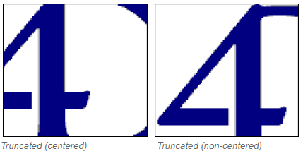

## Ruta de acceso

Ruta de una imagen source estática para un [botón imagen](pictureButton_overview.md), [menú emergente de imagen](picturePopupMenu_overview.md), o [imagen estática](staticPicture.md). Debe utilizar la sintaxis POSIX.

Las siguientes ubicaciones pueden utilizarse para las imágenes estáticas:

- en la carpeta **Resources** del proyecto. Apropiado cuando se desea compartir imágenes estáticas entre varios formularios en el proyecto. En este caso, el nombre de la ruta es "/RESOURCES/<picture path\>".
- en una carpeta de imágenes (por ejemplo, llamada **Images**) dentro de la carpeta del formulario. Apropiado cuando las imágenes estáticas se utilizan sólo en el formulario y/o se quiere poder mover o duplicar todo el formulario dentro del proyecto o de diferentes proyectos. En este caso, el nombre de la ruta es "<picture path\>" y se resuelve desde la raíz de la carpeta del formulario.
- en una variable imagen 4D. La imagen debe cargarse en la memoria cuando se ejecuta el formulario. En este caso, el nombre de la ruta es "var:<variableName\>".

#### Gramática JSON

| Nombre  | Tipos de datos | Valores posibles                                                                            |
|:-------:|:--------------:| ------------------------------------------------------------------------------------------- |
| picture |      text      | Relative or filesystem path in POSIX syntax, or "var:<variableName\>" for picture variable |

#### Objetos soportados

[Botón imagen](pictureButton_overview.md) - [Menú emergente imagen](picturePopupMenu_overview.md) - [Imagen estática](staticPicture.md)

---

## Visualización

### A escala para ajustarse

`Gramática JSON: "scaled"`

El formato **A escala para ajustarse** hace que 4D redimensione la imagen para ajustarla a las dimensiones del área.

### Replicado

`Gramática JSON: "tiled"`

When the area that contains a picture with the **Replicated** format is enlarged, the picture is not deformed but is replicated as many times as necessary in order to fill the area entirely.

If the field is reduced to a size smaller than that of the original picture, the picture is truncated (non-centered).

### Centrado / Truncado (no centrado)

`Gramática JSON: "truncatedCenter" / "truncatedTopLeft"`

El formato **Centro** hace que 4D centre la imagen en el área y recorte cualquier parte que no quepa dentro del área. 4D recorta por igual desde cada borde y desde la parte superior e inferior.

El formato **Truncado (no centrado)** hace que 4D coloque la esquina superior izquierda de la imagen en la esquina superior izquierda del área y recorte cualquier parte que no quepa dentro del área. 4D corta desde la derecha y desde abajo.
> Cuando el formato de la imagen es **Truncado (no centrado)**, es posible añadir barras de desplazamiento al área de entrada.

#### Gramática JSON

| Nombre        | Tipos de datos | Valores posibles                                         |
| ------------- | -------------- | -------------------------------------------------------- |
| pictureFormat | string         | "scaled", "tiled", "truncatedCenter", "truncatedTopLeft" |

#### Objetos soportados

[Imagen estática](staticPicture.md)
