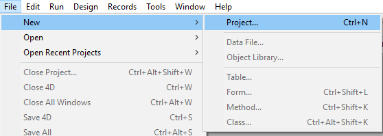

4D projects are created and developed using the **4D** application, which provides a comprehensive Integrated Development Environment (IDE). **4D Server** también puede crear nuevos proyectos vacíos.

El desarrollo multiusuario se gestiona a través de herramientas estándar del repositorio de **control de fuentes** (Perforce, Git, SVN, etc.), que permiten a los desarrolladores trabajar en diferentes ramas y comparar, fusionar o revertir las modificaciones.

## Crear un proyecto

New 4D application projects can be created from **4D** or **4D Server**. En cualquier caso, los archivos del proyecto se almacenan en la máquina local.

Para crear un nuevo proyecto:

1. Lance 4D o 4D Server.
2. Haga una de las siguientes cosas:
    * Seleccione **Nuevo > Proyecto** desde el menú **Archivo**: 
    * (4D only) Select **Project...** from the **New** toolbar button:

A standard **Save** dialog appears so you can choose the name and location of the 4D project's main folder.

3. Introduzca el nombre de su carpeta de proyecto y haga clic en **Guardar**. Este nombre se utilizará:

* como nombre de la carpeta del proyecto,
* como nombre del archivo .4DProject en el primer nivel de la carpeta "Project".

 Puedes elegir cualquier nombre permitido por su sistema operativo. However, if your project is intended to work on other systems or to be saved via a source control tool, you must take their specific naming recommendations into account.

When you validate the **Save** dialog, 4D closes the current project (if any), creates a project folder at the indicated location, and puts all files needed for the project into it. Para más información, consulte [Arquitectura de un proyecto 4D](Project/architecture.md).

A continuación, puede empezar a desarrollar su proyecto.

## Abrir un proyecto

Para abrir un proyecto existente desde 4D:

1. Haga una de las siguientes cosas:
    * Select **Open a local application project** in the Welcome Wizard dialog
    * Select **Open/Local Project...** from the **File** menu or the **Open** toolbar button. Aparece la caja de diálogo estándar de apertura de archivos.

2. Select the project's `.4dproject` file and click **Open**. Por defecto, el proyecto se abre con su archivo de datos actual. Se sugieren otros tipos de archivos:

* *Packed project files*: `.4dz` extension  - deployment projects
* *Shortcut files*: `.4DLink` extension - store additional parameters needed for opening projects or applications (addresses, identifiers, etc.)
* *Binary files*: `.4db` or `.4dc` extension - legacy 4D database formats

### Opciones

In addition to standard system options, the *Open* dialog in 4D provides two menus with specific options that are available using the **Open** button and the **Data file** menu.

* **Abrir** - modo de apertura del proyecto:
  * **Interpreted** or **Compiled**: These options are available when the selected project contains both [interpreted and compiled code](Concepts/interpreted.md).
  * **[Maintenance Security Center](MSC/overview.md)**: Opening in secure mode allowing access to damaged projects in order to perform any necessary repairs.

* **Data file** - specifies the data file to be used with the project. By default, the **Current data file** option is selected.

## Atajos de apertura de los proyectos

4D offers several ways to open projects directly and bypass the Open dialog:

* mediante las opciones de menú:
  * *Menu bar* - **File** > **Open Recent Projects / {project name}**
  * *4D Tool bar* -  Select the project from the menu associated with the **Open** button

* vía las preferencias:
  * Set the **At startup** general preference to **Open last used project**.

* utilizando un archivo `.4DLink`.

### Abrir un proyecto con un archivo 4DLink

You can use a [`.4DLink` file](#about-4DLink-files) to launch the 4D application and open the target 4D project. Hay dos maneras de hacer esto:

* double-click or drag and drop the `.4DLink` file onto the 4D application
* go to **File** > **Open Recent Projects** and select a project

A .4DLink file of "remote project" type can be copied and used on several machines.
> It's also possible to select a 4DLink file in the 4D and 4D Server opening dialog box (opening local project only).

## Sobre 4DLink Files

Files with the `.4DLink` extension are XML files that contain parameters intended to automate and simplify opening local or remote 4D projects.

`.4DLink` files can save the address of a 4D project as well as its connection identifiers and opening mode, saving you time when opening projects.

4D automatically generates a `.4DLink` file when a local project is opened for the first time or when connecting to a server for the first time. The file is stored in the local preferences folder at the following location:

* Windows 7 and higher: C:\Users\UserName\AppData\Roaming\4D\Favorites vXX\
* OS X: Users/UserName/Library/Application Support/4D/Favorites vXX/

XX representa el número de versión de la aplicación. Por ejemplo, "Favoritos v19" para 4D v19.

Esa carpeta está dividida en dos subcarpetas:

* the **Local** folder contains the `.4DLink` files that can be used to open local projects
* the **Remote** folder contains the `.4DLink` files of recent remote projects

Los archivos `.4DLink` también pueden crearse con un editor XML.

4D provides a DTD describing the XML keys that can be used to build a `.4DLink` file. This DTD is named database_link.dtd and is found in the \Resources\DTD\ subfolder of the 4D application.

## Guardado de archivos

Cuando trabaja en un proyecto en 4D, puede utilizar los editores integrados de 4D para crear, modificar o guardar elementos de la estructura, los métodos, los formularios, etc. Las modificaciones se guardan en el disco cuando se selecciona una opción de menú **Guardar**, o cuando la ventana del editor pierde o recupera el foco.

Dado que los editores utilizan archivos en el disco, podrían producirse conflictos si se modifica el mismo archivo o incluso se borra desde diferentes ubicaciones. For example, if the same method is edited in a Code Editor window *and* in a text editor, saving both modifications will result in a conflict.

El marco de desarrollo 4D incluye un gestor de acceso a los archivos para controlar los accesos simultáneos:

* if an open file is read-only at the OS level, a locked icon is displayed in the editor: 
* si un archivo abierto se edita simultáneamente desde diferentes ubicaciones, 4D muestra un diálogo de alerta al intentar guardar los cambios:

* **Sí**: ignorar los cambios del editor y volver a cargar la versión modificada
* **No**: guardar los cambios y sobrescribir la otra versión
* **Cancelar**: no guardar

Esta funcionalidad está activa para todos los editores 4D integrados (Estructura, Formulario, Método, Parámetros y Caja de herramientas).
