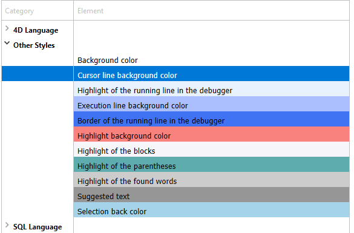

This page contains parameters defining the Code Editor interface and its default display as well as options concerning its operation. It is divided into two sections accessed using the Theme and Options tabs.

## Temas

This page allows selecting, creating, or configuring Code Editor themes. A theme defines the font, font size, colors and styles of items displayed in the code editor.

### Lista de temas

En esta lista, se selecciona el tema que se aplicará al editor de código. All available themes are displayed, including custom themes (if any). 4D ofrece dos temas por defecto:

*   **Tema Light por defecto**
*   **Tema oscuro por defecto**

> Los temas por defecto no pueden ser modificados ni eliminados.

A **myTheme** theme is automatically added if you already customized Code Editor styles in previous 4D releases.

### Creación de temas personalizados

Puede crear temas totalmente personalizables. To create a theme, select an existing theme and click on the **+** at the bottom of the theme list. You can also add customized themes by copying theme files in the `4D Editor Themes` folder (see below).

### Archivos de temas personalizados

Each custom theme is stored in a single JSON file named *themeName.json* The JSON files for custom themes are stored in the `4D Editor Themes` folder located at the same level as the 4D [preferences file](overview.md#storage).

If key values are not defined in a custom theme, they default to the values from the *Default Light Theme*. If a JSON theme file is invalid, the *Default Light Theme* is loaded and an error is generated.

> When a theme file is modified by an external editor, 4D must be restarted to take the modification(s) into account.

## Definir el tema

Definir un tema significa:

- definir una fuente y un tamaño de fuente para todo el editor de código,
- assigning specific styles and colors to each 4D language element (fields, tables, variables, parameters, SQL, etc.), SQL language element (keywords, functions, etc.), and color backgrounds.

Combining different colors and styles is particularly useful for code maintenance purposes.

### Fuentes y tamaños de fuente

The **font** and **font size** menus allows you to select the font name and size used in the Code Editor entry area for all categories.

### Lenguaje 4D y lenguaje SQL

You can set different font styles and colors (font color or background color) for each type of language element. Puede seleccionar los elementos que desea personalizar en la lista de categorías.

### Otros estilos

These options configure the various colors used in the Code Editor and debugger interfaces.

|                                                        | Descripción                                                                                                                                                              |
| ------------------------------------------------------ | ------------------------------------------------------------------------------------------------------------------------------------------------------------------------ |
| **Color de fondo**                                     | Color de fondo de la ventana del editor de código.                                                                                                                       |
| **Borde de la línea en ejecución en el depurador**     | Color of the border surrounding the line currently running in the debugger when the "Highlight line running" option is enabled in the [Options](#options) page.          |
| **Color de fondo de la línea del cursor**              | Color de fondo de la línea que contiene el cursor.                                                                                                                       |
| **Color de fondo de la línea en ejecución**            | Color de fondo de la línea que se está ejecutando en el depurador.                                                                                                       |
| **Resaltar las palabras encontradas**                  | Color de resaltado de las palabras encontradas en una búsqueda.                                                                                                          |
| **Destacar los paréntesis**                            | Highlight color of corresponding parentheses (used when pairs of parentheses are signaled by highlighting, see [Options](#options)).                                     |
| **Resaltado de los bloques**                           | Highlight color for selected logical blocks when the "Highlight logical blocks" option is enabled in the [Options](#options).                                            |
| **Resaltar la misma variable o campo**                 | Highlight color for other occurrences of the same variable or field text when one of the "Highlighting variables and text" option is enabled in the [Options](#options). |
| **Resaltado de la línea en ejecución en el depurador** | Highlight color of the line currently running in the debugger when the "Highlight line running" option is enabled in the [Options](#options).                            |
| **Color de fondo de la selección**                     | Color de fondo de la selección.                                                                                                                                          |
| **Texto sugerido**                                     | Color of autocomplete text suggested by the Code Editor.                                                                                                                 |

## Opciones

Esta página configura las opciones de visualización del Editor de Código.

### Opciones

#### Lenguaje de programación 4D (Utilice los parámetros regionales del sistema)

Allows you to disable/enable the "international" code settings for the local 4D application.
- **unchecked** (default): English-US settings and the English programming language are used in 4D methods.
- **checked**: Regional settings are used in 4D methods.

> If you modify this option, you need to restart the 4D application so that the change is taken into account.

#### Indentación

Cambia el valor de indentación del código 4D en el editor de código. El ancho debe especificarse en puntos (10 por defecto).

El código 4D es indentado automáticamente para revelar su estructura:

Modifying this default value can be useful if your methods contain complex algorithms with many levels of embedding. Se puede utilizar una indentación más estrecha para limitar el desplazamiento horizontal.

#### Mostrar los números de línea

Lets you display the line numbers by default in each window of the Code Editor. You can also show/hide line numbers for the current window directly from the Code Editor.

#### Mostrar las listas

Lets you choose whether or not to show the lists of objects (Commands, Tables and fields, etc.) by default when the Code Editor window is opened. También puede mostrar u ocultar cada lista directamente desde el Editor de código.

#### Mostrar los portapapeles

Lets you choose whether or not to show the multiple clipboards in the code editor.

The corresponding [clipboard shorcuts](https://doc.4d.com/4Dv19R3/4D/19-R3/Writing-a-method.300-5612559.en.html#3977166) are still active when these clipboards are hidden.

#### Resaltado de los bloques lógicos

When checked, the whole code belonging to a logical block (If/End if for example) is highlighted when the mouse is placed over the expanded node:

The highlight color can be set in the [Theme](#theme-definition) page.

#### Mostrar siempre las líneas de bloques

Permite ocultar permanentemente las líneas verticales de bloques. Las líneas de bloque están diseñadas para conectar visualmente los nodos. By default, they are always displayed (except when collapse/expand icons are hidden, see below).

#### Ocultar los iconos contraer/expandir

Allows you to hide all expand/collapse icons by default when displaying code. When the option is checked, node icons (as well as local block lines, see above), are displayed temporarily when the mouse is placed over a node:

#### Insertar () y añadir } ) ] " cierres

Enables automatic insertion of () and closing braces while typing code. Esta opción controla dos funcionalidades automáticas:

- **parentheses pair ()**: Added after a 4D command, keyword or project method inserted from a suggestion or completion list, if the inserted element requires one or more mandatory arguments. For example, if you type "C_OB" and press Tab, 4D writes "C_OBJECT()" and sets the insertion point inside the ().

- **closing }, ), ], or "**: Character added when you type respectively an opening {, (, ], or ". This feature allows inserting matching pairs of symbols at the insertion point or surrounding a selected text. For example, if you highlight a string and type a single ", the whole selected string will be enclosed in "":

  

#### Correspondencia \[]\(){}

Define la señalización gráfica de las llaves correspondientes en el código. This signaling appears whenever a square bracket, parenthesis, or curly bracket is selected. Las siguientes opciones están disponibles:

- **Ninguno**: sin señales
- **Rectangle** (default): Braces surrounded by a black line  
  
- **Background Color**: Braces highlighted (the color is set in the [Theme](#theme-definition) page).
- **Negrita**: las llaves aparecen en negrita.

#### Resaltado de las variables y campos

Allows to highlight all occurrences of the same variable or field in an open method window.

- **No**(por defecto): no resaltado
- **On cursor**: All occurrences are highlighted when the text is clicked
- **On selection**: All occurrences are highlighted when the text is selected

The highlight color can be set in the [Theme](#theme-definition) page.

#### Depurar (Resaltar la línea en ejecución)

Highlights the line that is currenty running in the debugger in addition to the regular yellow arrow indicator.

Si deselecciona esta opción, sólo se mostrará la flecha amarilla.

### Sugerencias

This area lets you configure autocomplete mechanisms in the Code Editor to adapt it to your own work habits.

|                                   | Descripción                                                                                                                                                                                                                                                      |
| --------------------------------- | ---------------------------------------------------------------------------------------------------------------------------------------------------------------------------------------------------------------------------------------------------------------- |
| Apertura automática de la ventana | Activa la visualización automática de la ventana de sugerencias para:<ul><li>Constantes</li><li>Variables (locales e interproceso) y atributos de objetos</li><li>Tablas</li><li>Prototipos (es decir las funciones de clase)</li></ul>
For example, when the "Variables (local or interprocess) and object attributes" option is checked, a list of suggestions appears when you type the $ character:

 You can disable this functioning for certain elements of the language by deselecting their corresponding option. |
| Validación de una sugerencia      | Sets the entry context that allows the Code Editor to validate automatically the current suggestion displayed in the autocomplete window.<ul><li>**Tab and delimiters** When this option is selected, you can validate the current selection with the Tab key or any delimiter that is relevant to the context. For example, if you enter "ALE" and then "(", 4D automatically writes "ALERT(" in the editor. Here is the list of delimiters that are taken into account:  ( ; : = < [ {</li><li>**Tab only** When this option is selected, you can only use the Tab key to insert the current suggestion. This can be used more particularly to facilitate the entry of delimiter characters in element names, such as ${1}.**Note**: You can also double-click in the window or press the Carriage return key to validate a suggestion.</li></ul>                                                                                               |
	

