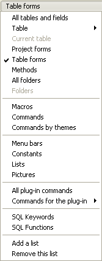
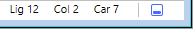
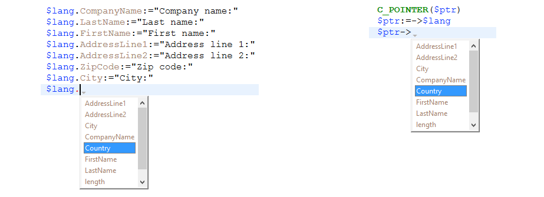
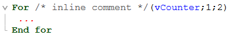

4D has a powerful built-in code editor that offers a wide set of features for highly productive code editing such as intelligent code completion, code navigation, debugging, searching, and more.


El editor de código funciona como un editor de texto. Writing a method or a class is usually a combination of typing text, selecting components, and dragging items from the Explorer or other windows. You can also use various type-ahead functions to create methods faster.

You can scroll through the contents of methods, classes and functions, which can include up to 32,000 lines of code or 2 GB of text.

The 4D Code Editor provides basic syntax error-checking. Cuando se ejecuta el código se realiza una comprobación adicional de errores. For more information on how to handle errors, see [Debugging](../Debugging/basics.md).

## Toolbar (Barra de herramientas)

Each Code Editor window has a toolbar that provides instant access to basic functions related to code execution and editing.

| Element                              | Icono                                                                             | Descripción                                                                                                                                                                                                                                                                                                                                    |
| ------------------------------------ | --------------------------------------------------------------------------------- | ---------------------------------------------------------------------------------------------------------------------------------------------------------------------------------------------------------------------------------------------------------------------------------------------------------------------------------------------- |
| **Ejecución del método**             |                     | When working with methods, each Code Editor window has a button that can be used to run the current method. Using the menu associated with this button, you can choose the type of execution:<ul><li> **Run new process**: Creates a process and runs the method in standard mode in this process.</li><li>**Run and debug new process**: Creates a new process and displays the method in the Debugger window for step by step execution in this process.</li><li>**Run in Application process**: Runs the method in standard mode in the context of the Application process (in other words, the record display window).</li><li>**Run and debug in Application process**: Displays the method in the Debugger window for step by step execution in the context of the Application process (in other words, the record display window).</li></ul>For more information on method execution, see [Calling Project Methods](../Concepts/methods.md#calling-project-methods). |
| **Buscar**                           |                                | Permite realizar una búsqueda en la ventana actual.                                                                                                                                                                                                                                                                                            |
| **Macros**                           |                              | Inserts a macro at the selection. Haga clic en la flecha desplegable para mostrar una lista de macros disponibles. For more information on how to create and instantiate macros, see [Macros](creating-using-macros.md).                                                                                                                       |
| **Expandir todo/Contraer todo**      |        | These buttons allow expanding or collapsing all the control flow structures of the code.                                                                                                                                                                                                                                                       |
| **Información del método**           |        | Displays the [Method Properties](../Concepts/methods.md#project-method-properties) dialog box (project methods only).                                                                                                                                                                                                                          |
| **Últimos valores del portapapeles** |  | Muestra los últimos valores almacenados en el portapapeles.                                                                                                                                                                                                                                                                                    |
| **Clipboards**                       |                        | Nueve portapapeles disponibles en el editor de código. You can [use these clipboards](./write-class-method.md#multiple-copy-paste-and-numbering-of-clipboards) by clicking on them directly or by using keyboard shortcuts. You can use a [Preferences option](Preferences/methods.md#options-1) to hide them.                                 |
| **Navegación en el código**          |                        | Lets you navigate inside methods and classes with automatically tagged content or manually declared markers. See [Navigation dropdown](./write-class-method.md#navigation-dropdown).                                                                                                                                                           |

## Editing area

This is where you [write and edit](write-class-method.md) your code. The editor automatically indents code text and colors the different syntax elements for clear code structure.

Puede personalizar la visualización del área de edición. Any customization is automatically passed on to all the windows of the code editor:

| Option                                          | Descripción                                                                                                                                                                                                 | Set in...                                                                                                                                                                                                                   |
| ----------------------------------------------- | ----------------------------------------------------------------------------------------------------------------------------------------------------------------------------------------------------------- | --------------------------------------------------------------------------------------------------------------------------------------------------------------------------------------------------------------------------- |
| **font** and **font size**                      | Define la fuente y el tamaño de los caracteres que se utilizarán en el área de edición                                                                                                                      | **Preferences** > [**Methods**](../Preferences/methods.md) or **Method > View** > **Bigger Font** or **Smaller Font**                                                                                                       |
| **estilo y color de los elementos de sintaxis** | assign a specific color and/or style to each type of element of the 4D language.  You can also change the different colors used in the interface of the editing area (highlighting, background, and so on). | Haga clic derecho en un elemento lingüístico (variable, palabra clave, etc.) Right-click on a language element (variable, keyword, etc.) > **Style** submenu. Or **Preferences** > [**Methods**](../Preferences/methods.md) |
| **espacios**                                    | You can display the spaces between words using dots (.) instead of blank spaces. This option applies to all the code elements (command names, variables, comments, etc.).                                   | **Método > Ver > Espacios en blanco**                                                                                                                                                                                       |
| **temas**                                       | Puedes seleccionar el tema Dark o Light, o definir uno personalizado                                                                                                                                        | **Preferences** > [**Methods**](../Preferences/methods.md)                                                                                                                                                                  |
| **ancho de indentaciones de código**            | Define el ancho de las sangrías de código                                                                                                                                                                   | **Preferences** > [**Methods**](../Preferences/methods.md)                                                                                                                                                                  |

## Lists area

The lists area lets you display one or more lists of elements necessary for writing methods and classes (commands, constants, forms, etc.). You can choose the number and contents of the lists displayed in the window.

Por defecto, el editor de código muestra cuatro listas. You can hide or show all lists by clicking on the icon at the botton right of the window. 

You can enlarge or reduce the relative width of each list area by dragging one of its partitions. It is also possible to adjust the size of the list area in relation to that of the editing area by dragging the dividing line between them.

- Double-clicking on an item in a list causes it to be inserted into the editing area, at the location of the cursor.
- To **modify the contents** of a list, click on the title area of the list concerned: a pop-up menu appears, enabling you to choose the type of item to be displayed.



- To add or remove a list, click in the title area of one of the lists and choose the corresponding command in the pop-up menu. The **Remove this list** command is disabled when you click on the last list. If you want to hide all the lists, you must either click on the **show or hide lists**  button at the bottom right of the window or hide them by default in the **Preferences**.

- Puede ocultar las listas en todas las ventanas de las siguientes maneras:
  - Select the **View > Lists** option in the **Method** menu (a check mark indicates whether lists are displayed)
  - For practical reasons, you can disable the automatic display of the list of suggestions for **constants**, **(local or interprocess) variables and object attributes** and/or **tables**. These options are found in **Preferences** > **Methods** > **Options**

#### Available lists of items

You can display the following lists of items in the lists area of the Code Editor window:

- **All tables and fields**: Database table and field names in the form of a hierarchical list. When you insert a field name into the method by double-clicking on its name, 4D inserts it while respecting the syntax and adds the name of the table or subtable as the case may be.
- **Table** (submenu): Field names of the table selected using the submenu.
- **Current table**: Field names of the current table (available in triggers, form methods and object methods).
- **Project forms**: Database project form names. When you double-click on a project form name, 4D inserts its while respecting the syntax: the form name is inserted between quotes.
- **Table forms**: Database table and form names in the form of a hierarchical list. When you insert a form name into a method by double-clicking its name, 4D inserts it while respecting the syntax: the form name is inserted between quotes and is preceded by the name of the table and a semi-colon. Por ejemplo: [Table];"Form".
- **Methods**: Database project method names.
- **All folders**: Names of object folders and subfolders set in the database displayed in the form of a hierarchical list. Las carpetas pueden utilizarse para organizar los objetos de forma personalizada. Se gestionan desde la página de inicio del Explorador.
- **Folders** (submenu): Contents of the folder selected using the submenu.
- **Macros**: Macro names defined for the database (see [Creating and using macros](#creating-and-using-macros)).
- **Commands**: 4D language commands in alphabetical order.
- **Commands by themes**: 4D language commands classified by theme in the form of a hierarchical list.
- **Menu bars**: Names and numbers of menu bars [created with the 4D Menu bar editor](../Menus/creating.md).
- **Constants**: 4D constants and those of any plug-ins, classified by theme in the form of a hierarchical list.
- **Listas**: nombres de listas.
- **All plug-in commands**: Commands for all the plug-ins installed in the database (if any), classified by theme in the form of a hierarchical list.
- **SQL Keywords**: set of keywords recognized by the 4D SQL syntax parser. This list includes commands (e.g. SELECT), clauses (e.g. WHERE) as well as functions (ABS).
- **Funciones SQL**: Funciones SQL 4D.

**Note:** Except for the Macros element, all the lists are in alphabetical order.

### Guardar como plantilla

You can save the lists set in the Code Editor window in the form of a template. Once the template is saved, the parameters set in it will be used for each new Code Editor window that is opened.

Los siguientes parámetros se almacenan en la plantilla:

- Tamaño relativo de las áreas de edición y de la lista
- Number of lists
- Ubicación y contenido de cada lista
- Ancho relativo de cada lista

To save a Code Editor window as a template, choose **Method** > **Save As Template**. La plantilla se guarda inmediatamente (no aparece ningún diálogo). It is stored in the **Preferences** of the 4D application. Si ya existe una plantilla anterior, se sustituye.

## Break points area

This area, located to the left of the editing area, allows you to display the line numbers and to insert break points directly next to specific instructions. Los puntos de interrupción son útiles durante la fase de depuración de su programación. They stop the execution of your code at specific locations and display the debugger.

For more information on break points, see the [Debugging](../Debugging/breakpoints.md#breakpoints) section.

You can display or hide the line numbers in the break points area for each window of the Code Editor.

- To enable or disable the display of line numbers by default,  choose **Preferences** > **Methods** > **Show line numbers**.
- To modify this display separately for each window of the Code Editor, choose **Method** > **View** > **Line Numbers**.

Displaying the line numbers makes it easier to find your way around in the window. The **Method** > **Go to Line Number...** command in the also lets you take advantage of this display.

## Status bar

The status bar located at the bottom right part of the editor window displays the position of the cursor at all times:



- **Ln**: número de línea
- **Col**: Column number, i.e., the level in the hierarchy of programming structures. El primer nivel es 0. The column number is useful for debugging since this information can be provided by the interpreter in the event of an error in the code.
- **Ch**: ubicación del caracter en la línea.
- : Ocultar/mostrar listas.

## Escribir y editar código

4D uses standard text editing techniques for typing and editing in the Code Editor.

The Code Editor uses display conventions (style, color) for the syntax elements. You can [customize these conventions](#customizing-the-editing-area). As you type, when you validate your entry, 4D evaluates the text of the line and applies the appropriate display format. 4D also indents each line to its proper level in relation to the preceding line when you use programming structures (If, End if...).

Puede utilizar las teclas de flecha para moverse rápidamente de línea a línea. Using the arrow keys to move across several lines is quicker than clicking because the editor delays evaluating the line for errors.

Under Windows, the code editor includes an Input Code Editor (IME) to facilitate code editing on Japanese or Chinese systems.

The Code Editor includes numerous [navigation shortcuts](#navigational-keyboard-shortcuts).

### Añadiendo elementos por arrastrar y soltar

Al escribir métodos, puede arrastrar y soltar elementos:

- desde el Explorador
- dentro del mismo método, clase, función
- entre métodos, clases y funciones

#### Desde el Explorador

Desde el Explorador, puedes arrastrar y soltar:

- Table names, field names, form names and project methods from the Home page.
- Nombres de tablas y nombres de campos de la página Tablas,
- Nombres de tablas y formularios de la página Formularios,
- Project methods and form names from the Methods page,
- Constantes de la página de Constantes,
- Comandos 4D de la página Comandos.

When you drag and drop a component, 4D always uses the correct syntax for the component. For example, if you drag the field name "First Name" from the [People] table, it appears in the Code Editor as "[People]First Name." Similarly, if you drag the Form name "Input" from the People table, it appears in the Code Editor as "[People];"Input"."

When you insert a command by dragging it from the **Commands** page of the Explorer, it appears with its syntax (which consists of all of its parameters) in the Code Editor. Esta funcionalidad simplemente le recuerda los parámetros que espera el comando. A continuación, puede utilizar una sintaxis que se adapte mejor a su uso.

#### Dentro de un método, clase, función o entre dos diferentes

In the Code Editor, the drag-and-drop mechanism is activated as soon as a portion of text is selected. Por defecto, el mecanismo de arrastrar y soltar mueve el texto seleccionado. In order to copy it, hold down the **Ctrl** key (Windows) or the **Option** key (macOS) during the operation.

### Entrada en varias líneas

You can write a single statement on several lines by terminating each line of the statement with a backslash `\` character. 4D considerará todas las líneas a la vez. Por ejemplo, ambas sentencias son equivalentes:


### Changing case

You can automatically modify the case of selected characters using the commands in **Methods** > **Case** or the context menu of the editor:

- **Uppercase** / **Lowercase**: Switch the selected characters to uppercase or lowercase.
- **camelCase** / **CamelCase** : Switch the selected characters to "camel case". This consists in changing each first letter of a group of attached words to uppercase. Este tipo de notación se utiliza a menudo para las nomenclaturas variables. hireDate and PurchaseDate are examples of two variants of camel case notation.

When you apply one of these commands to a text selection, the spaces and "_" characters are removed and the first letter of each word becomes uppercase.

### Swap expression

The **Swap Expression** function can be used to reverse the arguments of an expression assigning a value. Por ejemplo,

`variable1:=variable2`

se convierte en

`variable2:=variable1`

This function is extremely useful for reversing a set of assignments used to get or set properties, or to correct input errors. Within the selection, only the lines assigning a value will be modified. To use this function, select the line(s) to be modified, then choose **Method** > **Swap Expression** or use the context menu of the area.

### Multiple copy-paste and numbering of clipboards

In addition to the standard copy-paste operation, 4D offers two additional functions that let you work with the contents of different clipboards:

- The program stores the last 10 "copy" or "cut" actions that were performed in the Code Editor in memory during the current session. Cada uno de los diferentes contenidos guardados de esta manera puede ser reutilizado en cualquier momento. To do this, use the **Clipboard History** command of the Code Editor context menu or the "Last Clipboard values" button of the toolbar:

    

    Se muestran las primeras palabras de los elementos copiados o cortados. Seleccione un elemento para insertarlo en la ubicación actual del cursor.

- Nine additional numbered clipboards are available and can be employed directly using the buttons of the Code Editor toolbar or using keyboard shortcuts:


|Platform|Copy selected text to a clipboard|Paste contents of a clipboard at cursor location| |--|--|--| | **Windows** | Shift or Alt+click on clipboard icon | Ctrl+click on clipboard icon | |  |  | Ctrl+clipboard number | | **macOS** | Shift or Alt+click on clipboard icon | Cmd+click on clipboard icon | |  | Cmd+Shift+clipboard number | Cmd+clipboard number |

You can use a [Preferences option](Preferences/methods.md#options-1) to hide numbered clipboards.

### Moving lines

You can move the line where the cursor is directly without selecting it first using the **Move Lines Up** and **Move Lines Down** commands in the **Method** menu. You can also do this using the combination **Alt/Option** + **Up Arrow** or **Down Arrow**.

### Change bars

Colored bars instantly show you where lines of code were modified since the method was opened:


The change bars change colors to indicate whether or not the modifications were saved:

- amarillo: la línea fue modificada y el método aún no ha sido guardado.
- verde: la línea fue modificada y el método ha sido guardado.

## Uso de las funciones de autocompletar

El editor de código ofrece funciones de autocompletado. 4D automatically displays suggestions based on the first few characters typed.

In the example given below, typing the string "cop" causes the display of a blue triangle indicating that several suggestions are available:


When the characters you enter correspond to a single possibility, this suggested value appears greyed out (and is inserted if you hit the **Tab** key):  ---> 

> If you checked the **Insert () and closing } ) ] "** option in the **Methods** page of the **Preferences**, 4D will also automatically add **()** after a 4D command, keyword or project method that requires one or more mandatory arguments (after accepting a suggestion or completion):  -> 

Autocompletion also works with code structures (e.g. If..End if, For each... End for each): when you enter the first part of the structure, the Code Editor will automatically suggest the closing part:

If there are several suggestions available, 4D displays them in a pop-up list when you hit the **Tab** key:


La lista está en orden alfabético. Choose the value by double-clicking it or scroll the list using the arrow keys of the keyboard and then hit **Enter**, **Carriage Return** or **Tab** to insert the selected value.

By default, you can also insert a suggested value by hitting one of the following delimiter `( ; : = < [ {` keys after selecting a value: the value inserted is then followed by the delimiter, ready for data entry.

  +  **(** key --> 

> You can disable the use of delimiters for inserting suggested values in **Preferences** > **Methods** > **Options**.

You can press the **Esc** key to close the pop-up list or you can continue typing while it is open. The values suggested in the pop-up list are updated as additional characters are typed.

If the characters typed correspond to different types of objects, the list displays them in their current style. Se pueden mostrar los siguientes tipos de objetos:

- Comandos 4D
- Comandos SQL
- User methods
- Table names
- Field names
- Constantes
- Variable local, proceso o interproceso, declarada en el método
- Nombres de propiedad objeto
- Comandos del Plug-in
- 4D keywords
- Palabras clave SQL
- Macros (mostradas entre < >)

> For practical reasons, you can disable the automatic display of the list of suggestions for **constants**, **(local or interprocess) variables and object attributes** and/or **tables**. These options are found in **Preferences** > **Methods** > **Options**

### Propiedades de los objetos

4D automatically displays case-sensitive suggestions of all valid object property names in 4D code when you:

- escribe un punto "." después de un objeto o
- utilizar la tecla Tab después de un puntero objeto desreferenciado "->".



> The `length` property is always included for use with collections.

Once created, property names are stored in an internal global list and are available anytime a method/class/function is opened, closed or changes focus.


La lista de sugerencias se actualiza dinámicamente mientras se edita el código. When switching between windows, new/edited property names are always added to the global list. The list is also updated when you preview a method, class or function in the Explorer.

Cuando se reinicia la base de datos, la lista se reinicia.

> You can disable the automatic display of object properties in **Preferences** > **Methods** > **suggestions**.

## Seleccionando texto

The **Select Enclosing Block** function is used to select the "enclosing block" of the code containing the insertion point. El bloque adjunto puede ser definido por:

- Comillas
- Parentheses
- A logical structure (If/Else/End if, While/End while, Repeat/Until Case of/End case)
- Braces

If a block of text is already selected, the function selects the enclosing block of the next highest level and so on, until the entire method is selected.

Pressing **Ctrl+Shift+B** (Windows) or **Command+Shift+B** (macOS) enables you to reverse this operation and deselect the last enclosing block selected.

**Note:** If the insertion point is placed in an `If` or `Else` type structure, the enclosing block will be the one containing, respectively, the `If` or `Else` statement.

Puede hacer doble clic para seleccionar "palabras" individuales. When the item name referenced (command, constant, method, etc.) contains spaces, you can select the whole name (including spaces) by using the **Alt/Option + Double-click** combination.

### Atajos

Standard keyboard shortcuts to navigate the code are available in 4D's Code Editor.

**Note:** Under macOS, use the **Command** key instead of the **Ctrl** key mentioned (Windows).

| **Atajo**                                           | **Acción**                                                                                                                             |
| --------------------------------------------------- | -------------------------------------------------------------------------------------------------------------------------------------- |
| [Shift]+[flecha derecha]                            | Create and enlarge the selection, character by character, to the right, or Reduce the selection, character by character, from the left |
| [Shift]+[flecha izquierda]                          | Reduce the selection, character by character, from the right or Create and enlarge the selection, character by character, to the left  |
| [Shift]+[flecha abajo]                              | Create and enlarge a selection, line by line, from the top to the bottom                                                               |
| [Shift]+[flecha arriba]                             | Create and enlarge a selection, line by line, from the bottom to the top                                                               |
| [Ctrl]+[Shift]+[flecha derecha]                     | Crear y ampliar la selección, palabra por palabra, desde la derecha                                                                    |
| [Ctrl]+[Shift]+[flecha izquierda]                   | Reduce the selection, word for word, from the right, or create and enlarge the selection, word by word, from the left                  |
| [Ctrl]+[flecha derecha]                             | Mover el punto de inserción, palabra por palabra, de izquierda a derecha                                                               |
| [Ctrl]+[flecha izquierda]                           | Mover el punto de inserción, palabra por palabra, de derecha a izquierda                                                               |
| [Home]                                              | Colocar el punto de inserción al comienzo de la línea                                                                                  |
| [End]                                               | Coloca el punto de inserción al final de la línea                                                                                      |
| [Ctrl]+[Home]                                       | Place the insertion point at the beginning of the method                                                                               |
| [Ctrl]+[End]                                        | Coloca el punto de inserción al final del método                                                                                       |
| [Shift]+[Home]                                      | Select all the characters in the line that are to the left of the cursor                                                               |
| [Shift]+[End]                                       | Selecciona todos los caracteres de la línea que están a la derecha del cursor                                                          |
| [PgUp]                                              | Scroll the contents of the method, page by page, from the bottom to the top (doesn't modify the insertion point)                       |
| [PgDn]                                              | Scroll the contents of the method, page by page, from the top to the bottom (doesn't modify the insertion point)                       |
| [Ctrl]+[K] en el nombre de un método proyecto       | Abrir el método proyecto en una nueva ventana                                                                                          |
| [Alt]+doble clic en el nombre de un método proyecto | idem                                                                                                                                   |
| [Ctrl]+haga clic en el nombre de un método proyecto | idem                                                                                                                                   |

## Comprobación y corrección de errores de sintaxis

4D comprueba automáticamente la sintaxis del método para ver si es correcta. If you enter text or select a component that is not syntactically correct, 4D displays a symbol to indicate the incorrect expression . When you move the mouse over the symbol, a help tip displays the cause of the error:


When entering code, you can immediately check the syntax of the current line (without advancing to the next line) by pressing the **Enter** key on the numeric keypad. 4D evaluates the line, formats it, marks any errors, and places the insertion point at the end of the line. When a line of a method, class or function is marked as having improper syntax, check and fix the entry. Si la línea es correcta, 4D elimina el símbolo de error. Al guardar o cerrar la ventana, se valida todo el método. You can also force validation by pressing the **Enter** key.

When the method, class or function is validated, 4D checks for:

- basic syntax errors
- the structure of statements (`If`, `End if` and so on)
- matching enclosing characters in the code such as parentheses or quotation marks. When you type an enclosing character, 4D indicates the match by framing the start/end characters with gray rectangles:


> If you click on an enclosing character in the code, 4D indicates its match with gray rectangles by default. You can modify the way 4D indicates matching enclosing characters or disable this feature in **Preferences** > **Methods** > **Options** > **Matching parentheses**.

The Code Editor can only check for obvious syntax errors (misspellings and the like). No verifica errores que sólo ocurren durante la ejecución. Los errores de ejecución son detectados por 4D cuando se ejecuta el código.

4D has a built-in debugger (see [Debugging](../Debugging/debugger.md)) for handling and correcting these errors. El compilador también ofrece una ayuda indispensable para detectar errores. For more information about the compiler, refer to the [Compilation](../Project/compiler.md) chapter.

## Utilizando consejos de ayuda y barra de estado

The Code Editor provides various contextual information using help tips. They appear when you mouse over an object and the status bar, at the bottom of a Code Editor window.

- **Errors**: When you mouse over the symbol indicating an error to the left of the editing area, a help tip displays the cause of the error (see [Checking and correcting syntax errors](#checking-and-correcting-syntax-errors)).

- **4D command documentation**: When you set the cursor in a command name or parameter(s), the status bar displays the syntax of the command. If you write or select a parameter, the area shows the current parameter in **bold**:  When you move the mouse over a 4D command, a help tip provides the command syntax along with a brief description of how it works. 

- **Variable type and description**: When you mouse over a variable, a help tip shows its type (if it has been explicitly defined in the method) and associated comment, if any. 

- **Project methods**: When you mouse over a project method or class function, a help tip displays:

  - o los comentarios especificados en el Explorador.
  - or the first few lines of the method or class function if it includes comments (lines beginning with // or /*...*/ comment block). It is common practice to insert documentation for the method as well as its parameters in the form of comments at the beginning of the method. You can get this information directly in the help tip, just make sure to first remove any comments found in the Explorer. Comments at the beginning of a method:  Help tip in another method: 

- You can also create a **dedicated documentation file** named `<MethodName>.md` in the `<package>/documentation` folder. See [Viewing documentation in the code editor](../Project/documentation.md#viewing-documentation-in-the-code-editor)

## Mostrar la documentación completa de un comando

You can display the HTML documentation of a 4D "classic" language command at any time: to do so, select the complete command name or simply place the cursor in the name and press **F1**. The complete documentation of the command is displayed in a new window of your default browser.

4D looks for the on-line documentation of the command (on the *4D Doc Center* site) or searches locally depending on the settings made in the application Preferences (see [Documentation location](../Preferences/general.md#documentation-location)).

## Comentar/Descomentar

Los comentarios son líneas de instrucciones inactivas. These lines are not interpreted by the program (4D does not apply any particular style within comments) and are not executed when the method or function is called.

Hay dos maneras de crear comentarios:

#### `//comentario`

Se utiliza para crear un comentario de una sola línea. Inserting // at the beginning of a line will create a single line comment. The length of single line comments is limited to the maximum size of a line (32,000 characters).

<pre>&lt;code class="//This is a comment\" spaces=">
 &lt;code class="//This is a comment\" spaces=">
 For(vCounter;1;2)\
  //comment\
  //comment\
  //comment\
 End for
&lt;/code>
&lt;/code></pre>

#### `/*comment*/`

Used to surround the content to create inline comments or multiline comment blocks.

Both inline and multiline comment blocks begin with /*and end with*/.

- *Inline comments* -  can be anywhere in the code.The length of inline comments is limited to the maximum size of a line (32,000 characters). 

- *Bloques de comentarios multilínea* - pueden ser contraídoos o expandidos. Multiline comment blocks can be nested and each block  is expandable/collapsable. The comments on the first line of an expandable/collapsable block will remain visible when the block is collapsed. The length of multiline comments is limited to the maximum size of 32,000 characters per line. No hay límite en el número de líneas. 

> No se admiten los comentarios multilínea al final de una línea.-

The **Comment/Uncomment** command, found in the **Method** menu as well as in the Code Editor context menu is used to mark a group of selected lines of code as single line comments, or, on the contrary, to remove the single line comment characters from a selection. To use this command, select the code to be marked as commented, then select the **Comment/Uncomment** command:

 --> 

When the selection contains only active code, the **Comment** command is applied. When the selection includes both active code and commented lines, an additional pair of comment characters ( // ) is added to the latter; this way, they will retain their initial commented status if the line is subsequently "uncommented." When the selection contains only commented lines, the **Uncomment** command is applied.

> The **Comment/Uncomment** command only operates with full lines --- it cannot be used to comment only part of a line.

## Usar secuencias de escape

The Code Editor allows you to use escape sequences (also called escape characters). An escape sequence is a sequence of characters that can be used to replace a "special" character.

The sequence consists of a backslash `\`, followed by a character. For instance, `\t` is an escape sequence for the **Tab** character. Escape sequences facilitate the entry of special characters: the previous example (`\t`) replaces the entry "Character(Tab)".

En 4D, se pueden utilizar las siguientes secuencias de escape:

| Secuencias de escape              | Carácter reemplazado |
| --------------------------------- | -------------------- |
| `\n`                             | LF (Retorno línea)   |
| `\t`                             | HT (Tabulación)      |
| `\r`                             | CR (Retorno carro)   |
| ``\\` |``&#96; (barra inversa) |                      |
| `\"`                             | " (Comillas)         |

> Es posible utilizar mayúsculas o minúsculas en las secuencias de escape.

In the following example, the **Carriage return** character (escape sequence \r) is inserted in a statement in order to obtain the dialog box shown:

`ALERT("The operation has been completed successfully.\rYou may now disconnect.")`

**Warning:** The `\` (backslash) character is used as a separator in pathnames under Windows. In general, 4D will correctly interpret Windows pathnames entered in the Code Editor by replacing the single backslash `\` with a double backslash ``\\`. For instance,``C:\Folder`will become`C:\\Folder`. However, if you write`"C:\MyDocuments\New"`, 4D will display`"C:\\MyDocuments\New"`. In this case, the second backslash is interpreted incorrectly as`\N`(an existing escape sequence). You must therefore enter a double backslash`\\` when you want to have a backslash in front of a character used in one of the escape sequences recognized by 4D.

## Facilitar la edición de código

Several functions in the Code Editor make code easier to read and facilitate browsing among the statements.

### Expandir / Contraer

4D code located inside loops and conditions can now be collapsed or expanded, in order to facilitate the reading of methods:

- Expanded code: 

- Collapsed code: 

If you place the mouse over the expand button [...], a help tip appears, displaying the first lines of the hidden code.

Se puede seleccionar, copiar, pegar o eliminar una porción de código contraída. All the lines included therein will be copied, pasted or deleted respectively. When a portion of code is pasted, it is automatically expanded.

Hay varias formas de expandir y contraer código:

- Click on the expand/collapse icons ([+] and [-] under Windows) or on the opening button [...]
- Use the commands of the **Method > Collapse/Expand** submenu:

  - **Collapse Selection** / **Expand Selection**: collapses or expands all the code structures found in the text selection.
  - **Collapse Current Level** / **Expand Current Level**: collapses or expands the code structure at the level where the cursor is located. These commands are also available in the **context menu** of the editor.
  - **Collapse All** / **Expand All**: collapses or expands all the loops and conditions of a method. Estos comandos también están disponibles en la barra de herramientas del editor.

### Inicio del bloque o fin del bloque

Two commands make it easier to move around within code structures (e.g. `If...Else...End if`):

- **Start Of Block**: places the cursor at the start of the current structure, just before the initial keyword.
- **End Of Block**: places the cursor at the end of the current structure, just after the final keyword.

These commands are found in the **Method** menu as well as the context menu of the editor. También puede utilizar los siguientes atajos:

- Windows: **Ctrl + up arrow** or **Ctrl** + **down arrow**‚
- macOS: **Command** + **up arrow** or **Command** +**down arrow**.

### Utilizando marcadores

4D le permite asociar marcadores con ciertas líneas en sus métodos. You can then browse quickly within the code by passing from one bookmark to another using specific commands.


A bookmark moves along with its original row if additional rows are inserted in the method. Los marcadores se guardan con los métodos.

Bookmarks are managed using the **Bookmarks** submenu of the **Method** menu:

- **Toggle**: Associates a bookmark with the current line (where the cursor is located) if it does not already have one or removes the existing bookmark if it does. This function is also available using the **Toggle Bookmark** command of the editor's context menu or using the **Ctrl+F3** (Windows) or **Command+F3** (macOS) keyboard shortcut.
- **Remove All**: Removes all bookmarks from the foreground window.
- **Goto Next** / **Goto Previous**: Enables browsing among bookmarks in the window. Selecting one of these commands places the cursor on the first character of the line associated with the bookmark concerned. You can also use the keyboard shortcuts **F3** (go to next) or **Shift+F3** (go to previous).

**Note:** You can use bookmarks as markers for lines that contain an item found by a search. En este caso, 4D añade automáticamente los marcadores. For more information, refer to [Find and replace in methods](./find-and-replace-in-methods).

## Despliegue de navegación

La lista desplegable de navegación le ayuda a organizar su código y a navegar más fácilmente dentro de sus clases y métodos:


Algunas etiquetas se añaden automáticamente y puede complementar la lista desplegable utilizando los [marcadores ](#manual-tagging).

### Navegación en el código

Haga clic en un elemento de la lista desplegable para acceder a su primera línea en el código. También puede navegar con las teclas de flecha y presionar **Intro**.

### Etiquetado automático

Los constructores, las declaraciones de métodos, las funciones y los atributos calculados se etiquetan automáticamente y se añaden a la lista desplegable.

Cuando no hay ninguna etiqueta en la clase/método, la herramienta muestra "Sin etiqueta".

Los siguientes elementos se añaden automáticamente:

| Icono                                                                       | Elemento                                       |
| --------------------------------------------------------------------------- | ---------------------------------------------- |
|                          | Sin etiqueta                                   |
|                | Class constructor o declaración de método      |
|  | Atributo calculado (get, set, orderBy y query) |
|                      | Nombre de la función de clase                  |

### Etiquetado manual

Añadiendo marcadores en su código, puede añadir las siguientes etiquetas a la lista desplegable:

| Icono                                                   | Elemento       |
| ------------------------------------------------------- | -------------- |
|  | MARK: etiqueta |
|  | TODO: etiqueta |
|    | FIXME: tag     |

Se declaran añadiendo comentarios como:

```4d
// FIXME: Corrige los siguientes elementos
```

Las declaraciones no distinguen entre mayúsculas y minúsculas; escribir `fixme:` tiene el mismo efecto.

Añadir un guión después de la etiqueta `MARK:` dibuja una línea de separación en el editor de código y en el menú desplegable. Así que escribiendo esto:


Esto es lo que resulta:


Todos los marcadores situados dentro de las funciones tienen sangría en la lista desplegable, excepto las etiquetas `MARK:` situadas al final de las funciones y no seguidas de instrucciones. Estos aparecerán en el primer nivel.

### Orden de visualización

Las etiquetas se muestran en su orden de aparición dentro del método/clase.

Para mostrar las etiquetas de un método o de una clase en orden alfabético, realice una de las siguientes acciones:

- **haga clic derecho** en la herramienta desplegable
- mantenga **Cmd** en macOS o **Alt** en Windows, y haga clic en la herramienta de lista desplegable

> Las etiquetas dentro de las funciones se mueven con sus elementos padres.
