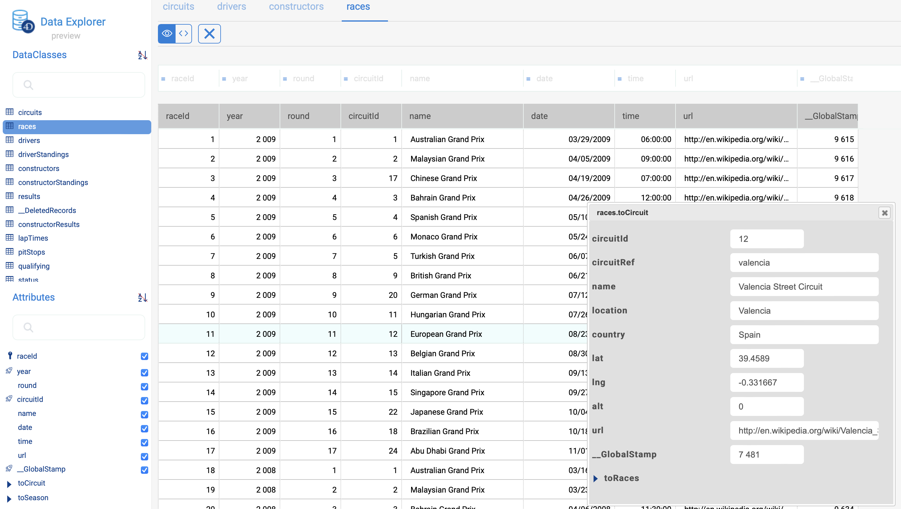

> **Vista previa**: El explorador de datos web se ofrece como una funcionalidad de visión general. No se recomienda utilizar esta funcionalidad en producción. La implementación final podría ser ligeramente diferente.

El Explorador de datos ofrece una interfaz web para ver y consultar los datos del almacén de datos de su proyecto. Utilizando esta herramienta, puede navegar fácilmente entre todas sus entidades y buscar, ordenar o filtrar los valores de los atributos. Le ayuda a controlar los datos y a identificar rápidamente los problemas en cualquier etapa del proceso de desarrollo.


## Configuración

El Explorador de datos se basa en el componente servidor web [`WebAdmin`](webAdmin.md) para la configuración y los parámetros de autenticación.

- **configuración**: la configuración del Explorador de datos reutiliza los [parámetros del servidor web `WebAdmin`](webAdmin.md#webadmin-settings),
- **autenticación**: el acceso al Explorador de datos se concede cuando [el usuario de la sesión está autenticado](webAdmin.md#authentication-and-session) y tiene el privilegio "WebAdmin". Cuando se accede al Explorador de datos a través del elemento de menú **Explorador de datos** (ver más adelante), se proporciona una autenticación automática.

> El acceso al Explorador de Datos puede desactivarse mediante la función [`.setAdminProtection()`](API/DataStoreClass.md#setadminprotection).

## Apertura del Explorador de datos

La página del Explorador de datos está disponible automáticamente cuando [el servidor web `WebAdmin` se inicia](webAdmin.md#starting-the-webadmin-web-server).

Para conectarse a la página web del Explorador de datos:

- si utiliza una aplicación 4D con interfaz, seleccione el comando **Explorador de datos...** de:
  - el menú **Registros** (en 4D monopuesto)
  - el menú **Ventana** (en 4D Server)

- tanto si utiliza una aplicación 4D sin interfaz como si no, puede abrir su navegador web e introducir la siguiente dirección:

 `IPaddress:HTTPPort/dataexplorer` or `IPaddress:HTTPSPort/dataexplorer`

 En este contexto, se le pedirá que introduzca la [clave de acceso](webAdmin.md#access-key) para abrir una sesión de `WebAdmin` en el servidor:


> Los valores [HTTPPort](webAdmin.md#http-port) y [HTTPSPort](webAdmin.md#https-port) se configuran en los parámetros de `WebAdmin`.

## Uso del explorador de datos

Además de una vista completa y personalizable de sus datos, el Explorador de datos le permite consultar y ordenar sus datos.

### Requisitos

El Explorador de datos es compatible con los siguientes navegadores web:

- Chrome
- Safari
- Edge
- FireFox

La resolución mínima para utilizar el Explorador de Datos es de 1280x720. La resolución recomendada es de 1920x1080.

### Básicos

El Explorador de Datos ofrece un acceso global al modelo de datos ORDA con respecto a las reglas de mapeo [ORDA](ORDA/dsMapping.md#general-rules).

Puede pasar al tema de visualización **modo oscuro** utilizando el selector en la parte inferior de la página:


La página contiene varias áreas:

- En el lado izquierdo se encuentran el **área de las Clases de datos** y el **área de los atributos**, lo que permite seleccionar las clases de datos y los atributos a mostrar. Los atributos se ordenan según el orden de creación de la estructura subyacente. Las llaves primarias y los atributos indexados tienen un icono específico. Puede filtrar la lista de nombres de clases de datos y de atributos propuestos utilizando las áreas de búsqueda respectivas. 

- La parte central contiene el **Área de búsqueda** y la **Rejilla de datos** (lista de entidades de la clase de datos seleccionada). Cada columna de la cuadrícula representa un atributo del almacén de datos.
  - Por defecto, se muestran todas las entidades. Puede filtrar las entidades mostradas utilizando el área de búsqueda. Hay dos modos de consulta disponibles: [Consulta sobre atributos](#query-on-attributes) (seleccionada por defecto), y la [Consulta avanzada con expresión](#advanced-query-with-expression). El modo de consulta se selecciona haciendo clic en el botón correspondiente (el botón **X** permite restablecer el área de consulta y, por tanto, dejar de filtrar): 
  - El nombre de la clase de datos seleccionada se añade como una pestaña encima de la cuadrícula de datos. Utilizando estas pestañas, puede cambiar entre las clases de datos que ya han sido seleccionadas. Puede eliminar una clase de datos referenciada haciendo clic en el icono "eliminar" situado a la derecha del nombre de la clase de datos.
  - Puede reducir el número de columnas desmarcando los atributos en la parte izquierda. También puede cambiar las columnas de la cuadrícula de datos utilizando arrastrar y soltar. Puede hacer clic en el encabezado de una columna para [ordenar entidades](#ordering-entities) de acuerdo a sus valores (cuando sea posible).
  - Si una operación requiere mucho tiempo, se muestra una barra de progreso. Puede detener la operación en curso en cualquier momento haciendo clic en el botón rojo:<br/> 

- En la parte derecha se encuentra el área **Detalles**: muestra los valores de los atributos de la entidad actualmente seleccionada, así como los **datos relacionados**, si los hay. Puede navegar entre las entidades de la clase de datos haciendo clic en los enlaces **Primero** / **Anterior** / **Siguiente** / **Último** en la parte inferior del área.
  - Se muestran todos los tipos de atributos, incluidas las imágenes, los objetos (expresados en json), así como los [atributos calculados](../ORDA/ordaClasses.md#computed-attributes-1) y los [alias](../ORDA/ordaClasses.md#alias-attributes-1).
  - Los datos relacionados (relaciones uno a uno y uno a muchos) pueden mostrarse a través de áreas expandibles/colapsables:<br/> 
  - **Ctrl+Clic** (Windows) o **Comando+Clic** (macOS) en un nombre de atributo relacionado en el área de la derecha muestra los valores del atributo en un área flotante independiente:<br/> 

### Actualizar los contenidos

Cuando el modelo ORDA o los datos se modifican del lado de la base de datos (se añade una tabla, se edita o se elimina un registro, etc.), basta con actualizar la página del Explorador de datos en el navegador (utilizando la tecla F5, por ejemplo).

### Ordenar las entidades

Puede reordenar la lista de entidades mostrada según los valores de los atributos. Todos los tipos de atributos pueden utilizarse para una ordenación, excepto la imagen y el objeto.

- Haga clic en el encabezado de una columna para ordenar entidades de acuerdo a los valores de atributo correspondientes. Por defecto, la ordenación es ascendente. Haga clic dos veces para una ordenación descendente. Una columna utilizada para ordenar las entidades se muestra con un pequeño icono y su nombre está en *itálica*.


- Puede ordenar los atributos en varios niveles. Por ejemplo, puede ordenar a los empleados por ciudad y luego por salario. Para ello, manténga presionada la tecla **Mayús** y haga clic sucesivamente en el encabezado de cada columna a incluir en el orden de clasificación.

### Consultas basadas en atributos

En este modo, puede filtrar las entidades introduciendo los valores que desea encontrar (o excluir) en las áreas situadas arriba de la lista de atributos. Puede filtrar por uno o varios atributos. La lista de entidades se actualiza automáticamente cuando se digita.


Si introduce varios atributos, se aplica automáticamente un AND. Por ejemplo, el siguiente filtro muestra las entidades con el atributo *firstname* que empieza por "flo" AND el valor del atributo *salary* > 50000:


El botón **X** permite eliminar los atributos introducidos y así dejar de filtrar.

Existen diferentes operadores y opciones de consulta, según el tipo de datos del atributo.

> No se puede filtrar por atributos de imagen o de objeto.

#### Operadores numéricos

Con los atributos numéricos, de fecha y de hora, el operador "=" está seleccionado por defecto. Sin embargo, puede seleccionar otro operador de la lista de operadores (haga clic en el icono "=" para mostrar la lista):


#### Fechas

Con los atributos de fecha, puede introducir la fecha a utilizar a través de un widget de selección de fecha (haga clic en el área de la fecha para mostrar el calendario):


#### Booleanos

Al hacer clic en un área de atributos booleanos, se puede filtrar sobre los valores **true**/**false** pero también los valores **null**/**not null**:


- **null** indica que el valor del atributo no fue definido
- **no nulo** indica que el valor del atributo está definido (por tanto, true o false).

#### Text

Los filtros texto no son diacríticos (a = A).

El filtro es del tipo "empieza por". Por ejemplo, al introducir "Jim" se mostrarán los valores "Jim" y "Jimmy".

También puede utilizar el carácter comodín (@) para sustituir uno o varios caracteres iniciales. Por ejemplo:

| Un filtro con | Resultados                                                |
| ------------- | --------------------------------------------------------- |
| Bel           | Todos los valores que empiezan por "Bel"                  |
| @do           | Todos los valores que contienen "do"                      |
| Bel@do        | Todos los valores que empiezan por "Bel" y contienen "do" |

Si desea crear consultas más específicas, como "es exactamente", es posible que tenga que utilizar la función de consultas avanzadas.

### Consultas avanzadas con expresión

Cuando se selecciona esta opción, aparece un área de consulta sobre la lista de entidades, que permite introducir cualquier expresión para filtrar el contenido:


Puede introducir consultas avanzadas que no están disponibles como consultas de atributos. Por ejemplo, si quiere encontrar entidades con el atributo *firstname* que contenga "Jim" pero no "Jimmy", puede escribir:

```
firstname=="Jim"
```

Puede utilizar cualquier expresión de consulta ORDA como [documentada con la función `query()`](API/DataClassClass.md#query), con las siguientes limitaciones o diferencias:

- Por seguridad, no se pueden ejecutar fórmulas utilizando `eval()`.
- No se pueden utilizar marcadores de posición; hay que escribir un *queryString* con valores.
- Los valores de las cadenas que contienen caracteres de espacio deben ir entre comillas dobles ("").

Por ejemplo, con la clase de datos Employee, puede escribir:

```
firstname = "Marie Sophie" AND manager.lastname = "@th"
```

Puede hacer clic en el icono `v` para mostrar tanto [`queryPlan`](API/DataClassClass.md#queryplan) como [`queryPath`](API/DataClassClass.md#querypath). En el área, puede pasar sobre los bloques de subconsultas para tener información detallada por subconsulta:


Haga clic derecho en el área de consulta para mostrar las anteriores consultas válidas:


