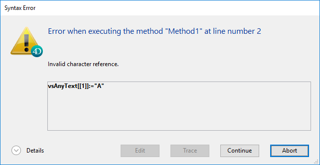
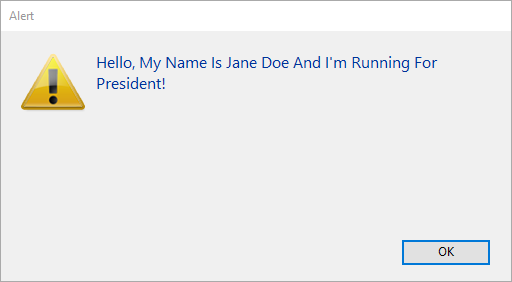

Cadena es un término genérico utilizado para:

- Los campos o variables de tipo texto: un campo, variable o expresión de tipo texto puede contener de 0 a 2 GB de texto.
- Campos alfanuméricos: un campo alfanumérico puede contener de 0 a 255 caracteres (límite fijado al definir el campo).

## Constantes literales de tipo cadena

Una constante literal de tipo cadena se encierra entre comillas dobles y rectas ("..."). Estos son algunos ejemplos:

```4d
"Añadir registros"
"No se han encontrado registros."
"Factura"
```

Una cadena vacía se especifica con dos comillas sin nada entre ellas ("").

### Secuencias de escape

Las siguientes secuencias de escape pueden utilizarse dentro de las cadenas:

| Secuencias de escape | Carácter reemplazado |
| -------------------- | -------------------- |
| \n                  | LF (Retorno línea)   |
| \t                  | HT (Tabulación)      |
| \r                  | CR (Retorno carro)   |
| \\\               | \ (Barra invertida) |
| \\"                | " (Comillas)         |

**Nota:** el carácter \ (barra invertida) se utiliza como separador en las rutas de acceso en Windows. Por lo tanto, debe utilizar una doble barra invertida \\\ en las rutas cuando quiera tener una barra invertida delante de un caracter utilizado en una de las secuencias de escape reconocidas por 4D (por ejemplo, "C:\\MisDocumentos\\\Nuevos.txt").

## Operadores de cadenas

| Operación              | Sintaxis         | Devuelve | Expression              | Valor    |
| ---------------------- | ---------------- | -------- | ----------------------- | -------- |
| Concatenación          | Cadena + Cadena  | String   | "abc" + "def"           | "abcdef" |
| Repetición             | Cadena * Número  | String   | "ab" * 3                | "ababab" |
| Igual                  | Cadena = Cadena  | Boolean  | "abc" = "abc"           | True     |
|                        |                  |          | "abc" = "abd"           | False    |
| Desigualdad            | Cadena # Cadena  | Boolean  | "abc" # "abd"           | True     |
|                        |                  |          | "abc" # "abc"           | False    |
| Mayor que              | Cadena > Cadena  | Boolean  | "abd" > "abc"           | True     |
|                        |                  |          | "abc" > "abc"           | False    |
| Menor que              | Cadena < Cadena  | Boolean  | "abc" < "abd"           | True     |
|                        |                  |          | "abc" < "abc"           | False    |
| Mayor o igual que      | Cadena >= Cadena | Boolean  | "abd" >= "abc"          | True     |
|                        |                  |          | "abc" >= "abd"          | False    |
| Menor o igual que      | Cadena <= Cadena | Boolean  | "abc" <= "abd"          | True     |
|                        |                  |          | "abd" <= "abc"          | False    |
| Contiene palabra clave | Cadena % Cadena  | Boolean  | "Alpha Bravo" % "Bravo" | True     |
|                        |                  |          | "Alpha Bravo" % "ravo"  | False    |
|                        | Imagen % Cadena  | Boolean  | Picture_expr % "Mer"    | True (*) |

(*) Si la palabra clave "Mer" está asociada a la imagen almacenada en la expresión imagen (campo o variable).

## Comparaciones de cadenas

- Las cadenas se comparan caracter por caracter (excepto en el caso de la búsqueda por [palabras clave](dt_string.md#keywords), ver más abajo).
- Cuando se comparan cadenas, se ignoran las mayúsculas y minúsculas de los caracteres; así, "a"="A" devuelve `TRUE`. Para saber si los caracteres están en mayúsculas o minúsculas, compare sus códigos de caracteres. Por ejemplo, la siguiente expresión devuelve `FALSE`:

```4d
Character code("A")=Character code("a") // porque 65 no es igual a 97
```

- Cuando se comparan las cadenas, se tienen en cuenta los caracteres diacríticos. Por ejemplo, las siguientes expresiones devuelven `TRUE`:

```4d
     "n"="ñ"
     "n"="Ñ"
     "A"="å"
      // etc
```

**Nota:** la comparación de cadenas tiene en cuenta las especificidades del lenguaje **definido para el archivo de datos 4D** (que no siempre es el mismo que el lenguaje definido para el sistema).

### Arroba (@)

El lenguaje 4D soporta **@** como carácter comodín. Este carácter se puede utilizar en cualquier comparación de cadenas para que coincida con cualquier número de caracteres. Por ejemplo, la siguiente expresión es `TRUE`:

```4d
"abcdefghij"="abc@"
```

El carácter comodín debe utilizarse dentro del segundo operando (la cadena de la derecha) para que coincida con cualquier número de caracteres. La siguiente expresión es `FALSE`, porque la @ se considera sólo como un carácter en el primer operando:

```4d
    "abc@"="abcdefghij"
```

El comodín significa "uno o más caracteres o nada". Las expresiones siguientes son `TRUE`:

```4d
     "abcdefghij"="abcdefghij@"
     "abcdefghij"="@abcdefghij"
     "abcdefghij"="abcd@efghij"
     "abcdefghij"="@abcdefghij@"
     "abcdefghij"="@abcde@fghij@"
```

Por otro lado, sea cual sea el caso, una comparación de cadenas con dos comodines consecutivos siempre devolverá `FALSE`. La siguiente expresión es `FALSE`:

```4d
"abcdefghij"="abc@@fg"
```

Cuando el operador de comparación es o contiene un símbolo < o >, sólo se soporta la comparación con un único comodín situado al final del operando:

```4d
     "abcd"<="abc@" // Comparación válida
     "abcd"<="abc@ef" //No es una comparación válida
```

Si desea ejecutar comparaciones o consultas utilizando @ como carácter (y no como comodín), debe utilizar la instrucción `Character code(At sign)`. Imagine, por ejemplo, que quiere saber si una cadena termina con el carácter @. La siguiente expresión (si $vsValue no está vacío) es siempre `TRUE`:

```4d
($vsValue[[Length($vsValue)]]="@")
```

La siguiente expresión se evaluará correctamente:

```4d
(Character code($vsValue[[Length($vsValue)]])#64)  
```

**Nota:** una opción 4D del modo Diseño permite definir cómo se interpreta el carácter @ cuando se incluye en una cadena de caracteres.

### Palabras claves

A diferencia de otras comparaciones de cadenas, la búsqueda por palabras clave busca "palabras" en los "textos": las palabras se consideran tanto individualmente como en su conjunto. El operador **%** siempre devuelve `False` si la consulta se refiere a varias palabras o sólo a una parte de ellas (por ejemplo, una sílaba). Las "palabras" son cadenas de caracteres rodeadas de "separadores", que son espacios y caracteres de puntuación y guiones. Un apóstrofe, como en "Today's", se considera normalmente como parte de la palabra, pero se ignorará en ciertos casos (ver las reglas más abajo). Los números se pueden buscar porque se evalúan como un todo (incluidos los símbolos decimales). Los demás símbolos (moneda, temperatura, etc.) serán ignorados.

```4d
     "Alpha Bravo Charlie"%"Bravo" // DevuelveTrue
     "Alpha Bravo Charlie"%"vo" // Devuelve False
     "Alpha Bravo Charlie"%"Alpha Bravo" // Devuelve False
     "Alpha,Bravo,Charlie"%"Alpha" // Devuelve True
     "Software and Computers"%"comput@" // Devuelve True
```
> **Notas:**
> 
> - 4D utiliza la librería ICU para comparar cadenas (utilizando los operadores `<>=#`) y detectar palabras claves. Para más información sobre las normas aplicadas, consulte la siguiente dirección: <http://www.unicode.org/reports/tr29/#Word_Boundaries>.
> - En la versión japonesa, en lugar de ICU, 4D utiliza por defecto Mecab para detectar las palabras claves.

## Símbolos de indice de cadena

Los símbolos de indice de cadena son: [[...]]

Estos símbolos se utilizan para referirse a un solo carácter dentro de una cadena. Esta sintaxis permite direccionar individualmente los caracteres en un campo o una variable de tipo Alfa o Texto.

Si los símbolos de referencia de caracteres aparecen a la izquierda del operador de asignación (:=), se asigna un carácter a la posición referenciada en la cadena. Por ejemplo, si vsName no es una cadena vacía, la siguiente línea pone el primer carácter de vsName en mayúsculas:

```4d
If(vsNom#"")
    vsNom[[1]]:=Uppercase(vsNom[[1]])
End if
```

En caso contrario, si los símbolos de referencia de caracteres aparecen dentro de una expresión, devuelven el caracter (al que se refieren) como una cadena de 1 caracter. Por ejemplo:

```4d
//El siguiente ejemplo comprueba si el último caracter de vtText es una arroba "@". If(vtText#"")
    If(Character code(Substring(vtText;Length(vtText);1))=At sign)
  //...
    End if
 End if

  //Using the character reference syntax, you would write in a simpler manner: If(vtText#"")
    If(Character code(vtText[[Length(vtText)]])=At sign)
  // ...
    End if
 End if
```

### Nota avanzada sobre la referencia de caracteres inválidos

Al utilizar los símbolos de indice de cadena, debe dirigirse a los caracteres existentes en la cadena de la misma manera que se dirige a los elementos existentes de un array. Por ejemplo, si se referencia el 20º carácter de una variable cadena, esta variable DEBE contener al menos 20 caracteres.

- No hacerlo, en modo interpretado, no causa un error de sintaxis.
- No hacerlo, en modo compilado (sin opciones), puede llevar a la corrupción de la memoria, si, por ejemplo, se escribe un caracter más allá del final de una cadena o un texto.
- Si no lo hace, en el modo compilado, se produce un error con la opción Range Checking On. Por ejemplo, ejecutando el siguiente código:

```
//Muy malo y desagradable, ¡Boo!
 //Muy malo y desagradable, ¡Boo!
 //Very bad and nasty thing to do, boo!
 vsAnyText:=""
 vsAnyText[[1]]:="A"
```

provocará el error de tiempo de ejecución que se muestra aquí:



### Ejemplo

El siguiente método proyecto pone en mayúsculas el primer carácter de cada palabra del texto recibido como parámetro y devuelve el texto resultante en mayúsculas:

```4d
  //Método proyecto Capitalize_text
  //Capitalize_text ( Texto ) -> Texto
  //Capitalize_text ( Texto fuente ) -> Texto en mayúsculas

 $0:=$1
 $vlLen:=Length($0)
 If($vlLen>0)
    $0[[1]]:=Uppercase($0[[1]])
    For($vlChar;1;$vlLen-1)
       If(Position($0[[$vlChar]];" !&()-{}:;<>?/,.=+*")>0)
          $0[[$vlChar+1]]:=Uppercase($0[[$vlChar+1]])
       End if
    End for
 End if
```

Por ejemplo, la línea:

```4d
ALERT(Capitalize_text("hola, me llamo jane doe y me presento a la presidencia"))
```

muestra la alerta que aparece aquí:


