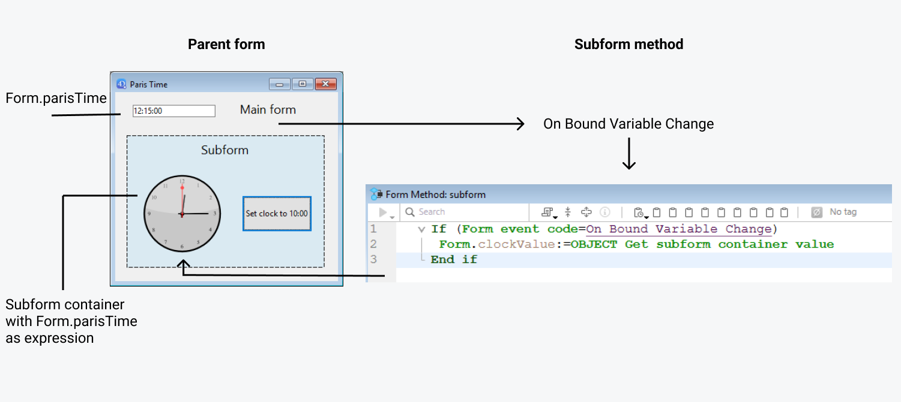

Un subformulario es un formulario incluido en otro formulario.


## Terminología

Con el fin de definir claramente los conceptos implementados con los subformularios, aquí hay algunas definiciones para ciertos términos utilizados:

*   **Subformulario**: un formulario destinado a ser incluido en otro formulario, llamado a su vez formulario padre.
*   **Formulario padre**: un formulario que contiene uno o más subformularios.
*   **Contenedor de subformulario**: un objeto incluido en el formulario padre, que muestra una instancia del subformulario.
*   **Instancia de subformulario**: la representación de un subformulario en un formulario padre. Este concepto es importante porque es posible mostrar varias instancias del mismo subformulario en un formulario padre.
*   **Formulario listado**: instancia de subformulario mostrada como una lista.
*   **Formulario detallado**: formulario de entrada tipo página asociado a un subformulario tipo lista al que se accede haciendo doble clic en la lista.


## Sub-formularios en lista

Un subformulario lista le permite introducir, ver y modificar datos en otras tablas. Normalmente se utilizan subformularios lista en bases de datos en las que se han establecido relaciones Uno a Muchos. Un subformulario lista en un formulario de una tabla Uno relacionada le permite ver, introducir y modificar datos en una tabla Muchos relacionada. Puede tener varios subformularios procedentes de diferentes tablas en el mismo formulario. Sin embargo, no es posible colocar dos subformularios que pertenecen a la misma tabla en la misma página de un formulario.

Por ejemplo, una base de datos del gestor de contactos puede utilizar un subformulario lista para mostrar todos los números de teléfono de un contacto. Aunque los números de teléfono aparecen en la pantalla Contactos, la información se almacena realmente en una tabla relacionada. Utilizando una relación de Uno a Muchos, este diseño de base de datos facilita el almacenamiento de un número ilimitado de números de teléfono por contacto. Con las relaciones automáticas, se puede soportar la entrada de datos directamente en la tabla Muchos relacionada sin programar.

Aunque los subformularios lista suelen estar asociados a muchas tablas, una instancia de subformulario puede mostrar los registros de cualquier otra tabla de la base de datos.

También puede permitir que el usuario introduzca datos en el formulario lista. Dependiendo de la configuración del subformulario, el usuario puede mostrar el formulario detallado haciendo doble clic en un subregistro o utilizando los comandos para añadir y editar subregistros.

> 4D ofrece tres acciones estándar para satisfacer las necesidades básicas de gestión de los subregistros: `Edit Subrecord`, `Delete Subrecord` y `Add Subrecord`. Cuando el formulario incluye varias instancias de subformulario, la acción se aplicará al subformulario que tenga el foco.


## Sub-formularios en página

Los subformularios en modo página pueden mostrar los datos del subregistro actual o todo valor pertinente en función del contexto (variables, imágenes, etc.). Una de las principales ventajas de utilizar subformularios página es que pueden incluir funcionalidades avanzadas y pueden interactuar directamente con el formulario padre (widgets). Los subformularios en página también tienen sus propiedades y eventos específicos; puede gestionarlos completamente por programación.

El subformulario en página utiliza el formulario de entrada indicado por la propiedad [Formulario detallado](properties_Subform.md#detail-form). A diferencia de un subformulario en modo lista, el formulario utilizado puede proceder de la misma tabla que el formulario padre. También es posible utilizar un formulario proyecto. Cuando se ejecuta, un subformulario en modo página tiene las mismas características de visualización estándar que un formulario de entrada.

> Los widgets 4D son objetos compuestos predefinidos basados en subformularios página. Se describen detalladamente en un manual aparte, [4D Widgets](https://doc.4d.com/4Dv19/4D/19/4D-Widgets.100-5462909.en.html).


### Using the bound variable or expression

You can bind [a variable or an expression](properties_Object.md#variable-or-expression) to a subform container object. This is very useful to synchronize values from the parent form and its subform(s).

By default, 4D creates a variable or expression of [object type](properties_Object.md#expression-type) for a subform container, which allows you to share values in the context of the subform using the `Form` command ([see below](#using-the-subform-bound-object)). However, you can use a variable or expression of any scalar type (time, integer, etc.) especially if you only need to share a single value:

- Define a bound variable or expression of a scalar type and call the `OBJECT Get subform container value` and `OBJECT SET SUBFORM CONTAINER VALUE` commands to exchange values when [On Bound Variable Change](../Events/onBoundVariableChange.md) or [On Data Change](../Events/onDataChange.md) form events occur. Esta solución se recomienda para sincronizar un solo valor.
- Define a bound variable or expression of the **object** type and use the `Form` command to access its properties from the subform. Esta solución se recomienda para sincronizar varios valores.


### Sincronizando formulario padre y subformulario (valor único)

Binding the same variable or expression to your subform container and other objects of the parent form lets you link the parent form and subform contexts to put the finishing touches on sophisticated interfaces. Imagine a subform representing a clock, inserted into a parent form containing an enterable variable of the Time type:


In the parent form, both objects (time variable and subform container) ***have the same value as ***Variable or Expression******. It can be a variable (e.g. `parisTime`), or an expression (e.g. `Form.parisTime`).

In the subform, the clock object is managed through the `Form.clockValue` property.


#### Actualizando el contenido de un subformulario

Case 1: The value of the parent form variable or expression is modified and this modification must be passed on to a subform.

`Form.parisTime` changes to 12:15:00 in the parent form, either because the user entered it, or because it was updated dynamically (via the `Current time` command for example). This triggers the [On Bound Variable Change](../Events/onBoundVariableChange.md) event in the subform's Form method.

Se ejecuta el siguiente código:

```4d  
// Subform form method
If (Form event code=On Bound Variable Change) //bound variable or expression was modified in the parent form
    Form.clockValue:=OBJECT Get subform container value //synchonize the local value
End if
```

Actualiza el valor de `Form.clockValue` en el subformulario:



Se genera el evento formulario [On Bound Variable Change](../Events/onBoundVariableChange.md):

- as soon as a value is assigned to the variable/expression of the parent form, even if the same value is reassigned
- si el subformulario pertenece a la página formulario actual o a la página 0.

Note that, as in the above example, it is preferable to use the `OBJECT Get subform container value` command which returns the value of the expression in the subform container rather than the expression itself because it is possible to insert several subforms in the same parent form (for example, a window displaying different time zones contains several clocks).

Modifying the bound variable or expression triggers form events which let you synchronize the parent form and subform values:

- Use the [On Bound Variable Change](../Events/onBoundVariableChange.md) form event to indicate to the subform (form method of subform) that the variable or expression was modified in the parent form.
- Use the [On Data Change](../Events/onDataChange.md) form event to indicate to the subform container that the variable or expression value was modified in the subform.


#### Actualizar el contenido de un formulario padre

Caso 2: se modifica el contenido del subformulario y esta modificación debe pasar al formulario padre.

Inside the subform, the button changes the value of the `Form.clockValue` expression of type Time attached to the clock object. This triggers the [On Data Change](../Events/onDataChange.md) form event inside the clock object (this event must be selected for the object), which updates the `Form.parisTime` value in the main form.

Se ejecuta el siguiente código:

```4d  
// subform clock object method
If (Form event code=On Data Change) //whatever the way the value is changed
    OBJECT SET SUBFORM CONTAINER VALUE(Form.clockValue) //Push the value to the container
End if
```


Everytime the value of `Form.clockValue` changes in the subform, `Form.parisTime` in the subform container is also updated.


> If the variable or expression value is set at several locations, 4D uses the value that was loaded last. It applies the following loading order: 1-Object methods of subform, 2-Form method of subform, 3-Object methods of parent form, 4-Form method of parent form


### Sincronizando formulario padre y subformulario (múltiples valores)

By default, 4D binds a variable or expression of [object type](properties_Object.md#expression-type) to each subform. The contents of this object can be read and/or modified from within the parent form and from the subform, allowing you to share multiple values in a local context.

When bound a the subform container, this object is returned by the `Form` command directly in the subform. Since objects are always passed by reference, if the user modifies a property value in the subform, it will automatically be saved in the object itself and thus, available to the parent form. On the other hand, if a property of the object is modified by the user in the parent form or by programming, it will be automatically updated in the subform. No es necesaria ninguna gestión de eventos.

For example, in a subform, inputs are bound to the `Form` object properties (of the subform form):


En el formulario padre, se muestra el subfomulario dos veces. Each subform container is bound to an expression which is a property of the `Form` object (of the parent form):


The button only creates `mother` and `father` properties in the parent's `Form` object:

```4d
//Add values button object method
Form.mother:=New object("lastname"; "Hotel"; "firstname"; "Anne")
Form.father:=New object("lastname"; "Golf"; "firstname"; "Félix")
```

When you execute the form and click on the button, you see that all values are correctly displayed:


If you modify a value either in the parent form or in the subform, it is automatically updated in the other form because the same object is used:

 

### Uso de punteros (compatibilidad)

In versions prior to 4D v19 R5, synchronization between parent forms and subforms was handled through **pointers**. Por ejemplo, para actualizar un objeto subformulario, podría llamar al siguiente código:

```4d  
// Subform form method
If (Form event code=On Bound Variable Change) 
    ptr:=OBJECT Get pointer(Object subform container) 
    clockValue:=ptr-> 
End if
```

**This principle is still supported for compatibility but is now deprecated since it does not allow binding expressions to subforms.** It should no longer be used in your developments. In any cases, we recommend to use the [`Form` command](#synchronizing-parent-form-and-subform-multiple-values) or the [`OBJECT Get subform container value` and `OBJECT SET SUBFORM CONTAINER VALUE` commands](#synchronizing-parent-form-and-subform-single-value) to synchronize form and subform values.


### Programación entre formularios avanzada

Communication between the parent form and the instances of the subform may require going beyond the exchange of a values through the bound variable. De hecho, es posible que desee actualizar las variables de los subformularios en función de las acciones realizadas en el formulario principal y viceversa. Si utilizamos el ejemplo anterior del subformulario de tipo "reloj dinámico", es posible que queramos definir una o varias horas de alarma para cada reloj.

4D ha implementado los siguientes mecanismos para satisfacer estas necesidades:

- Llamada de un objeto contenedor desde el subformulario utilizando el comando `CALL SUBFORM CONTAINER`
- Ejecución de un método en el contexto del subformulario mediante el comando `EXECUTE METHOD IN SUBFORM`

> El comando `GOTO OBJECT` busca el objeto de destino en el formulario padre aunque se ejecute desde un subformulario.


#### Comando CALL SUBFORM CONTAINER

The `CALL SUBFORM CONTAINER` command lets a subform instance send an [event](../Events/overview.md) to the subform container object, which can then process it in the context of the parent form. El evento se recibe en el método del objeto contenedor. Puede estar en el origen de todo evento detectado por el subformulario (clic, arrastrar y soltar, etc.).

El código del evento no tiene restricciones (por ejemplo, 20000 o -100). Puede utilizar un código que corresponda a un evento existente (por ejemplo, 3 para `On Validate`), o utilizar un código personalizado. En el primer caso, sólo puede utilizar los eventos que haya marcado en la lista de propiedades para los contenedores de subformulario. En el segundo caso, el código no debe corresponder a ningún evento de formulario existente. Se recomienda utilizar un valor negativo para asegurarse de que este código no será utilizado por 4D en futuras versiones.

Para más información, consulte la descripción del comando `CALL SUBFORM CONTAINER`.

#### Comando EXECUTE METHOD IN SUBFORM

El comando `EXECUTE METHOD IN SUBFORM` permite que un formulario o uno de sus objetos solicite la ejecución de un método en el contexto de la instancia del subformulario, lo que le da acceso a las variables, objetos, etc. del subformulario. Este método también puede recibir parámetros.

Este mecanismo se ilustra en el siguiente diagrama:


Para más información, consulte la descripción del comando `EXECUTE METHOD IN SUBFORM`.


## Propiedades soportadas

[Border Line Style](properties_BackgroundAndBorder.md#border-line-style) - [Bottom](properties_CoordinatesAndSizing.md#bottom) - [Class](properties_Object.md#css-class) - [Detail Form](properties_Subform.md#detail-form) - [Double click on empty row](properties_Subform.md#double-click-on-empty-row) - [Double click on row](properties_Subform.md#double-click-on-row) - [Enterable in list](properties_Subform.md#enterable-in-list) - [Expression Type](properties_Object.md#expression-type) - [Focusable](properties_Entry.md#focusable) - [Height](properties_CoordinatesAndSizing.md#height) - [Hide focus rectangle](properties_Appearance.md#hide-focus-rectangle) - [Horizontal Scroll Bar](properties_Appearance.md#horizontal-scroll-bar) - [Horizontal Sizing](properties_ResizingOptions.md#horizontal-sizing) - [Left](properties_CoordinatesAndSizing.md#left) - [List Form](properties_Subform.md#list-form) - [Method](properties_Action.md#method) - [Object Name](properties_Object.md#object-name) - [Print Frame](properties_Print.md#print-frame) - [Right](properties_CoordinatesAndSizing.md#right) - [Selection mode](properties_Subform.md#selection-mode) - [Source](properties_Subform.md#source) - [Top](properties_CoordinatesAndSizing.md#top) - [Type](properties_Object.md#type) - [Variable or Expression](properties_Object.md#variable-or-expression) - [Vertical Scroll Bar](properties_Appearance.md#vertical-scroll-bar) - [Vertical Sizing](properties_ResizingOptions.md#vertical-sizing) - [Visibility](properties_Display.md#visibility) - [Width](properties_CoordinatesAndSizing.md#width) 
