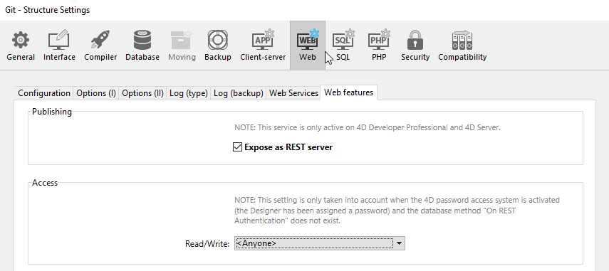
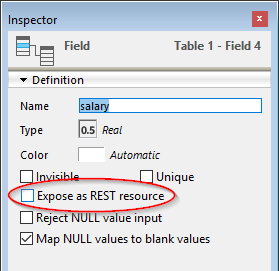

Utilizando peticiones HTTP estándar, el servidor 4D REST permite a las aplicaciones externas acceder directamente a los datos de su aplicación, *es decir,* recuperar información sobre las clases de datos de su proyecto, manipular datos, entrar en su aplicación web, y mucho más.

Para comenzar a utilizar las funcionalidades REST, es necesario iniciar y configurar el servidor 4D REST.

> - En 4D Server, para abrir una sesión REST es necesario disponer de una licencia cliente 4D gratuita.<br/>
> - En 4D monopuesto, puede abrir hasta tres sesiones REST para realizar pruebas.
> - Debe gestionar la [sesión](authUsers.md) para su aplicación solicitante.


## Iniciar el servidor REST

Por razones de seguridad, por defecto, 4D no responde a las peticiones REST. Si desea iniciar el servidor REST, debe marcar la opción **Exponer como servidor REST** en la página **Web** > **Web Features** de la configuración de la estructura para que se procesen las peticiones REST.



> Los servicios REST utilizan el servidor HTTP 4D, por lo que debe asegurarse de que el servidor web 4D está iniciado.

El mensaje de advertencia "Atención, verifique los privilegios de acceso" aparece cuando se marca esta opción para llamar la atención sobre el hecho de que cuando se activan los servicios REST, por defecto el acceso a los objetos de la base de datos es gratuito mientras no se hayan configurado los accesos REST.

> Debe reiniciar la aplicación 4D para que los cambios surtan efecto.


## Configuración del acceso REST

Por defecto, los accesos REST están abiertos a todos los usuarios, lo que obviamente no es recomendable por razones de seguridad, y también para controlar el uso de las licencias de los clientes.

Puede configurar los accesos REST de una de las siguientes maneras:
- asignar un grupo de usuarios **en lectura/escritura** a los servicios REST en la página "**Web** > **Web Features**" de los parámetros de estructura;
- escribiendo un método base `On REST Authentication` para interceptar y manejar cada petición REST inicial.

> No se pueden utilizar ambas funciones simultáneamente. Una vez que se ha definido un método base `On REST Authentication`, 4D delega totalmente el control de las peticiones REST en él: se ignora cualquier ajuste realizado mediante el menú " Lectura/Escritura" de la página de **Web**>**Funcionalidades Web** de los parámetros de la estructura.


### Uso de los parámetros de la Estructura

El menú **Lectura/Escritura** de la página "**Web** > **Web Features**" de los parámetros de la estructura indica un grupo de usuarios 4D que está autorizado a establecer el enlace con la aplicación 4D utilizando las peticiones REST.

Por defecto, el menú muestra `\&#060;Anyone&#062;`, lo que significa que los accesos REST están abiertos a todos los usuarios. Una vez que haya especificado un grupo, sólo una cuenta de usuario de 4D que pertenezca a este grupo podrá ser utilizada para [acceder a 4D mediante una petición REST](authUsers.md). Si se utiliza una cuenta que no pertenece a este grupo, 4D devuelve un error de autenticación al remitente de la petición.

> Para que esta configuración tenga efecto, el método base`On REST Authentication` no debe estar definido. Si existe, 4D ignora los parámetros de acceso definidos en las propiedades de la estructura.

### Método base On REST Authentication
El método base `On REST Authentication` le ofrece una forma personalizada de controlar la apertura de sesiones REST en 4D. Este método base se llama automáticamente cuando se abre una nueva sesión a través de una solicitud REST. Cuando se recibe una [solicitud para abrir una sesión REST](authUsers.md), los identificadores de conexión se ofrecen en el encabezado de la solicitud. Se llama al método base `On REST Authentication` para poder evaluar estos identificadores. Puede utilizar la lista de usuarios de la aplicación 4D o puede utilizar su propia tabla de identificadores. Para obtener más información, consulte la [documentación](https://doc.4d.com/4Dv18/4D/18/On-REST-Authentication-database-method.301-4505004.en.html) del método base`On REST Authentication`.


## Exponer tablas y campos

Una vez activados los servicios REST en la aplicación 4D, por defecto una sesión REST puede acceder a todas las tablas y campos de la base de datos 4D a través de la [interfaz del datastore](ORDA/dsMapping.md#datastore). Así, puede utilizar sus datos. Por ejemplo, si su base de datos contiene una tabla [Employee], es posible escribir:

```
http://127.0.0.1:8044/rest/Employee/?$filter="salary>10000"

```
Esta petición devolverá todos los empleados cuyo campo de salario sea superior a 10000.

> Las tablas y/o campos 4D que tienen el atributo "Invisible" también se exponen en REST por defecto.

Si desea personalizar los objetos del datastore accesibles a través de REST, debe desactivar la exposición de cada tabla y/o campo que desee ocultar. Cuando una petición REST intenta acceder a un recurso no autorizado, 4D devuelve un error.

### Exponer las tablas

Por defecto, todas las tablas se exponen en REST.

Por razones de seguridad, es posible que desee exponer sólo ciertas tablas de su almacén de datos a las llamadas REST. Por ejemplo, si ha creado una tabla [Users] que almacena los nombres de usuario y las contraseñas, sería mejor no exponerla.

Para eliminar la exposición REST de una tabla:

1. Visualice el inspector de tablas en el editor de estructuras y seleccione la tabla que desea modificar.

2. Uncheck the **Expose as REST resource** option:  Do this for each table whose exposure needs to be modified.


### Exponer los campos

Por defecto, todos los campos de una base 4D se exponen en REST.

Es posible que no quiera exponer ciertos campos de sus tablas a REST. Por ejemplo, es posible que no quiera exponer el campo [Employees]Salary.

Para eliminar la exposición REST de un campo:

1. Visualice el inspector de campo en el editor de estructuras y seleccione el campo a modificar.

2. Desmarque la opción **Exponer como recurso REST** para el campo.  Repeat this for each field whose exposure needs to be modified.

> Para que un campo sea accesible a través de REST, la tabla padre también debe serlo. Si la tabla padre no está expuesta, ninguno de sus campos lo estará, independientemente de su estado.
