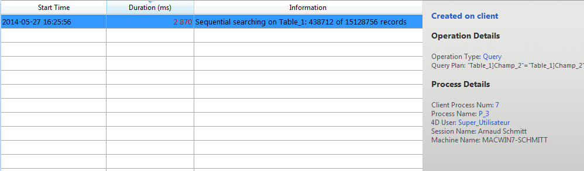

La página Monitor en tiempo real supervisa el progreso de las operaciones "largas" realizadas por la aplicación en tiempo real. These operations are, for example, sequential queries, execution of formulas, etc.

> Esta página está disponible en la ventana de administración de la máquina servidor y también desde una máquina 4D remota. En el caso de un equipo remoto, esta página muestra los datos de las operaciones realizadas en el equipo servidor.

Se añade una línea para cada operación larga realizada en los datos. This line automatically disappears when the operation is complete (you can check the **Display operations at least 5 seconds** option to keep quick operations on screen for 5 seconds, see below).

La siguiente información se ofrece para cada línea:

- **Start Time**: starting time of operation in the format: "dd/mm/yyyy - hh:mm:ss"
- **Duration** (ms): duration in milliseconds of operation in progress
- **Información**: título de la operación.
- **Details**: this area displays detailed information which will vary according to the type of operation selected. En particular:
    + **Created on**: indidates whether the operation results from a client action (Created on client) or if it was started explicitly on the server by means of a stored procedure or the "Execute on server" option (Created on server).
    + **Operation Details**: Operation type and (for query operations) query plan.
    + **Sub-operations** (if any): Dependent operations of the selected operation (e.g. deleting related records before a parent record).
    + **Process Details**: Additional information concerning the table, field, process or client, depending on the type of operation

> Real-time monitoring page uses the [`GET ACTIVITY SNAPSHOT`](https://doc.4d.com/4dv19/help/command/en/page1277.html) command internally. Puede encontrar más información en la descripción de este comando.

La página está activa y se actualiza permanentemente en cuanto se muestra. It should be noted that its operation can significantly slow the execution of the application. It is possible to suspend the updating of this page in one of the following ways:

- haciendo clic en el botón **Pausa**,
- haciendo clic en la lista,
- presionando la barra espaciadora.

When you pause the page, a "PAUSED" message appears and the button label changes to **Resume**. You can resume monitoring of the operations by performing the same action as for pausing.

## Modo avanzado

The RTM page can display additional information, if necessary, for each listed operation.

To access the advanced mode for an operation, press **Shift** and select the desired operation. All available information is then displayed in the "Process Details" area without any filtering (as returned by the `GET ACTIVITY SNAPSHOT` command). La información disponible depende de la operación seleccionada.

Este es un ejemplo de la información que se muestra en el modo estándar:

En el modo avanzado (**Mayús+Clic** en la operación), se muestra información adicional:

## Botón Instantánea

El botón **Instantánea** permite copiar en el portapapeles todas las operaciones que se muestran en el panel RTM, así como sus detalles relacionados (información de procesos y suboperaciones):

## Mostrar operaciones al menos 5 segundos

If you check the **Display operations at least 5 seconds** option, any listed operation will be displayed on the page for at least five seconds, even after its execution is finished. Las operaciones retenidas aparecen atenuadas en la lista de operaciones. Esta función es útil para obtener información sobre las operaciones que se ejecutan muy rápidamente.
