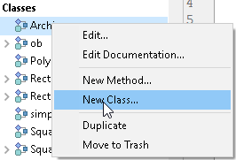

## Generalidades

El lenguaje 4D soporta el concepto de **clases**. En un lenguaje de programación, el uso de una clase permite definir el comportamiento de un objeto con propiedades y funciones asociadas.

Cada objeto es una instancia de su clase. Una vez definida una clase usuario, puede **instanciar** los objetos de esta clase en cualquier parte de su código. Una clase puede extenderse a otra clase con la palabra clave [`extender`](#class-extends-classname), y entonces hereda sus [funciones](#function).

> El modelo de clases en 4D es similar al de las clases en JavaScript, y se basa en una cadena de prototipos.

Por ejemplo, puede crear una clase `Person` con la siguiente definición:

```4d  
//Class: Person.4dm
Class constructor($firstname : Text; $lastname : Text)
 This.firstName:=$firstname
 This.lastName:=$lastname

Function sayHello()->$welcome : Text
 $welcome:="Hello "+This.firstName+" "+This.lastName
```

En un método, creando una "Persona":

```
var $person : cs.Person //object of Person class  
var $hello : Text
$person:=cs.Person.new("John";"Doe")
// $person:{firstName: "John"; lastName: "Doe" }
$hello:=$person.sayHello() //"Hello John Doe"
```

## Gestión de clases

### Definición de una clase

Una clase usuario en 4D está definida por un archivo de método específico (.4dm), almacenado en la carpeta `/Project/Sources/Classes/`. El nombre del archivo es el nombre de la clase.

Al nombrar las clases, debe tener en cuenta las siguientes reglas:

- Un [nombre de clase](identifiers.md#classes) debe cumplir con [reglas de denominación de las propiedades](identifiers.md#object-properties).
- .
- No se recomienda dar el mismo nombre a una clase y a una tabla de la base, para evitar conflictos.

Por ejemplo, si quiere definir una clase llamada "Polygon", tiene que crear el siguiente archivo:

- Carpeta Project
  - Project
    - Sources
      - Clases
        - Polygon.4dm

### Borrar una clase

Para eliminar una clase existente, puede:

- en su disco, elimine el archivo de clase .4dm de la carpeta "Classes",
- en el Explorador 4D, seleccionar la clase y hacer clic en  o elegir **Mover a la papelera** en el menú contextual.

### Utilizar la interfaz 4D

Los archivos de clase se almacenan automáticamente en la ubicación adecuada cuando se crean a través de la interfaz de 4D, ya sea a través del menú **Archivo** o del Explorador.

#### Menú Archivo y barra de herramientas

Puede crear un nuevo archivo de clase para el proyecto seleccionando **Nueva > Clase...** en el menú **Archivo** de 4D Developer o en la barra de herramientas.

También puede utilizar el atajo **Ctrl+Mayús+Alt+k**.

#### Explorador

En la página **Métodos** del Explorador, las clases se agrupan en la categoría **Clases**.

Para crear una nueva clase, puede:

- seleccione la categoría **Clases** y haga clic en el botón .
- seleccione **Nueva clase...** en el menú de acciones de la parte inferior de la ventana del Explorador, o en el menú contextual del grupo Clases. 
- seleccione **Nueva > Clase...** en el menú contextual de la página de inicio del Explorador.

#### Soporte del código de clase

En las diferentes ventanas 4D (editor de código, compilador, depurador, explorador de ejecución), el código de la clase se maneja básicamente como un método proyecto con algunas especificidades:

- En el editor de código:
  - una clase no puede ser ejecutada
  - una función de clase es un bloque de código
  - **Ir a la definición** en un objeto miembro busca las declaraciones de función de clase; por ejemplo, "$o.f()" encontrará "Function f".
  - **Buscar referencias** en la declaración de función de clase busca la función utilizada como miembro de objeto; por ejemplo, "Function f" encontrará "$o.f()".
- En el explorador de ejecución y en el depurador, las funciones clase se muestran con el constructor `\&#060;ClassName&#062;` o formato `\&#060;ClassName&#062;.\&#060;FunctionName&#062;`.

## Class stores

Las clases disponibles son accesibles desde sus class stores. Hay dos class stores disponibles:

- `cs` para el class store usuario
- `4D` para el class store integrado

### cs

#### cs -> classStore

| Parámetros | Tipo   |    | Descripción                                       |
| ---------- | ------ | -- | ------------------------------------------------- |
| classStore | object | <- | Class store usuario para el proyecto o componente |

El comando `cs` devuelve la class store usuario para el proyecto o componente actual. Devuelve todas las clases de usuario [definidas](#class-definition) en el proyecto o componente abierto. Por defecto, sólo las [clases ORDA](ORDA/ordaClasses.md) están disponibles.

#### Ejemplo

Quiere crear una nueva instancia de un objeto de `myClass`:

```4d
$instance:=cs.myClass.new()
```

### 4D

#### 4D -> classStore

| Parámetros | Tipo   |    | Descripción    |
| ---------- | ------ | -- | -------------- |
| classStore | object | <- | Class store 4D |

El comando `4D` devuelve la class store 4D integrada disponible. Ofrece acceso a las APIs específicas como [CryptoKey](API/CryptoKeyClass.md).

#### Ejemplo

Quiere crear una nueva llave en la clase `CryptoKey`:

```4d
$key:=4D.CryptoKey.new(New object("type";"ECDSA";"curve";"prime256v1"))
```

## El objeto clase

Cuando una clase es [definida](#class-definition) en el proyecto, se carga en el entorno del lenguaje 4D. Una clase es un objeto de la [clase "Class"](API/ClassClass.md). Un objeto clase tiene las siguientes propiedades y funciones:

- cadena [`name`](API/ClassClass.md#name)
- objeto [`superclass`](API/ClassClass.md#superclass) (null si ninguno)
- función [`new()`](API/ClassClass.md#new), que permite instanciar objetos de clase.

Además, un objeto clase puede hacer referencia a un objeto [`constructor`](#class-constructor) (opcional).

Un objeto de clase es un [objeto compartido](shared.md) y, por tanto, se puede acceder a él desde diferentes procesos de 4D simultáneamente.

### Herencia

Si una clase hereda de otra clase (es decir, se utiliza la palabra clave [Class extends](classes.md#class-extends-classname) en su definición), la clase padre es su [`superclass`](API/ClassClass.md#superclass).

Cuando 4D no encuentra una función o una propiedad en una clase, la busca en su [`superclass`](API/ClassClass.md#superclass); si no la encuentra, 4D sigue buscando en la superclase de la superclase, y así sucesivamente hasta que no haya más superclase (todos los objetos heredan de la superclase "Object").

## Palabras clave de clase

En las definiciones de clase se pueden utilizar palabras claves específicas de 4D:

- `Function <Name>` para definir las funciones de clase de los objetos.
- `Class constructor` para definir las propiedades de los objetos.
- `Class extends <ClassName>` para definir la herencia.

### Function

#### Sintaxis

```4d
Function <name>({$parameterName : type; ...}){->$parameterName : type}
// code
```

:::note

There is no ending keyword for function code. There is no ending keyword for function code.

:::


Las funciones de clase son propiedades específicas de la clase. Son objetos de la clase [4D.Function](API/FunctionClass.md#about-4dfunction-objects).

En el archivo de definición de clase, las declaraciones de función utilizan la palabra clave `Function`, y el nombre de la función. El nombre de la función debe cumplir con las [reglas de nomenclatura de las propiedades](Concepts/identifiers.md#object-properties).

> **Consejo:** comenzar el nombre de la función con un carácter de subrayado ("_") excluirá la función de las funcionalidades de autocompletado en el editor de código 4D. Por ejemplo, si declara `Function _myPrivateFunction` en `MyClass`, no se propondrá en el editor de código cuando digite en `"cs.MyClass. "`.

Inmediatamente después del nombre de la función, los [parámetros](#parameters) de la función se pueden declarar con un nombre y un tipo de datos asignados, incluido el parámetro de retorno (opcional). Por ejemplo:

```4d
Function computeArea($width : Integer; $height : Integer)->$area : Integer
```

En una función de clase, el comando `This` se utiliza como instancia del objeto. Por ejemplo:

```4d  
Function setFullname($firstname : Text; $lastname : Text)
 This.firstName:=$firstname
 This.lastName:=$lastname

Function getFullname()->$fullname : Text
 $fullname:=This.firstName+" "+Uppercase(This.lastName)
```

Para una función clase, el comando `Current method name` devuelve: `<ClassName>.<FunctionName>`, por ejemplo "MyClass.myMethod".

En el código de la aplicación, las funciones de clases se llaman como los métodos miembros de las instancias de objetos y pueden recibir [parámetros](#class-function-parameters) si los hay. Se soportan las siguientes sintaxis:

- utilización del operador `()`. Por ejemplo, `myObject.methodName("hello")`
- utilización de un método miembro de la clase "4D.Function":
  - [`apply()`](API/FunctionClass.md#apply)
  - [`call()`](API/FunctionClass.md#call)

> **Advertencia hilo seguro:** si una función clase no es hilo seguro y es llamada por un método con el atributo "Puede ser ejecutado en proceso apropiativo":
> 
> - el compilador no genera ningún error (lo que es diferente en comparación con los métodos regulares),
> - un error es lanzado por 4D sólo en tiempo de ejecución.

#### Parámetros

Los parámetros de las funciones se declaran utilizando el nombre del parámetro y su tipo, separados por dos puntos. El nombre del parámetro debe cumplir con las [reglas de nomenclatura de las propiedades](Concepts/identifiers.md#object-properties). Múltiples parámetros (y tipos) están separados por punto y coma (;).

```4d  
Function add($x; $y : Variant; $z : Integer; $xy : Object)
```
> Si no se declaró el tipo, el parámetro se definirá como `Variant`.

Declare el parámetro de retorno de una función (opcional) añadiendo una flecha (`->`) y la definición del parámetro después de la lista de parámetros de entrada. Por ejemplo:

```4d
Function add($x : Variant; $y : Integer)->$result : Integer
```

También puede declarar el parámetro de retorno sólo añadiendo `: tipo`, en cuyo caso estará disponible automáticamente a través de $0. Por ejemplo:

```4d
Function add($x : Variant; $y : Integer): Integer
 $0:=$x+$y
```

La [sintaxis 4D clásica](parameters.md#sequential-parameters) para los parámetros de métodos puede utilizarse para declarar los parámetros de las funciones de clases. Ambas sintaxis pueden mezclarse. Por ejemplo:

```4d
Function add($x : Integer)
 var $2; $value : Integer
 var $0 : Text
 $value:=$x+$2
 $0:=String($value)
```

#### Ejemplo

```4d
// Class: Rectangle
Class constructor($width : Integer; $height : Integer)
 This.name:="Rectangle"
 This.height:=$height
 This.width:=$width

// Function definition
Function getArea()->$result : Integer
 $result:=(This.height)*(This.width)
```

```4d
// En un método proyecto

var $rect : cs.Rectangle
var $area : Real

$rect:=cs.Rectangle.new(50;100)  
$area:=$rect.getArea() //5000
```

### Class constructor

#### Sintaxis

```4d
// Class: MyClass
Class Constructor({$parameterName : type; ...})
// code
// code
// Class:
// Class:
// Class:
```

:::note

There is no ending keyword for class constructor function code. There is no ending keyword for function code.

:::


Una función class constructor, que puede aceptar los [parámetros](#parameters), puede ser utilizada para definir una clase usuario.

En ese caso, cuando se llama a la función [`new()`](API/ClassClass.md#new), el class constructor es llamado con los parámetros opcionalmente pasados a la función `new()`.

Para una función class constructor, el comando `Current method name` devuelve:  `<ClassName>:constructor`, por ejemplo "MyClass:constructor".

#### Ejemplo

```4d
// Class: MyClass
// Class constructor of MyClass
Class Constructor ($name : Text)
 This.name:=$name
```

```4d
// En un método proyecto
// Se puede instanciar un objeto
var $o : cs.MyClass
$o:=cs.MyClass.new("HelloWorld")  
// $o = {"name":"HelloWorld"}
```

### Class extends `\<ClassName>`

#### Sintaxis

```4d
// Class hijo
Class extends <ParentClass>
```

La palabra clave `Class extends` se utiliza en la declaración de clase para crear una clase usuario que es hijo de otra clase usuario. La clase hijo hereda todas las funciones de la clase padre.

La extensión de clase debe respetar las siguientes reglas:

- Una clase de usuario no puede extender una clase integrada (excepto las 4D.Object y [clases ORDA](../ORDA/ordaClasses.md) que se extienden por defecto para las clases de usuario).
- Una clase usuario no puede extender una clase usuario de otro proyecto o componente.
- Una clase usuario no puede extenderse a sí misma.
- No es posible extender las clases de una manera circular (es decir, "a" extiende "b" que extiende "a").

La ruptura de tal regla no es detectada por el editor de código o el intérprete, solo el compilador y `comprobar sintaxis` arrojará un error en este caso.

Una clase extendida puede llamar al constructor de su clase padre utilizando el comando [`Super`](#super).

#### Ejemplo

Este ejemplo crea una clase llamada `Square` de una clase llamada `Polygon`.

```4d
//Class: Square

//path: Clases/Square. dm 

Class extends Polygon


Class constructor ($side : Integer)

 // Llama al constructor de la clase padre con las longitudes
 // proporcionadas para el ancho y alto del polígono
 Super($side;$side)
 // En las clases derivadas, Super debe ser llamado antes de 
 // utilizar 'This'
 This.name:="Square"

 Function getArea()
  C_LONGINT($0)
  $0:=This.height*This.width
```

### Super

#### Sintaxis

```4d
Super {( param{;...;paramN} )} {-> Object} 
```

| Parámetros | Tipo   |    | Descripción                                           |
| ---------- | ------ | -- | ----------------------------------------------------- |
| param      | mixto  | -> | Parámetro(s) a pasar al constructor de la clase padre |
| Result     | object | <- | Padre del objeto                                      |

La palabra clave `Super` permite llamadas a la `superclass`, es decir, a la clase padre.

`Super` tiene dos propósitos diferentes:

1. Dentro de un código [constructor](#class-constructor), `Super` es un comando que permite llamar al constructor de la superclase. Cuando se utiliza en un constructor, el comando `Super` aparece solo y debe ser usado antes de usar la palabra clave `This`.

- Si todos los class constructors en el árbol de herencia no son llamados correctamente, se genera el error -10748. Es responsabilidad del desarrollador 4D asegurarse de que las llamadas sean válidas.
- Si el comando `This` es llamado en un objeto cuyas superclases no han sido construidas, se genera el error -10743.
- Si se llama a `Super` fuera de un contexto de objeto, o en un objeto cuyo constructor de superclase ya ha sido llamado, se genera el error -10746.

```4d
// dentro del constructor myClass
var $text1; $text2 : Texto
Super($text1) //llamada del constructor de la superclase con un parámetro texto
Este. aram:=$text2 // usar un segundo parámetro
```

2. Dentro de una [función de clase](#class-function), `Super` designa el prototipo de la superclase y permite llamar a una función de la jerarquía de superclases.

```4d
Super.doSomething(42) //llama a la función "doSomething"  
//declarada en superclases
```

#### Ejemplo 1

Este ejemplo ilustra el uso de `Super` en un class constructor. El comando es llamado para evitar duplicar las partes del constructor que son comunes entre las clases `Rectangle` y `Square`.

```4d
//Class: Square

Class extends Rectangle

Class constructor ($side : Integer)

 // Llama al class constructor de la clase padre con longitudes
 // proporcionadas para el ancho y alto del rectángulo
 Super($side;$side)
 // En las clases derivadas, Super debe ser llamado antes de que 
 // pueda utilizar 'This'
 This.

ame:="Square"

Function getArea()
 C_LONGINT($0)
 $0:=This.height*This.width
```

```4d
//Class: Square

Class extends Rectangle

Class constructor ($side : Integer)

 // Llama al class constructor de la clase padre con longitudes
 // proporcionadas para el ancho y alto del rectángulo
 Super($side;$side)
 // En las clases derivadas, Super debe ser llamado antes de que 
 // pueda utilizar 'This'
 This. ame:="Square"

Function getArea()
 C_LONGINT($0)
 $0:=This.height*This.width
```

#### Ejemplo 2

Este ejemplo ilustra el uso de `Super` en un método miembro clase. Ha creado la clase `Rectangle` con una función:

```4d
//Class: Rectangle

Function nbSides()
 var $0 : Text
 $0:="I have 4 sides"
```

También creó la clase `Square` con una función que llama a la función superclase:

```4d
//Class: Square

Class extends Rectangle

Function description()
 var $0 : Text
 $0:=Super.nbSides()+" which are all equal"
```

Entonces puede escribir en un método proyecto:

```4d
var $square : Objeto
var $message : Texto
$square:=cs.Square.new()
$message:=$square.description() //tengo 4 lados iguales
```

### This

#### Sintaxis

```4d
This -> Object
```

| Parámetros | Tipo   |    | Descripción   |
| ---------- | ------ | -- | ------------- |
| Result     | object | <- | Objeto actual |

La palabra clave `This` devuelve una referencia al objeto procesado actualmente. En 4D, se puede utilizar en [contextos diferentes](https://doc.4d.com/4Dv18/4D/18/This.301-4504875.en.html).

En la mayoría de los casos, el valor de `This` está determinado por cómo se llama una función. No se puede definir por asignación durante la ejecución, y puede ser diferente cada vez que se llame a la función.

Cuando una fórmula es llamada como un método miembro de un objeto, su `This` está definido en el objeto en el que se llama el método. Por ejemplo:

```4d
$o:=New object("prop";42;"f";Formula(This.prop))
$val:=$o.f() //42
```

Cuando se utiliza una función [class constructor](#class-constructor) (con la función [`new()`](API/ClassClass.md#new)), su `This` está vinculado al nuevo objeto que se está construyendo.

```4d
//Class: ob

Class Constructor  

    // Crear las propiedades en This 
    // asignándolas
    This.a:=42 
```

```4d
// en un método 4D  
$o:=cs.ob.new()
$val:=$o.a //42
```

> Al llamar a la superclase del constructor en un constructor utilizando la palabra clave [Super](#super), tenga en cuenta que `This` no debe ser llamado antes del constructor de la superclase, de lo contrario se genera un error. Ver [este ejemplo](#example-1).

En todos los casos, `This` se refiere al objeto sobre el que se ha llamado el método, como si el método fuera una función del objeto.

```4d
//Class: ob

Function f()
 $0:=This.a+This.b
```

Entonces puede escribir en un método proyecto:

```4d
$o:=cs.ob.new()
$o.a:=5
$o.b:=3
$val:=$o.f() //8
```

En este ejemplo, el objeto asignado a la variable $o no tiene su propia propiedad *f*, la hereda de su clase. Como *f* es llamado como un método de $o, su `This` se refiere a $o.

## Comandos de clases

Varios comandos del lenguaje 4D permiten manejar las funcionalidades de las clases.

### OB Class

#### OB Class ( object ) -> Object | Null

`OB Class` devuelve la clase del objeto pasado como parámetro.

### OB Instance of

#### OB Instance of ( object ; class ) -> Boolean

`OB Instance of` devuelve `true` si `object` pertenece a la `class` o a una de las clases heredadas y `false` de lo contrario.
