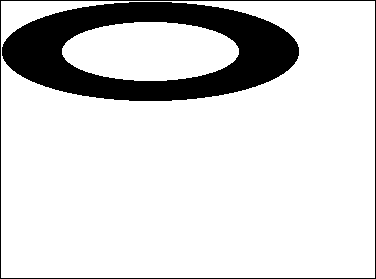

Un campo, variable o expresión de tipo Imagen puede ser cualquier imagen de Windows o Macintosh. En general, esto incluye toda imagen que pueda ser puesta en el portapapeles o leída desde el disco utilizando comandos 4D como `READ PICTURE FILE`.

4D utiliza APIs nativas para codificar (escribir) y decodificar (leer) los campos y las variables de las imágenes tanto en Windows como en macOS. Estas implementaciones dan acceso a numerosos formatos nativos, incluido el formato RAW, utilizado actualmente por las cámaras digitales.

*   en Windows, 4D utiliza WIC (Windows Imaging Component).
*   en macOS, 4D utiliza ImageIO.

WIC e ImageIO permiten el uso de metadatos en las imágenes. Dos comandos, `SET PICTURE METADATA` y `GET PICTURE METADATA`, le permiten beneficiarse de los metadatos en sus desarrollos.

## Identificadores de códecs de imágenes

4D soporta de forma nativa un amplio conjunto de [formatos de imagen](FormEditor/pictures.md#native-formats-supported), como .jpeg, .png o .svg.

Los formatos de imágenes reconocidos por 4D son devueltos por el comando `PICTURE CODEC LIST` como identificadores de códecs de imágenes.  Se pueden devolver de las siguientes formas:

*   Como una extensión (por ejemplo ".gif")
*   Como un tipo MIME (por ejemplo, "image/jpeg")

La forma devuelta para cada formato dependerá de la forma en que se registre el códec a nivel del sistema operativo. Tenga en cuenta que la lista de códecs disponibles para lectura y escritura puede ser diferente, ya que los códecs de codificación pueden requerir licencias específicas.

La mayoría de los comandos de gestión de imágenes [4D](https://doc.4d.com/4Dv18/4D/18/Pictures.201-4504337.en.html) pueden recibir un Codec ID como parámetro. Por lo tanto, es imperativo utilizar el ID del sistema devuelto por el comando `PICTURE CODEC LIST`. Los formatos de imágenes reconocidos por 4D son devueltos por el comando `PICTURE CODEC LIST`.


## Operadores de imágenes

| Operación                 | Sintaxis               | Devuelve | Acción                                                                                                                                                                                |
| ------------------------- | ---------------------- | -------- | ------------------------------------------------------------------------------------------------------------------------------------------------------------------------------------- |
| Concatenación horizontal  | Imagen1 + Imagen2      | Picture  | Añadir Imagen2 a la derecha de Imagen1                                                                                                                                                |
| Concatenación vertical    | Imagen1 / Imagen2      | Picture  | Añadir Imagen2 debajo de Imagen1                                                                                                                                                      |
| Superposición exclusiva   | Imagen1 & Imagen2      | Picture  | Superpone Imagen2 sobre Imagen1 (Imagen2 en primer plano). Produce el mismo resultado que `COMBINE PICTURES(pict3;pict1;Superimposition;pict2)`                                       |
| Superposición inclusiva   | Imagen1 &#124; Imagen2 | Picture  | Superpone Imagen2 sobre Imagen1 y devuelve la máscara resultante si ambas imágenes tienen el mismo tamaño. Produce el mismo resultado que `$equal:=Equal pictures(Pict1;Pict2;Pict3)` |
| Desplazamiento horizontal | Imagen + Número        | Picture  | Mover la imagen horizontalmente un Número de píxeles                                                                                                                                  |
| Movimiento vertical       | Imagen / Número        | Picture  | Mover la imagen verticalmente un Número de píxeles                                                                                                                                    |
| Redimensionamiento        | Imagen * Número        | Picture  | Redimensiona la imagen según el porcentaje Número                                                                                                                                     |
| Escala horizontal         | Imagen *+ Número       | Picture  | Redimensionar la imagen horizontalmente al porcentaje Número                                                                                                                          |
| Escala vertical           | Imagen *&#124; Número  | Picture  | Redimensionar la imagen verticalmente al porcentaje Número                                                                                                                            |
| Contiene palabra clave    | Imagen % Cadena        | Boolean  | Devuelve true si la cadena está asociada a la imagen almacenada en la expresión imagen. Ver `GET PICTURE KEYWORDS`                                                                    |


**Notas:**

- Para poder utilizar el operador |, Imag1 e Imag2 deben tener exactamente la misma dimensión. Si ambas imágenes tienen un tamaño diferente, la operación Imagen1 | Imagen2 produce una imagen en blanco.
- El comando `COMBINE PICTURES` puede utilizarse para superponer imágenes manteniendo las características de cada imagen fuente en la imagen resultante.
- Se pueden realizar operaciones adicionales en las imágenes utilizando el comando `TRANSFORM PICTURE`.
- No hay operadores de comparación de imágenes, sin embargo 4D propone el comando `Equal picture` para comparar dos imágenes.


### Ejemplos

Concatenación horizontal
```4d
 circle+rectangle //Colocar el rectángulo a la derecha del círculo
 rectangle+circle //Colocar el círculo a la derecha del rectángulo
```
 

Concatenación vertical
```4d
 circle+rectangle //Colocar el rectángulo debajo del círculo
 rectangle+circle //Colocar el círculo debajo del rectángulo
```
 

Superposición exclusiva
```4d
Pict3:=Pict1 & Pict2 // Superponer Pict2 sobre Pict1
```


Superposición inclusiva
```4d
Pict3:=Pict1|Pict2 // Recupera la máscara resultante de la superposición de dos imágenes del mismo tamaño
```


Desplazamiento horizontal
```4d
rectangle+50 //Mover el rectángulo 50 píxeles a la derecha
rectangle-50 //Mover el rectángulo 50 píxeles a la izquierda
```


Movimiento vertical

```4d
rectangle/50 //Mover el rectángulo 50 píxeles hacia abajo
rectangle/-20 //Mover el rectángulo 20 píxeles hacia arriba
```


Redimensionamiento

```4d
rectangle*1.5 //El rectángulo se hace un 50% más grande
rectangle*0.5 //El rectángulo se hace un 50% más pequeño
```


Escala horizontal

```4d
circle*+3 //El círculo se hace 3 veces más ancho
circle*+0,25 //El ancho del círculo se convierte en una cuarta parte de lo que era
```



Escala vertical

```4d
circle*|2 //El círculo pasa a ser el doble de alto
circle*|0.25 //La altura del círculo pasa a ser un cuarto de lo que era
```


