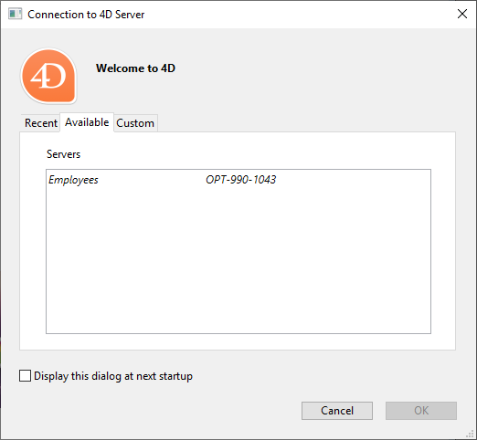

Las aplicaciones 4D Desktop pueden utilizarse en una configuración Cliente/Servidor, ya sea como aplicaciones combinadas cliente/servidor o como proyectos remotos.

- **merged client/server applications** are generated by the [Build Application manager](building.md#clientserver-page). Se utilizan para el despliegue de aplicaciones.

- **remote projects** are [.4DProject](Project/architecture.md) files opened by 4D Server and accessed with 4D in remote mode. The server sends a .4dz version of the project ([compressed format](building.md#build-compiled-structure)) to the remote 4D, thus structure files are read-only. Esta configuración se suele utilizar para probar la aplicación.

> Connecting to a remote projet from the **same machine as 4D Server** allows modifying the project files. This [specific feature](#using-4d-and-4d-server-on-the-same-machine) allows to develop a client/server application in the same context as the deployment context.

## Abrir una aplicación cliente/servidor fusionada

A merged client/server application is customized and its starting is simplified:

- Para lanzar la parte del servidor, el usuario simplemente hace doble clic en la aplicación servidor. No es necesario seleccionar el archivo proyecto.
- Para lanzar la parte cliente, el usuario simplemente hace doble clic en la aplicación cliente, que se conecta directamente a la aplicación servidor.

These principles are detailed in the [Build Application](building.md#what-is-a-clientserver-application) page.

## Abrir un proyecto remoto

The first time you connect to a 4D Server project via a remote 4D, you will usually use the standard connection dialog. Thereafter, you will be able to connect directly using the **Open Recent Projects** menu or a 4DLink shortcut file.

Para conectarse remotamente a un proyecto 4D Server:

1. Select **Connect to 4D Server** in the Welcome Wizard dialog, OR Select **Open/Remote Project...** from the **File** menu or the **Open** toolbar button.

Aparece el diálogo de conexión de 4D Server. Este diálogo tiene tres pestañas: **Reciente**, **Disponible** y **Personalizado**.

Si 4D Server está conectado a la misma red que el 4D remoto, seleccione **Disponible**. 4D Server incluye un sistema de difusión TCP/IP integrado que, por defecto, publica el nombre de los proyectos 4D Server disponibles en la red. La lista se ordena por orden de aparición y se actualiza dinámicamente.

Para conectarse a un servidor de la lista, haga doble clic en su nombre o selecciónelo y presione el botón **Aceptar**.

> Se antepone un acento circunflejo (^) al nombre de los proyectos publicados con la opción de encripción activada.

Si el proyecto publicado no aparece en la lista **Disponible**, seleccione **Personalizado**. La página Personalizada le permite conectarse a un servidor publicado en la red utilizando su dirección de red y asignándole un nombre personalizado.

- **Nombre del proyecto**: define el nombre local del proyecto 4D Server. Este nombre se utilizará en la página **Reciente** cuando se haga referencia al proyecto.
- **Dirección red**: la dirección IP de la máquina donde se lanzó el 4D Server. Si dos servidores se ejecutan simultáneamente en la misma máquina, la dirección IP debe ir seguida de dos puntos y del número de puerto, por ejemplo: `192.168.92.104:19814`. Por defecto, el puerto de publicación de un 4D Server es el 19813. Este número puede modificarse en los parámetros del proyecto.

Una vez que esta página asigna un servidor, al hacer clic en el botón **Aceptar** podrá conectarse al servidor.

> If the project is published with the encryption option enabled, you must add a circumflex accent (^) before the name, otherwise the connection will be refused. For more information, refer to the Encrypting Client/Server Connections section.

Una vez establecida la conexión con el servidor, el proyecto remoto aparecerá en la pestaña **Recientes**.

### Actualización de los archivos del proyecto en el servidor

4D Server automatically creates and sends the remote machines a [.4dz version](building.md#build-compiled-structure) of the *.4DProject* project file (not compressed) in interpreted mode.

- Una versión .4dz actualizada del proyecto se produce automáticamente cuando es necesario, *es decir, *cuando el proyecto ha sido modificado y recargado por 4D Server. El proyecto se recarga:
  - automatically, when the 4D Server application window comes to the front of the OS or when the 4D application on the same machine saves a modification (see below).
  - cuando se ejecuta el comando `RELOAD PROJECT`. Calling this command is necessary for example when you have pulled a new version of the project from the source control platform.

### Actualización de los archivos de proyecto en las máquinas remotas

When an updated .4dz version of the project has been produced on 4D Server, connected remote 4D machines must log out and reconnect to 4D Server in order to benefit from the updated version.

## Utilizar 4D y 4D Server en la misma máquina

When 4D connects to a 4D Server on the same machine, the application behaves as 4D in single user mode and the design environment allows you to edit project files. This feature allows you to develop a client/server application in the same context as the deployment context.

Each time 4D performs a **Save all** action from the design environment (explicitly from **File** menu or implicitly by switching to application mode for example), 4D Server synchronously reloads project files. 4D waits for 4D Server to finish reloading the project files before it continues.

Sin embargo, debe prestar atención a las siguientes diferencias de comportamiento en comparación con [la arquitectura proyecto estándar](Project/architecture.md):

- la carpeta userPreferences.{username} utilizada por 4D no es la misma carpeta utilizada por 4D Server en la carpeta proyecto. En su lugar, es una carpeta dedicada, llamada "userPreferences", almacenada en la carpeta sistema del proyecto (es decir, la misma ubicación que al abrir un proyecto .4dz).
- la carpeta utilizada por 4D para los datos derivados no es la carpeta llamada "DerivedData" en la carpeta proyecto. En su lugar, se trata de una carpeta dedicada llamada "DerivedDataRemote" situada en la carpeta del sistema del proyecto.
- el archivo catalog.4DCatalog no es editado por 4D sino por 4D Server. La información del catálogo se sincroniza mediante peticiones cliente/servidor
- el archivo directory.json no es editado por 4D sino por 4D Server. La información del directorio se sincroniza mediante peticiones cliente/servidor
- 4D utiliza sus propios componentes internos y plug-ins en lugar de los de 4D Server.

> No se recomienda instalar plug-ins o componentes a nivel de la aplicación 4D o 4D Server.
