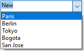

Un combo box es similar a una [lista desplegable](dropdownList_Overview.md#overview), excepto que acepta texto introducido desde el teclado y tiene opciones adicionales.

Fundamentalmente, debe considerar un combo box como un área editable que utiliza su objeto, array o una lista de selección como el conjunto de valores por defecto.

## Gestión de combo boxes

Utilice el evento [`On Data Change`](Events/onDataChange.md) para gestionar las entradas en el área editable, como lo haría con cualquier objeto del formulario de entrada.

Un combo box se inicializa exactamente igual que una [lista desplegable](dropdownList_Overview.md#overview): utilizando un objeto, un array o una lista de selección.

### Utilizar un objeto

> Esta funcionalidad sólo está disponible en proyectos 4D.

An [object](Concepts/dt_object.md) encapsulating a [collection](Concepts/dt_collection.md) can be used as the data source of a combo box. El objeto debe contener las siguientes propiedades:

| Propiedad      | Tipo                 | Descripción                                                                                                                                                                                                                                                              |
| -------------- | -------------------- | ------------------------------------------------------------------------------------------------------------------------------------------------------------------------------------------------------------------------------------------------------------------------ |
| `values`       | Collection           | Obligatorio - Colección de valores escalares. Todos los valores deben ser del mismo tipo. Tipos soportados:<li>cadenas</li><li>numbers</li><li>dates</li><li>horas</li>Si está vacío o no está definido, el combo box está vacío |
| `currentValue` | igual que Collection | Texto introducido por el usuario                                                                                                                                                                                                                                         |

Si el objeto contiene otras propiedades, se ignoran.

Cuando el usuario introduce texto en el combo box, la propiedad `currentValue` del objeto obtiene el texto introducido.

### Utilizar un array

Consulte **Utilización de un array** en la [página de la lista desplegable](dropdownList_Overview.md#using-an-array) para obtener información sobre cómo inicializar el array.

Cuando el usuario introduce texto en el combo box, el elemento 0 del array recibe el texto introducido.

### Utilizar una lista de selección

Si desea utilizar un combo box para gestionar los valores de un área de entrada (campo listado o variable), 4D le permite referenciar el campo o variable directamente como fuente de datos del objeto formulario. Esto facilita la gestión de los campos/variables listados.
> Si utiliza una lista jerárquica, sólo se muestra el primer nivel y se puede seleccionar.

Para asociar un combo box a un campo o variable, basta con introducir el nombre del campo o variable directamente en [Variable o Expresión](properties_Object.md#variable-or-expression) del objeto formulario en la Lista de Propiedades.

Cuando se ejecuta el formulario, 4D gestiona automáticamente el combo box durante la entrada o visualización: cuando un usuario elige un valor, éste se guarda en el campo; este valor de campo se muestra en el combo box cuando se visualiza el formulario:

Para más información, consulte **Utilizar una opción** en la [página lista desplegable](dropdownList_Overview.md#using-a-choice-list).

## Opciones

Los objetos de tipo combo box aceptan dos opciones específicas:

- [Inserción automática](properties_DataSource.md#automatic-insertion): permite añadir automáticamente un valor a la fuente de datos cuando un usuario introduce un valor que no se encuentra en la lista asociada al combo box.
- [Exclusión](properties_RangeOfValues.md#excluded-list) (lista de valores excluidos): permite establecer una lista cuyos valores no pueden introducirse en el combo box. Si se introduce un valor excluido, no se acepta y se muestra un mensaje de error.
> > Associating a [list of required values](properties_RangeOfValues.md#required-list) is not available for combo boxes. En una interfaz, si un objeto debe proponer una lista finita de valores requeridos, entonces debe utilizar un objeto [lista desplegable](dropdownList_Overview.md#overview).

## Propiedades soportadas

[Formato alfa](properties_Display.md#alpha-format) - [Negrita](properties_Text.md#bold) - [Inferior](properties_CoordinatesAndSizing.md#bottom) - [Lista de opciones](properties_DataSource.md#choice-list) - [Clase](properties_Object.md#css-class) - [Formato de fecha](properties_Display.md#date-format) - [Tipo de expresión](properties_Object.md#expression-type) - [Fuente](properties_Text.md#font) - [Color de fuente](properties_Text.md#font-color) - [Tamaño de fuente](properties_Text.md#font-size) - [Altura](properties_CoordinatesAndSizing.md#height) - [Mensaje de ayuda](properties_Help.md#help-tip) - [Tamaño horizontal](properties_ResizingOptions.md#horizontal-sizing) - Cursiva [Cursiva](properties_Text.md#italic) - [Izquierda](properties_CoordinatesAndSizing.md#left) - [Nombre del objeto](properties_Object.md#object-name) - [Derecha](properties_CoordinatesAndSizing.md#right) - [Formato de hora](properties_Display.md#time-format) - [Arriba](properties_CoordinatesAndSizing.md#top) - [Tipo](properties_Object.md#type) - [Subrayado](properties_Text.md#underline) - [Variable o expresión](properties_Object.md#variable-or-expression) - [Dimensionado vertical](properties_ResizingOptions.md#vertical-sizing) - [Visibilidad](properties_Display.md#visibility) - [Ancho](properties_CoordinatesAndSizing.md#width)  
