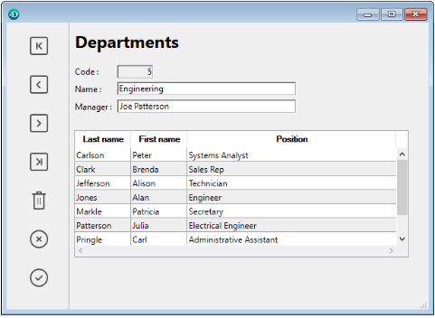
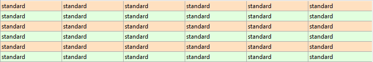
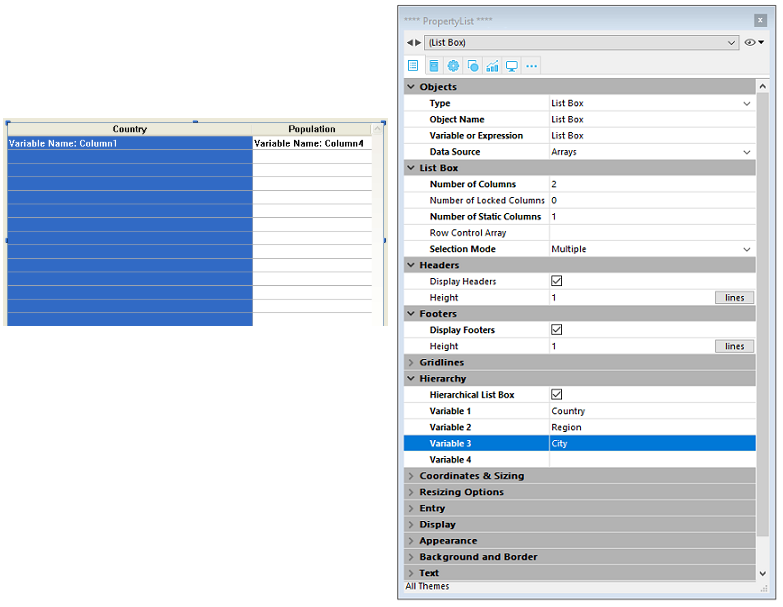
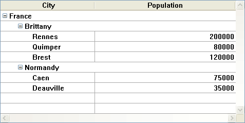
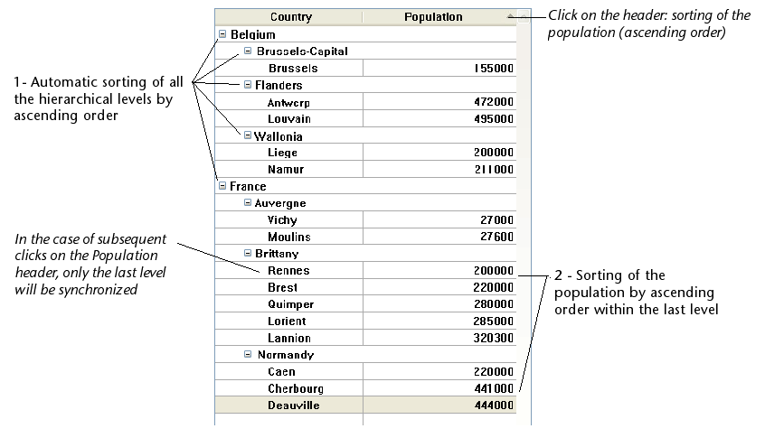
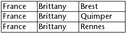
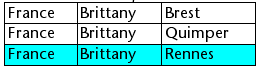
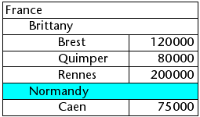

Los list boxes son objetos activos complejos que permiten mostrar e introducir datos en forma de columnas sincronizadas. Pueden vincularse a contenidos de la base de datos, como selecciones de entidades y secciones de registros, o a cualquier contenido del lenguaje, como colecciones y arrays. Incluyen funciones avanzadas relativas a la entrada de datos, la ordenación de columnas, la gestión de eventos, el aspecto personalizado, el desplazamiento de columnas, etc.



Un list box contiene una o varias columnas cuyo contenido se sincroniza automáticamente. El número de columnas es, en teoría, ilimitado (depende de los recursos de la máquina).

## Generalidades

### Principios de utilización básicos

Durante la ejecución, los list box permiten visualizar e introducir datos en forma de listas. Para hacer que una celda sea editable ([si se permite la entrada para la columna](#managing-entry)), basta con pulsar dos veces sobre el valor que contiene:


Los usuarios pueden introducir y mostrar el texto en varias líneas dentro de una celda de list box. Para añadir un salto de línea, presione **Ctrl+Retorno de carro** en Windows o **Opción+Retorno de carro** en macOS.

En las celdas se pueden mostrar booleanos e imágenes, así como fechas, horas o números. Es posible ordenar los valores de las columnas haciendo clic en un encabezado ([ordenación estándar](#managing-sorts)). Todas las columnas se sincronizan automáticamente.

También es posible cambiar el tamaño de cada columna, y el usuario puede modificar el orden de las [columnas](properties_ListBox.md#locked-columns-and-static-columns) y [líneas](properties_Action.md#movable-rows) moviéndolas con el ratón, si esta acción está autorizada. Tenga en cuenta que los list box se pueden utilizar en [modo jerárquico](#hierarchical-list-boxes).

El usuario puede seleccionar una o varias líneas utilizando los atajos estándar: **Mayúsculas+clic** para una selección adyacente y **Ctrl+clic** (Windows) o **Comando+clic** (macOS) para una selección no adyacente.

### Partes de list box

Un list box se compone de cuatro partes distintas:

*   el [objeto list box](./listbox-object.md) en su totalidad,
*   [columnas](./listbox-column.md),
*   [encabezados de](./listbox-header-footer.md#headers) columna y
*   column [footers](./listbox-header-footer.md#footers).


Cada parte tiene su propio nombre y propiedades específicas. Por ejemplo, el número de columnas o el color alternativo de cada línea se define en las propiedades del objeto list box, el ancho de cada columna se define en las propiedades de las columnas y el tipo de fuente del encabezado se define en las propiedades de los encabezados.

Es posible añadir un método objeto al objeto list box y/o a cada columna del list box. Los métodos objeto se llaman en el siguiente orden:

1. Método objeto de cada columna
2. Método objeto del list box

The column object method gets events that occur in its [header](./listbox-header-footer.md#headers) and [footer](./listbox-header-footer.md#footers).

### Tipos de list box

Hay varios tipos de list box, con sus propios comportamientos y propiedades específicas. El tipo de list box depende de su [propiedad Fuente de datos](properties_Object.md#data-source):

* **Arrays**: cada columna está ligada a un array 4D. Los list boxes basados en arrays pueden mostrarse como [cajas de lista jerárquicas](listbox_overview.md#hierarchical-list-boxes).
* **Selección** (**Selección actual** o **Selección con nombre**): cada columna está vinculada a una expresión (por ejemplo, un campo) que se evalúa para cada registro de la selección.
* **Collection o Entity selection**: cada columna está ligada a una expresión que se evalúa para cada elemento de la colección o cada entidad de la selección de entidades.
> > > > No es posible combinar diferentes tipos de list box en el mismo objeto list box. La fuente de datos se define cuando se crea el list box. Entonces ya no es posible modificarlo por programación.

### Gestión de list boxes

Se puede configurar completamente un objeto list box a través de sus propiedades, y también se puede gestionar dinámicamente por programación.

El lenguaje 4D incluye un tema "List Box" dedicado a los comandos de list box, pero los comandos de otros temas, tales como "Propiedades de los objetos" o los comandos `EDIT ITEM` y `Displayed line number` también pueden ser utilizados. Refer to the [List Box Commands Summary](https://doc.4d.com/4Dv20/4D/20.6/List-Box-Commands-Summary.300-7487600.en.html) page of the *4D Language reference* for more information.


## Gestión de entrada

Para que una celda de list box sea editable, deben cumplirse las dos condiciones siguientes:

* La columna de la celda debe haberse definido como [Enterable](properties_Entry.md#enterable) (de lo contrario, las celdas de la columna nunca podrán ser editables).
* En el evento `On Before Data Entry`, $0 no devuelve -1. Cuando el cursor llega a la celda, se genera el evento `On Before Data Entry` en el método de la columna. Si, en el contexto de este evento, $0 se define como -1, la celda se considera como no editable. Si el evento se generó después de presionar **Tab** o **Mayús+Tab**, el foco pasa a la siguiente celda o a la anterior, respectivamente. Si $0 no es -1 (por defecto $0 es 0), la celda se puede introducir y pasa al modo de edición.

Consideremos el ejemplo de un list box que contiene dos arrays, uno fecha y otro texto. El array de la fecha no se puede introducir, pero el array del texto sí se puede introducir si la fecha no ha pasado.


Aquí está el método de la columna *arrText*:

```4d
 Case of
    :(FORM event.code=On Before Data Entry) // una celda obtiene el foco
     LISTBOX GET CELL POSITION(*;"lb";$col;$row)
  // identification of cell
       If(arrDate{$row}<Current date) // si la fecha es anterior a hoy
          $0:=-1 // la celda NO  es editable
       Else
  // de lo contrario, la celda es editable
       End if
 End case
```

El evento `On Before Data Entry` se devuelve antes de `On Getting Focus`.

Para preservar la coherencia de los datos para los list box de tipo de selección y selección de entidades, todo registro/entidad modificado se guarda automáticamente en cuanto se valida la celda, es decir:

* cuando se desactiva la celda (el usuario presiona el tabulador, hace clic, etc.)
* cuando el listbox ya no tiene el foco,
* cuando el formulario ya no tiene el foco.

La secuencia típica de eventos generados durante la entrada o la modificación de datos es la siguiente:

| Acción                                                                                | Tipo(s) de Listbox                      | Secuencia de eventos                                                                                                                                                                                                                       |
| ------------------------------------------------------------------------------------- | --------------------------------------- | ------------------------------------------------------------------------------------------------------------------------------------------------------------------------------------------------------------------------------------------ |
| Una celda pasa al modo edición (acción del usuario o llamada del comando `EDIT ITEM`) | Todos                                   | On Before Data Entry                                                                                                                                                                                                                       |
|                                                                                       | Todos                                   | On Getting Focus                                                                                                                                                                                                                           |
| Cuando se ha editado el valor de una celda                                            | Todos                                   | On Before Keystroke                                                                                                                                                                                                                        |
|                                                                                       | Todos                                   | On After Keystroke                                                                                                                                                                                                                         |
|                                                                                       | Todos                                   | On After Edit                                                                                                                                                                                                                              |
| Un usuario valida y abandona la celda                                                 | List box de tipo selección              | Guardar                                                                                                                                                                                                                                    |
|                                                                                       | List box de tipo selección de registro  | Activación de On saving an existing record (si definido)                                                                                                                                                                                   |
|                                                                                       | List box de tipo selección              | On Data Change(*)                                                                                                                                                                                                                          |
|                                                                                       | List box de tipo selección de entidades | La entidad se guarda con la opción automerger, bloqueo optimista (ver entity.save( )). En caso de guardar con éxito, la entidad se refresca con la última actualización realizada. Si la operación de guardado falla, se mostrará un error |
|                                                                                       | Todos                                   | On Losing Focus                                                                                                                                                                                                                            |

(*) Con los list box de tipo selección de entidades, en el evento On Data Change:

* el objeto [elemento actual](properties_DataSource.md#element-courant) contiene el valor antes de la modificación.
* el objeto `This` contiene el valor modificado.

> La entrada de datos en los list box de tipo colección/selección de entidades tiene una limitación cuando la expresión se evalúa como nula. En este caso, no es posible editar o eliminar el valor nulo en la celda.

## Gestión de selecciones

La gestión de selecciones es diferente dependiendo de si el list box se basa en un array, en una selección de registros o en una selección de colecciones/entidades:

* **Lista box de tipo selección**: las selecciones se gestionan mediante un conjunto llamado por defecto `$ListboxSetX` (donde X empieza en 0 y se incrementa en función del número de list box en el formulario), que puede modificar si es necesario. Este conjunto se [define en las propiedades](properties_ListBox.md#highlight-set) del list box. Es mantenido automáticamente por 4D: si el usuario selecciona una o más líneas en el list box, el conjunto se actualiza inmediatamente. Por otra parte, también es posible utilizar los comandos del tema "Conjuntos" para modificar por programación la selección en el list box.

* **List box de tipo colección/selección de entidades**: las selecciones se gestionan a través de las propiedades del list box dedicado:
  * [Elemento actual](properties_DataSource.md#current-item) es un objeto que recibirá el elemento/la entidad seleccionado(a)
  * [Elementos seleccionados](properties_DataSource.md#selected-items) es un objeto colección/selección de entidades de elementos seleccionados
  * [Posición del elemento actual](properties_DataSource.md#current-item-position) devuelve la posición del elemento o de la entidad seleccionada.

* **List box de tipo array**: el comando `LISTBOX SELECT ROW` puede utilizarse para seleccionar una o más líneas del list box por programación. La [variable asociada al objeto List box](propiedades_Objeto.md#variable-o-expresión) se utiliza para obtener, definir o almacenar las selecciones de líneas en el objeto. Esta variable corresponde a un array de booleanos que es creado y mantenido automáticamente por 4D. El tamaño de este array viene determinado por el tamaño del list box: contiene el mismo número de elementos que el array más pequeño asociado a las columnas. Cada elemento de este array contiene `True` si se selecciona la línea correspondiente y `False` en caso contrario. 4D actualiza el contenido de este array en función de las acciones del usuario. Por el contrario, puede cambiar el valor de los elementos del array para cambiar la selección en el list box. Por otra parte, no se pueden insertar ni borrar líneas en este array; tampoco se pueden reescribir las líneas. El comando `Count in array` puede utilizarse para averiguar el número de líneas seleccionadas. Por ejemplo, este método permite invertir la selección de la primera línea del list box (tipo array):

```4d
 ARRAY BOOLEAN(tBListBox;10)
  //tBListBox es el nombre de la variable asociada al list box en el formulario
 If(tBListBox{1}=True)
    tBListBox{1}:=False
 Else
    tBListBox{1}:=True
 End if
```

> El comando `OBJECT SET SCROLL POSITION` se desplaza por las líneas del list box para que se muestre la primera línea seleccionada o una línea especificada.

### Personalizar la apariencia de las líneas seleccionadas

Cuando la opción [Ocultar el resaltado de la selección](properties_Appearance.md#hide-selection-highlight) está seleccionada, debe gestionar la representación visual de las selecciones en el list box utilizando las opciones de interfaz disponibles. Dado que las selecciones siguen siendo gestionadas en su totalidad por 4D, esto significa:

* En el caso de los list box de tipo array, debe analizar la variable array booleana asociada al list box para determinar qué líneas están seleccionadas o no.
* Para los list box de tipo selección, hay que comprobar si el registro actual (línea) pertenece al conjunto especificado en la propiedad [Conjunto resaltado](properties_ListBox.md#highlight-set) del list box.

A continuación, puede definir por programación los colores de fondo, los colores y/o estilos de fuentes específicas para personalizar la apariencia de las líneas seleccionadas. Esto puede hacerse utilizando arrays o expresiones, en función del tipo de list box mostrado (ver las siguientes secciones).

> Puede utilizar la constante `lk inherited` para aplicar la apariencia actual del list box (por ejemplo, el color de la fuente, el color de fondo, el estilo de la fuente, etc.).

#### List box de tipo selección

Para determinar qué líneas están seleccionadas, hay que comprobar si están incluidas en el conjunto indicado en la propiedad [Conjunto resaltado](properties_ListBox.md#highlight-set) del list box. A continuación, puede definir la apariencia de las líneas seleccionadas utilizando una o varias de las [propiedades de expresión de color o estilo](#using-arrays-and-expressions) relevantes.

Tenga en cuenta que las expresiones se reevalúan automáticamente cada vez que:

* la selección de list box cambia.
* list box obtiene o pierde el foco.
* la ventana formulario que contiene el list box se convierte, o deja de ser, la ventana del primer plano.

#### List box de tipo array

Tiene que analizar el array booleano [Variable o expresión](properties_Object.md#variable-or-expression) asociado al list box para determinar si las líneas están seleccionadas o no.

A continuación, puede definir la apariencia de las líneas seleccionadas utilizando una o varias de las [propiedades de array de color o de estilo](#using-arrays-and-expressions) relevantes.

Tenga en cuenta que los arrays de list box utilizados para definir la apariencia de las líneas seleccionadas deben recalcularse en el evento formulario `On Selection Change`; sin embargo, también puede modificar estos arrays basándose en los siguientes eventos formulario adicionales:

* `On Getting Focus` (propiedad list box)
* `On Losing Focus` (propiedad list box)
* `On Activate` (propiedad list box)
* `On Deactivate` (form property) ...depending on whether and how you want to visually represent changes of focus in selections.

##### Ejemplo

Ha elegido ocultar el resaltado sistema y desea mostrar las selecciones en el list box con un color de fondo verde, como se muestra aquí:


Para un list box de tipo array, es necesario actualizar el [Array colores de fondo](properties_BackgroundAndBorder.md#row-background-color-array) por programación. En el formulario JSON, ha definido el Array colores de fondo de línea para el list box:

```
 "rowFillSource": "_ListboxBackground",
```

En el método objeto del list box, puede escribir:

```4d
 Case of
    :(FORM event.code=On Selection Change)
       $n:=Size of array(LB_Arrays)
       ARRAY LONGINT(_ListboxBackground;$n) // colores de fondo de la línea
       For($i;1;$n)
          If(LB_Arrays{$i}=True) // selected
             _ListboxBackground{$i}:=0x0080C080 // fondo verde
          Else // not selected
             _ListboxBackground{$i}:=lk inherited
          End if
       End for
 End case
```

Con un list box de tipo selección, para producir el mismo efecto puede utilizar un método para actualizar la propiedad [Expresión color de fondo](properties_BackgroundAndBorder.md#background-color-expression) basado en el conjunto designado por la propiedad [Conjunto resaltado](properties_ListBox.md#highlight-set).

Por ejemplo, en el formulario JSON, ha definido el conjunto resaltado y la expresión de color de fondo siguientes para el list box:

```
 "highlightSet": "$SampleSet",
 "rowFillSource": "UI_SetColor",
```

Puede escribir en el método *UI_SetColor*:

```4d
 If(Is in set("$SampleSet"))
    $color:=0x0080C080 // fondo verde
 Else
    $color:=lk inherited
 End if

 $0:=$color
```

> En los list box jerárquicos, las líneas de ruptura no pueden resaltarse cuando la opción [Ocultar resaltado selección](properties_Appearance.md#hide-selection-highlight) está seleccionada. Como no es posible tener colores distintos para los encabezados del mismo nivel, no hay manera de destacar una línea de ruptura específica por programación.

## Gestión de ordenaciones

Un orden en un list box puede ser estándar o personalizado. Cuando se ordena una columna de un list box, todas las demás columnas se sincronizan siempre automáticamente.

### Ordenación estándar

Por defecto, un list box ofrece una ordenación de columnas estándar cuando se hace clic en el encabezado. Una ordenación estándar es una ordenación alfanumérica de los valores de las columnas evaluadas, alternativamente ascendiendo/descendiendo con cada clic sucesivo.

Puede activar o desactivar la ordenación usuario estándar desactivando la propiedad [Ordenable](properties_Action.md#sortable) del list box (activada por defecto).

El soporte de ordenación estándar depende del tipo de list box:

| Tipo de list box               | Soporte de ordenación estándar | Comentarios                                                                                          |
| ------------------------------ | ------------------------------ | ---------------------------------------------------------------------------------------------------- |
| Colección de objetos           | Sí                             | <li>Las columnas "This.a" o "This.a.b" son ordenables.</li><li>La [propiedad source del list box](properties_Object.md#variable-or-expression) debe ser una [expresión asignable](../Concepts/quick-tour.md#assignable-vs-non-assignable-expressions).</li>                                                   |
| Colección de valores escalares | No                             | Utilice la ordenación personalizada con la función [`orderBy()`](../API/CollectionClass.md#orderby)  |
| Entity selection               | Sí                             | <li>La [propiedad source del list box](properties_Object.md#variable-or-expression) debe ser una [expresión asignable](../Concepts/quick-tour.md#assignable-vs-non-assignable-expressions).</li><li>Soportado: ordena las propiedades de atributos de objetos (por ejemplo, "This.data.city" cuando "data" es un atributo de objeto)</li><li>Soportado: ordena los atributos relacionados (por ejemplo, "This.company.name")</li><li>No soportado: ordenar en las propiedades de atributos de objetos a través de atributos relacionados (por ejemplo, "This.company.data.city"). Para ello, debe utilizar la ordenación personalizada con la función [`orderByFormula()`](../API/EntitySelectionClass.md#orderbyformula) (ver el siguiente ejemplo)</li> |
| Selección actual               | Sí                             | Sólo se pueden ordenar las expresiones simples (por ejemplo, `[Table_1]Campo_2`)                     |
| Selección temporal             | No                             |                                                                                                      |
| Arrays                         | Sí                             | Las columnas vinculadas a arrays de imágenes y punteros no se pueden ordenar                         |

### Ordenación personalizada

El desarrollador puede configurar ordenaciones personalizadas, por ejemplo utilizando el comando [`LISTBOX SORT COLUMNS`](https://doc.4d.com/4dv19/help/command/en/page916.html) y/o combinando los eventos de formulario [`On Header Click`](../Events/onHeaderClick) y [`On After Sort`](../Events/onAfterSort) y los comandos 4D correspondientes.

Los ordenamientos personalizados le permiten:

* efectuar las ordenaciones multinivel en varias columnas, gracias al comando [`LISTBOX SORT COLUMNS`](https://doc.4d.com/4dv19/help/command/en/page916.html),
* usar funciones como [`collection.orderByMethod()`](../API/CollectionClass.md#orderbymethod) o [`entitySelection.orderByFormula()`](../API/EntitySelectionClass.md#orderbyformula) para ordenar columnas según criterios complejos.

#### Ejemplo

Desea ordenar un list box utilizando los valores de una propiedad almacenada en un atributo de objeto relacionado. Tiene la siguiente estructura:


Se diseña un list box de tipo entity selection, vinculado a la expresión `Form.child`. En el evento formulario `On Load`, se ejecuta `Form.child:=ds.Child.all()`.

Se muestran dos columnas:

| Nombre del hijo | Apodo del padre              |
| --------------- | ---------------------------- |
| `This.name`     | `This.parent.extra.nickname` |

Si quiere ordenar el list box utilizando los valores de la segunda columna, debe escribir:

```4d
If (Form event code=On Header Click)
 Form.child:=Form.child.orderByFormula("This.parent.extra.nickname"; dk ascending)
End if
```

### Variable de encabezado de columna

El valor de la [variable asociada al encabezado de una columna](properties_Object.md#variable-or-expression) permite gestionar una información adicional: la ordenación actual de la columna (lectura) y la visualización de la flecha de ordenación.

* Si la variable se define en 0, la columna no se ordena y la flecha de ordenación no se muestra.  
  

* Si la variable está definida como 1, la columna se ordena en orden ascendente y se muestra la flecha de ordenación. 

* Si la variable se establece en 2, la columna se clasifica en orden descendente y se muestra la flecha de clasificación. 

> Sólo las [variables](Concepts/variables.md) declaradas o dinámicas pueden utilizarse como variables de encabezado de columna. Otros tipos de [expresiones](Concepts/quick-tour.md#expressions) como `Form.sortValue` no son soportadas.

Puede definir el valor de la variable (por ejemplo, Header2:=2) para "forzar" la visualización de la flecha de ordenación. En este caso no se modifica la ordenación por columnas en sí, sino que es el desarrollador quien debe encargarse de ello.

> El comando [`OBJECT SET FORMAT`](https://doc.4d.com/4dv19/help/command/en/page236.html) ofrece soporte específico para iconos en los encabezados de los list box, lo que puede ser útil cuando se desea trabajar con un icono de ordenación personalizado.

## Gestión de los colores, estilos y visualización de las líneas

Hay varias formas de definir los colores de fondo, los colores de fuente y los estilos de fuente en los list box:

* al nivel de las [propiedades del objeto list box](./listbox-object.md),
* a nivel de las [propiedades de las columnas](./listbox-column.md),
* utilizando los [arrays o expresiones](#using-arrays-and-expressions) para el list box y/o para cada columna,
* a nivel del texto de cada celda (si [texto multi-estilo](properties_Text.md#multi-style)).

### Prioridad & herencia

Los principios de prioridad y de herencia se observan cuando la misma propiedad se define en más de un nivel.

| Nivel de prioridad | Ubicación del parámetro                                                                  |
| ------------------ | ---------------------------------------------------------------------------------------- |
| alta prioridad     | Celda (si texto multiestilo)                                                             |
|                    | Arrays de columnas/métodos                                                               |
|                    | Arrays/métodos de Listbox                                                                |
|                    | Propiedades de la columna                                                                |
|                    | Propiedades de list box                                                                  |
| baja prioridad     | Expresiones de metainformación (para colecciones o list boxes de selección de entidades) |

Por ejemplo, si define un estilo de fuente en las propiedades del list box y otro mediante un array de estilos para la columna, se tendrá en cuenta este último.

Para cada atributo (estilo, color y color de fondo), se implementa una **herencia** cuando se utiliza el valor por defecto:

* para los atributos de las celdas: valores de atributos de las líneas
* para los atributos líneas: valores de atributos de columnas
* para los atributos de la columna: valores de los atributos del list box

De esta forma, si desea que un objeto herede el valor de atributo de un nivel superior, puede utilizar pasar la constante `lk inherited` (valor por defecto) al comando de definición o directamente en el elemento del array de estilo/color correspondiente. Por ejemplo, dado un list box array que contiene un estilo de letra estándar con colores alternos: 

Realiza las siguientes modificaciones:

* cambiar el fondo de la línea 2 a rojo utilizando la propiedad [Row Background Color Array](properties_BackgroundAndBorder.md#row-background-color-array) del objeto list box,
* cambia el estilo de la línea 4 a cursiva utilizando la propiedad [Row Style Array](properties_Text.md#row-style-array) del objeto list box,
* dos elementos de la columna 5 se cambian a negrita utilizando la propiedad [Row Style Array](properties_Text.md#row-style-array) del objeto columna 5,
* los 2 elementos de la columna 1 y 2 se cambian a azul oscuro utilizando la propiedad [Row Background Color Array](properties_BackgroundAndBorder.md#row-background-color-array) para los objetos de la columna 1 y 2:


Para restaurar la apariencia original de la caja del list box, puede:

* pasar la constante `lk inherited` en el elemento 2 de los arrays de color de fondo de las columnas 1 y 2: entonces heredan el color de fondo rojo de la línea.
* pasar la constante `lk inherited` en los elementos 3 y 4 del array de estilo de la columna 5: entonces heredan el estilo estándar, excepto el elemento 4, que cambia a itálica según lo especificado en el array de estilo del list box.
* pasar la constante `lk inherited` en el elemento 4 del array de estilos para el list box con el fin de eliminar el estilo itálica.
* pasar la constante `lk inherited` en el elemento 2 del array de colores de fondo para el list box con el fin de restaurar el color alternativo original del list box.

### Uso de arrays y expresiones

Según el tipo de list box, puede utilizar diferentes propiedades para personalizar los colores, estilos y visualización de las líneas:

| Propiedad        | List box array                                                                         | List box selección                                                                        | List box colección o entity selection                                                                                                                      |
| ---------------- | -------------------------------------------------------------------------------------- | ----------------------------------------------------------------------------------------- | ---------------------------------------------------------------------------------------------------------------------------------------------------------- |
| Color de fondo   | [Array colores de fondo](properties_BackgroundAndBorder.md#row-background-color-array) | [Expresión color de fondo](properties_BackgroundAndBorder.md#background-color-expression) | [Expresión color de fondo](properties_BackgroundAndBorder.md#background-color-expression) o [Meta info expresión](properties_Text.md#meta-info-expression) |
| Color de fuente  | [Array colores de fuente](properties_Text.md#row-font-color-array)                     | [Expresión color fuente](properties_Text.md#font-color-expression)                        | [Expresión color de fuente](properties_Text.md#font-color-expression) o [Meta info expression](properties_Text.md#meta-info-expression)                    |
| Estilo de fuente | [Array de estilos](properties_Text.md#row-style-array)                                 | [Expresión estilo](properties_Text.md#style-expression)                                   | [Expresión de estilo](properties_Text.md#style-expression) o [Expresión meta info](properties_Text.md#meta-info-expression)                                |
| Visualización    | [Array de control de líneas](properties_ListBox.md#row-control-array)                  | -                                                                                         | -                                                                                                                                                          |

## Imprimir list boxes

Hay dos modos de impresión disponibles: **modo vista previa** - que se puede utilizar para imprimir un list box como un objeto de formulario y el **modo avanzado**, que le permite controlar la impresión del propio objeto list box en el formulario. Tenga en cuenta que la apariencia "Impresión" está disponible para los list boxes en el editor de formularios.

### Modo de vista previa

La impresión de un list box en modo vista previa consiste en imprimir directamente el list box y el formulario que lo contiene utilizando los comandos de impresión estándar o el comando de menú **Imprimir**. El list box se imprime tal como está en el formulario. Este modo no permite controlar con precisión la impresión del objeto; en particular, no permite imprimir todas las líneas de un list box que contenga más líneas de las que puede mostrar.

### Modo avanzado

En este modo, la impresión de los list box se realiza por programación, a través del comando `Print object` (se soportan los formularios proyecto y los formularios tabla). El comando `LISTBOX GET PRINT INFORMATION` se utiliza para controlar la impresión del objeto.

En este modo:

* La altura del objeto list box se reduce automáticamente cuando el número de líneas a imprimir es inferior a la altura original del objeto (no se imprimen líneas "vacías"). Por el contrario, la altura no aumenta automáticamente en función del contenido del objeto. El tamaño del objeto efectivamente impreso puede obtenerse vía el comando `LISTBOX GET PRINT INFORMATION`.
* El objeto list box se imprime "tal cual", es decir, teniendo en cuenta sus parámetros de visualización actuales: visibilidad de los encabezados y de las rejillas, líneas ocultas y mostradas, etc. Estos parámetros también incluyen la primera línea a imprimir: si llama al comando `OBJECT SET SCROLL POSITION` antes de lanzar la impresión, la primera línea impresa en el list box será la designada por el comando.
* Un mecanismo automático facilita la impresión de los list box que contienen más líneas de las que es posible mostrar: se pueden realizar llamadas sucesivas a `Print object` para imprimir cada vez un nuevo conjunto de líneas. El comando `LISTBOX GET PRINT INFORMATION` puede utilizarse para comprobar el estado de la impresión durante la operación.

## List box jerárquicos

Un list box jerárquico es un list box en el que el contenido de la primera columna aparece en forma jerárquica. Este tipo de representación se adapta a la presentación de información que incluye valores repetidos y/o que dependen jerárquicamente (país/región/ciudad, etc.).

> Sólo los [list box de tipo array](#array-list-boxes) pueden ser jerárquicos.

Los list box jerárquicos son una forma particular de representar los datos, pero no modifican la estructura de datos (arrays). Los list box jerárquicos se gestionan exactamente igual que los list box clásicos.

### Definir una jerarquía

Para definir un list box jerárquico, existen varias posibilidades:

* Configurar manualmente los elementos jerárquicos utilizando la lista de propiedades del editor de formularios (o editar el formulario JSON).
* Generar visualmente la jerarquía utilizando el menú emergente de gestión de list box, en el editor de formularios.
* Use the [LISTBOX SET HIERARCHY](https://doc.4d.com/4Dv20/4D/20.6/LISTBOX-SET-HIERARCHY.301-7487634.en.html) and [LISTBOX GET HIERARCHY](https://doc.4d.com/4Dv20/4D/20.6/LISTBOX-GET-HIERARCHY.301-7487597.en.html) commands, described in the *4D Language Reference* manual.

#### Propiedades del List Box jerárquico

Esta propiedad especifica que el list box debe mostrarse en forma jerárquica. En el formulario JSON, esta función se activa [cuando el valor de la propiedad *dataSource* es un array](properties_Object.md#array-list-box), es decir, una colección.

Las opciones adicionales (**Variable 1...10**) están disponibles cuando se selecciona la opción *List box jerárquico*, correspondiente a cada elemento del array *dataSource* a utilizar como columna de ruptura. Cada vez que se introduce un valor en un campo, se añade una nueva línea. Se pueden especificar hasta 10 variables. Estas variables definen los niveles jerárquicos a mostrar en la primera columna.

La primera variable corresponde siempre al nombre de la variable de la primera columna del list box (los dos valores se vinculan automáticamente). Esta primera variable está siempre visible y se puede editar. Por ejemplo: country. La segunda variable también es siempre visible y editable; define el segundo nivel jerárquico. Por ejemplo: regions. A partir del tercer campo, cada variable depende de la anterior. Por ejemplo: counties, cities, etc. Se puede especificar un máximo de diez niveles jerárquicos. Si se elimina un valor, toda la jerarquía sube de nivel.

La última variable nunca es jerárquica aunque existan varios valores idénticos en este nivel. Por ejemplo, refiriéndonos a la configuración ilustrada anteriormente, imagine que arr1 contiene los valores A A B B B, arr2 tiene los valores 1 1 1 2 2 2 y arr3 los valores X X Y Y Z. En este caso, A, B, 1 y 2 podrían aparecer de forma contraída, pero no X e Y:


Este principio no se aplica cuando sólo se especifica una variable en la jerarquía: en este caso, pueden agruparse valores idénticos.
> Si especifica una jerarquía basada en las primeras columnas de un list box existente, deberá eliminar u ocultar estas columnas (excepto la primera), ya que de lo contrario aparecerán duplicadas en el list box. Si especifica la jerarquía mediante el menú emergente del editor (ver abajo), las columnas innecesarias se eliminan automáticamente del list box.

#### Crear una jerarquía utilizando el menú contextual

Cuando selecciona al menos una columna además de la primera en un objeto list box (de tipo array) en el editor de formularios, el comando **Crear jerarquía** está disponible en el menú contextual:


Este comando es un acceso directo para definir una jerarquía. Cuando se selecciona, se llevan a cabo las siguientes acciones:

* La opción **List box jerárquico** está marcada para el objeto en la Lista de propiedades.
* Las variables de las columnas se utilizan para definir la jerarquía. Reemplazan las variables ya definidas.
* Las columnas seleccionadas ya no aparecen en el list box (excepto el título de la primera).

Ejemplo: dado un list box cuyas primeras columnas contienen País, Región, Ciudad y Población. Cuando se seleccionan País, Región y Ciudad, si se elige **Crear jerarquía** en el menú contextual, se crea una jerarquía de tres niveles en la primera columna, se eliminan las columnas 2 y 3 y la columna Población pasa a ser la segunda:



##### Cancelar jerarquía

Cuando la primera columna está seleccionada y ya se ha definido como jerárquica, puede utilizar el comando **Cancelar jerarquía**. Cuando elige este comando, se llevan a cabo las siguientes acciones:

* La opción **List box jerárquico** está deseleccionada para el objeto,
* Los niveles jerárquicos 2 a X se eliminan y se transforman en columnas añadidas al list box.

### Principios de funcionamiento

Cuando se abre por primera vez un formulario que contiene un list box jerárquico, por defecto se despliegan todas las líneas.

Cuando los valores se repiten en los arrays, se añade automáticamente una línea de ruptura y un "nodo" jerárquico en el list box. Por ejemplo, imagine un list box que contenga cuatro arrays que indiquen las ciudades, cada una de ellas caracterizada por su país, su región, su nombre y su número de habitantes:


Si este list box se muestra en forma jerárquica (los tres primeros arrays están incluidos en la jerarquía), se obtiene:



Los arrays no se ordenan antes de construir la jerarquía. Si, por ejemplo, un array contiene los datos AAABBAACC, la jerarquía obtenida será:

    > &gt; > &gt; > A B A C

Para desplegar o contraer un "nodo" jerárquico, basta con hacer clic en él. Si hace **Alt+clic** (Windows) o **Opción+clic** (macOS) en el nodo, todos sus subelementos se desplegarán o contraerán también. Estas operaciones también pueden realizarse por programación utilizando los comandos `LISTBOX EXPAND` y `LISTBOX COLLAPSE`.

Cuando se incluyen valores del tipo fecha u hora en un list box jerárquico, se muestran en el formato del sistema corto.

#### Ordenación en list box jerárquicos

Cuando se incluyen valores del tipo fecha u hora en un list box jerárquico, se muestran en el formato del sistema corto.

* En primer lugar, todos los niveles de la columna jerárquica (primera columna) se clasifican automáticamente por orden ascendente.
* La ordenación se realiza por orden ascendente o descendente (según la acción del usuario) sobre los valores de la columna en la que se ha hecho clic.
* Todas las columnas son sincronizadas.
* En las siguientes ordenaciones realizadas en columnas no jerárquicas del list box, sólo se ordena el último nivel de la primera columna. Es posible modificar la ordenación de esta columna haciendo clic en su encabezado.

Cuando se incluyen valores del tipo fecha u hora en un list box jerárquico, se muestran en el formato del sistema corto.


Si hace clic en el encabezado "Population" para ordenar las poblaciones por orden ascendente (o alternativamente descendente), los datos aparecen de la siguiente manera:



Como para todos los list box, puede [desactivar el mecanismo de ordenación estándar](properties_Action.md#sortable) y gestionar las ordenaciones por programación.

#### Selecciones y posiciones en list box jerárquicos

Un list box jerárquico muestra un número variable de líneas en la pantalla según el estado desplegado/contraído de los nodos jerárquicos. Sin embargo, esto no significa que el número de líneas de los arrays varíe. Sólo se modifica la visualización, no los datos. Es importante entender este principio porque la gestión programada de los list box jerárquicos se basa siempre en los datos de los arrays, no en los datos mostrados. En particular, las filas de ruptura añadidas automáticamente no se tienen en cuenta en los arrays de opciones de visualización (ver más adelante).

Veamos, por ejemplo, los siguientes arrays:



Si estos arrays se representan jerárquicamente, la línea "Quimper" no se mostrará en la segunda línea, sino en la cuarta, debido a las dos líneas de ruptura que se añaden:


Independientemente de cómo se muestren los datos en el list box (de forma jerárquica o no), si quiere cambiar la línea que contiene "Quimper" a negrita, debe utilizar la instrucción Style{2} = bold. Sólo se tiene en cuenta la posición de la línea en los arrays.

Este principio se aplica a los arrays internos que se pueden utilizar para gestionar:

* colores
* colores de fondo
* estilos
* líneas ocultas
* selecciones

Este principio se aplica a los arrays internos que se pueden utilizar para gestionar:

```4d
 ->MyListbox{3}:=True
```

Non-hierarchical representation:  Hierarchical representation: 

> Si una o más líneas están ocultas porque sus padres están contraídos, ya no se seleccionan. Sólo se pueden seleccionar las líneas visibles (directamente o por desplazamiento). En otras palabras, las líneas no pueden estar ocultas y seleccionadas a la vez.

Al igual que con las selecciones, el comando `LISTBOX GET CELL POSITION` devolverá los mismos valores para un list box jerárquico y un list box no jerárquico. Esto significa que en los dos ejemplos siguientes, `LISTBOX GET CELL POSITION` devolverá la misma posición: (3;2).

*Representación jerárquica:* 

*Representación no jerárquica:* 

Cuando se ocultan todas las líneas de una subjerarquía, la línea de ruptura se oculta automáticamente. En el ejemplo anterior, si las líneas 1 a 3 están ocultas, la línea de ruptura "Bretaña" no aparecerá.

#### Líneas de quiebre

Si el usuario selecciona una línea de ruptura, `LISTBOX GET CELL POSITION` devuelve la primera ocurrencia de la línea en el array correspondiente. En el caso siguiente:



... `LISTBOX GET CELL POSITION` devuelve (2;4). Para seleccionar una línea de ruptura por programación, deberá utilizar el comando `LISTBOX SELECT BREAK`.

Las líneas de rotura no se tienen en cuenta en los arrays internos utilizados para gestionar el aspecto gráfico de los list box (estilos y colores). No obstante, es posible modificar estas características para las líneas de ruptura mediante los comandos de gestión gráfica de los objetos. Basta con ejecutar los comandos adecuados en los arrays que constituyen la jerarquía.

El siguiente list box fue diseñado utilizando un array de objetos:

*Representación jerárquica:* 

*Representación no jerárquica:* 

En modo jerárquico, los niveles de ruptura no son tenidos en cuenta por los arrays de modificación de estilo denominados `tStyle` y `tColors`. Para modificar el color o el estilo de los niveles de ruptura, debe ejecutar las siguientes instrucciones:

```4d
 OBJECT SET RGB COLORS(T1;0x0000FF;0xB0B0B0)
 OBJECT SET FONT STYLE(T2;Bold)
```
> En este contexto, sólo la sintaxis que utiliza la variable array puede funcionar con los comandos de la propiedad del objeto porque los arrays no tienen ningún objeto asociado.

Resultado:


#### Gestión optimizada de desplegar/contraer

Puede optimizar la visualización y gestión de los list box jerárquicos utilizando los eventos formulario `On Expand` y `On Collapse`.

Un list box jerárquico se construye a partir del contenido de sus arrays, por lo que sólo puede mostrarse cuando todos estos arrays están cargados en memoria. Esto dificulta la generación de list box jerárquicos de gran tamaño basados en arrays generados a partir de datos (a través del comando `SELECTION TO ARRAY`), no sólo por la velocidad de visualización sino también por la memoria utilizada.

El uso de los eventos de formulario `On Expand` y `On Collapse` puede superar estas limitaciones: por ejemplo, puede mostrar sólo una parte de la jerarquía y cargar/descargar los arrays sobre la marcha, basándose en las acciones del usuario. En el contexto de estos eventos, el comando `LISTBOX GET CELL POSITION` devuelve la celda en la que el usuario hizo clic para desplegar o contraer una línea.

En este caso, debe llenar y vaciar los arrays por código. Los principios que deben aplicarse son:

* Cuando se muestra el list box, sólo se debe llenar el primer array. Sin embargo, debe crear un segundo array con valores vacíos para que el list box muestre los botones desplegar/contraer: 

* Cuando un usuario hace clic en un botón de expandir, puede procesar el evento `On Expand`. El comando `LISTBOX GET CELL POSITION` devuelve la celda en cuestión y permite construir la jerarquía adecuada: se llena el primer array con los valores repetidos y el segundo con los valores enviados desde el comando `SELECTION TO ARRAY` y se insertan tantas líneas como sean necesarias en el list box utilizando el comando `LISTBOX INSERT ROWS`. 

* Cuando un usuario hace clic en un botón de contracción, puede procesar el evento `On Collapse`. El comando `LISTBOX GET CELL POSITION` devuelve la celda en cuestión: con el comando `LISTBOX DELETE ROWS` se eliminan tantas líneas como sean necesarias del list box.

