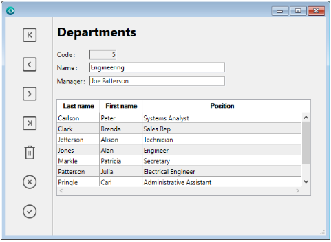
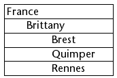
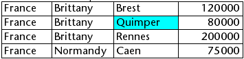
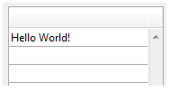

Los list boxes son objetos activos complejos que permiten mostrar e introducir datos en forma de columnas sincronizadas. Pueden vincularse a contenidos de la base de datos, como selecciones de entidades y secciones de registros, o a cualquier contenido del lenguaje, como colecciones y arrays. Incluyen funciones avanzadas relativas a la entrada de datos, la ordenación de columnas, la gestión de eventos, el aspecto personalizado, el desplazamiento de columnas, etc.



Un list box contiene una o varias columnas cuyo contenido se sincroniza automáticamente. El número de columnas es, en teoría, ilimitado (depende de los recursos de la máquina).

## Generalidades

### Principios de utilización básicos

Durante la ejecución, los list box permiten visualizar e introducir datos en forma de listas. Para hacer que una celda sea editable ([si se permite la entrada para la columna](#managing-entry)), basta con pulsar dos veces sobre el valor que contiene:


Los usuarios pueden introducir y mostrar el texto en varias líneas dentro de una celda de list box. Para añadir un salto de línea, presione **Ctrl+Retorno de carro** en Windows o **Opción+Retorno de carro** en macOS.

En las celdas se pueden mostrar booleanos e imágenes, así como fechas, horas o números. Es posible ordenar los valores de las columnas haciendo clic en un encabezado ([ordenación estándar](#managing-sorts)). Todas las columnas se sincronizan automáticamente.

También es posible cambiar el tamaño de cada columna, y el usuario puede modificar el orden de las [columnas](properties_ListBox.md#locked-columns-and-static-columns) y [líneas](properties_Action.md#movable-rows) moviéndolas con el ratón, si esta acción está autorizada. Tenga en cuenta que los list box se pueden utilizar en [modo jerárquico](#caja-de-lista-jerárquica).

El usuario puede seleccionar una o varias líneas utilizando los atajos estándar: **Mayúsculas+clic** para una selección adyacente y **Ctrl+clic** (Windows) o **Comando+clic** (macOS) para una selección no adyacente.

### Partes de list box

Un list box se compone de cuatro partes distintas:

* el objeto list box en su totalidad,
* las columnas,
* los encabezados de las columnas, y
* los pies de las columnas.


Cada parte tiene su propio nombre y propiedades específicas. Por ejemplo, el número de columnas o el color alternativo de cada línea se define en las propiedades del objeto list box, el ancho de cada columna se define en las propiedades de las columnas y el tipo de fuente del encabezado se define en las propiedades de los encabezados.

Es posible añadir un método objeto al objeto list box y/o a cada columna del list box. Los métodos objeto se llaman en el siguiente orden:

1. Método objeto de cada columna
2. Método objeto del list box

El método objeto de columna obtiene los eventos que se producen en su [encabezado](#list-box-headers) y [pie](#list-box-footers).

### Tipos de list box

Hay varios tipos de list box, con sus propios comportamientos y propiedades específicas. El tipo de list box depende de su [propiedad Fuente de datos](properties_Object.md#data-source):

* **Arrays**: cada columna está ligada a un array 4D. Los list boxes basados en arrays pueden mostrarse como [cajas de lista jerárquicas](listbox_overview.md#hierarchical-list-boxes).
* **Selección** (**Selección actual** o **Selección con nombre**): cada columna está vinculada a una expresión (por ejemplo, un campo) que se evalúa para cada registro de la selección.
* **Collection or Entity selection**: each column is bound to an expression which is evaluated for every element of the collection or every entity of the entity selection.
> > It is not possible to combine different list box types in the same list box object. La fuente de datos se define cuando se crea el list box. Entonces ya no es posible modificarlo por programación.

### Gestión de list boxes

You can completely configure a list box object through its properties, and you can also manage it dynamically through programming.

The 4D Language includes a dedicated "List Box" theme for list box commands, but commands from various other themes, such as "Object properties" commands or `EDIT ITEM`, `Displayed line number` commands can also be used. Refer to the [List Box Commands Summary](https://doc.4d.com/4Dv17R6/4D/17-R6/List-Box-Commands-Summary.300-4311159.en.html) page of the *4D Language reference* for more information.

## Objetos tipo List box

### List box de tipo array

En un list box de tipo array, cada columna debe estar asociada a un array unidimensional 4D; se pueden utilizar todos los tipos de array, a excepción de los arrays de punteros. El número de líneas se basa en el número de elementos del array.

Por defecto, 4D asigna el nombre "ColumnX" a cada columna. You can change it, as well as other column properties, in the [column properties](listbox_overview.md#column-specific-properties). The display format for each column can also be defined using the `OBJECT SET FORMAT` command.
> Array type list boxes can be displayed in [hierarchical mode](listbox_overview.md#hierarchical-list-boxes), with specific mechanisms.

Con los list box de tipo array, los valores introducidos o mostrados se gestionan utilizando el lenguaje 4D. You can also associate a [choice list](properties_DataSource.md#choice-list) with a column in order to control data entry. Los valores de las columnas se gestionan mediante comandos de alto nivel del tema List box (como `LISTBOX INSERT ROWS` o `LISTBOX DELETE ROWS`), así como comandos de manipulación de arrays. Por ejemplo, para inicializar el contenido de una columna, puede utilizar la siguiente instrucción:

```4d
ARRAY TEXT(varCol;size)
```

También puede utilizar una lista:

```4d
LIST TO ARRAY("ListName";varCol)
```
> **Atención**: cuando un objeto List box contiene varias columnas de diferentes tamaños, sólo se mostrará el número de elementos del array (columna) más pequeño. Debe asegurarse de que cada array tenga el mismo número de elementos que los demás. Además, si una columna del list box está vacía (esto ocurre cuando el array asociado no fue declarado o dimensionado correctamente con el lenguaje), el list box no muestra nada.

### List box de tipo selección

En este tipo de list box, cada columna puede estar asociada a un campo (por ejemplo `[Employees]LastName)` o a una expresión. The expression can be based on one or more fields (for example, `[Employees]FirstName+" "[Employees]LastName`) or it may simply be a formula (for example `String(Milliseconds)`). The expression can also be a project method, a variable or an array item. You can use the `LISTBOX SET COLUMN FORMULA` and `LISTBOX INSERT COLUMN FORMULA` commands to modify columns programmatically.

The contents of each row is then evaluated according to a selection of records: the **current selection** of a table or a **named selection**.

In the case of a list box based on the current selection of a table, any modification done from the database side is automatically reflected in the list box, and vice versa. The current selection is therefore always the same in both places.

### List box colección o entity selection

En este tipo de list box, cada columna debe estar asociada a una expresión. The contents of each row is then evaluated per collection element or per entity of the entity selection.

Each element of the collection or each entity is available as an object that can be accessed through the [This](../Concepts/classes.md#this) keyword. A column expression can be a property path, a project method, a variable, or any formula, accessing each entity or collection element object through `This`, for example `This.<propertyPath>` (or `This.value` in case of a collection of scalar values). You can use the `LISTBOX SET COLUMN FORMULA` and `LISTBOX INSERT COLUMN FORMULA` commands to modify columns programmatically.

When the data source is an entity selection, any modifications made on the list box side are automatically saved in the database. On the other hand, modifications made on the database side are visible in the list box after touched entities have been reloaded.

When the data source is a collection, any modifications made in the list box values are reflected in the collection. When the data source is a collection, any modifications made in the list box values are reflected in the collection. Por ejemplo:

```4d
myCol:=myCol.push("new value") //mostrar el nuevo valor en el list box
```

### Propiedades soportadas

Las propiedades soportadas dependen del tipo de list box.

| Propiedad                                                                                 | List box array | List box selección | List box colección o entity selection |
| ----------------------------------------------------------------------------------------- | -------------- | ------------------ | ------------------------------------- |
| [Color de fondo alternado](properties_BackgroundAndBorder.md#alternate-background-color)  | X              | X                  | X                                     |
| [Color de fondo](properties_BackgroundAndBorder.md#background-color)                      | X              | X                  | X                                     |
| [Negrita](properties_Text.md#bold)                                                        | X              | X                  | X                                     |
| [Expresión color de fondo](properties_BackgroundAndBorder.md#background-color-expression) |                | X                  | X                                     |
| [Estilo del borde](properties_BackgroundAndBorder.md#border-line-style)                   | X              | X                  | X                                     |
| [Abajo](properties_CoordinatesAndSizing.md#bottom)                                        | X              | X                  | X                                     |
| [Class](properties_Object.md#css-class)                                                   | X              | X                  | X                                     |
| [Collection o entity selection](properties_Object.md#collection-or-entity-selection)      |                | X                  | X                                     |
| [Redimensionamiento columnas auto](properties_ResizingOptions.md#column-auto-resizing)    | X              | X                  | X                                     |
| [Elemento actual](properties_DataSource.md#current-item)                                  |                |                    | X                                     |
| [Posición elemento actual](properties_DataSource.md#current-item-position)                |                |                    | X                                     |
| [Fuente de datos](properties_Object.md#data-source)                                       | X              | X                  | X                                     |
| [Nombre formulario detallado](properties_ListBox.md#detail-form-name)                     |                | X                  |                                       |
| [Mostrar encabezados](properties_Headers.md#display-headers)                              | X              | X                  | X                                     |
| [Mostrar pies](properties_Footers.md#display-footers)                                     | X              | X                  | X                                     |
| [Doble clic en línea](properties_ListBox.md#double-click-on-row)                          |                | X                  |                                       |
| [Arrastrable](properties_Action.md#droppable)                                             | X              | X                  | X                                     |
| [Soltable](properties_Action.md#droppable)                                                | X              | X                  | X                                     |
| [Focusable](properties_Entry.md#focusable)                                                | X              | X                  | X                                     |
| [Fuente](properties_Text.md#font)                                                         | X              | X                  | X                                     |
| [Color de fuente](properties_Text.md#font_color)                                          | X              | X                  | X                                     |
| [Expresión color fuente](properties_Text.md#font-color-expression)                        |                | X                  | X                                     |
| [Tamaño fuente](properties_Text.md#font-size)                                             | X              | X                  | X                                     |
| [Alto (list box)](properties_CoordinatesAndSizing.md#height)                              | X              | X                  | X                                     |
| [Alto (encabezados)](properties_Headers.md#height)                                        | X              | X                  | X                                     |
| [Alto (pies)](properties_Footers.md#height)                                               | X              | X                  | X                                     |
| [Ocultar líneas vacías finales](properties_BackgroundAndBorder.md#hide-extra-blank-rows)  | X              | X                  | X                                     |
| [Ocultar rectángulo de enfoque](properties_Appearance.md#hide-focus-rectangle)            | X              | X                  | X                                     |
| [Ocultar resaltado selección](properties_Appearance.md#hide-selection-highlight)          | X              | X                  | X                                     |
| [List box jerárquico](properties_Object.md#hierarchical-list-box)                         | X              |                    |                                       |
| [Conjunto resaltado](properties_ListBox.md#highlight-set)                                 |                | X                  |                                       |
| [Alineación horizontal](properties_Text.md#horizontal-alignment)                          | X              | X                  | X                                     |
| [Color líneas horizontales](properties_Gridlines.md#horizontal-line-color)                | X              | X                  | X                                     |
| [Barra de desplazamiento horizontal](properties_Appearance.md#horizontal-scroll-bar)      | X              | X                  | X                                     |
| [Dimensionamiento horizontal](properties_ResizingOptions.md#horizontal-sizing)            | X              | X                  | X                                     |
| [Itálica](properties_Text.md#italic)                                                      | X              | X                  | X                                     |
| [Izquierda](properties_CoordinatesAndSizing.md#left)                                      | X              | X                  | X                                     |
| [Tabla principal](properties_DataSource.md#table)                                         |                | X                  |                                       |
| [Meta info expression](properties_Text.md#meta-info-expression)                           |                |                    | X                                     |
| [Método](properties_Action.md#method)                                                     | X              | X                  | X                                     |
| [Líneas desplazables](properties_Action.md#movable-rows)                                  | X              |                    |                                       |
| [Selección temporal](properties_DataSource.md#selectionName)                              |                | X                  |                                       |
| [Número de columnas](properties_ListBox.md#number-of-columns)                             | X              | X                  | X                                     |
| [Número de columnas bloqueadas](properties_ListBox.md#number-of-locked-columns)           | X              | X                  | X                                     |
| [Número de columnas estáticas](properties_ListBox.md#number-of-static-columns)            | X              | X                  | X                                     |
| [Nombre del objeto](properties_Object.md#object-name)                                     | X              | X                  | X                                     |
| [Derecha](properties_CoordinatesAndSizing.md#right)                                       | X              | X                  | X                                     |
| [Array colores de fondo](properties_BackgroundAndBorder.md#row-background-color-array)    | X              |                    |                                       |
| [Array de control de líneas](properties_ListBox.md#row-control-array)                     | X              |                    |                                       |
| [Array colores de fuente](properties_Text.md#row-font-color-array)                        | X              |                    |                                       |
| [Altura de las líneas](properties_CoordinatesAndSizing.md#row-height)                     | X              |                    |                                       |
| [Array altura de las líneas](properties_CoordinatesAndSizing.md#row-height-array)         | X              |                    |                                       |
| [Array de estilos](properties_Text.md#row-style-array)                                    | X              |                    |                                       |
| [Elementos seleccionados](properties_DataSource.md#selected-items)                        |                |                    | X                                     |
| [Modo de selección](properties_ListBox.md#selection-mode)                                 | X              | X                  | X                                     |
| [Edición con un solo clic](properties_Entry.md#single-click-edit)                         | X              | X                  | X                                     |
| [Ordenable](properties_Action.md#sortable)                                                | X              | X                  | X                                     |
| [Acción estándar](properties_Action.md#standard-action)                                   | X              |                    |                                       |
| [Expresión estilo](properties_Text.md#style-expression)                                   |                | X                  | X                                     |
| [Arriba](properties_CoordinatesAndSizing.md#top)                                          | X              | X                  | X                                     |
| [Transparente](properties_BackgroundAndBorder.md#transparent)                             | X              | X                  | X                                     |
| [Type](properties_Object.md#type)                                                         | X              | X                  | X                                     |
| [Subrayado](properties_Text.md#underline)                                                 | X              | X                  | X                                     |
| [Variable o expresión](properties_Object.md#variable-or-expression)                       | X              | X                  |                                       |
| [Alineamiento vertical](properties_Text.md#vertical-alignment)                            | X              | X                  | X                                     |
| [Color líneas verticales](properties_Gridlines.md#vertical-line-color)                    | X              | X                  | X                                     |
| [Barra de desplazamiento vertical](properties_Appearance.md#vertical-scroll-bar)          | X              | X                  | X                                     |
| [Dimensionamiento vertical](properties_ResizingOptions.md#vertical-sizing)                | X              | X                  | X                                     |
| [Visibilidad](properties_Display.md#visibility)                                           | X              | X                  | X                                     |
| [Ancho](properties_CoordinatesAndSizing.md#width)                                         | X              | X                  | X                                     |

> Las columnas, los encabezados y los pies de list box soportan propiedades específicas.

### Eventos formulario soportados

| Evento formulario    | Propiedades adicionales devueltas (ver [Evento formulario](https://doc.4d.com/4Dv18/4D/18/FORM-Event.301-4522191.en.html) para las propiedades principales) | Comentarios                                                                                       |
| -------------------- | ----------------------------------------------------------------------------------------------------------------------------------------------------------- | ------------------------------------------------------------------------------------------------- |
| On After Edit        | <li>[column](#additional-properties)</li><li>[columnName](#additional-properties)</li><li>[row](#additional-properties)</li>                                                                                 |                                                                                                   |
| On After Keystroke   | <li>[column](#additional-properties)</li><li>[columnName](#additional-properties)</li><li>[row](#additional-properties)</li>                                                                                 |                                                                                                   |
| On After Sort        | <li>[column](#additional-properties)</li><li>[columnName](#additional-properties)</li><li>[headerName](#additional-properties)</li>                                                                                 | *Las fórmulas compuestas no se pueden ordenar. <br/>(e.g., This.firstName + This.lastName)* |
| On Alternative Click | <li>[column](#additional-properties)</li><li>[columnName](#additional-properties)</li><li>[row](#additional-properties)</li>                                                                               | *List box array únicamente*                                                                       |
| On Before Data Entry | <li>[column](#additional-properties)</li><li>[columnName](#additional-properties)</li><li>[row](#additional-properties)</li>                                                                              |                                                                                                   |
| On Before Keystroke  | <li>[column](#additional-properties)</li><li>[columnName](#additional-properties)</li><li>[row](#additional-properties)</li>                                                                              |                                                                                                   |
| On Begin Drag Over   | <li>[column](#additional-properties)</li><li>[columnName](#additional-properties)</li><li>[row](#additional-properties)</li>                                                                              |                                                                                                   |
| On Clicked           | <li>[column](#additional-properties)</li><li>[columnName](#additional-properties)</li><li>[row](#additional-properties)</li>                                                                              |                                                                                                   |
| On Close Detail      | <li>[row](#additional-properties)</li>                                                                                                                                  | *List box Selección actual & Selección temporal únicamente*                                       |
| On Collapse          | <li>[column](#additional-properties)</li><li>[columnName](#additional-properties)</li><li>[row](#additional-properties)</li>                                                                              | *List box jerárquicos únicamente*                                                                 |
| On Column Moved      | <li>[columnName](#additional-properties)</li><li>[newPosition](#additional-properties)</li><li>[oldPosition](#additional-properties)</li>                                                                              |                                                                                                   |
| On Column Resize     | <li>[column](#additional-properties)</li><li>[columnName](#additional-properties)</li><li>[newSize](#additional-properties)</li><li>[oldSize](#additional-properties)</li>                                                    |                                                                                                   |
| On Data Change       | <li>[column](#additional-properties)</li><li>[columnName](#additional-properties)</li><li>[row](#additional-properties)</li>                                                                              |                                                                                                   |
| On Delete Action     | <li>[row](#additional-properties)</li>                                                                                                                                  |                                                                                                   |
| On Display Detail    | <li>[isRowSelected](#additional-properties)</li><li>[row](#additional-properties)</li>                                                                                                        |                                                                                                   |
| On Double Clicked    | <li>[column](#additional-properties)</li><li>[columnName](#additional-properties)</li><li>[row](#additional-properties)</li>                                                                              |                                                                                                   |
| On Drag Over         | <li>[area](#additional-properties)</li><li>[areaName](#additional-properties)</li><li>[column](#additional-properties)</li><li>[columnName](#additional-properties)</li><li>[row](#additional-properties)</li>                          |                                                                                                   |
| On Drop              | <li>[column](#additional-properties)</li><li>[columnName](#additional-properties)</li><li>[row](#additional-properties)</li>                                                                              |                                                                                                   |
| On Expand            | <li>[column](#additional-properties)</li><li>[columnName](#additional-properties)</li><li>[row](#additional-properties)</li>                                                                              | *List box jerárquicos únicamente*                                                                 |
| On Footer Click      | <li>[column](#additional-properties)</li><li>[columnName](#additional-properties)</li><li>[footerName](#additional-properties)</li>                                                                              | *List box Arrays, Selección actual y Selección temporal únicamente*                               |
| On Getting Focus     | <li>[column](#additional-properties)</li><li>[columnName](#additional-properties)</li><li>[row](#additional-properties)</li>                                                                              | *Propiedades adicionales devueltas sólo al editar una celda*                                      |
| On Header Click      | <li>[column](#additional-properties)</li><li>[columnName](#additional-properties)</li><li>[headerName](#additional-properties)</li>                                                                              |                                                                                                   |
| On Load              |                                                                                                                                                             |                                                                                                   |
| On Losing Focus      | <li>[column](#additional-properties)</li><li>[columnName](#additional-properties)</li><li>[row](#additional-properties)</li>                                                                              | *Propiedades adicionales devueltas sólo cuando la modificación de una celda se completa*          |
| On Mouse Enter       | <li>[area](#additional-properties)</li><li>[areaName](#additional-properties)</li><li>[column](#additional-properties)</li><li>[columnName](#additional-properties)</li><li>[row](#additional-properties)</li>                          |                                                                                                   |
| On Mouse Leave       |                                                                                                                                                             |                                                                                                   |
| On Mouse Move        | <li>[area](#additional-properties)</li><li>[areaName](#additional-properties)</li><li>[column](#additional-properties)</li><li>[columnName](#additional-properties)</li><li>[row](#additional-properties)</li>                          |                                                                                                   |
| On Open Detail       | <li>[row](#additional-properties)</li>                                                                                                                                  | *List box Selección actual & Selección temporal únicamente*                                       |
| On Row Moved         | <li>[newPosition](#additional-properties)</li><li>[oldPosition](#additional-properties)</li>                                                                                                        | *List box array únicamente*                                                                       |
| On Selection Change  |                                                                                                                                                             |                                                                                                   |
| On Scroll            | <li>[horizontalScroll](#additional-properties)</li><li>[verticalScroll](#additional-properties)</li>                                                                                                        |                                                                                                   |
| On Unload            |                                                                                                                                                             |                                                                                                   |

#### Propiedades adicionales

Los eventos formulario de los objetos list box o columnas de list box pueden devolver las siguientes propiedades adicionales:

| Propiedad        | Type         | Descripción                                                                          |
| ---------------- | ------------ | ------------------------------------------------------------------------------------ |
| area             | text         | Área de objeto list box ("header", "footer", "cell")                                 |
| areaName         | text         | Nombre del área                                                                      |
| column           | entero largo | Número de columna                                                                    |
| columnName       | text         | Nombre de la columna                                                                 |
| footerName       | text         | Nombre del pie                                                                       |
| headerName       | text         | Nombre del encabezado                                                                |
| horizontalScroll | entero largo | Positivo si el desplazamiento es hacia la derecha, negativo si es hacia la izquierda |
| isRowSelected    | boolean      | True si la línea está seleccionada, de lo contrario False                            |
| newPosition      | entero largo | Nueva posición de la columna o línea                                                 |
| newSize          | entero largo | Nuevo tamaño (en píxeles) de la columna o línea                                      |
| oldPosition      | entero largo | Posición anterior de la columna o línea                                              |
| oldSize          | entero largo | Tamaño anterior (en píxeles) de la columna o línea                                   |
| row              | entero largo | Número de línea                                                                      |
| verticalScroll   | entero largo | Positivo si el desplazamiento es hacia abajo, negativo si es hacia arriba            |
> If an event occurs on a "fake" column or row that doesn't exist, an empty string is typically returned.

## Columnas de list box

A list box is made of one or more column object(s) which have specific properties. You can select a list box column in the Form editor by clicking on it when the list box object is selected:


You can set standard properties (text, background color, etc.) for each column of the list box; these properties take priority over those of the list box object properties.
> You can define the [Expression type](properties_Object.md#expression-type) for array list box columns (String, Text, Number, Date, Time, Picture, Boolean, or Object).

### Propiedades específicas de la columna

[Alpha Format](properties_Display.md#alpha-format) - [Alternate Background Color](properties_BackgroundAndBorder.md#alternate-background-color) - [Automatic Row Height](properties_CoordinatesAndSizing.md#automatic-row-height) - [Background Color](properties_Text.md#background-color) - [Background Color Expression](properties_BackgroundAndBorder.md#background-color-expression) - [Bold](properties_Text.md#bold) - [Choice List](properties_DataSource.md#choice-list) - [Class](properties_Object.md#css-class) - [Data Type (selection and collection list box column)](properties_DataSource.md#data-type) - [Date Format](properties_Display.md#date-format) - [Default Values](properties_DataSource.md#default-values) - [Display Type](properties_Display.md#display-type) - [Enterable](properties_Entry.md#enterable) - [Entry Filter](properties_Entry.md#entry-filter) - [Excluded List](properties_RangeOfValues.md#excluded-list) - [Expression](properties_DataSource.md#expression) - [Expression Type (array list box column)](properties_Object.md#expression-type) - [Font](properties_Text.md#font) - [Font Color](properties_Text.md#font-color) - [Horizontal Alignment](properties_Text.md#horizontal-alignment) - [Italic](properties_Text.md#italic) - [Invisible](properties_Display.md#visibility) - [Maximum Width](properties_CoordinatesAndSizing.md#maximum-width) - [Method](properties_Action.md#method) - [Minimum Width](properties_CoordinatesAndSizing.md#minimum-width) - [Multi-style](properties_Text.md#multi-style) - [Number Format](properties_Display.md#number-format) - [Object Name](properties_Object.md#object-name) - [Picture Format](properties_Display.md#picture-format) - [Resizable](properties_ResizingOptions.md#resizable) - [Required List](properties_RangeOfValues.md#required-list) - [Row Background Color Array](properties_BackgroundAndBorder.md#row-background-color-array) - [Row Font Color Array](properties_Text.md#row-font-color-array) - [Row Style Array](properties_Text.md#row-style-array) - [Save as](properties_DataSource.md#save-as) - [Style Expression](properties_Text.md#style-expression) - [Text when False/Text when True](properties_Display.md#text-when-false-text-when-true) - [Time Format](properties_Display.md#time-format) - [Truncate with ellipsis](properties_Display.md#truncate-with-ellipsis) - [Underline](properties_Text.md#underline) - [Variable or Expression](properties_Object.md#variable-or-expression) - [Vertical Alignment](properties_Text.md#vertical-alignment) - [Width](properties_CoordinatesAndSizing.md#width) - [Wordwrap](properties_Display.md#wordwrap)

### Eventos formulario soportados

| Evento formulario    | Propiedades adicionales devueltas (ver [Evento formulario](https://doc.4d.com/4Dv18/4D/18/FORM-Event.301-4522191.en.html) para las propiedades principales) | Comentarios                                                                                       |
| -------------------- | ----------------------------------------------------------------------------------------------------------------------------------------------------------- | ------------------------------------------------------------------------------------------------- |
| On After Edit        | <li>[column](#additional-properties)</li><li>[columnName](#additional-properties)</li><li>[row](#additional-properties)</li>                                                                              |                                                                                                   |
| On After Keystroke   | <li>[column](#additional-properties)</li><li>[columnName](#additional-properties)</li><li>[row](#additional-properties)</li>                                                                              |                                                                                                   |
| On After Sort        | <li>[column](#additional-properties)</li><li>[columnName](#additional-properties)</li><li>[headerName](#additional-properties)</li>                                                                              | *Las fórmulas compuestas no se pueden ordenar. <br/>(e.g., This.firstName + This.lastName)* |
| On Alternative Click | <li>[column](#additional-properties)</li><li>[columnName](#additional-properties)</li><li>[row](#additional-properties)</li>                                                                              | *List box array únicamente*                                                                       |
| On Before Data Entry | <li>[column](#additional-properties)</li><li>[columnName](#additional-properties)</li><li>[row](#additional-properties)</li>                                                                              |                                                                                                   |
| On Before Keystroke  | <li>[column](#additional-properties)</li><li>[columnName](#additional-properties)</li><li>[row](#additional-properties)</li>                                                                              |                                                                                                   |
| On Begin Drag Over   | <li>[column](#additional-properties)</li><li>[columnName](#additional-properties)</li><li>[row](#additional-properties)</li>                                                                           |                                                                                                   |
| On Clicked           | <li>[column](#additional-properties)</li><li>[columnName](#additional-properties)</li><li>[row](#additional-properties)</li>                                                                           |                                                                                                   |
| On Column Moved      | <li>[columnName](#additional-properties)</li><li>[newPosition](#additional-properties)</li><li>[oldPosition](#additional-properties)</li>                                                                           |                                                                                                   |
| On Column Resize     | <li>[column](#additional-properties)</li><li>[columnName](#additional-properties)</li><li>[newSize](#additional-properties)</li><li>[oldSize](#additional-properties)</li>                                                |                                                                                                   |
| On Data Change       | <li>[column](#additional-properties)</li><li>[columnName](#additional-properties)</li><li>[row](#additional-properties)</li>                                                                           |                                                                                                   |
| On Double Clicked    | <li>[column](#additional-properties)</li><li>[columnName](#additional-properties)</li><li>[row](#additional-properties)</li>                                                                           |                                                                                                   |
| On Drag Over         | <li>[area](#additional-properties)</li><li>[areaName](#additional-properties)</li><li>[column](#additional-properties)</li><li>[columnName](#additional-properties)</li><li>[row](#additional-properties)</li>                     |                                                                                                   |
| On Drop              | <li>[column](#additional-properties)</li><li>[columnName](#additional-properties)</li><li>[row](#additional-properties)</li>                                                                           |                                                                                                   |
| On Footer Click      | <li>[column](#additional-properties)</li><li>[columnName](#additional-properties)</li><li>[footerName](#additional-properties)</li>                                                                           | *List box Arrays, Selección actual y Selección temporal únicamente*                               |
| On Getting Focus     | <li>[column](#additional-properties)</li><li>[columnName](#additional-properties)</li><li>[row](#additional-properties)</li>                                                                           | *Propiedades adicionales devueltas sólo al editar una celda*                                      |
| On Header Click      | <li>[column](#additional-properties)</li><li>[columnName](#additional-properties)</li><li>[headerName](#additional-properties)</li>                                                                           |                                                                                                   |
| On Load              |                                                                                                                                                             |                                                                                                   |
| On Losing Focus      | <li>[column](#additional-properties)</li><li>[columnName](#additional-properties)</li><li>[row](#additional-properties)</li>                                                                           | *Propiedades adicionales devueltas sólo cuando la modificación de una celda se completa*          |
| On Row Moved         | <li>[newPosition](#additional-properties)</li><li>[oldPosition](#additional-properties)</li>                                                                                                      | *List box array únicamente*                                                                       |
| On Scroll            | <li>[horizontalScroll](#additional-properties)</li><li>[verticalScroll](#additional-properties)</li>                                                                                                      |                                                                                                   |
| On Unload            |                                                                                                                                                             |                                                                                                   |

## Encabezados de list box

> Para poder acceder a las propiedades de los pies de un list box, debe activar la opción [Mostrar pies](properties_Footers.md#display-footers).

Cuando se muestran los encabezados, puede seleccionar un encabezado en el editor de formularios haciendo clic en él cuando el objeto List box esté seleccionado:


Puede definir propiedades de texto estándar para cada encabezado de columna de List box; en este caso, estas propiedades tienen prioridad sobre las de la columna o del propio List box.

Además, tiene acceso a las propiedades específicas de los encabezados. Specifically, an icon can be displayed in the header next to or in place of the column title, for example when performing [customized sorts](#managing-sorts).


At runtime, events that occur in a header are generated in the [list box column object method](#object-methods).

When the `OBJECT SET VISIBLE` command is used with a header, it is applied to all headers, regardless of the individual element set by the command. For example, `OBJECT SET VISIBLE(*;"header3";False)` will hide all headers in the list box object to which *header3* belongs and not simply this header.

### Propiedades específicas de los encabezados

[Negrita](properties_Text.md#bold) - [Clase Css](properties_Object.md#css-class) - [Fuente](properties_Text.md#font) - [Color de fuente](properties_Text.md#font-color) - [Mensaje de ayuda](properties_Help.md#help-tip) - [Alineación horizontal](properties_Text.md#horizontal-alignment) - [Icon Location](properties_TextAndPicture.md#icon-location) - [Itálica](properties_Text.md#italic) - [Nombre de objeto](properties_Object.md#object-name) - [Ruta de acceso](properties_TextAndPicture.md#picture-pathname) - [Título](properties_Object.md#title) - [Subrayado](properties_Text.md#underline) - [Variable o Expresión](properties_Object.md#variable-or-expression) - [Alineación vertical](properties_Text.md#vertical-alignment) - [Ancho](properties_CoordinatesAndSizing.md#width)

## Pies de list box
> Para poder acceder a las propiedades de los encabezados de un list box, debe activar la opción [Mostrar encabezados](properties_Headers.md#display-headers) del list box.

Los List box pueden contener "pies de página" no editables, que muestren información adicional. En el caso de los datos mostrados en forma de tabla, los pies de página suelen utilizarse para mostrar cálculos como los totales o los promedios.

Cuando se muestran los pies, puede hacer clic para seleccionar un pie de list box en el editor de formularios haciendo clic en el objeto:


Para cada pie de columna de list box, puede definir propiedades de texto estándar: en este caso, estas propiedades tienen prioridad sobre las de la columna o del list box. También puede acceder a propiedades específicas para los pies de página. In particular, you can insert a [custom or automatic calculation](properties_Object.md#variable-calculation).

At runtime, events that occur in a footer are generated in the [list box column object method](#object-methods).

When the `OBJECT SET VISIBLE` command is used with a footer, it is applied to all footers, regardless of the individual element set by the command. For example, `OBJECT SET VISIBLE(*;"footer3";False)` will hide all footers in the list box object to which *footer3* belongs and not simply this footer.

### Propiedades específicas de los pies

[Alpha Format](properties_Display.md#alpha-format) - [Background Color](properties_BackgroundAndBorder.md#background-color-fill-color) - [Bold](properties_Text.md#bold) - [Class](properties_Object.md#css-class) - [Date Format](properties_Display.md#date-format) - [Expression Type](properties_Object.md#expression-type) - [Font](properties_Text.md#font) - [Font Color](properties_Text.md#font-color) - [Help Tip](properties_Help.md#help-tip) - [Horizontal Alignment](properties_Text.md#horizontal-alignment) - [Italic](properties_Text.md#italic) - [Number Format](properties_Display.md#number-format) - [Object Name](properties_Object.md#object-name) - [Picture Format](properties_Display.md#picture-format) - [Time Format](properties_Display.md#time-format) - [Truncate with ellipsis](properties_Display.md#truncate-with-ellipsis) - [Underline](properties_Text.md#underline) - [Variable Calculation](properties_Object.md#variable-calculation) - [Variable or Expression](properties_Object.md#variable-or-expression) - [Vertical Alignment](properties_Text.md#vertical-alignment) - [Width](properties_CoordinatesAndSizing.md#width) - [Wordwrap](properties_Display.md#wordwrap)

## Gestión de entrada

For a list box cell to be enterable, both of the following conditions must be met:

* The cell’s column must have been set as [Enterable](properties_Entry.md#enterable) (otherwise, the cells of the column can never be enterable).
* En el evento `On Before Data Entry`, $0 no devuelve -1. When the cursor arrives in the cell, the `On Before Data Entry` event is generated in the column method. Si, en el contexto de este evento, $0 se define como -1, la celda se considera como no editable. Si el evento se generó después de presionar **Tab** o **Mayús+Tab**, el foco pasa a la siguiente celda o a la anterior, respectivamente. Si $0 no es -1 (por defecto $0 es 0), la celda se puede introducir y pasa al modo de edición.

Let’s consider the example of a list box containing two arrays, one date and one text. The date array is not enterable but the text array is enterable if the date has not already past.


Aquí está el método de la columna *arrText*:

```4d
 Case of
    :(FORM event.code=On Before Data Entry) // una celda obtiene el foco
     LISTBOX GET CELL POSITION(*;"lb";$col;$row)
  // identification of cell
       If(arrDate{$row}<Current date) // si la fecha es anterior a hoy
          $0:=-1 // la celda NO  es editable
       Else
  // de lo contrario, la celda es editable
       End if
 End case
```

The `On Before Data Entry` event is returned before `On Getting Focus`.

In order to preserve data consistency for selection type and entity selection type list boxes, any modified record/entity is automatically saved as soon as the cell is validated, i.e.:

* cuando se desactiva la celda (el usuario presiona el tabulador, hace clic, etc.)
* cuando el listbox ya no tiene el foco,
* cuando el formulario ya no tiene el foco.

The typical sequence of events generated during data entry or modification is as follows:

| Acción                                                                          | Tipo(s) de Listbox                      | Secuencia de eventos                                                                                                                                                                                                |
| ------------------------------------------------------------------------------- | --------------------------------------- | ------------------------------------------------------------------------------------------------------------------------------------------------------------------------------------------------------------------- |
| A cell switches to edit mode (user action or a call to the `EDIT ITEM` command) | Todos                                   | On Before Data Entry                                                                                                                                                                                                |
|                                                                                 | Todos                                   | On Getting Focus                                                                                                                                                                                                    |
| Cuando se ha editado el valor de una celda                                      | Todos                                   | On Before Keystroke                                                                                                                                                                                                 |
|                                                                                 | Todos                                   | On After Keystroke                                                                                                                                                                                                  |
|                                                                                 | Todos                                   | On After Edit                                                                                                                                                                                                       |
| Un usuario valida y abandona la celda                                           | List box de tipo selección              | Guardar                                                                                                                                                                                                             |
|                                                                                 | List box de tipo selección de registro  | Activación de On saving an existing record (si definido)                                                                                                                                                            |
|                                                                                 | List box de tipo selección              | On Data Change(*)                                                                                                                                                                                                   |
|                                                                                 | List box de tipo selección de entidades | Entity is saved with automerge option, optimistic lock (see entity.save( )). In case of successful save, the entity is refreshed with the last update done. Si la operación de guardado falla, se mostrará un error |
|                                                                                 | Todos                                   | On Losing Focus                                                                                                                                                                                                     |

(*) With entity selection list boxes, in the On Data Change event:

* the [Current item](properties_DataSource.md#current-item) object contains the value before modification.
* the `This` object contains the modified value.

> Data entry in collection/entity selection type list boxes has a limitation when the expression evaluates to null. In this case, it is not possible to edit or remove the null value in the cell.

## Gestión de selecciones

La gestión de selecciones es diferente dependiendo de si el list box se basa en un array, en una selección de registros o en una selección de colecciones/entidades:

* **Lista box de tipo selección**: las selecciones se gestionan mediante un conjunto llamado por defecto `$ListboxSetX` (donde X empieza en 0 y se incrementa en función del número de list box en el formulario), que puede modificar si es necesario. Este conjunto se [define en las propiedades](properties_ListBox.md#highlight-set) del list box. Es mantenido automáticamente por 4D: si el usuario selecciona una o más líneas en el list box, el conjunto se actualiza inmediatamente. Por otra parte, también es posible utilizar los comandos del tema "Conjuntos" para modificar por programación la selección en el list box.

* **List box de tipo colección/selección de entidades**: las selecciones se gestionan a través de las propiedades del list box dedicado:
  * [Elemento actual](properties_DataSource.md#current-item) es un objeto que recibirá el elemento/la entidad seleccionado(a)
  * [Elementos seleccionados](properties_DataSource.md#selected-items) es una colección de elementos seleccionados
  * [Posición del elemento actual](properties_DataSource.md#current-item-position) devuelve la posición del elemento o de la entidad seleccionada.

* **List box de tipo array**: el comando `LISTBOX SELECT ROW` puede utilizarse para seleccionar una o más líneas del list box por programación. La [variable asociada al objeto List box](propiedades_Objeto.md#variable-o-expresión) se utiliza para obtener, definir o almacenar las selecciones de líneas en el objeto. Esta variable corresponde a un array de booleanos que es creado y mantenido automáticamente por 4D. El tamaño de este array viene determinado por el tamaño del list box: contiene el mismo número de elementos que el array más pequeño asociado a las columnas. Cada elemento de este array contiene `True` si se selecciona la línea correspondiente y `False` en caso contrario. 4D actualiza el contenido de este array en función de las acciones del usuario. Por el contrario, puede cambiar el valor de los elementos del array para cambiar la selección en el list box. Por otra parte, no se pueden insertar ni borrar líneas en este array; tampoco se pueden reescribir las líneas. El comando `Count in array` puede utilizarse para averiguar el número de líneas seleccionadas. Por ejemplo, este método permite invertir la selección de la primera línea del list box (tipo array):

```4d
 ARRAY BOOLEAN(tBListBox;10)
  //tBListBox es el nombre de la variable asociada al list box en el formulario
 If(tBListBox{1}=True)
    tBListBox{1}:=False
 Else
    tBListBox{1}:=True
 End if
```

> The `OBJECT SET SCROLL POSITION` command scrolls the list box rows so that the first selected row or a specified row is displayed.

### Personalizar la apariencia de las líneas seleccionadas

When the [Hide selection highlight](properties_Appearance.md#hide-selection-highlight) option is selected, you need to make list box selections visible using available interface options. Dado que las selecciones siguen siendo gestionadas en su totalidad por 4D, esto significa:

* For array type list boxes, you must parse the Boolean array variable associated with the list box to determine which rows are selected or not.
* For selection type list boxes, you have to check whether the current record (row) belongs to the set specified in the [Highlight Set](properties_ListBox.md#highlight-set) property of the list box.

You can then define specific background colors, font colors and/or font styles by programming to customize the appearance of selected rows. This can be done using arrays or expressions, depending on the type of list box being displayed (see the following sections).

> You can use the `lk inherited` constant to mimic the current appearance of the list box (e.g., font color, background color, font style, etc.).

#### List box de tipo selección

To determine which rows are selected, you have to check whether they are included in the set indicated in the [Highlight Set](properties_ListBox.md#highlight-set) property of the list box. You can then define the appearance of selected rows using one or more of the relevant [color or style expression property](#using-arrays-and-expressions).

Tenga en cuenta que las expresiones se reevalúan automáticamente cada vez que:

* la selección de list box cambia.
* list box obtiene o pierde el foco.
* form window containing the list box becomes, or ceases to be, the frontmost window.

#### List box de tipo array

You have to parse the Boolean array [Variable or Expression](properties_Object.md#variable-or-expression) associated with the list box to determine whether rows are selected or not selected.

You can then define the appearance of selected rows using one or more of the relevant [color or style array property](#using-arrays-and-expressions).

Note that list box arrays used for defining the appearance of selected rows must be recalculated during the `On Selection Change` form event; however, you can also modify these arrays based on the following additional form events:

* `On Getting Focus` (propiedad list box)
* `On Losing Focus` (propiedad list box)
* `On Activate` (propiedad list box)
* `On Deactivate` (form property) ...depending on whether and how you want to visually represent changes of focus in selections.

##### Ejemplo

You have chosen to hide the system highlight and want to display list box selections with a green background color, as shown here:


For an array type list box, you need to update the [Row Background Color Array](properties_BackgroundAndBorder.md#row-background-color-array) by programming. In the JSON form, you have defined the following Row Background Color Array for the list box:

```
 "rowFillSource": "_ListboxBackground",
```

En el método objeto del list box, puede escribir:

```4d
 Case of
    :(FORM event.code=On Selection Change)
       $n:=Size of array(LB_Arrays)
       ARRAY LONGINT(_ListboxBackground;$n) // colores de fondo de la línea
       For($i;1;$n)
          If(LB_Arrays{$i}=True) // selected
             _ListboxBackground{$i}:=0x0080C080 // fondo verde
          Else // not selected
             _ListboxBackground{$i}:=lk inherited
          End if
       End for
 End case
```

For a selection type list box, to produce the same effect you can use a method to update the [Background Color Expression](properties_BackgroundAndBorder.md#background-color-expression) based on the set specified in the [Highlight Set](properties_ListBox.md#highlight-set) property.

For example, in the JSON form, you have defined the following Highlight Set and Background Color Expression for the list box:

```
 "highlightSet": "$SampleSet",
 "rowFillSource": "UI_SetColor",
```

Puede escribir en el método *UI_SetColor*:

```4d
 If(Is in set("$SampleSet"))
    $color:=0x0080C080 // fondo verde
 Else
    $color:=lk inherited
 End if

 $0:=$color
```

> In hierarchical list boxes, break rows cannot be highlighted when the [Hide selection highlight](properties_Appearance.md#hide-selection-highlight) option is checked. Since it is not possible to have distinct colors for headers of the same level, there is no way to highlight a specific break row by programming.

## Gestión de ordenaciones

Un orden en un list box puede ser estándar o personalizado. When a column of a list box is sorted, all other columns are always synchronized automatically.

### Ordenación estándar

By default, a list box provides standard column sorts when the header is clicked. A standard sort is an alphanumeric sort of evaluated column values, alternately ascending/descending with each successive click.

You can enable or disable standard user sorts by disabling the [Sortable](properties_Action.md#sortable) property of the list box (enabled by default).

El soporte de ordenación estándar depende del tipo de list box:

| Tipo de list box               | Support of standard sort | Comentarios                                                                                                  |
| ------------------------------ | ------------------------ | ------------------------------------------------------------------------------------------------------------ |
| Colección de objetos           | Sí                       | <li>Las columnas "This.a" o "This.a.b" son ordenables.</li><li>The [list box source property](properties_Object.md#variable-or-expression) must be an [assignable expression](../Concepts/quick-tour.md#assignable-vs-non-assignable-expressions).</li>                                                       |
| Colección de valores escalares | No                       | Use custom sort with [`orderBy()`](..\API\CollectionClass.md#orderby) function                             |
| Entity selection               | Sí                       | <li>The [list box source property](properties_Object.md#variable-or-expression) must be an [assignable expression](../Concepts/quick-tour.md#assignable-vs-non-assignable-expressions).</li><li>Supported: sorts on object attribute properties (e.g. "This.data.city" when "data" is an object attribute)</li><li>Soportado: ordena los atributos relacionados (por ejemplo, "This.company.name")</li><li>Not supported: sorts on object attribute properties through related attributes (e.g. "This.company.data.city"). For this, you need to use custom sort with [`orderByFormula()`](..\API\EntitySelectionClass.md#orderbyformula) function (see example below)</li> |
| Selección actual               | Sí                       | Sólo se pueden ordenar las expresiones simples (por ejemplo, `[Table_1]Campo_2`)                             |
| Named selection                | No                       |                                                                                                              |
| Arrays                         | Sí                       | Las columnas vinculadas a arrays de imágenes y punteros no se pueden ordenar                                 |

### Ordenación personalizada

The developer can set up custom sorts, for example using the [`LISTBOX SORT COLUMNS`](https://doc.4d.com/4dv19/help/command/en/page916.html) command and/or combining the [`On Header Click`](../Events/onHeaderClick) and [`On After Sort`](../Events/onAfterSort) form events and relevant 4D commands.

Los ordenamientos personalizados le permiten:

* carry out multi-level sorts on several columns, thanks to the [`LISTBOX SORT COLUMNS`](https://doc.4d.com/4dv19/help/command/en/page916.html) command,
* use functions such as [`collection.orderByFormula()`](..\API\CollectionClass.md#orderbyformula) or [`entitySelection.orderByFormula()`](..\API\EntitySelectionClass.md#orderbyformula) to sort columns on complex criteria.

#### Ejemplo

You want to sort a list box using values of a property stored in a related object attribute. Tiene la siguiente estructura:


You design a list box of the entity selection type, bound to the `Form.child` expression. In the `On Load` form event, you execute `Form.child:=ds.Child.all()`.

You display two columns:

| Nombre del hijo | Apodo del padre              |
| --------------- | ---------------------------- |
| `This.name`     | `This.parent.extra.nickname` |

If you want to sort the list box using the values of the second column, you have to write:

```4d
If (Form event code=On Header Click)
 Form.child:=Form.child.orderByFormula("This.parent.extra.nickname"; dk ascending)
End if
```

### Variable de encabezado de columna

The value of the [column header variable](properties_Object.md#variable-or-expression) allows you to manage additional information: the current sort of the column (read) and the display of the sort arrow.

* If the variable is set to 0, the column is not sorted and the sort arrow is not displayed.  
  

* If the variable is set to 1, the column is sorted in ascending order and the sort arrow is displayed. 

* If the variable is set to 2, the column is sorted in descending order and the sort arrow is displayed. 

> Only declared or dynamic [variables](Concepts/variables.md) can be used as header column variables. Other kinds of [expressions](Concepts/quick-tour.md#expressions) such as `Form.sortValue` are not supported.

You can set the value of the variable (for example, Header2:=2) in order to "force" the sort arrow display. The column sort itself is not modified in this case; it is up to the developer to handle it.

> The [`OBJECT SET FORMAT`](https://doc.4d.com/4dv19/help/command/en/page236.html) command offers specific support for icons in list box headers, which can be useful when you want to work with a customized sort icon.

## Gestión de los colores, estilos y visualización de las líneas

There are several different ways to set background colors, font colors and font styles for list boxes:

* at the level of the [list box object properties](#list-box-objects),
* a nivel de las [propiedades de la columna](#list-box-columns),
* using [arrays or expressions properties](#using-arrays-and-expressions) for the list box and/or for each column,
* at the level of the text of each cell (if [multi-style text](properties_Text.md#multi-style)).

### Prioridad & herencia

Priority and inheritance principles are observed when the same property is set at more than one level.

| Nivel de prioridad | Ubicación del parámetro                                                                  |
| ------------------ | ---------------------------------------------------------------------------------------- |
| alta prioridad     | Celda (si texto multiestilo)                                                             |
|                    | Arrays de columnas/métodos                                                               |
|                    | Arrays/métodos de Listbox                                                                |
|                    | Propiedades de la columna                                                                |
|                    | Propiedades de list box                                                                  |
| baja prioridad     | Expresiones de metainformación (para colecciones o list boxes de selección de entidades) |

For example, if you set a font style in the list box properties and another using a style array for the column, the latter one will be taken into account.

For each attribute (style, color and background color), an **inheritance** is implemented when the default value is used:

* para los atributos de las celdas: valores de atributos de las líneas
* para los atributos líneas: valores de atributos de columnas
* para los atributos de la columna: valores de los atributos del list box

This way, if you want an object to inherit the attribute value from a higher level, you can use pass the `lk inherited` constant (default value) to the definition command or directly in the element of the corresponding style/color array. For example, given an array list box containing a standard font style with alternating colors: 

Realiza las siguientes modificaciones:

* change the background of row 2 to red using the [Row Background Color Array](properties_BackgroundAndBorder.md#row-background-color-array) property of the list box object,
* change the style of row 4 to italics using the [Row Style Array](properties_Text.md#row-style-array) property of the list box object,
* two elements in column 5 are changed to bold using the [Row Style Array](properties_Text.md#row-style-array) property of the column 5 object,
* the 2 elements for column 1 and 2 are changed to dark blue using the [Row Background Color Array](properties_BackgroundAndBorder.md#row-background-color-array) property for the column 1 and 2 objects:


Para restaurar la apariencia original de la caja del list box, puede:

* pass the `lk inherited` constant in element 2 of the background color arrays for columns 1 and 2: then they inherit the red background color of the row.
* pass the `lk inherited` constant in elements 3 and 4 of the style array for column 5: then they inherit the standard style, except for element 4, which changes to italics as specified in the style array of the list box.
* pass the `lk inherited` constant in element 4 of the style array for the list box in order to remove the italics style.
* pass the `lk inherited` constant in element 2 of the background color array for the list box in order to restore the original alternating color of the list box.

### Uso de arrays y expresiones

Depending of the list box type, you can use different properties to customize row colors, styles and display:

| Propiedad       | List box array                                                                         | List box selección                                                                        | List box colección o entity selection                                                                                                                           |
| --------------- | -------------------------------------------------------------------------------------- | ----------------------------------------------------------------------------------------- | --------------------------------------------------------------------------------------------------------------------------------------------------------------- |
| Color de fondo  | [Array colores de fondo](properties_BackgroundAndBorder.md#row-background-color-array) | [Expresión color de fondo](properties_BackgroundAndBorder.md#background-color-expression) | [Background Color Expression](properties_BackgroundAndBorder.md#background-color-expression) or [Meta info expression](properties_Text.md#meta-info-expression) |
| Color de fuente | [Array colores de fuente](properties_Text.md#row-font-color-array)                     | [Expresión color fuente](properties_Text.md#font-color-expression)                        | [Font Color Expression](properties_Text.md#font-color-expression) or [Meta info expression](properties_Text.md#meta-info-expression)                            |


[Row Style Array](properties_Text.md#row-style-array)|[Style Expression](properties_Text.md#style-expression)|[Style Expression](properties_Text.md#style-expression) or [Meta info expression](properties_Text.md#meta-info-expression)| Display|[Row Control Array](properties_ListBox.md#row-control-array)|-|-|

## Imprimir list boxes

Two printing modes are available: **preview mode** - which can be used to print a list box like a form object, and **advanced mode** - which lets you control the printing of the list box object itself within the form. Note that the "Printing" appearance is available for list box objects in the Form editor.

### Modo de vista previa

Printing a list box in preview mode consists of directly printing the list box and the form that contains it using the standard print commands or the **Print** menu command. El list box se imprime tal como está en el formulario. This mode does not allow precise control of the printing of the object; in particular, it does not allow you to print all the rows of a list box that contains more rows than it can display.

### Modo avanzado

In this mode, the printing of list boxes is carried out by programming, via the `Print object` command (project forms and table forms are supported). The `LISTBOX GET PRINT INFORMATION` command is used to control the printing of the object.

En este modo:

* The height of the list box object is automatically reduced when the number of rows to be printed is less than the original height of the object (there are no "blank" rows printed). On the other hand, the height does not automatically increase according to the contents of the object. The size of the object actually printed can be obtained via the `LISTBOX GET PRINT INFORMATION` command.
* The list box object is printed "as is", in other words, taking its current display parameters into account: visibility of headers and gridlines, hidden and displayed rows, etc. These parameters also include the first row to be printed: if you call the `OBJECT SET SCROLL POSITION` command before launching the printing, the first row printed in the list box will be the one designated by the command.
* An automatic mechanism facilitates the printing of list boxes that contain more rows than it is possible to display: successive calls to `Print object` can be used to print a new set of rows each time. The `LISTBOX GET PRINT INFORMATION` command can be used to check the status of the printing while it is underway.

## List box jerárquicos

Un list box jerárquico es un list box en el que el contenido de la primera columna aparece en forma jerárquica. Este tipo de representación se adapta a la presentación de información que incluye valores repetidos y/o que dependen jerárquicamente (país/región/ciudad, etc.).

> Sólo los [list box de tipo array](#array-list-boxes) pueden ser jerárquicos.

Los list box jerárquicos son una forma particular de representar los datos, pero no modifican la estructura de datos (arrays). Los list box jerárquicos se gestionan exactamente igual que los list box clásicos.

### Definir una jerarquía

Para definir un list box jerárquico, existen varias posibilidades:

* Configurar manualmente los elementos jerárquicos utilizando la lista de propiedades del editor de formularios (o editar el formulario JSON).
* Generar visualmente la jerarquía utilizando el menú emergente de gestión de list box, en el editor de formularios.
* Use the [LISTBOX SET HIERARCHY](https://doc.4d.com/4Dv17R5/4D/17-R5/LISTBOX-SET-HIERARCHY.301-4127969.en.html) and [LISTBOX GET HIERARCHY](https://doc.4d.com/4Dv17R5/4D/17-R5/LISTBOX-GET-HIERARCHY.301-4127970.en.html) commands, described in the *4D Language Reference* manual.

#### Propiedades del List Box jerárquico

This property specifies that the list box must be displayed in hierarchical form. In the JSON form, this feature is triggered [when the *dataSource* property value is an array](properties_Object.md#hierarchical-list-box), i.e. a collection.

Additional options (**Variable 1...10**) are available when the *Hierarchical List Box* option is selected, corresponding to each *dataSource* array to use as break column. Cada vez que se introduce un valor en un campo, se añade una nueva línea. Se pueden especificar hasta 10 variables. These variables set the hierarchical levels to be displayed in the first column.

The first variable always corresponds to the name of the variable for the first column of the list box (the two values are automatically bound). Esta primera variable está siempre visible y se puede editar. Por ejemplo: country. The second variable is also always visible and enterable; it specifies the second hierarchical level. Por ejemplo: regions. Beginning with the third field, each variable depends on the one preceding it. Por ejemplo: counties, cities, etc. Se puede especificar un máximo de diez niveles jerárquicos. Si se elimina un valor, toda la jerarquía sube de nivel.

The last variable is never hierarchical even if several identical values exists at this level. For example, referring to the configuration illustrated above, imagine that arr1 contains the values A A A B B B, arr2 has the values 1 1 1 2 2 2 and arr3 the values X X Y Y Y Z. In this case, A, B, 1 and 2 could appear in collapsed form, but not X and Y:


This principle is not applied when only one variable is specified in the hierarchy: in this case, identical values may be grouped.
> If you specify a hierarchy based on the first columns of an existing list box, you must then remove or hide these columns (except for the first), otherwise they will appear in duplicate in the list box. If you specify the hierarchy via the pop-up menu of the editor (see below), the unnecessary columns are automatically removed from the list box.

#### Crear una jerarquía mediante el menú contextual

When you select at least one column in addition to the first one in a list box object (of the array type) in the form editor, the **Create hierarchy** command is available in the context menu:


Este comando es un acceso directo para definir una jerarquía. Cuando se selecciona, se llevan a cabo las siguientes acciones:

* The **Hierarchical list box** option is checked for the object in the Property List.
* Las variables de las columnas se utilizan para definir la jerarquía. Reemplazan las variables ya definidas.
* Las columnas seleccionadas ya no aparecen en el list box (excepto el título de la primera).

Ejemplo: dado un list box cuyas primeras columnas contienen País, Región, Ciudad y Población. When Country, Region and City are selected, if you choose **Create hierarchy** in the context menu, a three-level hierarchy is created in the first column, columns 2 and 3 are removed and the Population column becomes the second:


##### Cancelar jerarquía

When the first column is selected and already specified as hierarchical, you can use the **Cancel hierarchy** command. Cuando elige este comando, se llevan a cabo las siguientes acciones:

* The **Hierarchical list box** option is deselected for the object,
* Los niveles jerárquicos 2 a X se eliminan y se transforman en columnas añadidas al list box.

### Principios de funcionamiento

Cuando se abre por primera vez un formulario que contiene un list box jerárquico, por defecto se despliegan todas las líneas.

Cuando los valores se repiten en los arrays, se añade automáticamente una línea de ruptura y un "nodo" jerárquico en el list box. Por ejemplo, imagine un list box que contenga cuatro arrays que indiquen las ciudades, cada una de ellas caracterizada por su país, su región, su nombre y su número de habitantes:


Si este list box se muestra en forma jerárquica (los tres primeros arrays están incluidos en la jerarquía), se obtiene:


Los arrays no se ordenan antes de construir la jerarquía. Si, por ejemplo, un array contiene los datos AAABBAACC, la jerarquía obtenida será:

    > &gt; A B A C

Para desplegar o contraer un "nodo" jerárquico, basta con hacer clic en él. If you **Alt+click** (Windows) or **Option+click** (macOS) on the node, all its sub-elements will be expanded or collapsed as well. Estas operaciones también pueden realizarse por programación utilizando los comandos `LISTBOX EXPAND` y `LISTBOX COLLAPSE`.

Cuando se incluyen valores del tipo fecha u hora en un list box jerárquico, se muestran en el formato del sistema corto.

#### Ordenación en list box jerárquicos

Cuando se incluyen valores del tipo fecha u hora en un list box jerárquico, se muestran en el formato del sistema corto.

* En primer lugar, todos los niveles de la columna jerárquica (primera columna) se clasifican automáticamente por orden ascendente.
* La ordenación se realiza por orden ascendente o descendente (según la acción del usuario) sobre los valores de la columna en la que se ha hecho clic.
* Todas las columnas son sincronizadas.
* En las siguientes ordenaciones realizadas en columnas no jerárquicas del list box, sólo se ordena el último nivel de la primera columna. Es posible modificar la ordenación de esta columna haciendo clic en su encabezado.

Cuando se incluyen valores del tipo fecha u hora en un list box jerárquico, se muestran en el formato del sistema corto.


Si hace clic en el encabezado "Population" para ordenar las poblaciones por orden ascendente (o alternativamente descendente), los datos aparecen de la siguiente manera:


Como para todos los list box, puede [desactivar el mecanismo de ordenación estándar](properties_Action.md#sortable) y gestionar las ordenaciones por programación.

#### Selecciones y posiciones en list box jerárquicos

Un list box jerárquico muestra un número variable de líneas en la pantalla según el estado desplegado/contraído de los nodos jerárquicos. Sin embargo, esto no significa que el número de líneas de los arrays varíe. Sólo se modifica la visualización, no los datos. Es importante entender este principio porque la gestión programada de los list box jerárquicos se basa siempre en los datos de los arrays, no en los datos mostrados. En particular, las filas de ruptura añadidas automáticamente no se tienen en cuenta en los arrays de opciones de visualización (ver más adelante).

Veamos, por ejemplo, los siguientes arrays:


Si estos arrays se representan jerárquicamente, la línea "Quimper" no se mostrará en la segunda línea, sino en la cuarta, debido a las dos líneas de ruptura que se añaden:



Independientemente de cómo se muestren los datos en el list box (de forma jerárquica o no), si quiere cambiar la línea que contiene "Quimper" a negrita, debe utilizar la instrucción Style{2} = bold. Sólo se tiene en cuenta la posición de la línea en los arrays.

Este principio se aplica a los arrays internos que se pueden utilizar para gestionar:

* colores
* colores de fondo
* estilos
* líneas ocultas
* selecciones

Este principio se aplica a los arrays internos que se pueden utilizar para gestionar:

```4d
 ->MyListbox{3}:=True
```

Non-hierarchical representation:  Hierarchical representation: 

> Si una o más líneas están ocultas porque sus padres están contraídos, ya no se seleccionan. Sólo se pueden seleccionar las líneas visibles (directamente o por desplazamiento). En otras palabras, las líneas no pueden estar ocultas y seleccionadas a la vez.

Al igual que con las selecciones, el comando `LISTBOX GET CELL POSITION` devolverá los mismos valores para un list box jerárquico y un list box no jerárquico. Esto significa que en los dos ejemplos siguientes, `LISTBOX GET CELL POSITION` devolverá la misma posición: (3;2).

*Representación jerárquica:* 

*Representación no jerárquica:* 

When all the rows of a sub-hierarchy are hidden, the break line is automatically hidden. En el ejemplo anterior, si las líneas 1 a 3 están ocultas, la línea de ruptura "Bretaña" no aparecerá.

#### Líneas de quiebre

Si el usuario selecciona una línea de ruptura, `LISTBOX GET CELL POSITION` devuelve la primera ocurrencia de la línea en el array correspondiente. En el caso siguiente:


... `LISTBOX GET CELL POSITION` devuelve (2;4). Para seleccionar una línea de ruptura por programación, deberá utilizar el comando `LISTBOX SELECT BREAK`.

Las líneas de rotura no se tienen en cuenta en los arrays internos utilizados para gestionar el aspecto gráfico de los list box (estilos y colores). No obstante, es posible modificar estas características para las líneas de ruptura mediante los comandos de gestión gráfica de los objetos. Basta con ejecutar los comandos adecuados en los arrays que constituyen la jerarquía.

El siguiente list box fue diseñado utilizando un array de objetos:

*Representación jerárquica:* 

*Representación no jerárquica:* 

En modo jerárquico, los niveles de ruptura no son tenidos en cuenta por los arrays de modificación de estilo denominados `tStyle` y `tColors`. Para modificar el color o el estilo de los niveles de ruptura, debe ejecutar las siguientes instrucciones:

```4d
 OBJECT SET RGB COLORS(T1;0x0000FF;0xB0B0B0)
 OBJECT SET FONT STYLE(T2;Bold)
```
> En este contexto, sólo la sintaxis que utiliza la variable array puede funcionar con los comandos de la propiedad del objeto porque los arrays no tienen ningún objeto asociado.

Resultado:


#### Gestión optimizada de desplegar/contraer

Puede optimizar la visualización y gestión de los list box jerárquicos utilizando los eventos formulario `On Expand` y `On Collapse`.

Un list box jerárquico se construye a partir del contenido de sus arrays, por lo que sólo puede mostrarse cuando todos estos arrays están cargados en memoria. Esto dificulta la generación de list box jerárquicos de gran tamaño basados en arrays generados a partir de datos (a través del comando `SELECTION TO ARRAY`), no sólo por la velocidad de visualización sino también por la memoria utilizada.

El uso de los eventos de formulario `On Expand` y `On Collapse` puede superar estas limitaciones: por ejemplo, puede mostrar sólo una parte de la jerarquía y cargar/descargar los arrays sobre la marcha, basándose en las acciones del usuario. En el contexto de estos eventos, el comando `LISTBOX GET CELL POSITION` devuelve la celda en la que el usuario hizo clic para desplegar o contraer una línea.

En este caso, debe llenar y vaciar los arrays por código. Los principios que deben aplicarse son:

* Cuando se muestra el list box, sólo se debe llenar el primer array. Sin embargo, debe crear un segundo array con valores vacíos para que el list box muestre los botones desplegar/contraer: 

* Cuando un usuario hace clic en un botón de expandir, puede procesar el evento `On Expand`. El comando `LISTBOX GET CELL POSITION` devuelve la celda en cuestión y permite construir la jerarquía adecuada: se llena el primer array con los valores repetidos y el segundo con los valores enviados desde el comando `SELECTION TO ARRAY` y se insertan tantas líneas como sean necesarias en el list box utilizando el comando `LISTBOX INSERT ROWS`. 

* Cuando un usuario hace clic en un botón de contracción, puede procesar el evento `On Collapse`. El comando `LISTBOX GET CELL POSITION` devuelve la celda en cuestión: con el comando `LISTBOX DELETE ROWS` se eliminan tantas líneas como sean necesarias del list box.

## Arrays de objetos en columnas

Las columnas de list box pueden manejar arrays de objetos. Como los arrays de objetos pueden contener diferentes tipos de datos, esta nueva y poderosa funcionalidad permite mezclar diferentes tipos de entrada en las líneas de una misma columna, y mostrar también varios widgets. Por ejemplo, puede insertar una entrada de texto en la primera línea, una casilla de selección en la segunda y una lista desplegable en la tercera. Los arrays de objetos también dan acceso a nuevos tipos de widgets, como botones o selectores de color.

El siguiente list box fue diseñado utilizando un array de objetos:


### Configuring an object array column

To assign an object array to a list box column, you just need to set the object array name in either the Property list ("Variable Name" field), or using the [LISTBOX INSERT COLUMN](https://doc.4d.com/4Dv17R6/4D/17-R6/LISTBOX-INSERT-COLUMN.301-4311153.en.html) command, like with any array-based column. In the Property list, you can now select Object as a "Expression Type" for the column:


Standard properties related to coordinates, size, and style are available for object columns. You can define them using the Property list, or by programming the style, font color, background color and visibility for each row of an object-type list box column. Estos tipos de columnas también se pueden ocultar.

However, the Data Source theme is not available for object-type list box columns. In fact, the contents of each column cell are based on attributes found in the corresponding element of the object array. Cada elemento de array puede definir:

the value type (mandatory): text, color, event, etc. the value itself (optional): used for input/output. the cell content display (optional): button, list, etc. additional settings (optional): depend on the value type To define these properties, you need to set the appropriate attributes in the object (available attributes are listed below). For example, you can write "Hello World!" in an object column using this simple code:

```4d  
ARRAY OBJECT(obColumn;0) //column array
 C_OBJECT($ob) //first element
 OB SET($ob;"valueType";"text") //defines the value type (mandatory)
 OB SET($ob;"value";"Hello World!") //defines the value
 APPEND TO ARRAY(obColumn;$ob) //define el valor
 APPEND TO ARRAY(obColumn;$ob)  
```


> El formato de visualización y los filtros de entrada no pueden definirse para una columna de objetos. Dependen automáticamente del tipo de valor.

#### valueType y visualización de datos

When a list box column is associated with an object array, the way a cell is displayed, entered, or edited, is based on the valueType attribute of the array element. Los valores valueType soportados son:

* "text": para un valor de texto
* "real": for a numeric value that can include separators like a `\&#060;space&#062;`, <.>, or
* "integer": para un valor entero
* "boolean": para un valor True/False
* "color": para definir un color de fondo
* "event": para mostrar un botón con una etiqueta.

4D uses default widgets with regards to the "valueType" value (i.e., a "text" is displayed as a text input widget, a "boolean" as a check box), but alternate displays are also available through options (*e.g.*, a real can also be represented as a drop-down menu). The following table shows the default display as well as alternatives for each type of value:

| valueType | Widget por defecto                                  | Widget(s) alternativo(s)                                                                       |
| --------- | --------------------------------------------------- | ---------------------------------------------------------------------------------------------- |
| text      | entrada de texto                                    | drop-down menu (required list) or combo box (choice list)                                      |
| real      | entrada de texto controlada (números y separadores) | drop-down menu (required list) or combo box (choice list)                                      |
| integer   | entrada de texto controlada (números únicamente)    | drop-down menu (required list) or combo box (choice list) or three-states check box            |
| boolean   | casilla de selección                                | menú desplegable (lista requerida)                                                             |
| color     | color de fondo                                      | text                                                                                           |
| evento    | botón con etiqueta                                  |                                                                                                |
|           |                                                     | All widgets can have an additional unit toggle button or ellipsis button attached to the cell. |

You set the cell display and options using specific attributes in each object (see below).

#### Formatos de visualización y filtros de entrada

You cannot set display formats or entry filters for columns of object-type list boxes. Se definen automáticamente en función del tipo de valor. Estos están listados en la siguiente tabla:

| Tipo de valor | Formato por defecto                                                               | Control de entrada    |
| ------------- | --------------------------------------------------------------------------------- | --------------------- |
| text          | lo mismo que se define en el objeto                                               | any (no control)      |
| real          | lo mismo que se define en el objeto (utilizando el separador decimal del sistema) | "0-9" y "." y "-"     |
|               |                                                                                   | "0-9" y "." si min>=0 |
| integer       | lo mismo que se define en el objeto                                               | "0-9" y "-"           |
|               |                                                                                   | "0-9" if min>=0       |
| Boolean       | casilla de selección                                                              | N/A                   |
| color         | N/A                                                                               | N/A                   |
| evento        | N/A                                                                               | N/A                   |

### Atributos

Cada elemento del array de objetos es un objeto que puede contener uno o más atributos que definirán el contenido de la celda y la visualización de los datos (ver el ejemplo anterior).

The only mandatory attribute is "valueType" and its supported values are "text", "real", "integer", "boolean", "color", and "event". The following table lists all the attributes supported in list box object arrays, depending on the "valueType" value (any other attributes are ignored). A continuación se detallan los formatos de visualización y se ofrecen ejemplos.

|                       | valueType                                         | text | real | integer | boolean | color | evento |
| --------------------- | ------------------------------------------------- | ---- | ---- | ------- | ------- | ----- | ------ |
| *Atributos*           | *Descripción*                                     |      |      |         |         |       |        |
| value                 | valor de la celda (entrada o salida)              | x    | x    | x       |         |       |        |
| min                   | valor mínimo                                      |      | x    | x       |         |       |        |
| max                   | valor máximo                                      |      | x    | x       |         |       |        |
| behavior              | Valor "tres Estados"                              |      |      | x       |         |       |        |
| requiredList          | lista desplegable definida en objeto              | x    | x    | x       |         |       |        |
| choiceList            | combo box definido en objeto                      | x    | x    | x       |         |       |        |
| requiredListReference | 4D list ref, depends on "saveAs" value            | x    | x    | x       |         |       |        |
| requiredListName      | Nombre de la lista 4D, depende del valor "saveAs" | x    | x    | x       |         |       |        |
| saveAs                | "reference" o "value"                             | x    | x    | x       |         |       |        |
| choiceListReference   | 4D list ref, display combo box                    | x    | x    | x       |         |       |        |
| choiceListName        | Nombre de la lista 4D, mostrar combo box          | x    | x    | x       |         |       |        |
| unitList              | array de X elementos                              | x    | x    | x       |         |       |        |
| unitReference         | índice del elemento seleccionado                  | x    | x    | x       |         |       |        |
| unitsListReference    | Ver lista de unidades 4D                          | x    | x    | x       |         |       |        |
| unitsListName         | 4D lista nombre de la unidad                      | x    | x    | x       |         |       |        |
| alternateButton       | añadir un botón alternativo                       | x    | x    | x       | x       | x     |        |

#### value

Los valores de las celdas se almacenan en el atributo "valor". Este atributo se utiliza tanto para la entrada como para la salida. También puede utilizarse para definir valores por defecto cuando se utilizan listas (ver a continuación).

````4d
 ARRAY OBJECT(obColumn;0) //array columna 
 C_OBJECT($ob1)
 $entry:="Hello world!"
 ARRAY OBJECT(obColumn;0) //array columna 
 C_OBJECT($ob1)
 $entry:="Hello world!"
 ARRAY OBJECT(obColumn;0) //array columna 
 C_OBJECT($ob1)
 $entry:="Hello world!"
 OB SET($ob1;"valueType";"text")
 OB SET($ob1;"value";$entry) // si el usuario introduce un nuevo valor, $entry contendrá el valor editado
 C_OBJECT($ob2)
 OB SET($ob2;"valueType";"real")
 OB SET($ob2;"value";2/3)
 C_OBJECT($ob3)
 OB SET($ob3;"valueType";"boolean")
 OB SET($ob3;"value";True)

 APPEND TO ARRAY(obColumn;$ob1)
 APPEND TO ARRAY(obColumn;$ob2)
 APPEND TO ARRAY(obColumn;$ob3)
 ARRAY OBJECT(obColumn;0) //column array
 C_OBJECT($ob1)
 $entry:="Hello world!"
 OB SET($ob1;"valueType";"text")
 OB SET($ob1;"value";$entry) // if the user enters a new value, $entry will contain the edited value
 C_OBJECT($ob2)
 OB SET($ob2;"valueType";"real")
 OB SET($ob2;"value";2/3)
 C_OBJECT($ob3)
 OB SET($ob3;"valueType";"boolean")
 OB SET($ob3;"value";True)

 APPEND TO ARRAY(obColumn;$ob1)
 APPEND TO ARRAY(obColumn;$ob2)
 APPEND TO ARRAY(obColumn;$ob3)
````


> Los valores null se soportan y dan como resultado una celda vacía.

#### min y max

Cuando el "valueType" es "real" o "integer", el objeto también acepta atributos min y max con valores apropiados (los valores deben ser del mismo tipo que el valueType).

Estos atributos pueden utilizarse para controlar el rango de valores de entrada. Cuando se valida una celda (cuando pierde el foco), si el valor de entrada es menor que el valor mínimo o mayor que el valor máximo, entonces se rechaza. En este caso, se mantiene el valor anterior y un consejo muestra una explicación.

````4d
 C_OBJECT($ob3)
 $entry3:=2015
 OB SET($ob3;"valueType";"integer")
 OB SET($ob3;"value";$entry3)
 OB SET($ob3;"min";2000)
 OB SET($ob3;"max";3000)
````


#### behavior

El atributo behavior ofrece variaciones a la representación estándar de los valores. En 4D v15, se ofrece una única variación:

| Atributo | Valor(es) disponible(s) | valueType(s) | Descripción                                                                                                                                                                                                                                            |
| -------- | ----------------------- | ------------ | ------------------------------------------------------------------------------------------------------------------------------------------------------------------------------------------------------------------------------------------------------ |
| behavior | threeStates             | integer      | Representa un valor numérico como una casilla de selección de tres estados.<br/> 2=intermediario, 1=seleccionado, 0=no seleccionado, -1=invisible, -2=no seleccionado desactivado, -3=seleccionado desactivado, -4=semi seleccionado desactivado |

```4d
 C_OBJECT($ob3)
 OB SET($ob3;"valueType";"integer")

 OB SET($ob3;"value";-3)
 C_OBJECT($ob4)
 OB SET($ob4;"valueType";"integer")
 OB SET($ob4;"value";-3)
 OB SET($ob4;"behavior";"threeStates")
```


#### requiredList y choiceList

Cuando un atributo "choiceList" o "requiredList" está presente dentro del objeto, la entrada de texto se sustituye por una lista desplegable o un combo box, dependiendo del atributo:

* Si el atributo es "choiceList", la celda se muestra como un combo box. Esto significa que el usuario puede seleccionar o escribir un valor.
* Si el atributo es "requiredList", la celda se muestra como una lista desplegable y el usuario sólo puede seleccionar uno de los valores de la lista.

En ambos casos, se puede utilizar un atributo "valor" para preseleccionar un valor en el widget.
> Los valores del widget se definen a través de un array. Si quiere asociar el widget a una lista 4D existente, debe utilizar los atributos "requiredListReference", "requiredListName", "choiceListReference" o "choiceListName".

Ejemplos:

* Quiere mostrar una lista desplegable con sólo dos opciones: "Open" o "Closed". "Closed" debe estar preseleccionado:

```4d
 ARRAY TEXT($RequiredList;0)
 APPEND TO ARRAY($RequiredList;"Open")
 APPEND TO ARRAY($RequiredList;"Closed")
 C_OBJECT($ob)
 OB SET($ob;"valueType";"text")
 OB SET($ob;"value";"Closed")
 OB SET ARRAY($ob;"requiredList";$RequiredList)
```


* Quiere aceptar todo valor entero, pero mostrar un combo box para sugerir los valores más comunes:

```4d
 ARRAY LONGINT($ChoiceList;0)
 APPEND TO ARRAY($ChoiceList;5)
 APPEND TO ARRAY($ChoiceList;10)
 APPEND TO ARRAY($ChoiceList;20)
 APPEND TO ARRAY($ChoiceList;50)
 APPEND TO ARRAY($ChoiceList;100)
 C_OBJECT($ob)
 OB SET($ob;"valueType";"integer")
 OB SET($ob;"value";10) //10 as default value
 OB SET ARRAY($ob;"choiceList";$ChoiceList)
```


#### requiredListName y requiredListReference

Los atributos "requiredListName" y "requiredListReference" permiten utilizar, en una celda de list box, una lista definida en 4D, ya sea en modo Diseño (en el editor de Listas de la Caja de Herramientas) o por programación (utilizando el comando New list). La celda se mostrará entonces como una lista desplegable. Esto significa que el usuario sólo puede seleccionar uno de los valores proporcionados en la lista.

Utilice "requiredListName" o "requiredListReference" en función del origen de la lista: si la lista procede de la caja de herramientas, pase un nombre; en caso contrario, si la lista se ha definido por programación, pase una referencia. En ambos casos, se puede utilizar un atributo "valor" para preseleccionar un valor en el widget.
> * Si desea definir estos valores a través de un simple array, debe utilizar el atributo "requiredList".
> * Si la lista contiene elementos de texto que representan valores reales, el separador decimal debe ser un punto ("."), independientemente de la configuración local, por ejemplo "17.6" "1234.456".

Ejemplos:

* Desea mostrar una lista desplegable basada en una lista de "colores" definida en la caja de herramientas (que contiene los valores "azul", "amarillo" y "verde"), guardarla como valor y mostrar "azul" por defecto:


```4d
 C_OBJECT($ob)
 OB SET($ob;"valueType";"text")
 OB SET($ob;"saveAs";"value")
 OB SET($ob;"value";"blue")
 OB SET($ob;"requiredListName";"colors") 
```


* Quiere mostrar una lista desplegable basada en una lista definida por programación y guardarla como referencia:

```4d
 <>List:=New list
 APPEND TO LIST(<>List;"Paris";1)
 APPEND TO LIST(<>List;"London";2)
 APPEND TO LIST(<>List;"Berlin";3)
 APPEND TO LIST(<>List;"Madrid";4)
 C_OBJECT($ob)
 OB SET($ob;"valueType";"integer")
 OB SET($ob;"saveAs";"reference")
 OB SET($ob;"value";2) //displays London by default
 OB SET($ob;"requiredListReference";<>List)
```

 

#### choiceListName y choiceListReference

Los atributos "choiceListName" and "choiceListReference" permiten utilizar, en una celda de list box, una lista definida en 4D, ya sea en modo Diseño (en el editor de Listas de la Caja de Herramientas) o por programación (utilizando el comando New list). La celda se muestra entonces como un combo box, lo que significa que el usuario puede seleccionar o escribir un valor.

Utilice "choiceListName" o "choiceListReference" en función del origen de la lista: si la lista procede de la caja de herramientas, pase un nombre; en caso contrario, si la lista se ha definido por programación, pase una referencia. En ambos casos, se puede utilizar un atributo "valor" para preseleccionar un valor en el widget.
> * Si desea definir estos valores a través de un simple array, debe utilizar el atributo "choiceList".
> * Si la lista contiene elementos de texto que representan valores reales, el separador decimal debe ser un punto ("."), independientemente de la configuración local, por ejemplo "17.6" "1234.456".

Ejemplo:

Ejemplo:


````4d
 C_OBJECT($ob)
 OB SET($ob;"valueType";"text")
 OB SET($ob;"value";"blue")
 OB SET($ob;"choiceListName";"colors")
````


#### unitsList, unitsListName, unitsListReference y unitReference

Puede utilizar atributos específicos para añadir unidades asociadas a los valores de las celdas (*por ejemplo, *: "10 cm", "20 píxeles", etc.). Para definir la lista de unidades, puede utilizar uno de los siguientes atributos:

* "unitsList": un array que contiene los elementos x utilizados para definir las unidades disponibles (por ejemplo: "cm", "pulgadas", "km", "millas", etc.). Utilice este atributo para definir las unidades dentro del objeto.
* "unitsListReference": una referencia a una lista 4D que contiene las unidades disponibles. Utilice este atributo para definir unidades con una lista 4D creada con el comando [New list](https://doc.4d.com/4Dv15/4D/15.6/New-list.301-3818474.en.html).
* "unitsListName": un nombre de una lista 4D basada en el diseño que contiene unidades disponibles. Utilice este atributo para definir las unidades con una lista 4D creada en la caja de herramientas.

Independientemente de la forma en que se defina la lista de unidades, puede asociarse con el siguiente atributo:

* "unitReference": un único valor que contiene el índice (de 1 a x) del elemento seleccionado en la lista de valores "unitList", "unitsListReference" o "unitsListName".

Independientemente de la forma en que se defina la lista de unidades, puede asociarse con el siguiente atributo:

Ejemplo:

Queremos definir una entrada numérica seguida de dos posibles unidades: " líneas " o " píxeles ". El valor actual es "2" + "líneas". Utilizamos valores definidos directamente en el objeto (atributo "unitsList"):

````4d
ARRAY TEXT($_units;0)
APPEND TO ARRAY($_units;"lines")
APPEND TO ARRAY($_units;"pixels")
C_OBJECT($ob)
OB SET($ob;"valueType";"integer")
OB SET($ob;"value";2) // 2 "units"
OB SET($ob;"unitReference";1) //"lines"
OB SET ARRAY($ob;"unitsList";$_units)
````


#### alternateButton

Si desea añadir un botón de elipsis [...] a una celda, sólo tiene que pasar el atributo "alternateButton" con el valor True en el objeto. El botón se mostrará en la celda automáticamente.

Cuando este botón es presionado por un usuario, se generará un evento `On Alternate Click`, y usted podrá manejarlo como quiera (vea el párrafo "Manejo de eventos" para más información).

Ejemplo:

```4d
C_OBJECT($ob1)
$entry:="Hello world!"
C_OBJECT($ob1)
$entry:="Hello world!"
OB SET($ob;"valueType";"text")
OB SET($ob;"alternateButton";True)
OB SET($ob;"value";$entry)
C_OBJECT($ob1)
$entry:="Hello world!"
OB SET($ob;"valueType";"text")
OB SET($ob;"alternateButton";True)
OB SET($ob;"value";$entry)
C_OBJECT($ob1)
$entry:="Hello world!"
OB SET($ob;"valueType";"text")
OB SET($ob;"alternateButton";True)
OB SET($ob;"value";$entry)
C_OBJECT($ob1)
$entry:="Hello world!"
OB SET($ob;"valueType";"text")
OB SET($ob;"alternateButton";True)
OB SET($ob;"value";$entry)
```


#### valueType color

El atributo valueType de valor "color" permite mostrar un color o un texto.

* Si el valor es un número, se dibuja un rectángulo de color dentro de la celda. Ejemplo:

 ````4d
 C_OBJECT($ob4)
 OB SET($ob4;"valueType";"color")
 OB SET($ob4;"value";0x00FF0000)
 ````


* Si el valor es un texto, entonces se muestra el texto (*por ejemplo*: "valor"; "Automatic").

#### event valueType

El "event" valueType muestra un botón que genera un evento `On Clicked` al ser presionado. No se puede pasar ni devolver ningún dato o valor.

Opcionalmente, se puede pasar un atributo "label".

Ejemplo:

````4d
C_OBJECT($ob)
OB SET($ob;"valueType";"event")
OB SET($ob;"label";"Edit...")
````


### Gestión de eventos

Se pueden manejar varios eventos mientras se utiliza un array list box de objetos:

* **On Data Change**: un evento `On Data Change` se dispara cuando se ha modificado algún valor:
  * en un área de entrada de texto
  * en una lista desplegable
  * en un área combo box
  * en un botón de unidad (cambiar del valor x al valor x+1)
  * en una casilla de selección (cambia entre marcado/desmarcado)
* **On Clicked**: cuando el usuario haga clic en un botón instalado con el "event" atributo *valueType*, se generará un evento `On Clicked`. Este evento es gestionado por el programador.
* **On Alternative Click**: cuando el usuario haga clic en un botón de elipsis (atributo "alternateButton"), se generará un evento `On Alternative Click`. Este evento es gestionado por el programador.
