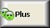
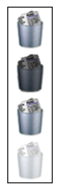
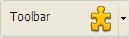

## Ruta de acceso fondo

Define la ruta de la imagen que se dibujará en el fondo del objeto. Si el objeto utiliza un [icono](#picture-pathname) con [diferentes estados](#number-of-states), la imagen de fondo soportará automáticamente el mismo número de estados.

El nombre de la ruta a introducir es similar al de [ la propiedad Ruta de acceso para las imágenes estáticas](properties_Picture.md#pathname).

#### Gramática JSON

| Nombre                  | Tipos de datos | Valores posibles                                                                                              |
| ----------------------- | -------------- | ------------------------------------------------------------------------------------------------------------- |
| customBackgroundPicture | string         | Ruta relativa en sintaxis POSIX. Debe utilizarse junto con la opción "Personalizado" de la propiedad "Style". |

#### Objetos soportados

[Botón personalizado](button_overview.md#custom) - [Casilla de selección personalizada](checkbox_overview.md#custom) - [Botón radio personalizado](radio_overview.md#custom)

---

## Estilos de botón

Aspecto general del botón. El estilo del botón también influye en la disponibilidad de ciertas opciones.

#### Gramática JSON

| Nombre | Tipos de datos | Valores posibles                                                                                                                                                   |
|:------:|:--------------:| ------------------------------------------------------------------------------------------------------------------------------------------------------------------ |
| style  |      text      | "regular", "flat", "toolbar", "bevel", "roundedBevel", "gradientBevel", "texturedBevel", "office", "help", "circular", "disclosure", "roundedDisclosure", "custom" |

#### Objetos soportados

[Botón](button_overview.md) - [Botón radio](radio_overview.md) - [Casilla de selección](checkbox_overview.md) - [Botón Radio](radio_overview.md)

---

## Margen horizontal

Esta propiedad permite definir el tamaño (en píxeles) de los márgenes horizontales del botón. Este margen delimita el área que el icono del botón y el título no deben sobrepasar.

Este parámetro es útil, por ejemplo, cuando la imagen de fondo contiene bordes:

| Con / Sin                | Ejemplo                                                      |
| ------------------------ | ------------------------------------------------------------ |
| Sin margen               |  |
| Con un margen 13 píxeles |  |
> Esta propiedad funciona junto con la propiedad [Margen vertical](#vertical-margin).

#### Gramática JSON

| Nombre        | Tipos de datos | Valores posibles                                   |
| ------------- | -------------- | -------------------------------------------------- |
| customBorderX | number         | Para usar con el estilo "personalizado". Mínimo: 0 |

#### Objetos soportados

[Botón personalizado](button_overview.md#custom) - [Casilla de selección personalizada](checkbox_overview.md#custom) - [Botón radio personalizado](radio_overview.md#custom)

---

## Ubicación del icono

Designa la ubicación de un icono en relación con el objeto formulario.

#### Gramática JSON

| Nombre        | Tipos de datos | Valores posibles        |
| ------------- | -------------- | ----------------------- |
| iconPlacement | string         | "none", "left", "right" |

#### Objetos soportados

[Encabezado de list box](listbox_overview.md#list-box-headers)

---

## Desplazamiento icono

Define un valor de desplazamiento personalizado en píxeles, que se utilizará cuando se haga clic en el botón

El título del botón se desplazará hacia la derecha y hacia la parte inferior por el número de píxeles introducidos. Esto permite aplicar un efecto 3D personalizado cuando se presiona el botón.

#### Gramática JSON

| Nombre       | Tipos de datos | Valores posibles |
| ------------ | -------------- | ---------------- |
| customOffset | number         | mínimo: 0        |

#### Objetos soportados

[Botón personalizado](button_overview.md#custom) - [Casilla de selección personalizada](checkbox_overview.md#custom) - [Botón radio personalizado](radio_overview.md#custom)

---

## Número de estados

Esta propiedad define el número exacto de estados presentes en la imagen utilizada como icono para un [botón con icono](button_overview.md), una [casilla de selección](checkbox_overview.md) o un [botón radio](radio_overview.md) personalizado. En general, el icono de un botón incluye cuatro estados: activo, presionado, sobre el ratón e inactivo.

Cada estado está representado por una imagen diferente. En la imagen fuente, los estados deben apilarse verticalmente:

Están representados los siguientes estados:

1. botón no presionado / casilla de selección no marcada (valor de la variable=0)
2. botón presionado / casilla de selección marcada (valor variable=1)
3. pasar por encima
4. disabled

#### Gramática JSON

| Nombre     | Tipos de datos | Valores posibles |
| ---------- | -------------- | ---------------- |
| iconFrames | number         | mínimo: 1        |

#### Objetos soportados

[Botón](button_overview.md) (todos los estilos excepto [Ayuda](button_overview.md#help)) - [Casilla de selección](checkbox_overview.md) - [Botón radio](radio_overview.md)

---

## Ruta de acceso de la imagen

Define la ruta de la imagen que se utilizará como icono del objeto.

El nombre de la ruta a introducir es similar al de [ la propiedad Ruta de acceso para las imágenes estáticas](properties_Picture.md#pathname).

> Cuando se utiliza como icono de objetos activos, la imagen debe estar diseñada para soportar un [número de estados](#number-of-states) variable.

#### Gramática JSON

| Nombre | Tipos de datos | Valores posibles                              |
| ------ | -------------- | --------------------------------------------- |
| icon   | picture        | Ruta relativa o filesystem en sintaxis POSIX. |

#### Objetos soportados

[Botón](button_overview.md) (todos los estilos excepto [Ayuda](button_overview.md#help)) - [Casilla de selección](checkbox_overview.md) - [Encabezado List Box](listbox_overview.md#list-box-headers) - [Botón radio](radio_overview.md)

---

## Posición título/imagen

Esta propiedad permite modificar la ubicación relativa del título del botón en relación con el icono asociado. Esta propiedad no tiene efecto cuando el botón sólo contiene un título (sin imagen asociada) o una imagen (sin título). Por defecto, cuando un botón contiene un título y una imagen, el texto se coloca debajo de la imagen.

Aquí están los resultados utilizando las distintas opciones para esta propiedad:

| Option        | Descripción                                                                                                                                       | Ejemplo                                                           |
| ------------- | ------------------------------------------------------------------------------------------------------------------------------------------------- | ----------------------------------------------------------------- |
| **Izquierda** | El texto se coloca a la izquierda del icono. El contenido del botón se alinea a la derecha.                                                       |   |
| **Arriba**    | El texto se coloca debajo del icono. El contenido del botón está centrado.                                                                        |       |
| **Derecha**   | El texto se coloca a la derecha del icono. El contenido del botón se alinea a la izquierda.                                                       |     |
| **Abajo**     | El texto se coloca sobre el icono. El contenido del botón está centrado.                                                                          |    |
| **Centrado**  | El texto del icono está centrado vertical y horizontalmente en el botón. Este parámetro es útil, por ejemplo, para el texto incluido en un icono. |  |

#### Gramática JSON

| Nombre        | Tipos de datos | Valores posibles                           |
| ------------- | -------------- | ------------------------------------------ |
| textPlacement | string         | "left", "top", "right", "bottom", "center" |

#### Objetos soportados

[Botón](button_overview.md) (todos los estilos excepto [Ayuda](button_overview.md#help)) - [Casilla de selección](checkbox_overview.md) - [Botón radio](radio_overview.md)

---

## Margen vertical

Esta propiedad permite definir el tamaño (en píxeles) de los márgenes verticales del botón. Este margen delimita el área que el icono del botón y el título no deben sobrepasar.

Este parámetro es útil, por ejemplo, cuando la imagen de fondo contiene bordes.

> Esta propiedad funciona junto con la propiedad [Margen horizontal](#horizontal-margin).

#### Gramática JSON

| Nombre        | Tipos de datos | Valores posibles                                   |
| ------------- | -------------- | -------------------------------------------------- |
| customBorderY | number         | Para usar con el estilo "personalizado". Mínimo: 0 |

#### Objetos soportados

[Botón personalizado](button_overview.md#custom) - [Casilla de selección personalizada](checkbox_overview.md#custom) - [Botón radio personalizado](radio_overview.md#custom)

---

## Con menú pop-up

Esta propiedad permite mostrar un símbolo que aparece como un triángulo en el botón para indicar la presencia de un menú emergente adjunto:

La apariencia y ubicación de este símbolo depende del estilo del botón y de la plataforma actual.

### Vinculados y separados

Para asociar un símbolo de menú emergente a un botón, hay dos opciones de visualización disponibles:

|                        Enlazado                         |                          Separado                          |
|:-------------------------------------------------------:|:----------------------------------------------------------:|
|  |  |
> La disponibilidad efectiva de un modo "separado" depende del estilo del botón y de la plataforma.

Cada opción precisa la relación entre el botón y el menú emergente asociado:

<li>Cuando el menú emergente está **separado**, al hacer clic en la parte izquierda del botón se ejecuta directamente la acción actual del botón; esta acción puede modificarse mediante el menú emergente accesible en la parte derecha del botón.</li>
<li>Cuando el menú emergente está **vinculado**, un simple clic en el botón sólo muestra el menú emergente. Sólo la selección de la acción en el menú emergente provoca su ejecución.</li>

### Gestión del menú emergente

Es importante señalar que la propiedad "Con menú emergente" sólo gestiona el aspecto gráfico del botón. La visualización del menú emergente y sus valores deben ser manejados enteramente por el desarrollador, particularmente utilizando `eventos formulario` y los comandos **[Menú emergente dinámico](https://doc.4d.com/4Dv18/4D/18/Dynamic-pop-up-menu.301-4505524.en.html)** y **[Menú emergente](https://doc.4d.com/4Dv17R5/4D/17-R5/Pop-up-menu.301-4127438.en.html)**.

#### Gramática JSON

| Nombre         | Tipos de datos | Valores posibles                                                            |
|:-------------- | -------------- | --------------------------------------------------------------------------- |
| popupPlacement | string         | <li>"none"</li><li>"linked"</li><li>"separated"</li> |

#### Objetos soportados

[Botón de la barra de herramientas](button_overview.md#toolbar) - [Botón Bisel](button_overview.md#bevel) - [Botón Bisel redondeado](button_overview.md#rounded-bevel) - [Botón Gradiente OS X](button_overview.md#os-x-gradient) - [Botón Texturizado OS X](button_overview.md#os-x-textured) - [Botón Office XP](button_overview.md#office-xp) - [Botón Círculo](button_overview.md#circle) - [Personalizado](button_overview.md#custom)
