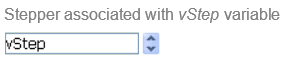

Un stepper permite al usuario desplazarse por valores numéricos, duraciones (tiempos) o fechas por pasos predefinidos haciendo clic en los botones de flecha.

## Uso del stepper

Puede asignar la variable asociada al objeto a un área introducible (campo o variable) para almacenar o modificar el valor actual del objeto.

Se puede asociar un stepper directamente a una variable numérica, hora o fecha.

* Para los valores de tipo hora, las propiedades Mínimo, Máximo y Paso representan segundos. Por ejemplo, para programar un paso de 8:00 a 18:00 con pasos de 10 minutos:
  * [minimum](properties_Scale.md#minium) = 28 800 (8\*60\*60)
  * [maximum](properties_Scale.md#maximum) = 64 800 (18\*60\*60)
  * [paso](properties_Scale.md#step) = 600 (10\*60)
* Para los valores de tipo fecha, el valor introducido en la propiedad [paso](properties_Scale.md#step) representa días. Las propiedades Mínimo y Máximo se ignoran.
> > For the stepper to work with a time or date variable, it is imperative to set its type in the form AND to declare it explicitly via the [C_TIME](https://doc.4d.com/4Dv17R5/4D/17-R5/C-TIME.301-4128557.en.html) or [C_DATE](https://doc.4d.com/4Dv17R5/4D/17-R5/C-DATE.301-4128570.en.html) command.

Para más información, consulte [Uso de indicadores](progressIndicator.md#using-indicatire) en la página "Indicadores de progreso".

## Propiedades soportadas

[Border Line Style](properties_BackgroundAndBorder.md#border-line-style) - [Bottom](properties_CoordinatesAndSizing.md#bottom) - [Class](properties_Object.md#css-class) - [Enterable](properties_Entry.md#enterable) - [Execute object method](properties_Action.md#execute-object-method) - [Expression Type](properties_Object.md#expression-type) (only "integer", "number", "date", or "time") - [Height](properties_CoordinatesAndSizing.md#height) - [Help Tip](properties_Help.md#help-tip) - [Horizontal Sizing](properties_ResizingOptions.md#horizontal-sizing) - [Left](properties_CoordinatesAndSizing.md#left) - [Maximum](properties_Scale.md#maximum) - [Minimum](properties_Scale.md#minimum) - [Object Name](properties_Object.md#object-name) - [Right](properties_CoordinatesAndSizing.md#right) - [Step](properties_Scale.md#step) - [Top](properties_CoordinatesAndSizing.md#top) - [Type](properties_Object.md#type) - [Variable or Expression](properties_Object.md#variable-or-expression) - [Vertical Sizing](properties_ResizingOptions.md#vertical-sizing) - [Visibility](properties_Display.md#visibility) - [Width](properties_CoordinatesAndSizing.md#width)

## Ver también

* [indicadores de progreso](progressIndicator.md)

* [reglas](ruler.md)
